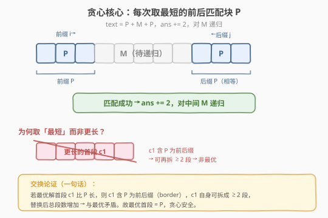
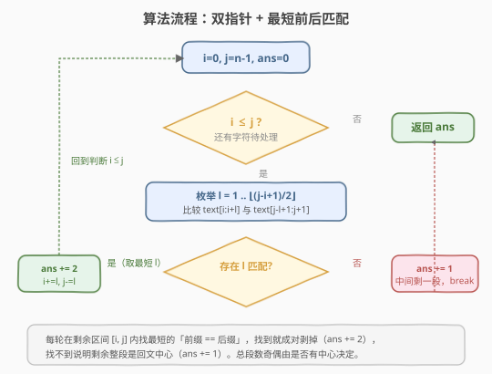
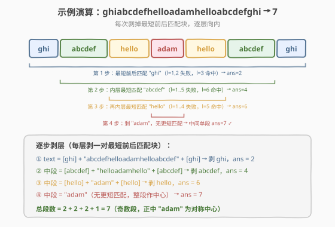

# LeetCode 段式回文 题解

## 1. 题目概述

- **标题 / 题号**：段式回文（#1147，hard）
- **链接**：https://leetcode.cn/problems/longest-chunked-palindrome-decomposition/
- **难度**：困难
- **标签**：贪心、递归、双指针、字符串

**题意**：给定一个字符串 `text`，把它分成 `k` 个非空子串 `(subtext1, subtext2, …, subtextk)`，要求：

- 每个子串非空；
- 所有子串按顺序拼接等于 `text`；
- 对所有 `1 <= i <= k`，满足 `subtexti == subtextk-i+1`（即**段序列本身构成回文**）。

返回 `k` 的**最大值**。

**示例 1**：

```text
输入：text = "ghiabcdefhelloadamhelloabcdefghi"
输出：7
解释：拆成 (ghi)(abcdef)(hello)(adam)(hello)(abcdef)(ghi)。
```

**示例 2**：

```text
输入：text = "merchant"
输出：1
解释：拆成 (merchant)。
```

**示例 3**：

```text
输入：text = "antaprezatepzapreanta"
输出：11
解释：拆成 (a)(nt)(a)(pre)(za)(tep)(za)(pre)(a)(nt)(a)。
```

**约束**：

- `1 <= text.length <= 1000`
- `text` 仅由小写英文字母组成

> 💡 这是**字符级回文的「块级」推广**：普通回文要求「字符对称」（`s[i] == s[n-1-i]`），段式回文要求「块对称」（整段字符串相等）。本题与 [5. 最长回文子串](../0001-0100/5_最长回文子串.md) 的中心扩展、[131. 分割回文串](../0101-0200/131_分割回文串.md) 的回文分割是同族问题，但目标不同——这里求**最多段数**，而贪心恰好最优。

## 2. 解题思路

### 2.1 暴力思路：枚举所有分割

把 `text` 的 `n-1` 个切点做子集枚举（共 $2^{n-1}$ 种切法），对每种切法检查「段序列是否回文」。时间 $O(2^n \cdot n)$，指数级超时。需要利用**回文对称**的结构剪枝。

### 2.2 核心观察：贪心取最短前后匹配块



**关键观察**：段序列回文意味着**第一段 == 最后一段**，即 `text` 的一个「前缀 == 后缀」匹配（字符串学中称为 **border**）。为了让段数最多，应当**让每一段尽可能短**，也就是每次匹配**最短的那个 border** `P`：

```text
text = P + M + P        # P 是最短的「前缀==后缀」
ans += 2                # 成对剥掉 P
对 M 递归                # 中段 M 继续同样的处理
```

若中段再也找不到更短的 border，则剩下的整段就是**回文中心**（单独成段），`ans += 1`。

> 💡 **为什么取「最短」最优？** 直觉：段数 = 成对剥掉的次数 × 2 + 中心。每对剥掉的字符越少，留给中段的字符越多，能继续剥的层数就越多。形式化的**交换论证**见 2.5。

### 2.3 算法流程图



**完整步骤**：

1. **初始化**：双指针 `i = 0`，`j = n-1`，`ans = 0`。
2. **循环**（`i <= j` 时）：
   - 枚举长度 `l = 1, 2, …, ⌊(j-i+1)/2⌋`，比较 `text[i : i+l]` 与 `text[j-l+1 : j+1]`。
   - **找到第一个相等**的 `l`：`ans += 2`，`i += l`，`j -= l`（成对剥掉最短匹配块），回到循环开头。
   - **枚举完都不相等**：剩余 `[i, j]` 整段作中心，`ans += 1`，`break`。
3. **返回** `ans`。

> ⚠️ **枚举上界**：`l` 只需到 `⌊(j-i+1)/2⌋`。因为前后两段加起来不能超过剩余长度，否则两段会重叠（不可能「成对」剥掉）。

### 2.4 示例演算

以 `text = "ghiabcdefhelloadamhelloabcdefghi"` 为例：



**逐层剥层过程**：

| 步骤 | 剩余中段 | 最短匹配 | 动作 | ans |
|------|----------|----------|------|-----|
| ① | `ghiabcdefhelloadamhelloabcdefghi` | `l=1,2` 失败，`l=3` 命中 `"ghi"` | 剥一对 `ghi` | 2 |
| ② | `abcdefhelloadamhelloabcdef` | `l=1..5` 失败，`l=6` 命中 `"abcdef"` | 剥一对 `abcdef` | 4 |
| ③ | `helloadamhello` | `l=1..4` 失败，`l=5` 命中 `"hello"` | 剥一对 `hello` | 6 |
| ④ | `adam` | `l=1` 失败（`a≠m`），`l=2` 失败（`ad≠am`），无更短匹配 | 整段作中心 | 7 |

最终 `ans = 2 + 2 + 2 + 1 = 7`，与示例一致。

> 💡 **奇偶性规律**：若某层剩余找不到任何 border，最后会剩一个「中心段」，总段数为**奇数**；若最后一对剥掉后中段为空，总段数为**偶数**。示例 1 剩 `"adam"` 作中心 → 奇数 7；示例 3 最后剩 `"tep"` 作中心 → 奇数 11。

### 2.5 贪心正确性证明（交换论证）

**定理**：上述贪心（每轮取最短 border `P`）得到最优解。

**证明**（对 $n = |\text{text}|$ 归纳）。设 `f(s)` 为 `s` 的最大段数，`P` 为 `s` 的最短 border（最短「前缀==后缀」）。

- **边界**：若 `s` 无 border（任意非空真前缀都不等于对应后缀），则任何分割的第一段都须等于最后一段，即第一段是 `s` 的 border，矛盾——故只能单段，`f(s) = 1 = 贪心`。

- **递归**：设 `s = P + M + P`，贪心 `g(s) = 2 + g(M)`，由归纳 `g(M) = f(M)`。需证 `f(s) ≤ 2 + f(M)`（即贪心不劣于最优）。

  任取 `s` 的最优分割 `(c1, c2, …, ck)`。`c1` 是 `s` 的一个 border（`c1 == ck`，前缀 == 后缀），故 `|c1| ≥ |P|`（`P` 是最短 border）。

  **关键引理**：最优分割中必有 `|c1| = |P|`（即 `c1 = P`）。反证：若 `|c1| > |P|`，则 `P` 是 `c1` 的前缀（`P` 是 `s` 前缀）；又 `ck = c1` 是 `s` 后缀、`P` 是 `s` 后缀，故 `P` 也是 `c1` 的后缀。即 `c1` 自身含 border `P`，可把 `c1` 单独再拆成 `≥ 2` 段（最短 border 长度 `≤ |c1|/2`）。把首尾两个 `c1` 都替换成其多段分解，**总段数至少增加 2**（`2 → ≥ 4`，中段不变），与「最优」矛盾。

  因此 `c1 = P`，中段 `c2…c_{k-1} = M`，于是 `f(M) ≥ k - 2`，即 $f(s) = k \leq 2 + f(M)$。结合 `g(s) = 2 + g(M) = 2 + f(M) ≥ f(s)`，又 `g(s) ≤ f(s)`（贪心产出一组合法分割），得 `g(s) = f(s)`。 □

> ⚠️ **引理的直觉**：首段若比最短 border 长，说明它「还能再切」——最优解不会放过这个增加段数的机会。这正是「取最短」安全的根本原因。

## 3. 参考代码

### C++

```cpp
// 段式回文.cpp —— 贪心：双指针 + 最短前后匹配
// 编译: g++ -O2 -std=c++17 段式回文.cpp -o lcpd
class Solution {
public:
    int longestDecomposition(string text) {
        int n = text.size();
        int i = 0, j = n - 1, ans = 0;
        while (i <= j) {
            bool found = false;
            int half = (j - i + 1) / 2;
            for (int l = 1; l <= half; ++l) {
                // 比较 text[i..i+l-1] 与 text[j-l+1..j]
                if (text.compare(i, l, text, j - l + 1, l) == 0) {
                    ans += 2;          // 成对剥掉最短匹配块
                    i += l;
                    j -= l;
                    found = true;
                    break;
                }
            }
            if (!found) {              // 剩余整段作中心
                ans += 1;
                break;
            }
        }
        return ans;
    }
};
```

### Python

```python
class Solution:
    def longestDecomposition(self, text: str) -> int:
        i, j, ans = 0, len(text) - 1, 0
        while i <= j:
            found = False
            for l in range(1, (j - i + 1) // 2 + 1):
                if text[i:i + l] == text[j - l + 1:j + 1]:   # 最短前后匹配
                    ans += 2                                  # 成对剥掉
                    i += l
                    j -= l
                    found = True
                    break
            if not found:                                     # 剩余整段作中心
                ans += 1
                break
        return ans
```

> 💡 **实现细节**：① `l` 从 1 起枚举，**命中即 `break`**——保证取「最短」。② 上界 `(j-i+1)//2` 防止前后两段重叠。③ 找不到匹配时整段作中心，`ans += 1` 后 `break`（不再循环）。④ C++ 用 `string::compare(pos, len, str, subpos, sublen)` 避免构造子串，比 `text.substr()` 更高效。

## 4. 复杂度分析

| 维度 | 复杂度 | 说明 |
|------|--------|------|
| **时间** | $O(n^2)$ | 最坏情况：最短 border 长度 $\approx n/2$，单轮比较代价 $\sum_{l=1}^{n/2} l = O(n^2)$；后续中段为空，总 $O(n^2)$。`n ≤ 1000` 时约 $10^6$，可接受 |
| **空间** | $O(1)$ | 双指针迭代，仅常数额外空间（不计切片临时拷贝）；递归版空间 $O(n)$（栈深最多 $n/2$） |

> ⚠️ **时间上界说明**：每轮「命中即停」使实际代价远低于最坏。例如全相同字符 `"aaaa…a"` 每轮 `l=1` 即命中，总 $O(n)$。真正最坏是 border 长度接近半长的输入（如两段完全相同且无更短 border），单轮就到 $O(n^2)$。

## 5. 扩展：递归写法与字符串哈希加速

### 5.1 递归写法（最短代码）

贪心的递归形式非常简洁，直接对应「剥一对、对中段递归」的思路：

```python
class Solution:
    def longestDecomposition(self, text: str) -> int:
        n = len(text)
        for l in range(1, n // 2 + 1):
            if text[:l] == text[n - l:]:                # 最短前后匹配
                return 2 + self.longestDecomposition(text[l:n - l])
        return 1                                        # 无 border，整段作中心
```

> 💡 **递归深度**：最坏 $n/2$（如 `"a" * 1000` 每轮剥一对 `"a"`，深度 500），低于 Python 默认递归上限 1000，安全。若担心可改迭代版。

### 5.2 字符串哈希加速到 $O(n \log n)$

朴素的子串比较是 $O(l)$。用**双哈希 + 二分最长公共前缀**可把单次比较降到 $O(\log n)$：

- 预处理前缀哈希 $h[i]$（双模数防碰撞），子串 `text[i..i+l-1]` 的哈希 $O(1)$ 算出。
- 比较 `text[i..]` 与反转后 `text[..j]` 的前缀时，二分找最长公共前缀 `L`：
  - `L ≥ half`：整段匹配，整段作中心。
  - 否则取 `l = L + 1` 处的字符判断是否相等，决定是否命中最短 border。

不过 `n ≤ 1000` 时 $O(n^2) = 10^6$ 已足够快，哈希优化仅在大数据规模（$n \ge 10^5$）才有必要，本题不推荐——增加复杂度却换不来可观测的收益。

## 6. 面试要点

1. **为什么贪心取「最短」border 是最优的？**

   > 交换论证：若最优解首段 `c1` 比最短 border `P` 长，则 `P` 既是 `c1` 的前缀（`P` 是 `s` 前缀）也是 `c1` 的后缀（`ck=c1` 是 `s` 后缀、`P` 是 `s` 后缀），故 `c1` 自身含 border 可再拆成 `≥2` 段，替换首尾两个 `c1` 后总段数增加，与最优矛盾。所以最优首段必为 `P`，贪心安全。

2. **「段式回文」和普通回文有什么联系与区别？**

   > 普通回文是字符级对称（`s[i] == s[n-1-i]`），段式回文是**块级对称**（整段字符串相等）。普通回文可看作段式回文「每段长度为 1」的特例。段式回文的段数 = 块级回文的「层数 × 2 + 中心」，目标最大化段数。

3. **什么时候段数为奇数，什么时候为偶数？**

   > 若最后一层剩余找不到任何 border，会剩一个「中心段」，段数为**奇数**；若最后一对 border 剥掉后中段为空，段数为**偶数**。等价地：`text` 的「递归 border 链」层数为偶数则段数偶，为奇数则段数奇。

4. **枚举 `l` 的上界为什么是 `(j-i+1)//2`？取到上界意味着什么？**

   > 前后两段加起来不能超过剩余长度，否则重叠。取到上界 `l = (j-i+1)//2` 意味着「整个剩余区间恰好是两段相等」（剩余长度为偶数且前后两半相等），此时剥掉后中段为空，段数贡献 2 后结束。

5. **递归版和迭代版的取舍？**

   > 逻辑完全等价。递归版代码更短、更贴近「剥层」的递归定义，适合面试白板演示思路；迭代版（双指针）无栈深风险、常数更小，适合工程落地。`n ≤ 1000` 时两者性能差异可忽略。

> 💡 **一句话总结**：1147 是「块级回文」的贪心招牌题——每轮取最短 border 成对剥掉，找不到则剩段作中心。正确性靠交换论证（最优首段必为最短 border，否则可再拆增加段数）。$O(n^2)$ 时间、$O(1)$ 空间，递归版仅一行核心逻辑。与 [5. 最长回文子串](../0001-0100/5_最长回文子串.md) 的字符级回文、[131. 分割回文串](../0101-0200/131_分割回文串.md) 的回文分割同族，但目标是「最多段」而非「最长回文」或「最少切割」。

## 同类练习题

| # | 题目 | 与本题的关联 |
|---|------|-------------|
| 5 | [最长回文子串](https://leetcode.cn/problems/longest-palindromic-substring/)（[题解](../0001-0100/5_最长回文子串.md)） | 字符级回文（每段长度 1 的段式回文特例），中心扩展求最长回文子串 |
| 131 | [分割回文串](https://leetcode.cn/problems/palindrome-partitioning/)（[题解](../0101-0200/131_分割回文串.md)） | 要求**每段本身是回文**（段内对称），对比本题要求**段间对称**（段序列回文） |
| 132 | [分割回文串 II](https://leetcode.cn/problems/palindrome-partitioning-ii/)（[题解](../0101-0200/132_分割回文串II.md)） | 求**最少**回文切割数，对比本题求**最多**段数——方向相反 |
| 769 | [最多能完成排序的块](https://leetcode.cn/problems/max-chunks-to-make-sorted/)（[题解](../0701-0800/769_最多能完成排序的块.md)） | 同为「分块求最值」，但分块依据是排序前缀最大值，对比本题的回文对称 |
| 214 | [最短回文串](https://leetcode.cn/problems/shortest-palindrome/) | 同样依赖「最短 border」（前缀==后缀），用 KMP next 数组求最长相等前后缀，与本题「最短 border」方向互补 |
