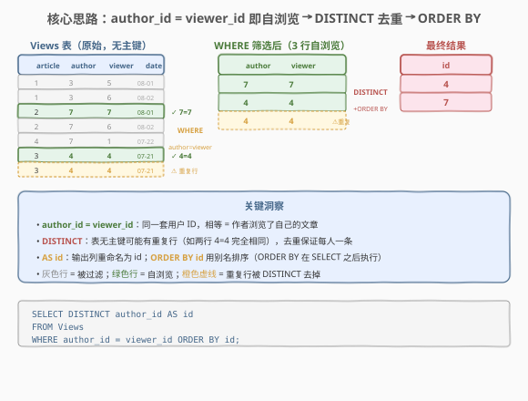
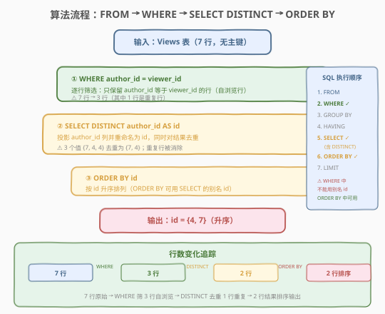
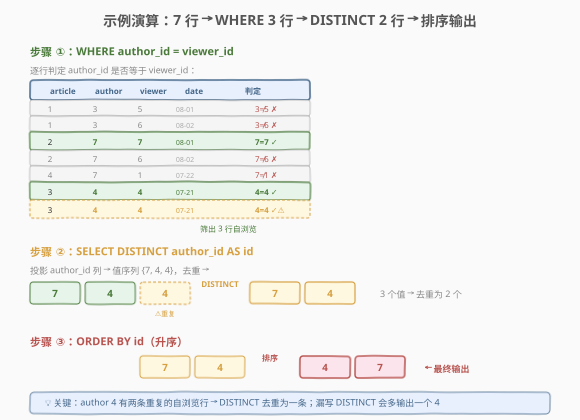

# LeetCode 文章浏览 I 题解

## 1. 题目概述

- **标题 / 题号**：文章浏览 I（#1148，easy）
- **链接**：https://leetcode.cn/problems/article-views-i/
- **难度**：简单
- **标签**：SQL、WHERE 过滤、DISTINCT、去重、ORDER BY、列别名

**题意**：给定 `Views` 表，每行记录某人在某天浏览了某位作者的某篇文章。编写 SQL 查询，找出**所有浏览过自己文章的作者**（即 `author_id = viewer_id`）。结果按作者 `id` 升序排列，且不包含重复。

**表结构**：

```text
Table: Views
+---------------+---------+
| Column Name   | Type    |
+---------------+---------+
| article_id    | int     |
| author_id     | int     |  ← 文章作者
| viewer_id     | int     |  ← 浏览者
| view_date     | date    |
+---------------+---------+
```

> ⚠️ 该表**无主键**，可能存在重复行。`author_id` 和 `viewer_id` 是同一套用户 ID 体系——同一人的 `author_id` 和 `viewer_id` 值相同。因此「作者浏览自己的文章」等价于 `author_id = viewer_id`。

**示例 1**：

```text
输入：
Views 表:
+------------+-----------+-----------+------------+
| article_id | author_id | viewer_id | view_date  |
+------------+-----------+-----------+------------+
| 1          | 3         | 5         | 2019-08-01 |
| 1          | 3         | 6         | 2019-08-02 |
| 2          | 7         | 7         | 2019-08-01 |
| 2          | 7         | 6         | 2019-08-02 |
| 4          | 7         | 1         | 2019-07-22 |
| 3          | 4         | 4         | 2019-07-21 |
| 3          | 4         | 4         | 2019-07-21 |
+------------+-----------+-----------+------------+

输出：
+------+
| id   |
+------+
| 4    |
| 7    |
+------+
```

**解释**：

| 行 | author_id | viewer_id | 是否自浏览？ | 说明 |
|----|-----------|-----------|-------------|------|
| 1 | 3 | 5 | ✗ | 作者 3 的文章被 viewer 5 浏览 |
| 2 | 3 | 6 | ✗ | 作者 3 的文章被 viewer 6 浏览 |
| 3 | 7 | 7 | ✓ | **作者 7 浏览了自己的文章** |
| 4 | 7 | 6 | ✗ | 作者 7 的文章被 viewer 6 浏览 |
| 5 | 7 | 1 | ✗ | 作者 7 的文章被 viewer 1 浏览 |
| 6 | 4 | 4 | ✓ | **作者 4 浏览了自己的文章** |
| 7 | 4 | 4 | ✓ | 与第 6 行**完全重复**，DISTINCT 去重 |

- 作者 7 在第 3 行浏览了自己的文章（article 2）→ 输出 `id = 7`
- 作者 4 在第 6、7 行浏览了自己的文章（article 3），但两行完全重复 → `DISTINCT` 去重为一条 → 输出 `id = 4`
- 作者 3 的文章只被别人浏览（5、6），从未自浏览 → 不输出

**约束**：

- `Views` 表无主键，可能存在重复行
- `author_id` 和 `viewer_id` 属于同一用户 ID 体系
- 结果不含重复，按 `id` 升序排列
- 输出列名为 `id`

> 💡 本题是 SQL **"条件过滤 + 去重"入门模板**——核心就一句 `WHERE author_id = viewer_id`。考点不在查询难度，而在三个细节：① 理解「同一套用户 ID」意味着自浏览 = 两列相等；② 表无主键可能有重复行，需 `DISTINCT`；③ 输出列要重命名为 `id`。这三点覆盖了 SQL 查询最基础的三要素：**筛选（WHERE）、去重（DISTINCT）、投影（SELECT 别名）**。

## 2. 解题思路

### 2.1 暴力思路：逐行扫描

最直觉的过程式思路是：遍历 `Views` 表的每一行，检查该行的 `author_id` 是否等于 `viewer_id`，若相等则把 `author_id` 加入结果集合；最后对结果集合去重并排序。伪代码如下：

```text
result = empty set
for each row in Views:
    if row.author_id == row.viewer_id:
        result.add(row.author_id)
return sorted(result)
```

但**纯 SQL 没有显式逐行循环**——需要换成集合式表达。上述「逐行判定 + 集合去重 + 排序」的模式，对应 SQL 的 `WHERE` + `DISTINCT` + `ORDER BY` 三件套。

> ⚠️ 过程式思维里「逐行判定」在 SQL 中表达为 `WHERE author_id = viewer_id`，这是行级过滤；「集合去重」表达为 `DISTINCT`，这是结果级去重。两者不在同一层——`WHERE` 先逐行筛选，`DISTINCT` 再对筛选后的行集合去重。

### 2.2 核心观察：author_id = viewer_id 即自浏览



**问题本质**：题目要找「浏览过自己文章的作者」。关键洞察是 `author_id`（文章作者）和 `viewer_id`（浏览者）使用**同一套用户 ID**——当某行的 `author_id = viewer_id` 时，意味着「写这篇文章的人亲自浏览了它」，即自浏览。

$$\text{自浏览行} = \{ r \in \text{Views} \mid r.\text{author\_id} = r.\text{viewer\_id} \}$$

筛选出这些行后，取 `author_id` 列即为「浏览过自己文章的作者」。但表无主键可能有重复行（如示例中作者 4 的两条完全相同的记录），所以需要 `DISTINCT` 去重。

> 💡 **为什么用 `DISTINCT` 而非 `GROUP BY`？** 两者都能去重，但语义不同：`DISTINCT` 是「对整个结果行去重」，`GROUP BY` 是「按某列分组」。本题只需返回去重后的 `author_id` 列，`DISTINCT` 更直接——`SELECT DISTINCT author_id` 一目了然。若用 `GROUP BY author_id`，虽然结果相同，但语义是「按作者分组」（通常配合聚合函数如 `COUNT` 使用），单纯去重时略显刻意。面试中答："去重用 `DISTINCT` 最自然；`GROUP BY` 适合需要聚合统计的场景。"

### 2.3 算法流程图



**逻辑执行步骤**：

| 步骤 | 子句 | 作用 |
|------|------|------|
| ① | `FROM Views` | 读取全部浏览记录 |
| ② | `WHERE author_id = viewer_id` | 逐行筛选：只保留自浏览行 |
| ③ | `SELECT DISTINCT author_id AS id` | 投影 `author_id` 列并重命名为 `id`，同时对结果去重 |
| ④ | `ORDER BY id` | 按 `id` 升序排列输出 |

> 💡 **SQL 子句执行顺序**：`FROM` → `WHERE` → `GROUP BY` → `HAVING` → `SELECT`（含 `DISTINCT`）→ `ORDER BY` → `LIMIT`。注意 `DISTINCT` 是 `SELECT` 阶段的一部分——先投影出 `author_id` 列，再对该列去重。`ORDER BY id` 中的 `id` 是 `SELECT` 阶段定义的别名，在 `ORDER BY` 中可用（但 `WHERE` 中不可用别名）。

### 2.4 示例演算

以示例 1 数据为例，观察 `WHERE` + `DISTINCT` + `ORDER BY` 的逐步执行过程：



**步骤 ①：`WHERE author_id = viewer_id`**

从 7 行中筛出 `author_id = viewer_id` 的行（共 3 行，其中 2 行重复）：

| article_id | author_id | viewer_id | view_date  | 说明 |
|------------|-----------|-----------|------------|------|
| 2          | 7         | 7         | 2019-08-01 | 7 = 7 ✓ |
| 3          | 4         | 4         | 2019-07-21 | 4 = 4 ✓ |
| 3          | 4         | 4         | 2019-07-21 | 4 = 4 ✓（与上一行完全重复） |

**步骤 ②：`SELECT DISTINCT author_id AS id`**

投影 `author_id` 列并去重 → 3 个值 `{7, 4, 4}` 去重为 `{7, 4}`：

| id |
|----|
| 7  |
| 4  |

> 💡 **注意重复行**：作者 4 有两条完全相同的记录（article 3, author 4, viewer 4, date 2019-07-21），`WHERE` 筛出两行，但 `DISTINCT` 去重为一行。这正是「表无主键可能有重复行」的现实体现——若漏写 `DISTINCT`，输出会多出一行 `id = 4`，违反题目「不包含重复」的要求。

**步骤 ③：`ORDER BY id`**

按 `id` 升序排列 → `{7, 4}` → `{4, 7}`：

| id |
|----|
| 4  |
| 7  |

最终输出与示例一致。

## 3. 参考代码

### SQL（解法 A：WHERE + DISTINCT，推荐）

```sql
SELECT DISTINCT author_id AS id
FROM Views
WHERE author_id = viewer_id
ORDER BY id;
```

> 💡 **写法要点**：
> - `WHERE author_id = viewer_id`：逐行筛选自浏览行——两列同属一套用户 ID，相等即作者浏览了自己的文章。
> - `DISTINCT`：表无主键可能有重复行，去重保证每个作者只输出一次。
> - `author_id AS id`：按题目要求将输出列重命名为 `id`。
> - `ORDER BY id`：按 `id` 升序输出（`ORDER BY` 中可用 `SELECT` 的别名）。
> - ✓ **最简洁**：一行 `WHERE` + 一个 `DISTINCT`，语义清晰，无多余嵌套。

### SQL（解法 B：GROUP BY 去重）

```sql
SELECT author_id AS id
FROM Views
WHERE author_id = viewer_id
GROUP BY author_id
ORDER BY id;
```

> 💡 **与解法 A 的区别**：用 `GROUP BY author_id` 代替 `DISTINCT` 去重。`GROUP BY` 把相同 `author_id` 的行合并为一行，效果等同去重。语义上 `GROUP BY` 更偏向「按作者分组」（通常配合 `COUNT` 等聚合函数），单纯去重时 `DISTINCT` 更自然。但若后续需求扩展为「统计每位作者自浏览次数」，`GROUP BY + COUNT(*)` 可直接演进：

```sql
SELECT author_id AS id, COUNT(*) AS self_view_count
FROM Views
WHERE author_id = viewer_id
GROUP BY author_id
ORDER BY id;
```

### SQL（解法 C：子查询 DISTINCT）

```sql
SELECT DISTINCT id
FROM (
    SELECT author_id AS id
    FROM Views
    WHERE author_id = viewer_id
) t
ORDER BY id;
```

> 💡 **写法要点**：把 `WHERE` 过滤放在子查询 `t` 中，外层再做 `DISTINCT`。两层分离了「筛选」和「去重」的逻辑，可读性略差，但适用于筛选逻辑复杂、需先物化中间结果的场景。本题简单，无需此写法。

### Python（pandas）

```python
import pandas as pd

def article_views(views: pd.DataFrame) -> pd.DataFrame:
    self_views = views[views['author_id'] == views['viewer_id']]
    result = self_views[['author_id']].drop_duplicates()
    result = result.rename(columns={'author_id': 'id'})
    return result.sort_values('id').reset_index(drop=True)
```

> 💡 **pandas 对照**：`views['author_id'] == views['viewer_id']` 布尔掩码对应 SQL 的 `WHERE author_id = viewer_id`；`drop_duplicates()` 对应 `DISTINCT`；`rename(columns={'author_id': 'id'})` 对应 `AS id`；`sort_values('id')` 对应 `ORDER BY id`。注意 `drop_duplicates()` 默认对所有列去重，这里先 `[['author_id']]` 投影为单列再去重，确保只按 `author_id` 去重。

## 4. 复杂度分析

| 维度 | 复杂度 | 说明 |
|------|--------|------|
| **时间** | $O(n \log n)$ | `WHERE` 逐行扫描 $O(n)$；`DISTINCT` 去重需排序或哈希，$O(n \log n)$（排序）或 $O(n)$（哈希）；`ORDER BY` 排序 $O(k \log k)$，$k$ = 去重后作者数 |
| **空间** | $O(k)$ | `DISTINCT` 去重需存储中间结果，$k$ = 不同 `author_id` 数（$k \le n$） |
| **结果行数** | $O(k)$ | $k$ = 自浏览的不同作者数 |

> ⚠️ SQL 复杂度取决于**执行计划与索引**：`WHERE author_id = viewer_id` 是逐行判定，$O(n)$ 全表扫描（无索引时）。`DISTINCT` 去重策略因数据库而异——MySQL 优先用内存临时表 + 哈希去重 $O(n)$，数据量大时退化为排序 $O(n \log n)$。`ORDER BY id` 可利用 `DISTINCT` 阶段已排序的结果（若数据库合并了去重与排序步骤）。面试中说明「全表扫描 $O(n)$ + 去重 $O(n \log n)$」即可。

## 5. 扩展：DISTINCT vs GROUP BY 去重对比

### 5.1 两种去重方式的本质

| 维度 | `DISTINCT` | `GROUP BY` |
|------|-----------|------------|
| **语义** | 对整个结果行去重 | 按指定列分组（合并同组行） |
| **聚合** | ❌ 不支持聚合函数 | ✓ 支持 `COUNT`/`SUM`/`MIN`/`MAX` |
| **去重粒度** | 所有 `SELECT` 列组合去重 | 按 `GROUP BY` 列去重 |
| **本题效果** | `SELECT DISTINCT author_id` → 去重 | `GROUP BY author_id` → 去重 |
| **可读性** | 去重意图更直观 | 分组意图更直观 |

> 💡 **选择口诀**：**纯去重用 `DISTINCT`，需聚合用 `GROUP BY`**。本题只需去重返回 `author_id`，`DISTINCT` 最自然。若题目改为「统计每位作者自浏览次数」，则必须用 `GROUP BY author_id + COUNT(*)`——`DISTINCT` 无法配合聚合函数。

### 5.2 从 1148 到进阶变体

| 变体 | 需求 | SQL 演进 |
|------|------|---------|
| **1148 原题** | 找出浏览过自己文章的作者 | `WHERE author_id = viewer_id` + `DISTINCT` |
| 统计每位作者自浏览次数 | 加 `COUNT(*)` | `GROUP BY author_id` + `COUNT(*) AS cnt` |
| 找从未浏览过自己文章的作者 | 反向筛选 | `WHERE author_id NOT IN (SELECT author_id FROM Views WHERE author_id = viewer_id)` |
| 找自浏览次数最多的作者 | Top-1 取最值 | `GROUP BY author_id` + `ORDER BY COUNT(*) DESC LIMIT 1` |

> 💡 这些变体共享「`author_id = viewer_id` 检测自浏览」的核心，差异在聚合与排序需求。理解 `DISTINCT` 与 `GROUP BY` 的边界，能灵活应对从「纯去重」到「分组统计」的演进。

## 6. 面试要点

1. **为什么 `author_id = viewer_id` 能检测自浏览？**

   - 题目说明 `author_id`（文章作者）和 `viewer_id`（浏览者）使用**同一套用户 ID 体系**——同一人的两个 ID 值相同。因此当某行的 `author_id = viewer_id` 时，意味着「写这篇文章的人亲自浏览了它」，即自浏览。这是本题最核心的语义转换。

2. **为什么需要 `DISTINCT`？漏写会怎样？**

   - `Views` 表**无主键**，可能存在完全相同的重复行（如示例中作者 4 的两条 `(3, 4, 4, 2019-07-21)` 记录）。`WHERE` 筛选后这些重复行都会保留，若不 `DISTINCT`，输出会包含多个相同的 `author_id`，违反题目「不包含重复」的要求。`DISTINCT` 确保每个作者只输出一次。

3. **`DISTINCT` 和 `GROUP BY` 去重有什么区别？**

   - `DISTINCT` 是「对整个 `SELECT` 结果行去重」，语义聚焦于去重本身；`GROUP BY` 是「按指定列分组」，语义聚焦于分组（通常配合聚合函数）。纯去重场景两者结果相同，但 `DISTINCT` 更自然。若需聚合统计（如 `COUNT`），必须用 `GROUP BY`——`DISTINCT` 不支持聚合函数。

4. **`ORDER BY id` 中的 `id` 是什么？为什么 `WHERE` 中不能用这个别名？**

   - `id` 是 `SELECT` 阶段定义的列别名（`author_id AS id`）。SQL 子句执行顺序为 `FROM → WHERE → GROUP BY → HAVING → SELECT → ORDER BY`，`ORDER BY` 在 `SELECT` 之后执行，因此可用别名。但 `WHERE` 在 `SELECT` 之前执行，别名尚未定义，所以 `WHERE` 中不能写 `id`，只能用原始列名 `author_id`。

5. **表无主键意味着什么？对查询有什么影响？**

   - 无主键意味着表**不保证行唯一**，可能存在完全相同的重复行。这影响了两个层面：① 查询结果可能含重复，需 `DISTINCT` 或 `GROUP BY` 去重；② 数据完整性无保障——业务上同一条浏览记录可能被误插入多次。实际工程中应尽量为表定义主键或唯一约束，避免重复数据污染。

> 💡 **一句话总结**：1148 是 SQL **"条件过滤 + 去重"入门招牌题**——核心就一句 `SELECT DISTINCT author_id AS id FROM Views WHERE author_id = viewer_id ORDER BY id`。考点覆盖 SQL 三要素：**筛选（WHERE 行级过滤）、去重（DISTINCT 结果级去重）、投影（SELECT 别名）**。理解「同一套用户 ID → 自浏览 = 两列相等」「无主键 → 需 DISTINCT」「别名在 ORDER BY 可用、WHERE 不可用」这三点，所有基础 SQL 过滤去重题都能覆盖。

## 同类练习题

| # | 题目 | 与本题的关联 |
|---|------|-------------|
| 175 | [组合两个表](https://leetcode.cn/problems/combine-two-tables/) | SQL 基础入门——`LEFT JOIN` 多表关联 + `SELECT` 投影，与 1148 共享「SELECT 投影 + WHERE 过滤」的基础骨架 |
| 584 | [寻找用户推荐人](https://leetcode.cn/problems/find-customer-referee/) | `WHERE` 条件过滤招牌题——`!= 2` 与 `IS NULL` 的三值逻辑陷阱，对比 1148 的简单等值过滤 |
| 595 | [大的国家](https://leetcode.cn/problems/big-countries/) | `WHERE` 多条件过滤 + `SELECT` 列别名——与 1148 同为「WHERE + 投影」基础题，增加多条件 `OR`/`AND` |
| 1141 | [查询近 30 天活跃用户数](https://leetcode.cn/problems/user-activity-for-the-past-30-days-i/) | `WHERE` 日期过滤 + `GROUP BY` + `COUNT(DISTINCT user_id)`——对比 1148 理解「DISTINCT 单纯去重」与「COUNT(DISTINCT) 聚合去重计数」的差异 |
| 1142 | [过去 30 天的用户活动 II](https://leetcode.cn/problems/user-activity-for-the-past-30-days-ii/) | `WHERE` 过滤 + `COUNT` 聚合 + `IFNULL` 处理空结果——在 1148 基础上叠加聚合与空值处理 |
