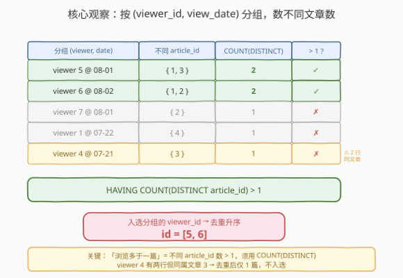
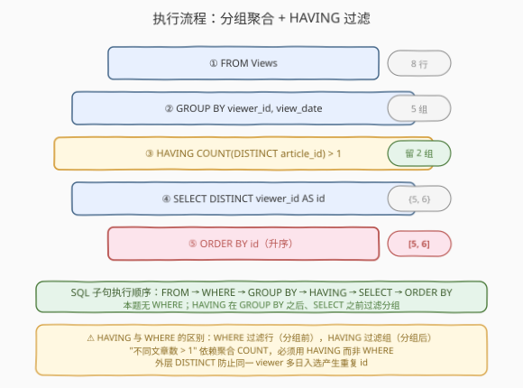
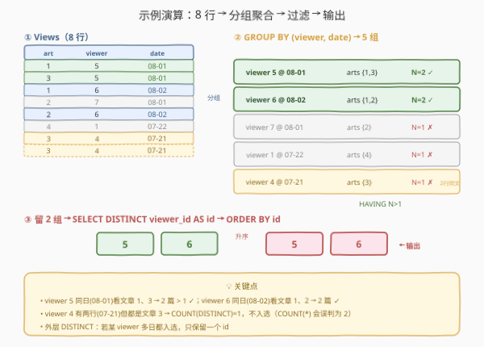

# 文章浏览 II

- **题目名称**：文章浏览 II
- **链接**：[1149. 文章浏览 II](https://leetcode.cn/problems/article-views-ii/)
- **难度**：中等
- **标签**：SQL、GROUP BY、HAVING、COUNT(DISTINCT)、聚合去重、ORDER BY

## 1. 题目概述

给定 `Views` 表，每行记录某人在某天浏览了某篇文章。编写 SQL 查询，找出**在同一天浏览了不止一篇文章的人**（即同一 `viewer_id` 在同一 `view_date` 下浏览的**不同** `article_id` 数量 $> 1$）。结果按 `id` 升序排列，且不包含重复。

**表结构**：

```text
Table: Views
+---------------+---------+
| Column Name   | Type    |
+---------------+---------+
| article_id    | int     |  ← 被浏览的文章
| author_id     | int     |  ← 文章作者（本题不参与判定）
| viewer_id     | int     |  ← 浏览者
| view_date     | date    |  ← 浏览日期
+---------------+---------+
```

> ⚠️ 该表**无主键**，可能存在完全相同的重复行。`author_id` 与 `viewer_id` 同属一套用户 ID 体系（同一个人的两个 ID 值相同），但本题只关心「谁（viewer）在哪天（date）看了哪几篇文章（article）」，`author_id` 不参与判定。

**示例 1**：

```text
输入：
Views 表:
+------------+-----------+-----------+------------+
| article_id | author_id | viewer_id | view_date  |
+------------+-----------+-----------+------------+
| 1          | 3         | 5         | 2019-08-01 |
| 3          | 4         | 5         | 2019-08-01 |
| 1          | 3         | 6         | 2019-08-02 |
| 2          | 7         | 7         | 2019-08-01 |
| 2          | 7         | 6         | 2019-08-02 |
| 4          | 7         | 1         | 2019-07-22 |
| 3          | 4         | 4         | 2019-07-21 |
| 3          | 4         | 4         | 2019-07-21 |
+------------+-----------+-----------+------------+

输出：
+------+
| id   |
+------+
| 5    |
| 6    |
+------+
```

**解释**：

| 分组 (viewer, date) | 不同 article_id | 数量 | 是否 $> 1$？ | 说明 |
|---------------------|-----------------|------|--------------|------|
| viewer 5 @ 08-01 | {1, 3} | 2 | ✓ | 同日看了文章 1 和 3 → 入选 |
| viewer 6 @ 08-02 | {1, 2} | 2 | ✓ | 同日看了文章 1 和 2 → 入选 |
| viewer 7 @ 08-01 | {2} | 1 | ✗ | 同日只看 1 篇 |
| viewer 1 @ 07-22 | {4} | 1 | ✗ | 同日只看 1 篇 |
| viewer 4 @ 07-21 | {3} | 1 | ✗ | 两行记录但**同属文章 3**，去重后仍 1 篇 |

- viewer 5 与 viewer 6 各自在同一天看了 2 篇不同文章 → 输出 `id = 5, 6`。
- viewer 4 虽有两条 07-21 的记录，但都是文章 3（重复行），**不同文章数仍为 1**，不入选。

**约束条件**：

- `Views` 表无主键，可能存在重复行
- 结果不含重复，按 `id` 升序排列
- 输出列名为 `id`（即 `viewer_id`）

> 💡 本题是 [1148. 文章浏览 I](./1148_文章浏览I.md) 的进阶版：1148 考「行级过滤 `WHERE` + `DISTINCT`」，本题考「**分组聚合 `GROUP BY` + `HAVING` + `COUNT(DISTINCT)`**」。从「筛选行」升级到「筛选组」，是 SQL 聚合查询的入门招牌题。两个易错点：①「不止一篇文章」指**不同** `article_id` 数 $> 1$，须用 `COUNT(DISTINCT article_id)`，否则重复行会让 `COUNT(*)` 虚高；② 同一 `viewer` 可能在多天都入选，外层仍需 `DISTINCT` 去重。

---

## 2. 解题思路

### 2.1 暴力思路：按人按天人工数

最直觉的过程式思路：把所有行按 `(viewer_id, view_date)` 装进桶，每个桶内收集不同的 `article_id`，若桶内不同文章数 $> 1$ 则把 `viewer_id` 加入结果集合，最后去重排序。

```text
buckets = defaultdict(set)
for row in Views:
    buckets[(row.viewer_id, row.view_date)].add(row.article_id)
result = set()
for (viewer, date), arts in buckets.items():
    if len(arts) > 1:
        result.add(viewer)
return sorted(result)
```

但**SQL 没有显式循环与字典**——「按键分桶 + 桶内聚合 + 桶级过滤」对应 SQL 的 `GROUP BY` + 聚合函数 + `HAVING` 三件套。

> ⚠️ 过程式思维里「桶内收集不同文章数」在 SQL 中表达为 `COUNT(DISTINCT article_id)`；「桶级过滤（数量 > 1）」表达为 `HAVING`——注意是 `HAVING` 而非 `WHERE`，因为过滤条件依赖聚合结果，而 `WHERE` 在分组前执行、看不到聚合值。

### 2.2 核心观察：GROUP BY (viewer_id, view_date) + HAVING COUNT(DISTINCT) > 1

**问题本质**：「同一天浏览不止一篇文章」= 以 `(viewer_id, view_date)` 为键分组后，组内**不同** `article_id` 的数量 $> 1$。

$$\text{入选 viewer} = \{ v \mid \exists\, d,\; |\{\text{article\_id} : (\cdot,\cdot,v,d) \in \text{Views}\}| > 1 \}$$

分三步用 SQL 表达：

1. **`GROUP BY viewer_id, view_date`**：按「人 + 天」分桶，每个桶是该人当天的所有浏览行。
2. **`COUNT(DISTINCT article_id)`**：桶内不同文章数（`DISTINCT` 抵消重复行的影响）。
3. **`HAVING ... > 1`**：只保留「不同文章数 > 1」的桶。



> 💡 **为什么用 `COUNT(DISTINCT article_id)` 而非 `COUNT(*)`？** 表无主键可能有重复行。示例中 viewer 4 在 07-21 有两行记录，但都是文章 3——`COUNT(*)` 得 2（误判为「看了 2 篇」），`COUNT(DISTINCT article_id)` 得 1（正确反映「只看了 1 篇不同文章」）。题目问的是「不止一篇文章」，语义是**不同文章**数，必须用 `DISTINCT`。

### 2.3 算法流程图



**逻辑执行步骤**：

| 步骤 | 子句 | 作用 |
|------|------|------|
| ① | `FROM Views` | 读取全部浏览记录（8 行） |
| ② | `GROUP BY viewer_id, view_date` | 按「人 + 天」分桶（5 组） |
| ③ | `HAVING COUNT(DISTINCT article_id) > 1` | 过滤组：只留不同文章数 > 1 的组（2 组） |
| ④ | `SELECT DISTINCT viewer_id AS id` | 投影 `viewer_id` 并重命名 `id`，对外层去重 |
| ⑤ | `ORDER BY id` | 按 `id` 升序输出 |

> ⚠️ **`HAVING` 与 `WHERE` 的区别**：`WHERE` 在 `GROUP BY` **之前**执行，过滤的是**行**，条件里不能出现聚合函数；`HAVING` 在 `GROUP BY` **之后**执行，过滤的是**组**，条件里可以出现聚合函数（如 `COUNT`）。本题条件「不同文章数 > 1」依赖 `COUNT(DISTINCT ...)`，必须用 `HAVING`。SQL 子句执行顺序：`FROM → WHERE → GROUP BY → HAVING → SELECT → ORDER BY`。

### 2.4 示例演算

以示例 1 数据追踪 8 行如何分组、过滤、输出：



**步骤 ①②：`GROUP BY viewer_id, view_date` 得 5 组**

| 组 | 成员行 | 不同 article_id | 数量 |
|----|--------|-----------------|------|
| viewer 5 @ 08-01 | 行1(art1), 行2(art3) | {1, 3} | 2 |
| viewer 6 @ 08-02 | 行3(art1), 行5(art2) | {1, 2} | 2 |
| viewer 7 @ 08-01 | 行4(art2) | {2} | 1 |
| viewer 1 @ 07-22 | 行6(art4) | {4} | 1 |
| viewer 4 @ 07-21 | 行7(art3), 行8(art3) | {3} | 1 |

> 💡 注意 viewer 4 的组：行7、行8 完全相同（都是 art3），`COUNT(DISTINCT article_id)` 把重复的文章 3 只算一次 → 数量 1。这正是 `DISTINCT` 抵消重复行的关键作用。

**步骤 ③：`HAVING COUNT(DISTINCT article_id) > 1`**

只留数量 $> 1$ 的组 → viewer 5 @ 08-01、viewer 6 @ 08-02 两组。

**步骤 ④⑤：`SELECT DISTINCT viewer_id AS id` + `ORDER BY id`**

投影出 `viewer_id` → {5, 6}，外层 `DISTINCT` 去重（本题无重复），`ORDER BY` 升序 → `[5, 6]`，与示例一致。

---

## 3. 参考代码

### SQL（解法 A：GROUP BY + HAVING COUNT(DISTINCT)，推荐）

```sql
SELECT DISTINCT viewer_id AS id
FROM Views
GROUP BY viewer_id, view_date
HAVING COUNT(DISTINCT article_id) > 1
ORDER BY id;
```

> 💡 **写法要点**：
> - `GROUP BY viewer_id, view_date`：按「人 + 天」分桶——这是「同一天」语义的体现，少了 `view_date` 就变成「总共看 >1 篇」而非「同一天看 >1 篇」。
> - `COUNT(DISTINCT article_id)`：组内**不同**文章数。`DISTINCT` 抵消重复行，确保「同篇文章被记录两次」不会虚高计数。
> - `HAVING ... > 1`：组级过滤，条件含聚合函数，须用 `HAVING` 而非 `WHERE`。
> - 外层 `DISTINCT viewer_id`：同一 `viewer` 可能在多天都入选，会产生多行同 `viewer_id`，需去重。
> - `AS id` + `ORDER BY id`：按题目要求重命名并升序输出。
> - ✓ **最简洁**：一句 `GROUP BY` + 一个 `HAVING`，语义清晰。

### SQL（解法 B：子查询先算计数再过滤）

```sql
SELECT DISTINCT viewer_id AS id
FROM (
    SELECT viewer_id, view_date
    FROM Views
    GROUP BY viewer_id, view_date
    HAVING COUNT(DISTINCT article_id) > 1
) t
ORDER BY id;
```

> 💡 把「分组 + HAVING」放进子查询 `t`，外层只做 `DISTINCT` 投影与排序。两层分离了「组过滤」与「去重投影」的逻辑，可读性略差，但适用于后续在中间结果上做复杂 JOIN 的场景。本题简单，解法 A 更直接。

### SQL（解法 C：窗口函数，MySQL 8+ / PostgreSQL）

```sql
SELECT DISTINCT viewer_id AS id
FROM (
    SELECT viewer_id,
           COUNT(DISTINCT article_id) OVER (PARTITION BY viewer_id, view_date) AS cnt
    FROM Views
) t
WHERE cnt > 1
ORDER BY id;
```

> 💡 用 `COUNT(DISTINCT article_id) OVER (PARTITION BY viewer_id, view_date)` 为**每一行**附上「该人当天不同文章数」窗口聚合值，外层 `WHERE cnt > 1` 过滤行再 `DISTINCT`。窗口函数省去了 `GROUP BY` 的折叠，每行保留原始信息，适合需要在过滤后继续访问原始列的场景。注意旧版 MySQL（5.7 及以下）不支持窗口函数，需用解法 A。

### Python（pandas）

```python
import pandas as pd

def article_views_ii(views: pd.DataFrame) -> pd.DataFrame:
    grouped = views.groupby(['viewer_id', 'view_date'])['article_id'].nunique().reset_index()
    result = grouped[grouped['article_id'] > 1][['viewer_id']].drop_duplicates()
    result = result.rename(columns={'viewer_id': 'id'})
    return result.sort_values('id').reset_index(drop=True)
```

> 💡 **pandas 对照**：`groupby(['viewer_id','view_date'])` 对应 `GROUP BY viewer_id, view_date`；`['article_id'].nunique()` 对应 `COUNT(DISTINCT article_id)`（注意是 `nunique` 非 `count`，后者数行不数不同值）；布尔索引 `[... > 1]` 对应 `HAVING`；`drop_duplicates()` 对应外层 `DISTINCT`；`sort_values('id')` 对应 `ORDER BY id`。

---

## 4. 复杂度分析

| 维度 | 复杂度 | 说明 |
|------|--------|------|
| **时间** | $O(n \log n)$ | `GROUP BY` 需按分组键排序或哈希 $O(n)$（哈希）/ $O(n \log n)$（排序）；组内 `COUNT(DISTINCT)` 再去重 $O(g \cdot a\log a)$，$g$ = 组数、$a$ = 组内文章数；`ORDER BY id` 排序 $O(k \log k)$，$k$ = 入选 viewer 数 |
| **空间** | $O(n)$ | 分组与去重需存储中间哈希表/排序缓冲 |
| **结果行数** | $O(k)$ | $k$ = 入选的不同 viewer 数（$k \le n$） |

> ⚠️ SQL 复杂度取决于**执行计划与索引**：若有 `(viewer_id, view_date)` 复合索引，`GROUP BY` 可利用索引有序性免排序；`COUNT(DISTINCT)` 在每组内通常用小哈希集去重，组内文章数通常很小。面试中说明「分组 $O(n)$ + 组内去重 + 输出排序 $O(k\log k)$」即可。本题 $n$ 小，性能非瓶颈，考点在 `HAVING` 与 `COUNT(DISTINCT)` 的正确使用。

---

## 5. 扩展：1148 → 1149 的演进与 COUNT 家族

### 5.1 1148 与 1149 对比

| 维度 | 1148 文章浏览 I | 1149 文章浏览 II |
|------|----------------|------------------|
| **需求** | 浏览过自己文章的作者 | 同一天浏览 >1 篇文章的人 |
| **判定** | 行级：`author_id = viewer_id` | 组级：`COUNT(DISTINCT article_id) > 1` |
| **过滤子句** | `WHERE`（行级过滤） | `HAVING`（组级过滤） |
| **分组** | 无（逐行判定） | `GROUP BY viewer_id, view_date` |
| **去重** | `DISTINCT`（去重复行） | `DISTINCT`（去多日入选同 viewer） |
| **难度** | 简单 | 中等 |

> 💡 从 1148 到 1149 的本质跃迁：**从「行级过滤」到「组级过滤」**。1148 的条件只看一行内的两列是否相等 → `WHERE`；1149 的条件要看一组行聚合后的数量 → `HAVING`。这是 SQL 从「筛选」走向「聚合分析」的关键一步。

### 5.2 COUNT 家族辨析

| 写法 | 语义 | 本题示例 viewer 4 @ 07-21（两行同文章 3） |
|------|------|------------------------------------------|
| `COUNT(*)` | 行数（含重复行） | 2 ❌ 误判为「看了 2 篇」 |
| `COUNT(article_id)` | 非 NULL 行数（含重复值） | 2 ❌ 同样虚高 |
| `COUNT(DISTINCT article_id)` | 不同文章数 | 1 ✓ 正确 |

> ⚠️ **「浏览不止一篇文章」的语义是不同文章数**。表无主键允许重复行，`COUNT(*)` 与 `COUNT(col)` 都会被重复行抬高，唯一正确的是 `COUNT(DISTINCT article_id)`。这是本题最大的陷阱——漏写 `DISTINCT` 会让 viewer 4 被误判入选，输出多出一个 `id = 4`。

### 5.3 变体演进

| 变体 | 需求 | SQL 演进 |
|------|------|---------|
| **1149 原题** | 同一天看 >1 篇的人 | `GROUP BY viewer, date` + `HAVING COUNT(DISTINCT art) > 1` |
| 同一天看恰好 2 篇的人 | 精确数量 | `HAVING COUNT(DISTINCT art) = 2` |
| 看过 ≥3 篇不同文章的人（不限同日） | 去掉日期维度 | `GROUP BY viewer` + `HAVING COUNT(DISTINCT art) >= 3` |
| 每人同日最多看的文章数 | 求最值 | `GROUP BY viewer, date` + `MAX(COUNT(...))`（嵌套聚合需子查询） |
| 从未在同一天看 >1 篇的人 | 反向筛选 | `WHERE viewer_id NOT IN (1149 子查询)` |

> 💡 这些变体共享「`GROUP BY` + `COUNT(DISTINCT)` + `HAVING`」骨架，差异在分组键、阈值与正反向。掌握这一骨架，所有「分组后按聚合值筛选」的 SQL 题都能覆盖。

---

## 6. 面试要点

1. **为什么用 `HAVING` 而不是 `WHERE`？**

   > SQL 子句执行顺序为 `FROM → WHERE → GROUP BY → HAVING → SELECT → ORDER BY`。`WHERE` 在 `GROUP BY` **之前**执行，作用于**行**，此时还没有分组，条件里不能出现 `COUNT` 等聚合函数。本题条件「不同文章数 > 1」是对**分组后**的聚合值做过滤，必须用 `HAVING`（在 `GROUP BY` 之后执行）。口诀：**行级过滤用 `WHERE`，组级过滤用 `HAVING`**。

2. **为什么用 `COUNT(DISTINCT article_id)` 而非 `COUNT(*)`？**

   > `Views` 表无主键，可能有完全相同的重复行。示例中 viewer 4 在 07-21 有两行记录但都是文章 3。`COUNT(*)` 数行得 2，会误判为「看了 2 篇」；`COUNT(DISTINCT article_id)` 数不同值得 1，正确反映「只看了 1 篇不同文章」。题目问「不止一篇文章」，语义是不同文章数，必须用 `DISTINCT`。这是本题最大的陷阱。

3. **`GROUP BY viewer_id, view_date` 为什么必须含 `view_date`？**

   > 「同一天浏览不止一篇文章」的「同一天」要求按日期分桶。若只 `GROUP BY viewer_id`，聚合的是该人**所有日期**的浏览，会变成「总共看过 >1 篇文章的人」，语义就错了。分组键必须完整覆盖「人 + 天」两个维度。

4. **外层为什么还要 `DISTINCT viewer_id`？**

   > `GROUP BY viewer_id, view_date` 产出的是「人 + 天」级别的组，同一 `viewer` 若在多个不同日期都满足「>1 篇」，会产生多行同 `viewer_id`。题目要求每人只输出一次，故外层 `SELECT DISTINCT viewer_id` 去重。本题示例中 5、6 各只在一个日期入选，去重不影响结果，但一般情形必须写。

5. **`HAVING` 里的 `COUNT` 和 `SELECT` 里的 `DISTINCT` 是一回事吗？**

   > 不是。`HAVING COUNT(DISTINCT article_id) > 1` 中的 `DISTINCT` 是「组内对 `article_id` 去重再计数」，决定**哪些组入选**；`SELECT DISTINCT viewer_id` 中的 `DISTINCT` 是「对最终结果行去重」，决定**输出哪些 `viewer_id`**。两者作用层级不同：前者组内、后者结果集级。漏掉任一个都会出错。

> 💡 **一句话总结**：1149 是 SQL **"分组聚合 + 组级过滤"招牌题**——`GROUP BY viewer_id, view_date` 分桶、`COUNT(DISTINCT article_id)` 数不同文章、`HAVING > 1` 留组、外层 `DISTINCT` 去重排序。考点覆盖 SQL 聚合四要素：**分组（GROUP BY）、聚合去重（COUNT(DISTINCT)）、组过滤（HAVING）、结果去重（DISTINCT）**。理解「`HAVING` 过滤组、`WHERE` 过滤行」「`COUNT(DISTINCT)` 抵消重复行」「分组键须含日期维度」这三点，所有分组筛选题都能驾驭。

---

## 7. 同类练习题

- [1148. 文章浏览 I](https://leetcode.cn/problems/article-views-i/)（[题解](./1148_文章浏览I.md)）：同表前身题，`WHERE` 行级过滤 + `DISTINCT`，对照理解「行级 `WHERE`」与「组级 `HAVING`」的边界
- [1141. 查询近 30 天活跃用户数](https://leetcode.cn/problems/user-activity-for-the-past-30-days-i/)：`WHERE` 日期过滤 + `GROUP BY` + `COUNT(DISTINCT user_id)`，对比本题理解聚合去重计数的另一用法
- [1174. 即时食物配送 II](https://leetcode.cn/problems/immediate-food-delivery-ii/)：`GROUP BY` + `MIN` 聚合 + `AVG`，组级聚合筛选的进阶
- [511. 游戏玩法分析 I](https://leetcode.cn/problems/game-play-analysis-i/)：`GROUP BY` + `MIN` 聚合，分组聚合入门题，本题 `GROUP BY` 骨架的基础
- [550. 游戏玩法分析 IV](https://leetcode.cn/problems/game-play-analysis-iv/)：`GROUP BY` + `JOIN` + 聚合比率，分组聚合与多表关联综合题
