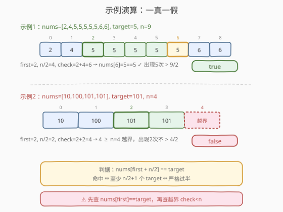

# 检查一个数是否在数组中占绝大多数

- **题目名称**：检查一个数是否在数组中占绝大多数
- **链接**：[1150. 检查一个数是否在数组中占绝大多数](https://leetcode.cn/problems/check-if-a-number-is-majority-element-in-a-sorted-array/)
- **难度**：简单
- **标签**：数组、二分查找

## 1. 题目概述

给定一个**按非递减顺序排列**的整数数组 `nums`，以及一个整数 `target`。如果 `target` 是数组的**多数元素**（majority element），返回 `true`；否则返回 `false`。

多数元素定义为：在数组中出现次数**严格大于** $\lfloor n/2 \rfloor$ 的元素（即出现次数 $> n/2$，等价于至少 $\lfloor n/2 \rfloor + 1$ 次）。

**示例 1**：

```text
输入：nums = [2,4,5,5,5,5,5,6,6], target = 5
输出：true
解释：n = 9，5 出现 5 次，5 > 9/2 = 4.5，是多数元素。
```

**示例 2**：

```text
输入：nums = [10,100,101,101], target = 101
输出：false
解释：n = 4，101 出现 2 次，2 不大于 4/2 = 2，不是多数元素。
```

**约束条件**：

- $1 \le \text{nums.length} \le 1000$
- $1 \le \text{nums[i]} \le 10^9$
- `nums` 按**非递减顺序**排列
- $1 \le \text{target} \le 10^9$

> 💡 题目的「进阶」要求：如果数组已经有序，能否写出 $O(\log n)$ 的算法？答案是肯定的——**有序**这一前提是整道题的钥匙，它让我们可以用二分查找把「数出现次数」从线性降到对数级。

---

## 2. 解题思路

### 2.1 暴力思路：线性扫描计数

最直觉的做法：遍历一遍 `nums`，统计 `target` 的出现次数 `cnt`，最后比较 `cnt > n / 2`。

```text
cnt = 0
for x in nums:
    if x == target: cnt += 1
return cnt > n / 2
```

> ⚠️ 此法时间 $O(n)$、空间 $O(1)$，能 AC。但**完全没有利用数组有序这一关键前提**——面试官会追问「能否做到 $O(\log n)$？」。

### 2.2 核心观察：有序 + 一次二分 + 单点验证

数组**有序**意味着：所有等于 `target` 的元素一定**连续**排在一起，占据某段 $[\text{first}, \text{last}]$。设 `target` 首次出现于下标 `first`，则它覆盖 $[\text{first}, \text{first} + \text{cnt} - 1]$。

**关键一步**：若 `target` 是多数元素（$\text{cnt} > n/2$，即 $\text{cnt} \ge \lfloor n/2 \rfloor + 1$），那么从 `first` 往后数 $\lfloor n/2 \rfloor$ 个位置，下标 $\text{first} + \lfloor n/2 \rfloor$ 仍然落在 `target` 的连续段内——也就是 $\text{nums}[\text{first} + n/2] == \text{target}$。

反过来也成立：若 $\text{nums}[\text{first} + n/2] == \text{target}$，说明从 `first` 到 $\text{first} + n/2$ 这 $n/2 + 1$ 个位置全是 `target`，出现次数 $\ge n/2 + 1 > n/2$。

于是判定多数元素**只需检查一个位置**：

![核心观察：有序数组中只查一个位置 nums[first+n/2]](../images/majority_check_concept.svg)

> 💡 **为什么只需一个位置而非两次二分找上下界？** 因为「是否严格过半」是布尔判定，不需要精确计数。有序性保证 `target` 连续，过半 ⇔ `first + n/2` 处仍是 `target`。一次 `lower_bound` 找 `first`，再做一次下标比较即可，比「二分找首尾再相减」少一次二分。

### 2.3 算法流程图

![算法流程：lower_bound 找 first，校验存在性，再判 nums[first+n/2]](../images/majority_check_flow.svg)

**完整步骤**：

1. **二分找首个位置**：用 `lower_bound(target)` 得到第一个 `>= target` 的下标 `first`。
2. **存在性校验**：若 `first == n`（全小于 `target`）或 `nums[first] != target`（`target` 不在数组中），直接返回 `false`。
3. **单点验证**：令 $\text{check} = \text{first} + \lfloor n/2 \rfloor$。若 $\text{check} < n$ 且 $\text{nums}[\text{check}] == \text{target}$，返回 `true`；否则 `false`。

> ⚠️ **两个边界陷阱**：① 必须先确认 `nums[first] == target`，否则 `lower_bound` 返回的是「首个大于 `target`」的位置，会误判；② `check` 可能越界（`target` 出现次数不足时 `first + n/2 >= n`），必须先判 `check < n` 再访问。

### 2.4 示例演算

以示例 1（命中）和示例 2（越界）对照：



**示例 1**：`nums = [2,4,5,5,5,5,5,6,6]`，`target = 5`，$n = 9$。

- `lower_bound(5) = 2`，`nums[2] = 5 == target` ✓
- $\text{check} = 2 + 9/2 = 2 + 4 = 6$，`6 < 9` 且 `nums[6] = 5 == target` → **true**

**示例 2**：`nums = [10,100,101,101]`，`target = 101`，$n = 4$。

- `lower_bound(101) = 2`，`nums[2] = 101 == target` ✓
- $\text{check} = 2 + 4/2 = 2 + 2 = 4$，`4 >= 4` 越界 → **false**

---

## 3. 参考代码

### 方法一：一次二分 + 单点验证（推荐）

### C++

```cpp
class Solution {
public:
    bool isMajorityElement(vector<int>& nums, int target) {
        int n = nums.size();
        // 1. 二分找首个 >= target 的位置
        int first = lower_bound(nums.begin(), nums.end(), target) - nums.begin();
        // 2. target 不在数组中
        if (first == n || nums[first] != target) return false;
        // 3. 单点验证：first + n/2 处仍是 target ⇔ 严格过半
        int check = first + n / 2;
        return check < n && nums[check] == target;
    }
};
```

### Python

```python
import bisect

class Solution:
    def isMajorityElement(self, nums: List[int], target: int) -> bool:
        n = len(nums)
        first = bisect.bisect_left(nums, target)
        if first == n or nums[first] != target:
            return False
        check = first + n // 2
        return check < n and nums[check] == target
```

> 💡 **写法要点**：① C++ `lower_bound` 返回迭代器，减去 `begin()` 得下标；Python 用 `bisect.bisect_left` 等价。② 整数除法 `n / 2`（C++）与 `n // 2`（Python）都是向下取整 $\lfloor n/2 \rfloor$，与「严格大于 $n/2$」的多数定义天然契合。③ `check < n` 短路保护越界访问。

### 方法二：线性扫描计数（基准对照）

### Python

```python
class Solution:
    def isMajorityElement(self, nums: List[int], target: int) -> bool:
        n = len(nums)
        cnt = sum(1 for x in nums if x == target)
        return cnt > n / 2
```

> 💡 未利用有序性，$O(n)$ 时间。仅作对照，面试中应主动给出方法一。

---

## 4. 复杂度分析

| 维度 | 方法 | 复杂度 | 说明 |
|------|------|--------|------|
| 时间复杂度 | 二分 + 单点验证 | $O(\log n)$ | 一次 `lower_bound`，单点比较 $O(1)$ |
| 空间复杂度 | 二分 + 单点验证 | $O(1)$ | 仅几个下标变量 |
| 时间复杂度 | 线性计数 | $O(n)$ | 遍历整个数组 |
| 空间复杂度 | 线性计数 | $O(1)$ | 一个计数器 |

> ⚠️ 本题 $n \le 1000$，两种方法都轻松 AC。但题目进阶要求 $O(\log n)$，方法一才是面试正解——它把「计数」转化为「定位 + 单点判定」，是**有序数组上避免线性扫描**的典型范式。

---

## 5. 扩展：两次二分求精确次数

若题目改为「返回 `target` 的精确出现次数」，单点验证就不够了，需要用**两次二分**夹出 `target` 的连续段：

- `lo = lower_bound(target)`：首个 `>= target` 的位置。
- `hi = upper_bound(target)`：首个 `> target` 的位置。
- 出现次数 $= \text{hi} - \text{lo}$。

```cpp
int count(vector<int>& nums, int target) {
    auto lo = lower_bound(nums.begin(), nums.end(), target);
    auto hi = upper_bound(nums.begin(), nums.end(), target);
    return hi - lo;
}
```

> 💡 `upper_bound - lower_bound` 是 STL 中「在有序序列里数某个值出现次数」的惯用法，时间 $O(\log n)$。本题只需布尔判定，故可省去 `upper_bound` 这一次二分——这是「判定问题比计数问题更便宜」的一个实例。

---

## 6. 面试要点

1. **为什么有序数组能做 $O(\log n)$？**

   > 有序保证 `target` 的所有出现**连续**，于是「出现次数 > $n/2$」等价于「首个位置 `first` 之后第 $\lfloor n/2 \rfloor$ 个位置仍是 `target`」。用二分找 `first` 即可，无需线性扫描。

2. **为什么检查 `first + n/2` 一个位置就够了？**

   > 设 `target` 出现 `cnt` 次，覆盖 $[\text{first}, \text{first}+\text{cnt}-1]$。`cnt > n/2` ⇔ $\text{cnt} \ge \lfloor n/2 \rfloor + 1$ ⇔ $\text{first} + \lfloor n/2 \rfloor \le \text{first} + \text{cnt} - 1$ ⇔ $\text{nums}[\text{first} + n/2] == \text{target}$。判定与计数等价，但只需 $O(1)$ 验证。

3. **两个易错的边界是什么？**

   > ① `lower_bound` 找的是「首个 `>= target`」，若 `target` 不存在则指向更大的元素，必须用 `nums[first] != target` 排除；② `first + n/2` 可能 $\ge n$（出现次数不足时），必须先判 `check < n` 再访问数组。

4. **`n/2` 用整数除法会不会出错？**

   > 不会。多数定义是「严格大于 $n/2$」。整数除法 $\lfloor n/2 \rfloor$ 使判据变成「至少 $\lfloor n/2 \rfloor + 1$ 次」，恰好等价于「严格大于 $n/2$」。例如 $n=4$ 时 $\lfloor n/2 \rfloor = 2$，需 $\ge 3$ 次才算多数，与「$> 2$」一致。

5. **和「169. 多数元素」有什么区别？**

   > 169 题数组**无序**且保证存在多数元素，用 Boyer-Moore 投票 $O(n)$；本题数组**有序**但不保证存在多数元素，用二分 $O(\log n)$。前提不同，算法不同——有序性是本题能降到对数级的唯一理由。

> 💡 **一句话总结**：1150 的钥匙是「有序」——它把 `target` 变成连续段，于是「是否过半」退化成「`first + n/2` 处是否仍是 `target`」的单点判定，一次 `lower_bound` 即可 $O(\log n)$ 解决。

---

## 7. 同类练习题

- [704. 二分查找](https://leetcode.cn/problems/binary-search/)：`lower_bound` 的母题，本题二分定位的基础模板
- [34. 在排序数组中查找元素的第一个和最后一个位置](https://leetcode.cn/problems/find-first-and-last-position-of-element-in-sorted-array/)：`lower_bound` + `upper_bound` 双二分求精确次数，是本文「扩展」的直接对应
- [169. 多数元素](https://leetcode.cn/problems/majority-element/)：无序数组的多数问题，Boyer-Moore 投票 $O(n)$，与本题对照「有序 vs 无序」选不同算法
- [278. 第一个错误的版本](https://leetcode.cn/problems/first-bad-version/)：单调布尔序列上二分找首个 `true`，与本题 `lower_bound` 同构
