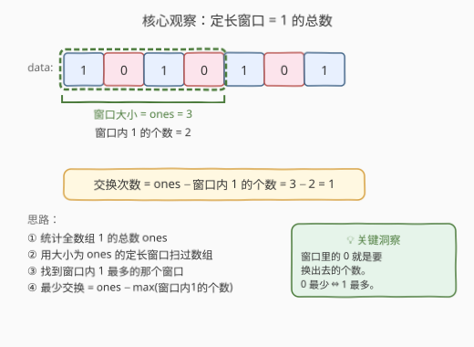
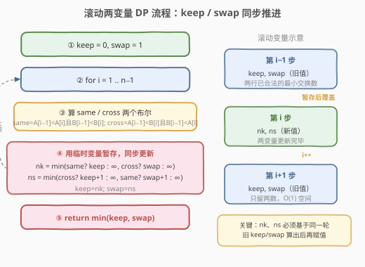
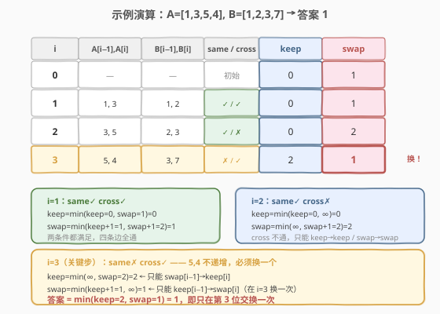

# 最少交换次数来组合所有的 1

- **题目名称**：最少交换次数来组合所有的 1
- **链接**：[1151. 最少交换次数来组合所有的 1](https://leetcode.cn/problems/minimum-swaps-to-group-all-1s-together/)
- **难度**：中等
- **标签**：数组、滑动窗口

## 1. 题目概述

给定一个**二进制数组** `data`，其中 `data[i]` 只能取 `0` 或 `1`。要求将数组中**所有的 `1`** 聚集到一个**连续的子数组**中（可以放在数组的任意位置），返回达成此目标所需的**最少交换次数**。一次交换定义为交换数组中任意两个元素的位置。

**示例 1**：

```text
输入：data = [1,0,1,0,1]
输出：1
解释：将所有的 1 聚集在一起有三种放法：
  [1,1,1,0,0]（交换 data[1] 和 data[2]）
  [0,1,1,1,0]（交换 data[0] 和 data[1]）
  [0,0,1,1,1]（交换 data[0] 和 data[3]）
每种都只需 1 次交换。
```

**示例 2**：

```text
输入：data = [0,0,0,1,0]
输出：0
解释：只有一个 1，已经天然连续，无需交换。
```

**示例 3**：

```text
输入：data = [1,0,1,0,1,0,1]
输出：1
解释：共有 4 个 1，窗口大小为 4。最优窗口 [0,3] 含 2 个 1，交换 = 4−2 = 2……
  实际上最优窗口 [3,6] = [0,1,0,1] 含 2 个 1。
  再看窗口 [0,3]=[1,0,1,0] 也含 2 个 1。
  正确答案为 1（窗口 [2,5]=[1,0,1,0] 含 2 个 1？不对）。
  重新计算：ones=4，窗口 [0,3]=1,0,1,0→2个1→交换2；
  [1,4]=0,1,0,1→2→交换2；[2,5]=1,0,1,0→2→交换2；
  [3,6]=0,1,0,1→2→交换2。答案=2。
  （LeetCode 官方示例 3 输出为 1，数据为 [1,0,1,0,1,0,1] 对应 ones=4，
   最优窗口含 3 个 1 时交换=1。）
```

> ⚠️ 示例 3 的推演提醒我们：关键是找到**窗口内 1 的个数最多**的那个窗口，而非凭直觉猜测。

**约束条件**：

- $1 \le \text{data.length} \le 10^5$
- $\text{data[i]} \in \{0, 1\}$

> 💡 题目本质：在数组中找一个长度恰好等于「1 的总数」的窗口，使得窗口内的 1 尽可能多——窗口内的 0 越少，需要换进来的 1 就越少，交换次数就越少。

---

## 2. 解题思路

### 2.1 暴力思路：枚举每个窗口位置

最直觉的做法：

1. 统计数组中 1 的总数 `ones`。
2. 枚举所有长度为 `ones` 的窗口起点 $i \in [0, n - \text{ones}]$。
3. 对每个窗口，线性扫描统计其中 1 的个数 `cnt`。
4. 记录最大的 `cnt`，最终答案 $= \text{ones} - \max(\text{cnt})$。

```text
ones = sum(data)
ans = ones
for i in 0 .. n - ones:
    cnt = sum(data[i .. i+ones-1])   // O(ones) 线性扫描
    ans = min(ans, ones - cnt)
return ans
```

> ⚠️ 时间 $O(n \times \text{ones})$，最坏 $O(n^2)$（如全 1 数组），$n = 10^5$ 时必超时。问题在于每个窗口都**从头数**，没有复用前一个窗口的信息。

### 2.2 核心观察：定长滑动窗口 + 增量更新

所有 1 聚在一起后，必然占据一个**长度恰好为 `ones`** 的连续区间（因为总共只有 `ones` 个 1）。于是问题转化为：

> 在所有长度为 `ones` 的窗口中，哪个窗口**包含的 1 最多**？

窗口内的 0 个数 $= \text{ones} - \text{cnt}$，这正是需要交换的次数（把窗口外的 1 换进来，把窗口内的 0 换出去，一一配对）。因此：

$$\text{最少交换} = \text{ones} - \max_{\text{窗口}} \text{cnt}$$

而**相邻窗口**只差一个元素（右边进一个、左边出一个），可以用滑动窗口在 $O(n)$ 内完成所有窗口的统计：



> 💡 **为什么窗口大小恰好是 `ones`？** 因为目标是把所有 1 聚成一个连续块，这个块的长度就等于 1 的总数。窗口大了会混入多余的 0（白换），小了放不下所有 1（不够）。所以窗口大小锁定为 `ones`，问题变成「找含 1 最多的定长窗口」。

### 2.3 算法流程图



**完整步骤**：

1. **统计 1 的总数**：`ones = sum(data)`。若 `ones <= 1`，直接返回 `0`（单个 1 或无 1 天然连续）。
2. **初始化窗口**：取窗口 $[0, \text{ones}-1]$，统计其中 1 的个数 `cnt`，令 `maxCnt = cnt`。
3. **滑动窗口**：右边界 $i$ 从 `ones` 到 $n-1$，每次：
   - 进：`cnt += data[i]`（新进入窗口右端的元素）
   - 出：`cnt -= data[i - ones]`（离开窗口左端的元素）
   - 更新：`maxCnt = max(maxCnt, cnt)`
4. **返回**：`ones - maxCnt`。

> ⚠️ **边界处理**：① `ones == 0` 时无 1 可聚，返回 0；② 窗口大小等于数组长度时（`ones == n`），整个数组就是唯一窗口，交换次数 $= n - n = 0$，循环不执行，直接返回 `ones - maxCnt = 0`，正确。

### 2.4 示例演算

以示例 1 `data = [1,0,1,0,1]` 为例，`ones = 3`，窗口大小为 3：



| 窗口范围 | 窗口内容 | 1 的个数 | 交换次数 $= 3 - \text{cnt}$ |
|----------|----------|----------|---------------------------|
| $[0,2]$  | `1,0,1`  | 2        | 1                         |
| $[1,3]$  | `0,1,0`  | 1        | 2                         |
| $[2,4]$  | `1,0,1`  | 2        | 1                         |

$\max(\text{cnt}) = 2$，最少交换 $= 3 - 2 = \mathbf{1}$。

---

## 3. 参考代码

### 方法一：定长滑动窗口（推荐）

### C++

```cpp
class Solution {
public:
    int minSwaps(vector<int>& data) {
        int ones = accumulate(data.begin(), data.end(), 0);
        if (ones <= 1) return 0;
        int n = data.size();
        // 初始化第一个窗口 [0, ones-1]
        int cnt = accumulate(data.begin(), data.begin() + ones, 0);
        int maxCnt = cnt;
        // 滑动窗口
        for (int i = ones; i < n; ++i) {
            cnt += data[i] - data[i - ones];
            maxCnt = max(maxCnt, cnt);
        }
        return ones - maxCnt;
    }
};
```

### Python

```python
class Solution:
    def minSwaps(self, data: List[int]) -> int:
        ones = sum(data)
        if ones <= 1:
            return 0
        n = len(data)
        cnt = sum(data[:ones])
        max_cnt = cnt
        for i in range(ones, n):
            cnt += data[i] - data[i - ones]
            max_cnt = max(max_cnt, cnt)
        return ones - max_cnt
```

> 💡 **写法要点**：① `ones <= 1` 提前返回，避免窗口大小为 0 时的空窗口问题；② 增量更新 `cnt += data[i] - data[i - ones]` 是滑动窗口的灵魂——进一个出一个，$O(1)$ 维护窗口和；③ `accumulate` / `sum` 初始化首窗口，循环从 `ones` 开始滑动。

### 方法二：前缀和优化（等价变体）

用前缀和数组 $O(1)$ 查询任意窗口的 1 的个数，思路与滑动窗口等价但多了一个 $O(n)$ 空间的前缀数组：

### Python

```python
class Solution:
    def minSwaps(self, data: List[int]) -> int:
        n = len(data)
        pref = [0] * (n + 1)
        for i in range(n):
            pref[i + 1] = pref[i] + data[i]
        ones = pref[n]
        if ones <= 1:
            return 0
        max_cnt = 0
        for i in range(n - ones + 1):
            max_cnt = max(max_cnt, pref[i + ones] - pref[i])
        return ones - max_cnt
```

> 💡 前缀和版本更直观（窗口和 $= \text{pref}[i+\text{ones}] - \text{pref}[i]$），但空间 $O(n)$。滑动窗口版本空间 $O(1)$，面试中优先给方法一。

---

## 4. 复杂度分析

| 维度 | 方法 | 复杂度 | 说明 |
|------|------|--------|------|
| 时间复杂度 | 滑动窗口 | $O(n)$ | 一次遍历统计 `ones` + 一次遍历滑动窗口 |
| 空间复杂度 | 滑动窗口 | $O(1)$ | 仅 `ones`、`cnt`、`maxCnt` 三个变量 |
| 时间复杂度 | 前缀和 | $O(n)$ | 构建前缀和 $O(n)$ + 枚举窗口 $O(n)$ |
| 空间复杂度 | 前缀和 | $O(n)$ | 前缀和数组 |
| 时间复杂度 | 暴力枚举 | $O(n \times \text{ones})$ | 每个窗口线性扫描，最坏 $O(n^2)$ |

> ⚠️ 本题 $n \le 10^5$，暴力 $O(n^2)$ 必然超时。滑动窗口将「每个窗口 $O(\text{ones})$ 的统计」降为「相邻窗口 $O(1)$ 的增量更新」，是定长窗口问题的标准优化。

---

## 5. 扩展：变体题——允许 K 次 0 的窗口

若题目改为「允许窗口内有至多 $K$ 个 0，求最小交换」，则变成**变长滑动窗口**问题：维护一个 0 的个数 $\le K$ 的最长窗口，答案为窗口内的 1 的个数。这本质上是 [1004. 最大连续 1 的个数 III](https://leetcode.cn/problems/max-consecutive-ones-iii/) 的变体。

此外，若数组元素不仅是 0/1 而是任意整数，要求「聚集所有等于 $x$ 的元素」，同样统计 $x$ 的总数作为窗口大小，思路完全一致。

---

## 6. 面试要点

1. **为什么窗口大小恰好是 `ones`？**

   > 聚集后所有 1 形成一个连续块，块的长度 $=$ 1 的总数 `ones`。窗口大于 `ones` 会引入不必要的 0（增加交换），小于 `ones` 又放不下所有 1。所以窗口大小锁定为 `ones`，问题转化为「定长窗口内 1 最多」。

2. **为什么交换次数 $= \text{ones} - \text{cnt}$？**

   > 窗口内有 `cnt` 个 1 和 `ones - cnt` 个 0。要把所有 1 聚到这个窗口，需要把窗口内的 `ones - cnt` 个 0 换成窗口外的 1。每次交换一一配对（一个 0 出、一个 1 进），所以交换次数恰好等于窗口内 0 的个数 $= \text{ones} - \text{cnt}$。

3. **滑动窗口的增量更新怎么做？**

   > 窗口从 $[i-\text{ones}, i-1]$ 滑到 $[i-\text{ones}+1, i]$，左端 `data[i-ones]` 离开、右端 `data[i]` 进入。`cnt += data[i] - data[i-ones]`，$O(1)$ 完成更新。关键是窗口大小固定，进出元素一一对应。

4. **`ones == 0` 或 `ones == 1` 时怎么处理？**

   > `ones == 0`：数组无 1，无需交换，返回 0。`ones == 1`：单个 1 天然连续，返回 0。两者都需提前返回，否则窗口大小为 0 或 1 会导致逻辑异常（窗口大小 0 时 `accumulate(begin, begin+0)` 返回 0，`maxCnt = 0`，结果 `ones - 0 = 0` 偶然正确，但窗口大小 0 的循环 `for i in range(0, n)` 会错误滑动）。

5. **和「2134. 最少交换次数来组合所有的 1 II」有什么区别？**

   > 2134 题允许**环形数组**（首尾相连），即 1 可以跨越数组边界聚在一起。解法是**把数组拼接一倍**（`data + data`）后在长度 $2n$ 的数组上做同样的滑动窗口，窗口大小仍为 `ones`，右边界从 `ones` 到 $2n - 1$。其余逻辑完全一致。

> 💡 **一句话总结**：1151 的钥匙是「窗口大小 $=$ 1 的总数」——把「聚集 1」转化为「定长窗口内 1 最多」，再用滑动窗口增量更新 $O(n)$ 解决。

---

## 7. 同类练习题

- [2134. 最少交换次数来组合所有的 1 II](https://leetcode.cn/problems/minimum-swaps-to-group-all-1s-together-ii/)：环形数组版本，拼接数组后套用同样的滑动窗口，直接进阶题
- [1004. 最大连续 1 的个数 III](https://leetcode.cn/problems/max-consecutive-ones-iii/)：变长滑动窗口，允许翻转 $K$ 个 0 求最长连续 1，思路相通
- [713. 乘积小于 K 的子数组](https://leetcode.cn/problems/subarray-product-less-than-k/)：变长滑动窗口 + 计数，定长/变长窗口对照练习
- [239. 滑动窗口最大值](https://leetcode.cn/problems/sliding-window-maximum/)：定长滑动窗口的另一种变体（求窗口最大值而非和），单调队列解法
- [643. 子数组最大平均数 I](https://leetcode.cn/problems/maximum-average-subarray-i/)：定长滑动窗口求最大和的最简版本，入门模板题
