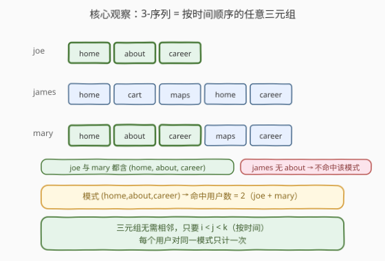
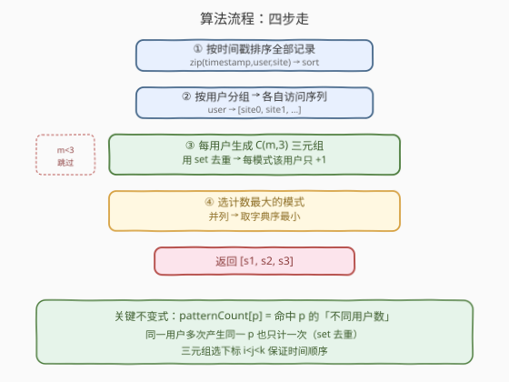
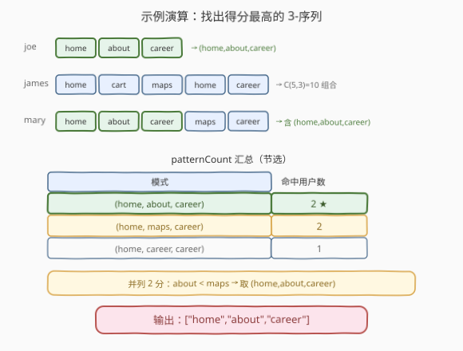

# 用户网站访问行为分析

- **题目名称**：用户网站访问行为分析
- **链接**：[1152. 用户网站访问行为分析](https://leetcode.cn/problems/analyze-user-website-visit-pattern/)
- **难度**：中等
- **标签**：哈希表、排序、组合枚举

## 1. 题目概述

给定三个等长数组 `username`、`timestamp`、`website`，其中第 `i` 条记录表示用户 `username[i]` 在时间 `timestamp[i]` 访问了网站 `website[i]`。

一个 **3-序列**（pattern）是指**单个用户**按时间顺序访问的三个网站组成的有序三元组 $(s_1, s_2, s_3)$。三元组中的三个网站**不必相邻**，只要满足下标 $i < j < k$（即按时间先后）即可。

目标是找出**被最多不同用户命中**的 3-序列。每个用户对同一 3-序列至多计一次（即使该用户能以多种下标组合产生同一三元组也只算 1）。若存在并列，返回**字典序最小**的那个 3-序列（按字符串逐元素比较）。

**示例 1**：

```text
输入：
username  = ["joe","joe","joe","james","james","james","james","james","mary","mary","mary","mary","mary"]
timestamp = [1,2,3,4,5,6,7,8,9,10,11,12,13]
website   = ["home","about","career","home","cart","maps","home","career","home","about","career","maps","career"]
输出：["home","about","career"]
解释：
joe   按时间访问序列 = [home, about, career]
james 按时间访问序列 = [home, cart, maps, home, career]
mary  按时间访问序列 = [home, about, career, maps, career]
模式 (home, about, career) 被 joe 与 mary 命中 → 得分 2，为最高分。
```

**约束条件**：

- $3 \le N = \text{username.length} = \text{timestamp.length} = \text{website.length} \le 50$
- $1 \le \text{username[i].length}, \text{website[i].length} \le 10$
- $1 \le \text{timestamp[i]} \le 10^9$
- 题目保证存在至少一个 3-序列（即存在访问过 $\ge 3$ 个网站的用户）

> 💡 注意「3-序列」是**子序列**而非子数组：只要时间顺序对（$i<j<k$）即可，中间可以夹其它网站。这是本题最易误解的一点。

---

## 2. 解题思路

### 2.1 暴力思路：枚举所有三元组并查重

最直觉的做法：把所有记录按时间排序、按用户分组后，对每个用户枚举其访问序列里所有 $i<j<k$ 的三元组，丢进一个全局哈希表计数，最后取计数最大（并列取字典序最小）者。

这其实就是正解的骨架——关键在于两处细节：① 时间顺序必须先排序；② 同一用户重复产生同一模式要**去重**。

### 2.2 核心观察：组合枚举 + 用户级去重



两个关键点：

1. **三元组 = 子序列**：对某用户长度为 $m$ 的访问序列，所有合法 3-序列即 $\binom{m}{3}$ 个下标组合 $i<j<k$。用 `combinations(sites, 3)`（Python）或三层循环（C++）即可枚举。
2. **按用户去重**：题目要求统计「不同用户数」而非「出现次数」。若某用户访问 `[a,a,a]`，下标 $(0,1,2)$ 产生 `(a,a,a)`，只有一种模式——但若该用户访问 `[a,b,a,b,a]`，可能有多组下标都产生 `(a,b,a)`，这只算 1 个用户。故每个用户先用 `set` 收集其所有不同模式，再对全局计数各 `+1`。

> ⚠️ **去重陷阱**：若不做用户级 `set` 去重，直接把每个三元组丢进全局哈希，会把「同一用户的多次命中」重复计入，导致得分虚高。例如 mary 的 `[home, about, career, maps, career]` 里 `(home, career, career)` 虽只有一个，但像 `(home, about, career)` 这种也可能被多组下标命中——必须先按用户收 `set`。

### 2.3 算法流程图



**完整步骤**：

1. **按时间排序**：将 `(timestamp, username, website)` 三元组按 `timestamp` 排序，使每个用户的访问天然按时间排列。
2. **按用户分组**：遍历排序后记录，把 `website` 依次追加到 `userVisits[username]`，得到每用户的时间有序访问序列。
3. **组合枚举 + 去重计数**：对每个访问序列长度 $m \ge 3$ 的用户，枚举所有 $\binom{m}{3}$ 个三元组，用 `set` 去重后，对每个不同模式在全局 `patternCount` 中 `+1`。
4. **选最优**：在 `patternCount` 中取计数最大者；并列时取字典序最小者。

> 💡 **字典序处理技巧**：C++ 用 `std::map<vector<string>, int>`，键天然按字典序升序，遍历时用**严格大于** `cnt > bestCnt` 更新，即可保留同分中字典序最小的那个；Python 用 `min(items, key=lambda x: (-x[1], x[0]))`，`-count` 让大计数排前、同分时 `pattern` 升序取最小。

### 2.4 示例演算

以示例 1 走一遍：



- **joe**（3 站）：`[home, about, career]`，$\binom{3}{3}=1$ 组合 → `(home, about, career)`。
- **james**（5 站）：`[home, cart, maps, home, career]`，$\binom{5}{3}=10$ 组合，含 `(home, maps, career)` 等，但**不含** `about` → 无 `(home, about, career)`。
- **mary**（5 站）：`[home, about, career, maps, career]`，$\binom{5}{3}=10$ 组合，含 `(home, about, career)`（下标 0,1,2）和 `(home, maps, career)`（下标 0,3,4）。

汇总（节选）：

| 模式 | 命中用户 | 得分 |
|------|----------|------|
| `(home, about, career)` | joe, mary | 2 |
| `(home, maps, career)` | james, mary | 2 |
| `(home, career, career)` | mary | 1 |

两个模式同得 2 分，按字典序比较：`about < maps`，故取 `(home, about, career)` → 输出 `["home","about","career"]`。

---

## 3. 参考代码

### C++

```cpp
class Solution {
public:
    vector<string> mostVisitedPattern(vector<string>& username, vector<int>& timestamp, vector<string>& website) {
        int n = username.size();
        // 1. 按时间戳排序访问记录
        vector<tuple<int, string, string>> records;
        for (int i = 0; i < n; i++) {
            records.push_back({timestamp[i], username[i], website[i]});
        }
        sort(records.begin(), records.end());

        // 2. 按用户分组，得到每个用户按时间顺序的网站序列
        unordered_map<string, vector<string>> userVisits;
        for (auto& [t, user, site] : records) {
            userVisits[user].push_back(site);
        }

        // 3. 每用户枚举 C(m,3) 三元组，set 去重后计入全局计数
        //    map 的键按字典序升序，便于并列时取最小
        map<vector<string>, int> patternCount;
        for (auto& [user, sites] : userVisits) {
            int m = sites.size();
            if (m < 3) continue;
            set<vector<string>> seen;
            for (int i = 0; i < m; i++)
                for (int j = i + 1; j < m; j++)
                    for (int k = j + 1; k < m; k++)
                        seen.insert({sites[i], sites[j], sites[k]});
            for (auto& p : seen) patternCount[p]++;
        }

        // 4. 取计数最大者；map 已按字典序，严格 > 保留同分中最小
        vector<string> best;
        int bestCnt = 0;
        for (auto& [p, cnt] : patternCount) {
            if (cnt > bestCnt) {
                bestCnt = cnt;
                best = p;
            }
        }
        return best;
    }
};
```

### Python

```python
class Solution:
    def mostVisitedPattern(self, username: List[str], timestamp: List[int], website: List[str]) -> List[str]:
        from collections import defaultdict
        from itertools import combinations

        # 1. 按时间戳排序
        records = sorted(zip(timestamp, username, website))

        # 2. 按用户分组
        userVisits = defaultdict(list)
        for t, user, site in records:
            userVisits[user].append(site)

        # 3. 每用户枚举 C(m,3) 三元组，set 去重后计数
        patternCount = defaultdict(int)
        for sites in userVisits.values():
            if len(sites) < 3:
                continue
            for p in set(combinations(sites, 3)):
                patternCount[p] += 1

        # 4. 取计数最大；并列取字典序最小
        return list(min(patternCount.items(), key=lambda x: (-x[1], x[0]))[0])
```

> 💡 **写法要点**：① Python `combinations(sites, 3)` 返回下标 $i<j<k$ 的三元组，天然保证时间顺序；② `set(combinations(...))` 一步完成用户级去重；③ `min` 的 `key=(-count, pattern)` 把「计数最大」与「字典序最小」统一成单次最小化——`-count` 使大计数对应更小键值，同分时 `pattern`（字符串元组）升序即字典序最小。

---

## 4. 复杂度分析

设 $N$ 为总记录数，某用户访问 $m_u$ 个网站，所有用户访问数之和 $\sum m_u = N$，全局不同模式数为 $P$。

| 维度 | 复杂度 | 说明 |
|------|--------|------|
| 时间复杂度 | $O(N \log N + \sum \binom{m_u}{3})$ | 排序 $O(N \log N)$；每用户枚举 $\binom{m_u}{3}$ 个三元组并去重 |
| 空间复杂度 | $O(N + P)$ | 存用户访问序列 $O(N)$ + 模式计数哈希 $O(P)$，其中 $P \le \sum \binom{m_u}{3}$ |

> ⚠️ 上界估计：单用户最多访问 $N$ 个网站时 $\binom{N}{3}$ 最大。本题 $N \le 50$，$\binom{50}{3} \approx 1.96 \times 10^4$，所有用户组合总数上界 $\sum \binom{m_u}{3} \le \binom{N}{3}$，完全可承受。这正是题目把 $N$ 限制在 $50$ 以内、使组合枚举成为正解的原因。

---

## 5. 扩展：序列更长或规模更大时

若把「3-序列」推广为「k-序列」，或 $N$ 显著增大（如 $N \ge 500$ 且单用户访问很多），三层组合枚举会退化：

- **k 更大**：用 `combinations(sites, k)`，复杂度 $\binom{m}{k}$ 随 $k$ 指数增长，需评估是否换 DP。
- **N 很大**：若模式空间可压缩（如只关心高频站点），可先按站点频率剪枝，或用滚动哈希/前缀树表示模式以降低常数。
- **变体「连续 3-序列」**：若要求三元组在访问序列中**相邻**，则退化为滑动窗口，每用户 $O(m)$ 即可枚举，无需组合。

> 💡 本题「子序列而非子串」是组合枚举的根因——相邻约束一旦加上，复杂度立刻从 $\binom{m}{3}$ 降到 $O(m)$。

---

## 6. 面试要点

1. **3-序列是子序列还是子数组？**

   > 子序列。三元组只要满足时间下标 $i < j < k$ 即可，中间可夹其它网站。这是本题最易踩的坑——误当成子数组会漏掉大量合法模式。

2. **为什么同一用户要先用 `set` 去重再计数？**

   > 题目统计「不同用户数」而非「出现次数」。一个用户的访问序列里可能有多组下标产生同一三元组（如 `[a,b,a,b,a]` 可多次产生 `(a,b,a)`），但该用户只算 1 个。不先按用户收 `set` 会让得分虚高。

3. **并列时如何取字典序最小？**

   > C++ 用 `std::map<vector<string>, int>`，键天然升序，遍历用严格 `>` 更新即保留同分首个（最小）；Python 用 `min(items, key=lambda x: (-count, pattern))`，`-count` 取最大计数、同分时 `pattern` 升序取最小。两种语言都能在一次遍历内完成。

4. **为什么要先按 `timestamp` 排序？**

   > 输入记录不一定按时间给出。只有先排序，分组后每个用户的 `website` 列表才按时间排列，组合枚举的下标 $i<j<k$ 才真正反映访问先后。

5. **若某用户访问少于 3 个网站怎么办？**

   > 直接跳过（`if m < 3: continue`）。该用户无法产生任何 3-序列，对计数无贡献。题目保证存在答案，故至少有一个用户 $m \ge 3$。

> 💡 **一句话总结**：1152 的钥匙是「子序列组合枚举 + 用户级去重」——先排序保时序、再分组、对每用户用 `set` 收 $\binom{m}{3}$ 个三元组去重后全局计数，最后取最大计数（并列字典序最小）。

---

## 7. 同类练习题

- [49. 字母异位词分组](https://leetcode.cn/problems/group-anagrams/)：同为「分组 + 哈希计数」范式，按排序后的键归组，与本题按用户分组同构
- [398. 随机数索引](https://leetcode.cn/problems/random-pick-index/)：哈希表聚合（值→下标列表），与本题「用户→访问序列」的聚合结构一致
- [187. 重复的DNA序列](https://leetcode.cn/problems/repeated-dna-sequences/)：定长子序列枚举 + 哈希计数，对照本题「不定跨度子序列 + 组合枚举」
- [890. 查找和替换模式](https://leetcode.cn/problems/find-and-replace-pattern/)：模式匹配 + 字典序/规范化比较，承接本题「模式字典序最小」的择优逻辑
