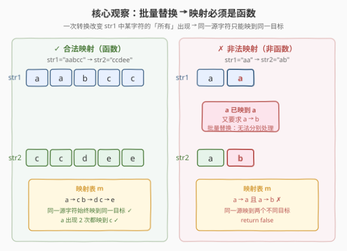
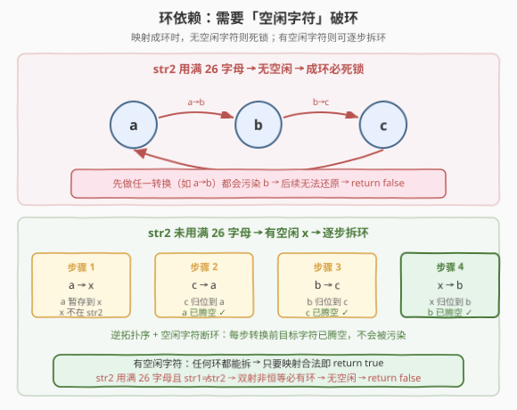
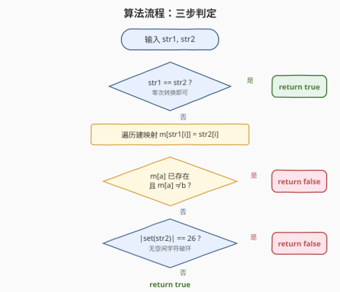

# 字符串转化

- **题目名称**：字符串转化
- **链接**：[1153. 字符串转化](https://leetcode.cn/problems/string-transforms-into-another-string/)
- **难度**：困难
- **标签**：哈希表、字符串、图

## 1. 题目概述

给定两个长度相同的小写字母字符串 `str1` 和 `str2`，判断能否通过**零次或多次**「转换」操作将 `str1` 变成 `str2`。

一次**转换**的定义：选择 `str1` 中的某个字符 $c_1$，将 `str1` 中**所有**出现的 $c_1$ 替换为另一个小写字母 $c_2$（$c_2 \neq c_1$）。

> ⚠️ 关键约束：转换改变的是**某个字符的所有出现**，而非单个位置。这意味着如果字符 `a` 出现在多个位置，一次转换会把它们**全部**改变——无法对同一字符的不同出现做不同处理。

**示例 1**：

```text
输入：str1 = "aabcc", str2 = "ccdee"
输出：true
解释：映射 a→c, b→d, c→e。按逆拓扑序执行：
      先 c→e："aabcc" → "aabee"
      再 b→d："aabee" → "aadee"
      最后 a→c："aadee" → "ccdee" ✓
```

**示例 2**：

```text
输入：str1 = "a", str2 = "b"
输出：true
解释：一次转换 a→b 即可。
```

**示例 3**：

```text
输入：str1 = "aa", str2 = "ab"
输出：false
解释：位置 0 要求 a→a，位置 1 要求 a→b。
      但 a 的所有出现必须同时改变，无法分别映到 a 和 b。
```

**约束条件**：

- $1 \le \text{str1.length} == \text{str2.length} \le 10^4$
- `str1` 和 `str2` 只包含小写英文字母

> 💡 本题是 [205. 同构字符串](../0201-0300/205_同构字符串.md) 的进阶版：205 只判定**是否存在**双射映射，而 1153 还需判定映射**能否被批量替换操作实际执行**——映射成环时需要「空闲字符」来断环，这是 205 不需要考虑的。

---

## 2. 解题思路

### 2.1 暴力思路：搜索所有转换序列

最直觉的做法是 BFS/DFS：从 `str1` 出发，每步尝试将某个字符转换为另一个字符，看能否到达 `str2`。

但字符串长度可达 $10^4$，每步有 $26 \times 25 = 650$ 种转换选择，状态空间呈指数爆炸，完全不可行。

### 2.2 核心观察一：映射必须是函数



由于转换改变的是**某个字符的所有出现**，同一字符不可能在不同位置变成不同目标。因此 `str1 → str2` 的逐位映射 $m$ 必须是一个**合法函数**：

- 对每个位置 $i$，$m[\text{str1}[i]] = \text{str2}[i]$；
- 若 $m[a]$ 已存在且 $\neq b$，说明字符 $a$ 要同时映到两个不同目标 → **矛盾**，返回 `false`。

> ⚠️ 这比 205 同构字符串的判定**更宽松**：205 要求**双射**（不同源不能映到同一目标），而 1153 允许**多对一**（如 `a→c` 和 `b→c` 同时存在合法）——因为可以先把 `a` 转成 `c`，再把 `b` 转成 `c`，两步互不干扰。1153 只要求**单方向是函数**（同一源只能映到一个目标），不要求反向单射。

### 2.3 核心观察二：环依赖与空闲字符



映射合法只是**必要条件**，还需判定操作**可执行性**。关键难点在于映射图中的**环**。

**环的死锁问题**：若映射形成环（如 $a \to b \to c \to a$），直接执行任一转换都会**污染**环中下一个节点的目标值。例如先做 $a \to b$，则原有的 $b$ 和新转换来的 $b$ 混在一起，后续 $b \to c$ 会把它们一起改变，导致 $a$ 的目标被错误覆盖。

**断环法**：若存在一个**不在 `str2` 中出现的空闲字符** $x$，则可以用它暂存：

1. $a \to x$（$a$ 暂存到 $x$，$a$ 腾空）
2. $c \to a$（$c$ 归位，$c$ 腾空）
3. $b \to c$（$b$ 归位，$b$ 腾空）
4. $x \to b$（$x$ 归位，完成）

每步转换前，目标字符已被腾空（不再出现在字符串中），不会被污染。

> 💡 **为什么非环映射不需要空闲字符？** 非环映射可按**逆拓扑序**执行：先转换那些「不被任何其他字符映射为目标」的字符，逐步从叶子向根推进。每步的目标在当前字符串中已无其他字符需要映到它，直接转换不会产生冲突。

**26 字母封锁**：若 `str2` 用满了全部 26 个小写字母，则不存在空闲字符。此时：

- `str2` 有 26 个不同字符，映射是函数 → `str1` 也必须含 26 个不同字符 → 映射是 26 元素上的**双射**。
- 双射非恒等映射（`str1 ≠ str2`）必有至少一个长度 $\geq 2$ 的环。
- 无空闲字符 → 环无法断开 → 返回 `false`。

> ⚠️ **`str1 == str2` 的特判**：若两串相同，零次转换即可，直接返回 `true`。这必须在 26 字母检查**之前**完成——因为 `str1 == str2` 时 `str2` 可能也用满 26 个字母，但恒等映射不需要任何转换，不涉及断环。

### 2.4 算法流程图



**完整步骤**（三步判定）：

1. **特判相同**：`str1 == str2` → `return true`。
2. **校验函数**：遍历建映射 $m$，若同一源字符映到不同目标 → `return false`。
3. **检查空闲**：`|set(str2)| < 26` → `return true`；否则 `return false`。

### 2.5 示例演算


**示例 1**：`str1 = "aabcc"`, `str2 = "ccdee"`

- 映射：$a \to c$, $b \to d$, $c \to e$（合法函数，无冲突）
- `|set(str2)| = |\{c,d,e\}| = 3 < 26` → 有空闲字符 → `return true`
- 执行顺序（逆拓扑序）：$c \to e$ → $b \to d$ → $a \to c$，每步目标已腾空不被污染

**示例 2**：`str1 = "aa"`, `str2 = "ab"`

- 位置 0：$a \to a$，位置 1：$a \to b$ → $m[a]$ 冲突（$a \neq b$）→ `return false`

**示例 3**：`str1 = "ab"`, `str2 = "ba"`

- 映射：$a \to b$, $b \to a$（合法函数，成环）
- `|set(str2)| = |\{a,b\}| = 2 < 26` → 有空闲字符 $x$ → `return true`
- 断环：$a \to x$ → $b \to a$ → $x \to b$

---

## 3. 参考代码

### C++

```cpp
class Solution {
public:
    bool canConvert(string str1, string str2) {
        if (str1 == str2) return true;          // 零次转换即可
        unordered_map<char, char> m;
        for (int i = 0; i < (int)str1.size(); ++i) {
            char a = str1[i], b = str2[i];
            if (m.count(a) && m[a] != b) return false;   // 映射非函数
            m[a] = b;
        }
        // str2 用满 26 字母 → 无空闲字符破环 → 不可转化
        return unordered_set<char>(str2.begin(), str2.end()).size() < 26;
    }
};
```

### Python

```python
class Solution:
    def canConvert(self, str1: str, str2: str) -> bool:
        if str1 == str2:
            return True
        m = {}
        for a, b in zip(str1, str2):
            if m.get(a, b) != b:          # a 已映到其他目标 → 非函数
                return False
            m[a] = b
        return len(set(str2)) < 26         # 有空闲字符 → 环可断
```

> 💡 Python 用 `m.get(a, b) != b` 一行同时处理「未登记时默认值取 `b`（必相等放行）」和「已登记时取旧值比较」两种情况，与 [205 同构字符串](../0201-0300/205_同构字符串.md) 的写法同源。核心区别在于最后一步：205 需要双向校验双射，1153 只校验单向函数 + 空闲字符数。

---

## 4. 复杂度分析

| 维度 | 复杂度 | 说明 |
|------|--------|------|
| 时间复杂度 | $O(n)$ | 一次遍历建映射 $O(n)$ + 计算 `str2` 去重集合 $O(n)$ |
| 空间复杂度 | $O(\|\Sigma\|)$ | 哈希表最多 26 个条目；小写字母集 $\|\Sigma\|=26$，即 $O(1)$ |

其中 $n$ 为字符串长度，$\|\Sigma\|$ 为字符集大小（小写字母 = 26）。时间 $O(n)$ 来源于一次遍历，空间为常数级。

---

## 5. 扩展：为什么不需要显式判环？

直觉上，环是问题的核心难点，但代码中并没有检测环。原因是**空闲字符的存在性**已经隐式覆盖了所有情况：

| 情况 | 有环？ | 有空闲？ | 判定 | 原因 |
|------|--------|----------|------|------|
| `str1 == str2` | 无 | 不关心 | `true` | 零次转换，不涉及断环 |
| 映射非函数 | — | — | `false` | 同一源映到多目标，矛盾 |
| 映射合法，`|set(str2)| < 26` | 可能有 | 有 | `true` | 空闲字符可断任意环 |
| 映射合法，`|set(str2)| == 26` | 必有 | 无 | `false` | 双射非恒等必有环，无法断 |

> 💡 **为什么 `|set(str2)| == 26` 必有环？** `str2` 含 26 个不同字符 → `str1` 也含 26 个不同字符（映射是函数，目标 26 个则源至少 26 个，但字母表只有 26 个 → 恰好 26 个）→ 映射是 26 元素上的双射。有限集上的双射可分解为若干不相交的轮换（循环置换），非恒等映射至少有一个长度 $\geq 2$ 的轮换 = 环。这是群论中**置换分解**的基本结论。

若题目扩展为更大的字符集（如 Unicode），则只需将 `26` 替换为字符集大小 $|\Sigma|$，逻辑不变。

---

## 6. 面试要点

1. **为什么映射只需要是函数，不需要是双射？**

   > 转换操作允许**多对一**：可以先 `a→c` 再 `b→c`，两步独立执行互不干扰（`a` 转完后 `a` 消失，`b→c` 不受影响）。只有**一对多**（同一源映到不同目标）才矛盾，因为批量替换无法分别处理同一字符的不同出现。因此只需校验映射是**单向函数**，不要求反向单射。对比 [205 同构字符串](../0201-0300/205_同构字符串.md) 要求双射，这是关键区别。

2. **为什么环会导致死锁？**

   > 环 $a \to b \to c \to a$ 中，先做任一转换（如 $a \to b$）会把原有的 $b$ 和新转换来的 $b$ 混在一起。后续 $b \to c$ 会同时改变它们，导致 $a$ 原本应该变成的 $b$ 被错误地变成 $c$。每一步都依赖下一步腾空目标，但环没有终点，形成死锁。

3. **空闲字符为什么能断环？**

   > 空闲字符 $x$ 不在 `str2` 中出现，意味着没有任何位置需要最终变成 $x$。先用 $a \to x$ 把 $a$ 暂存到 $x$（$a$ 腾空），之后 $c \to a$ 时 $a$ 已不在字符串中不会受污染。依次逆环方向归位每个字符，最后 $x \to b$ 收尾。$x$ 充当了临时缓冲区。

4. **为什么 `str2` 用满 26 字母就一定不行（当 `str1 ≠ str2`）？**

   > `str2` 用满 26 字母 → 没有空闲字符。同时映射是 26 元素上的双射（源和目标都是完整字母表），非恒等双射必有环（置换分解定理）。有环无空闲 → 死锁 → `false`。但 `str1 == str2` 是例外：恒等映射不需要转换，不涉及断环。

5. **能否不检测环，只靠 `|set(str2)| < 26` 判定？**

   > 可以。当 `|set(str2)| < 26` 时，无论映射是否成环，都存在空闲字符可断环，因此总能执行。当 `|set(str2)| == 26` 且 `str1 ≠ str2` 时，双射非恒等必有环且无空闲，必定失败。两个条件联合覆盖了所有情况，无需显式检测环——这是本题最精妙之处。

> 💡 **一句话总结**：1153 的核心是「批量替换 → 映射必须是函数」+「环需要空闲字符断开」+「`str2` 用满 26 字母则无空闲」。三步判定 $O(n)$ 解决，无需显式判环——空闲字符的存在性已隐式覆盖所有情况。

---

## 7. 同类练习题

- [205. 同构字符串](https://leetcode.cn/problems/isomorphic-strings/)（[题解](../0201-0300/205_同构字符串.md)）：1153 的基础版，只判定双射存在性，不考虑批量替换的可执行性；1153 放宽为单向函数但增加环与空闲字符的考量
- [290. 单词模式](https://leetcode.cn/problems/word-pattern/)：双射判定的单词级版本，与 205 同模板，对照 1153 的「函数即可」差异
- [890. 查找和替换模式](https://leetcode.cn/problems/find-and-replace-pattern/)：对列表中每个词跑 205 判定，筛出同构词；可与 1153 对比「查找替换」语义的不同
- [45. 跳跃游戏 II](https://leetcode.cn/problems/jump-game-ii/)（[题解](../0001-0100/45_跳跃游戏II.md)）：同为「看似需要搜索实则 $O(n)$ 贪心/观察」的范式，对照「暴力 BFS 不可行 → 找关键观察一步到位」的思路
