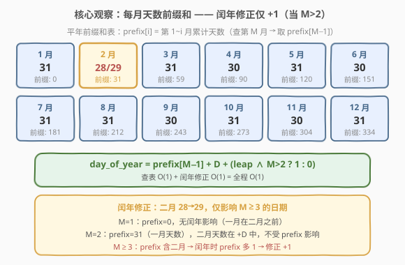
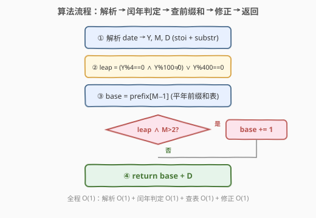
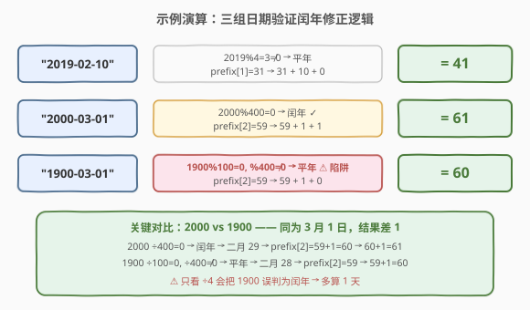

# 一年中的第几天

- **题目名称**：一年中的第几天
- **链接**：[1154. 一年中的第几天](https://leetcode.cn/problems/day-of-the-year/)
- **难度**：简单
- **标签**：数学、字符串

## 1. 题目概述

给你一个字符串 `date`，按 `YYYY-MM-DD` 格式表示一个现行公元纪年法日期。返回该日期是当年的第几天。

**示例 1**：

```text
输入：date = "2019-01-09"
输出：9
解释：给定日期是 2019 年的第九天。
```

**示例 2**：

```text
输入：date = "2019-02-10"
输出：41
```

**约束条件**：

- `date.length == 10`
- `date[4] == date[7] == '-'`，其他的 `date[i]` 都是数字
- `date` 表示的范围从 1900 年 1 月 1 日至 2019 年 12 月 31 日

> 💡 约束极小，$O(1)$ 直接查表即可。本题的全部考点在于**前缀和思想**与**闰年修正**——尤其是闰年修正条件 `M > 2` 的推导，以及世纪年陷阱（1900 不是闰年）。闰年判定规则详见 [1118. 一月有多少天](1118_一月有多少天.md)。

---

## 2. 解题思路

### 2.1 暴力思路：逐月累加天数

最直觉的做法是：解析出年、月、日后，从 1 月开始逐月累加天数，直到目标月份的前一个月，再加上当月日号。二月份的天数需根据闰年判定取 28 或 29。

```text
ans = day
for m in 1..month-1:
    ans += daysInMonth(year, m)
return ans
```

由于只有 12 个月，循环固定 11 次以内，时间 $O(1)$。但每次都要调用 `daysInMonth` 判断月份并查表，略显冗余——尤其是闰年判定对每个月都重复执行（实际只需判一次）。

### 2.2 核心观察：前缀和 + 闰年修正 O(1)



关键观察：**年内第几天 = 前 M−1 个月天数之和 + 当月日号**。而「前 M−1 个月天数之和」是一个经典的**前缀和**——可以预先把 12 个月的天数累加成一张定长表，查询时 $O(1)$ 直接取。

进一步观察闰年的影响范围：

- **二月 28→29** 是唯一变量，但它**只影响 M ≥ 3 的日期**：
  - $M = 1$：前缀和为 0（一月之前没有任何月份），与闰年无关。
  - $M = 2$：前缀和为 31（仅含一月），二月自身天数在 $+D$ 中体现，前缀和不涉及二月。
  - $M \ge 3$：前缀和包含二月 → 闰年时前缀和比平年**多 1**。

于是可以**预存平年前缀和表**，再对闰年且 $M > 2$ 的情况**统一加 1 修正**：

$$\text{day\_of\_year} = \text{prefix}[M-1] + D + \begin{cases} 1 & \text{leap} \wedge M > 2 \\ 0 & \text{otherwise} \end{cases}$$

> 💡 **为什么修正条件是 `M > 2` 而非 `M >= 2`？** 因为前缀和 `prefix[M-1]` 是「目标月**之前**所有月份的天数」。二月的修正天数只在**三月及以后**的日期才会被前缀和包含。二月自身的日期（M=2）前缀和只含一月（31 天），不涉及二月天数，因此不需要修正。

### 2.3 算法流程图



整个流程四步走，每步 $O(1)$：解析字符串 → 闰年判定 → 查前缀和表 → 闰年修正（条件加 1）→ 返回 `base + D`。

### 2.4 示例演算



以三组输入验证闰年修正逻辑：

| 日期 | 闰年判定 | prefix[M−1] | +D | +修正 | = 答案 | 说明 |
|------|----------|-------------|-----|-------|--------|------|
| "2019-02-10" | 2019%4≠0 → 平年 | prefix[1]=31 | +10 | +0 | 41 | M=2，无闰年修正 |
| "2000-03-01" | 2000%400=0 → 闰年 | prefix[2]=59 | +1 | +1 | 61 | M>2，闰年修正 +1 |
| "1900-03-01" | 1900%100=0, %400≠0 → 平年 | prefix[2]=59 | +1 | +0 | 60 | ⚠️ 世纪年陷阱 |

> ⚠️ **世纪年陷阱**：1900 能被 4 整除，但也能被 100 整除且不能被 400 整除 → **平年**。若只判 `Y%4==0` 会误判为闰年，多算 1 天。与 2000（能被 400 整除 → 闰年）形成鲜明对比，二者同为 3 月 1 日，结果差 1。

---

## 3. 参考代码

### C++（前缀和 + 闰年修正）

```cpp
class Solution {
public:
    int dayOfYear(string date) {
        int year = stoi(date.substr(0, 4));
        int month = stoi(date.substr(5, 2));
        int day = stoi(date.substr(8, 2));

        int prefix[] = {0, 31, 59, 90, 120, 151, 181, 212, 243, 273, 304, 334};
        int ans = prefix[month - 1] + day;
        if (isLeap(year) && month > 2) ans += 1;
        return ans;
    }
private:
    bool isLeap(int y) {
        return (y % 4 == 0 && y % 100 != 0) || (y % 400 == 0);
    }
};
```

### Python

```python
class Solution:
    def dayOfYear(self, date: str) -> int:
        year = int(date[0:4])
        month = int(date[5:7])
        day = int(date[8:10])

        prefix = [0, 31, 59, 90, 120, 151, 181, 212, 243, 273, 304, 334]
        ans = prefix[month - 1] + day
        if self._is_leap(year) and month > 2:
            ans += 1
        return ans

    def _is_leap(self, y: int) -> bool:
        return (y % 4 == 0 and y % 100 != 0) or (y % 400 == 0)
```

> 💡 **写法要点**：① `prefix` 数组以 0 为基——`prefix[0]=0` 表示「一月之前无月份」，`prefix[month-1]` 取目标月之前的累计天数。② 闰年修正 `month > 2` 短路在 `isLeap` 之后：非闰年直接跳过，只有闰年才检查月份，避免无谓的月份比较。③ Python 也可用 `datetime.strptime(date, '%Y-%m-%d').timetuple().tm_yday` 一行搞定，但面试中手写前缀和更能体现对日期计算的理解。

---

## 4. 复杂度分析

| 维度 | 复杂度 | 说明 |
|------|--------|------|
| 时间复杂度 | $O(1)$ | 解析字符串 3 次 substr + 闰年判定 3 次取模 + 前缀和查表 1 次数组访问，全部常数操作 |
| 空间复杂度 | $O(1)$ | 12 元素定长前缀和数组（48 字节），常数空间 |

> ⚠️ 时间严格 $O(1)$：无论日期如何，操作次数固定，不随输入规模增长。`stoi(substr)` 虽然遍历子串，但子串长度固定为 4 或 2，仍为常数。

---

## 5. 扩展：逐月累加法（不预存前缀和）

如果不预存前缀和表，也可以**逐月累加**——遍历 1 到 M−1 月，每月查天数表累加。闰年判定只做一次（而非每月做）：

```cpp
class Solution {
public:
    int dayOfYear(string date) {
        int year = stoi(date.substr(0, 4));
        int month = stoi(date.substr(5, 2));
        int day = stoi(date.substr(8, 2));

        int days[] = {31, 28, 31, 30, 31, 30, 31, 31, 30, 31, 30, 31};
        if (isLeap(year)) days[1] = 29;

        int ans = day;
        for (int i = 0; i < month - 1; i++) {
            ans += days[i];
        }
        return ans;
    }
private:
    bool isLeap(int y) {
        return (y % 4 == 0 && y % 100 != 0) || (y % 400 == 0);
    }
};
```

**两种解法对比**：

| 解法 | 时间 | 空间 | 特点 |
|------|------|------|------|
| 前缀和 + 修正 | $O(1)$ | $O(1)$ | 查表一次 + 条件加 1，最简洁 |
| 逐月累加 | $O(1)$ | $O(1)$ | 循环 ≤11 次，需修改天数表 |

> 💡 两种解法都是 $O(1)$（月份固定 12 个），但前缀和法**无需修改原表**——平年表不变，闰年用 `+1` 修正，逻辑更清晰。逐月累加法需 `days[1] = 29` 改表，若表中途被复用可能出错。面试中推荐前缀和法。

---

## 6. 面试要点

1. **为什么用前缀和而不是逐月累加？**

   > 逐月累加需循环 ≤11 次查表，前缀和一次查表 $O(1)$ 取值。虽然月份固定 12 个、两者渐近复杂度都是 $O(1)$，但前缀和法代码更简洁——预存累计天数，查询时直接 `prefix[month-1]`，且无需修改天数表。

2. **闰年修正为什么是 `M > 2` 而不是 `M >= 2`？**

   > 前缀和 `prefix[M-1]` 是目标月**之前**所有月份的天数之和。二月的 29 天只在三月及以后的日期才被前缀和包含。二月自身（M=2）的前缀和只含一月（31 天），不涉及二月天数，所以 M=2 不需要修正。M=1 更不需要（前缀和为 0）。因此修正条件是 `M > 2`。

3. **1900 年是闰年吗？为什么这是陷阱？**

   > 1900 **不是**闰年。格里高利历规则：能被 4 整除且不能被 100 整除，或能被 400 整除。1900 能被 100 整除但不能被 400 整除 → 平年。只记「÷4 即闰」会误判 1900 为闰年，导致多算 1 天。2000 能被 400 整除 → 闰年。这是所有日期计算题的共同陷阱。

4. **为什么可以把前缀和表存为平年值，再统一 +1 修正？**

   > 闰年与平年的唯一差异是二月多 1 天（28→29）。这 1 天只影响 M ≥ 3 日期的前缀和（因为前缀和从三月起才包含二月）。所以平年前缀和表 + `(leap ∧ M>2 ? 1 : 0)` 的修正，等价于直接查闰年前缀和表，但避免了维护两张表。这是「常量差异分离修正」的思路——把变量隔离到最后一步统一处理。

5. **如果题目改成求两个日期之间的天数差，怎么扩展？**

   > [1360. 日期之间隔几天](https://leetcode.cn/problems/number-of-days-between-two-dates/)：分别算出两个日期在当年中的第几天（本题），再考虑中间完整年份的天数（闰年 366、平年 365）。核心子例程仍是本题的「年内第几天」+ 1118 的闰年判定。

> 💡 **一句话总结**：1154 的核心是「每月天数前缀和 + 闰年修正」——预存平年累计天数表 $O(1)$ 查询，闰年仅对 $M>2$ 的日期加 1 修正。闰年判定复用 1118 的三规则，世纪年陷阱（1900 平 / 2000 闰）是唯一考点。

---

## 7. 同类练习题

- [1118. 一月有多少天](https://leetcode.cn/problems/number-of-days-in-a-month/)（[题解](1118_一月有多少天.md)）：格里高利历闰年三规则的母题，1154 的闰年判定直接复用其 `isLeap` 函数
- [1185. 一周中的第几天](https://leetcode.cn/problems/day-of-the-week/)：给定日期求星期几，需从已知参考日累加天数差，本题的「年内第几天」是其子问题
- [1360. 日期之间隔几天](https://leetcode.cn/problems/number-of-days-between-two-dates/)：求两日期相差天数，需算出各日期在当年第几天（本题）+ 跨年累计，闰年影响二月天数
- [172. 阶乘后的零](https://leetcode.cn/problems/factorial-trailing-zeroes/)（[题解](../0101-0200/172_阶乘后的零.md)）：同为「数学规则降维」——用勒让德公式替代逐个枚举，与 1154 用前缀和替代逐月累加思路同源
