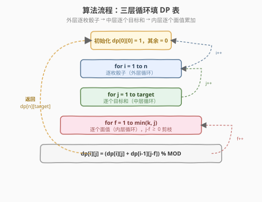

# 掷骰子之和等于给定方法数

- **题目名称**：掷骰子之和等于给定方法数
- **链接**：[1155. 掷骰子之和等于给定方法数](https://leetcode.cn/problems/number-of-dice-rolls-with-target-sum/)
- **难度**：中等
- **标签**：动态规划、分组背包、计数 DP

## 1. 题目概述

有 `n` 枚骰子，每枚骰子有 `k` 个面，面值分别为 `1` 到 `k`。给定三个整数 `n`、`k` 和 `target`，返回**掷骰子使所有面值之和恰好等于 `target` 的不同方法数**。由于答案可能很大，返回对 $10^9 + 7$ 取模的结果。

> 💡 这里的骰子是**有编号的**（骰子 1、骰子 2、…、骰子 n），因此 `(1, 6)` 和 `(6, 1)` 是两种不同方法——顺序有关。

**示例 1**：

```text
输入：n = 1, k = 6, target = 3
输出：1
解释：只有一枚骰子，掷出 3 即可，方法数为 1。
```

**示例 2**：

```text
输入：n = 2, k = 6, target = 7
输出：6
解释：(1,6), (2,5), (3,4), (4,3), (5,2), (6,1)，共 6 种。
```

**示例 3**：

```text
输入：n = 30, k = 30, target = 500
输出：222616187
```

**约束条件**：

- `1 <= n, k <= 30`
- `1 <= target <= 1000`

> 💡 这是一道**分组背包计数**题：每枚骰子是一个「组」，每组必须且只能选一个面值。与 [518. 零钱兑换 II](../0501-0600/518_零钱兑换II.md)（完全背包、同一硬币可无限用）和 [494. 目标和](../0401-0500/494_目标和.md)（0-1 背包、每物至多用一次）的结构对比鲜明，是背包 DP 三大变体中「每组恰选一个」的代表。

---

## 2. 解题思路

### 2.1 暴力思路：枚举所有骰子的面值组合

每枚骰子有 `k` 种选择，`n` 枚骰子共 $k^n$ 种组合。逐一枚举并求和判断是否等于 `target`，时间 $O(k^n)$。当 `n=30, k=30` 时高达 $30^{30}$，**完全不可行**。

问题在于大量组合的中间和是共享的——前 `i` 枚骰子凑出某个和的方法数，会被后续骰子反复引用。这正是**重叠子问题**的信号，适合用 DP 求解。

### 2.2 核心观察：分组背包计数 DP

![核心观察：每枚骰子选一个面值 f，dp[i][j] = Σ dp[i-1][j-f]](../images/dice_concept.svg)

**状态定义**：`dp[i][j]` = 用前 `i` 枚骰子凑出和为 `j` 的方法数。

**转移方程**（核心）：

$$dp[i][j] = \sum_{f=1}^{k} dp[i-1][j-f], \quad \text{当 } j - f \geq 0$$

**直觉**：第 `i` 枚骰子可以选择面值 `f`（`1 ≤ f ≤ k`），选了 `f` 之后，前 `i-1` 枚骰子需要凑出 `j - f`。对所有合法的 `f` 求和即为 `dp[i][j]`。

**边界条件**：

```text
dp[0][0] = 1     # 0 枚骰子凑出和 0，唯一方法（什么都不掷）
dp[0][j] = 0     # j > 0，0 枚骰子无法凑出正数
```

**答案**：`dp[n][target]`。

> 💡 **为什么是分组背包而非完全背包？** 每枚骰子有编号、且必须掷恰好一次——第 `i` 枚骰子只能从 `1..k` 中选一个面值，不能选两次也不能跳过。这与 518 零钱兑换 II 的关键区别在于：硬币可以无限复用（完全背包），骰子每组只用一次（分组背包）。因此 DP 必须用**二维结构**（`i` 维追踪已用的骰子数），不能像完全背包那样直接一维展开。

### 2.3 算法流程图



**完整步骤**：

1. **初始化**：`dp` 为 `(n+1) × (target+1)` 矩阵，全 0；设 `dp[0][0] = 1`
2. **逐枚骰子**：`i` 从 1 到 `n`
3. **逐个目标和**：`j` 从 1 到 `target`
4. **逐个面值**：`f` 从 1 到 `min(k, j)`（`j-f ≥ 0` 保证不越界）
   - `dp[i][j] = (dp[i][j] + dp[i-1][j-f]) % MOD`
5. **返回** `dp[n][target]`

> ⚠️ **j 的有效范围**：`i` 枚骰子的最小和为 `i`（全掷 1），最大和为 `i × k`（全掷 k）。`j < i` 或 `j > i × k` 时 `dp[i][j]` 必为 0，循环自然处理无需特判。但加 `f ≤ j` 的剪枝可减少无效迭代。

### 2.4 示例演算

以 `n=2, k=6, target=7` 为例，观察 DP 表如何从第 0 行递推到第 2 行：

![示例演算：dp[2][7] = dp[1][1] + dp[1][2] + ... + dp[1][6] = 6](../images/dice_example_walkthrough.svg)

**第 0 行**（0 枚骰子）：

| j | 0 | 1 | 2 | 3 | 4 | 5 | 6 | 7 |
|---|---|---|---|---|---|---|---|---|
| dp[0][j] | **1** | 0 | 0 | 0 | 0 | 0 | 0 | 0 |

**第 1 行**（1 枚骰子，面值 1–6）：`dp[1][j] = dp[0][j-f]`，仅当 `f = j` 时 `dp[0][0] = 1` 有贡献。

| j | 0 | 1 | 2 | 3 | 4 | 5 | 6 | 7 |
|---|---|---|---|---|---|---|---|---|
| dp[1][j] | 0 | **1** | **1** | **1** | **1** | **1** | **1** | 0 |

**第 2 行**（2 枚骰子）：`dp[2][7] = dp[1][6] + dp[1][5] + dp[1][4] + dp[1][3] + dp[1][2] + dp[1][1]`

| f | 1 | 2 | 3 | 4 | 5 | 6 |
|---|---|---|---|---|---|---|
| dp[1][7-f] | dp[1][6]=1 | dp[1][5]=1 | dp[1][4]=1 | dp[1][3]=1 | dp[1][2]=1 | dp[1][1]=1 |

$$dp[2][7] = 1+1+1+1+1+1 = \mathbf{6}$$

最终答案为 `6`，与示例一致。

> 💡 **对称性观察**：`dp[2][7] = 6`，恰好等于能凑出 7 的 6 种面值对。这是因为 1 枚骰子时每个合法面值恰好贡献 1 种方法。当骰子更多时，子问题的方法数会迅速增长，体现了 DP「累积子问题解」的核心价值。

---

## 3. 参考代码

### C++

```cpp
// 掷骰子之和等于给定方法数.cpp —— 分组背包计数 DP
// 编译: g++ -O2 -std=c++17 掷骰子之和等于给定方法数.cpp -o dice
#include <vector>
using namespace std;

// 版本 1：二维 DP（O(n·k·target) 时间，O(n·target) 空间）
class Solution {
public:
    int numRollsToTarget(int n, int k, int target) {
        const int MOD = 1e9 + 7;
        vector<vector<int>> dp(n + 1, vector<int>(target + 1, 0));
        dp[0][0] = 1;
        for (int i = 1; i <= n; i++) {
            for (int j = 1; j <= target; j++) {
                for (int f = 1; f <= k && f <= j; f++) {
                    dp[i][j] = (dp[i][j] + dp[i - 1][j - f]) % MOD;
                }
            }
        }
        return dp[n][target];
    }
};
```

### Python

```python
class Solution:
    def numRollsToTarget(self, n: int, k: int, target: int) -> int:
        MOD = 10**9 + 7
        dp = [[0] * (target + 1) for _ in range(n + 1)]
        dp[0][0] = 1
        for i in range(1, n + 1):
            for j in range(1, target + 1):
                for f in range(1, min(k, j) + 1):
                    dp[i][j] = (dp[i][j] + dp[i - 1][j - f]) % MOD
        return dp[n][target]
```

> 💡 **实现细节**：① `dp` 矩阵大小 `(n+1) × (target+1)`，`dp[0]` 行表示 0 枚骰子的边界。② 内层 `f` 的上界取 `min(k, j)`，当 `j < k` 时自动跳过 `f > j` 的非法面值。③ 每次累加后立即取模，避免溢出。

---

## 4. 复杂度分析

| 维度 | 二维 DP | 滚动数组 | 前缀和优化 |
|------|---------|----------|------------|
| **时间复杂度** | $O(n \cdot k \cdot \text{target})$ | $O(n \cdot k \cdot \text{target})$ | $O(n \cdot \text{target})$ |
| **空间复杂度** | $O(n \cdot \text{target})$ | $O(\text{target})$ | $O(\text{target})$ |
| **说明** | 三层循环逐格填表 | 只保留上一行 | 滑动窗口消去内层 k 循环 |

> ⚠️ 本题 `n, k ≤ 30`，`target ≤ 1000`，$O(n \cdot k \cdot \text{target}) \approx 9 \times 10^5$，二维 DP 即可通过。前缀和优化将时间降到 $O(n \cdot \text{target}) \approx 3 \times 10^4$，适合 `k` 或 `target` 更大的变体。

---

## 5. 扩展：滚动数组 + 前缀和优化

### 5.1 滚动数组空间压缩

`dp[i][j]` 只依赖上一行 `dp[i-1][*]`，用一个一维数组 + 临时数组即可：

```cpp
// 版本 2：滚动数组（O(n·k·target) 时间，O(target) 空间）
class Solution {
public:
    int numRollsToTarget(int n, int k, int target) {
        const int MOD = 1e9 + 7;
        vector<int> dp(target + 1, 0);
        dp[0] = 1;
        for (int i = 1; i <= n; i++) {
            vector<int> ndp(target + 1, 0);
            for (int j = 1; j <= target; j++) {
                for (int f = 1; f <= k && f <= j; f++) {
                    ndp[j] = (ndp[j] + dp[j - f]) % MOD;
                }
            }
            dp = move(ndp);
        }
        return dp[target];
    }
};
```

> 💡 **为什么不能用原地更新（像完全背包那样正序扫）？** 完全背包中 `dp[j] += dp[j-coin]` 正序扫描时，`dp[j-coin]` 已是当前行（同硬币可复用）；分组背包中每枚骰子只用一次，`ndp[j]` 必须从上一行的 `dp[j-f]` 累加，不能混入当前行已更新的值。因此必须用**独立的新数组** `ndp`。

### 5.2 前缀和 / 滑动窗口消去内层循环

观察转移：`ndp[j] = dp[j-1] + dp[j-2] + … + dp[j-k]`，这是对上一行在窗口 `[j-k, j-1]` 上的**区间求和**。用滑动窗口维护这个和，内层 `k` 循环变为 $O(1)$：

```cpp
// 版本 3：前缀和优化（O(n·target) 时间，O(target) 空间，推荐）
class Solution {
public:
    int numRollsToTarget(int n, int k, int target) {
        const int MOD = 1e9 + 7;
        vector<int> dp(target + 1, 0);
        dp[0] = 1;
        for (int i = 1; i <= n; i++) {
            vector<int> ndp(target + 1, 0);
            long long windowSum = 0;
            for (int j = 0; j <= target; j++) {
                ndp[j] = windowSum % MOD;           // 窗口 [j-k, j-1] 的和
                windowSum = (windowSum + dp[j]) % MOD;  // 右端纳入 dp[j]
                if (j >= k)                          // 左端滑出 dp[j-k]
                    windowSum = (windowSum - dp[j - k] + MOD) % MOD;
            }
            dp = move(ndp);
        }
        return dp[target];
    }
};
```

**滑动窗口的正确性**：

| 时刻 | windowSum 内容 | ndp[j] 取值 | 操作 |
|------|----------------|-------------|------|
| `j` | `dp[j-k] … dp[j-1]` | `windowSum` | 记录答案 |
| `j` → `j+1` | 加入 `dp[j]`，移除 `dp[j-k]` | — | 窗口右移一格 |

以 `n=2, k=6` 为例追踪第 2 行的 `windowSum`：

| j | windowSum（取 ndp[j] 前） | ndp[j] | 加入 dp[j] | 移除 dp[j-6] |
|---|--------------------------|--------|-----------|-------------|
| 0 | 0 | 0 | +0 | — |
| 1 | 0 | 0 | +1 | — |
| 2 | 1 | 1 | +1 | — |
| … | … | … | … | — |
| 6 | 5 | 5 | +1 | −dp[0]=0 |
| 7 | 6 | **6** ✓ | — | −dp[1]=1 |

> 💡 **前缀和优化的通用性**：凡是转移形如 `dp[j] = Σ dp[j-w]`（窗口宽度固定为 `k`）的计数 DP，都可用滑动窗口将内层求和从 $O(k)$ 降到 $O(1)$。这是「**区间求和型 DP 优化**」的标准套路，与 [213. 打家劫舍 II](../0201-0300/213_打家劫舍II.md) 拆环后用前缀和优化、以及 [1423. 可获得的最大点数](https://leetcode.cn/problems/maximum-points-you-can-obtain-from-cards/) 的滑动窗口思想一脉相承。

---

## 6. 面试要点

1. **`dp[i][j]` 的定义和边界是什么？**

   > `dp[i][j]` = 用前 `i` 枚骰子凑出和为 `j` 的方法数。边界 `dp[0][0] = 1`（0 枚骰子凑 0 有唯一方法），`dp[0][j>0] = 0`。答案在 `dp[n][target]`。

2. **这题和零钱兑换 II（518）有什么区别？**

   > 518 是**完全背包**——每种硬币可无限次使用，一维 DP 正序扫描即可。本题是**分组背包**——每枚骰子有编号、必须且只能用一次，需要二维结构（或滚动数组 + 新数组），不能原地更新。

3. **为什么内层循环 `f` 要加 `f <= j` 的条件？**

   > `dp[i-1][j-f]` 要求 `j-f ≥ 0`，即 `f ≤ j`。当 `j < k` 时（如 `j=2, k=6`），面值 3–6 不合法，剪枝避免越界和无效迭代。

4. **前缀和优化是怎么把 $O(nk \cdot \text{target})$ 降到 $O(n \cdot \text{target})$ 的？**

   > 转移 `ndp[j] = dp[j-1] + … + dp[j-k]` 是固定宽度 `k` 的区间求和。用滑动窗口维护 `windowSum`：每右移一格，加入 `dp[j]`、移除 `dp[j-k]`，$O(1)$ 更新。内层 `k` 次循环变为 1 次操作。

5. **取模有哪些坑？**

   > ① 每次累加后立即取模，防止中间结果溢出（C++ `int` 上限约 $2.1 \times 10^9$，两次累加就可能溢出）。② 前缀和做减法时结果可能为负，需 `(windowSum - dp[j-k] + MOD) % MOD`。③ Python 无溢出问题但仍需取模控制数值大小。

> 💡 **一句话总结**：1155 是分组背包计数的招牌题——每枚骰子选且仅选一个面值，`dp[i][j] = Σ dp[i-1][j-f]`。二维 DP $O(nk \cdot \text{target})$ 足够过题，前缀和优化可降到 $O(n \cdot \text{target})$。与完全背包（518）、0-1 背包（494）构成背包 DP 三大变体，区分关键在「每组用几次」。

---

## 7. 同类练习题

- [518. 零钱兑换 II](https://leetcode.cn/problems/coin-change-ii/)（[题解](../0501-0600/518_零钱兑换II.md)）：**完全背包**计数，硬币可无限复用，对比本题每组只用一次的结构差异
- [377. 组合总和 IV](https://leetcode.cn/problems/combination-sum-iv/)（[题解](../0301-0400/377_组合总和IV.md)）：完全背包求**排列数**，外层遍历金额内层遍历硬币，顺序敏感
- [494. 目标和](https://leetcode.cn/problems/target-sum/)（[题解](../0401-0500/494_目标和.md)）：**0-1 背包**计数，±符号转化为子集和，每物至多用一次
- [322. 零钱兑换](https://leetcode.cn/problems/coin-change/)（[题解](../0301-0400/322_零钱兑换.md)）：完全背包求**最少硬币数**（最值 vs 计数），同一结构的 `min` 与 `+` 变体
