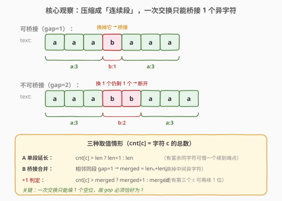
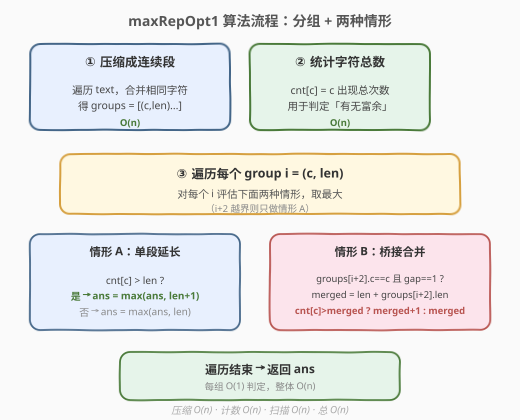
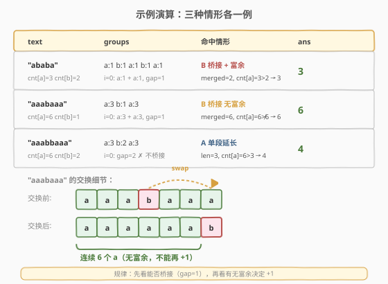

# 单字符重复子串的最大长度

- **题目名称**：单字符重复子串的最大长度
- **链接**：[1156. 单字符重复子串的最大长度](https://leetcode.cn/problems/swap-for-longest-repeated-character-substring/)
- **难度**：中等
- **标签**：字符串、数组、贪心

## 1. 题目概述

如果字符串中的所有字符都相同，那么这个字符串是**单字符重复的字符串**。

给你一个字符串 `text`，你**只能交换其中两个字符一次**（或者什么都不做），然后得到一些单字符重复的子串。返回其中**最长的子串的长度**。

**示例 1**：

```text
输入：text = "ababa"
输出：3
```

**示例 2**：

```text
输入：text = "aaabaaa"
输出：6
```

**示例 3**：

```text
输入：text = "aaabbaaa"
输出：4
```

**示例 4**：

```text
输入：text = "aaaaa"
输出：5
```

**示例 5**：

```text
输入：text = "abcdef"
输出：1
```

**约束条件**：

- `1 <= text.length <= 20000`
- `text` 仅由小写英文字母组成

> 💡 题眼在「**只交换一次**」：这意味着我们最多能把**一个**异字符换成目标字符。要让两段同字符连起来，中间的「障碍」必须恰好是 1 个字符——这是整道题的突破口。

---

## 2. 解题思路

### 2.1 暴力思路

枚举每一对下标 `(i, j)` 进行交换（`O(n^2)` 种），每次交换后扫描整串求最长同字符连续段（`O(n)`），总复杂度 `O(n^3)`。`n` 可达 `20000`，必然超时。

### 2.2 核心观察：压缩成连续段 + 桥接 1 个异字符



**第一步：把字符串压缩成「连续段」**。把相邻相同字符合并成一个个 run，例如 `"aaabaaa"` → `[(a,3), (b,1), (a,3)]`。这样整个串的结构一眼可见，且每段长度就是要维护的答案候选。

**第二步：认清「一次交换」能做什么**。一次交换能且只能把**一个**异字符换成目标字符 `c`。于是对于字符 `c` 的某个连续段，我们只有两种增益方式：

- **情形 A（单段延长）**：段长 `len`，若全串中 `c` 的总数 `cnt[c] > len`（说明别处还有 `c`），可以借一个 `c` 续到本段端点 → 得到 `len + 1`；若 `cnt[c] == len`（所有 `c` 已在本段），无法延长 → `len`。
- **情形 B（桥接合并）**：若存在两段同字符 `c` 之间**只隔 1 个异字符**（即 `groups[i+1].len == 1` 且 `groups[i+2].c == c`），把这 1 个异字符换掉即可把两段焊成一段 → `merged = len₁ + len₂`。换掉的字符从哪来？要么从「第三处」借一个 `c`（若 `cnt[c] > merged`，焊上后还能再续 1 位 → `merged + 1`），要么干脆把这两段中某端的一个 `c` 挪来填坑（`cnt[c] == merged` 时焊上但总数不增 → `merged`）。

> ⚠️ **为什么 gap 必须恰好为 1？** 因为一次交换只能改变**一个**位置的字符。若两段 `c` 之间隔了 2 个异字符（如 `"aa·bb·aa"`），换掉其中一个 `b` 后中间仍是 `"ab"`，两段依然断开，无法连成单字符重复串。所以**只有 `gap == 1` 才能桥接**，这是情形 B 的硬性前提。

> 💡 **`cnt[c] == merged` 时为什么仍是 `merged` 而非 `merged - 1`？** 以 `"aaabaaa"` 为例：`a:3` 与 `a:3` 间夹一个 `b`，`cnt[a]=6 = 3+3`。把末尾的 `a` 与中间 `b` 交换得到 `"aaaaaab"`，前 6 个全是 `a`——既填了坑又没损失（被换走的是焊合段最外端的 `a`，本就在计数内）。所以无富余时仍可得满 `merged`，只是不能再 `+1`。

### 2.3 算法流程图



整体一次线性扫描：先压缩成段、统计字符总数，再对每个段 `O(1)` 判定情形 A 与情形 B，取所有候选的最大值。

### 2.4 示例演算



三个示例分别命中三种情形：

- **`"ababa"`** → `a:1 b:1 a:1 b:1 a:1`，`i=0` 处 `a:1` 与 `a:1` 间 gap=1，`merged=2`，`cnt[a]=3 > 2` → 再续 1 位得 **3**。
- **`"aaabaaa"`** → `a:3 b:1 a:3`，`i=0` 处 gap=1，`merged=6`，`cnt[a]=6 ≯ 6` → **6**（无富余，不能再 `+1`）。
- **`"aaabbaaa"`** → `a:3 b:2 a:3`，`i=0` 处 gap=2 **不能桥接**；退化为情形 A：`len=3`，`cnt[a]=6 > 3` → **4**。

> 💡 关键对比：`"aaabaaa"` 与 `"aaabbaaa"` 的 `a` 总数都是 6，但前者中间只隔 1 个 `b` 可焊成 6，后者隔 2 个 `b` 焊不动，只能从单段延长到 4。**gap 是否为 1 决定了能否「借势合并」**。

---

## 3. 参考代码

### C++

```cpp
class Solution {
public:
    int maxRepOpt1(string text) {
        int n = text.size();
        // 压缩成连续段 groups[i] = {字符, 长度}
        vector<pair<char,int>> groups;
        for (int i = 0; i < n; ) {
            int j = i;
            while (j < n && text[j] == text[i]) j++;
            groups.push_back({text[i], j - i});
            i = j;
        }
        // 统计每个字符总数
        int cnt[26] = {0};
        for (char c : text) cnt[c - 'a']++;

        int ans = 0;
        for (int i = 0; i < (int)groups.size(); i++) {
            char c = groups[i].first;
            int len = groups[i].second;
            // 情形 A：单段延长（有富余同字符可借一个续到端点）
            ans = max(ans, len + (cnt[c - 'a'] > len ? 1 : 0));
            // 情形 B：跨 1 个异字符桥接相邻同段
            if (i + 2 < (int)groups.size()
                && groups[i + 1].second == 1
                && groups[i + 2].first == c) {
                int merged = len + groups[i + 2].second;
                if (cnt[c - 'a'] > merged) merged++;   // 还有第三个 c 可再续 1 位
                ans = max(ans, merged);
            }
        }
        return ans;
    }
};
```

### Python

```python
from itertools import groupby
from collections import Counter


class Solution:
    def maxRepOpt1(self, text: str) -> int:
        cnt = Counter(text)
        groups = [(c, len(list(g))) for c, g in groupby(text)]

        ans = 0
        for i, (c, length) in enumerate(groups):
            # 情形 A：单段延长
            ans = max(ans, length + (1 if cnt[c] > length else 0))
            # 情形 B：跨 1 个异字符桥接相邻同段
            if (i + 2 < len(groups)
                    and groups[i + 1][1] == 1
                    and groups[i + 2][0] == c):
                merged = length + groups[i + 2][1]
                if cnt[c] > merged:
                    merged += 1
                ans = max(ans, merged)
        return ans
```

> ⚠️ **两个判定条件的含义**：
> - `cnt[c] > len`：除本段外**别处还有** `c`，能借一个续到端点。`cnt[c] == len` 表示所有 `c` 已在本段，无富余。
> - `groups[i+1].second == 1`：两段同字符 `c` 之间的异字符段**恰好长 1**，是可被一次交换填平的「单空位」。

---

## 4. 复杂度分析

| 维度 | 复杂度 | 说明 |
|------|--------|------|
| 时间复杂度 | $O(n)$ | 压缩、计数、扫描各一遍，每个 group `O(1)` 判定 |
| 空间复杂度 | $O(n)$ | `groups` 数组最多 `n` 段（字符交替时）；`cnt` 为 $O(1)$（26 字母） |

`n = 20000`，单次线性扫描毫无压力。对比暴力 `O(n^3)`，关键在于**用「连续段」抽象掉了字符级细节**——我们不再关心每个具体下标，只关心段长与段间间隔。

---

## 5. 扩展：若允许交换 k 次怎么做？

本题是「交换 1 次」的特例。若放宽为「至多交换 k 次」，思路可推广：

- 桥接条件从「gap == 1」放宽为「两段同字符 `c` 之间的异字符总数 $\le$ 剩余可用交换次数 + 富余 `c` 数」。即把中间所有异字符段累加，看能否在 `k` 次内填平。
- 这退化为「**滑动窗口 + 字符计数**」：对每个目标字符 `c` 维护窗口，窗口内非 `c` 字符数 $\le k$ 且窗口外仍有足够 `c` 可借入，求最大窗口。复杂度 $O(26n)$。

> 💡 本题 `k = 1` 时窗口法同样适用，但「连续段 + 桥接」写法更直观、常数更小，且把「能否焊合」的几何意义（gap 是否为 1）表达得最清晰。

---

## 6. 面试要点

1. **为什么把字符串压缩成连续段是关键？**

   > 题目只关心「同字符连续段」的长度，而不关心段内每个具体位置。压缩后，整串结构变成 `(字符, 长度)` 序列，段长即天然答案候选，段间间隔（gap）一眼可读——「能否桥接」直接变成「gap 是否为 1」的判断，把字符级问题降维成段级问题。

2. **情形 B 为什么要求 `groups[i+1].len == 1`？**

   > 一次交换只能改变一个位置的字符。若两段同字符之间隔了多个异字符，换掉一个后中间仍残留异字符，两段依旧断开，无法连成单字符重复串。只有 gap 恰为 1，一次交换才能彻底填平这个空位。

3. **`cnt[c] > merged` 时为什么能再 `+1`？**

   > `merged = len₁ + len₂` 是焊合两段后的长度。若 `cnt[c] > merged`，说明除这两段外**别处还有** `c`，可以再借一个续到焊合段端点，长度变 `merged + 1`。若 `cnt[c] == merged`，所有 `c` 已在这两段内，焊上即满，无法再续。

4. **`"aaabaaa"` 答案是 6 而非 7，为什么？**

   > 全串只有 6 个 `a`。交换末尾 `a` 与中间 `b` 得 `"aaaaaab"`，最长同字符段为 6。即便桥接成功，受 `cnt[a]=6` 总量限制，不可能超过 6。这体现了 `cnt[c]` 是答案的「天花板」。

5. **情形 A 在什么情况下是最终答案？**

   > 当所有同字符段之间 gap $\ge 2$（无法桥接）时，只能退化为单段延长。如 `"aaabbaaa"`：`a:3` 与 `a:3` 间隔两个 `b`，桥接失败，取 `len + 1 = 4`。面试中写代码时可让情形 A 恒做（每个段都先尝试延长），情形 B 作为额外增益取 max，逻辑最简洁。

> 💡 **一句话总结**：1156 是「连续段压缩 + 一次交换的几何意义」——把串压成 `(c,len)` 段序列后，「能否合并两段」等价于「gap 是否为 1」，「能否再续 1 位」等价于「是否还有富余的 `c`」。两种情形各 `O(1)` 判定，一次扫描得解。

---

## 7. 同类练习题

- [424. 替换后的最长重复字符](https://leetcode.cn/problems/longest-repeating-character-replacement/)：本题的 k 次推广版——滑动窗口内允许替换 k 个字符，求最长同字符段，套路一脉相承
- [1446. 连续字符](https://leetcode.cn/problems/consecutive-characters/)：连续段压缩的裸题（只求最长连续段，无交换），可作为本题的前置练习
- [1864. 构成交替字符串需要的最小交换次数](https://leetcode.cn/problems/minimum-number-of-swaps-to-make-the-binary-string-alternating/)：同为「交换字符改变串结构」，但目标是交替模式而非单一重复，对比两种「一次交换」的几何效果
- [3. 无重复字符的最长子串](https://leetcode.cn/problems/longest-substring-without-repeating-characters/)（[题解](../0001-0100/3_无重复字符的最长子串.md)）：同属字符串连续段 / 窗口类问题，对照「维护区间性质」的不同切入点
