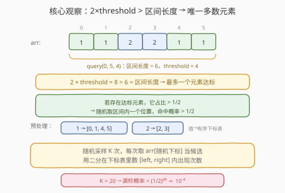
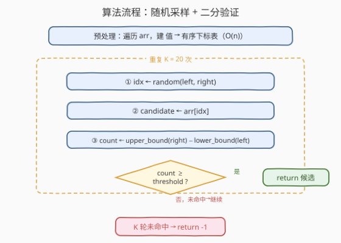
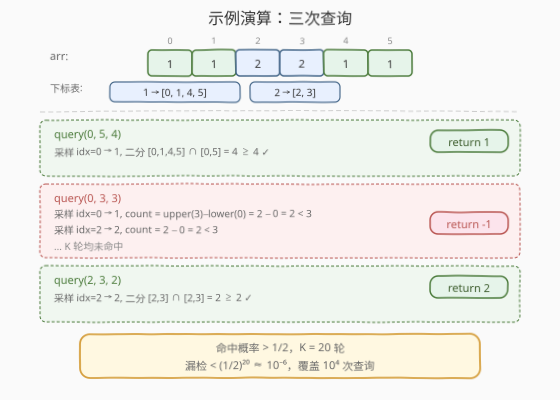

# 子数组中占绝大多数的元素

- **题目名称**：子数组中占绝大多数的元素
- **链接**：[1157. 子数组中占绝大多数的元素](https://leetcode.cn/problems/online-majority-element-in-subarray/)
- **难度**：困难
- **标签**：设计、数组、二分查找、随机化

## 1. 题目概述

设计一个数据结构，有效地找到给定子数组的**多数元素**。子数组的**多数元素**是在子数组中出现 `threshold` 次数或次数以上的元素。

实现 `MajorityChecker` 类：

- `MajorityChecker(int[] arr)`：用给定数组 `arr` 初始化。
- `int query(int left, int right, int threshold)`：返回子数组 `arr[left...right]` 中至少出现 `threshold` 次的元素，若不存在则返回 `-1`。

**示例 1**：

```text
输入：
["MajorityChecker", "query", "query", "query"]
[[[1, 1, 2, 2, 1, 1]], [0, 5, 4], [0, 3, 3], [2, 3, 2]]
输出：[null, 1, -1, 2]

解释：
MajorityChecker majorityChecker = new MajorityChecker([1,1,2,2,1,1]);
majorityChecker.query(0,5,4); // 返回 1
majorityChecker.query(0,3,3); // 返回 -1
majorityChecker.query(2,3,2); // 返回 2
```

**约束条件**：

- $1 \le \text{arr.length} \le 2 \times 10^4$
- $1 \le \text{arr[i]} \le 2 \times 10^4$
- $0 \le \text{left} \le \text{right} < \text{arr.length}$
- $\text{threshold} \le \text{right} - \text{left} + 1$
- $2 \times \text{threshold} > \text{right} - \text{left} + 1$
- 调用 `query` 的次数最多为 $10^4$

> 💡 最后一条约束 $2 \times \text{threshold} > \text{right} - \text{left} + 1$ 是整道题的钥匙——它意味着**达标元素（若存在）占比严格超过一半**，因此**至多只有一个**。这一唯一性是后续随机化算法成立的根基。

---

## 2. 解题思路

### 2.1 暴力思路：逐次线性扫描计数

最直觉的做法：每次 `query(left, right, threshold)` 时遍历 `arr[left..right]`，用哈希表统计每个值的出现次数，找到满足 $\ge \text{threshold}$ 的元素。

> ⚠️ 此法每次查询 $O(n)$，$10^4$ 次查询最坏 $O(n \times q) = 2 \times 10^8$，且完全没有利用约束条件。面试中需要指出瓶颈并提出优化。

### 2.2 核心观察：约束保证唯一性 → 随机化命中

关键约束 $2 \times \text{threshold} > \text{right} - \text{left} + 1$ 带来两个推论：

1. **唯一性**：若两个元素各出现 $\ge \text{threshold}$ 次，总次数 $\ge 2 \times \text{threshold} > \text{right} - \text{left} + 1$，超出区间长度，矛盾。故**至多一个**达标元素。
2. **占比过半**：若达标元素存在，其频率 $\ge \text{threshold} > \frac{\text{right} - \text{left} + 1}{2}$，即**严格过半**。

占比过半意味着：**在区间内随机取一个位置，取到该元素的概率 $> 1/2$**。于是只需随机采样少量次数，就极大概率命中候选；再用二分查找精确计数验证即可。



**预处理**：建一张「值 → 有序下标表」的哈希映射。由于遍历时下标天然递增，每个值对应的下标列表自动有序，无需额外排序。有了这张表，求某值在 $[\text{left}, \text{right}]$ 内的出现次数只需两次二分：

$$\text{count} = \text{upper\_bound}(\text{right}) - \text{lower\_bound}(\text{left})$$

> 💡 这与 [1150. 检查一个数是否在数组中占绝大多数](1150_检查一个数是否在数组中占绝大多数.md) 中的「有序数组 + 二分数次数」是同一技法，区别在于 1150 的数组本身有序、只需查一个 `target`，而本题数组无序、需先建下标表再二分。

### 2.3 算法流程图



**完整步骤**：

1. **预处理**（构造函数）：遍历 `arr`，对每个值收集其所有出现下标，存入 `pos[value]`（自动有序）。时间 $O(n)$，空间 $O(n)$。
2. **查询** `query(left, right, threshold)`：
   - 重复 $K = 20$ 次：
     - 随机取 $\text{idx} \in [\text{left}, \text{right}]$，令 $\text{candidate} = \text{arr}[\text{idx}]$。
     - 在 $\text{pos}[\text{candidate}]$ 上二分：$\text{count} = \text{upper\_bound}(\text{right}) - \text{lower\_bound}(\text{left})$。
     - 若 $\text{count} \ge \text{threshold}$，返回 `candidate`。
   - $K$ 轮均未命中，返回 `-1`。

> ⚠️ **为什么 $K = 20$ 足够？** 若达标元素存在，每次采样命中概率 $> 1/2$，$K$ 次全漏概率 $< (1/2)^K$。取 $K = 20$，漏检概率 $< (1/2)^{20} \approx 9.5 \times 10^{-7}$。$10^4$ 次查询的期望漏检数 $< 10^4 \times 10^{-6} = 0.01$，即几乎不可能出错。

### 2.4 示例演算

以 `arr = [1, 1, 2, 2, 1, 1]` 为例，预处理得到下标表：$1 \to [0, 1, 4, 5]$，$2 \to [2, 3]$。



**查询 1**：`query(0, 5, 4)`，区间 $[0,5]$ 长度 6，$2 \times 4 = 8 > 6$。

- 随机采样，假设取到 $\text{idx}=0$，$\text{candidate}=1$。
- $\text{pos}[1] = [0,1,4,5]$，$\text{lower\_bound}(0) = 0$，$\text{upper\_bound}(5) = 4$，$\text{count} = 4$。
- $4 \ge 4$ ✓ → **返回 1**。

**查询 2**：`query(0, 3, 3)`，区间 $[0,3]$ 长度 4，$2 \times 3 = 6 > 4$。

- 采样 $\text{idx}=0$，$\text{candidate}=1$，$\text{count} = \text{upper\_bound}(3) - \text{lower\_bound}(0) = 2 - 0 = 2 < 3$。
- 采样 $\text{idx}=2$，$\text{candidate}=2$，$\text{pos}[2]=[2,3]$，$\text{count} = 2 - 0 = 2 < 3$。
- $K$ 轮均未命中 → **返回 -1**。

**查询 3**：`query(2, 3, 2)`，区间 $[2,3]$ 长度 2，$2 \times 2 = 4 > 2$。

- 采样 $\text{idx}=2$，$\text{candidate}=2$，$\text{count} = \text{upper\_bound}(3) - \text{lower\_bound}(2) = 2 - 0 = 2$。
- $2 \ge 2$ ✓ → **返回 2**。

---

## 3. 参考代码

### 方法一：随机采样 + 二分验证（推荐）

### C++

```cpp
class MajorityChecker {
private:
    vector<int> arr;
    unordered_map<int, vector<int>> pos;  // 值 -> 有序下标表
    mt19937 rng;
public:
    MajorityChecker(vector<int>& arr) : arr(arr) {
        for (int i = 0; i < (int)arr.size(); ++i) {
            pos[arr[i]].push_back(i);  // 下标递增，自动有序
        }
        rng.seed(chrono::steady_clock::now().time_since_epoch().count());
    }

    int query(int left, int right, int threshold) {
        int len = right - left + 1;
        for (int k = 0; k < 20; ++k) {
            int idx = left + (int)(rng() % len);  // 随机取 [left, right] 内下标
            int candidate = arr[idx];
            auto& v = pos[candidate];
            int cnt = upper_bound(v.begin(), v.end(), right)
                    - lower_bound(v.begin(), v.end(), left);
            if (cnt >= threshold) return candidate;
        }
        return -1;
    }
};
```

### Python

```python
import bisect
import random
from collections import defaultdict

class MajorityChecker:
    def __init__(self, arr: List[int]):
        self.arr = arr
        self.pos = defaultdict(list)
        for i, x in enumerate(arr):
            self.pos[x].append(i)  # 下标递增，自动有序

    def query(self, left: int, right: int, threshold: int) -> int:
        for _ in range(20):
            idx = random.randint(left, right)
            candidate = self.arr[idx]
            v = self.pos[candidate]
            lo = bisect.bisect_left(v, left)
            hi = bisect.bisect_right(v, right)
            if hi - lo >= threshold:
                return candidate
        return -1
```

> 💡 **写法要点**：① 预处理时按下标顺序遍历，每个 `pos[value]` 天然有序，无需排序。② 二分数次数用 `upper_bound(right) - lower_bound(left)`，即 [34. 在排序数组中查找元素的第一个和最后一个位置](https://leetcode.cn/problems/find-first-and-last-position-of-element-in-sorted-array/) 的经典模板。③ C++ 用 `mt19937` 高质量随机数引擎，Python 用 `random.randint`，均能保证足够的随机性。

> 💡 **优化提示**：可在采样时维护一个 `seen` 集合跳过已验证过的候选值，避免对同一值重复二分。当区间内不同值较少时（极端情况全相同），一轮即可确定答案，剩余轮次直接跳过。

---

## 4. 复杂度分析

| 维度 | 方法 | 复杂度 | 说明 |
|------|------|--------|------|
| 时间复杂度 | 预处理 | $O(n)$ | 一次遍历建下标表 |
| 空间复杂度 | 预处理 | $O(n)$ | 下标表存所有下标 |
| 时间复杂度 | 单次查询 | $O(K \log n)$ | $K=20$ 次采样，每次两次二分 |
| 空间复杂度 | 单次查询 | $O(1)$ | 仅常数变量（不含预处理） |

> ⚠️ 本题 $n \le 2 \times 10^4$，$q \le 10^4$。随机化方法总时间 $O(n + qK\log n) \approx 2 \times 10^4 + 10^4 \times 20 \times 15 \approx 3 \times 10^6$，远优于暴力的 $2 \times 10^8$。漏检概率 $< 10^{-6}$，实际运行中几乎不会出错。

---

## 5. 扩展：线段树 + Boyer-Moore 多数投票（确定性解法）

随机化方法虽简洁高效，但理论上存在极小概率出错。若需要**确定性**保证，可用**线段树 + Boyer-Moore 多数投票**。

**核心思想**：Boyer-Moore 投票算法能在 $O(n)$ 内找出数组的多数候选——维护 `(candidate, count)`，遇相同则 `count++`，遇不同则 `count--`，归零则换候选。这一合并操作满足**结合律**，可以嵌入线段树的节点合并中。

**节点定义**：每个线段树节点存储 `(val, cnt)`，表示该区间经投票抵消后的剩余候选与票数。

**合并规则**：

$$\text{merge}((a, c_a), (b, c_b)) = \begin{cases} (a, c_a + c_b) & \text{if } a = b \\ (a, c_a - c_b) & \text{if } c_a \ge c_b \\ (b, c_b - c_a) & \text{otherwise} \end{cases}$$

**查询**：对 $[\text{left}, \text{right}]$ 做线段树区间查询得到候选 `(val, cnt)`，再用下标表二分精确计数验证。

### C++

```cpp
class MajorityChecker {
    struct Node { int val, cnt; };
    vector<int> arr;
    unordered_map<int, vector<int>> pos;
    vector<Node> tree;
    int n;

    Node merge(const Node& a, const Node& b) {
        if (a.val == b.val) return {a.val, a.cnt + b.cnt};
        if (a.cnt >= b.cnt) return {a.val, a.cnt - b.cnt};
        return {b.val, b.cnt - a.cnt};
    }

    void build(int o, int l, int r) {
        if (l == r) { tree[o] = {arr[l], 1}; return; }
        int m = (l + r) / 2;
        build(2 * o, l, m);
        build(2 * o + 1, m + 1, r);
        tree[o] = merge(tree[2 * o], tree[2 * o + 1]);
    }

    Node queryTree(int o, int l, int r, int L, int R) {
        if (L <= l && r <= R) return tree[o];
        int m = (l + r) / 2;
        if (R <= m) return queryTree(2 * o, l, m, L, R);
        if (L > m)  return queryTree(2 * o + 1, m + 1, r, L, R);
        return merge(queryTree(2 * o, l, m, L, R),
                     queryTree(2 * o + 1, m + 1, r, L, R));
    }

public:
    MajorityChecker(vector<int>& arr) : arr(arr) {
        n = arr.size();
        for (int i = 0; i < n; ++i) pos[arr[i]].push_back(i);
        tree.resize(4 * n);
        build(1, 0, n - 1);
    }

    int query(int left, int right, int threshold) {
        Node res = queryTree(1, 0, n - 1, left, right);
        auto& v = pos[res.val];
        int cnt = upper_bound(v.begin(), v.end(), right)
                - lower_bound(v.begin(), v.end(), left);
        return cnt >= threshold ? res.val : -1;
    }
};
```

> 💡 **为什么投票候选需要验证？** Boyer-Moore 投票保证：**若多数元素存在，它一定是投票剩余的候选**；但候选不一定真的是多数（如 `[1,2,3]` 投票后剩 `3`，但 `3` 不过半）。因此必须用二分精确计数验证。这与 [169. 多数元素](https://leetcode.cn/problems/majority-element/) 不同——169 题保证多数一定存在，无需验证。

| 维度 | 随机化 | 线段树 |
|------|--------|--------|
| 预处理 | $O(n)$ | $O(n)$ |
| 单次查询 | $O(K \log n)$，$K=20$ | $O(\log n)$ |
| 正确性 | 高概率正确（$\ge 1 - 10^{-6}$） | 确定性正确 |
| 代码量 | 短，易实现 | 较长，需写线段树 |
| 适用场景 | 面试首选，简洁高效 | 要求确定性保证 |

---

## 6. 面试要点

1. **约束 $2 \times \text{threshold} > \text{len}$ 的作用是什么？**

   > 它保证达标元素（若存在）占比严格过半，因此至多只有一个。占比过半意味着随机采样命中概率 $> 1/2$，这是随机化算法的理论基础。没有这条约束，多个元素可能同时达标，随机化无法保证快速命中。

2. **为什么 $K = 20$ 就够了？**

   > 达标元素频率 $> 1/2$，每次采样命中概率 $> 1/2$。$K$ 次全漏概率 $< (1/2)^K$。$K = 20$ 时漏检率 $< 10^{-6}$，$10^4$ 次查询期望漏检 $< 0.01$。即使取 $K = 30$ 也只是多几轮常数开销，但 $20$ 已足够安全。

3. **预处理为什么要建「值 → 有标表」而不是别的结构？**

   > 按值分组存下标，使得「某值在 $[\text{left}, \text{right}]$ 内出现几次」可通过两次二分 $O(\log n)$ 完成，无需线性扫描。遍历时下标递增，列表自动有序，预处理仅 $O(n)$。

4. **Boyer-Moore 投票为什么能嵌入线段树？**

   > 投票的合并操作（相同累加、不同相消）满足**结合律**：无论按什么顺序合并区间，最终候选相同。因此可把它作为线段树节点的合并函数，支持 $O(\log n)$ 区间查询候选。但候选需验证——投票只保证「若多数存在则候选正确」，不保证多数一定存在。

5. **随机化方法和线段树方法各自的优势？**

   > 随机化代码简洁、常数小、面试易写对，但理论上有极小概率出错；线段树确定性正确、查询严格 $O(\log n)$，但代码量大。实际面试中随机化方法更受青睐——简洁且足够可靠。

> 💡 **一句话总结**：1157 的钥匙是约束 $2 \times \text{threshold} > \text{len}$——它带来唯一性和占比过半，使随机采样成为可能；预处理建下标表把「数次数」从线性降到对数，$K = 20$ 轮采样即可高概率命中。

---

## 7. 同类练习题

- [169. 多数元素](https://leetcode.cn/problems/majority-element/)：无序数组求多数元素（保证存在），Boyer-Moore 投票 $O(n)$，是本题线段树解法的投票合并基础
- [1150. 检查一个数是否在数组中占绝大多数](https://leetcode.cn/problems/check-if-a-number-is-majority-element-in-a-sorted-array/)（[题解](1150_检查一个数是否在数组中占绝大多数.md)）：有序数组判定多数，二分 + 单点验证 $O(\log n)$，与本题「二分数次数」同源
- [34. 在排序数组中查找元素的第一个和最后一个位置](https://leetcode.cn/problems/find-first-and-last-position-of-element-in-sorted-array/)：`lower_bound` + `upper_bound` 双二分求精确次数，是本题下标表计数的核心模板
- [398. 随机数索引](https://leetcode.cn/problems/random-pick-index/)（[题解](../0301-0400/398_随机数索引.md)）：蓄水池抽样 $R$ 算法，与本题同为「随机化 + 概率分析」范式
- [528. 按权重随机选择](https://leetcode.cn/problems/random-pick-with-weight/)（[题解](../0501-0600/528_按权重随机选择.md)）：前缀和 + 二分实现加权随机采样，与本题「随机化 + 二分」组合同构
