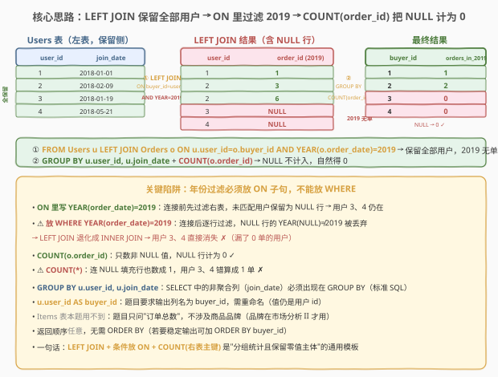
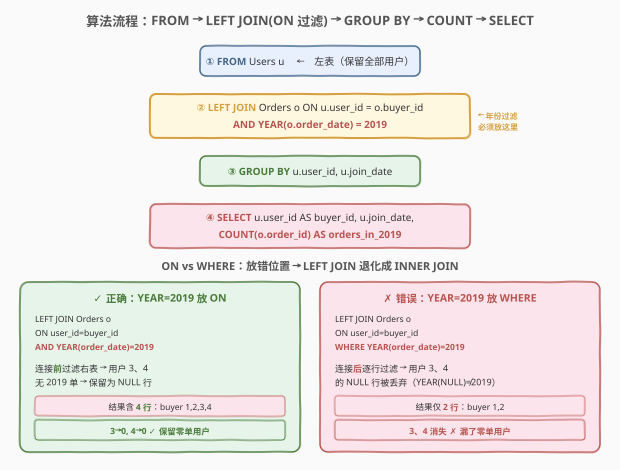
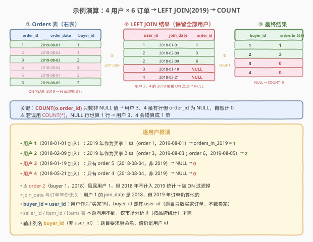

# 市场分析 I

- **题目名称**：市场分析 I
- **链接**：[1158. 市场分析 I](https://leetcode.cn/problems/market-analysis-i/)
- **难度**：中等
- **标签**：SQL、LEFT JOIN、条件放 ON、COUNT 与 NULL、GROUP BY、列别名

## 1. 题目概述

给定购物网站的 `Users`、`Orders`、`Items` 三张表，编写 SQL 查询，找出**每个用户**的注册日期（`join_date`）和其在 **`2019` 年作为买家**的订单总数。结果以任意顺序返回。

**表结构**：

```text
Table: Users
+----------------+---------+
| Column Name    | Type    |
+----------------+---------+
| user_id        | int     |  ← 主键
| join_date      | date    |
| favorite_brand | varchar |
+----------------+---------+

Table: Orders
+---------------+---------+
| Column Name   | Type    |
+---------------+---------+
| order_id      | int     |  ← 主键
| order_date    | date    |
| item_id       | int     |  ← Items 外键
| buyer_id      | int     |  ← Users 外键
| seller_id     | int     |  ← Users 外键
+---------------+---------+

Table: Items
+---------------+---------+
| Column Name   | Type    |
+---------------+---------+
| item_id       | int     |  ← 主键
| item_brand    | varchar |
+---------------+---------+
```

> ⚠️ 题目要求「每个用户」都出现在结果中——即便某用户在 2019 年没有任何买家订单，也必须输出一行且 `orders_in_2019 = 0`。这正是本题的隐含要求，也是为什么必须用 `LEFT JOIN` 而非 `INNER JOIN`。

**示例 1**：

```text
输入：
Users 表:
+---------+------------+----------------+
| user_id | join_date  | favorite_brand |
+---------+------------+----------------+
| 1       | 2018-01-01 | Lenovo         |
| 2       | 2018-02-09 | Samsung        |
| 3       | 2018-01-19 | LG             |
| 4       | 2018-05-21 | HP             |
+---------+------------+----------------+
Orders 表:
+----------+------------+---------+----------+-----------+
| order_id | order_date | item_id | buyer_id | seller_id |
+----------+------------+---------+----------+-----------+
| 1        | 2019-08-01 | 4       | 1        | 2         |
| 2        | 2018-08-02 | 2       | 1        | 3         |
| 3        | 2019-08-03 | 3       | 2        | 3         |
| 4        | 2018-08-04 | 1       | 4        | 2         |
| 5        | 2018-08-04 | 1       | 3        | 4         |
| 6        | 2019-08-05 | 2       | 2        | 4         |
+----------+------------+---------+----------+-----------+
Items 表:
+---------+------------+
| item_id | item_brand |
+---------+------------+
| 1       | Samsung    |
| 2       | Lenovo     |
| 3       | LG         |
| 4       | HP         |
+---------+------------+

输出：
+-----------+------------+----------------+
| buyer_id  | join_date  | orders_in_2019 |
+-----------+------------+----------------+
| 1         | 2018-01-01 | 1              |
| 2         | 2018-02-09 | 2              |
| 3         | 2018-01-19 | 0              |
| 4         | 2018-05-21 | 0              |
+-----------+------------+----------------+
```

**解释**：

| 用户 | join_date | 2019 年买家订单 | orders_in_2019 | 说明 |
|------|-----------|-----------------|----------------|------|
| 1 | 2018-01-01 | order 1（2019-08-01） | 1 | order 2 虽是 buyer 1，但 2018 年不计入 |
| 2 | 2018-02-09 | order 3（2019-08-03）、order 6（2019-08-05） | 2 | 2 笔 2019 年订单 |
| 3 | 2018-01-19 | 无 | 0 | 仅有 order 5（2018-08-04），非 2019 年 |
| 4 | 2018-05-21 | 无 | 0 | 仅有 order 4（2018-08-04），非 2019 年 |

**约束条件**：

- `Users.user_id`、`Orders.order_id`、`Items.item_id` 均为主键
- `(buyer_id, seller_id)` 是 `Users` 的外键，`item_id` 是 `Items` 的外键
- 结果需包含**所有用户**（含 2019 年 0 单者），以任意顺序返回
- 输出列名：`buyer_id`、`join_date`、`orders_in_2019`（注意 `user_id` 需重命名为 `buyer_id`）

> 💡 本题是 SQL **"LEFT JOIN + 条件聚合 + 保留零值主体"招牌题**——核心就两句：`LEFT JOIN ... ON user_id = buyer_id AND YEAR(order_date) = 2019`，再 `GROUP BY user_id` 配 `COUNT(o.order_id)`。考点全部集中在两个陷阱：① 年份过滤必须写进 `ON` 子句而非 `WHERE`，否则 `LEFT JOIN` 退化成 `INNER JOIN`，2019 年 0 单的用户会被丢掉；② 必须用 `COUNT(o.order_id)` 而非 `COUNT(*)`，否则未匹配用户的 `NULL` 填充行会被错算成 1 单。

---

## 2. 解题思路

### 2.1 暴力思路：嵌套循环逐用户统计

最直觉的过程式思路：遍历 `Users` 表的每个用户，对该用户再遍历 `Orders` 表，数出 `buyer_id = user_id 且 YEAR(order_date) = 2019` 的订单数；若无匹配则记 0。伪代码如下：

```text
result = []
for u in Users:
    cnt = 0
    for o in Orders:
        if o.buyer_id == u.user_id and YEAR(o.order_date) == 2019:
            cnt += 1
    result.append((u.user_id, u.join_date, cnt))
return result
```

但**纯 SQL 没有显式逐行循环**——需要换成集合式表达。外层「遍历每个用户并保留」对应 `FROM Users`（左表，`LEFT JOIN` 保留侧）；内层「对每个用户统计满足条件的订单数」对应 `LEFT JOIN Orders` 后按用户分组聚合。关键在于：条件 `YEAR(order_date) = 2019` 是**右表 `Orders` 的过滤条件**，它决定了「哪些订单参与连接」，必须在连接阶段（`ON`）而非连接后（`WHERE`）施加。

> ⚠️ 过程式思维里「先过滤订单再关联用户」对应 SQL 的 `ON user_id = buyer_id AND YEAR(order_date) = 2019`；若写成 `WHERE YEAR(order_date) = 2019`，语义变成「连接完成后再从结果里挑 2019 年的行」——两者在 `INNER JOIN` 下等价，但在 `LEFT JOIN` 下天差地别。

### 2.2 核心观察：LEFT JOIN + 条件放 ON + COUNT(order_id)



**三个关键点**：

1. **`LEFT JOIN` 保留全部用户**：题目要求「每个用户」都出现，包括 2019 年 0 单者。`Users` 作为左表，`LEFT JOIN` 保证左表每一行都出现在结果中，右表无匹配时右表列填 `NULL`。若用 `INNER JOIN`，用户 3、4（2019 无单）会被丢掉。

2. **年份过滤写进 `ON` 而非 `WHERE`**：`ON u.user_id = o.buyer_id AND YEAR(o.order_date) = 2019` 表示「连接前先用 2019 年过滤右表 `Orders`」，未匹配用户保留为 `order_id = NULL` 的行。若误放 `WHERE`，则「连接后才过滤」——未匹配用户的 `order_date` 为 `NULL`，`YEAR(NULL) = 2019` 不成立，该行被丢弃，`LEFT JOIN` 退化成 `INNER JOIN`。

   $$\text{ON 阶段过滤右表} \;\Rightarrow\; \text{未匹配用户保留为 NULL 行} \;\Rightarrow\; \text{用户 3、4 仍在结果中}$$

3. **`COUNT(o.order_id)` 而非 `COUNT(*)`**：`COUNT(列名)` 只计非 `NULL` 值，`COUNT(*)` 计所有行（含 `NULL` 填充行）。对用户 3、4，`LEFT JOIN` 产生一行 `order_id = NULL`：`COUNT(o.order_id)` 得 0（正确），`COUNT(*)` 得 1（错误）。

> 💡 **`ON` vs `WHERE` 的本质**：`ON` 是**连接条件**，决定「右表哪些行参与连接」；`WHERE` 是**过滤条件**，作用于连接后的结果集。对 `LEFT JOIN`，`ON` 中右表条件不满足时左表行仍保留（右表列置 `NULL`）；`WHERE` 中条件不满足时整行被删除。因此「只过滤右表且需保留左表全部行」的条件，必须放 `ON`。

> ⚠️ **两个致命陷阱**：
> - **年份过滤放 `WHERE`**：`LEFT JOIN` 退化成 `INNER JOIN`，2019 年 0 单的用户被丢弃，结果只剩 buyer 1、2，漏掉 buyer 3、4。
> - **用 `COUNT(*)`**：未匹配用户的 `NULL` 填充行被算作 1，用户 3、4 错算成 1 单而非 0。

### 2.3 算法流程图



**逻辑执行步骤**：

| 步骤 | 子句 | 作用 |
|------|------|------|
| ① | `FROM Users u` | 以用户表为左表（保留全部用户） |
| ② | `LEFT JOIN Orders o ON u.user_id = o.buyer_id AND YEAR(o.order_date) = 2019` | 连接前用 2019 年过滤右表订单，未匹配用户保留为 `NULL` 行 |
| ③ | `GROUP BY u.user_id, u.join_date` | 按用户分组（`join_date` 是非聚合列，须出现在 `GROUP BY`） |
| ④ | `SELECT u.user_id AS buyer_id, u.join_date, COUNT(o.order_id) AS orders_in_2019` | 投影并重命名列，`COUNT` 只数非 `NULL` 值，自然得 0 |

> 💡 **SQL 子句执行顺序**：`FROM`（含 `JOIN`/`ON`）→ `WHERE` → `GROUP BY` → `HAVING` → `SELECT`（含聚合）→ `ORDER BY` → `LIMIT`。`ON` 在 `WHERE` 之前执行——这是「`ON` 过滤右表、`WHERE` 过滤结果」顺序差异的根源。聚合函数 `COUNT` 在 `SELECT` 阶段对每个分组求值。

### 2.4 示例演算

以示例 1 数据为例，观察 `LEFT JOIN` + `COUNT` 的逐步执行过程：



**步骤 ①：`ON YEAR(o.order_date) = 2019` 过滤右表**

`Orders` 共 6 行，连接前先用 `YEAR(order_date) = 2019` 过滤右表，只保留 2019 年订单（3 行）：

| order_id | order_date | buyer_id | 保留？ | 说明 |
|----------|------------|----------|--------|------|
| 1 | 2019-08-01 | 1 | ✓ | 2019 年 |
| 2 | 2018-08-02 | 1 | ✗ | 2018 年，被 `ON` 过滤 |
| 3 | 2019-08-03 | 2 | ✓ | 2019 年 |
| 4 | 2018-08-04 | 4 | ✗ | 2018 年 |
| 5 | 2018-08-04 | 3 | ✗ | 2018 年 |
| 6 | 2019-08-05 | 2 | ✓ | 2019 年 |

> 💡 注意 order 2 虽是 buyer 1 的订单，但属 2018 年，被 `ON` 过滤掉，不计入 2019 统计。

**步骤 ②：`LEFT JOIN` 保留全部用户**

以 `Users` 为左表，对每个用户匹配过滤后的 2019 年订单，无匹配则 `order_id` 置 `NULL`：

| user_id | join_date | order_id (2019) | 说明 |
|---------|-----------|-----------------|------|
| 1 | 2018-01-01 | 1 | 匹配 order 1 |
| 2 | 2018-02-09 | 3 | 匹配 order 3 |
| 2 | 2018-02-09 | 6 | 匹配 order 6（用户 2 有两笔） |
| 3 | 2018-01-19 | NULL | 2019 无单 → NULL 填充 |
| 4 | 2018-05-21 | NULL | 2019 无单 → NULL 填充 |

> 💡 用户 3、4 虽各有 1 笔 2018 年订单，但已被 `ON` 过滤，故这里 `order_id` 为 `NULL`——这正是 `LEFT JOIN` 保留零值主体的体现。若年份过滤误放 `WHERE`，这两行会在连接后被丢弃。

**步骤 ③：`GROUP BY user_id` + `COUNT(o.order_id)`**

按用户分组并对 `order_id` 计数（`COUNT` 忽略 `NULL`）：

| buyer_id | COUNT(order_id) | orders_in_2019 | 说明 |
|----------|-----------------|----------------|------|
| 1 | 1 | 1 | 一个非 NULL 值 |
| 2 | 2 | 2 | 两个非 NULL 值（3、6） |
| 3 | 0 | 0 | 只有 NULL 行，`COUNT` 计 0 |
| 4 | 0 | 0 | 只有 NULL 行，`COUNT` 计 0 |

> 💡 **对比 `COUNT(*)` 的错误结果**：若误用 `COUNT(*)`，用户 3、4 的 `NULL` 填充行也会被算作 1 行，得到 1 而非 0。`COUNT(o.order_id)` 只数非 `NULL` 的 `order_id`，是「订单数」的准确表达——数的是「真实存在的订单」而非「结果集行数」。

最终输出与示例一致。

---

## 3. 参考代码

### SQL（解法 A：LEFT JOIN + 条件放 ON，推荐）

```sql
SELECT u.user_id AS buyer_id,
       u.join_date,
       COUNT(o.order_id) AS orders_in_2019
FROM Users u
LEFT JOIN Orders o
    ON u.user_id = o.buyer_id
    AND YEAR(o.order_date) = 2019
GROUP BY u.user_id, u.join_date;
```

> 💡 **写法要点**：
> - `LEFT JOIN`：以 `Users` 为左表，保留全部用户（含 2019 年 0 单者）。
> - `AND YEAR(o.order_date) = 2019` 写在 `ON`：连接前过滤右表订单，未匹配用户保留为 `NULL` 行。
> - `COUNT(o.order_id)`：只数非 `NULL` 的 `order_id`，`NULL` 行自然计 0。
> - `GROUP BY u.user_id, u.join_date`：`join_date` 是非聚合列，标准 SQL 要求其出现在 `GROUP BY` 中。
> - `u.user_id AS buyer_id`：按题目要求将 `user_id` 重命名为 `buyer_id`。
> - 题目允许任意顺序，故无需 `ORDER BY`（若需稳定输出可加 `ORDER BY buyer_id`）。

### SQL（解法 B：子查询预聚合 + LEFT JOIN + IFNULL）

```sql
SELECT u.user_id AS buyer_id,
       u.join_date,
       IFNULL(t.cnt, 0) AS orders_in_2019
FROM Users u
LEFT JOIN (
    SELECT buyer_id, COUNT(*) AS cnt
    FROM Orders
    WHERE YEAR(order_date) = 2019
    GROUP BY buyer_id
) t
    ON u.user_id = t.buyer_id;
```

> 💡 **写法要点**：先在子查询 `t` 内用 `WHERE YEAR(order_date) = 2019` 过滤并按 `buyer_id` 聚合出每人 2019 年订单数。**子查询内部用 `WHERE` 是安全的**——因为这里不需要保留零订单的买家（子查询只统计有订单的人）。外层 `LEFT JOIN Users` 保留全部用户，无匹配者 `t.cnt` 为 `NULL`，用 `IFNULL(..., 0)` 转成 0。
>
> 与解法 A 的区别：解法 A 把过滤条件放 `ON`（连接阶段），解法 B 把过滤条件放子查询的 `WHERE`（聚合阶段）。两者等价但思路不同——解法 B 更符合「先算中间表再关联」的过程式直觉，可读性更佳；解法 A 更紧凑、只扫一次表。性能上，现代优化器通常能将两者优化为相同执行计划。

### SQL（解法 C：LEFT JOIN 全部订单 + 条件聚合 SUM(IF)）

```sql
SELECT u.user_id AS buyer_id,
       u.join_date,
       SUM(IF(YEAR(o.order_date) = 2019, 1, 0)) AS orders_in_2019
FROM Users u
LEFT JOIN Orders o
    ON u.user_id = o.buyer_id
GROUP BY u.user_id, u.join_date;
```

> 💡 **写法要点**：`LEFT JOIN` 不在 `ON` 中过滤年份，而是连接全部订单，再用 `SUM(IF(YEAR(o.order_date) = 2019, 1, 0))` 条件聚合——满足 2019 加 1，否则加 0。对未匹配用户，`o.order_date` 为 `NULL`，`YEAR(NULL) = 2019` 为 `NULL`（假），`IF` 走 else 分支加 0，结果仍为 0。
>
> 这种写法把过滤逻辑从 `JOIN` 阶段移到 `SELECT` 阶段，避开了 `ON` vs `WHERE` 的陷阱，但需连接更多行（含非 2019 年订单），扫描成本略高。适合「同一查询需统计多个年份」的场景——例如同时算 2018、2019 两年订单数，只需加一列 `SUM(IF(YEAR=2018,1,0))`。

### Python（pandas）

```python
import pandas as pd

def market_analysis(users: pd.DataFrame, orders: pd.DataFrame, items: pd.DataFrame) -> pd.DataFrame:
    orders_2019 = orders[orders['order_date'].dt.year == 2019]
    cnt = orders_2019.groupby('buyer_id').size().reset_index(name='orders_in_2019')
    result = users.merge(cnt, left_on='user_id', right_on='buyer_id', how='left')
    result['orders_in_2019'] = result['orders_in_2019'].fillna(0).astype(int)
    return result[['buyer_id', 'join_date', 'orders_in_2019']]
```

> 💡 **pandas 对照**：
> - `orders['order_date'].dt.year == 2019` 布尔掩码对应子查询内的 `WHERE YEAR(order_date) = 2019`（先过滤右表）。
> - `groupby('buyer_id').size()` 对应 `GROUP BY buyer_id + COUNT(*)`，得到每买家 2019 年订单数。
> - `merge(..., how='left')` 对应 `LEFT JOIN`——以 `users` 为左表保留全部用户，无匹配者 `orders_in_2019` 为 `NaN`。
> - `fillna(0)` 对应 `IFNULL(t.cnt, 0)`，把 `NaN` 转成 0。
> - 思路与 SQL 解法 B 同构：先过滤聚合右表，再左连接主体表。

---

## 4. 复杂度分析

| 维度 | 解法 A（ON 过滤） | 解法 B（子查询预聚合） | 解法 C（SUM(IF)） |
|------|-------------------|------------------------|-------------------|
| **时间** | $O(n + m)$ | $O(n + m)$ | $O(n + m)$ |
| **空间** | $O(n)$ | $O(n + m)$ | $O(n + m)$ |
| **连接行数** | 仅 2019 年订单 | 仅 2019 年订单 | 全部订单 |
| **推荐度** | ✓ **首选**，紧凑 | ✓ 备选，可读性好 | ✓ 备选，适合多年份 |

> - $n$ = `Users` 行数，$m$ = `Orders` 行数
> - 三种解法时间复杂度同级：一次 `Users` 扫描 + 一次 `Orders` 扫描 + 哈希连接/聚合 $O(n + m)$
> - 解法 A/C 的 `LEFT JOIN` + `GROUP BY` 可在一次 `Orders` 扫描内完成连接与聚合；解法 B 先聚合右表（$O(m)$）再连接（$O(n)$），多一次中间物化
> - 空间：`GROUP BY` 需为每个用户维护分组，$O(n)$；解法 B 额外需存储子查询结果 $O(m)$
> - **索引优化**：在 `Orders.buyer_id` 上建索引，连接可走索引探测；`(buyer_id, order_date)` 联合索引可让 `ON buyer_id = ? AND YEAR(order_date) = 2019` 走索引范围扫描，避免全表扫描

---

## 5. 扩展：LEFT JOIN 的 ON 与 WHERE 之辨

### 5.1 两种条件的语义边界

| 维度 | `ON` 子句 | `WHERE` 子句 |
|------|-----------|--------------|
| **执行时机** | 连接阶段（`FROM`/`JOIN`） | 连接后（`FROM` 之后） |
| **作用对象** | 决定右表哪些行参与连接 | 过滤连接后的结果集 |
| **`LEFT JOIN` 中右表条件不满足** | 左表行保留，右表列置 `NULL` | 整行被删除 |
| **`INNER JOIN` 中** | 与 `WHERE` 等价 | 与 `ON` 等价 |
| **本题效果** | 2019 年 0 单用户保留为 `NULL` 行 | `NULL` 行被丢弃，退化成 `INNER JOIN` |

> 💡 **判定口诀**：**「需保留左表全部行 + 只过滤右表」放 `ON`；「过滤最终结果」放 `WHERE`**。本题要保留所有用户（左表），只取 2019 年订单（右表条件），故年份过滤必须放 `ON`。若题目改为「只输出 2019 年有订单的用户」，则应用 `INNER JOIN` 或把条件放 `WHERE`。

### 5.2 COUNT 的三种写法对比

| 写法 | 行为 | 本题对 NULL 行 | 正确？ |
|------|------|----------------|--------|
| `COUNT(o.order_id)` | 只数非 `NULL` 的 `order_id` | 计 0 | ✓ |
| `COUNT(*)` | 数所有行（含 `NULL` 填充行） | 计 1 | ✗ |
| `COUNT(1)` / `COUNT('x')` | 数所有行（常量非 `NULL`） | 计 1 | ✗ |

> 💡 **本质**：`COUNT(列名)` 统计该列非 `NULL` 值的个数；`COUNT(*)`/`COUNT(1)` 统计行数（不论列是否 `NULL`）。在 `LEFT JOIN` 产生 `NULL` 填充行时，两者结果不同。统计「右表实际匹配的记录数」必须用 `COUNT(右表列)`；统计「分组总行数」才用 `COUNT(*)`。

### 5.3 从市场分析 I 到市场分析 II

| 题目 | 需求 | 关键差异 |
|------|------|----------|
| **1158 市场分析 I** | 每用户 2019 年买家订单数 | `LEFT JOIN Orders` + `COUNT`，`Items` 表用不到 |
| 1159 市场分析 II | 每用户 2019 年购买的**自己最喜爱品牌**的订单数 | 需 `LEFT JOIN Orders` + `LEFT JOIN Items`（取 `item_brand`）+ `WHERE item_brand = favorite_brand AND YEAR = 2019` |

> 💡 1159 在 1158 基础上叠加了「商品品牌」维度——需把 `Orders` 经 `item_id` 关联到 `Items` 取 `item_brand`，再与 `Users.favorite_brand` 比较。同样是「2019 年」过滤、同样要保留 0 单用户，1158 的 `LEFT JOIN` + 条件放 `ON` + `COUNT` 模板可直接复用，只是在 `ON` 中多加 `AND item_brand = favorite_brand`。

---

## 6. 面试要点

1. **为什么年份过滤必须放 `ON` 而非 `WHERE`？**

   > `LEFT JOIN` 中，`ON` 决定右表哪些行参与连接，`WHERE` 过滤连接后的结果集。把 `YEAR(order_date) = 2019` 放 `ON`，未匹配用户保留为 `order_id = NULL` 的行；放 `WHERE`，则连接后才过滤——未匹配用户的 `order_date` 为 `NULL`，`YEAR(NULL) = 2019` 不成立，整行被丢弃，`LEFT JOIN` 退化成 `INNER JOIN`，2019 年 0 单的用户（如本题用户 3、4）从结果中消失。题目要求「每个用户」都出现，故必须放 `ON`。

2. **为什么用 `COUNT(o.order_id)` 而非 `COUNT(*)`？**

   > `LEFT JOIN` 对未匹配用户会产生一行 `order_id = NULL` 的填充行。`COUNT(*)` 数行数，会把这行算作 1，导致用户 3、4 错算成 1 单；`COUNT(o.order_id)` 只数非 `NULL` 值，`NULL` 行自然计 0。统计「右表实际匹配的记录数」必须用 `COUNT(右表列)`，这是 `LEFT JOIN` + 聚合的标准搭配。

3. **`GROUP BY` 为什么要带 `u.join_date`？不带会怎样？**

   > 标准 SQL 规定 `SELECT` 中的非聚合列必须出现在 `GROUP BY` 中。`u.join_date` 在 `SELECT` 中但未聚合，故必须列入 `GROUP BY u.user_id, u.join_date`。不带的话，严格模式（如 PostgreSQL、SQL 标准）会报错；MySQL 在 `ONLY_FULL_GROUP_BY` 关闭时会"任取一行"的 `join_date`，因 `user_id` 是主键、`join_date` 函数依赖于 `user_id`，结果碰巧正确但不规范。面试答："`user_id` 是主键，`join_date` 函数依赖于它，带上更规范、可移植。"

4. **解法 A 和解法 B 有何区别？哪个更好？**

   > 解法 A 把年份过滤放 `ON`（连接阶段），解法 B 把它放子查询的 `WHERE`（聚合阶段）。两者结果等价，现代优化器通常生成相同执行计划。解法 A 紧凑、单次扫描；解法 B 符合"先算中间表再关联"的直觉、可读性更佳，且子查询内用 `WHERE` 天然安全（不需保留零订单买家）。面试中答："简单题用 A 更简洁；复杂查询用 B 分层更清晰。"

5. **如果 `Orders` 表有上亿行，如何优化？**

   > ① 在 `Orders.buyer_id` 上建索引，`LEFT JOIN` 可走索引探测（Nested Loop Join），避免对每个用户全表扫描。② 建 `(buyer_id, order_date)` 联合索引，`ON buyer_id = ? AND YEAR(order_date) = 2019` 可走索引范围扫描，直接定位 2019 年订单。③ 若只需近似统计，可用 `HyperLogLog` 估算。④ 解法 B 的子查询可独立物化，配合索引高效聚合后再与 `Users` 小表连接。

> 💡 **一句话总结**：1158 是 SQL **"LEFT JOIN + 条件放 ON + COUNT(右表列)"招牌题**——核心陷阱两个：① 年份过滤放 `ON` 不放 `WHERE`（否则退化 `INNER JOIN` 丢零单用户）；② 用 `COUNT(o.order_id)` 不用 `COUNT(*)`（否则 `NULL` 行错算 1）。记住"`LEFT JOIN` 保留主体 + 右表条件进 `ON` + `COUNT(右表列)`"模板，所有"分组统计且保留零值主体"的 SQL 题都能套用。

---

## 7. 同类练习题

- [1159. 市场分析 II](https://leetcode.cn/problems/market-analysis-ii/)（[题解](../1101-1200/1159_市场分析II.md)）：直接姐妹题，在 1158 基础上叠加 `Items` 表关联与 `item_brand = favorite_brand` 条件，复用 `LEFT JOIN` + 条件放 `ON` 模板
- [570. 至少有 5 名直接下属的经理](https://leetcode.cn/problems/managers-with-at-least-5-direct-reports/)：`GROUP BY` + `HAVING COUNT` 过滤分组，对比 1158 理解「`WHERE` 过滤行 vs `HAVING` 过滤组」
- [1174. 即时食物配送 II](https://leetcode.cn/problems/immediate-food-delivery-ii/)：`LEFT JOIN` + 子查询求首次订单 + `AVG` 比例，同为「保留主体 + 关联右表聚合」模式
- [550. 游戏玩法分析 IV](https://leetcode.cn/problems/game-play-analysis-iv/)：`LEFT JOIN` 保留全部玩家 + 条件连接首次登录日，共享「保留零值主体」思想
- [1068. 产品销售分析 I](https://leetcode.cn/problems/product-sales-analysis-i/)：`LEFT JOIN` 两表关联 + 投影，与 1158 共享「`LEFT JOIN` 关联 + `SELECT` 投影」基础骨架
