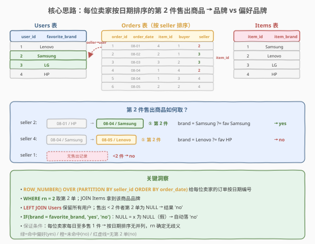
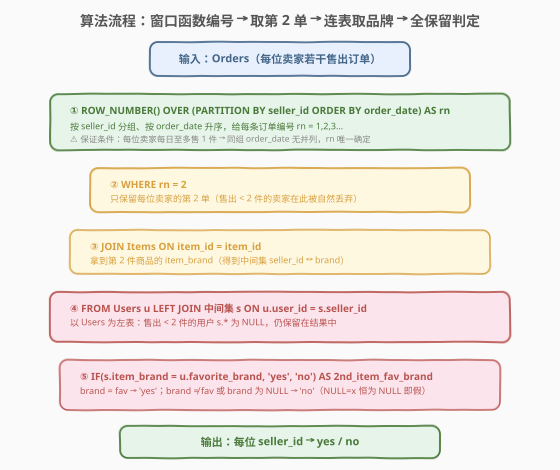
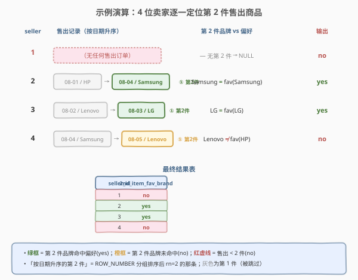

# 市场分析 II

- **题目名称**：市场分析 II
- **链接**：[1159. 市场分析 II](https://leetcode.cn/problems/market-analysis-ii/)
- **难度**：困难
- **标签**：SQL、窗口函数、ROW_NUMBER、LEFT JOIN、子查询、多表关联、IF 条件判定

## 1. 题目概述

给定电商网站的 `Users`、`Orders`、`Items` 三张表，编写 SQL 查询：**对每位用户（作为卖家 seller），判断其按日期升序售出的「第 2 件商品」的品牌是否等于该用户的偏好品牌 `favorite_brand`**。相等输出 `yes`，否则输出 `no`；若售出不足 2 件，也输出 `no`。结果包含所有用户，列为 `seller_id`、`2nd_item_fav_brand`。

**表结构**：

```text
Table: Users
+----------------+---------+
| Column Name    | Type    |
+----------------+---------+
| user_id        | int     |  ← 主键
| join_date      | date    |
| favorite_brand | varchar |
+----------------+---------+

Table: Orders
+---------------+---------+
| Column Name   | Type    |
+---------------+---------+
| order_id      | int     |  ← 主键
| order_date    | date    |
| item_id       | int     |  ← 外键 → Items.item_id
| buyer_id      | int     |  ← 外键 → Users.user_id
| seller_id     | int     |  ← 外键 → Users.user_id
+---------------+---------+

Table: Items
+---------------+---------+
| Column Name   | Type    |
+---------------+---------+
| item_id       | int     |  ← 主键
| item_brand    | varchar |
+---------------+---------+
```

> ⚠️ 关键约束：**每位卖家每日至多售出 1 件商品**。这意味着按 `order_date` 升序排序时，同一 `seller_id` 的订单日期无并列，第 2 件的位置确定无歧义——无需考虑同日多件的并列处理（否则需额外 tiebreaker）。题目还要求结果**包含所有用户**（即便售出不足 2 件），因此必须以 `Users` 为左表做 `LEFT JOIN`，保证「不足 2 件」的用户仍出现在结果中并标记 `no`。

**示例 1**：

```text
输入：
Users 表:
+---------+------------+----------------+
| user_id | join_date  | favorite_brand |
+---------+------------+----------------+
| 1       | 2019-01-01 | Lenovo         |
| 2       | 2019-02-09 | Samsung        |
| 3       | 2019-01-19 | LG             |
| 4       | 2019-05-21 | HP             |
+---------+------------+----------------+

Orders 表:
+----------+------------+---------+----------+-----------+
| order_id | order_date | item_id | buyer_id | seller_id |
+----------+------------+---------+----------+-----------+
| 1        | 2019-08-01 | 4       | 1        | 2         |
| 2        | 2019-08-02 | 2       | 1        | 3         |
| 3        | 2019-08-03 | 3       | 2        | 3         |
| 4        | 2019-08-04 | 1       | 4        | 2         |
| 5        | 2019-08-04 | 1       | 3        | 4         |
| 6        | 2019-08-05 | 2       | 2        | 4         |
+----------+------------+---------+----------+-----------+

Items 表:
+---------+------------+
| item_id | item_brand |
+---------+------------+
| 1       | Samsung    |
| 2       | Lenovo     |
| 3       | LG         |
| 4       | HP         |
+---------+------------+

输出：
+-----------+--------------------+
| seller_id | 2nd_item_fav_brand |
+-----------+--------------------+
| 1         | no                 |
| 2         | yes                |
| 3         | yes                |
| 4         | no                 |
+-----------+--------------------+
```

**解释**：

| seller_id | 售出记录（按日期升序） | 第 2 件品牌 | 偏好品牌 | 判定 | 输出 |
|-----------|------------------------|-------------|----------|------|------|
| 1 | 无 | —（NULL） | Lenovo | 不足 2 件 | no |
| 2 | 08-01/HP → 08-04/Samsung | Samsung | Samsung | 相等 | yes |
| 3 | 08-02/Lenovo → 08-03/LG | LG | LG | 相等 | yes |
| 4 | 08-04/Samsung → 08-05/Lenovo | Lenovo | HP | 不等 | no |

- 用户 1 从未售出任何商品 → 不足 2 件 → `no`
- 用户 2 第 2 件是 Samsung，偏好 Samsung → `yes`
- 用户 3 第 2 件是 LG，偏好 LG → `yes`
- 用户 4 第 2 件是 Lenovo，偏好 HP → `no`

**约束条件**：

- `Users.user_id`、`Orders.order_id`、`Items.item_id` 均为主键
- `Orders.item_id` 外键指向 `Items`；`Orders.buyer_id`/`seller_id` 外键指向 `Users.user_id`
- 每位卖家每日至多售出 1 件商品（按日期排序无并列）
- 结果包含所有用户；售出不足 2 件者输出 `no`
- 输出列：`seller_id`、`2nd_item_fav_brand`

> 💡 本题是 SQL **"窗口函数定位 + LEFT JOIN 全保留 + 条件判定"综合题**。难点不在某一句法，而在三件事的协同：① 用 `ROW_NUMBER() OVER (PARTITION BY seller_id ORDER BY order_date)` 在每组内按日期编号、取 `rn=2` 锁定第 2 件；② 必须以 `Users` 为左表 `LEFT JOIN`，保证售出不足 2 件的用户不被丢弃；③ 用 `IF(brand = favorite_brand, 'yes', 'no')` 时，`NULL = x` 的三值逻辑恰好让不足 2 件者自动落 `no`。这是「窗口函数 + 外连接 + 空值三值逻辑」三位一体的招牌题。

---

## 2. 解题思路

### 2.1 暴力思路：逐卖家手动排序取第 2

最直觉的过程式思路是：遍历每一位用户，收集他作为 `seller_id` 的所有订单，按 `order_date` 升序排序，取第 2 条订单的 `item_id`，再到 `Items` 表查品牌，最后与该用户的 `favorite_brand` 比较相等则 `yes` 否则 `no`；若订单数不足 2 条直接 `no`。伪代码如下：

```text
for each user u in Users:
    sold = [ order in Orders where order.seller_id == u.user_id
             sort by order_date asc ]
    if len(sold) < 2:
        output(u.user_id, 'no')
    else:
        item2 = sold[1].item_id          # 0-indexed 第 2 条
        brand = Items[item2].item_brand
        output(u.user_id, 'yes' if brand == u.favorite_brand else 'no')
```

但**纯 SQL 没有显式的逐行循环和数组下标**——「按卖家分组后排序取第 k 条」恰好是窗口函数 `ROW_NUMBER()` 的拿手好戏：用 `PARTITION BY seller_id` 分组、`ORDER BY order_date` 排序，`rn` 列即等价于「组内按日期的序号」，`rn = 2` 即「第 2 条」。

> ⚠️ 过程式思维里「取第 2 条」在 SQL 中表达为 `WHERE rn = 2`——这是窗口函数编号后的行级过滤。注意窗口函数不能直接出现在 `WHERE` 中（`WHERE` 在窗口函数计算之前执行），必须先包一层子查询/CTE 把 `rn` 物化，再外层 `WHERE rn = 2`。

### 2.2 核心观察：窗口函数编号 + LEFT JOIN 全保留



**问题本质**：题目要判断「每位卖家售出的第 2 件商品品牌是否等于偏好品牌」。拆成两个子问题：

$$\text{第2件品牌}(s) = \text{Items.brand}\big[\, \text{Orders}[\text{seller}=s]_{\text{按date第2条}}\text{.item\_id} \,\big]$$

$$\text{答案}(s) = \begin{cases} \text{yes} & \text{若 第2件品牌}(s) = \text{Users.fav}(s) \\ \text{no} & \text{否则（含售出不足2件）} \end{cases}$$

关键洞察有三：

1. **「第 2 条」用窗口函数定位**：`ROW_NUMBER() OVER (PARTITION BY seller_id ORDER BY order_date)` 给每位卖家的订单按日期编号 `rn=1,2,3…`，`rn=2` 即第 2 条。题目保证「每日至多售 1 件」→ 同组 `order_date` 无并列 → `rn` 唯一确定，无需 tiebreaker。

2. **结果要包含所有用户 → LEFT JOIN**：售出不足 2 件的卖家在「取 `rn=2`」时被自然丢弃。若以中间集为驱动表，这些用户会从结果中消失。因此必须 **`FROM Users u LEFT JOIN 中间集 s`**，让不足 2 件的用户 `s.*` 为 `NULL` 仍保留。

3. **NULL 三值逻辑自动处理「不足 2 件」**：不足 2 件时 `s.item_brand` 为 `NULL`，`IF(NULL = u.favorite_brand, 'yes', 'no')` 中 `NULL = x` 的结果是 `NULL`（未知，非真），`IF` 将其视作假 → 返回 `'no'`。无需单独写 `CASE WHEN s.item_brand IS NULL` 分支。

> 💡 **为什么是「第 2 件」而非「第 1 件」？** 题目显式要求判断第 2 件售出商品。这类「组内第 k 条」的需求是窗口函数的经典场景：`ROW_NUMBER`（严格不并列）、`RANK`（并列同号跳过）、`DENSE_RANK`（并列同号不跳）。本题因「每日至多 1 件」的保证，三者结果相同，但 `ROW_NUMBER` 语义最干净——每行一个唯一序号，`rn=2` 恰好一条。若无此保证且同日可售多件，则需追加 `ORDER BY order_date, item_id` 之类的 tiebreaker 让结果确定。

### 2.3 算法流程图



**逻辑执行步骤**：

| 步骤 | 操作 | 作用 |
|------|------|------|
| ① | `ROW_NUMBER() OVER (PARTITION BY seller_id ORDER BY order_date) AS rn` | 每位卖家的订单按日期升序编号 1,2,3… |
| ② | `WHERE rn = 2`（子查询外层过滤） | 只保留每位卖家的第 2 单，不足 2 件者被丢弃 |
| ③ | `JOIN Items ON item_id` | 拿到第 2 件商品的 `item_brand` |
| ④ | `FROM Users u LEFT JOIN 中间集 s ON u.user_id = s.seller_id` | 以用户表为左表，保留所有用户（不足 2 件者 `s.*` 为 NULL） |
| ⑤ | `IF(s.item_brand = u.favorite_brand, 'yes', 'no')` | 相等 `yes`，否则 `no`（NULL 自动落 no） |

> 💡 **窗口函数不能进 WHERE**：`ROW_NUMBER()` 是在 `SELECT` 阶段（或 `ORDER BY`）计算的，而 `WHERE` 在它之前执行。所以 `SELECT ..., ROW_NUMBER() ... AS rn FROM t WHERE rn = 2` 是**非法**的——`WHERE` 时 `rn` 还不存在。正确做法是把含窗口函数的查询包成子查询/CTE，外层再 `WHERE rn = 2`。这是窗口函数题最常见的语法陷阱。

### 2.4 示例演算

以示例 1 数据为例，逐步追踪每位卖家的第 2 件定位与判定：



**步骤 ①：按 `seller_id` 分组、`order_date` 升序编号 `rn`**

| order_id | order_date | item_id | seller_id | rn | 说明 |
|----------|------------|---------|-----------|----|------|
| 1 | 08-01 | 4 | 2 | 1 | seller 2 第 1 件 |
| 4 | 08-04 | 1 | 2 | **2** | seller 2 第 2 件 ✓ |
| 2 | 08-02 | 2 | 3 | 1 | seller 3 第 1 件 |
| 3 | 08-03 | 3 | 3 | **2** | seller 3 第 2 件 ✓ |
| 5 | 08-04 | 1 | 4 | 1 | seller 4 第 1 件 |
| 6 | 08-05 | 2 | 4 | **2** | seller 4 第 2 件 ✓ |
| — | — | — | 1 | — | seller 1 无订单，不出现 |

**步骤 ②：`WHERE rn = 2` → JOIN Items 取品牌**

| seller_id | item_id | item_brand（来自 Items） |
|-----------|---------|--------------------------|
| 2 | 1 | Samsung |
| 3 | 3 | LG |
| 4 | 2 | Lenovo |

**步骤 ③：`FROM Users LEFT JOIN 中间集` + `IF` 判定**

| seller_id | favorite_brand | s.item_brand | 判定 | 输出 |
|-----------|----------------|--------------|------|------|
| 1 | Lenovo | NULL（无匹配） | NULL = Lenovo → NULL（假） | no |
| 2 | Samsung | Samsung | 相等 | yes |
| 3 | LG | LG | 相等 | yes |
| 4 | HP | Lenovo | 不等 | no |

> ⚠️ **注意 seller 1**：它在步骤 ②的中间集里不存在（无 `rn=2`），步骤 ③ 的 `LEFT JOIN` 让 `s.item_brand` 填 `NULL`。`IF(NULL = 'Lenovo', 'yes', 'no')` → `NULL = 'Lenovo'` 求值为 `NULL`（未知）→ `IF` 视作假 → `'no'`。这正是「不足 2 件输出 no」的实现机制——靠外连接的 NULL + 三值逻辑自动完成，无需额外分支。

---

## 3. 参考代码

### SQL（解法 A：ROW_NUMBER 窗口函数，推荐）

```sql
SELECT
    u.user_id AS seller_id,
    IF(s.item_brand = u.favorite_brand, 'yes', 'no') AS `2nd_item_fav_brand`
FROM Users u
LEFT JOIN (
    SELECT t.seller_id, i.item_brand
    FROM (
        SELECT seller_id, item_id,
               ROW_NUMBER() OVER (PARTITION BY seller_id ORDER BY order_date) AS rn
        FROM Orders
    ) t
    JOIN Items i ON t.item_id = i.item_id
    WHERE t.rn = 2
) s ON u.user_id = s.seller_id
ORDER BY seller_id;
```

> 💡 **写法要点**：
> - **内层子查询 `t`**：对 `Orders` 用 `ROW_NUMBER() OVER (PARTITION BY seller_id ORDER BY order_date)` 编号。窗口函数必须先物化，所以包一层。
> - **中层 `JOIN Items` + `WHERE rn = 2`**：取第 2 单并连表拿品牌，得到中间集 `(seller_id, item_brand)`。售出不足 2 件的卖家不在此集中。
> - **外层 `FROM Users LEFT JOIN s`**：以用户表为左表，保证所有用户都出现；不足 2 件者 `s.item_brand` 为 `NULL`。
> - **`IF(s.item_brand = u.favorite_brand, 'yes', 'no')`**：相等 `yes`，否则 `no`；`NULL = x` 为 `NULL`（假）→ 自动 `no`，恰好覆盖「不足 2 件」。
> - **`` `2nd_item_fav_brand` ``**：列名以数字开头，MySQL 中需用反引号包裹。
> - ✓ **最清晰**：窗口函数 + 外连接，语义直白，扩展性强。

### SQL（解法 B：相关子查询 + LIMIT OFFSET，兼容旧版 MySQL）

```sql
SELECT
    u.user_id AS seller_id,
    IF(
        (SELECT i.item_brand
         FROM Orders o
         JOIN Items i ON o.item_id = i.item_id
         WHERE o.seller_id = u.user_id
         ORDER BY o.order_date
         LIMIT 1 OFFSET 1) = u.favorite_brand,
        'yes', 'no'
    ) AS `2nd_item_fav_brand`
FROM Users u
ORDER BY seller_id;
```

> 💡 **写法要点**：
> - **相关子查询**：对每位用户 `u`，在 `Orders` 中筛 `seller_id = u.user_id` 的订单，按 `order_date` 升序，`LIMIT 1 OFFSET 1` 跳过第 1 条取第 2 条的 `item_id`，再 `JOIN Items` 拿品牌。
> - **`LIMIT 1 OFFSET 1`**：`OFFSET 1` 跳过第 1 条，`LIMIT 1` 取 1 条 → 恰好第 2 条。不足 2 条时子查询返回 `NULL`。
> - **`IF(NULL = fav, 'yes', 'no')`**：不足 2 件时子查询为 `NULL`，`NULL = fav` 为 `NULL`（假）→ `'no'`，自动覆盖。
> - **无需 LEFT JOIN**：外层直接 `FROM Users`，每位用户都生成一行，判定靠子查询的 `NULL` 兜底。
> - ✓ **兼容 MySQL 5.7**（无窗口函数）；缺点是相关子查询每行执行一次，大数据量下性能劣于解法 A 的窗口函数一次扫表。

### SQL（解法 C：CTE 两阶段，可读性最佳）

```sql
WITH sold_ranked AS (
    SELECT seller_id, item_id, order_date,
           ROW_NUMBER() OVER (PARTITION BY seller_id ORDER BY order_date) AS rn
    FROM Orders
),
second_item AS (
    SELECT r.seller_id, i.item_brand
    FROM sold_ranked r
    JOIN Items i ON r.item_id = i.item_id
    WHERE r.rn = 2
)
SELECT
    u.user_id AS seller_id,
    IF(s.item_brand = u.favorite_brand, 'yes', 'no') AS `2nd_item_fav_brand`
FROM Users u
LEFT JOIN second_item s ON u.user_id = s.seller_id
ORDER BY seller_id;
```

> 💡 **写法要点**：用两个 CTE 把解法 A 的嵌套子查询拍平——`sold_ranked` 负责编号、`second_item` 负责取第 2 单并连表拿品牌、主查询负责外连接与判定。逻辑分三层、层层命名，可读性最佳，与解法 A 完全等价（执行计划通常也相同）。适合面试时边讲边写、逐步推导。

### Python（pandas）

```python
import pandas as pd

def market_analysis(users: pd.DataFrame, orders: pd.DataFrame, items: pd.DataFrame) -> pd.DataFrame:
    sold = (
        orders.sort_values('order_date')
              .groupby('seller_id')
              .nth(1)
              .reset_index()[['seller_id', 'item_id']]
    )
    sold = sold.merge(items, on='item_id', how='left')
    res = users.merge(sold, left_on='user_id', right_on='seller_id', how='left')
    res['2nd_item_fav_brand'] = res['item_brand'].eq(res['favorite_brand']).map({True: 'yes', False: 'no'})
    return res[['user_id', '2nd_item_fav_brand']].rename(columns={'user_id': 'seller_id'}).sort_values('seller_id')
```

> 💡 **pandas 对照**：`sort_values('order_date').groupby('seller_id').nth(1)` 对应 SQL 的 `ROW_NUMBER` + `rn=2`——`nth(1)` 取每组第 2 行（0-indexed），不足 2 条的组自动不出现；`merge(items, how='left')` 对应 `JOIN Items`；`users.merge(sold, how='left')` 对应 `LEFT JOIN` 保留所有用户；`.eq(...).map({True:'yes', False:'no'})` 对应 `IF`——`NaN == x` 为 `False` → `'no'`，恰好覆盖不足 2 件的用户。

---

## 4. 复杂度分析

| 维度 | 复杂度 | 说明 |
|------|--------|------|
| **时间** | $O(n \log n)$ | 窗口函数需对每个 `seller_id` 分组内按 `order_date` 排序，总计 $O(n \log n)$，$n$ = `Orders` 行数；`JOIN Items`/`LEFT JOIN Users` 为 $O(n)$（哈希连接）或 $O(n \log m)$（嵌套循环+索引） |
| **空间** | $O(n + u)$ | 窗口函数物化中间结果 $O(n)$；外连接结果 $O(u)$，$u$ = 用户数 |
| **结果行数** | $O(u)$ | 每位用户一行，共 $u$ 行 |

> ⚠️ **解法 B（相关子查询）复杂度更高**：外层对每位用户执行一次子查询，若 `Orders` 无 `(seller_id, order_date)` 索引，每次子查询需全表扫描 + 排序，总复杂度退化为 $O(u \cdot n \log n)$。生产环境应建 `INDEX(seller_id, order_date)` 让子查询走索引范围扫描 + 局部排序，降为接近 $O(u \log k)$（$k$ = 该卖家订单数）。面试中说明「解法 A 窗口函数一次扫表 $O(n \log n)$ 优于解法 B 的逐行相关子查询」即可。

---

## 5. 扩展：窗口函数定位「组内第 k 条」的三种武器

### 5.1 ROW_NUMBER vs RANK vs DENSE_RANK

| 函数 | 并列处理 | 例：同组分数 [100,100,90] 的序号 | 本题适用性 |
|------|----------|----------------------------------|------------|
| `ROW_NUMBER()` | 严格不并列，每行唯一 | 1, 2, 3 | ✓ 最佳（每日至多 1 件 → 无并列 → 序号唯一） |
| `RANK()` | 并列同号，后续跳过 | 1, 1, 3 | 可用但无并列时与 ROW_NUMBER 相同 |
| `DENSE_RANK()` | 并列同号，后续不跳 | 1, 1, 2 | 可用但无并列时与 ROW_NUMBER 相同 |

> 💡 **选择口诀**：**要唯一序号用 `ROW_NUMBER`，要并列跳号用 `RANK`，要并列不跳号用 `DENSE_RANK`**。本题因「每日至多售 1 件」的保证，三者等价，但 `ROW_NUMBER` 语义最干净——`rn=2` 恰好一条，不会有「并列导致 rn=2 取到 0 条或 2 条」的歧义。

### 5.2 从「第 2 件」到通用变体

| 变体 | 需求 | SQL 演进 |
|------|------|---------|
| **1159 原题** | 第 2 件品牌 vs 偏好 | `ROW_NUMBER` + `rn=2` + `LEFT JOIN` + `IF` |
| 第 k 件品牌 | 任意第 k 条 | `WHERE rn = k` |
| 售出最多品牌的卖家 | 组内 Top-1 统计 | `GROUP BY seller_id, brand` + `ORDER BY COUNT(*) DESC LIMIT 1` |
| 首件与末件品牌是否相同 | 组内首尾对比 | 同时取 `rn=1` 与 `rn=max`，自连接比较 |
| 每位卖家连续 2 件同品牌 | 滞后比较 | `LAG(item_brand) OVER (...)` 取上一件与当前件比较 |

> 💡 这些变体共享「`PARTITION BY seller_id ORDER BY order_date` 在组内定位」的核心。掌握 `ROW_NUMBER`/`LAG`/`LEAD` 三件套，从「取第 k 条」到「相邻比较」都能覆盖。`LAG`/`LEAD` 是窗口函数的另一条线：不求序号，直接取「前/后第 k 行」的值，适合相邻行比较场景。

---

## 6. 面试要点

1. **为什么必须用 `LEFT JOIN` 而不是 `JOIN`？**

   - 题目要求结果**包含所有用户**，即便售出不足 2 件也要输出 `no`。中间集（`rn=2` 的卖家）天然不含不足 2 件的卖家。若用内连接 `JOIN`，这些用户会从结果中消失。必须 `FROM Users u LEFT JOIN 中间集 s`，让不足 2 件的用户 `s.*` 为 `NULL` 仍保留，再靠 `IF(NULL = fav, ...)` 落到 `'no'`。

2. **`IF(NULL = favorite_brand, 'yes', 'no')` 为什么返回 `'no'`？**

   - SQL 的三值逻辑：`NULL = x`（任何值）的结果是 `NULL`（未知），而非 `true` 或 `false`。`IF` 把 `NULL` 当作假（非 true），于是返回第三个参数 `'no'`。这正是「不足 2 件 → `s.item_brand` 为 `NULL` → 判定 `no`」的自动机制，无需额外 `CASE WHEN s.item_brand IS NULL` 分支。若误以为 `NULL = x` 是 `false`，结论碰巧一样，但语义上应理解为「未知」——这也是 `NOT IN (含NULL子查询)` 陷阱的根源。

3. **窗口函数为什么不能直接写进 `WHERE`？**

   - SQL 子句执行顺序为 `FROM → WHERE → GROUP BY → HAVING → SELECT（含窗口函数）→ ORDER BY`。窗口函数在 `SELECT` 阶段计算，而 `WHERE` 在它之前执行——`WHERE` 时 `rn` 列尚不存在，`WHERE rn = 2` 会报「未知列」。正确做法：把含 `ROW_NUMBER()` 的查询包成子查询或 CTE，外层再 `WHERE rn = 2`。这是窗口函数题最高频的语法陷阱。

4. **「每位卖家每日至多售 1 件」这个保证为什么重要？**

   - 它保证同一 `seller_id` 分组内 `order_date` 无并列，`ROW_NUMBER() ORDER BY order_date` 给出的 `rn` 唯一确定——`rn=2` 恰好对应一条订单，无歧义。若无此保证且同日可售多件，则同 `order_date` 的行的 `rn` 顺序不确定（依赖实现），需追加 `ORDER BY order_date, item_id` 之类的 tiebreaker 才能让结果稳定可复现。

5. **解法 A（窗口函数）和解法 B（相关子查询）有何取舍？**

   - 解法 A 一次扫表 + 一次排序 $O(n \log n)$，大数据量下性能优，且语义清晰、易扩展（改 `rn=k` 即取第 k 件），推荐首选。解法 B 用 `LIMIT 1 OFFSET 1` 的相关子查询，兼容不支持窗口函数的旧版 MySQL（5.7 及以前），但对外层每行都执行一次子查询，无索引时退化为 $O(u \cdot n \log n)$。面试中答：「新版用窗口函数；旧版或单点查询用 `LIMIT OFFSET` 相关子查询，配合 `(seller_id, order_date)` 索引」。

> 💡 **一句话总结**：1159 是 SQL **"窗口函数定位 + 外连接全保留 + 空值三值逻辑"三位一体招牌题**——`ROW_NUMBER() OVER (PARTITION BY seller_id ORDER BY order_date)` 取 `rn=2` 锁定第 2 件，`FROM Users LEFT JOIN` 保证所有用户出现，`IF(brand = fav, 'yes', 'no')` 靠 `NULL=x` 的三值逻辑自动处理不足 2 件。理解「窗口函数不能进 WHERE」「外连接保全」「NULL 三值逻辑」三点，所有「组内第 k 条 + 全保留判定」类题都能覆盖。

---

## 7. 同类练习题

- [1141. 查询近 30 天活跃用户数](https://leetcode.cn/problems/user-activity-for-the-past-30-days-i/)：`WHERE` 日期过滤 + `GROUP BY` + `COUNT(DISTINCT)`——同属「电商行为表」SQL 基础题，对比 1159 的窗口函数定位，理解「分组聚合」与「组内第 k 条」的差异
- [1174. 即时食物配送 II](https://leetcode.cn/problems/immediate-food-delivery-ii/)：`ROW_NUMBER() OVER (PARTITION BY ... ORDER BY ...)` 取每位顾客首单——与 1159 同为「组内第 1/2 条」窗口函数招牌题，方向是首单 vs 第 2 单
- [180. 连续出现的数字](https://leetcode.cn/problems/consecutive-numbers/)：`LAG() OVER (...)` 取上一行做相邻比较——窗口函数另一条线（`LAG`/`LEAD`），对照 1159 的 `ROW_NUMBER` 理解两类窗口函数的适用场景
- [184. 部门工资最高的员工](https://leetcode.cn/problems/department-highest-salary/)：`RANK() OVER (PARTITION BY department ORDER BY salary DESC)` 取组内 Top-1——组内取最值的窗口函数经典题，对比 1159 的「取第 k 条」理解 `RANK` vs `ROW_NUMBER` 的并列处理差异
- [1158. 市场分析 I](https://leetcode.cn/problems/market-analysis/)：同表族的姐妹题——`LEFT JOIN` + `COUNT` 统计每位用户 2019 年订单数与排名，对比 1159 理解「分组聚合统计」与「组内第 2 条定位」在同一业务场景下的不同问法
