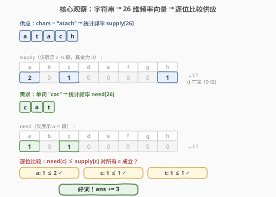
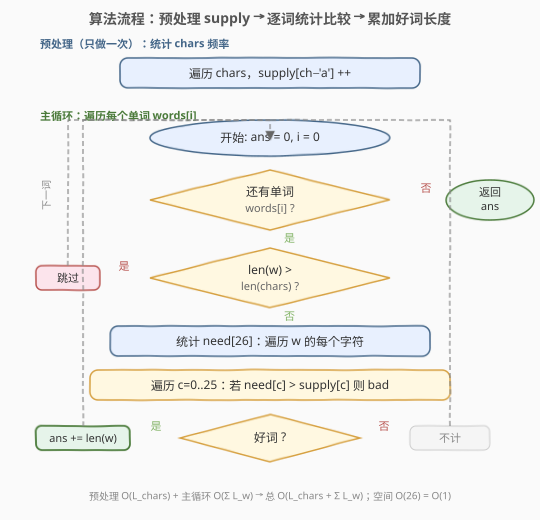
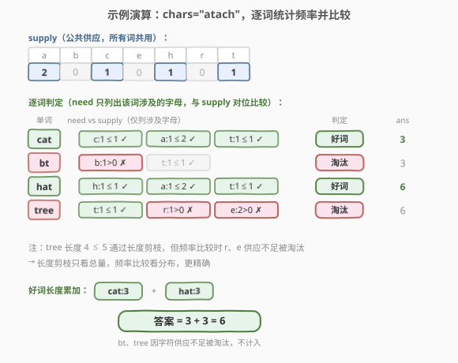

# LeetCode 拼写单词 题解

## 1. 题目概述

- **标题 / 题号**：拼写单词（#1160，easy）
- **链接**：https://leetcode.cn/problems/find-words-that-can-be-formed-by-characters/
- **难度**：简单
- **标签**：数组、哈希表、字符串、计数

**题意**：给你一个字符串数组 `words` 和一个字符串 `chars`。如果 `words` 中的某个字符串可以由 `chars` 中的字符拼出（`chars` 中的每个字符在**该字符串中只能使用一次**），则认为它是一个「好的」字符串。

返回 `words` 中所有「好的」字符串的**长度之和**。

**示例 1**：

```text
输入：words = ["cat","bt","hat","tree"], chars = "atach"
输出：6
解释：
可以拼出 "cat" 和 "hat"，答案 = 3 + 3 = 6。
"bt" 缺 'b'，"tree" 缺 'r' 和 'e'(chars 只有 1 个 'e'，但 tree 需要 2 个)。
```

**示例 2**：

```text
输入：words = ["hello","world","leetcode"], chars = "welldonehoneyr"
输出：10
解释：
可以拼出 "hello" 和 "world"，答案 = 5 + 5 = 10。
"leetcode" 需要 't' 和 'c'，chars 中没有。
```

**约束**：

- `1 <= words.length <= 1000`
- `1 <= words[i].length, chars.length <= 100`
- `words[i]` 和 `chars` 都只包含小写英文字母

> 💡 注意字符集只有 **26 个小写字母**：这是本题的关键线索——频率表只需一个长度 26 的定长数组，空间 $O(1)$，比较也是常数级 26 次。这和 [1128. 等价多米诺骨牌对的数量](1128_等价多米诺骨牌对的数量.md)「数字范围 1–9 → 数组代替哈希」是同一思路。

## 2. 解题思路

### 2.1 暴力思路：对每个字符全量查找

对 `words` 中的每个单词 `w`，逐个字符去 `chars` 里找匹配。为避免一个 `chars` 字符被多次使用，每用掉一个就把 `chars` 中对应位置标记掉。

问题：每次都要拷贝一份 `chars` 并扫描，时间 $O(\text{words 数} \times \text{单词长} \times \text{chars 长})$，最坏 $1000 \times 100 \times 100 = 10^7$，能过但常数大、写起来繁琐。

更自然的抽象是：**「能否拼出」本质是「字符供应量是否够」**——把 `chars` 和单词各自压缩成「每个字符有多少个」的频率表，逐位比较供应是否充足即可。

### 2.2 核心观察：频率表比较



**关键转换**：把 `chars` 统计成长度 26 的频率数组 `supply[c]`（`c = ch - 'a'`）。对每个单词 `w` 同样统计 `need[c]`。`w` 是「好的」当且仅当**对所有 $c \in [0,25]$ 都有 `need[c] <= supply[c]`**。

> 为什么这样是对的？题目要求「`chars` 中每个字符在该单词中只能使用一次」，等价于「单词对每个字符的需求量不超过 `chars` 的供应量」。频率表把"逐字符匹配"压缩为"逐字符比较数量"，是个**无损转换**——只要 26 维上每维都够，就一定能拼出（贪心地为每个字符分配供应即可，字符之间互不影响）。

**提前剪枝**：若单词长度 `> chars.length`，供应总量都不够，直接判否，不必统计频率。这是 $O(1)$ 的快速排除。

> 💡 这一步把"能否拼出"问题转化为"频率向量逐位比较"。这是**计数型哈希**的招牌思路（与 [1128. 等价多米诺骨牌对的数量](1128_等价多米诺骨牌对的数量.md) 的归一化计数、[242. 有效的字母异位词](https://leetcode.cn/problems/valid-anagram/) 的频率表同源）。

### 2.3 算法流程图



**完整步骤**：

1. **预处理**：统计 `chars` 的频率表 `supply[26]`（只做一次，所有单词共用）。
2. **遍历每个单词** `w`：
   - **快速剪枝**：若 `w.length() > chars.length()`，跳过（供应总量不足）。
   - **统计需求**：统计 `w` 的频率表 `need[26]`。
   - **逐位比较**：遍历 26 个字母，若存在 `need[c] > supply[c]`，`w` 不是好词，跳过。
   - **累加**：否则 `ans += w.length()`。
3. **返回** `ans`。

> ⚠️ `supply` 只统计一次，放在循环外；`need` 每个单词重新统计。这是"公共查询表 + 临时查询键"的常见结构（与 [1. 两数之和](../0001-0100/1_两数之和.md) 的"先建表后查表"方向相反，但都是"预处理 + 查询"二段式）。

### 2.4 示例演算

以示例 1 `words = ["cat","bt","hat","tree"], chars = "atach"` 为例：



**预处理 chars = "atach" 的频率表 supply**：

| 字母 | a | c | h | t | 其余 |
|------|---|---|---|---|------|
| supply | 2 | 1 | 1 | 1 | 0 |

**逐词判定**：

| 单词 | 长度剪枝 | need 频率表 | 逐位比较 | 是否好词 | 累加 |
|------|----------|-------------|----------|----------|------|
| cat  | 3 ≤ 5    | a:1,c:1,t:1 | 1≤2, 1≤1, 1≤1 全通过 | ✅ | ans = 3 |
| bt   | 2 ≤ 5    | b:1,t:1     | b:1 **> 0** 失败 | ❌ | ans = 3 |
| hat  | 3 ≤ 5    | h:1,a:1,t:1 | 1≤1, 1≤2, 1≤1 全通过 | ✅ | ans = 6 |
| tree | 4 ≤ 5    | t:1,r:1,e:2 | r:1 **> 0** 失败 | ❌ | ans = 6 |

最终 `ans = 6`，与示例一致。"tree" 虽然长度 4 ≤ 5 通过剪枝，但频率比较时 `r` 和 `e` 供应不足被淘汰——这正是频率表比单纯长度剪枝更精确的体现。

## 3. 参考代码

### 方法一：频率表比较（定长数组，推荐）

### C++

```cpp
class Solution {
public:
    int countCharacters(vector<string>& words, string chars) {
        int supply[26] = {0};
        for (char ch : chars) {
            supply[ch - 'a']++;
        }
        int ans = 0;
        for (auto& w : words) {
            if ((int)w.size() > (int)chars.size()) continue;   // 总量剪枝
            int need[26] = {0};
            for (char ch : w) {
                need[ch - 'a']++;
            }
            bool ok = true;
            for (int c = 0; c < 26; c++) {
                if (need[c] > supply[c]) { ok = false; break; }
            }
            if (ok) ans += w.size();
        }
        return ans;
    }
};
```

### Python

```python
class Solution:
    def countCharacters(self, words: List[str], chars: str) -> int:
        from collections import Counter
        supply = Counter(chars)
        ans = 0
        for w in words:
            if len(w) > len(chars):
                continue
            need = Counter(w)
            if all(need[c] <= supply[c] for c in need):
                ans += len(w)
        return ans
```

> 💡 Python 用 `Counter` 后只需比较 `need` 中出现的字母（`all(need[c] <= supply[c] for c in need)`），因为 `Counter` 对未出现的键返回 0，`need` 中没有的字母需求为 0 天然满足。C++ 用定长数组则遍历全 26 位，常数 26 与单词字符数相比可忽略。

### 方法二：用差值减法代替逐位比较

> 💡 **关键观察**：与其逐位比较 `need[c] <= supply[c]`，不如直接把 `supply` 拷贝一份，遍历单词时**逐字符扣减**，一旦某字符计数变负即判否。省去再建一个 `need` 表和 26 位循环，每个单词只扫一遍字符。

### C++

```cpp
class Solution {
public:
    int countCharacters(vector<string>& words, string chars) {
        int supply[26] = {0};
        for (char ch : chars) supply[ch - 'a']++;
        int ans = 0;
        for (auto& w : words) {
            if ((int)w.size() > (int)chars.size()) continue;
            int bank[26];
            memcpy(bank, supply, sizeof(supply));   // 拷贝一份供应
            bool ok = true;
            for (char ch : w) {
                if (--bank[ch - 'a'] < 0) { ok = false; break; }
            }
            if (ok) ans += w.size();
        }
        return ans;
    }
};
```

### Python

```python
class Solution:
    def countCharacters(self, words: List[str], chars: str) -> int:
        from collections import Counter
        supply = Counter(chars)
        n = len(chars)
        ans = 0
        for w in words:
            if len(w) > n:
                continue
            bank = supply.copy()
            ok = True
            for ch in w:
                if bank[ch] == 0:
                    ok = False
                    break
                bank[ch] -= 1
            if ok:
                ans += len(w)
        return ans
```

> ⚠️ 方法二的「扣减变负即停」是**提前终止**：单词里某个字符一旦超量，立刻 break，不必扫完整个单词。对长单词且早期就缺字符的情况有常数优化。两种方法思路等价（频率比较 ⇔ 扣减不透支），写法看个人偏好。

## 4. 复杂度分析

| 维度 | 方法一（频率表比较） | 方法二（扣减法） |
|------|----------------------|------------------|
| **时间** | $O(L_{\text{chars}} + \sum L_w)$ | $O(L_{\text{chars}} + \sum L_w)$ |
| **空间** | $O(1)$ | $O(1)$ |

> ⚠️ **时间**：预处理 `chars` 扫一遍 $O(L_{\text{chars}})$；每个单词统计频率/扣减扫一遍 $O(L_w)$，比较 26 位 $O(26)$。总计 $O(L_{\text{chars}} + \sum L_w)$，其中 $\sum L_w$ 是所有单词长度之和，上界 $1000 \times 100 = 10^5$。
>
> **空间**：频率表固定 26 位，与输入规模无关，$O(1)$。方法二每词拷贝一份 26 位的 `bank`，仍是 $O(1)$。这是字符集只有 26 个小写字母带来的红利。

## 5. 面试要点

1. **为什么用频率表而不是逐字符在 `chars` 里查找？**

   > 逐字符查找需要维护"哪些位置已用"的状态，每次 $O(L_{\text{chars}})$，且容易写错。频率表把"供应"预先压缩成 26 维向量，查询降为 $O(1)$，比较只需 26 次常数级操作。本质是「预处理换查询效率」——把重复的供应信息提前算好。

2. **长度剪枝 `w.length() > chars.length()` 有没有必要？**

   > 不是必须，但很划算：它是 $O(1)$ 的快速排除，能跳过明显不可能的单词，省去统计频率和比较的开销。逻辑上等价于"供应总量 < 需求总量"，是频率比较的弱化版（只看总量不看分布）。

3. **如果字符集扩大到 Unicode 还能这么做吗？**

   > 思路不变，但频率表不能再用定长数组，需改用 `unordered_map`/`map`，空间退化为 $O(|\Sigma|)$（$\Sigma$ 为实际出现的字符集大小）。比较时遍历 `need` 中出现的键即可，不必遍历整个字母表。

4. **方法一和方法二哪个更好？**

   > 渐进复杂度相同。方法二「扣减变负即停」对早期就缺字符的单词有提前终止优势；方法一直观、易读。面试中两种都写出能体现对「等价变换」的理解——频率比较 ⇔ 扣减不透支，是同一不变量的两种视角。

5. **这题和字母异位词（242）有什么关系？**

   > 242 判断两串是否字母异位词，要求频率**完全相等**（`need[c] == supply[c]`）；本题只要求 `need[c] <= supply[c]`（供应够即可，多余的供应不算错）。是同一频率表工具的不同判定条件，可对比讲解。

> 💡 **一句话总结**：1160 的本质是「频率向量比较」——把字符串压缩成 26 维供应/需求向量，逐位判定 `need <= supply`。字符集小（26）让频率表退化为定长数组，空间 $O(1)$。这套「计数 + 比较」套路可直接迁移到字母异位词（242）、找异位词差集（383）等题。

## 同类练习题

| # | 题目 | 与本题的关联 |
|---|------|-------------|
| 242 | [有效的字母异位词](https://leetcode.cn/problems/valid-anagram/) | 频率表要求**完全相等**（`==`），1160 是其「小于等于」变体（`<=`），同工具不同判定 |
| 383 | [赎金信](https://leetcode.cn/problems/ransom-note/) | 几乎与 1160 同构——判断 ransom 能否由 magazine 字符组成，`need <= supply` 频率比较，可视为 1160 的单词版 |
| 1128 | [等价多米诺骨牌对的数量](../1101-1200/1128_等价多米诺骨牌对的数量.md) | 同为「值域小 → 定长数组代替哈希」的计数套路，数字 1–9 ↔ 字母 26 |
| 448 | [找到所有数组中消失的数字](../0401-0500/448_找到所有数组中消失的数字.md) | 用下标当哈希键的计数标记，同「值域小→数组代替哈希」范式 |
| 1 | [两数之和](../0001-0100/1_两数之和.md) | 「预处理建表 + 查询」二段式结构的鼻祖，1160 的 supply 预处理与之同源 |
