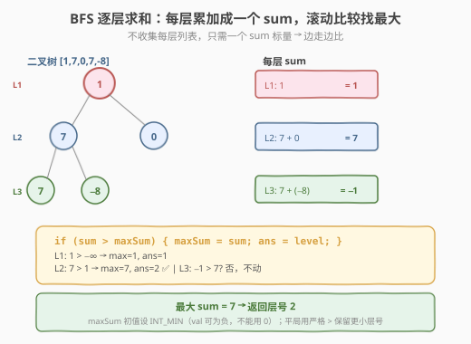
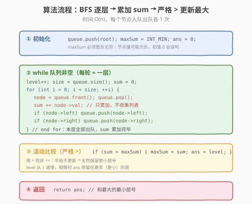
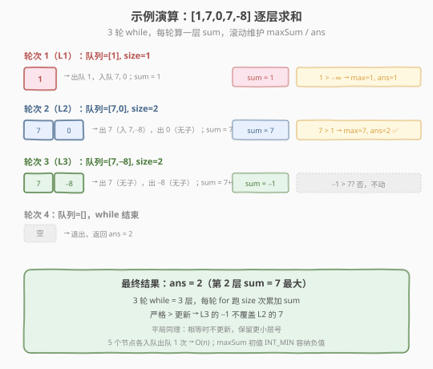

# LeetCode 最大层内元素和 题解

## 1. 题目概述

- **标题 / 题号**：最大层内元素和（#1161，medium）
- **链接**：https://leetcode.cn/problems/maximum-level-sum-of-a-binary-tree/
- **难度**：中等
- **标签**：树、二叉树、广度优先搜索（BFS）

**题意**：给你一个二叉树的根节点 `root`。设根节点位于二叉树的第 `1` 层，而根节点的子节点位于第 `2` 层，依此类推。返回总和**最大**的那一层的层号 `x`。如果有多层的总和一样大，返回其中**最小**的层号 `x`。

**示例 1**：

```text
输入：root = [1,7,0,7,-8,null,null]
          1
         / \
        7   0
       / \
      7  -8
输出：2
解释：
第 1 层之和为 1，
第 2 层之和为 7 + 0 = 7，
第 3 层之和为 7 + (-8) = -1，
返回第 2 层（和最大）。
```

**示例 2**：

```text
输入：root = [989,null,10250,98693,-89388,null,null,null,-32127]
输出：2
```

**约束**：

- 树中节点数在 `[1, 10^4]` 范围内
- `-10^5 <= Node.val <= 10^5`

> 💡 这是 [102. 二叉树的层序遍历](../0101-0200/102_二叉树的层序遍历.md) 的「求和变体」——BFS 队列骨架纹丝不动，只是把「每层收集成一个列表」换成「每层累加成一个 `sum`」，再滚动维护最大值。不需要存所有层的列表，空间更省。两个易错点：① 节点值可能为负，`maxSum` 初值必须设为**负无穷**（不能用 `0`）；② 平局取**最小**层号，用严格 `>` 更新即可天然保留更早（更小）的层。

## 2. 解题思路

### 2.1 暴力思路：DFS 按层累加后扫描

用 DFS 递归遍历，传入层数 `depth`，把节点值累加到 `levelSum[depth]`，最后扫描整个 `levelSum` 数组找最大值对应的层号。

```text
dfs(node, depth):
    if node == null: return
    levelSum[depth] += node.val
    dfs(node.left,  depth+1)
    dfs(node.right, depth+1)
// 最后 argmax(levelSum)
```

DFS 能得到正确结果，但有两个问题：① 需要额外维护 `depth` 参数和一个 `levelSum` 数组/哈希；② 同一层节点的访问不连续（先钻左子树到底再回来），不符合「层序」直觉。更自然的方式仍是 **BFS 队列**——它天然按层处理，还能「边走边比」，无需存全部层的和。

> ⚠️ 无论 DFS 还是 BFS，都要小心两个坑：`maxSum` 初值不能是 `0`（负值层会误判），平局取最小层号要用严格 `>`（见 2.2）。

### 2.2 核心观察：BFS 逐层求和 + 滚动比较

BFS 队列从根开始，逐层向下扩散。复用 102 的 `while + for(size)` 骨架，但每层**只累加 `sum`**而不收集列表，并在每层结束后立刻与 `maxSum` 比较——**边走边比**，无需保存所有层的和。



**两个关键细节**：

| 细节 | 正确做法 | 错误做法 | 原因 |
|------|---------|---------|------|
| **`maxSum` 初值** | `INT_MIN` / `-∞` | `0` | 节点值可能为负（如示例 1 的 `-8`），若所有层和都 `< 0`，初值 `0` 会误判为「没有层更大」，返回错误层号 |
| **平局处理** | 严格 `>` 才更新 | `>=` 更新 | 题目要求平局取**最小**层号。BFS 从第 1 层向上递增，用 `>` 时相同和不会覆盖，天然保留更早（更小）的层号；用 `>=` 则会换成更大层号，违反题意 |

> 💡 **为什么用 `>` 就能取最小层号？** BFS 的 `level` 从 `1` 严格递增（`1 → 2 → 3 …`）。当后续层和**等于**当前 `maxSum` 时，`sum > maxSum` 为假，不更新 `ans`——于是 `ans` 停留在更小的层号。这就是「平局取最小」的天然实现，无需额外判断。

> ⚠️ **数据范围与溢出**：节点最多 $10^4$ 个，每个值绝对值 $\le 10^5$。满二叉树最宽层约 $n/2$ 个节点，单层和最大约 $5 \times 10^8$，未超 `int` 上界（$\approx 2.1 \times 10^9$）。C++ 用 `int` 安全，但用 `long long` 累加更稳妥；Python 无需担心。

### 2.3 算法流程图



**完整步骤**：

1. **初始化**：队列 `queue = [root]`，`level = 0`，`maxSum = INT_MIN`，`ans = 0`
2. **while 队列非空**：
   - `level++`（进入新一层）
   - `size = queue.size()`（当前层节点数快照）
   - `sum = 0`
   - `for i in 0..size`：
     - `node = queue.pop_front()`
     - `sum += node.val`
     - 子节点入队：`if node.left: queue.push_back(node.left)`；`if node.right: queue.push_back(node.right)`
   - **滚动比较**：`if sum > maxSum: maxSum = sum; ans = level`（严格 `>`，平局不更新）
3. 返回 `ans`

### 2.4 示例演算

以示例 1 的树 `[1,7,0,7,-8,null,null]` 为例：



| 轮次 | level | 队列初始 | size | 出队 / 入队 | sum | 比较与更新 | maxSum / ans |
|------|-------|---------|------|------------|-----|-----------|--------------|
| 1 | 1 | [1] | 1 | 出 1 → 入 7, 0 | 1 | `1 > -∞` ✅ | 1 / 1 |
| 2 | 2 | [7, 0] | 2 | 出 7 → 入 7, -8；出 0 → ∅ | 7 | `7 > 1` ✅ | 7 / 2 |
| 3 | 3 | [7, -8] | 2 | 出 7 → ∅；出 -8 → ∅ | -1 | `-1 > 7`? 否 | 7 / 2（不变） |
| 4 | — | [] | — | 队列空，结束 | — | — | — |

最终 `ans = 2`。

> 💡 注意第 3 轮：`sum = 7 + (-8) = -1`，**小于** `maxSum = 7`，`>` 不成立，`ans` 保持 `2`。这正是「严格 `>`」的作用——若误用 `>=`，这里虽不影响（`-1 < 7`），但一旦遇到平局（某层和恰好等于 `7`）就会错误地换成更大层号。

## 3. 参考代码

### C++

```cpp
// 最大层内元素和.cpp —— BFS 逐层求和 + 滚动比较
// 编译: g++ -O2 -std=c++17 最大层内元素和.cpp -o maxlevelsum
#include <queue>
#include <climits>
using namespace std;

struct TreeNode {
    int val;
    TreeNode* left;
    TreeNode* right;
    TreeNode() : val(0), left(nullptr), right(nullptr) {}
    TreeNode(int x) : val(x), left(nullptr), right(nullptr) {}
    TreeNode(int x, TreeNode* l, TreeNode* r) : val(x), left(l), right(r) {}
};

class Solution {
  public:
    int maxLevelSum(TreeNode* root) {
        queue<TreeNode*> q;
        q.push(root);

        int maxSum = INT_MIN;   // ⭐ 负无穷：节点值可能为负
        int ans = 0;
        int level = 0;

        while (!q.empty()) {
            ++level;                      // 进入新一层
            int size = q.size();          // 当前层节点数快照
            long long sum = 0;            // long long 防极端溢出
            for (int i = 0; i < size; ++i) {
                TreeNode* node = q.front();
                q.pop();
                sum += node->val;
                if (node->left)  q.push(node->left);
                if (node->right) q.push(node->right);
            }
            if (sum > maxSum) {           // ⭐ 严格 >：平局保留更小层号
                maxSum = sum;
                ans = level;
            }
        }
        return ans;
    }
};
```

### Python

```python
from collections import deque

class Solution:
    def maxLevelSum(self, root: TreeNode | None) -> int:
        queue = deque([root])

        max_sum = float("-inf")          # ⭐ 负无穷：节点值可能为负
        ans = 0
        level = 0

        while queue:
            level += 1                     # 进入新一层
            size = len(queue)              # 当前层节点数
            total = 0
            for _ in range(size):
                node = queue.popleft()
                total += node.val
                if node.left:
                    queue.append(node.left)
                if node.right:
                    queue.append(node.right)
            if total > max_sum:           # ⭐ 严格 >：平局保留更小层号
                max_sum = total
                ans = level
        return ans
```

> 💡 Python 用 `float("-inf")` 而非 `0` 作为初值——这是本题最常见的 WA 原因。`collections.deque` 的 `popleft()` 是 `O(1)`，`list.pop(0)` 是 `O(n)`，BFS 务必用 `deque`。

## 4. 复杂度分析

| 维度 | 复杂度 | 说明 |
|------|--------|------|
| **时间复杂度** | $O(n)$ | 每个节点恰好入队/出队 1 次，累加与比较均为 $O(1)$ |
| **空间复杂度** | $O(n)$ | 队列最多存一层节点；满二叉树最后一层 $\approx n/2$ 个节点同时在队 |

> ⚠️ 与 102 层序遍历相比，本题**不存结果列表**（只维护 `maxSum`、`ans` 两个标量），但队列开销仍是 $O(n)$——这是 BFS 的固有成本，无法避免。若树退化为链表，队列最多 1 个节点，空间降到 $O(1)$；最坏情况（满二叉树）仍是 $O(n)$。

## 5. 扩展：DFS 按层累加法

BFS 之外，DFS 也能解：递归时把 `node.val` 累加到 `levelSum[depth]`，最后取 `argmax`。

```python
class Solution:
    def maxLevelSum(self, root: TreeNode | None) -> int:
        level_sum = []                    # level_sum[d] = 第 d+1 层之和

        def dfs(node: TreeNode | None, depth: int) -> None:
            if not node:
                return
            if depth == len(level_sum):   # 首次到达新层，扩容
                level_sum.append(0)
            level_sum[depth] += node.val
            dfs(node.left,  depth + 1)
            dfs(node.right, depth + 1)

        dfs(root, 0)
        # argmax：平局取最小层号 → 用严格 > 遍历
        ans, best = 0, float("-inf")
        for i, s in enumerate(level_sum):
            if s > best:
                best, ans = s, i + 1      # i 从 0 起，层号从 1 起
        return ans
```

**两种方法对比**：

| 维度 | BFS（推荐） | DFS 按层累加 |
|------|------------|-------------|
| **空间** | $O(n)$（队列存一层） | $O(n)$（`level_sum` 存所有层 + 递归栈 $O(h)$） |
| **是否存全部层** | 否（滚动维护 `maxSum`） | 是（需先累加完再 `argmax`） |
| **平局处理** | 严格 `>` 天然取最小层 | `argmax` 时用严格 `>` |
| **直觉** | 按层处理，贴合题意 | 深度优先，层数靠参数传递 |

> 💡 两种方法复杂度相同，BFS 更贴合「按层」语义且能边走边比；DFS 的优势在本题难体现。面试写 BFS 即可，DFS 作为备选思路提一句能加分。

## 6. 面试要点

1. **`maxSum` 初值为什么不能是 `0`？**

   - 节点值范围是 `[-10^5, 10^5]`，可能为负。若所有层和都 `< 0`（如根为 `-1` 的单节点树），初值 `0` 永远不会被更新，`ans` 保持 `0`（错误层号）。
   - 正确做法：`INT_MIN`（C++）或 `float("-inf")`（Python），保证第一层必定更新。

2. **平局取最小层号，为什么用严格 `>` 就够了？**

   - BFS 的 `level` 从 `1` 严格递增。后续层和**等于** `maxSum` 时，`sum > maxSum` 为假，不更新 `ans`——`ans` 停留在更小的层号。
   - 若误用 `>=`，相同和会换成更大层号，违反「取最小」。

3. **这题和 102 层序遍历的关系？**

   - 共享 `while + for(size)` BFS 骨架。差异只在 for 循环体：102 收集 `level.push_back(val)`，本题 `sum += val`，并在每层末尾做一次比较。
   - 本题**不需要**保存每层列表，空间更省（但队列仍是 $O(n)$）。

4. **`size = queue.size()` 这行为什么不能省？**

   - for 循环体里会 `push` 子节点，队列长度动态变化。不固定 `size`，for 会跨层处理，把下一层节点混入当前层，`sum` 就错了。
   - `size` 快照锁定层边界——这是 102/107/103/637/1161 全家共享的关键技巧。

5. **BFS 和 DFS 哪个更好？**

   - 复杂度相同（$O(n)$ 时间、$O(n)$ 空间）。BFS 更贴合「按层」语义，且能「边走边比」无需存全部层和；DFS 需先累加完再 `argmax`。
   - 面试优先写 BFS，提一句 DFS 作为备选即可。

> 💡 **一句话总结**：1161 是 102 层序遍历的「求和 + 取最大」变体——BFS 骨架不变，每层把 `push_back` 换成 `sum +=`，末尾用严格 `>` 滚动更新 `maxSum/ans`。两个坑记住就稳：初值用负无穷、平局用严格大于。

## 同类练习题

| # | 题目 | 与本题的关联 |
|---|------|-------------|
| 102 | [二叉树的层序遍历](https://leetcode.cn/problems/binary-tree-level-order-traversal/)（[题解](../0101-0200/102_二叉树的层序遍历.md)） | 1161 的母题，BFS `while + for(size)` 骨架的来源 |
| 637 | [二叉树的层平均值](https://leetcode.cn/problems/average-of-levels-in-binary-tree/) | 同一套 BFS 模板，每层求均值（`sum / size`）而非最大 |
| 1302 | [层数最深叶子节点的和](https://leetcode.cn/problems/deepest-leaves-sum/) | BFS 找最深叶子层之和，对照本题找最大和层 |
| 2583 | [二叉树中的第 K 大层和](https://leetcode.cn/problems/kth-largest-sum-in-a-binary-tree/) | BFS 求每层和后排序取第 K 大，1161 的「最大」升级为「第 K 大」 |
| 107 | [二叉树的层序遍历 II](https://leetcode.cn/problems/binary-tree-level-order-traversal-ii/)（[题解](../0101-0200/107_二叉树的层序遍历II.md)） | 自底向上层序，同一套 `size` 快照模板 |
