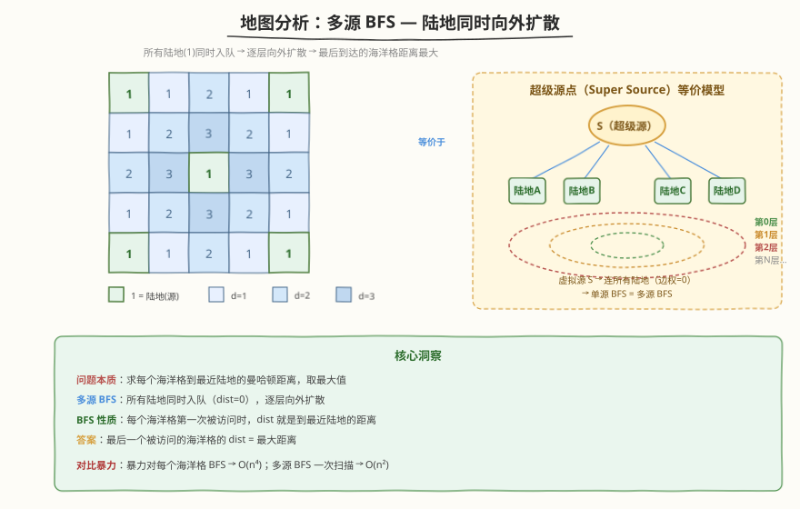
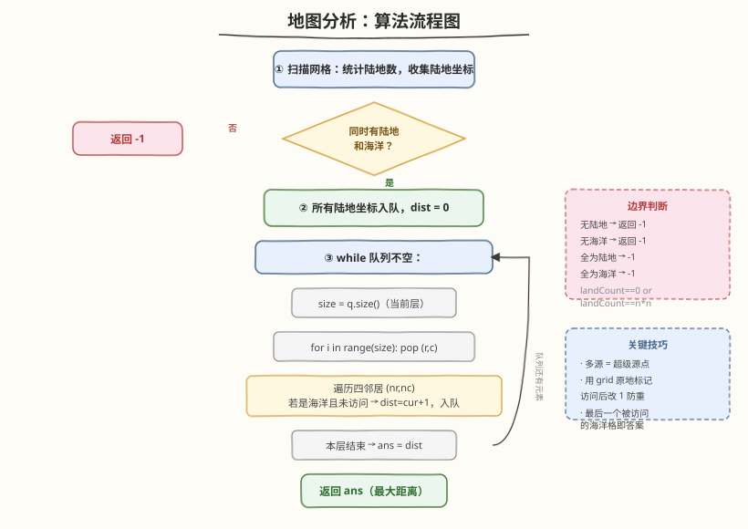
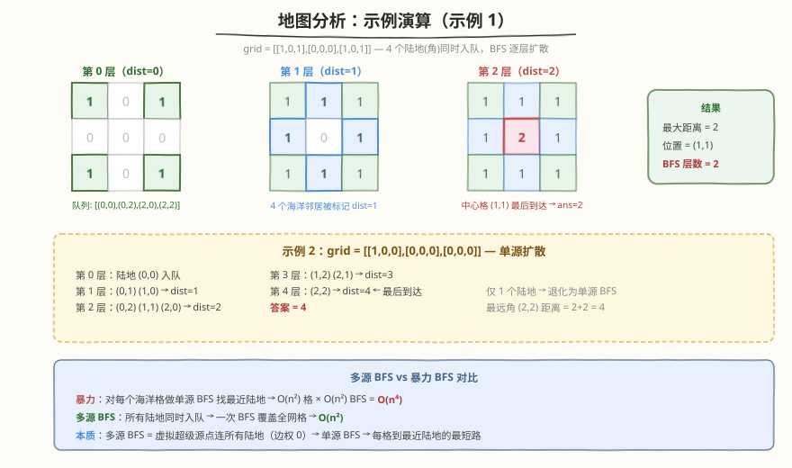

# 地图分析

- **题目名称**：地图分析
- **链接**：[1162. 地图分析](https://leetcode.cn/problems/as-far-from-land-as-possible/)
- **难度**：中等
- **标签**：广度优先搜索、矩阵、多源 BFS

## 1. 题目概述

给定 `n×n` 网格 `grid`，每个格子：`1`=陆地，`0`=海洋。找到一个海洋格，使其到**最近陆地**的曼哈顿距离最大，返回该距离。若网格中只有陆地或只有海洋，返回 `-1`。

曼哈顿距离：$|x_0 - x_1| + |y_0 - y_1|$。

**示例 1**：

```text
输入：grid = [[1,0,1],[0,0,0],[1,0,1]]
输出：2
解释：海洋格 (1,1) 到最近陆地的距离最大，为 2。
```

**示例 2**：

```text
输入：grid = [[1,0,0],[0,0,0],[0,0,0]]
输出：4
解释：海洋格 (2,2) 到最近陆地 (0,0) 的距离最大，为 4。
```

**约束条件**：

- `n == grid.length`
- `n == grid[i].length`
- `1 <= n <= 100`
- `grid[i][j]` 不是 `0` 就是 `1`

---

## 2. 解题思路

### 2.1 暴力思路（每个海洋格做 BFS）

对每个海洋格 `(i,j)` 做一次单源 BFS，找到离它最近的陆地，记录距离。最终取所有海洋格距离的最大值。

- 时间复杂度：$O(n^4)$——$O(n^2)$ 个海洋格，每个 BFS $O(n^2)$
- `n=100` 时约 $10^8$ 次操作，超时风险大

### 2.2 核心观察：多源 BFS



关键洞察：**反过来想**——不从海洋找陆地，而是让所有陆地**同时向外扩散**（多源 BFS）。每个海洋格第一次被波及时的距离，就是它到最近陆地的距离。最后一个被波及的海洋格，距离最大。

> 💡 **多源 BFS = 超级源点**：想象一个虚拟源点 `S`，它连接所有陆地（边权为 0）。从 `S` 做单源 BFS，等价于所有陆地同时出发的多源 BFS。每个海洋格第一次被访问时的层数，就是到最近陆地的最短曼哈顿距离。

### 2.3 算法流程



1. 遍历网格，统计陆地数 `landCount`，所有陆地 `(i,j)` 入队，`grid[i][j]` 标记为已访问（改 `1`）
2. 边界判断：若 `landCount == 0` 或 `landCount == n*n`，返回 `-1`
3. BFS 循环（`dist = 0`）：
   - 取当前队列大小 `size`（当前层 frontier）
   - 逐个 pop，遍历四邻居 `(nr,nc)`
   - 若邻居是海洋且未访问 → 标记为 `1`，入队
   - 本层结束后 `dist++`
4. 队列空时返回 `dist - 1`（最后一层 `dist` 多加了一次）

> ⚠️ **返回值**：BFS 的层数从 `0` 开始（陆地本身是第 0 层），每扩散一层 `dist++`。队列空时 `dist` 比实际最大距离多 1（最后一轮没有新格子入队但仍执行了 `dist++`），所以返回 `dist - 1`。也可以在每次有新海洋入队时更新 `ans = dist`，最终返回 `ans`。

### 2.4 示例演算



`grid = [[1,0,1],[0,0,0],[1,0,1]]`：

| 层 | frontier（出队） | 新标记海洋（dist） | 队列变化 |
|----|-------------------|---------------------|----------|
| 0 | (0,0)(0,2)(2,0)(2,2) | 无 | 4 陆地入队 |
| 1 | 4 个陆地 | (0,1)(1,0)(1,2)(2,1) → dist=1 | 4 海洋入队 |
| 2 | 4 个 dist=1 的海洋 | (1,1) → dist=2 | 1 海洋入队 |
| 3 | (1,1) | 无（无未访问海洋） | 队列空 |

最大距离 = 2，即中心格 `(1,1)` 到最近陆地的距离。

---

## 3. 参考代码

### C++

```cpp
class Solution {
  public:
    int maxDistance(vector<vector<int>>& grid) {
        int n = grid.size();
        queue<pair<int,int>> q;
        int landCount = 0;
        for (int i = 0; i < n; i++)
            for (int j = 0; j < n; j++) {
                if (grid[i][j] == 1) {
                    q.push({i, j});
                    landCount++;
                }
            }
        if (landCount == 0 || landCount == n * n)
            return -1;

        int dirs[4][2] = {{0,1},{0,-1},{1,0},{-1,0}};
        int dist = 0;
        while (!q.empty()) {
            int size = q.size();
            for (int k = 0; k < size; k++) {
                auto [i, j] = q.front(); q.pop();
                for (auto& d : dirs) {
                    int ni = i + d[0], nj = j + d[1];
                    if (ni >= 0 && ni < n && nj >= 0 && nj < n && grid[ni][nj] == 0) {
                        grid[ni][nj] = 1;
                        q.push({ni, nj});
                    }
                }
            }
            dist++;
        }
        return dist - 1;
    }
};
```

### Python

```python
class Solution:
    def maxDistance(self, grid: List[List[int]]) -> int:
        n = len(grid)
        q = collections.deque()
        land_count = 0
        for i in range(n):
            for j in range(n):
                if grid[i][j] == 1:
                    q.append((i, j))
                    land_count += 1
        if land_count == 0 or land_count == n * n:
            return -1

        dirs = [(0,1),(0,-1),(1,0),(-1,0)]
        dist = 0
        while q:
            for _ in range(len(q)):        # 当前层 frontier
                i, j = q.popleft()
                for di, dj in dirs:
                    ni, nj = i + di, j + dj
                    if 0 <= ni < n and 0 <= nj < n and grid[ni][nj] == 0:
                        grid[ni][nj] = 1
                        q.append((ni, nj))
            dist += 1
        return dist - 1
```

---

## 4. 复杂度分析

| 维度 | 复杂度 | 说明 |
|------|--------|------|
| 时间复杂度 | $O(n^2)$ | 每个格子最多入队一次，BFS 一轮覆盖全网格 |
| 空间复杂度 | $O(n^2)$ | 队列最坏存所有格子 |

---

## 5. 扩展：多源 BFS 的等价模型

- **超级源点法**：虚拟一个源点 `S`，连到所有陆地（边权 0），从 `S` 做单源 BFS = 多源 BFS。每个海洋格的 BFS 层数 = 到最近陆地的曼哈顿距离
- **DP 法（两次扫描）**：从左上→右下和右下→左上各扫一遍，`dp[i][j] = min(dp[i-1][j], dp[i][j-1]) + 1`（海洋），取 `dp` 最大值。时间 $O(n^2)$，但只能处理曼哈顿距离（四连通），不如 BFS 直观
- **与 542. 01 矩阵同构**：542 求每个 0 到最近 1 的距离，本题求每个 0 到最近 1 的**最大**距离——完全相同的多源 BFS 框架，只是返回值不同

---

## 6. 面试要点

1. **为什么用多源 BFS 而不是对每个海洋格做 BFS？**

   - 暴力对每个海洋格做单源 BFS 是 $O(n^4)$，`n=100` 超时
   - 多源 BFS 让所有陆地同时入队，一次 BFS 覆盖全网格，$O(n^2)$
   - 本质：多源 BFS = 超级源点连所有陆地的单源 BFS，每个海洋格第一次被访问即得到最近陆地距离

2. **为什么 BFS 第一次访问就是最近距离？**

   - BFS 按层扩展，先到先访问。陆地从所有方向同时扩散，海洋格被最近的陆地先波及
   - 曼哈顿距离对应四连通网格上的最短路径，BFS 天然求无权图最短路

3. **怎么处理只有陆地或只有海洋的情况？**

   - 统计陆地数 `landCount`：`landCount == 0`（无陆地）或 `landCount == n*n`（无海洋）时返回 `-1`
   - 必须在 BFS 前判断，否则 `landCount == 0` 时队列为空直接退出，`dist - 1 = -1` 碰巧正确但不清晰

4. **返回值为什么是 `dist - 1`？**

   - 陆地是第 0 层，`dist` 从 0 开始
   - 每层结束后 `dist++`，最后一层没有新格子入队但也执行了 `dist++`
   - 所以实际最大距离 = `dist - 1`
   - 也可在每次入队海洋时更新 `ans = dist`，循环结束后返回 `ans`，避免 `-1` 的困惑

5. **能否不用额外空间标记访问？**

   - 可以。利用 `grid` 原地标记：访问过的海洋格改为 `1`（变成"陆地"），后续不再访问
   - 这种写法会修改输入，面试时需说明；若要求不改输入，可用 `visited` 矩阵或 `dist` 矩阵

---

## 7. 同类练习题

- [994. 腐烂的橘子](https://leetcode.cn/problems/rotting-oranges/)：多源 BFS 逐层扩散，求所有橘子腐烂的最少分钟数（返回层数而非最大距离）
- [542. 01 矩阵](https://leetcode.cn/problems/01-matrix/)：多源 BFS 求每个 0 到最近 1 的距离，返回距离矩阵（本题的结构母题）
- [1926. 网格图中递增路径的数目](https://leetcode.cn/problems/number-of-increasing-paths-in-a-grid/)：网格 DFS + 记忆化，与 BFS 扩散思路互补
- [130. 被围绕的区域](https://leetcode.cn/problems/surrounded-regions/)：从边界做多源 BFS/DFS 标记不可捕获的区域，多源边界扩散的经典应用
