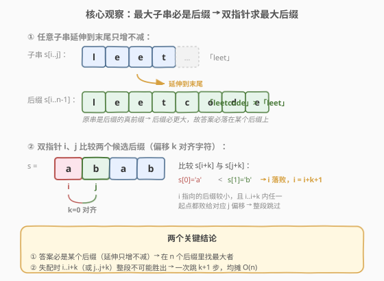
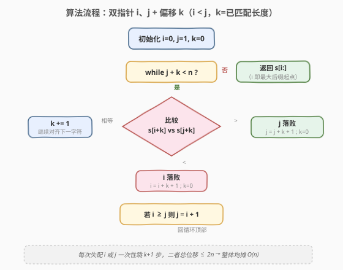
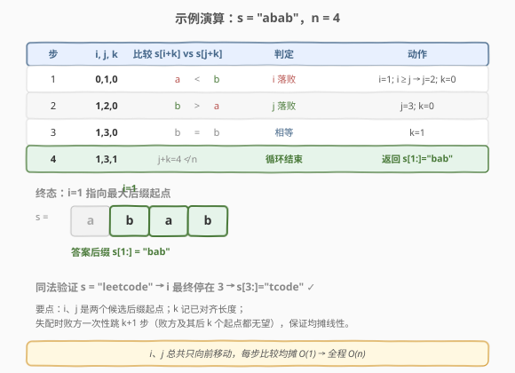

# 按字典序排在最后的子串

- **题目名称**：按字典序排在最后的子串
- **链接**：[1163. 按字典序排在最后的子串](https://leetcode.cn/problems/last-substring-in-lexicographical-order/)
- **难度**：困难
- **标签**：字符串、双指针

## 1. 题目概述

给你一个字符串 `s`，找出它的所有子串并按字典序排列，返回排在最后的那个子串（即字典序最大的子串）。

**示例 1**：

```text
输入：s = "abab"
输出："bab"
解释：7 个子串 ["a","ab","aba","abab","b","ba","bab"] 中，字典序最大的是 "bab"。
```

**示例 2**：

```text
输入：s = "leetcode"
输出："tcode"
```

**约束条件**：

- `1 <= s.length <= 4 * 10^5`
- `s` 仅含有小写英文字母

> 💡 题眼在「子串」+「字典序最大」：子串数量是 $O(n^2)$ 的，但真正可能胜出的子串极少——关键是发现**答案必是某个后缀**，从而把候选集从 $O(n^2)$ 砍到 $O(n)$。

---

## 2. 解题思路

### 2.1 暴力思路

枚举所有子串起点 $i$ 和终点 $j$（$O(n^2)$ 个），逐一比较字典序取最大。比较两个子串最多 $O(n)$，总复杂度 $O(n^3)$；即便只枚举 $O(n)$ 个后缀两两比较也是 $O(n^2)$。$n$ 可达 $4\times10^5$，必然超时。

### 2.2 核心观察：最大子串必是后缀 → 双指针求最大后缀



**第一步：答案必落在某个后缀上。** 对任意子串 $s[i..j]$（$j<n-1$），把它延伸到末尾得到后缀 $s[i..n-1]$。此时 $s[i..j]$ 是 $s[i..n-1]$ 的**真前缀**，而真前缀的字典序严格小于原串。所以延伸只增不减——字典序最大的子串**一定是某个后缀**。问题归约为：在 $n$ 个后缀中找字典序最大者。

**第二步：双指针 + 偏移 $k$ 加速比较。** 维护两个候选后缀起点 $i$、$j$（$i<j$）和「已匹配长度」$k$：$s[i..i+k-1] == s[j..j+k-1]$，下一步比较 $s[i+k]$ 与 $s[j+k]$。

- **相等**：$k\!+\!+$，继续对齐下一字符。
- **$s[i+k] < s[j+k]$**：后缀 $i$ 落败。更关键的是，因为 $s[i..i+k-1]==s[j..j+k-1]$ 且 $s[i+k]<s[j+k]$，**起点 $i, i+1, \dots, i+k$ 的后缀分别败给起点 $j, j+1, \dots, j+k$ 的后缀**——整段无望，直接令 $i = i+k+1$ 一次跳过。
- **$s[i+k] > s[j+k]$**：对称地 $j = j+k+1$ 跳过 $j..j+k$。

> ⚠️ **为什么能「整段跳过」？** 这是均摊线性的灵魂。以 $s[i+k] < s[j+k]$ 为例：对任意 $0 \le m \le k$，后缀 $s[i+m..]$ 与 $s[j+m..]$ 的前 $k-m$ 个字符相同（由 $s[i..i+k-1]==s[j..j+k-1]$ 截取），在第 $k-m$ 位上分别是 $s[i+k]$ 与 $s[j+k]$，而 $s[i+k]<s[j+k]$，故 $s[i+m..] < s[j+m..]$。即 $i$ 到 $i+k$ 这 $k+1$ 个起点都被某个更优后缀压制，无一可能成为答案，可一次性剔除。

### 2.3 算法流程图



三分支决策 + 失配时败方跳 $k+1$ 步 + 重置 $k$，并始终维持 $i<j$（若 $i\ge j$ 则令 $j=i+1$）。循环条件 $j+k<n$ 保证 $s[j+k]$ 不越界。

### 2.4 示例演算



以 `s = "abab"` 为例，4 步即定：

- **步 1** `i=0,j=1,k=0`：$s[0]\!=\!a < b\!=\!s[1]$ → $i$ 落败，$i\!=\!1$，$i\!\ge\!j$ 故 $j\!=\!2$，$k\!=\!0$。
- **步 2** `i=1,j=2,k=0`：$s[1]\!=\!b > a\!=\!s[2]$ → $j$ 落败，$j\!=\!3$，$k\!=\!0$。
- **步 3** `i=1,j=3,k=0`：$s[1]\!=\!b == b\!=\!s[3]$ → $k\!=\!1$。
- **步 4** `i=1,j=3,k=1`：$j\!+\!k\!=\!4 \not< 4$，循环结束，返回 $s[1:]\!=\!$`"bab"`。

同法验证 `"leetcode"`：$i$ 一路淘汰所有 `l/e/e` 开头的后缀，最终停在 $i=3$，返回 `s[3:]="tcode"`。

---

## 3. 参考代码

### C++

```cpp
class Solution {
public:
    string lastSubstring(string s) {
        int n = s.size();
        int i = 0, j = 1, k = 0;
        while (j + k < n) {
            char a = s[i + k], b = s[j + k];
            if (a == b) {
                k++;
            } else if (a < b) {
                i = i + k + 1;        // i..i+k 整段败给 j..j+k
                if (i >= j) j = i + 1; // 维持 i < j
                k = 0;
            } else {
                j = j + k + 1;        // j..j+k 整段败给 i..i+k
                k = 0;
            }
        }
        return s.substr(i);
    }
};
```

### Python

```python
class Solution:
    def lastSubstring(self, s: str) -> str:
        n = len(s)
        i, j, k = 0, 1, 0
        while j + k < n:
            a, b = s[i + k], s[j + k]
            if a == b:
                k += 1
            elif a < b:
                i = i + k + 1         # i..i+k 整段败给 j..j+k
                if i >= j:
                    j = i + 1         # 维持 i < j
                k = 0
            else:
                j = j + k + 1         # j..j+k 整段败给 i..i+k
                k = 0
        return s[i:]
```

> ⚠️ **两处易错点**：
> - `i = i + k + 1` 后必须检查 `i >= j` 并修正 `j = i + 1`。失配时 $k$ 可能很大（两后缀重叠），跳跃后 $i$ 可能超过 $j$，不修正会破坏「$i<j$ 且两候选不重合」的不变式。
> - 循环条件用 `j + k < n` 而非 `j < n`：因为相等分支只增 $k$，要保证访问 `s[j+k]` 不越界。

---

## 4. 复杂度分析

| 维度 | 复杂度 | 说明 |
|------|--------|------|
| 时间复杂度 | $O(n)$ | 比较要么 $k\!+\!+$（推进 $j\!+\!k$），要么 $i$ 或 $j$ 一次性前进 $k\!+\!1$；$i$、$j$ 单调不减且总和 $\le 2n$，$k$ 的总增量也被 $j\!+\!k \le n$ 封顶，均摊 $O(1)$ 每步 |
| 空间复杂度 | $O(1)$ | 仅用 $i,j,k$ 三个整型指针，原地比较，返回时取子串视图 |

$n = 4\times10^5$ 下线性算法轻松通过。对比暴力 $O(n^2)$，关键在于**「整段跳过」把每次失配的代价摊到之前累计的匹配长度上**——这正是 KMP / Boyer-Moore 系「利用已匹配信息加速」思想的同源体现。

---

## 5. 扩展：最小表示与循环串

本题求**最大后缀**。与之对偶的经典问题是「**字符串的最小表示**」——求一个串所有循环同构中字典序最小者（即把串看作环，找最优切断点）。最小表示同样用双指针 + 偏移 $k$ 的均摊 $O(n)$ 算法，结构几乎一致，只是比较方向取「更小者胜」并允许越过末尾回卷。

> 💡 二者的同构性：最大后缀是「直线串的最优起点」，最小表示是「循环串的最优起点」。把循环展开为 $s+s$ 后，最小表示问题可转化为在长度 $2n$ 的串上求一个长度 $\le n$ 的最小「窗口后缀」，仍属同一家族技巧。LeetCode 上 796「旋转字符串」判定两串是否互为循环同构，正是该模型的应用入口。

另一条进阶路线是**后缀数组 / 后缀自动机**：本题亦可 SA 排序所有后缀取末位，复杂度 $O(n\log n)$。但双指针法常数更小、空间 $O(1)$，是此题的最优工程解。

---

## 6. 面试要点

1. **为什么最大子串一定是后缀？**

   > 任意子串 $s[i..j]$ 若未到末尾，延伸到 $s[i..n-1]$ 后原串成为真前缀，真前缀字典序严格更小，故延伸只增不减。因此候选只需考虑 $n$ 个后缀。

2. **失配时为什么能一次跳 $k+1$ 步？**

   > 已匹配段 $s[i..i+k-1]==s[j..j+k-1]$。若 $s[i+k]<s[j+k]$，则对任意 $0\le m\le k$，后缀 $s[i+m..]$ 与 $s[j+m..]$ 前 $k-m$ 位相同、第 $k-m$ 位分别为 $s[i+k]$、$s[j+k]$，故 $s[i+m..]<s[j+m..]$。$i$ 到 $i+k$ 这 $k+1$ 个起点全被压制，整段剔除。

3. **时间复杂度为什么是 $O(n)$ 而非 $O(n^2)$？**

   > 势能分析：$i$、$j$ 单调不减，两者之和 $\le 2n$；每次失配 $i$ 或 $j$ 前进 $k+1$，而 $k$ 的总增量受 $j+k\le n$ 封顶。每个字符作为 $i+k$ 或 $j+k$ 被访问的次数为常数级，整体均摊 $O(n)$。

4. **`i = i + k + 1` 后为什么要检查 `i >= j`？**

   > 两个候选后缀可能重叠（$k$ 可超过 $j-i$），跳跃后 $i$ 可能 $\ge j$。若不修正会破坏 $i<j$ 不变式，导致两指针指向同一后缀或越界。用 `if i >= j: j = i + 1` 重置即可。

5. **用后缀数组能不能做？为什么这里选双指针？**

   > 后缀数组排序后取末位可解，$O(n\log n)$ 时间、$O(n)$ 空间，但实现重、常数大。双指针法 $O(n)$ 时间、$O(1)$ 空间，代码 10 行，是此题的最优解。面试中先讲「答案必是后缀」的观察，再自然引出双指针，比直接甩 SA 更显功力。

> 💡 **一句话总结**：1163 是「最大后缀」问题——先用「真前缀更小」把候选从 $O(n^2)$ 子串收缩到 $O(n)$ 后缀，再用「已匹配段失配即整段跳过」的双指针把两两比较加速到均摊 $O(n)$，与 KMP 同源。

---

## 7. 同类练习题

- [1044. 最长重复子串](https://leetcode.cn/problems/longest-duplicate-substring/)：后缀数组 / 二分 + 滚动哈希求最长重复子串，同为「子串 + 后缀 + 字典序」家族，对照「排序后缀」与「双指针比较后缀」两种切入
- [796. 旋转字符串](https://leetcode.cn/problems/rotate-string/)：判定两串是否互为循环同构，是「最小/最大表示」模型的入口，与最大后缀双指针同源
- [459. 重复的子字符串](https://leetcode.cn/problems/repeated-substring-pattern/)：判断串是否由某子串重复构成，KMP fail 表思路，同为「利用已匹配信息加速」的均摊线性技巧
- [14. 最长公共前缀](https://leetcode.cn/problems/longest-common-prefix/)（[题解](../0001-0100/14_最长公共前缀.md)）：偏移 $k$ 本质上就是在增量计算两个后缀的最长公共前缀（LCP），对照朴素 LCP 与本题的批量跳过
