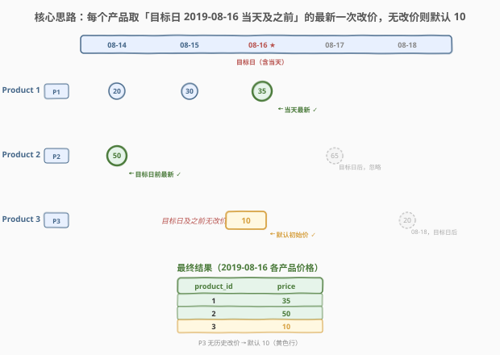
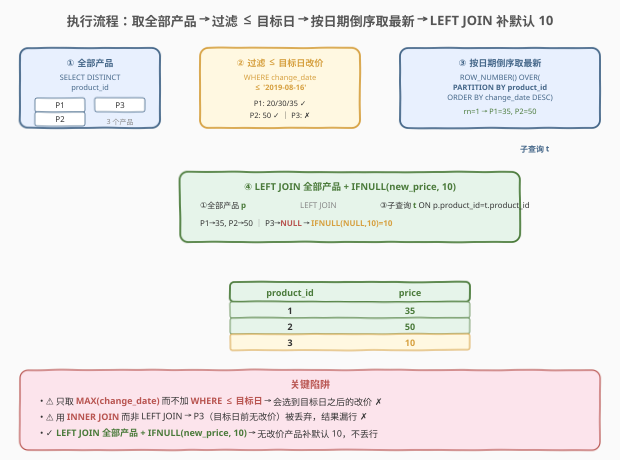
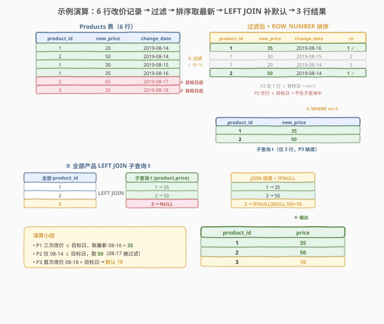

# 指定日期的产品价格

- **题目名称**：指定日期的产品价格
- **链接**：[1164. 指定日期的产品价格](https://leetcode.cn/problems/product-price-at-a-given-date/)
- **难度**：中等
- **标签**：SQL、窗口函数、ROW_NUMBER、LEFT JOIN、IFNULL、子查询、点时查询

## 1. 题目概述

给定 `Products` 表，记录每个产品在不同日期的改价事件。编写 SQL 查询，找出 **`2019-08-16`** 这一天**所有产品**的价格。产品在首次改价前价格为 `10`；若某产品在 `2019-08-16`（含当天）之前没有任何改价记录，则其当日价格取默认值 `10`。

**表结构**：

```text
Table: Products
+---------------+---------+
| Column Name   | Type    |
+---------------+---------+
| product_id    | int     |
| new_price     | int     |
| change_date   | date    |
+---------------+---------+
(product_id, change_date) 是此表的主键（具有唯一值的列组合）。
```

> ⚠️ 每一行记录的是某产品在某个日期**更改后**的新价格——这意味着同一产品可能有多行（多次改价），且同一产品同一日期不会出现两次（主键约束）。题目要求「所有产品」都出现在结果中，包括目标日之前从未改过价的产品（此时价格为默认 `10`）。

**示例 1**：

```text
输入：
Products 表:
+------------+-----------+-------------+
| product_id | new_price | change_date |
+------------+-----------+-------------+
| 1          | 20        | 2019-08-14  |
| 2          | 50        | 2019-08-14  |
| 1          | 30        | 2019-08-15  |
| 1          | 35        | 2019-08-16  |
| 2          | 65        | 2019-08-17  |
| 3          | 20        | 2019-08-18  |
+------------+-----------+-------------+

输出：
+------------+-------+
| product_id | price |
+------------+-------+
| 2          | 50    |
| 1          | 35    |
| 3          | 10    |
+------------+-------+
```

**解释**：

| 产品 | 目标日及之前的改价记录 | 选中价格 | 说明 |
|------|----------------------|----------|------|
| 1 | 08-14→20、08-15→30、08-16→35 | 35 | 取 ≤ 08-16 的最新一次（08-16 当天），价格为 35 |
| 2 | 08-14→50（08-17→65 在目标日后，不计） | 50 | ≤ 08-16 的最新一次是 08-14，价格为 50 |
| 3 | 无（首次改价 08-18 > 目标日） | 10 | 目标日前从未改价，取默认初始价 10 |

**约束条件**：

- `(product_id, change_date)` 是主键，同一产品同一日期不会重复
- 目标日 **`2019-08-16`** 包含当天：`change_date <= '2019-08-16'`
- 产品首次改价前价格为 `10`——目标日前无改价记录的产品输出 `10`
- 结果需包含**所有产品**（含目标日前未改价者），以任意顺序返回
- 输出列名：`product_id`、`price`

> 💡 本题是 SQL **"点时查询（point-in-time lookup）"招牌题**——核心就两步：① 对每个产品取「目标日及之前」的**最新一次**改价记录；② 对目标日前从未改价的产品用 `LEFT JOIN` 保留并补默认 `10`。难点不在逻辑复杂，而在两个陷阱：① 取最新时必须先 `WHERE change_date <= 目标日` 过滤，否则会选到目标日之后的改价；② 必须用 `LEFT JOIN`（而非 `INNER JOIN`）保留所有产品，否则目标日前未改价的产品会丢失。

---

## 2. 解题思路

### 2.1 暴力思路：逐产品扫描取最新

最直觉的过程式思路：先拿到所有不同的 `product_id`，对每个产品遍历其全部改价记录，筛出 `change_date <= '2019-08-16'` 的行，再从中取 `change_date` 最大的一行读 `new_price`；若无任何满足条件的行，则记 `10`。伪代码如下：

```text
result = []
products = DISTINCT(product_id) FROM Products
for pid in products:
    changes = [row for row in Products if row.product_id == pid and row.change_date <= '2019-08-16']
    if changes:
        latest = max(changes, key=lambda r: r.change_date)
        result.append((pid, latest.new_price))
    else:
        result.append((pid, 10))
return result
```

但**纯 SQL 没有显式逐行循环**——需要换成集合式表达。「对每个产品取满足条件的最新一行」在 SQL 中有两种自然翻译：

- **窗口函数**：`ROW_NUMBER() OVER (PARTITION BY product_id ORDER BY change_date DESC)` 给每组按日期倒序编号，取 `rn = 1` 即最新。
- **聚合 + 关联回原表**：子查询 `SELECT product_id, MAX(change_date) ... WHERE change_date <= 目标日 GROUP BY product_id` 得到每人最新日期，再 `JOIN` 原表取对应价格。

> ⚠️ 关键前提：无论哪种翻译，**「`change_date <= 目标日`」过滤必须先于「取最新」**。若先取 `MAX(change_date)` 再过滤，会把目标日之后的改价也算进来——例如产品 2 会错误选中 08-17 的 65 而非 08-14 的 50。

### 2.2 核心观察：过滤目标日 + 取最新 + LEFT JOIN 补默认



**三个关键点**：

1. **先过滤再取最新**：`WHERE change_date <= '2019-08-16'` 把目标日之后的改价剔除，确保「最新」是在目标日及之前的范围内取。产品 2 的 08-17→65 被过滤后，最新变为 08-14→50。

   $$\text{price}(\text{pid},\;\text{target}) = \text{new\_price}\;\text{WHERE}\;\text{change\_date} = \max\{\text{change\_date} \mid \text{change\_date} \leq \text{target}\}$$

2. **窗口函数取每组最新**：`ROW_NUMBER() OVER (PARTITION BY product_id ORDER BY change_date DESC)` 对过滤后的记录按产品分组、日期倒序编号，`rn = 1` 即每个产品在目标日及之前的最新改价。相比 `MAX(change_date) + JOIN` 回原表，窗口函数一步到位、无需自连接。

3. **`LEFT JOIN` 保留全部产品 + `IFNULL` 补默认**：目标日前未改价的产品（如产品 3）不在子查询中——需先 `SELECT DISTINCT product_id` 拿到全部产品作为左表，再 `LEFT JOIN` 子查询，未匹配者 `new_price` 为 `NULL`，用 `IFNULL(new_price, 10)` 补默认值。若用 `INNER JOIN`，产品 3 会丢失。

> 💡 **"点时查询"的本质**：这是一类经典的 "as-of lookup"（截至某时刻的最新状态）问题，在数仓中对应缓慢渐变维度（SCD Type 2）的 Point-in-Time 查询。通用模板：「过滤 ≤ 目标时刻 → 按时间倒序取 Top-1 → LEFT JOIN 全集补默认值」。

> ⚠️ **两个致命陷阱**：
> - **取最新时不过滤目标日**：若先 `MAX(change_date)` 再事后过滤（或根本不过滤），会选到目标日之后的改价。产品 2 会错选 08-17→65 而非 08-14→50。
> - **用 `INNER JOIN` 丢产品**：子查询只含目标日前有改价的产品。若不 `LEFT JOIN` 全部产品，产品 3（目标日前无改价）会从结果中消失，而非输出默认 10。

### 2.3 算法流程图



**逻辑执行步骤**：

| 步骤 | 子句 | 作用 |
|------|------|------|
| ① | `FROM (SELECT DISTINCT product_id FROM Products) p` | 拿到全部产品作为左表（保留侧） |
| ② | `WHERE change_date <= '2019-08-16'`（子查询内） | 剔除目标日之后的改价，缩小取最新范围 |
| ③ | `ROW_NUMBER() OVER (PARTITION BY product_id ORDER BY change_date DESC) AS rn` + `WHERE rn = 1` | 每组按日期倒序编号，取第 1 行即目标日及之前的最新改价 |
| ④ | `LEFT JOIN` 子查询 `t` + `IFNULL(t.new_price, 10) AS price` | 未匹配产品 `new_price` 为 `NULL`，补默认 10 |

> 💡 **SQL 子句执行顺序**：`FROM`（含 `JOIN`/`ON`）→ `WHERE` → `GROUP BY` → `HAVING` → `SELECT`（含窗口函数）→ `ORDER BY` → `LIMIT`。窗口函数在 `SELECT` 阶段求值，但作用于 `WHERE` 过滤后的行集——因此步骤 ② 的 `WHERE change_date <= 目标日` 先于步骤 ③ 的 `ROW_NUMBER`，保证排序范围已排除目标日后的记录。⚠️ 注意 `rn = 1` 的过滤不能写在原查询的 `WHERE` 中（窗口函数此时尚未求值），必须包一层子查询。

### 2.4 示例演算

以示例 1 数据为例，观察过滤 → 排序 → 取最新 → 补默认的逐步执行过程：



**步骤 ①：`WHERE change_date <= '2019-08-16'` 过滤**

`Products` 共 6 行，过滤后剔除目标日之后的 2 行（产品 2 的 08-17、产品 3 的 08-18），保留 4 行：

| product_id | new_price | change_date | 保留？ | 说明 |
|------------|-----------|-------------|--------|------|
| 1 | 20 | 2019-08-14 | ✓ | ≤ 目标日 |
| 2 | 50 | 2019-08-14 | ✓ | ≤ 目标日 |
| 1 | 30 | 2019-08-15 | ✓ | ≤ 目标日 |
| 1 | 35 | 2019-08-16 | ✓ | ≤ 目标日（含当天） |
| 2 | 65 | 2019-08-17 | ✗ | > 目标日，被过滤 |
| 3 | 20 | 2019-08-18 | ✗ | > 目标日，被过滤 |

> 💡 产品 3 的唯一改价记录在 08-18，被过滤后子查询中无产品 3 的任何行——这正是后续需要 `LEFT JOIN` 补默认的原因。

**步骤 ②：`ROW_NUMBER() OVER (PARTITION BY product_id ORDER BY change_date DESC)` 排序**

对过滤后的 4 行按产品分组、日期倒序编号：

| product_id | new_price | change_date | rn | 说明 |
|------------|-----------|-------------|----|------|
| 1 | 35 | 2019-08-16 | 1 | P1 分组最新 ✓ |
| 1 | 30 | 2019-08-15 | 2 | P1 次新 |
| 1 | 20 | 2019-08-14 | 3 | P1 最早 |
| 2 | 50 | 2019-08-14 | 1 | P2 分组最新（仅 1 行）✓ |

**步骤 ③：`WHERE rn = 1` 取每组最新**

子查询 `t` 仅保留 `rn = 1` 的行，得到每个有改价产品的目标日最新价格：

| product_id | new_price |
|------------|-----------|
| 1 | 35 |
| 2 | 50 |

> 💡 子查询 `t` 只有 2 行——产品 3 因目标日前无改价记录而缺席。

**步骤 ④：`LEFT JOIN` 全部产品 + `IFNULL(new_price, 10)`**

以全部产品 `{1, 2, 3}` 为左表 `LEFT JOIN` 子查询 `t`，未匹配者补默认：

| product_id | t.new_price | IFNULL(new_price, 10) AS price | 说明 |
|------------|-------------|--------------------------------|------|
| 1 | 35 | 35 | 匹配，直接取 |
| 2 | 50 | 50 | 匹配，直接取 |
| 3 | NULL | 10 | 未匹配，补默认 |

> 💡 **对比 `INNER JOIN` 的错误结果**：若误用 `INNER JOIN`，产品 3 不在子查询 `t` 中，连接后直接消失，结果只剩产品 1、2，漏掉产品 3 的 `price = 10`。`LEFT JOIN` + `IFNULL` 是"保留全集 + 补默认值"的标准搭配。

最终输出与示例一致。

---

## 3. 参考代码

### SQL（解法 A：ROW_NUMBER 窗口函数 + LEFT JOIN，推荐）

```sql
SELECT p.product_id,
       IFNULL(t.new_price, 10) AS price
FROM (SELECT DISTINCT product_id FROM Products) p
LEFT JOIN (
    SELECT product_id, new_price
    FROM (
        SELECT product_id,
               new_price,
               ROW_NUMBER() OVER (
                   PARTITION BY product_id
                   ORDER BY change_date DESC
               ) AS rn
        FROM Products
        WHERE change_date <= '2019-08-16'
    ) ranked
    WHERE rn = 1
) t ON p.product_id = t.product_id;
```

> 💡 **写法要点**：
> - **最内层**：`WHERE change_date <= '2019-08-16'` 先过滤目标日后的改价，再用 `ROW_NUMBER() OVER (PARTITION BY product_id ORDER BY change_date DESC)` 按产品分组、日期倒序编号。
> - **中间层**：`WHERE rn = 1` 取每组最新。⚠️ 窗口函数在 `SELECT` 阶段求值，不能用 `WHERE rn = 1` 直接过滤原查询，必须包一层子查询。
> - **最外层**：`SELECT DISTINCT product_id` 拿全部产品作左表，`LEFT JOIN` 子查询保留所有产品，`IFNULL(t.new_price, 10)` 给未匹配产品补默认 10。
> - 题目允许任意顺序，故无需 `ORDER BY`（若需稳定输出可加 `ORDER BY product_id`）。

### SQL（解法 B：子查询 MAX(change_date) + 自连接 + LEFT JOIN）

```sql
SELECT p.product_id,
       IFNULL(pr.new_price, 10) AS price
FROM (SELECT DISTINCT product_id FROM Products) p
LEFT JOIN Products pr
    ON pr.product_id = p.product_id
    AND pr.change_date = (
        SELECT MAX(change_date)
        FROM Products
        WHERE product_id = p.product_id
          AND change_date <= '2019-08-16'
    );
```

> 💡 **写法要点**：用**相关子查询** `SELECT MAX(change_date) ... WHERE product_id = p.product_id AND change_date <= '2019-08-16'` 为每个产品算出目标日及之前的最新改价日期，再通过 `ON product_id = p.product_id AND change_date = (子查询)` 把该日期对应的价格关联回来。
>
> 与解法 A 的区别：解法 A 用窗口函数一次扫描排序取 Top-1；解法 B 用 `MAX` 聚合 + 自连接回原表取价格，更符合"先算日期再关联"的过程式直觉。⚠️ 相关子查询对外层每行执行一次，数据量大时可能比解法 A 慢；但在 `product_id` 上有索引时，子查询可走索引探测。

### SQL（解法 C：UNION 两段拼接）

```sql
-- 段一：目标日及之前有改价的产品，取最新改价价格
SELECT product_id, new_price AS price
FROM Products
WHERE (product_id, change_date) IN (
    SELECT product_id, MAX(change_date)
    FROM Products
    WHERE change_date <= '2019-08-16'
    GROUP BY product_id
)
UNION
-- 段二：目标日前从未改价的产品，取默认 10
SELECT DISTINCT product_id, 10 AS price
FROM Products
WHERE product_id NOT IN (
    SELECT product_id FROM Products WHERE change_date <= '2019-08-16'
);
```

> 💡 **写法要点**：把结果拆成两段用 `UNION` 拼接。**段一**用子查询 `(product_id, MAX(change_date)) IN (...)` 找到每个有改价产品的最新改价行，取其 `new_price`；**段二**用 `NOT IN` 找出目标日前从未改价的产品，统一赋 `10`。
>
> 与解法 A/B 的区别：解法 C 不依赖 `LEFT JOIN` + `IFNULL`，而是用 `UNION` 显式分两段处理"有改价"和"无改价"两类产品，逻辑更直白但代码更长。⚠️ `UNION` 会去重（两段不会重复，用 `UNION` 或 `UNION ALL` 均可）；段二的 `NOT IN` 需注意 `NULL` 语义（本题 `product_id` 非 `NULL`，安全）。

### Python（pandas）

```python
import pandas as pd

def product_price_at_given_date(products: pd.DataFrame) -> pd.DataFrame:
    target = pd.Timestamp('2019-08-16')
    all_products = products[['product_id']].drop_duplicates()
    changes = products[products['change_date'] <= target]
    latest = (
        changes.sort_values('change_date')
               .drop_duplicates('product_id', keep='last')
    )
    result = all_products.merge(
        latest[['product_id', 'new_price']],
        on='product_id',
        how='left'
    )
    result['price'] = result['new_price'].fillna(10).astype(int)
    return result[['product_id', 'price']]
```

> 💡 **pandas 对照**：
> - `products['change_date'] <= target` 布尔掩码对应 SQL 的 `WHERE change_date <= '2019-08-16'`（先过滤目标日后改价）。
> - `.sort_values('change_date').drop_duplicates('product_id', keep='last')` 对应 `ROW_NUMBER() ORDER BY change_date DESC + WHERE rn=1`——按日期排序后每组保留最后一条（即最新）。
> - `merge(..., how='left')` 对应 `LEFT JOIN`——以全部产品为左表，未匹配者 `new_price` 为 `NaN`。
> - `fillna(10)` 对应 `IFNULL(new_price, 10)`，把 `NaN` 转成默认 10。
> - 思路与 SQL 解法 A 同构：先过滤 → 取最新 → 左连接全集 → 补默认。

---

## 4. 复杂度分析

| 维度 | 解法 A（ROW_NUMBER） | 解法 B（MAX 相关子查询） | 解法 C（UNION） |
|------|----------------------|--------------------------|-----------------|
| **时间** | $O(n \log n)$ | $O(n \times d)$ | $O(n \log n)$ |
| **空间** | $O(n)$ | $O(n)$ | $O(n)$ |
| **扫描次数** | 2 次（全部产品 + 过滤排序） | $n$ 次子查询 + 1 次连接 | 3 次（两段子查询 + NOT IN） |
| **推荐度** | ✓ **首选**，紧凑高效 | ✓ 备选，直觉清晰 | ✓ 备选，逻辑显式 |

> - $n$ = `Products` 表行数，$d$ = 不同产品数
> - **解法 A**：一次扫描过滤 + 窗口函数排序 $O(n \log n)$（每组内排序，通常每组行数很少，接近 $O(n)$）+ 一次 `DISTINCT product_id` 扫描 $O(n)$ + 哈希连接 $O(n)$
> - **解法 B**：相关子查询对外层每个产品执行一次 `MAX` 聚合，最坏 $O(n \times d)$；若 `product_id` 有索引可降为 $O(d \times \log n)$
> - **解法 C**：段一子查询聚合 $O(n)$ + `IN` 匹配 $O(n)$；段二 `NOT IN` 子查询 $O(n)$ + 外层扫描 $O(n)$，总计 $O(n)$（但多次扫描常数较大）
> - **空间**：窗口函数/聚合需为每个产品维护分组状态 $O(n)$；解法 A 的 `DISTINCT` 中间表 $O(d)$
> - **索引优化**：在 `(product_id, change_date)` 上建联合索引，解法 A 的 `WHERE change_date <= 目标日` + `PARTITION BY product_id ORDER BY change_date DESC` 可走索引有序扫描，避免排序；解法 B 的相关子查询可走索引探测

---

## 5. 扩展：点时查询的三种写法对比

### 5.1 窗口函数 vs 聚合自连接 vs UNION

| 维度 | ROW_NUMBER（解法 A） | MAX + 自连接（解法 B） | UNION（解法 C） |
|------|----------------------|------------------------|-----------------|
| **核心思路** | 排序编号取 Top-1 | 先算最新日期再回连取价格 | 两段分别处理有/无改价 |
| **取最新方式** | `ORDER BY change_date DESC` + `rn=1` | `MAX(change_date)` 子查询 | `(pid, MAX(date)) IN (...)` |
| **补默认方式** | `LEFT JOIN` + `IFNULL` | `LEFT JOIN` + `IFNULL` | `UNION` 第二段 `NOT IN` 赋 10 |
| **可读性** | 中（三层嵌套） | 高（直觉清晰） | 中（两段拼接） |
| **性能** | 优（一次排序） | 中（相关子查询） | 中（多次扫描） |
| **扩展性** | 强（易加多个 Top-K） | 弱（多列需多次自连接） | 弱（每加一种默认需多一段） |

> 💡 **选型建议**：简单点时查询用解法 A（窗口函数）最紧凑高效；面试白板写 SQL 时解法 B（`MAX` + 自连接）最直觉、最好讲解法逻辑；解法 C（`UNION`）适合「不同条件分类输出」的场景。三者结果等价，现代优化器对解法 A/B 通常能生成相近执行计划。

### 5.2 窗口函数家族：ROW_NUMBER vs RANK vs DENSE_RANK

本题 `(product_id, change_date)` 是主键，同一产品同一日期不会重复，因此 `ROW_NUMBER`、`RANK`、`DENSE_RANK` 三者结果相同。但若主键约束放宽（允许同日多次改价），三者行为分化：

| 函数 | 同分行为 | 本题（有主键） | 无主键时 |
|------|----------|----------------|----------|
| `ROW_NUMBER()` | 强制唯一编号（随机打破并列） | rn=1 唯一 | 随机选一行 |
| `RANK()` | 并列同号、跳号 | rn=1 唯一 | 并列多个 rn=1 |
| `DENSE_RANK()` | 并列同号、不跳号 | rn=1 唯一 | 并列多个 rn=1 |

> 💡 本题主键保证同产品同日期唯一，用 `ROW_NUMBER` 即可。若放宽约束且需"同日多次改价都取"，应改用 `RANK`/`DENSE_RANK` 并处理多行（如取 `MAX(new_price)`）。

### 5.3 从"指定日期价格"到"价格变动历史"

本题是"截至某日的快照"。若需求变为"列出每个产品每次改价后的价格区间（生效日 ~ 失效日）"，则需用 `LEAD` 窗口函数取下一次改价日期作为当前价格的失效日：

```sql
SELECT product_id,
       new_price AS price,
       change_date AS start_date,
       IFNULL(LEAD(change_date) OVER (PARTITION BY product_id ORDER BY change_date),
              DATE('9999-12-31')) AS end_date
FROM Products;
```

> 💡 `LEAD(change_date) OVER (PARTITION BY product_id ORDER BY change_date)` 取每个产品按日期排序后的**下一次**改价日期，作为当前价格的失效日（即"下一个版本"的生效日）。最后一次改价的 `LEAD` 为 `NULL`，用 `IFNULL` 填一个远期日期表示"至今有效"。这正是数仓中 SCD Type 2 维度表的标准构建方式——本题的"点时查询"就是在这张历史表上做 `WHERE start_date <= target < end_date` 的过滤。

---

## 6. 面试要点

1. **为什么要先 `WHERE change_date <= 目标日` 再取最新？反过来会怎样？**

   > 「取最新」必须在「过滤目标日」之后。若先取 `MAX(change_date)` 再过滤，`MAX` 会选到目标日之后的改价——例如产品 2 的 `MAX(change_date)` 是 08-17（价格 65），但目标日 08-16 的正确价格应是 08-14 的 50。正确顺序是先 `WHERE change_date <= '2019-08-16'` 把目标日后的改价剔除，再在剩余记录中取 `MAX` 或 `ROW_NUMBER` 排序取 Top-1，确保选中的是"目标日及之前的最新"。

2. **为什么必须用 `LEFT JOIN` 而非 `INNER JOIN`？**

   > 子查询只包含目标日前有改价记录的产品。产品 3 的首次改价在 08-18（目标日之后），被 `WHERE change_date <= 目标日` 过滤后不在子查询中。若用 `INNER JOIN`，产品 3 会被丢弃，结果漏行。用 `LEFT JOIN`（左表是 `SELECT DISTINCT product_id` 的全部产品），未匹配产品的 `new_price` 为 `NULL`，再用 `IFNULL(new_price, 10)` 补默认值 10，保证所有产品都出现在结果中。这与 1158（市场分析 I）的"保留零值主体"是同一模式。

3. **`rn = 1` 为什么不能直接写在 `WHERE` 里，要套一层子查询？**

   > 窗口函数（如 `ROW_NUMBER`）在 SQL 逻辑执行顺序中属于 `SELECT` 阶段，在 `WHERE` 之后求值。因此 `WHERE rn = 1` 中的 `rn` 在 `WHERE` 执行时尚未定义，直接写会报错。标准做法是把含窗口函数的查询包成子查询，外层再 `WHERE rn = 1` 过滤。这是窗口函数 Top-K 查询的通用写法。

4. **解法 A（窗口函数）和解法 B（MAX 相关子查询）有什么区别？哪个更好？**

   > 解法 A 用 `ROW_NUMBER` 一次扫描排序取每组 Top-1，解法 B 用相关子查询 `MAX(change_date)` 为每个产品算最新日期再自连接取价格。两者结果等价。解法 A 性能更优——窗口函数只需一次排序，相关子查询对外层每行执行一次（最坏 $O(n \times d)$）。但解法 B 更符合"先算日期再关联"的直觉，面试白板更好讲。现代优化器在有索引时两者执行计划可能趋同。面试答："数据量小用 B 好读；大数据量用 A 高效。"

5. **如果 `Products` 表有上亿行，如何优化？**

   > ① 在 `(product_id, change_date)` 上建联合索引，解法 A 的 `WHERE change_date <= 目标日` + `PARTITION BY product_id ORDER BY change_date DESC` 可走索引有序扫描，避免全表排序。② 解法 B 的相关子查询在 `product_id` 有索引时可走索引探测（Nested Loop），每产品 $O(\log n)$ 定位。③ 若只需查少数产品的当前价格，可在子查询中加 `WHERE product_id IN (...)` 限定范围。④ 若改价频率低，可物化"当前价格表"并增量更新，查询时直接读快照表，避免每次点时计算。

> 💡 **一句话总结**：1164 是 SQL **"点时查询（as-of lookup）"招牌题**——核心模板「过滤 ≤ 目标日 → 按日期倒序取 Top-1 → LEFT JOIN 全集补默认」。两个陷阱：① 取最新前必须先过滤目标日（否则选到未来改价）；② 必须 `LEFT JOIN` 保留全部产品（否则丢未改价产品）。记住"`WHERE ≤ 目标日 + ROW_NUMBER DESC + rn=1 + LEFT JOIN + IFNULL`"模板，所有"截至某时刻最新状态"类 SQL 题都能套用。

---

## 7. 同类练习题

- [1174. 即时食物配送 II](https://leetcode.cn/problems/immediate-food-delivery-ii/)：`MIN(order_date)` 求首次订单日 + 比例统计，同为「按日期取首次/最新事件」模式，对比 1164 取最新
- [511. 游戏玩法分析 I](https://leetcode.cn/problems/game-play-analysis-i/)：`GROUP BY player_id + MIN(event_date)` 求首次登录日期，是 1164「取最早事件」的镜像题
- [550. 游戏玩法分析 IV](https://leetcode.cn/problems/game-play-analysis-iv/)：`LEFT JOIN` 保留全部玩家 + 首次登录日条件连接，共享「保留全集 + 点时关联」思想
- [1070. 产品销售分析 III](https://leetcode.cn/problems/product-sales-analysis-iii/)：`SELECT MIN/MAX + GROUP BY` 取产品在日期范围内的首末销售，同属「按日期聚合取极值行」
- [197. 上升的温度](https://leetcode.cn/problems/rising-temperature/)：`DATEDIFF` 日期比较 + 自连接取昨日数据，对比 1164 理解「自连接按日期关联」基础骨架
