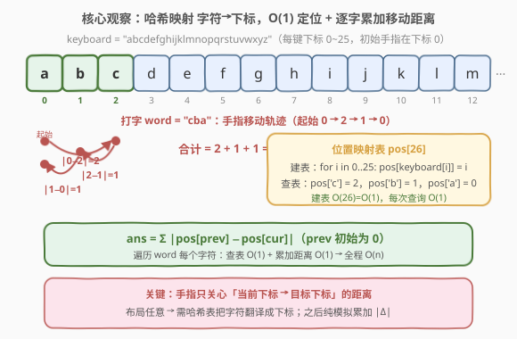
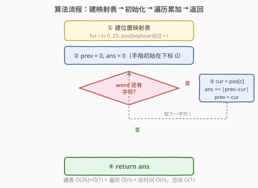
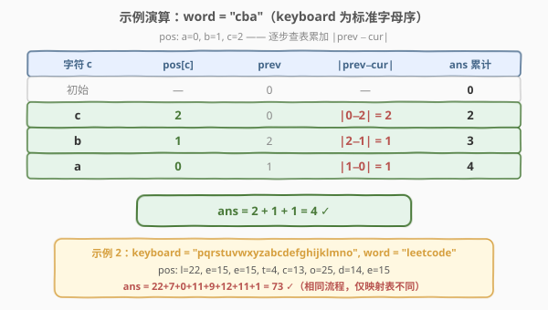

# LeetCode 单行键盘 题解

## 1. 题目概述

- **标题 / 题号**：单行键盘（#1165，easy）
- **链接**：https://leetcode.cn/problems/single-row-keyboard/
- **难度**：简单
- **标签**：哈希表、字符串、模拟

**题意**：有一个特殊键盘，所有按键排列在**同一行**中。给定一个长度为 26 的字符串 `keyboard`，表示键盘上从左到右各键的布局（下标从 0 到 25）。初始时手指位于下标 0 处。要输入一个字符，需要将手指移动到该字符所在的下标，移动代价为 $|i - j|$（从下标 $i$ 到下标 $j$）。

给定一个字符串 `word`，返回输入完整单词的总时间。

**示例 1**：

```text
输入：keyboard = "abcdefghijklmnopqrstuvwxyz", word = "cba"
输出：4
解释：'c' 在下标 2，'b' 在下标 1，'a' 在下标 0。
      移动距离 = |0−2| + |2−1| + |1−0| = 2 + 1 + 1 = 4。
```

**示例 2**：

```text
输入：keyboard = "pqrstuvwxyzabcdefghijklmno", word = "leetcode"
输出：73
```

**约束**：

- `keyboard.length == 26`
- `keyboard` 恰好包含每个英文小写字母一次，顺序任意
- $1 \le \text{word.length} \le 10^4$
- `word` 仅由英文小写字母组成

> 💡 题目本质是**一维坐标模拟**：键盘布局任意（未必字母序），因此字符与其下标之间没有简单公式——需要一张映射表把字符翻译成下标，之后纯模拟累加相邻距离。

## 2. 解题思路

### 2.1 暴力思路：逐字符扫描键盘找下标

最直觉的做法：对 `word` 中的每个字符，线性扫描 `keyboard` 字符串找到其下标，再累加与前一个下标的距离。

```text
prev = 0, ans = 0
for c in word:
    cur = index_of(keyboard, c)   # 线性扫描，O(26)
    ans += |prev - cur|
    prev = cur
return ans
```

每次 `index_of` 需遍历 26 个键，总时间 $O(26n)$。由于 `keyboard` 长度固定为 26，渐近复杂度仍是 $O(n)$，但**常数因子大了 26 倍**——当 `word` 长达 $10^4$ 时，要多做 $2.6 \times 10^5$ 次比较。更关键的是，同一个字符可能被反复查找（如示例 2 中 `e` 出现 3 次），每次都重新扫描是纯粹的重复劳动。

### 2.2 核心观察：预建位置映射表，O(1) 查表 + 逐字累加



关键观察：**键盘布局固定不变**，每个字符的下标在整个打字过程中恒定。因此可以**一次性预处理**出一张「字符 → 下标」的映射表，此后每次查询降为 $O(1)$。

由于只有 26 个小写字母，用**直接寻址表** `pos[26]`（数组）比哈希表更高效——无哈希开销、缓存友好、常数最小：

$$\text{pos}[\text{keyboard}[i] - \text{'a'}] = i, \quad i \in [0, 25]$$

建表后，整个打字过程退化为**一维坐标模拟**：

$$\text{ans} = \sum_{k=1}^{n} |\text{pos}[\text{word}[k-1]] - \text{pos}[\text{word}[k]]|$$

其中 $\text{prev}$ 初始为 0（手指起始位置），每输入一个字符后更新 $\text{prev} \leftarrow \text{cur}$。

> 💡 **为什么直接寻址表优于 `unordered_map`？** 键的取值范围恰好是 26 个连续小写字母（`'a'`~`'z'`），可直接用 `c - 'a'` 作为数组下标。数组访问是 $O(1)$ 且无哈希冲突、无再散列开销，在最坏情况下仍保证常数时间，而 `unordered_map` 在极端情况下可能退化。

### 2.3 算法流程图



整个流程两阶段：**预处理**（建表，$O(26) = O(1)$）+ **模拟**（遍历 `word`，每步查表 $O(1)$ + 累加 $O(1)$），总时间 $O(n)$。

### 2.4 示例演算



以示例 1 为例（`keyboard` 为标准字母序，`word = "cba"`），逐步执行：

| 步骤 | 字符 $c$ | $\text{pos}[c]$ | prev | $|\text{prev} - \text{cur}|$ | ans 累计 |
|------|----------|-----------------|------|------------------------------|----------|
| 初始 | — | — | 0 | — | 0 |
| 1 | c | 2 | 0 | $\|0-2\| = 2$ | 2 |
| 2 | b | 1 | 2 | $\|2-1\| = 1$ | 3 |
| 3 | a | 0 | 1 | $\|1-0\| = 1$ | 4 |

返回 `ans = 4`。

示例 2 同理，仅映射表不同（`p=0, q=1, …, e=15, l=22, o=25` 等），逐字累加 $22+7+0+11+9+12+11+1 = 73$。

## 3. 参考代码

### C++（直接寻址表 + 模拟）

```cpp
class Solution {
public:
    int calculateTime(string keyboard, string word) {
        int pos[26] = {0};
        for (int i = 0; i < 26; i++) {
            pos[keyboard[i] - 'a'] = i;
        }
        int ans = 0, prev = 0;
        for (char c : word) {
            int cur = pos[c - 'a'];
            ans += abs(prev - cur);
            prev = cur;
        }
        return ans;
    }
};
```

### Python

```python
class Solution:
    def calculateTime(self, keyboard: str, word: str) -> int:
        pos = {c: i for i, c in enumerate(keyboard)}
        ans = 0
        prev = 0
        for c in word:
            cur = pos[c]
            ans += abs(prev - cur)
            prev = cur
        return ans
```

> 💡 **写法要点**：① C++ 用定长数组 `pos[26]`，`c - 'a'` 直接做下标，零哈希开销；Python 用字典推导式 `{c: i for i, c in enumerate(keyboard)}` 一行建表，也可用 `[0]*26` 数组写法。② `prev` 初始化为 0（下标 0），不是 `keyboard[0]` 对应的字母值——手指起点是**位置下标**本身。③ `abs(prev - cur)` 涵盖左右移动两个方向，无需分情况讨论。

## 4. 复杂度分析

| 维度 | 复杂度 | 说明 |
|------|--------|------|
| 时间复杂度 | $O(n)$ | 建表遍历 26 个键 $O(26) = O(1)$；模拟遍历 `word` 每步查表 $O(1)$ + 累加 $O(1)$，共 $O(n)$；$n = \text{word.length}$ |
| 空间复杂度 | $O(1)$ | 直接寻址表 26 个 `int`（C++ 104 字节）/ 字典 26 项（Python），均为常数空间，不随 `word` 长度增长 |

> ⚠️ 严格 $O(n)$ 时间：建表阶段固定 26 次赋值，与 `word` 无关；模拟阶段恰好 $n$ 次查表 + $n$ 次加法，无嵌套循环。空间严格 $O(1)$：映射表大小固定为 26，与输入规模无关。

## 5. 扩展：不建映射表的做法与二维键盘

**不建映射表**：直接对每个字符调用 `keyboard.find(c)`（C++）或 `keyboard.index(c)`（Python），省去建表步骤。渐近复杂度仍为 $O(26n) = O(n)$，但常数大 26 倍，且无法利用重复字符的查询复用。

| 解法 | 时间 | 空间 | 特点 |
|------|------|------|------|
| 预建映射表 + 模拟 | $O(n)$ | $O(1)$ | 查表 $O(1)$，常数最优 |
| 逐字符 `find` | $O(26n)$ | $O(1)$ | 无需预处理，但常数大 26× |

**二维键盘扩展**：若键盘是二维网格（如真实 QWERTY 键盘），距离从一维 $|i - j|$ 升级为**曼哈顿距离** $|\Delta x| + |\Delta y|$，映射表需存 `(row, col)` 二元组。[1138. 字母板上的路径](https://leetcode.cn/problems/alphabet-board-path/) 正是本题的二维版本，还需记录移动路径（U/D/L/R 方向串）。

## 6. 面试要点

1. **为什么用直接寻址表（数组）而不是 `unordered_map`？**

   > 键的取值范围恰好是 26 个连续小写字母，`c - 'a'` 可直接做数组下标。数组访问无哈希函数计算、无冲突处理、无再散列，最坏情况仍为 $O(1)$；`unordered_map` 虽然平均 $O(1)$，但常数更大且极端情况可能退化。对于小范围整数键，直接寻址表永远是首选。

2. **初始 `prev` 为什么是 0？**

   > 题目规定手指初始在下标 0（即 `keyboard[0]` 所在位置）。`prev` 记录的是「手指当前所在的**下标**」，不是字符本身。第一次移动是从下标 0 到目标字符的下标。

3. **不建映射表直接扫描 `keyboard` 可以吗？**

   > 可以，`keyboard.find(c)` 每次线性扫描 26 个键，总 $O(26n)$。由于 26 是常数，渐近复杂度仍为 $O(n)$，但常数大 26 倍。建表的核心价值在于消除这个常数——尤其当 `word` 中同一字符反复出现时，映射表避免重复扫描。

4. **如果键盘是二维网格，如何扩展？**

   > 距离从 $|i - j|$ 变为曼哈顿距离 $|\Delta\text{row}| + |\Delta\text{col}|$，映射表存 `(row, col)` 二元组。其余逻辑不变：`prev` 存上一个 `(row, col)`，每步累加曼哈顿距离。[1138. 字母板上的路径](https://leetcode.cn/problems/alphabet-board-path/) 就是二维版本，额外要求输出移动方向串。

5. **`word` 中相邻相同字符（如 "lee"）如何处理？**

   > 当 `prev == cur` 时，`|prev - cur| = 0`，距离自然为 0，无需特判。这体现了绝对值公式的鲁棒性——相同位置移动代价为零，直接被公式吞掉。

> 💡 **一句话总结**：1165 的核心是「预建字符→下标映射表（$O(1)$ 查表）+ 逐字符模拟累加 $|\text{prev} - \text{cur}|$」。布局任意性使得映射表不可或缺，建表后整个问题退化为一维坐标模拟，$O(n)$ 时间 $O(1)$ 空间。

## 同类练习题

| # | 题目 | 与本题的关联 |
|---|------|-------------|
| 1138 | [字母板上的路径](https://leetcode.cn/problems/alphabet-board-path/)（[题解](1138_字母板上的路径.md)） | 本题的二维版本——字符映射到 `(row, col)` 坐标，曼哈顿距离移动并记录 U/D/L/R 方向串 |
| 13 | [罗马数字转整数](https://leetcode.cn/problems/roman-to-integer/)（[题解](../0001-0100/13_罗马数字转整数.md)） | 同为「建哈希映射表 + 逐字符扫描查表」范式，符号→数值映射后贪心累加 |
| 874 | [模拟行走机器人](https://leetcode.cn/problems/walking-robot-simulation/) | 哈希表存储障碍物坐标 + 模拟机器人移动距离，同样是「映射表 + 逐步模拟」结构 |
| 657 | [机器人能否返回原点](https://leetcode.cn/problems/robot-return-to-origin/) | 逐字符解析移动指令 + 计数模拟最终位置，更简单的模拟入门题 |
