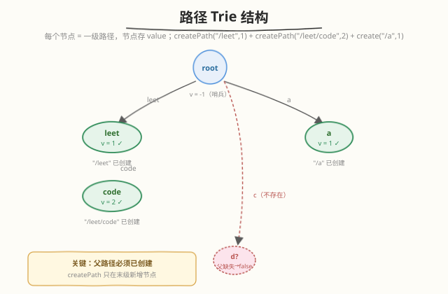

# LeetCode 设计文件系统 题解

## 1. 题目概述

- **标题 / 题号**：设计文件系统（#1166，medium）
- **链接**：https://leetcode.cn/problems/design-file-system/
- **难度**：中等
- **标签**：字典树、设计、哈希表、字符串

**题意**：设计一个文件系统，支持**创建新路径**并关联一个值，以及**查询路径对应的值**。

路径格式为若干段 `/` 后跟小写英文字母串拼接而成，例如 `/leetcode`、`/leetcode/problems` 是合法路径，而空串 `""` 和 `/` 不合法。

实现 `FileSystem` 类：

- `bool createPath(string path, int value)`：创建新路径 `path` 并关联 `value`。成功返回 `true`；若**路径已存在**或**父路径不存在**则返回 `false`。
- `int get(string path)`：返回与 `path` 关联的值；路径不存在则返回 `-1`。

**示例 1**：

```text
输入：
["FileSystem","create","get"]
[[],["/a",1],["/a"]]
输出：[null,true,1]

解释：
FileSystem fileSystem = new FileSystem();
fileSystem.create("/a", 1);   // 返回 true
fileSystem.get("/a");         // 返回 1
```

**示例 2**：

```text
输入：
["FileSystem","createPath","createPath","get","createPath","get"]
[[],["/leet",1],["/leet/code",2],["/leet/code"],["/c/d",1],["/c"]]
输出：[null,true,true,2,false,-1]

解释：
fileSystem.createPath("/leet", 1);      // true
fileSystem.createPath("/leet/code", 2); // true
fileSystem.get("/leet/code");           // 2
fileSystem.createPath("/c/d", 1);       // false，父路径 "/c" 不存在
fileSystem.get("/c");                   // -1，路径不存在
```

**约束**：

- `createPath` 与 `get` 的总调用次数 $\le 10^4$
- `2 <= path.length <= 100`
- `1 <= value <= 10^9`
- 每条 `path` 均为合法路径

> 💡 本题出自**第 7 场双周赛 Q2**，是 [208. 实现 Trie (前缀树)](../0201-0300/208_实现Trie.md) 的设计型变体：把「逐字符建树」换成「逐路径段建树」，并增加「父路径必须存在 + 末级必须不存在」的双重判定，本质仍是**树形逐级查找**。

## 2. 解题思路

### 2.1 暴力思路：哈希表存全路径

最直接的做法是维护一个 `HashMap<string, int>`，`createPath` 时把整条路径字符串当 key 存值，`get` 时查表。

| 操作 | 复杂度 | 问题 |
|------|--------|------|
| `createPath` | $O(L)$ | 需额外判定「父路径是否存在」——得对父路径 `path` 逐级截断后缀去查表 |
| `get` | $O(L)$ | 直接查表，没问题 |

难点在于 `createPath` 的**父路径存在性判定**：`"/a/b/c"` 的父路径是 `"/a/b"`，需要从原路径裁掉最后一段。每次裁剪需找最后一个 `/` 再切片，写起来繁琐且每次都产生新字符串；更关键的是这种「扁平哈希」**没有体现路径的层级结构**，无法做前缀相关扩展。

### 2.2 核心观察：路径段 Trie（字典树）



**关键观察**：路径 `/a/b/c` 天然就是一棵**树形层级**——`root → a → b → c`，每一段是一个节点。这恰好是 Trie（前缀树）的结构，只是把 [208](../0201-0300/208_实现Trie.md) 中的「单字符」换成了「路径段字符串」。

于是定义 Trie 节点：

- `children`：`HashMap<string, TrieNode*>`，键为子路径段名（如 `"leet"`、`"code"`），值为子节点引用。
- `v`：该节点对应的完整路径关联的值，未创建时为 `-1`。

**两个操作都变成「逐级走树」**：

- **`createPath(path, value)`**：`split("/")` 得到段数组（首元素为空串 `""`，跳过）。先走**父路径**（下标 `[1, n-2]`，即除末级外的所有段），任一段不存在即返回 `false`；走到父节点后，检查**末级段是否已存在**，已存在返回 `false`，否则新建子节点并存 `value`，返回 `true`。
- **`get(path)`**：`split("/")` 后走**全部段** `[1, n-1]`，任一段不存在返回 `-1`，走完返回末节点 `v`。

> 💡 **为什么用 `split("/")`？** 路径 `/leet/code` 按 `/` 切分得到 `["", "leet", "code"]`，首元素是 `/` 开头产生的空串，从下标 `1` 开始遍历即跳过它。`createPath` 走 `[1, n-2]`（父级），`get` 走 `[1, n-1]`（全部）——两者只差末级是否新建。

> ⚠️ **父路径与末级分开判定**：`createPath` 的语义是「父路径必须已存在、末级必须不存在」。若把末级也并入「逐级走」，就分不清「中间段不存在」还是「末级已存在」这两种都该返回 `false` 的情况，因此末级单独处理。

### 2.3 算法流程图


**完整步骤**：

1. **`createPath(path, value)`**：
   - `ps = path.split("/")`，`ps[0]` 为空串跳过。
   - 从 `root` 出发，遍历 `ps[1 .. n-2]`（父路径段）：若 `node.children` 无该段 → 返回 `false`；否则 `node = node.children[段]`。
   - 检查 `ps[n-1]`（末级）是否在 `node.children`：在 → 返回 `false`；不在 → 新建 `TrieNode(value)` 挂到 `node.children[末级]`，返回 `true`。
2. **`get(path)`**：
   - `ps = path.split("/")`。
   - 从 `root` 出发遍历 `ps[1 .. n-1]`（全部段）：任一段不存在 → 返回 `-1`；走完返回 `node.v`。

### 2.4 示例演算

以**示例 2**逐步演算，展示 Trie 的构建与查询过程：


| 步骤 | 操作 | split 结果 | 父路径走查 | 末级判定 | 结果 |
|------|------|-----------|-----------|----------|------|
| ① | `createPath("/leet", 1)` | `["", "leet"]` | `[1:-1]=[]` 空，root 即父 | `"leet"` 不在 root.children | **true**，新建 leet(v=1) |
| ② | `createPath("/leet/code", 2)` | `["", "leet", "code"]` | 走 `"leet"` ✓ | `"code"` 不在 leet.children | **true**，新建 code(v=2) |
| ③ | `get("/leet/code")` | `["", "leet", "code"]` | 走 `"leet"` ✓ → `"code"` ✓ | — | **2** |
| ④ | `createPath("/c/d", 1)` | `["", "c", "d"]` | 走 `"c"` ✗（root 下无 c） | — | **false**，父缺失 |
| ⑤ | `get("/c")` | `["", "c"]` | 走 `"c"` ✗ | — | **-1**，路径不存在 |

> 💡 **步骤 ④ 是核心陷阱**：`"/c/d"` 的父路径 `"/c"` 从未创建，所以 `"/c/d"` 即使逻辑上「末级 d 不存在」也会因父路径缺失被拒。这保证路径只能**逐级创建**，不会凭空挂载一个深层路径。

## 3. 参考代码

### C++

```cpp
class FileSystem {
    struct TrieNode {
        unordered_map<string, TrieNode*> children;
        int v = -1;
    };
    TrieNode* root;

    // 按 '/' 切分路径，返回段数组（首元素为空串）
    vector<string> split(const string& path) {
        vector<string> res;
        stringstream ss(path);
        string item;
        while (getline(ss, item, '/')) res.push_back(item);
        return res;
    }

public:
    FileSystem() : root(new TrieNode()) {}

    bool createPath(string path, int value) {
        auto ps = split(path);
        TrieNode* node = root;
        // 走父路径 ps[1 .. n-2]
        for (int i = 1; i < (int)ps.size() - 1; ++i) {
            if (!node->children.count(ps[i])) return false;   // 父路径不存在
            node = node->children[ps[i]];
        }
        // 末级 ps[n-1]
        const string& last = ps.back();
        if (node->children.count(last)) return false;         // 路径已存在
        node->children[last] = new TrieNode();
        node->children[last]->v = value;
        return true;
    }

    int get(string path) {
        auto ps = split(path);
        TrieNode* node = root;
        // 走全部段 ps[1 .. n-1]
        for (int i = 1; i < (int)ps.size(); ++i) {
            if (!node->children.count(ps[i])) return -1;      // 路径不存在
            node = node->children[ps[i]];
        }
        return node->v;
    }
};
```

### Python

```python
class FileSystem:
    def __init__(self):
        self.root = {}          # 嵌套 dict 充当 Trie，叶子用 {'#': value} 存值

    def createPath(self, path: str, value: int) -> bool:
        ps = path.split("/")    # ["", "leet", "code"]
        node = self.root
        # 走父路径 ps[1:-1]
        for p in ps[1:-1]:
            if p not in node:
                return False
            node = node[p]
        # 末级 ps[-1]
        last = ps[-1]
        if last in node:        # 路径已存在
            return False
        node[last] = {"#": value}
        return True

    def get(self, path: str) -> int:
        ps = path.split("/")
        node = self.root
        # 走全部段 ps[1:]
        for p in ps[1:]:
            if p not in node:
                return -1
            node = node[p]
        return node.get("#", -1)
```

> 💡 Python 用嵌套 `dict` 实现 Trie（与 [208](../0201-0300/208_实现Trie.md) 的 Python 版同思路），`'#'` 键存值，无需定义专门的节点类。`split("/")` 首元素为空串，`ps[1:-1]` 取父路径段、`ps[1:]` 取全部段，切片语法天然优雅。

## 4. 复杂度分析

| 维度 | 复杂度 | 说明 |
|------|--------|------|
| `createPath` 时间 | $O(L)$ | $L$ = `path.length`，逐段走树 + 末级新建，每段哈希查找 $O(1)$ 均摊 |
| `get` 时间 | $O(L)$ | 逐段走树，每段哈希查找 $O(1)$ 均摊 |
| 总时间 | $O(\sum_{w \in W} |w|)$ | $W$ 为所有调用涉及路径集合，单次最坏 $L \le 100$ |
| 空间 | $O(\sum_{w \in W} |w|)$ | 每个路径段存一个 Trie 节点，共享前缀的段共用节点 |

调用总数 $\le 10^4$、单路径 $\le 100$，总字符量上限 $10^6$，时间与空间均宽裕。对比「扁平哈希」方案，Trie 的额外开销几乎可忽略（哈希键是段名而非整条路径），但换来的是**层级结构天然支持父路径判定**与后续扩展能力。

## 5. 扩展：Trie vs 哈希表两种实现对比

| 维度 | 路径段 Trie（本文） | 扁平哈希表 `HashMap<path, value>` |
|------|---------------------|------------------------------------|
| **父路径判定** | 走树时天然逐级检查，中途缺失即 `false` | 需对 `path` 找最后一个 `/` 切片得父路径，再查表 |
| **末级存在判定** | 查父节点的 `children` 一次 $O(1)$ | 直接查 `map.count(path)` $O(1)$ |
| **空间** | 共享前缀省空间（`/a/b`、`/a/c` 共用 `/a` 节点） | 每条路径存完整字符串，前缀重复存储 |
| **扩展性** | 易扩展：列出某路径下所有子路径、删整棵子树、前缀匹配 | 难做层级扩展，需遍历全部 key 筛前缀 |
| **实现复杂度** | 需定义节点结构，稍重 | 一行 `map[path] = value`，极简 |

> 💡 若题目只需 `createPath` + `get` 且不要求扩展，扁平哈希表实现更短、常数更小。但面试中**追问常带层级操作**（如「列出 `/a` 下所有文件」「删除 `/a` 及其子路径」），Trie 的树形结构是更稳健的选择——这也是本题归入「字典树」标签的原因。

> ⚠️ 若题目进一步要求**路径可重复创建覆盖旧值**，只需把 `createPath` 末级的「已存在返回 false」改为「已存在则更新 `v` 并返回 true」，其余逻辑不变。Trie 与哈希表两种方案都只需改这一行。

## 6. 面试要点

1. **`createPath` 为什么要分开判定父路径和末级？**

   > 语义上「父路径必须存在」和「末级必须不存在」是两个独立的失败条件，都返回 `false`。若把末级并入逐级走查，遇到末级「已存在」会被当成「路径走通」，无法区分该返回 `false`。因此父路径走 `[1, n-2]`，末级单独检查存在性后新建。

2. **路径段 Trie 和字符 Trie（208）有什么区别？**

   > 字符 Trie 的边是单个字符（`a-z`），用 `children[26]` 数组索引；路径段 Trie 的边是一个路径段字符串（如 `"leet"`），用 `HashMap<string, Node>` 索引。两者都是「逐级走树」，只是「级」的粒度从字符变为字符串段。

3. **`split("/")` 后首元素为什么是空串？要特判吗？**

   > `"/a/b".split("/")` 得到 `["", "a", "b"]`，首元素空串源于开头的 `/`。无需特判——遍历从下标 `1` 开始自然跳过它，`ps[1:-1]` 取父段、`ps[1:]` 取全部段都自动忽略首元素。

4. **如果改成「路径已存在则覆盖值」怎么改？**

   > `createPath` 末级判定从「已存在返回 false」改为「已存在则 `node->v = value` 并返回 true」。父路径判定逻辑不变，仍要求父路径存在。Trie 方案与哈希表方案都只需改这一处。

5. **如何扩展为「列出某路径下所有子路径」？**

   > Trie 方案：`get` 走到目标节点后，递归遍历其 `children` 子树，收集所有带值的路径即可，天然支持。哈希表方案则需遍历全部 key 用前缀匹配筛选，效率低且需处理 `/a` 误匹配 `/ab` 的情况（要校验前缀后紧跟 `/` 或恰好相等）。

> 💡 **一句话总结**：1166 是「路径段 Trie」的设计题——把 [208](../0201-0300/208_实现Trie.md) 字符 Trie 的边粒度从单字符升级为路径段，`createPath` 走父级 + 末级双重判定，`get` 全段走查。核心是利用路径的天然层级结构，让父路径存在性检查退化为逐级走树的副产品。

## 同类练习题

| # | 题目 | 与本题的关联 |
|---|------|-------------|
| 208 | [实现 Trie (前缀树)](https://leetcode.cn/problems/implement-trie-prefix-tree/)（[题解](../0201-0300/208_实现Trie.md)） | Trie 母题，逐字符建树，本题把字符换成路径段 |
| 588 | [设计内存文件系统](https://leetcode.cn/problems/design-in-memory-file-system/) | 本题进阶版，区分文件与目录、支持列目录内容，Trie 节点需带类型标记 |
| 139 | [单词拆分](https://leetcode.cn/problems/word-break/)（[题解](../0001-0100/139_单词拆分.md)） | Trie 可用于加速字典匹配，对比 DP 解法 |
| 648 | [单词替换](https://leetcode.cn/problems/replace-words/) | Trie 前缀匹配的经典应用，找最短前缀替换整词 |
| 146 | [LRU 缓存](https://leetcode.cn/problems/lru-cache/)（[题解](../0101-0200/146_LRU缓存.md)） | 设计题经典，对照「哈希 + 另一种结构」的设计范式 |
