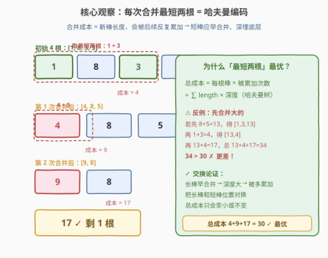
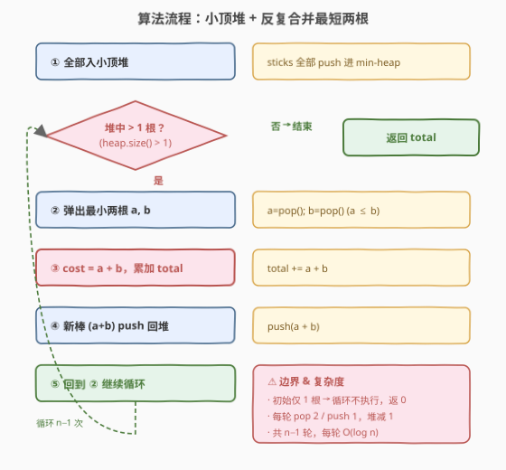

# 连接木棍的最低费用

- **题目名称**：连接木棍的最低费用
- **链接**：[1167. 连接木棍的最低费用](https://leetcode.cn/problems/minimum-cost-to-connect-sticks/)
- **难度**：中等
- **标签**：贪心、堆、哈夫曼编码

## 1. 题目概述

给定若干根长度为正整数的木棍。你可以将任意两根长度为 `X` 和 `Y` 的木棍连接成一根，连接的**费用**为 `X + Y`。重复此操作直到只剩一根木棍，返回连接所有木棍的**最低费用**。

**示例 1**：

```text
输入：sticks = [2,4,3]
输出：14
解释：
  连接 2 和 3，费用 5，得到 [5,4]
  连接 5 和 4，费用 9，得到 [9]
  总费用 = 5 + 9 = 14
```

**示例 2**：

```text
输入：sticks = [1,8,3,5]
输出：30
解释：
  连接 1 和 3，费用 4，得到 [4,8,5]
  连接 4 和 5，费用 9，得到 [9,8]
  连接 9 和 8，费用 17，得到 [17]
  总费用 = 4 + 9 + 17 = 30
```

**示例 3**：

```text
输入：sticks = [5]
输出：0
解释：只有一根木棍，无需连接。
```

**约束条件**：

- `1 <= sticks.length <= 10^4`
- `1 <= sticks[i] <= 10^4`

> 💡 这是**哈夫曼编码的经典模型**。每次合并产生的「新棒长度」会被后续合并反复累加进总成本——因此**短棒应尽早合并、深埋底层**，长棒应尽量晚合并、浅挂顶层。这与哈夫曼树「频率高的字符编码短（浅）、频率低的字符编码长（深）」完全同构。最优策略是**贪心地每次合并当前最短的两根**，用小顶堆即可 `O(n log n)` 解决。

---

## 2. 解题思路

### 2.1 暴力思路：枚举合并顺序

$n$ 根木棍合并成一根需要 $n-1$ 次合并，合并顺序对应一棵二叉树（合并树）。暴力枚举所有合并顺序等价于枚举所有二叉树形态，方案数为**卡特兰数**量级，$n=10^4$ 时完全不可行。

更直接的贪心直觉是：能否随便挑两根合并？不行——若先合并长的，长棒被「压」到底层、被反复累加，总成本会大幅膨胀（见 2.2 反例）。关键在于**合并顺序**。

### 2.2 核心观察：贪心合并最短两根（哈夫曼思想）



**关键观察**：一次合并产生的新棒长度 `a+b`，会作为「一根棒」参与后续所有合并，即被累加到总成本中的次数等于它在合并树中的**深度**。

因此总成本可以写成：

$$\text{total} = \sum_{i} \text{sticks}[i] \times \text{depth}(i)$$

其中 $\text{depth}(i)$ 是第 $i$ 根原始木棍在合并树中的深度（根为最顶层合并）。这正是**加权路径长度**——哈夫曼树优化的目标！

**贪心策略**：每次从当前所有木棍中**取出最短的两根**合并，把新棒放回。这等价于哈夫曼树的构造过程，能最小化加权路径长度。

**反例验证**（sticks = `[1,8,3,5]`）：

| 策略 | 合并顺序 | 总费用 |
|------|----------|--------|
| ✅ 贪心（每次最短两根） | 1+3=4 → 4+5=9 → 9+8=17 | **30** |
| ❌ 先合并长的 | 8+5=13 → 1+3=4 → 13+4=17 | 13+4+17 = **34** |

先合并 8 和 5 产生 13，这个大数在最后一次合并中又被加了一次（深度 2），导致 8 和 5 各被累加了 2 次；而贪心方案中 8 只在最顶层被累加 1 次（深度 1）。

> ⚠️ **贪心正确性的交换论证**：假设最优解在某次合并中未取最短两根，设当前最短两根为 $a \leq b$，而最优解合并了 $x \leq y$（其中 $x > a$ 或 $y > b$）。把 $a, b$ 与 $x, y$ 在合并树中的位置对换：短棒下沉、长棒上浮，加权路径长度只减不增（差异为 $(x-a)(\text{depth}_x - \text{depth}_a) + (y-b)(\text{depth}_y - \text{depth}_b) \leq 0$）。故「每次合并最短两根」与某个最优解一致。这与 [502. IPO](../0501-0600/502_IPO.md) 的贪心思想一脉相承——都是用堆维护「当前可选集合」逐次取最优。

### 2.3 算法流程图



**完整步骤**：

1. **建堆**：把所有木棍长度放入**小顶堆**（min-heap）
2. **循环**（堆中元素 $> 1$ 时）：
   - 弹出最小两根 $a, b$（$a \leq b$）
   - 计算合并费用 `cost = a + b`，累加到 `total`
   - 把新棒 `a + b` push 回堆
3. **返回** `total`

> 💡 **循环次数**：每轮 `pop 2 + push 1`，堆中元素净减 1。从 $n$ 根减到 1 根，恰好循环 $n-1$ 次。当初始只有 1 根时循环不执行，返回 0，与示例 3 一致。

### 2.4 示例演算

以 `sticks = [2, 4, 3]` 为例：

![示例演算：sticks = [2, 4, 3]，答案 14](../images/connect_sticks_walkthrough.svg)

**逐步执行**：

| 步骤 | 堆状态 | 取出 a, b | 合并 a+b | total | 说明 |
|------|--------|-----------|----------|-------|------|
| 初始 | {2, 3, 4} | — | — | 0 | 全部入堆 |
| 第 1 次 | {4, 5} | 2, 3 | 5 | 5 | 取最短两根 2+3 |
| 第 2 次 | {9} | 4, 5 | 9 | 14 | 取最短两根 4+5 |
| 结束 | {9}（仅 1 根） | — | — | **14** | 堆中剩 1 根，退出 |

**对应的合并树**（哈夫曼树）：

```text
        9          ← 顶层合并 (4+5)，深度 0
       / \
      4   5        ← 4 深度 1，5 是中间合并 (2+3) 深度 1
         / \
        2   3      ← 2、3 深度 2
```

加权路径长度 = $4 \times 1 + 2 \times 2 + 3 \times 2 = 4 + 4 + 6 = 14$，与 `total` 一致。

> 💡 **合并树高度**：$n$ 根木棍的哈夫曼合并树是一棵有 $n$ 个叶子的二叉树，高度最坏 $O(n)$（当长度呈斐波那契递增时退化为链），但平均/常见数据下接近 $O(\log n)$。这不影响算法复杂度——堆操作次数固定为 $n-1$ 轮。

---

## 3. 参考代码

### C++

```cpp
// 连接木棍的最低费用.cpp —— 小顶堆贪心（哈夫曼编码）
// 编译: g++ -O2 -std=c++17 连接木棍的最低费用.cpp -o sticks
#include <vector>
#include <queue>
#include <numeric>
class Solution {
public:
    int connectSticks(vector<int>& sticks) {
        // greater<int> 使 priority_queue 成为小顶堆
        priority_queue<int, vector<int>, greater<int>> pq(sticks.begin(), sticks.end());

        int total = 0;
        while (pq.size() > 1) {
            int a = pq.top(); pq.pop();   // 最短
            int b = pq.top(); pq.pop();   // 次短
            int cost = a + b;
            total += cost;
            pq.push(cost);               // 新棒回堆
        }
        return total;
    }
};
```

### Python

```python
class Solution:
    def connectSticks(self, sticks: List[int]) -> int:
        import heapq
        heapq.heapify(sticks)            # 原地建小顶堆，O(n)
        total = 0
        while len(sticks) > 1:
            a = heapq.heappop(sticks)    # 最短
            b = heapq.heappop(sticks)    # 次短
            cost = a + b
            total += cost
            heapq.heappush(sticks, cost) # 新棒回堆
        return total
```

> 💡 **实现细节**：① Python `heapify` 原地建堆 `O(n)`，比逐个 `heappush` 的 `O(n log n)` 更优。② C++ 用迭代器构造 `priority_queue` 也是 `O(n)` 建堆。③ 注意 `sticks` 长度可能为 1，`while len > 1` 直接跳过返回 0。④ 总费用上限：最坏每根被累加 $O(n)$ 次，总成本可达 $O(n^2 \cdot \max)$，$n=10^4, \max=10^4$ 时约 $10^{12}$，需用 `long long`？——实际哈夫曼树高远小于 $n$，且题目 `int` 范围内可过，但保险起见 C++ 可用 `long long` 累加。

---

## 4. 复杂度分析

| 维度 | 小顶堆贪心 | 暴力枚举 |
|------|-----------|----------|
| **时间** | $O(n \log n)$ | $O(\text{卡特兰数})$ 指数级 |
| **空间** | $O(n)$ | $O(n)$ 递归栈 |
| **正确性** | ✓ 哈夫曼最优 | ✓ 但不可行 |

> ⚠️ **时间 $O(n \log n)$**：建堆 $O(n)$，循环 $n-1$ 轮，每轮 2 次 `pop` + 1 次 `push`，各 $O(\log n)$，共 $O(n \log n)$。$n = 10^4$ 时约 $10^4 \times 14 \approx 1.4 \times 10^5$ 次堆操作，轻松通过。

---

## 5. 扩展：与哈夫曼编码的等价性

本题是**哈夫曼编码**的「合并成本」视角。哈夫曼编码的经典表述是：给定字符频率，构造一棵二叉编码树使 $\sum \text{freq}(c) \times \text{codelen}(c)$ 最小。两者对应关系：

| 哈夫曼编码 | 本题（连接木棍） |
|-----------|-----------------|
| 字符频率 `freq[c]` | 木棍长度 `sticks[i]` |
| 编码长度 `codelen(c)` | 合并树深度 `depth(i)` |
| 加权路径长度 $\sum \text{freq} \times \text{codelen}$ | 总成本 $\sum \text{sticks}[i] \times \text{depth}(i)$ |
| 构造：取频率最小的两子树合并 | 构造：取最短的两根合并 |

因此本题的贪心算法**就是**哈夫曼树的构造算法，正确性证明通用。

> 💡 **延伸**：若改成「每次最多合并 K 根」（[1000. 合并石头的最低成本](../0901-1000/1000_合并石头的最低成本.md)），贪心不再成立——因为 K 叉哈夫曼需要补「虚权 0」叶子凑满，且合并对象是**连续区间**而非任意选取，退化为区间 DP。本题 K=2 且无连续性约束，贪心才成立。

---

## 6. 面试要点

1. **为什么每次合并最短两根是最优的？**

   > 合并产生的新棒长度会被后续合并反复累加，相当于该棒在合并树中的「深度」决定了它被计入总成本的次数。短棒深埋底层（被多累加）代价小，长棒浅挂顶层（少累加）代价大。每次取最短两根合并，等价于哈夫曼树构造，最小化加权路径长度，由交换论证可证最优。

2. **如何用交换论证证明贪心正确性？**

   > 假设最优解某步未合并最短两根 $a \leq b$，而合并了 $x \leq y$（$x > a$ 或 $y > b$）。在合并树中把 $a,b$ 与 $x,y$ 位置对换，短棒下沉、长棒上浮，加权路径长度的变化量为 $(x-a)(d_x - d_a) + (y-b)(d_y - d_b) \leq 0$，总成本不增。反复交换可把任意最优解调整为「每步合并最短两根」的形态而不增加成本，故贪心最优。

3. **总成本可能溢出 int 吗？需要 long long 吗？**

   > 最坏情况下合并树退化为链（长度呈斐波那契递增），每根被累加次数可达 $O(n)$，总成本理论上可达 $O(n^2 \cdot \max)$。$n=10^4, \max=10^4$ 时约 $10^{12}$，超过 `int` 上限 $2.1 \times 10^9$。实际数据通常不会触发，但面试中应主动说明用 `long long` 累加更稳妥。

4. **为什么用小顶堆而不是排序后双指针？**

   > 排序后每次取最小看似可行，但合并产生的新棒要插回有序序列，维护有序需 $O(n)$ 插入（数组）或 $O(\log n)$（平衡树）。小顶堆天然支持 `O(log n)` 的取最小和插入，是最自然的容器。若用排序 + 每次线性扫描找位置，最坏 $O(n^2)$。

5. **初始只有 1 根木棍时返回什么？为什么循环条件是 `size > 1`？**

   > 返回 0。只有 1 根无需合并，`while (pq.size() > 1)` 直接跳过，`total` 保持初始值 0。这处理了示例 3 的边界，无需额外特判。

> 💡 **一句话总结**：1167 是哈夫曼编码的合并成本视角——每次用小顶堆取最短两根合并、新棒回堆，循环 $n-1$ 次即得最低总成本。$O(n \log n)$ 时间、$O(n)$ 空间，贪心正确性由交换论证保证。掌握此模型可秒杀一切「合并代价=合并元素之和、求最小总代价」的哈夫曼类问题。

---

## 7. 同类练习题

- [502. IPO](https://leetcode.cn/problems/ipo/)（[题解](../0501-0600/502_IPO.md)）：同为「堆维护可选集 + 贪心逐次取最优」范式，但用大顶堆取最大利润、解锁机制不同
- [1000. 合并石头的最低成本](https://leetcode.cn/problems/minimum-cost-to-merge-stones/)：K 堆合一堆 + 连续区间约束，贪心失效退化为区间 DP，对照本题理解「何时贪心成立」
- [1046. 最后一块石头的重量](https://leetcode.cn/problems/last-stone-weight/)（[题解](../1001-1100/1046_最后一块石头的重量.md)）：同样用堆模拟「每次取两块」的过程，但合并规则是相消（差值）而非累加，不追求最小成本
- [23. 合并 K 个升序链表](https://leetcode.cn/problems/merge-k-sorted-lists/)：小顶堆多路归并，复用「堆维护候选集逐次取最小」的堆使用技巧
- [355. 设计推特](https://leetcode.cn/problems/design-twitter/)：堆的合并多路有序流，与哈夫曼「多路合并」思想相通的堆综合应用
