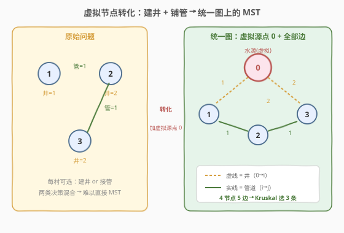
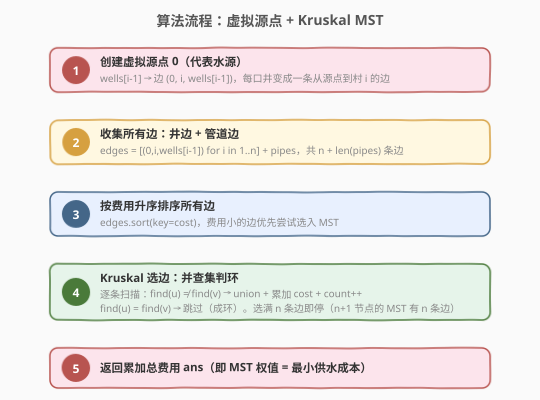
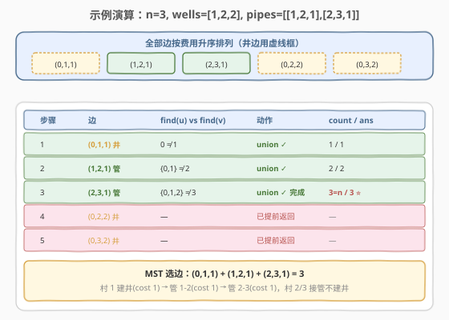

# 水资源分配优化

- **题目名称**：水资源分配优化
- **链接**：[1168. 水资源分配优化](https://leetcode.cn/problems/optimize-water-distribution-in-a-village/)
- **难度**：困难
- **标签**：图、最小生成树、Kruskal、并查集、虚拟节点、贪心

## 1. 题目概述

有 `n` 个村庄，编号 `1` 到 `n`。你需要为**所有村庄**供水。供水方式有两种：

1. **建井**：在村庄 `i` 内打一口井，费用为 `wells[i - 1]`。建了井的村庄直接获得水源。
2. **铺管道**：在村庄 `u` 与 `v` 之间铺设管道，费用为 `cost`。管道两端中只要有一端有水（直接建井或间接连通有井的村庄），另一端也能获得水源。

给定 `wells` 数组与 `pipes` 列表（`pipes[j] = [u_j, v_j, cost_j]`），返回**为所有村庄供水的最小总费用**。

**示例 1**：

```text
输入：n = 3, wells = [1,2,2], pipes = [[1,2,1],[2,3,1]]
输出：3
解释：在村庄 1 建井（费用 1），铺设管道 1-2（费用 1）和 2-3（费用 1）。
      村庄 1 有井 → 水沿管道流到 2 → 再流到 3，总费用 1 + 1 + 1 = 3。
```

**示例 2**：

```text
输入：n = 2, wells = [1,1], pipes = [[1,2,1]]
输出：2
解释：在村庄 1 和 2 各建一口井（费用 1 + 1 = 2），比铺管道（1 + 1 = 2）总费用相同，
      但无需管道即可各自供水。MST 会选费用最小的组合，结果为 2。
```

**示例 3**：

```text
输入：n = 2, wells = [5,5], pipes = [[1,2,1]]
输出：6
解释：在村庄 1 建井（费用 5）+ 铺管道 1-2（费用 1）= 6，
      比两村各建井（5+5=10）更优。水从 1 经管道到达 2。
```

**约束条件**：

- `1 <= n <= 100`
- `wells.length == n`
- `1 <= wells[i] <= 10^5`
- `1 <= pipes.length <= 10000`
- `pipes[j].length == 3`
- `1 <= pipes[j][0], pipes[j][1] <= n`
- `0 <= pipes[j][2] <= 10^5`

> ⚠️ 本题的难点不在算法本身（MST 是经典模型），而在于**建模**——如何把「建井」和「铺管道」两类不同的决策统一到同一个图论框架中。核心技巧是**虚拟源点（super node）**。

---

## 2. 解题思路

### 2.1 暴力思路：枚举建井子集

对每个村庄决定「建井 / 不建井」，共 $2^n$ 种组合。对于每种组合，在「建井村庄已确定水源」的前提下，用 MST 算法求出将水源扩散到所有村庄的最小管道费用，再加上建井费用，取所有组合的最小值。

$n = 100$ 时 $2^{100}$ 完全不可行。问题在于「建井」和「铺管」被割裂为两个独立决策，组合爆炸。

> 💡 转换视角：不要分别决策「在哪建井」和「铺哪些管」，而是**把建井也看作一种"边"**——从水源到村庄的边。这样两类决策就统一为同一个图上的选边问题。

### 2.2 核心观察：虚拟源点 + 最小生成树



关键转化：**引入虚拟源点 `0`（代表水源）**，把每口井变成一条从源点到村庄的边。

- **建井** `wells[i - 1]` → 边 `(0, i, wells[i - 1])`，表示「从水源到村庄 `i` 铺设一条"井边"，费用为建井费」。
- **管道** `pipes[j] = [u, v, cost]` → 边 `(u, v, cost)`，原样保留。

这样原图变为 `n + 1` 个节点（`0` 到 `n`）的带权无向图，所有边统一为同一种结构。对这张图跑 **Kruskal 最小生成树**，MST 的权值之和即为答案。

> 💡 **为什么正确？** MST 要求所有 `n + 1` 个节点连通，且总边权最小。虚拟节点 `0` 代表水源，它与某村庄 `i` 连通意味着「村庄 `i` 获得了水源」——可能是通过建井（边 `0→i`），也可能是通过管道从另一个已通水的村庄间接获得。MST 的连通性保证所有村庄最终都通水，最小权值保证总费用最小。MST 恰有 `n` 条边（`n + 1` 个节点的树），对应「选 `n` 条边（井边 + 管边的混合）使所有村庄通水」。

> ⚠️ **与 [1135. 最低成本联通所有城市](../1101-1200/1135_最低成本联通所有城市.md) 的区别**：1135 的边全部显式给出，直接 Kruskal 即可；本题多了「建井」这一隐式边来源，需要用虚拟节点技巧将井费用转化为边权后才能套用 MST 模板。这是「带节点激活费用的连通性问题」的通用建模方法。

### 2.3 算法流程图



流程要点：

1. **创建虚拟源点 `0`**：将 `wells[i - 1]` 转化为边 `(0, i, wells[i - 1])`。
2. **收集所有边**：井边 `n` 条 + 管道边 `len(pipes)` 条，合并为一个边列表。
3. **按费用升序排序**：费用小的边优先选入 MST。
4. **Kruskal 选边**：并查集判环，`find(u) ≠ find(v)` 则 `union` + 累加 `cost` + `count++`；选满 `n` 条边即提前返回（`n + 1` 节点的 MST 恰有 `n` 条边）。
5. **返回总费用** `ans`。

### 2.4 示例演算

以 `n = 3, wells = [1,2,2], pipes = [[1,2,1],[2,3,1]]` 为例。

构建虚拟源点后，全部边为：`(0,1,1)`、`(0,2,2)`、`(0,3,2)`、`(1,2,1)`、`(2,3,1)`，共 5 条边。



| 步骤 | 边 (u,v,cost) | find(u) vs find(v) | 动作 | count | ans | 连通分量 |
|------|--------------|--------------------|------|-------|-----|----------|
| 1 | (0,1,1) 井 | 0 ≠ 1 | union ✓ | 1 | 1 | {0,1},{2},{3} |
| 2 | (1,2,1) 管 | {0,1} ≠ 2 | union ✓ | 2 | 2 | {0,1,2},{3} |
| 3 | (2,3,1) 管 | {0,1,2} ≠ 3 | union ✓ 完成 | 3=n | 3 | {0,1,2,3} |
| 4 | (0,2,2) 井 | — | 已提前返回 | — | — | — |
| 5 | (0,3,2) 井 | — | 已提前返回 | — | — | — |

> 💡 **第 1 步是关键**：费用最低的边是井边 `(0,1,1)`——意味着在村庄 1 建井比铺任何管道都便宜，MST 优先选入。此后村庄 1 成为水源，水沿管道 `(1,2,1)` 和 `(2,3,1)` 扩散到全村。村庄 2、3 的井边 `(0,2,2)`、`(0,3,2)` 费用更高且村落已通水，自然被跳过。这正是 MST 贪心的精妙之处：**自动决定哪些村建井、哪些村接管**。

---

## 3. 参考代码

### 方法：虚拟源点 + Kruskal（排序 + 并查集）

### C++

```cpp
class Solution {
  public:
    vector<int> parent, rank_;

    int find(int x) {
        return parent[x] == x ? x : parent[x] = find(parent[x]);
    }

    bool unite(int x, int y) {
        int fx = find(x), fy = find(y);
        if (fx == fy) return false;
        if (rank_[fx] < rank_[fy]) swap(fx, fy);
        parent[fy] = fx;
        if (rank_[fx] == rank_[fy]) rank_[fx]++;
        return true;
    }

    int minCostToSupplyWater(int n, vector<int>& wells,
                             vector<vector<int>>& pipes) {
        // 1. 收集所有边：井边（虚拟源点 0 → 村 i）+ 管道边
        vector<array<int, 3>> edges;
        for (int i = 0; i < n; ++i)
            edges.push_back({wells[i], 0, i + 1});        // (cost, 0, village)
        for (auto& p : pipes)
            edges.push_back({p[2], p[0], p[1]});          // (cost, u, v)

        // 2. 按费用升序排序
        sort(edges.begin(), edges.end());

        // 3. 初始化并查集（节点 0 到 n，共 n+1 个）
        parent.resize(n + 1);
        rank_.resize(n + 1, 0);
        iota(parent.begin(), parent.end(), 0);

        // 4. Kruskal 选边
        int ans = 0, count = 0;
        for (auto& [cost, u, v] : edges) {
            if (unite(u, v)) {
                ans += cost;
                if (++count == n) return ans;             // n+1 节点的 MST 有 n 条边
            }
        }
        return ans;
    }
};
```

### Python

```python
class Solution:
    def minCostToSupplyWater(self, n: int, wells: List[int],
                             pipes: List[List[int]]) -> int:
        # 1. 收集所有边：井边（虚拟源点 0 → 村 i）+ 管道边
        edges = []
        for i, w in enumerate(wells, 1):
            edges.append((w, 0, i))           # (cost, 0, village)
        for u, v, cost in pipes:
            edges.append((cost, u, v))

        # 2. 按费用升序排序
        edges.sort(key=lambda e: e[0])

        # 3. 初始化并查集（节点 0 到 n，共 n+1 个）
        parent = list(range(n + 1))
        rank_ = [0] * (n + 1)

        def find(x: int) -> int:
            while parent[x] != x:
                parent[x] = parent[parent[x]]   # 路径压缩
                x = parent[x]
            return x

        def unite(x: int, y: int) -> bool:
            fx, fy = find(x), find(y)
            if fx == fy:
                return False
            if rank_[fx] < rank_[fy]:
                fx, fy = fy, fx
            parent[fy] = fx
            if rank_[fx] == rank_[fy]:
                rank_[fx] += 1
            return True

        # 4. Kruskal 选边
        ans = 0
        count = 0
        for cost, u, v in edges:
            if unite(u, v):
                ans += cost
                count += 1
                if count == n:                 # n+1 节点的 MST 有 n 条边
                    return ans
        return ans
```

> 💡 **实现细节**：边用 `(cost, u, v)` 三元组存储，排序时 `cost` 在首位可直接按元组字典序排序，无需额外 `key`。虚拟节点编号为 `0`，村庄编号 `1` 到 `n`，并查集大小为 `n + 1`。与 [1135. 最低成本联通所有城市](../1101-1200/1135_最低成本联通所有城市.md) 的并查集模板完全同源，区别仅在于多了「虚拟源点边」的构建步骤。

---

## 4. 复杂度分析

| 维度 | 复杂度 | 说明 |
|------|--------|------|
| 时间复杂度 | $O((n + E) \log (n + E))$ | 边数 $n + E$（井边 $n$ + 管道边 $E$），排序主导 $O((n+E) \log(n+E))$；并查集 $(n+E)$ 次操作均摊 $O(\alpha(n)) \approx O(1)$ |
| 空间复杂度 | $O(n + E)$ | 边列表 $O(n + E)$；并查集 `parent`、`rank_` 各 $O(n)$ |

> 💡 本题 $n \le 100$、$E \le 10^4$，边总数 $\le 10100$，$\log(10100) \approx 14$，排序约 $1.4 \times 10^5$ 次比较，毫无压力。即使 $n$ 和 $E$ 放大到 $10^5$ 量级，Kruskal 的 $O((n+E) \log(n+E))$ 也能在 $2.3 \times 10^6$ 内通过。

---

## 5. 扩展：为什么不需要判断图不连通？

在 [1135. 最低成本联通所有城市](../1101-1200/1135_最低成本联通所有城市.md) 中，图可能不连通导致返回 `-1`。但本题**一定能选满 `n` 条边**，因为：

- 虚拟源点 `0` 到每个村庄 `i` 都有一条井边 `(0, i, wells[i])`，共 `n` 条。
- 即使不存在任何管道，仅靠井边也能将 `n + 1` 个节点连通（星形拓扑：`0` 连到所有村庄）。
- 因此 Kruskal 一定能选出 `n` 条边构成 MST，不需要 `count < n` 的兜底返回。

> ⚠️ 这正是虚拟源点技巧的另一个好处：**保证图连通**。只要每个村庄都有一条到源点的边（井边），图就必然连通，消除了「不连通返回 -1」的边界情况。

---

## 6. 面试要点

1. **为什么要引入虚拟源点？**

   - 「建井」和「铺管」是两类不同性质的决策：建井是「节点激活费用」（让某村庄获得水源），铺管是「边费用」（让两个村庄共享水源）。直接建模难以统一。
   - 引入虚拟源点 `0` 代表水源后，建井费用变成边 `(0, i, wells[i])` 的权值，与管道边统一为同一张图上的边权。这样就能直接套用 MST 模板，把组合优化问题转化为图论问题。

2. **MST 的边数为什么是 `n` 而不是 `n - 1`？**

   - 原图有 `n` 个村庄，引入虚拟源点后变为 `n + 1` 个节点。`n + 1` 个节点的生成树恰有 `n` 条边，因此 Kruskal 选满 `n` 条边即停。

3. **虚拟源点技巧还能用在哪里？**

   - 任何「节点有激活/启动费用」的连通性问题都适用。例如：每台服务器有部署成本，服务器间有通信成本，求最低总成本使所有服务器互联——把「部署」变成虚拟源点到服务器的边即可。
   - 本质是把「节点费用」转化为「边费用」，让 MST 这类只处理边权的算法能够适用。

4. **Kruskal 和 Prim 在本题中如何选择？**

   - 本题边数 $n + E$，$n \le 100$、$E \le 10^4$，属于**稀疏图**，Kruskal 的 $O((n+E) \log(n+E))$ 最优且实现简洁。
   - 若图非常稠密（如完全图、$E \approx n^2$），朴素 Prim 的 $O(n^2)$ 可能更优。但本题数据范围下 Kruskal 足够。

5. **管道费用为 0 时有影响吗？**

   - 无影响。费用 0 的边排序后排在最前，会被优先选入 MST。实际含义是「免费管道」，Kruskal 自然会优先使用。并查集对 0 权边的处理与正权边完全一致。

---

## 7. 同类练习题

- [1135. 最低成本联通所有城市](https://leetcode.cn/problems/connecting-cities-with-minimum-cost/)（[题解](../1101-1200/1135_最低成本联通所有城市.md)）：纯 MST 母题，边全部显式给出，Kruskal + 并查集模板，本题的并查集部分与之完全同源
- [1584. 连接所有点的最小费用](https://leetcode.cn/problems/min-cost-to-connect-all-points/)：完全图 MST，边由曼哈顿距离在线计算，适合朴素 Prim $O(n^2)$，对照本题稀疏图选 Kruskal
- [1489. 找到最小生成树里的关键边和伪关键边](https://leetcode.cn/problems/find-critical-and-pseudo-critical-edges-in-minimum-spanning-tree/)：MST + 删边判定，Kruskal 进阶，需要判断每条边对 MST 的关键性
- [684. 冗余连接](https://leetcode.cn/problems/redundant-connection/)（[题解](../0601-0700/684_冗余连接.md)）：并查集判环母题，Kruskal 中 `unite` 返回 `false` 即同此题判定
- [547. 省份数量](https://leetcode.cn/problems/number-of-provinces/)（[题解](../0501-0600/547_省份数量.md)）：并查集数连通分量，MST 的前置知识
