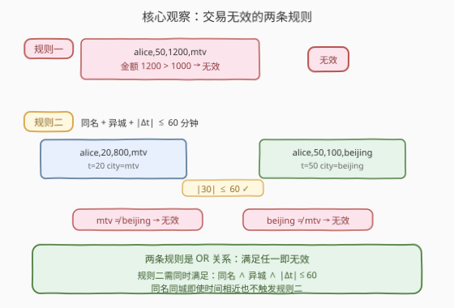
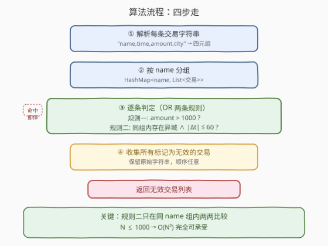
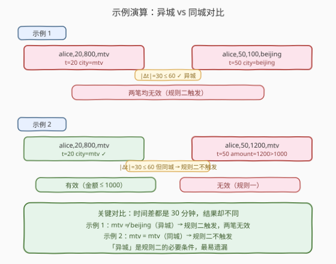

# 查询无效交易

- **题目名称**：查询无效交易
- **链接**：[1169. 查询无效交易](https://leetcode.cn/problems/invalid-transactions/)
- **难度**：中等
- **标签**：字符串、哈希表、模拟

## 1. 题目概述

如果出现下述两种情况，交易可能无效：

1. 交易金额超过 $\$1000$（即 $> 1000$）
2. 它和**另一个城市**中**同名**的另一笔交易相隔不超过 $60$ 分钟（包含 $60$ 分钟整）

给定字符串数组 `transactions`，每个交易字符串由逗号分隔的值组成，格式为 `"{name},{time},{amount},{city}"`，分别表示交易名称、时间（分钟）、金额、城市。

返回**可能无效**的交易列表，可以按任意顺序返回。

**示例 1**：

```text
输入：transactions = ["alice,20,800,mtv","alice,50,100,beijing"]
输出：["alice,20,800,mtv","alice,50,100,beijing"]
解释：第一笔交易无效，因为第二笔交易与它间隔不超过 60 分钟、名称相同且发生在不同城市。同样，第二笔交易也是无效的。
```

**示例 2**：

```text
输入：transactions = ["alice,20,800,mtv","alice,50,1200,mtv"]
输出：["alice,50,1200,mtv"]
```

**示例 3**：

```text
输入：transactions = ["alice,20,800,mtv","bob,50,1200,mtv"]
输出：["bob,50,1200,mtv"]
```

**约束条件**：

- `transactions.length <= 1000`
- 每笔交易按 `"{name},{time},{amount},{city}"` 格式记录
- `name` 和 `city` 由小写英文字母组成，长度 $1$ 到 $10$
- `time` 为 $0$ 到 $1000$ 之间的整数
- `amount` 为 $0$ 到 $2000$ 之间的整数

> 💡 两条规则是 **OR** 关系——满足任一即无效。规则二需同时满足**同名**、**异城**、$|\Delta t| \le 60$ 三个条件，缺一不可。最易遗漏的是「异城」：同名同城即使时间相近也不触发规则二。

---

## 2. 解题思路

### 2.1 暴力思路：两两比较全部交易

最直觉的做法是对每笔交易，遍历所有其他交易，检查是否同名、异城且时间差 $\le 60$，同时检查金额是否 $> 1000$。这是 $O(n^2)$ 的暴力——但 $n \le 1000$，$O(n^2) = 10^6$ 完全可承受，本身就是正解的骨架。

> ⚠️ **注意**：规则二的比较**只在同名交易之间**有意义。不同名的交易即使城市不同、时间相近，也不会互相影响有效性。因此可以先按 `name` 分组，把比较范围缩小到同组内。

### 2.2 核心观察：按 name 分组 + OR 判定



两个关键点：

1. **两条规则 OR**：一笔交易只要满足「金额 $> 1000$」**或**「存在同名异城且 $|\Delta t| \le 60$ 的交易」即无效。规则一可单独判定（$O(1)$），规则二需与同名交易比较。
2. **按 name 分组缩小比较范围**：用哈希表 `HashMap<name, List<交易>>` 把交易按名称分组，规则二只需在**同组内**两两比较——不同名称的交易天然不会触发规则二，无需全局比较。

> ⚠️ **三个易错点**：
> - **「异城」是必要条件**：同名同城、时间差 $\le 60$ → 规则二**不触发**（示例 2）。只有城市**不同**才算可疑。
> - **金额是「超过」即 $> 1000$**：金额恰好 $1000$ 不算无效。
> - **时间差含 $60$ 整**：$|\Delta t| \le 60$，等于 $60$ 也算无效，不是 $< 60$。

### 2.3 算法流程图



**完整步骤**：

1. **解析**：将每条交易字符串按逗号切分，提取 `name`、`time`、`amount`、`city`，保留原始字符串和下标。
2. **分组**：用哈希表 `byName` 按 `name` 收集所有交易的下标列表。
3. **逐条判定**：对每笔交易 $i$：
   - **规则一**：`amount[i] > 1000` → 标记无效，跳过规则二（已无效无需再查）。
   - **规则二**：遍历同 `name` 组内其他交易 $j$，若 `city[j] != city[i]` 且 `|time[i] - time[j]| <= 60` → 标记无效。
4. **收集**：将所有标记为无效的交易原始字符串加入结果列表。

> 💡 **规则一的短路优化**：若 `amount > 1000` 已判定无效，可直接 `continue` 跳过规则二的内层循环，避免不必要的比较。逻辑上不短路也对（OR 关系），但短路能减少常数。

### 2.4 示例演算

以示例 1 和示例 2 对比，突出「异城」条件的关键作用：



**示例 1**（异城 → 规则二触发）：

| 交易 | name | time | amount | city | 判定 |
|------|------|------|--------|------|------|
| alice,20,800,mtv | alice | 20 | 800 | mtv | 规则一：$800 \le 1000$ ✗；规则二：alice,50 在 beijing（异城），$\|20-50\|=30 \le 60$ ✓ → **无效** |
| alice,50,100,beijing | alice | 50 | 100 | beijing | 规则一：$100 \le 1000$ ✗；规则二：alice,20 在 mtv（异城），$\|50-20\|=30 \le 60$ ✓ → **无效** |

两笔互相触发规则二，输出全部。

**示例 2**（同城 → 规则二不触发）：

| 交易 | name | time | amount | city | 判定 |
|------|------|------|--------|------|------|
| alice,20,800,mtv | alice | 20 | 800 | mtv | 规则一 ✗；规则二：alice,50 同在 mtv（**同城**）→ 不触发 → **有效** |
| alice,50,1200,mtv | alice | 50 | 1200 | mtv | 规则一：$1200 > 1000$ ✓ → **无效** |

时间差同样是 $30$ 分钟，但因同城，规则二不触发。仅第二笔因金额超标而无效。

---

## 3. 参考代码

### C++

```cpp
class Solution {
public:
    vector<string> invalidTransactions(vector<string>& transactions) {
        int n = transactions.size();
        vector<string> name(n), city(n);
        vector<int> t(n), amt(n);
        for (int i = 0; i < n; i++) {
            stringstream ss(transactions[i]);
            string token;
            getline(ss, name[i], ',');
            getline(ss, token, ','); t[i] = stoi(token);
            getline(ss, token, ','); amt[i] = stoi(token);
            getline(ss, city[i], ',');
        }
        unordered_map<string, vector<int>> byName;
        for (int i = 0; i < n; i++) byName[name[i]].push_back(i);

        vector<bool> bad(n, false);
        for (int i = 0; i < n; i++) {
            if (amt[i] > 1000) { bad[i] = true; continue; }
            for (int j : byName[name[i]]) {
                if (j == i) continue;
                if (city[j] != city[i] && abs(t[i] - t[j]) <= 60) {
                    bad[i] = true; break;
                }
            }
        }
        vector<string> res;
        for (int i = 0; i < n; i++) if (bad[i]) res.push_back(transactions[i]);
        return res;
    }
};
```

> 💡 **写法要点**：① `stringstream` + `getline(ss, token, ',')` 按逗号切分，比手动 `find` 更清晰；② `byName` 只存下标，避免拷贝解析结果；③ `amt[i] > 1000` 命中即 `continue` 短路，跳过规则二内层循环；④ `bad` 布尔数组去重，同一笔交易只收集一次。

### Python

```python
class Solution:
    def invalidTransactions(self, transactions: List[str]) -> List[str]:
        from collections import defaultdict

        n = len(transactions)
        name, city = [None] * n, [None] * n
        t, amt = [0] * n, [0] * n
        for i, s in enumerate(transactions):
            parts = s.split(',')
            name[i], t[i], amt[i], city[i] = parts[0], int(parts[1]), int(parts[2]), parts[3]

        by_name = defaultdict(list)
        for i in range(n):
            by_name[name[i]].append(i)

        bad = [False] * n
        for i in range(n):
            if amt[i] > 1000:
                bad[i] = True
                continue
            for j in by_name[name[i]]:
                if j == i:
                    continue
                if city[j] != city[i] and abs(t[i] - t[j]) <= 60:
                    bad[i] = True
                    break

        return [transactions[i] for i in range(n) if bad[i]]
```

> 💡 **写法要点**：① `s.split(',')` 一步切分四段，比 C++ 的 `getline` 更简洁；② `defaultdict(list)` 自动初始化分组列表；③ 逻辑与 C++ 完全一致——规则一短路 `continue`，规则二同组内两两比较；④ 列表推导式收集结果，`bad[i]` 布尔过滤。

---

## 4. 复杂度分析

设 $n$ 为交易总数，$G$ 为不同 `name` 的数量，$g_k$ 为第 $k$ 组的大小（$\sum g_k = n$），$g_{\max} = \max_k g_k$。

| 维度 | 复杂度 | 说明 |
|------|--------|------|
| **时间** | $O(n \cdot g_{\max})$，最坏 $O(n^2)$ | 每笔交易与同组内其他交易比较；最坏所有交易同名，$g_{\max} = n$ |
| **空间** | $O(n)$ | 解析结果数组 $O(n)$ + 哈希分组表 $O(n)$ + 布尔标记 $O(n)$ |

> - $n \le 1000$，$O(n^2) = 10^6$，远在时限内
> - 分组的收益：若交易均匀分布在 $G$ 个名称下，每组平均 $n/G$，总比较次数 $n \cdot n/G$，比全局 $n^2$ 快 $G$ 倍
> - 最坏情况（全部同名）退化为 $O(n^2)$，但常数小（短路 + `break`）

---

## 5. 扩展：按时间排序 + 滑动窗口优化

当 $n$ 显著增大（如 $n \ge 10^5$）且单组内交易密集时，$O(n^2)$ 会超时。可在**同组内按 `time` 排序**后用滑动窗口优化：

**思路**：对每个 `name` 组，按 `time` 升序排序。对位置 $i$ 的交易，用双指针维护窗口 $[l, r]$ 使得窗口内所有交易的 `time` 与 `t[i]` 之差 $\le 60$。只需检查窗口内**异城**交易是否存在。

**关键**：时间窗口是对称的（$|t_i - t_j| \le 60 \Leftrightarrow t_j \in [t_i - 60, t_i + 60]$），但排序后只需向后扫描 $t_j \le t_i + 60$ 的部分，向前部分（$t_j \ge t_i - 60$）由对称性已覆盖。

> ⚠️ **最坏仍 $O(n^2)$**：若所有交易时间相同（全在窗口内），滑动窗口退化为全比较。但平均场景下窗口大小远小于组大小，实际加速明显。此外，可用 `TreeMap`/有序集合按城市分桶，将「窗口内是否存在异城」的查询降到 $O(\log g)$。

```python
from collections import defaultdict
from bisect import bisect_left, bisect_right

class Solution:
    def invalidTransactions(self, transactions: List[str]) -> List[str]:
        n = len(transactions)
        name, city = [None] * n, [None] * n
        t, amt = [0] * n, [0] * n
        for i, s in enumerate(transactions):
            parts = s.split(',')
            name[i], t[i], amt[i], city[i] = parts[0], int(parts[1]), int(parts[2]), parts[3]

        by_name = defaultdict(list)
        for i in range(n):
            by_name[name[i]].append(i)

        bad = [False] * n
        for idxs in by_name.values():
            idxs.sort(key=lambda i: t[i])
            times = [t[i] for i in idxs]
            g = len(idxs)
            for pos in range(g):
                i = idxs[pos]
                if amt[i] > 1000:
                    bad[i] = True
                    continue
                lo = bisect_left(times, t[i] - 60)
                hi = bisect_right(times, t[i] + 60)
                for q in range(lo, hi):
                    j = idxs[q]
                    if j != i and city[j] != city[i]:
                        bad[i] = True
                        break

        return [transactions[i] for i in range(n) if bad[i]]
```

> 💡 **二分窗口**：`bisect_left(times, t[i]-60)` 和 `bisect_right(times, t[i]+60)` 定位 $[t_i - 60, t_i + 60]$ 区间内的交易下标，把比较范围从全组缩小到窗口内。窗口大小 $w$ 越小，加速越明显。

---

## 6. 面试要点

1. **两条规则是 OR 还是 AND 关系？**

   > OR 关系。一笔交易只要满足「金额 $> 1000$」**或**「存在同名异城且 $|\Delta t| \le 60$ 的交易」即无效。两条件独立判定，满足任一即可。

2. **规则二的「异城」条件为什么容易遗漏？有什么坑？**

   > 规则二要求**同名**、**异城**、$|\Delta t| \le 60$ 三个条件**同时**成立。最易遗漏「异城」——同名同城、时间相近的交易不会互相影响（示例 2）。面试时务必强调：「城市相同就不触发规则二，哪怕时间差只有 1 分钟」。

3. **为什么要按 `name` 分组？不分组直接全局比较行不行？**

   > 逻辑上全局两两比较也能得到正确结果，但规则二只在**同名交易之间**有意义。按 `name` 分组后，每笔交易只与同组内其他交易比较，把比较范围从 $O(n^2)$ 降到 $O(n \cdot g_{\max})$。不同名称的交易天然不会触发规则二，无需比较。

4. **时间差是 $< 60$ 还是 $\le 60$？金额是 $> 1000$ 还是 $\ge 1000$？**

   > 时间差是 $\le 60$（含 $60$ 整），金额是 $> 1000$（严格超过）。题目原文「相隔不超过 60 分钟（包含 60 分钟整）」和「超过 $1000$」。即 `abs(t[i] - t[j]) <= 60` 和 `amt[i] > 1000`，边界值要精确。

5. **`amount > 1000` 命中后为什么可以直接 `continue` 跳过规则二？**

   > 因为两规则是 OR 关系，已满足规则一的交易必然无效，无需再检查规则二。`continue` 是短路优化，减少不必要的内层循环。不短路逻辑也对（OR 关系下结果不变），但会多做无用比较。

> 💡 **一句话总结**：1169 的钥匙是「按 name 分组 + 两条规则 OR 判定」——规则一 $O(1)$ 查金额、规则二同组内两两比较查异城近时。三个易错点：① 异城是必要条件（同城不触发）；② 金额严格 $> 1000$；③ 时间差 $\le 60$ 含等号。$n \le 1000$ 时 $O(n^2)$ 直接通过，大规模可排序 + 滑动窗口优化。

---

## 7. 同类练习题

- [739. 每日温度](https://leetcode.cn/problems/daily-temperatures/)：同样是「找满足时间/距离约束的配对」，用单调栈将 $O(n^2)$ 优化到 $O(n)$，对照本题的分组比较思想
- [219. 存在重复元素 II](https://leetcode.cn/problems/contains-duplicate-ii/)：查找同值且下标差 $\le k$ 的配对，用哈希表记录最近下标，与本题「同名近时」判定同构
- [220. 存在重复元素 III](https://leetcode.cn/problems/contains-duplicate-ii/)：查找值差 $\le t$ 且下标差 $\le k$ 的配对，桶分桶 + 滑动窗口，承接本题的时间窗口思想升级为值域窗口
- [1152. 用户网站访问行为分析](https://leetcode.cn/problems/analyze-user-website-visit-pattern/)：按用户分组 + 时间排序后枚举组合，与本题「按 name 分组 + 时间约束比较」共享分组聚合骨架
