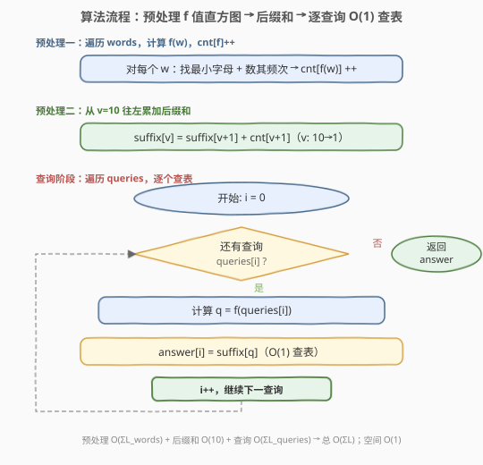
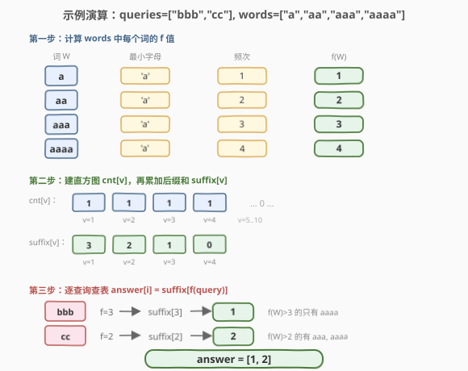

# 比较字符串最小字母出现频次

- **题目名称**：比较字符串最小字母出现频次
- **链接**：[1170. 比较字符串最小字母出现频次](https://leetcode.cn/problems/compare-strings-by-frequency-of-the-smallest-character/)
- **难度**：中等
- **标签**：数组、哈希表、字符串、计数、前缀和

## 1. 题目概述

定义函数 `f(s)`：统计 `s` 中**字典序最小字母的出现频次**（`s` 为非空字符串）。例如 `s = "dcce"`，最小字母是 `'c'`，出现 2 次，故 `f(s) = 2`。

给定两个字符串数组 `queries` 和 `words`。对每个 `queries[i]`，统计 `words` 中满足 $f(\text{queries}[i]) < f(W)$ 的词的数目，返回答案数组 `answer`。

**示例 1**：

```text
输入：queries = ["cbd"], words = ["zaaaz"]
输出：[1]
解释：f("cbd") = 1（最小字母 'b' 出现 1 次），f("zaaaz") = 3（最小字母 'a' 出现 3 次）。
      1 < 3，所以有 1 个词满足条件。
```

**示例 2**：

```text
输入：queries = ["bbb","cc"], words = ["a","aa","aaa","aaaa"]
输出：[1,2]
解释：f("bbb") = 3，words 中 f > 3 的只有 "aaaa"(f=4)，答案 1。
      f("cc") = 2，words 中 f > 2 的有 "aaa"(f=3) 和 "aaaa"(f=4)，答案 2。
```

**约束条件**：

- `1 <= queries.length <= 2000`
- `1 <= words.length <= 2000`
- `1 <= queries[i].length, words[i].length <= 10`
- `queries[i][j]`、`words[i][j]` 都由小写英文字母组成

> 💡 关键约束是**串长 ≤ 10**：这意味着 $f(s)$ 的取值范围只有 $[1, 10]$——最小字母至少出现 1 次，至多出现串长次。值域极小是本题从暴力 $O(n \cdot m)$ 优化到 $O(\Sigma L)$ 的突破口。

---

## 2. 解题思路

### 2.1 暴力思路：逐查询遍历 words

对每个查询 `queries[i]`，计算 `f(queries[i])`，然后遍历 `words` 中每个词计算 `f(W)`，比较大小并计数。

时间复杂度 $O(n \cdot m \cdot L)$，其中 $n = |\text{queries}|$、$m = |\text{words}|$、$L$ 为串长上界 10。最坏 $2000 \times 2000 \times 10 = 4 \times 10^7$，能过但浪费明显——每次查询都重复扫描整个 `words`。

更自然的优化方向：**`words` 是静态的，`f(W)` 的值域又极小（1–10），完全可以预处理成一张查找表**，让每次查询降为 $O(1)$。

### 2.2 核心观察：值域直方图 + 后缀和

![核心观察：f(s) = 最小字母频次，值域 [1,10] → 直方图 + 后缀和](../images/csf_concept.svg)

**关键转换**分两步：

1. **计算 `f(s)`**：一次遍历即可——维护当前最小字母 `minCh` 及其计数 `cnt`。遇到更小的字母就重置 `minCh` 和 `cnt = 1`；遇到等于 `minCh` 的就 `cnt++`。

2. **值域直方图 + 后缀和**：由于 $f(s) \in [1, 10]$，对 `words` 中所有词统计 `cnt[v]`（`f(W) = v` 的词数），再做后缀和 `suffix[v] = \sum_{k > v} \text{cnt}[k]`，即 `f(W) > v` 的词数。查询时 `answer[i] = suffix[f(queries[i])]`，$O(1)$ 搞定。

> 为什么这样是对的？题目要求统计 `f(W) > f(query)` 的词数。后缀和 `suffix[v]` 恰好就是 `f(W) > v` 的词数——把所有 `f(W)` 值排好后，从 `v+1` 到 10 的计数求和即得。这是**前缀和的镜像**：前缀和统计「≤ v」，后缀和统计「> v」。

> 💡 这是「**值域小 → 计数数组代替排序/二分**」的招牌思路（与 [1160. 拼写单词](1160_拼写单词.md)「26 字母 → 定长频率数组」、[1128. 等价多米诺骨牌对的数量](1128_等价多米诺骨牌对的数量.md)「数字 1–9 → 数组计数」同源）。值域是常数（10），所以直方图和后缀和都是 $O(1)$ 空间、$O(10)$ 时间。

### 2.3 算法流程图



**完整步骤**：

1. **预处理一**：遍历 `words`，对每个 `W` 计算 `f(W)`，`cnt[f(W)]++`。
2. **预处理二**：从 `v = 10` 往左累加后缀和：`suffix[v] = suffix[v+1] + cnt[v+1]`（`suffix[11] = 0` 为哨兵）。
3. **查询阶段**：遍历 `queries`，对每个 `queries[i]` 计算 `q = f(queries[i])`，`answer[i] = suffix[q]`。
4. **返回** `answer`。

> ⚠️ 后缀和的方向：`suffix[v]` 统计的是 `f(W) > v`（严格大于），所以递推式是 `suffix[v] = suffix[v+1] + cnt[v+1]`——累加的是 `v+1` 及更大的值。若题目改为 `≥`，则递推式改为 `suffix[v] = suffix[v+1] + cnt[v]`，差一个位置。

### 2.4 示例演算

以示例 2 `queries = ["bbb","cc"], words = ["a","aa","aaa","aaaa"]` 为例：



**第一步：计算 words 中每个词的 f 值**

| 词 W | 最小字母 | 频次 | f(W) |
|------|----------|------|------|
| a    | 'a'      | 1    | 1    |
| aa   | 'a'      | 2    | 2    |
| aaa  | 'a'      | 3    | 3    |
| aaaa | 'a'      | 4    | 4    |

**第二步：建直方图 cnt[v] 与后缀和 suffix[v]**

| v       | 1 | 2 | 3 | 4 | 5..10 |
|---------|---|---|---|---|-------|
| cnt[v]  | 1 | 1 | 1 | 1 | 0     |
| suffix[v] | 3 | 2 | 1 | 0 | 0     |

后缀和含义：`suffix[3] = 1`（`f > 3` 的词只有 aaaa），`suffix[2] = 2`（`f > 2` 的词有 aaa、aaaa）。

**第三步：逐查询查表**

| 查询 | f(query) | 查表 | answer[i] | 说明 |
|------|----------|------|-----------|------|
| bbb  | 3        | suffix[3] | 1 | f(W)>3 的只有 aaaa |
| cc   | 2        | suffix[2] | 2 | f(W)>2 的有 aaa, aaaa |

最终 `answer = [1, 2]`，与示例一致。

---

## 3. 参考代码

### 方法一：值域直方图 + 后缀和（推荐）

### C++

```cpp
class Solution {
public:
    vector<int> numSmallerByFrequency(vector<string>& queries, vector<string>& words) {
        int cnt[12] = {0};
        for (auto& w : words) {
            cnt[f(w)]++;
        }
        int suffix[12] = {0};
        for (int v = 9; v >= 1; v--) {
            suffix[v] = suffix[v + 1] + cnt[v + 1];
        }
        vector<int> answer;
        answer.reserve(queries.size());
        for (auto& q : queries) {
            answer.push_back(suffix[f(q)]);
        }
        return answer;
    }
private:
    int f(const string& s) {
        char minCh = 'z' + 1;
        int cnt = 0;
        for (char ch : s) {
            if (ch < minCh) { minCh = ch; cnt = 1; }
            else if (ch == minCh) cnt++;
        }
        return cnt;
    }
};
```

### Python

```python
class Solution:
    def numSmallerByFrequency(self, queries: List[str], words: List[str]) -> List[int]:
        def f(s: str) -> int:
            min_ch = min(s)
            return s.count(min_ch)

        cnt = [0] * 12
        for w in words:
            cnt[f(w)] += 1

        suffix = [0] * 12
        for v in range(9, 0, -1):
            suffix[v] = suffix[v + 1] + cnt[v + 1]

        return [suffix[f(q)] for q in queries]
```

> 💡 Python 中 `f(s)` 可以用 `s.count(min(s))` 一行搞定——`min(s)` 找最小字符，`s.count()` 数其出现次数，语义清晰。C++ 手写一遍遍历更高效，一次扫描同时维护最小字母和计数。

### 方法二：暴力双重遍历（仅作对照）

> 💡 **何时用暴力**：当 `queries` 和 `words` 都很小时（$n \cdot m \le 4 \times 10^6$），暴力足以通过。但方法一的预处理开销极低（值域 10），没有任何理由不用。

### C++

```cpp
class Solution {
public:
    vector<int> numSmallerByFrequency(vector<string>& queries, vector<string>& words) {
        vector<int> fw;
        for (auto& w : words) fw.push_back(f(w));
        vector<int> answer;
        for (auto& q : queries) {
            int fq = f(q);
            int c = 0;
            for (int v : fw) if (v > fq) c++;
            answer.push_back(c);
        }
        return answer;
    }
private:
    int f(const string& s) {
        char minCh = 'z' + 1;
        int cnt = 0;
        for (char ch : s) {
            if (ch < minCh) { minCh = ch; cnt = 1; }
            else if (ch == minCh) cnt++;
        }
        return cnt;
    }
};
```

> ⚠️ 方法二每次查询都扫一遍 `words` 的 `f` 值列表，$O(n \cdot m)$。当 $n = m = 2000$ 时是 $4 \times 10^6$ 次比较，虽能过但方法一只需 $O(\Sigma L)$ 且每次查询 $O(1)$，全面更优。

---

## 4. 复杂度分析

| 维度 | 方法一（直方图 + 后缀和） | 方法二（暴力双重遍历） |
|------|--------------------------|------------------------|
| **时间** | $O(\Sigma L_w + \Sigma L_q)$ | $O(\Sigma L_w + n \cdot m)$ |
| **空间** | $O(n)$ | $O(m)$ |

> ⚠️ **时间**：方法一预处理 `words` 每个词扫一遍 $O(\Sigma L_w)$，建后缀和 $O(10)$，查询每个词扫一遍 $O(\Sigma L_q)$。总计 $O(\Sigma L_w + \Sigma L_q)$，即所有字符串长度之和，上界 $4000 \times 10 = 4 \times 10^4$。方法二预处理相同，但每次查询扫 $m$ 个词，总计 $O(\Sigma L_w + n \cdot m)$，上界 $10^3 + 4 \times 10^6$。
>
> **空间**：方法一的 `cnt` 和 `suffix` 固定 12 位 $O(1)$，输出数组 $O(n)$。方法二的 `fw` 列表 $O(m)$。两者输出数组都是 $O(n)$（不计输出则方法一 $O(1)$、方法二 $O(m)$）。

---

## 5. 面试要点

1. **`f(s)` 怎么高效计算？**

   > 一次遍历：维护 `minCh`（当前最小字母）和 `cnt`（其计数）。遇到更小字母就重置 `minCh = ch, cnt = 1`；遇到等于 `minCh` 的就 `cnt++`。无需先排序或建频率表，$O(|s|)$ 时间 $O(1)$ 空间。

2. **为什么用后缀和而不是排序 + 二分？**

   > 排序 `f(W)` 列表后每次查询二分找 `upper_bound` 也能 $O(\log m)$，总 $O(n \log m)$。但 `f(s)` 值域只有 1–10，用计数数组 + 后缀和可以把查询降到 $O(1)$，且常数更小。**值域是常数时，计数数组全面优于排序+二分**——这是「桶式计数」对「比较型」的降维打击。

3. **后缀和的方向怎么确定？**

   > 题目要求 `f(W) > f(query)`（严格大于）。`suffix[v]` 应统计 `f(W) > v`，所以递推式 `suffix[v] = suffix[v + 1] + cnt[v + 1]`——从 `v+1` 位开始累加。若题目改为 `≥`，则改为 `suffix[v] = suffix[v + 1] + cnt[v]`，累加自身位。方向取决于比较符号是 `>` 还是 `≥`。

4. **如果串长不限于 10 还能这么做吗？**

   > 值域扩大到 $O(L_{\max})$ 时，计数数组大小 $O(L_{\max})$，后缀和仍可行但空间不再是 $O(1)$。此时改用排序 + 二分更合适：排序 $O(m \log m)$，每次查询二分 $O(\log m)$。两种方法的分水岭是「值域是否为常数」。

5. **这题和前缀和有什么关系？**

   > 后缀和是前缀和的镜像。前缀和 `prefix[v]` 统计 $\le v$ 的个数，后缀和 `suffix[v]` 统计 $> v$ 的个数，二者互补：$\text{prefix}[v] + \text{suffix}[v] = m$（总词数）。选哪个取决于题目要求「小于」还是「大于等于」——本题要求「严格大于」，用后缀和更直接，避免 `m - prefix[v]` 的间接转换。

> 💡 **一句话总结**：1170 的本质是「**值域小 → 直方图 + 后缀和**」——把 `words` 的 `f` 值压缩成 10 维计数向量，后缀和让每次查询降为 $O(1)$。串长 ≤ 10 是值域小的来源，是本题最优解的关键线索。

---

## 6. 同类练习题

- [1160. 拼写单词](../1101-1200/1160_拼写单词.md)：同为「值域小（26 字母）→ 定长数组代替哈希」的计数套路，频率表逐位比较
- [1128. 等价多米诺骨牌对的数量](../1101-1200/1128_等价多米诺骨牌对的数量.md)：数字范围 1–9 → 数组计数归一化，同「值域小→数组代替哈希」范式
- [303. 区域和检索 - 数组不可变](https://leetcode.cn/problems/range-sum-query-immutable/)：前缀和的母题，1170 的后缀和是其镜像（统计方向相反）
- [242. 有效的字母异位词](https://leetcode.cn/problems/valid-anagram/)：频率表要求完全相等（`==`），1170 的 `f(s)` 是频率表的进一步压缩（只取最小字母的频次）
- [2080. 区间内查询数字的频率](https://leetcode.cn/problems/range-frequency-queries/)：值域计数 + 区间查询，同「预处理值域分布 → 快速查询」思路
