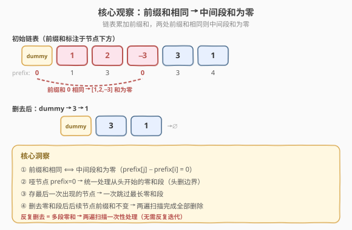
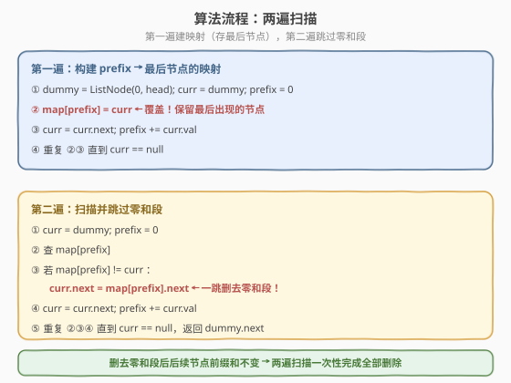
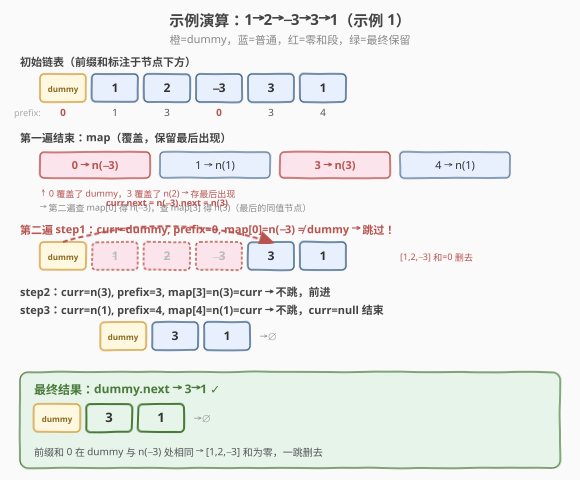

# LeetCode 从链表中删去总和值为零的连续节点 题解

## 1. 题目概述

- **标题 / 题号**：从链表中删去总和值为零的连续节点（#1171，medium）
- **链接**：https://leetcode.cn/problems/remove-zero-sum-consecutive-nodes-from-linked-list/
- **难度**：中等
- **标签**：链表、哈希表、前缀和

**题意**：给你一个链表的头节点 `head`，反复删去链表中由**总和**值为 `0` 的**连续节点**组成的序列，直到不存在这样的序列为止。删除完毕后，返回最终结果链表的头节点。可以返回任何满足题目要求的答案。

**示例 1**：

```text
输入：head = [1,2,-3,3,1]
输出：[3,1]
解释：[1,2,-3] 连续节点之和为 0，删去后剩余 [3,1]。答案 [1,2,1] 也正确（先删 [-3,3] 再删 [1,2,-3,...] 视删除顺序而异）。
```

**示例 2**：

```text
输入：head = [1,2,3,-3,4]
输出：[1,2,4]
解释：[3,-3] 连续节点之和为 0，删去后剩余 [1,2,4]。
```

**示例 3**：

```text
输入：head = [1,2,3,-3,-2]
输出：[1]
解释：先删 [3,-3] 得 [1,2,-2]，再删 [2,-2] 得 [1]。
```

**约束**：

- 链表节点数目范围 `[1, 1000]`
- `-1000 <= Node.val <= 1000`

> ⚠️ 本题的难点在于「**反复删去**」——删去一段零和序列后，可能暴露出新的零和序列（如示例 3 先删 `[3,-3]` 再删 `[2,-2]`）。如果每删一段就从头重新扫描，最坏 $O(n^2)$ 甚至更高。需要找到一种**一次性处理所有零和段**的方法。

## 2. 解题思路

### 2.1 暴力思路：枚举所有连续段 + 反复删除

每轮从头扫描，枚举所有连续段 `[i, j]`，计算段内节点值之和。若和为 `0`，删去该段并从头重启。最坏情况下每轮只删一段，共 $O(n)$ 轮，每轮枚举 $O(n^2)$ 个段、每段求和 $O(n)$，总计 $O(n^4)$，在 $n = 1000$ 时完全不可行。

> ⚠️ 暴力法的瓶颈在于「**每次删除后都要重新从头扫描**」和「**段和的重复计算**」。如果能将链表问题转化为**前缀和问题**，就能像数组一样用哈希表 $O(1)$ 定位零和段。

### 2.2 核心观察：前缀和 + 哈希表



**关键转化**：给链表引入前缀和的概念——从哑节点开始累加 `prefix += curr.val`，每个节点对应一个前缀和值。若两个节点的前缀和**相同**，则它们之间的连续段之和为 `0`：

$$
\text{prefix}[j] - \text{prefix}[i] = 0 \;\Longleftrightarrow\; \sum_{k=i+1}^{j} \text{val}_k = 0
$$

这与 [525. 连续数组](../0501-0600/525_连续数组.md) 中「0 当 −1 转换为前缀和相等」是完全相同的套路——**两处前缀和相同 ⟺ 中间段和为零**。

**三个关键设计**：

1. **哑节点 `prefix = 0`**：头节点本身可能属于零和段（如示例 1 的 `[1,2,-3]` 从头开始）。引入 `dummy(0)` 后，`dummy` 的前缀和为 `0`，当后续某节点前缀和也归 `0` 时，`dummy` 到该节点整段和为零——**统一了「从头开始的零和段」与「中间零和段」的边界处理**。

2. **存最后一次出现的节点**：第一遍遍历时，`map[prefix] = curr` 采用**覆盖**策略，保留每个前缀和**最后出现**的节点。这样第二遍查 `map[prefix]` 时，跳过的零和段尽可能长——一次跳过最长的零和段，减少重复处理。

3. **两遍扫描即可**：删去一个零和段后，**后续节点的前缀和不变**（因为删去的段和为零，相当于加了一个零）。所以第一遍构建的 `map` 在第二遍依然有效，**不需要反复迭代**——两遍扫描一次性完成全部删除。

> 💡 **为什么存最后而非最先？** [525. 连续数组](../0501-0600/525_连续数组.md) 求最长子数组时存**最早**下标（配出最长区间）；本题目标不同——不是求最长零和段的长度，而是**直接跳过它**。存最后出现的节点意味着在第二遍扫描到某个前缀和时，`map` 指向的是**最远的同值节点**，`curr.next = map[prefix].next` 一跳删去最长零和段，避免逐段删除的反复迭代。

### 2.3 算法流程图



**第一遍**（构建映射）：从 `dummy` 出发，`prefix += curr.val` 累加前缀和，`map[prefix] = curr` **覆盖**写入（保留最后出现的节点），直到 `curr == null`。

**第二遍**（跳过零和段）：再次从 `dummy` 出发，`prefix += curr.val` 累加前缀和。对每个 `curr`，查 `map[prefix]`：
- 若 `map[prefix] == curr`：该前缀和只出现一次（或已是最后），无需跳过，`curr.next = curr.next`（空操作）。
- 若 `map[prefix] != curr`：`curr` 与 `map[prefix]` 之间存在零和段，令 `curr.next = map[prefix].next` 一跳删去。

> ⚠️ **无需 if 判断**：`curr.next = map[prefix].next` 在 `map[prefix] == curr` 时就是 `curr.next = curr.next`（空操作），因此两遍的循环体可以统一写法，不分支。

### 2.4 示例演算

以 `head = [1,2,-3,3,1]`（示例 1）为例：



**第一遍**——构建 `map`（覆盖，保留最后出现）：

| 步骤 | 节点 | prefix | map 更新 | 说明 |
|------|------|--------|----------|------|
| 0 | dummy | 0 | `map[0] = dummy` | 哑节点起始 |
| 1 | 1 | 1 | `map[1] = n(1)` | — |
| 2 | 2 | 3 | `map[3] = n(2)` | — |
| 3 | −3 | 0 | `map[0] = n(−3)` | **覆盖** dummy |
| 4 | 3 | 3 | `map[3] = n(3)` | **覆盖** n(2) |
| 5 | 1 | 4 | `map[4] = n(1)` | — |

最终 `map = {0: n(−3), 1: n(1), 3: n(3), 4: n(1)}`。

**第二遍**——跳过零和段：

| 步骤 | curr | prefix | map[prefix] | 动作 | 链表状态 |
|------|------|--------|-------------|------|----------|
| 1 | dummy | 0 | n(−3) | `dummy.next = n(−3).next = n(3)` → 跳过 [1,2,−3] | dummy→3→1 |
| 2 | n(3) | 3 | n(3) | `n(3).next = n(3).next` → 空操作 | dummy→3→1 |
| 3 | n(1) | 4 | n(1) | `n(1).next = n(1).next` → 空操作 | dummy→3→1 |
| 4 | null | — | — | 结束 | **3→1** |

> 💡 步骤 1 中 `map[0] = n(−3)`（被覆盖，指向最后出现的 prefix=0 的节点），`dummy` 到 `n(−3)` 之间的段 `[1, 2, −3]` 和为零，`curr.next = map[0].next` 一跳删去。步骤 2-3 中 `map[prefix]` 恰好是 `curr` 自身，空操作不跳。

## 3. 参考代码

### C++

```cpp
/**
 * Definition for singly-linked list.
 * struct ListNode {
 *     int val;
 *     ListNode *next;
 *     ListNode() : val(0), next(nullptr) {}
 *     ListNode(int x) : val(x), next(nullptr) {}
 *     ListNode(int x, ListNode *next) : val(x), next(next) {}
 * };
 */
class Solution {
  public:
    ListNode* removeZeroSumSublists(ListNode* head) {
        ListNode* dummy = new ListNode(0, head);
        unordered_map<int, ListNode*> mp;

        // 第一遍：构建 prefix → 最后节点的映射（覆盖）
        int prefix = 0;
        for (ListNode* curr = dummy; curr; curr = curr->next) {
            prefix += curr->val;
            mp[prefix] = curr;               // 覆盖，保留最后出现
        }

        // 第二遍：跳过零和段
        prefix = 0;
        for (ListNode* curr = dummy; curr; curr = curr->next) {
            prefix += curr->val;
            curr->next = mp[prefix]->next;   // 跳到同前缀和最后节点的下一位
        }

        return dummy->next;
    }
};
```

### Python

```python
# Definition for singly-linked list.
# class ListNode:
#     def __init__(self, val=0, next=None):
#         self.val = val
#         self.next = next
class Solution:
    def removeZeroSumSublists(self, head: Optional[ListNode]) -> Optional[ListNode]:
        dummy = ListNode(0, head)
        mp = {}

        # 第一遍：构建 prefix → 最后节点的映射（覆盖）
        prefix = 0
        curr = dummy
        while curr:
            prefix += curr.val
            mp[prefix] = curr                # 覆盖，保留最后出现
            curr = curr.next

        # 第二遍：跳过零和段
        prefix = 0
        curr = dummy
        while curr:
            prefix += curr.val
            curr.next = mp[prefix].next      # 跳到同前缀和最后节点的下一位
            curr = curr.next

        return dummy.next
```

> 💡 两版代码逻辑完全一致，核心只有两行：`mp[prefix] = curr`（第一遍覆盖存最后）和 `curr->next = mp[prefix]->next`（第二遍跳过零和段）。无需 `if` 分支——当 `mp[prefix] == curr` 时，`curr->next = curr->next` 是空操作。这种「覆盖 + 统一跳过」的写法是本题最简洁的形式。

## 4. 复杂度分析

| 维度 | 复杂度 | 说明 |
|------|--------|------|
| **时间复杂度** | $O(n)$ | 两遍遍历，每遍 $n+1$ 个节点（含 dummy），哈希表操作均摊 $O(1)$ |
| **空间复杂度** | $O(n)$ | 哈希表最坏存 $n+1$ 个键值对（每个前缀和都不同） |

> ⚠️ 虽然题目要求「反复删去」，但两遍扫描已等价于完成全部删除——第一遍构建的 `map` 在第二遍依然有效，因为删去零和段后后续节点前缀和不变。无需多轮迭代，时间复杂度严格 $O(n)$。

## 5. 扩展：为什么存最后一次出现？

同属「前缀和 + 哈希」家族，本题与 [525](../0501-0600/525_连续数组.md)、[560](../0501-0600/560_和为K的子数组.md) 的目标不同，导致哈希表的写入策略截然不同：

| 题目 | 目标 | 哈希表存什么 | 已存在时是否覆盖 | 原因 |
|------|------|--------------|------------------|------|
| 525. 连续数组 | **最长长度** | 最早下标 | **不覆盖** | 最早下标配出最长区间 |
| 560. 和为 K 的子数组 | **计数** | 频次 | 不覆盖，频次 +1 | 统计所有合法子数组 |
| **1171. 删零和段** | **跳过删除** | 最后节点 | **覆盖** | 最后节点 → 跳过最长零和段 |

> 💡 口诀：**求最长存最早，求个数存频次，求跳过存最后**。本题存最后出现的节点，使得第二遍扫描到某个前缀和时，`map` 指向最远的同值节点，`curr.next = map[prefix].next` 一跳删去最长零和段——如果存的是最早节点，可能需要多次跳过才能删完嵌套的零和段。

**为什么两遍就够？** 核心在于**不变性**：删去一个和为零的连续段后，后续节点的前缀和**不变**（减去了一个零）。因此第一遍构建的 `map` 反映的「每个前缀和最后出现在哪里」在第二遍依然成立。即便存在嵌套零和段（如示例 3 的 `[3,-3]` 嵌在 `[2,3,-3,-2]` 中），存最后出现的策略已将最外层零和段一次性跳过，内层零和段随之外层一起被删。

## 6. 面试要点

1. **为什么用前缀和？直接枚举连续段不行吗？**

   > 暴力枚举所有连续段并求和是 $O(n^2)$，加上「反复删去」后最坏 $O(n^4)$。前缀和将「段和为零」转化为「两端前缀和相等」，用哈希表 $O(1)$ 定位，整体 $O(n)$。这是 [525](../0501-0600/525_连续数组.md)、[560](../0501-0600/560_和为K的子数组.md) 等题的同一套路迁移到链表。

2. **为什么需要哑节点？**

   > 头节点本身可能属于零和段（如 `[1,2,-3,...]` 从头开始的 `[1,2,-3]`）。哑节点 `val=0`，其前缀和为 `0`，当后续某节点前缀和也归 `0` 时，`dummy` 到该节点整段和为零。这样 `map[0]` 初始指向 `dummy`，第二遍扫描到 `dummy` 时查 `map[0]` 即可跳过从头开始的零和段——统一了头删边界，与 [82. 删除排序链表中的重复元素 II](../0001-0100/82_删除排序链表中的重复元素II.md) 用哑节点统一头删是同一模式。

3. **为什么存最后一次出现而不是第一次？**

   > 存最后出现使得第二遍查 `map[prefix]` 时，指向的是**最远的同值节点**，`curr.next = map[prefix].next` 一跳删去最长零和段。若存第一次出现，可能需要多次跳过才能处理完嵌套的零和段。对比 [525](../0501-0600/525_连续数组.md) 存最早下标求最长长度——目标不同，策略相反。

4. **两遍扫描为什么就够了？不需要反复删吗？**

   > 关键不变性：删去一个和为零的连续段后，后续节点的前缀和**不变**（减去了零）。所以第一遍构建的 `map`（每个前缀和最后出现在哪里）在第二遍依然有效。存最后出现的策略已将最外层零和段一次性跳过，内层零和段随之被删——两遍扫描等价于完成全部反复删除。

5. **`curr->next = mp[prefix]->next` 为什么不需要 if 判断？**

   > 当 `mp[prefix] == curr`（该前缀和只出现一次或已是最后）时，`curr->next = curr->next` 是空操作，不影响链表。当 `mp[prefix] != curr` 时，跳过中间的零和段。两种情况统一为同一赋值语句，代码更简洁。

> 💡 **一句话总结**：1171 是「前缀和 + 哈希」从数组迁移到链表的经典题——哑节点统一头删，第一遍覆盖存每个前缀和的**最后节点**，第二遍 `curr.next = map[prefix].next` 一跳删去最长零和段。删去零和段后后续前缀和不变，两遍扫描 $O(n)$ 一次性完成全部反复删除。

## 同类练习题

| # | 题目 | 与本题的关联 |
|---|------|-------------|
| 525 | [连续数组](https://leetcode.cn/problems/contiguous-array/)（[题解](../0501-0600/525_连续数组.md)） | 前缀和 + 哈希的母题，0 当 −1 转换为前缀和相等，对比「存最早下标求最长」vs 本题「存最后节点求跳过」 |
| 560 | [和为 K 的子数组](https://leetcode.cn/problems/subarray-sum-equals-k/)（[题解](../0501-0600/560_和为K的子数组.md)） | 前缀和 + 哈希的「计数」变体，对比哈希表存频次 vs 存节点 |
| 82 | [删除排序链表中的重复元素 II](https://leetcode.cn/problems/remove-duplicates-from-sorted-list-ii/)（[题解](../0001-0100/82_删除排序链表中的重复元素II.md)） | 哑节点统一头删的链表删除范式，与本题用哑节点处理头删同构 |
| 1124 | [表现良好的最长时间段](https://leetcode.cn/problems/longest-well-performing-interval/)（[题解](./1124_表现良好的最长时间段.md)） | 同区间的前缀和 + 哈希题，>8 当 +1、其余当 −1，求前缀和相等的最早下标，与 525 同构 |
| 713 | [乘积小于 K 的子数组](https://leetcode.cn/problems/subarray-product-less-than-k/) | 前缀积 + 滑动窗口，对比前缀和的加法变体与窗口计数 |
