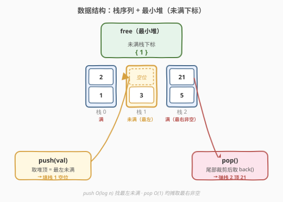
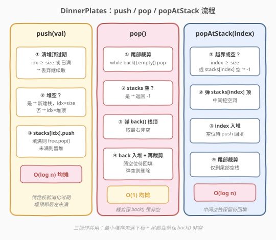
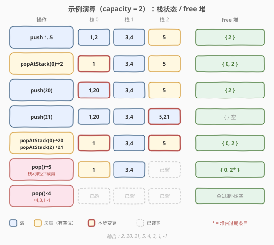

# LeetCode 餐盘栈 题解

## 1. 题目概述

- **标题 / 题号**：餐盘栈（#1172，hard）
- **链接**：https://leetcode.cn/problems/dinner-plate-stacks/
- **难度**：困难
- **标签**：设计、栈、堆（优先队列）

**题意**：把无限多个容量相同的栈排成一行，从左到右编号 `0, 1, 2, …`。实现 `DinnerPlates` 类：

- `DinnerPlates(int capacity)`：给出每个栈的最大容量 `capacity`。
- `void push(int val)`：把 `val` 压入**从左往右第一个没有满**的栈。
- `int pop()`：返回**从右往左第一个非空**栈的栈顶并删除；全空返回 `-1`。
- `int popAtStack(int index)`：返回编号 `index` 的栈顶并删除；该栈为空返回 `-1`。

**示例**：

```text
输入：
["DinnerPlates","push","push","push","push","push","popAtStack","push","push","popAtStack","popAtStack","pop","pop","pop","pop","pop"]
[[2],[1],[2],[3],[4],[5],[0],[20],[21],[0],[2],[],[],[],[],[]]
输出：
[null,null,null,null,null,null,2,null,null,20,21,5,4,3,1,-1]

解释（capacity = 2）：
D.push(1)..push(5)  →  栈: [1,2] [3,4] [5]
D.popAtStack(0)     →  返回 2，栈: [1] [3,4] [5]      ← 中间出现"空洞"
D.push(20)          →  填最左空洞，栈: [1,20] [3,4] [5]
D.push(21)          →  栈: [1,20] [3,4] [5,21]
D.popAtStack(0)     →  返回 20，栈: [1] [3,4] [5,21]
D.popAtStack(2)     →  返回 21，栈: [1] [3,4] [5]
D.pop()×5           →  5, 4, 3, 1, -1
```

**约束**：

- `1 <= capacity <= 20000`
- `1 <= val <= 20000`
- `0 <= index <= 100000`
- `push` / `pop` / `popAtStack` 总调用次数最多 `200000`

> 💡 难点不在"栈"本身，而在 `push` 要找**最左未满**、`pop` 要找**最右非空**，而 `popAtStack` 会在中间挖出"空洞"——`push` 必须优先回填这些空洞。这正是 [146 LRU 缓存](../0101-0200/146_LRU缓存.md) 那类"用额外索引结构把 O(n) 查找降到 O(log n)"的设计题。

## 2. 解题思路

### 2.1 暴力思路：线性扫描

维护一个 `vector<vector<int>> stacks`。`push` 时从左到右扫到第一个未满栈；`pop` 时从右到左扫到第一个非空栈；`popAtStack(index)` 直接操作 `stacks[index]`。

| 操作 | 复杂度 | 说明 |
|------|--------|------|
| `push` | $O(n)$ | 从左线性扫到第一个未满 |
| `pop` | $O(n)$ | 从右线性扫到第一个非空（若尾部有空栈更糟） |
| `popAtStack` | $O(1)$ | 直接按下标访问 |

调用次数可达 $2 \times 10^5$，最坏 $O(n)$ 单次会超时。瓶颈在于"找最左未满"与"找最右非空"两处线性扫描。

### 2.2 核心观察：最小堆维护"未满下标" + 尾部裁剪



**关键观察 1（push 找最左未满）**：`push` 关心的是"哪些栈还有空位"。我们用一个**最小堆** `free` 存放"当前未满栈的下标"。`push` 取堆顶（最小下标 = 最左）即是最左未满栈，$O(\log n)$。

**关键观察 2（堆里会有过期条目）**：`popAtStack` 把某栈弹空后会往 `free` 里塞它的下标；但随后 `push` 可能把别的栈填满、或尾部裁剪删掉了某些栈，使得堆里残留的下标可能"已满"或"越界"。因此从堆顶取下标时必须**校验**：若越界或该栈已满，丢弃继续取下一个。

**关键观察 3（pop 找最右非空）**：`pop` 关心"最右非空"。若放任尾部堆积空栈，每次 `pop` 都要跳过它们。做法是**尾部裁剪**：每当可能产生尾部空栈时（`pop`、`popAtStack` 后），`while` 弹掉 `stacks` 末尾的空栈。这样 `stacks.back()` 永远非空（除非整体为空），`pop` 直接取 `stacks.back()` 即 $O(1)$（均摊）。

> ⚠️ **裁剪只针对尾部**：中间被 `popAtStack` 挖空的栈**不能删**（会打乱后续下标），只把它们加入 `free` 等待 `push` 回填。尾部空栈删掉不影响任何下标语义——因为它们右边没有栈了，删除后 `push` 重新追加时拿回的也是同样的下标。

### 2.3 算法流程图



**`push(val)`**：

1. 先清理堆顶过期条目：`while` 堆非空且（`free.top() >= stacks.size()` 或 `stacks[free.top()]` 已满）→ 弹出丢弃。
2. 若堆空 → 追加新栈 `stacks.push_back({})`，用新下标 `idx = stacks.size()-1`。
3. 否则 `idx = free.top()`；若用后该栈满了，`free.pop()`。
4. `stacks[idx].push_back(val)`。

**`popAtStack(index)`**：

1. 若 `index >= stacks.size()` 或 `stacks[index]` 空 → 返回 `-1`。
2. 记 `val = stacks[index].back(); stacks[index].pop_back();`。
3. 把 `index` 加入 `free`（该栈刚腾出空位，可能成为最左未满）。
4. 尾部裁剪：`while` `stacks` 非空且 `stacks.back()` 空 → `stacks.pop_back()`。
5. 返回 `val`。

**`pop()`**：

1. 尾部裁剪（防御性，保证 `back()` 非空）。
2. 若 `stacks` 空 → 返回 `-1`。
3. `val = stacks.back().back(); stacks.back().pop_back();`。
4. 若 `back()` 现在未满（必然，因为刚弹出）→ 把 `stacks.size()-1` 加入 `free`。
5. 再尾部裁剪（若 `back()` 被弹空则删掉）。
6. 返回 `val`。

> 💡 **`pop` 也要把 `back()` 下标入堆**：`pop` 把最右栈弹了一个元素，该栈从此未满，之后 `push` 若它是最左未满就该填它（例如 `capacity=2`，`[1,2][3,4]` 全满，`pop` 得 `4` 后栈变 `[3]` 未满，下一次 `push` 应填这里而非新建栈）。

### 2.4 示例演算

以题面示例（`capacity=2`）走一遍，重点看 `free` 堆与裁剪的协同：



| 步骤 | 操作 | `stacks`（每栈容量 2） | `free` 堆 | 说明 |
|------|------|------------------------|-----------|------|
| 1 | `push(1)` | `[ [1] ]` | `{0}` | 新建栈 0，未满入堆 |
| 2 | `push(2)` | `[ [1,2] ]` | `{}` | 堆顶 0 填满，弹出 |
| 3 | `push(3)` | `[ [1,2],[3] ]` | `{1}` | 堆空→新建栈 1，入堆 |
| 4 | `push(4)` | `[ [1,2],[3,4] ]` | `{}` | 堆顶 1 填满，弹出 |
| 5 | `push(5)` | `[ [1,2],[3,4],[5] ]` | `{2}` | 堆空→新建栈 2，入堆 |
| 6 | `popAtStack(0)`→2 | `[ [1],[3,4],[5] ]` | `{0,2}` | 栈 0 腾空位入堆；尾部非空不裁剪 |
| 7 | `push(20)` | `[ [1,20],[3,4],[5] ]` | `{2}` | 堆顶 0（最左空洞）回填并填满，弹出 |
| 8 | `push(21)` | `[ [1,20],[3,4],[5,21] ]` | `{}` | 堆顶 2 填满，弹出 |
| 9 | `popAtStack(0)`→20 | `[ [1],[3,4],[5,21] ]` | `{0}` | 栈 0 又腾空位入堆 |
| 10 | `popAtStack(2)`→21 | `[ [1],[3,4],[5] ]` | `{0,2}` | 栈 2 腾空位入堆 |
| 11 | `pop()`→5 | `[ [1],[3,4] ]` | `{0,2*}` | 栈 2 弹空→裁剪删除；堆里 2 变过期 |
| 12 | `pop()`→4 | `[ [1],[3] ]` | `{0,2*,1}` | 栈 1 弹后未满，入堆 1 |
| 13 | `pop()`→3 | `[ [1] ]` | `{0,2*,1*}` | 栈 1 弹空→裁剪删除；堆里 1 变过期 |
| 14 | `pop()`→1 | `[ ]` | (全过期) | 栈 0 弹空→裁剪删除 |
| 15 | `pop()`→-1 | `[ ]` | — | 栈空返回 -1 |

> 💡 步骤 11–13 中带 `*` 的堆条目（`2`、`1`）已因尾部裁剪而越界过期，但它们无害：下次 `push` 取堆顶时会校验 `idx >= stacks.size()` 直接丢弃，不会误用。

输出序列 `2,20,21,5,4,3,1,-1` 与题面一致。

## 3. 参考代码

### C++

```cpp
class DinnerPlates {
    vector<vector<int>> stacks;   // 栈序列
    priority_queue<int, vector<int>, greater<int>> free;  // 最小堆：未满栈下标（可能含过期）
    int cap;
public:
    DinnerPlates(int capacity) : cap(capacity) {}

    void push(int val) {
        // 清理堆顶过期条目：越界或已满
        while (!free.empty()) {
            int idx = free.top();
            if (idx >= (int)stacks.size() || (int)stacks[idx].size() == cap) free.pop();
            else break;
        }
        int idx;
        if (free.empty()) {            // 无可用未满栈 → 新建一个
            stacks.push_back({});
            idx = (int)stacks.size() - 1;
        } else {
            idx = free.top();
            if ((int)stacks[idx].size() + 1 == cap) free.pop();  // 填满后弹出
        }
        stacks[idx].push_back(val);
    }

    int pop() {
        while (!stacks.empty() && stacks.back().empty()) stacks.pop_back();  // 尾部裁剪
        if (stacks.empty()) return -1;
        int val = stacks.back().back();
        stacks.back().pop_back();
        free.push((int)stacks.size() - 1);   // 刚腾出空位，入堆
        while (!stacks.empty() && stacks.back().empty()) stacks.pop_back();  // 弹空则裁剪
        return val;
    }

    int popAtStack(int index) {
        if (index >= (int)stacks.size() || stacks[index].empty()) return -1;
        int val = stacks[index].back();
        stacks[index].pop_back();
        free.push(index);                    // 该栈腾出空位，入堆等 push 回填
        while (!stacks.empty() && stacks.back().empty()) stacks.pop_back();  // 尾部裁剪
        return val;
    }
};
```

### Python

```python
import heapq


class DinnerPlates:
    def __init__(self, capacity: int):
        self.cap = capacity
        self.stacks: list[list[int]] = []
        self.free: list[int] = []          # 最小堆：未满栈下标（可能含过期）

    def push(self, val: int) -> None:
        # 清理堆顶过期条目：越界或已满
        while self.free:
            idx = self.free[0]
            if idx >= len(self.stacks) or len(self.stacks[idx]) == self.cap:
                heapq.heappop(self.free)
            else:
                break
        if not self.free:                  # 无可用未满栈 → 新建
            self.stacks.append([])
            idx = len(self.stacks) - 1
        else:
            idx = heapq.heappop(self.free) if len(self.stacks[self.free[0]]) + 1 == self.cap else self.free[0]
        self.stacks[idx].append(val)

    def pop(self) -> int:
        while self.stacks and not self.stacks[-1]:   # 尾部裁剪
            self.stacks.pop()
        if not self.stacks:
            return -1
        val = self.stacks[-1].pop()
        heapq.heappush(self.free, len(self.stacks) - 1)  # 腾出空位入堆
        while self.stacks and not self.stacks[-1]:       # 弹空则裁剪
            self.stacks.pop()
        return val

    def popAtStack(self, index: int) -> int:
        if index >= len(self.stacks) or not self.stacks[index]:
            return -1
        val = self.stacks[index].pop()
        heapq.heappush(self.free, index)                 # 腾出空位入堆等回填
        while self.stacks and not self.stacks[-1]:       # 尾部裁剪
            self.stacks.pop()
        return val
```

> 💡 两种实现都遵循同一思路：**最小堆存未满下标 + 取顶校验去过期 + 尾部裁剪保 `pop` O(1)**。Python 的 `heapq` 是最小堆天然契合；C++ 用 `greater<int>` 把默认大顶堆翻成小顶堆。注意 `push` 里"填满即弹 / 未满留堆"的分支，是为了避免堆里堆积大量"刚填满"的过期条目，减少后续校验次数（即便不做此优化、统一靠校验丢弃也正确，只是常数略大）。

## 4. 复杂度分析

| 维度 | 复杂度 | 说明 |
|------|--------|------|
| `push` 时间 | $O(\log n)$ 均摊 | 堆顶校验（过期条目整体均摊 $O(1)$/次）+ 至多一次堆操作 |
| `pop` 时间 | $O(1)$ 均摊 | 尾部裁剪整体均摊 $O(1)$（每个栈至多被删一次）+ 一次堆 push $O(\log n)$ |
| `popAtStack` 时间 | $O(\log n)$ | 一次堆 push + 尾部裁剪均摊 $O(1)$ |
| 总时间 | $O(Q \log n)$ | $Q$ 为调用总次数 $\le 2 \times 10^5$，$n \le Q$ |
| 空间 | $O(n + Q)$ | `stacks` 存全部元素 $O(Q)$ + `free` 堆至多 $O(n+Q)$ 条（含过期） |

> ⚠️ `pop` 的堆 push 看似让它退化为 $O(\log n)$，但若题目保证 `pop` 高频且不愿承担 $\log$，可改为"仅在 `back()` 真正未满时入堆"并配合一个 `back_in_free` 标记去重，把 `pop` 摊还到 $O(1)$。本题 $Q \log Q \approx 2\times10^5 \times 18$ 完全够用，无需此优化。

## 5. 扩展：为什么不直接用 `set` 维护未满下标

最小堆 `priority_queue` 有一个"缺点"：**不支持随机删除过期条目**，只能惰性校验。这带来两个小副作用：

1. 堆可能堆积过期条目，空间常数偏大（但均摊时间不受影响）。
2. `push` 取顶前必须 `while` 校验。

若改用**有序集合**（C++ `set<int>` / Java `TreeSet` / Python 无内置可用 `SortedList`），则可在 `popAtStack` 把已满下标从集合中精确删除、腾空时精确插入，堆里永远是"当下未满"的真集，`push` 直接取 `*begin()` 无需校验：

| 方案 | 数据结构 | `push` | 过期处理 | 实现复杂度 |
|------|----------|--------|----------|-----------|
| **最小堆（本文）** | `priority_queue` | 取顶 + 惰性校验 | 不删，靠校验丢弃 | 简单，库原生 |
| **有序集合** | `set` | `*begin()` 直取 | 精确删/插 | 稍繁，需在填满/腾空时维护 |

两者渐近复杂度同为 $O(\log n)$。最小堆胜在 C++/Python 标准库直接可用、代码短；有序集合胜在无过期条目、语义干净。面试中两种都可接受，讲清权衡即可。

> 💡 还有一类"值域桶"做法：因 `index <= 10^5` 且 `capacity` 不大，可用一个 `set` 或并查集按"下一个未满"跳转，本质等价于把"找最左未满"做成 $O(\alpha)$ 近似常数。但通用性与可读性不如堆/有序集合。

## 6. 面试要点

1. **`push` 为什么要用最小堆而不是线性扫描？**

   > `push` 要找"最左未满"，线性扫描 $O(n)$ 在 $2\times10^5$ 调用下超时。最小堆存"未满栈下标"，堆顶即最小下标 = 最左未满，$O(\log n)$。`popAtStack` 在中间挖空洞后把下标入堆，`push` 自然优先回填最左空洞。

2. **堆里的下标为什么会过期？如何处理？**

   > 尾部裁剪会删掉空栈使下标越界；某栈被填满后其下标不再"未满"。`priority_queue` 不支持随机删除，故采用**惰性校验**：`push` 取堆顶时 `while` 检查 `idx >= size` 或 `stacks[idx]` 已满，过期就丢弃继续取。过期条目不影响正确性，均摊代价 $O(1)$/次。

3. **`pop` 为什么能 $O(1)$ 均摊？尾部裁剪的作用？**

   > 若放任尾部堆积空栈，`pop` 要跳过它们退化为 $O(n)$。尾部裁剪 `while back().empty() pop_back()` 保证 `stacks.back()` 恒非空，`pop` 直接取 `back()`。每个栈至多被裁剪删除一次，整体均摊 $O(1)$。注意只裁剪尾部——中间空栈不能删，否则打乱下标。

4. **`pop` 之后为什么也要把 `back()` 下标入堆？**

   > `pop` 弹出一个元素后最右栈腾出空位变未满，它可能就是下一次 `push` 的最左未满（其左侧全满时）。不入堆则 `push` 找不到它而错误新建栈。例如 `[1,2][3,4]` 全满，`pop` 得 4 后栈 1 变 `[3]` 未满，下一次 `push` 应填栈 1 而非新建栈 2。

5. **能否用有序集合替代最小堆？各自的取舍？**

   > 可以。`set<int>` 精确删除已满下标、插入腾空下标，集合内永远是当下未满真集，`push` 取 `*begin()` 无需校验，语义更干净。代价是需在"填满/腾空"两处主动维护集合，代码稍繁；而最小堆惰性校验代码更短、标准库原生。渐近复杂度同为 $O(\log n)$。

> 💡 **一句话总结**：1172 是"栈序列 + 最小堆索引"的设计题——最小堆存未满下标让 `push` $O(\log n)$ 找最左空洞，尾部裁剪让 `pop` $O(1) 均摊取最右，惰性校验消化堆内过期条目。与 [146 LRU 缓存](../0101-0200/146_LRU缓存.md) 同属"用辅助索引结构把 O(n) 查找降到 O(log n)"的设计范式。

## 同类练习题

| # | 题目 | 与本题的关联 |
|---|------|-------------|
| 146 | [LRU 缓存](https://leetcode.cn/problems/lru-cache/)（[题解](../0101-0200/146_LRU缓存.md)） | 设计题范式标杆，"哈希 + 双向链表"把查找/维护降到 $O(1)$，与本题"堆 + 栈序列"思路同构 |
| 895 | [最大频率栈](https://leetcode.cn/problems/maximum-frequency-stack/) | 另一道"用堆/桶索引栈"的设计题，按频率取最值，对照"辅助索引结构"的迁移 |
| 1146 | [快照数组](https://leetcode.cn/problems/snapshot-array/)（[题解](./1146_快照数组.md)） | 同区间的设计题，"稀疏版本 + 二分"，对照不同辅助结构（二分 vs 堆）的选择 |
| 707 | [设计链表](https://leetcode.cn/problems/design-linked-list/) | 设计题入门，先吃透"哨兵 + 指针维护"基本功再迁移到本题的"堆 + 裁剪" |
| 23 | [合并 K 个升序链表](https://leetcode.cn/problems/merge-k-sorted-lists/) | 最小堆取最值的经典应用，巩固"堆顶即全局最值"直觉后回看本题 `push` |
