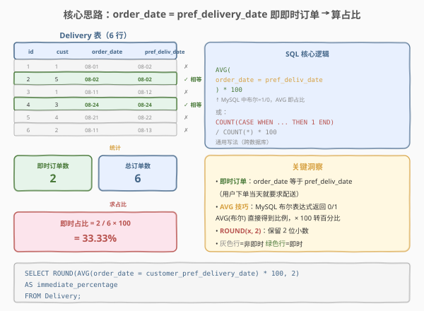
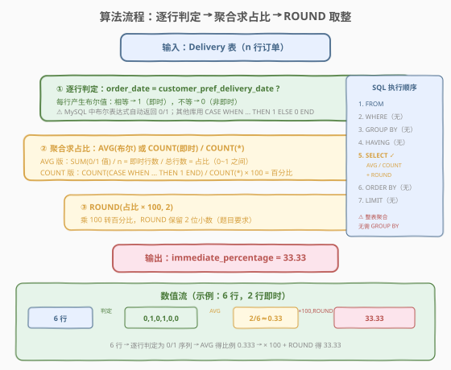
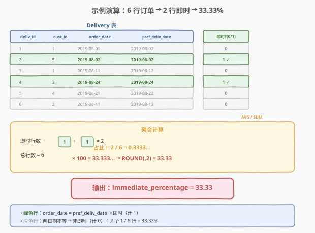

# 即时食物配送 I

- **题目名称**：即时食物配送 I
- **链接**：[1173. 即时食物配送 I](https://leetcode.cn/problems/immediate-food-delivery-i/)
- **难度**：简单
- **标签**：SQL、聚合函数、AVG、CASE WHEN、ROUND、百分比计算、布尔表达式

## 1. 题目概述

给定 `Delivery` 表，每行记录一笔外卖订单，包含下单日期 `order_date` 和顾客期望的配送日期 `customer_pref_delivery_date`。编写 SQL 查询，找出**即时订单的占比**（即 `order_date = customer_pref_delivery_date` 的订单所占百分比），结果**保留 2 位小数**。

**表结构**：

```text
Table: Delivery
+-----------------------------+---------+
| Column Name                 | Type    |
+-----------------------------+---------+
| delivery_id                 | int     |
| customer_id                 | int     |
| order_date                  | date    |
| customer_pref_delivery_date | date    |
+-----------------------------+---------+
```

> ⚠️ `delivery_id` 是该表的主键（值唯一）。每行记录一笔订单：顾客 `customer_id` 在 `order_date` 下单，期望在 `customer_pref_delivery_date` 配送。**「即时订单」**指 `order_date` 等于 `customer_pref_delivery_date`——即下单当天就要求配送。

**示例 1**：

```text
输入：
Delivery 表:
+-------------+-------------+------------+-----------------------------+
| delivery_id | customer_id | order_date | customer_pref_delivery_date |
+-------------+-------------+------------+-----------------------------+
| 1           | 1           | 2019-08-01 | 2019-08-02                  |
| 2           | 5           | 2019-08-02 | 2019-08-02                  |
| 3           | 1           | 2019-08-11 | 2019-08-12                  |
| 4           | 3           | 2019-08-24 | 2019-08-24                  |
| 5           | 4           | 2019-08-21 | 2019-08-22                  |
| 6           | 2           | 2019-08-11 | 2019-08-13                  |
+-------------+-------------+------------+-----------------------------+

输出：
+----------------------+
| immediate_percentage |
+----------------------+
| 33.33                |
+----------------------+
```

**解释**：

| delivery_id | order_date | pref_delivery_date | 即时？ | 说明 |
|-------------|------------|--------------------|--------|------|
| 1 | 2019-08-01 | 2019-08-02 | ✗ | 下单日 ≠ 期望配送日 |
| 2 | 2019-08-02 | 2019-08-02 | ✓ | **即时**：两日期相等 |
| 3 | 2019-08-11 | 2019-08-12 | ✗ | 下单日 ≠ 期望配送日 |
| 4 | 2019-08-24 | 2019-08-24 | ✓ | **即时**：两日期相等 |
| 5 | 2019-08-21 | 2019-08-22 | ✗ | 下单日 ≠ 期望配送日 |
| 6 | 2019-08-11 | 2019-08-13 | ✗ | 下单日 ≠ 期望配送日 |

- 6 笔订单中有 2 笔即时（delivery_id = 2、4）
- 占比 = $2 / 6 = 0.3333...$，× 100 = 33.33%

**约束条件**：

- `delivery_id` 是主键，无重复行
- `order_date` 和 `customer_pref_delivery_date` 均为 `date` 类型，可直接用 `=` 比较
- 结果保留 2 位小数（用 `ROUND(x, 2)`）
- 输出列名为 `immediate_percentage`

> 💡 本题是 SQL **"聚合统计 + 百分比计算"入门模板**——核心是把「即时判定」转化为 0/1 值，再用聚合函数求均值得到占比。考点不在查询难度，而在三个细节：① 用 `order_date = customer_pref_delivery_date` 判定即时（布尔 → 0/1）；② 用 `AVG` 直接求比例或 `COUNT / COUNT(*)` 求百分比；③ `ROUND(..., 2)` 保留两位小数。这三点覆盖了 SQL 聚合统计最基础的三要素：**条件计数（CASE WHEN / 布尔）、聚合（AVG / COUNT）、数值处理（ROUND）**。

---

## 2. 解题思路

### 2.1 暴力思路：逐行扫描计数

最直觉的过程式思路是：遍历 `Delivery` 表的每一行，检查该行的 `order_date` 是否等于 `customer_pref_delivery_date`，若相等则即时计数器加一；同时维护总行数计数器；最后计算 `即时数 / 总数 × 100` 并保留 2 位小数。伪代码如下：

```text
immediate_count = 0
total_count = 0
for each row in Delivery:
    total_count += 1
    if row.order_date == row.customer_pref_delivery_date:
        immediate_count += 1
percentage = round(immediate_count / total_count * 100, 2)
return percentage
```

**纯 SQL 没有显式逐行循环**——需要换成集合式表达。上述「逐行判定 + 累加计数 + 求比例」的模式，对应 SQL 的 `CASE WHEN`（或布尔表达式）+ 聚合函数（`AVG` / `COUNT`）+ `ROUND`。

> ⚠️ 过程式思维里「逐行判定」在 SQL 中表达为 `CASE WHEN order_date = customer_pref_delivery_date THEN 1 ELSE 0 END`（或 MySQL 中直接用布尔表达式 `order_date = customer_pref_delivery_date`，返回 0/1）；「累加计数 + 求比例」表达为 `AVG(0/1 序列)`（平均值即比例）或 `COUNT(即时行) / COUNT(*)`。

### 2.2 核心观察：布尔表达式 → AVG 即占比



**问题本质**：题目要算「即时订单占比」。关键洞察是——如果能把每行转化为一个 **0/1 值**（即时=1，非即时=0），那么这一列 0/1 值的**平均值**就是即时占比。

$$\text{即时占比} = \frac{\text{即时行数}}{\text{总行数}} = \frac{1}{n}\sum_{i=1}^{n} \mathbb{1}[\text{order\_date}_i = \text{pref\_date}_i] = \text{AVG}(\mathbb{1}[\cdots])$$

在 **MySQL** 中，布尔表达式 `order_date = customer_pref_delivery_date` 直接返回 `1`（true）或 `0`（false），因此 `AVG(order_date = customer_pref_delivery_date)` 就是即时占比（0~1 之间），乘以 100 即百分比。

在**通用 SQL**（跨数据库兼容）中，用 `CASE WHEN order_date = customer_pref_delivery_date THEN 1 ELSE 0 END` 显式生成 0/1 值，再用 `AVG` 或 `SUM / COUNT(*)` 求占比。

> 💡 **为什么用 `AVG` 而非 `COUNT / COUNT(*)`？** 两者等价：`AVG(0/1 序列) = SUM(0/1 序列) / COUNT(*) = 即时数 / 总数`。`AVG` 版更简洁——一行搞定「求和 + 除以总数」，无需分别写 `COUNT(即时)` 和 `COUNT(*)`。但 `COUNT / COUNT(*)` 版语义更直观——「即时行数除以总行数」，适合面试时口述思路。两种写法都应掌握。

### 2.3 算法流程图



**逻辑执行步骤**：

| 步骤 | 子句 | 作用 |
|------|------|------|
| ① | `FROM Delivery` | 读取全部订单记录 |
| ② | `order_date = customer_pref_delivery_date` | 逐行判定：即时 → 1，非即时 → 0 |
| ③ | `AVG(...)` 或 `COUNT(...) / COUNT(*)` | 聚合求占比（0~1 之间或直接 × 100） |
| ④ | `ROUND(... * 100, 2)` | 乘 100 转百分比，保留 2 位小数 |
| ⑤ | `AS immediate_percentage` | 输出列重命名 |

> 💡 **SQL 子句执行顺序**：`FROM` → `WHERE`（本题无）→ `GROUP BY`（本题无，整表聚合）→ `HAVING`（无）→ `SELECT`（含 `AVG` / `COUNT` / `ROUND`）→ `ORDER BY`（无）→ `LIMIT`（无）。本题是**整表聚合**——无需 `GROUP BY`，`AVG` / `COUNT` 自动作用于全表所有行，返回单行结果。

### 2.4 示例演算

以示例 1 数据为例，观察逐行判定 → 聚合 → 取整的完整过程：



**步骤 ①：逐行判定（生成 0/1 列）**

对 6 行订单逐行检查 `order_date = customer_pref_delivery_date`：

| delivery_id | order_date | pref_delivery_date | 即时？ | 0/1 值 |
|-------------|------------|--------------------|--------|--------|
| 1 | 2019-08-01 | 2019-08-02 | ✗ | 0 |
| 2 | 2019-08-02 | 2019-08-02 | ✓ | 1 |
| 3 | 2019-08-11 | 2019-08-12 | ✗ | 0 |
| 4 | 2019-08-24 | 2019-08-24 | ✓ | 1 |
| 5 | 2019-08-21 | 2019-08-22 | ✗ | 0 |
| 6 | 2019-08-11 | 2019-08-13 | ✗ | 0 |

> 💡 **MySQL 布尔特性**：`order_date = customer_pref_delivery_date` 在 MySQL 中返回 `1`（true）或 `0`（false）。这是 `AVG` 版能一行搞定的关键——布尔表达式天然是 0/1 数值。其他数据库（如 PostgreSQL）布尔不自动转数值，需用 `CASE WHEN` 显式转换。

**步骤 ②：聚合求占比（AVG）**

对 0/1 列求平均值：

$$\text{AVG} = \frac{0 + 1 + 0 + 1 + 0 + 0}{6} = \frac{2}{6} = 0.3333\ldots$$

即即时行数（2）除以总行数（6），得到占比 0.3333...。

**步骤 ③：转百分比 + 保留 2 位小数**

$$0.3333\ldots \times 100 = 33.333\ldots \xrightarrow{\text{ROUND}(., 2)} 33.33$$

最终输出 `immediate_percentage = 33.33`，与示例一致。

---

## 3. 参考代码

### SQL（解法 A：AVG + 布尔表达式，MySQL 推荐）

```sql
SELECT ROUND(
    AVG(order_date = customer_pref_delivery_date) * 100,
    2
) AS immediate_percentage
FROM Delivery;
```

> 💡 **写法要点**：
> - `order_date = customer_pref_delivery_date`：MySQL 布尔表达式，逐行返回 1（即时）或 0（非即时）。
> - `AVG(...)`：对 0/1 列求均值 = 即时数 / 总数 = 占比（0~1）。
> - `* 100`：占比转百分比。
> - `ROUND(..., 2)`：保留 2 位小数（题目要求）。
> - ✓ **最简洁**：一行聚合搞定判定 + 计数 + 求比例 + 取整，MySQL 专属写法。

### SQL（解法 B：COUNT + CASE WHEN，通用跨库）

```sql
SELECT ROUND(
    COUNT(CASE WHEN order_date = customer_pref_delivery_date THEN 1 END) * 100.0 / COUNT(*),
    2
) AS immediate_percentage
FROM Delivery;
```

> 💡 **写法要点**：
> - `CASE WHEN ... THEN 1 END`：即时行返回 1，非即时行返回 `NULL`（`ELSE` 省略时默认 `NULL`）。
> - `COUNT(CASE ... END)`：`COUNT` 不计 `NULL`，所以只数即时行 = 即时数。
> - `COUNT(*)`：数所有行 = 总数。
> - `* 100.0`：乘 100.0（浮点）避免整数除法截断（某些数据库中 `int / int = int`）。
> - ✓ **跨数据库通用**：不依赖 MySQL 布尔特性，PostgreSQL / SQL Server / Oracle 均可。

### SQL（解法 C：SUM + IF，MySQL 简洁版）

```sql
SELECT ROUND(
    SUM(IF(order_date = customer_pref_delivery_date, 1, 0)) * 100 / COUNT(*),
    2
) AS immediate_percentage
FROM Delivery;
```

> 💡 **写法要点**：`IF(条件, 1, 0)` 是 MySQL 的三元表达式，等价于 `CASE WHEN ... THEN 1 ELSE 0 END`。`SUM` 把 0/1 求和 = 即时数，`COUNT(*)` = 总数。语义最直观——「即时数 × 100 / 总数」。注意 `SUM(...) / COUNT(*)` 在 MySQL 中因 `SUM` 返回 `DECIMAL` 不会截断，但其他数据库仍建议加 `100.0`。

### Python（pandas）

```python
import pandas as pd

def immediate_food_delivery(delivery: pd.DataFrame) -> pd.DataFrame:
    immediate_count = (delivery['order_date'] == delivery['customer_pref_delivery_date']).sum()
    total_count = len(delivery)
    percentage = round(immediate_count / total_count * 100, 2)
    return pd.DataFrame({'immediate_percentage': [percentage]})
```

> 💡 **pandas 对照**：`delivery['order_date'] == delivery['customer_pref_delivery_date']` 布尔 Series 对应 SQL 的 `order_date = customer_pref_delivery_date`；`.sum()` 对应 `COUNT(CASE WHEN ... THEN 1 END)`（True=1）；`len(delivery)` 对应 `COUNT(*)`；`round(..., 2)` 对应 `ROUND(..., 2)`。也可用 `.mean()` 直接求比例：`round((delivery['order_date'] == delivery['customer_pref_delivery_date']).mean() * 100, 2)`，对应 SQL 的 `AVG` 版。

---

## 4. 复杂度分析

| 维度 | 复杂度 | 说明 |
|------|--------|------|
| **时间** | $O(n)$ | 全表扫描一次，逐行判定 $O(n)$；`AVG` / `COUNT` / `SUM` 聚合 $O(n)$；`ROUND` $O(1)$ |
| **空间** | $O(1)$ | 整表聚合只产生单行结果，无需中间存储 |
| **结果行数** | $O(1)$ | 恒定输出 1 行（百分比数值） |

> ⚠️ SQL 复杂度取决于**执行计划与索引**：本题是整表聚合，`AVG` / `COUNT` 必须扫描全表 $O(n)$（无 `WHERE` 过滤，无索引可加速聚合）。若 `order_date` 和 `customer_pref_delivery_date` 上有索引，理论上可走索引覆盖扫描（index-only scan），但仍需 $O(n)$ 遍历所有索引项。面试中说明「全表扫描 $O(n)$，空间 $O(1)$」即可。

---

## 5. 扩展：AVG vs COUNT/COUNT(*) vs SUM/COUNT 三种写法对比

### 5.1 三种聚合方式的本质

| 维度 | `AVG(布尔)` | `COUNT(CASE) / COUNT(*)` | `SUM(IF) / COUNT(*)` |
|------|-------------|--------------------------|----------------------|
| **核心思想** | 0/1 列均值 = 比例 | 即时数 / 总数 | 即时数 / 总数 |
| **判定方式** | MySQL 布尔（自动 0/1） | `CASE WHEN ... THEN 1 END`（NULL 排除） | `IF(..., 1, 0)` |
| **数据库兼容** | ❌ 仅 MySQL | ✓ 通用 | ❌ 仅 MySQL（`IF` 函数） |
| **简洁度** | ★★★ 最简洁 | ★★ 稍长 | ★★ 稍长 |
| **可读性** | ★★ 需知 MySQL 布尔 | ★★★ 语义最直观 | ★★★ 语义直观 |
| **整数除法风险** | 无（AVG 返回 DECIMAL） | 有（需 `* 100.0`） | 无（SUM 返回 DECIMAL） |

> 💡 **选择口诀**：**MySQL 环境、追求简洁用 `AVG(布尔)`；跨数据库、追求可移植用 `COUNT(CASE) / COUNT(*)`；MySQL、追求语义直观用 `SUM(IF) / COUNT(*)`**。面试中推荐先写 `COUNT(CASE)` 版（通用且语义清晰），再提「MySQL 中可用 `AVG(布尔)` 更简洁」作为优化。

### 5.2 整数除法陷阱

> ⚠️ **整数除法**：在 SQL Server / PostgreSQL 等数据库中，`int / int` 结果为 `int`（截断小数）。例如 `2 / 6 = 0`（而非 0.333），导致百分比恒为 0。解决方法：乘以 `100.0`（浮点）使除法升级为浮点除法——`2 * 100.0 / 6 = 33.33`。MySQL 中 `COUNT` 返回 `BIGINT`，但 `/` 自动转为 `DECIMAL`，故无此问题。但为跨库安全，建议始终写 `* 100.0`。

### 5.3 从 1173 (I) 到 1174 (II)

| 变体 | 需求 | SQL 演进 |
|------|------|---------|
| **1173 原题（I）** | 全部订单中即时占比 | `AVG(order_date = pref_date)` 直接全表聚合 |
| **1174 进阶（II）** | 每个顾客**首单**中即时占比 | 子查询取每顾客最早订单 + 外层 `AVG` 聚合 |

> 💡 1174 (II) 在 1173 (I) 基础上增加「只看每个顾客的第一笔订单」的约束——需先用子查询 `SELECT MIN(order_date) ... GROUP BY customer_id` 或窗口函数 `ROW_NUMBER()` 筛出首单，再套用 1173 的占比聚合逻辑。理解 1173 的核心（布尔 → AVG 求占比），1174 只是加了「首单过滤」的前置步骤。

---

## 6. 面试要点

1. **为什么 `AVG(order_date = customer_pref_delivery_date)` 能算占比？**

   - 在 MySQL 中，布尔表达式 `order_date = customer_pref_delivery_date` 返回 `1`（true）或 `0`（false）。对这列 0/1 值求 `AVG`，即 $\frac{\sum 0/1}{n} = \frac{\text{即时数}}{\text{总数}}$ = 占比。这是利用「布尔 → 0/1 → 均值 = 比例」的数学等价关系，把「计数 + 除法」压缩为一次 `AVG` 调用。

2. **`AVG(布尔)` 和 `COUNT(CASE) / COUNT(*)` 有什么区别？**

   - `AVG(布尔)` 依赖 MySQL 布尔返回 0/1 的特性，**仅 MySQL 可用**，但最简洁；`COUNT(CASE WHEN ... THEN 1 END) / COUNT(*)` 用 `CASE WHEN` 显式生成 0/1（非即时为 `NULL`，`COUNT` 不计 `NULL`），**跨数据库通用**。两者数学等价：`AVG(0/1) = SUM(0/1) / COUNT(*) = COUNT(非 NULL 的 1) / COUNT(*)`。面试推荐先写通用版，再提 MySQL 优化版。

3. **为什么要注意整数除法？怎么避免？**

   - 在 SQL Server / PostgreSQL 中，`int / int` 结果截断为 `int`（如 `2 / 6 = 0`），导致百分比恒为 0。避免方法：将分子乘以 `100.0`（浮点字面量），使除法升级为浮点除法——`COUNT(...) * 100.0 / COUNT(*)`。MySQL 中 `/` 自动返回 `DECIMAL`，无此问题，但为跨库安全建议始终用 `100.0`。

4. **`ROUND(x, 2)` 的作用是什么？不写会怎样？**

   - `ROUND(x, 2)` 将数值四舍五入到 2 位小数，满足题目「保留 2 位小数」的要求。不写则输出完整小数（如 33.333333...），不符合题目格式。注意 `ROUND` 是**四舍五入**——如 `ROUND(33.335, 2)` 在多数数据库中为 33.34（但浮点精度可能导致边界差异）。

5. **为什么本题不需要 `GROUP BY`？**

   - 本题是**整表聚合**——对 `Delivery` 表所有行计算一个全局占比，无需按某列分组。`AVG` / `COUNT` / `SUM` 在无 `GROUP BY` 时自动作用于全表，返回单行结果。若题目改为「每个顾客的即时订单占比」，才需要 `GROUP BY customer_id`。整表聚合 vs 分组聚合的区别是 SQL 聚合查询的基础认知。

> 💡 **一句话总结**：1173 是 SQL **"聚合统计 + 百分比计算"入门招牌题**——核心就一句 `SELECT ROUND(AVG(order_date = customer_pref_delivery_date) * 100, 2) AS immediate_percentage FROM Delivery`。考点覆盖 SQL 聚合三要素：**条件计数（布尔 / CASE WHEN 生成 0/1）、聚合（AVG / COUNT）、数值处理（ROUND + 整数除法陷阱）**。理解「布尔 → 0/1 → AVG = 比例」「跨库用 CASE WHEN」「整数除法乘 100.0」这三点，所有百分比统计题都能覆盖。

---

## 7. 同类练习题

- [1174. 即时食物配送 II](https://leetcode.cn/problems/immediate-food-delivery-ii/)：1173 的进阶版——只统计每个顾客**首单**的即时占比，需子查询/窗口函数筛首单后再聚合
- [1141. 查询近 30 天活跃用户数](https://leetcode.cn/problems/user-activity-for-the-past-30-days-i/)：`WHERE` 日期过滤 + `GROUP BY` + `COUNT(DISTINCT)`——对比 1173 理解「整表聚合」与「分组聚合」的差异
- [1142. 过去 30 天的用户活动 II](https://leetcode.cn/problems/user-activity-for-the-past-30-days-ii/)：`WHERE` 过滤 + `COUNT` 聚合 + `IFNULL` 处理空结果——在 1173 基础上叠加聚合与空值处理
- [627. 变更性别](https://leetcode.cn/problems/swap-salary/)：`CASE WHEN` 条件表达式 UPDATE——对比 1173 中 `CASE WHEN` 用于 SELECT 聚合，理解 `CASE WHEN` 在不同子句中的通用性
- [1211. 查询结果质量](https://leetcode.cn/problems/queries-quality-and-percentage/)：`GROUP BY` + `AVG` + `ROUND` 分组求均值与百分比——1173 的分组版（按 query 分组求占比），叠加分组聚合
