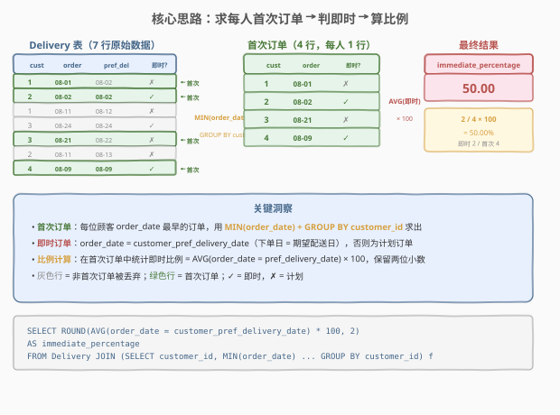
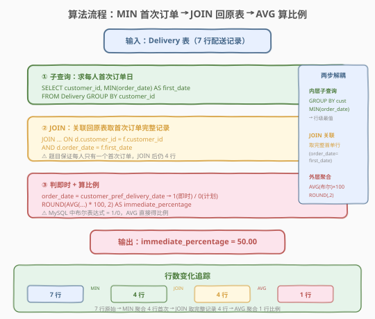
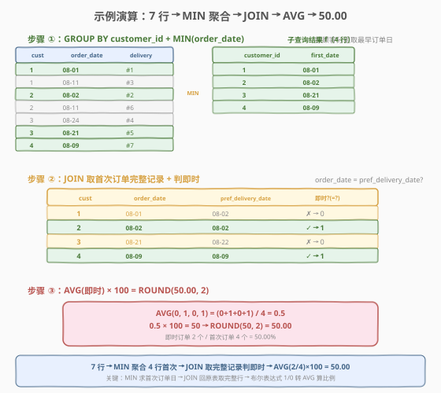

# LeetCode 即时食物配送 II 题解

## 1. 题目概述

- **标题 / 题号**：即时食物配送 II（#1174，medium）
- **链接**：https://leetcode.cn/problems/immediate-food-delivery-ii/
- **难度**：中等
- **标签**：SQL、子查询、GROUP BY、MIN 聚合、JOIN、AVG、布尔转比例

**题意**：给定 `Delivery` 表，每行记录一次食物配送：某顾客在某日下单，并指定了一个期望配送日期（≥ 下单日）。如果期望配送日期与下单日期相同，则称为「即时订单」，否则称为「计划订单」。「首次订单」是每位顾客最早创建的订单（题目保证每位顾客只有一个首次订单）。编写 SQL 查询，计算**即时订单在所有顾客首次订单中的比例**，保留两位小数。

**表结构**：

```text
Table: Delivery
+-----------------------------+---------+
| Column Name                 | Type    |
+-----------------------------+---------+
| delivery_id                 | int     |  ← 唯一值
| customer_id                 | int     |
| order_date                  | date    |  ← 下单日期
| customer_pref_delivery_date | date    |  ← 期望配送日期（≥ order_date）
+-----------------------------+---------+
delivery_id 是该表中具有唯一值的列。
```

> ⚠️ `customer_pref_delivery_date` 始终 ≥ `order_date`（期望配送日不会早于下单日）。即时订单 = 两者相等，计划订单 = 两者不等。每位顾客可能有多次配送记录，但首次订单唯一（`MIN(order_date)` 对应的行唯一）。

**示例 1**：

```text
输入：
Delivery 表：
+-------------+-------------+------------+-----------------------------+
| delivery_id | customer_id | order_date | customer_pref_delivery_date |
+-------------+-------------+------------+-----------------------------+
| 1           | 1           | 2019-08-01 | 2019-08-02                  |
| 2           | 2           | 2019-08-02 | 2019-08-02                  |
| 3           | 1           | 2019-08-11 | 2019-08-12                  |
| 4           | 3           | 2019-08-24 | 2019-08-24                  |
| 5           | 3           | 2019-08-21 | 2019-08-22                  |
| 6           | 2           | 2019-08-11 | 2019-08-13                  |
| 7           | 4           | 2019-08-09 | 2019-08-09                  |
+-------------+-------------+------------+-----------------------------+

输出：
+----------------------+
| immediate_percentage |
+----------------------+
| 50.00                |
+----------------------+
```

**解释**：

| 顾客 | 首次订单 delivery_id | order_date | pref_delivery_date | 即时? | 说明 |
|------|---------------------|------------|---------------------|-------|------|
| 1 | #1 | 2019-08-01 | 2019-08-02 | ✗ | 08-01 ≠ 08-02 → 计划订单 |
| 2 | #2 | 2019-08-02 | 2019-08-02 | ✓ | 08-02 = 08-02 → 即时订单 |
| 3 | #5 | 2019-08-21 | 2019-08-22 | ✗ | 08-21 ≠ 08-22 → 计划订单（#4 的 08-24 更晚，非首次） |
| 4 | #7 | 2019-08-09 | 2019-08-09 | ✓ | 08-09 = 08-09 → 即时订单 |

4 位顾客的首次订单中，2 个即时（顾客 2、4），2 个计划（顾客 1、3）→ 比例 = 2/4 = 50.00%。

**约束**：

- `delivery_id` 具有唯一值
- `customer_pref_delivery_date ≥ order_date`（期望配送日不早于下单日）
- 每位顾客只有一个首次订单（`MIN(order_date)` 唯一对应一行）
- 结果保留两位小数，输出列名 `immediate_percentage`

> 💡 本题是 SQL **"首次事件 + 比例统计"经典模板**——核心两步：① `GROUP BY customer_id + MIN(order_date)` 求每位顾客首次订单日，再 `JOIN` 回原表取完整首单记录；② 在首单记录上判定即时（`order_date = customer_pref_delivery_date`），用 `AVG(布尔) × 100` 算比例。难点在于理解"首次订单"需先聚合再关联，以及 MySQL 中布尔表达式自动转 1/0 配合 `AVG` 算比例的技巧。

## 2. 解题思路

### 2.1 暴力思路：逐顾客扫描

最直觉的过程式思路是：对每个 `customer_id`，遍历其所有配送记录，找到 `order_date` 最早的一行作为首次订单，检查该行的 `order_date` 是否等于 `customer_pref_delivery_date`；最后统计即时首次订单数除以总顾客数。伪代码如下：

```text
first_orders = []
for each customer_id:
    records = [row for row in Delivery if row.customer_id == customer_id]
    first = min(records, key=lambda r: r.order_date)
    first_orders.append(first)
immediate_count = sum(1 for r in first_orders if r.order_date == r.customer_pref_delivery_date)
percentage = round(immediate_count / len(first_orders) * 100, 2)
return percentage
```

但**纯 SQL 没有显式逐行循环**——「对每个顾客找最早订单」需换成集合式表达：子查询先 `GROUP BY customer_id + MIN(order_date)` 算出每人首次订单日，再 `JOIN` 回原表取完整行，最后 `AVG` 聚合算比例。

> ⚠️ 过程式思维中「找最早订单」在 SQL 中表达为 `GROUP BY customer_id + MIN(order_date)`，这是"行级最值"的标准求法。但 `MIN(order_date)` 只返回日期，不返回该行的其他列（如 `customer_pref_delivery_date`），所以还需 `JOIN` 回原表才能判定即时。

### 2.2 核心观察：两步解耦——首次订单 + 比例统计



**问题拆解为两个独立的子问题**：

1. **求首次订单**：「每位顾客最早的订单」是一个**行级最值**（每个顾客一个 `MIN(order_date)`），用 `GROUP BY customer_id` 聚合得到。但聚合后只有 `(customer_id, first_date)` 两列，缺少 `customer_pref_delivery_date`——需 `JOIN` 回原表 `Delivery`，用 `customer_id` 和 `order_date = first_date` 双条件匹配，取回首次订单的完整行。

   $$\text{首次订单行} = \{ r \in \text{Delivery} \mid r.\text{order\_date} = \min_{r' \in \text{Delivery}(r.\text{customer\_id})} r'.\text{order\_date} \}$$

2. **算即时比例**：在首次订单行上判定即时——`order_date = customer_pref_delivery_date`。MySQL 中布尔表达式返回 `1`（真）或 `0`（假），`AVG` 对这列 0/1 求平均即为即时比例（0~1 之间），`× 100` 转百分比，`ROUND(..., 2)` 保留两位小数。

   $$\text{immediate\_percentage} = \text{ROUND}\Big(\text{AVG}\big(\text{order\_date} = \text{pref\_delivery\_date}\big) \times 100,\; 2\Big)$$

> 💡 **为何分两层而非一层**：`GROUP BY customer_id + MIN(order_date)` 聚合后只剩分组列和聚合值，原行的 `customer_pref_delivery_date` 丢失。要判定即时必须拿到首单的完整行信息，因此必须 `JOIN` 回原表——这是"聚合求最值 → 关联回原表取详情"的标准两步法。

> ⚠️ **三个易错点**：
> - **`MIN(order_date)` 只返回日期不返回整行**：需 `JOIN` 回 `Delivery` 取 `customer_pref_delivery_date` 才能判定即时。不能只靠子查询结果算比例。
> - **`JOIN` 条件必须双列匹配**：`ON d.customer_id = f.customer_id AND d.order_date = f.first_order_date`——仅按 `customer_id` 关联会匹配到该顾客的所有订单，而非仅首次。
> - **`AVG(布尔)` 依赖 MySQL 的隐式转换**：MySQL 中 `order_date = customer_pref_delivery_date` 返回 `1`/`0`，`AVG` 直接得比例。其他数据库（如 PostgreSQL）需显式 `CAST(... AS INT)` 或用 `CASE WHEN ... THEN 1 ELSE 0 END`。

### 2.3 算法流程图



**逻辑执行步骤**：

| 步骤 | 子句 | 作用 |
|------|------|------|
| ① | `SELECT customer_id, MIN(order_date) AS first_order_date ... GROUP BY customer_id` | 按顾客分组取最早订单日（行级最值） |
| ② | `JOIN Delivery d ON d.customer_id = f.customer_id AND d.order_date = f.first_order_date` | 关联回原表取首次订单的完整行（含 `customer_pref_delivery_date`） |
| ③ | `AVG(d.order_date = d.customer_pref_delivery_date) * 100` | 布尔转 1/0，AVG 算即时比例，× 100 转百分比 |
| ④ | `ROUND(..., 2) AS immediate_percentage` | 保留两位小数 |

> 💡 **SQL 子句执行顺序**：`FROM`（含 `JOIN`/`ON`）→ `WHERE` → `GROUP BY` → `HAVING` → `SELECT`（含 `AVG`）→ `ORDER BY` → `LIMIT`。步骤 ① 的子查询先执行产出 `(customer_id, first_order_date)` 中间表，步骤 ② 的 `JOIN` 在 `FROM` 阶段完成，步骤 ③ 的 `AVG` 在 `SELECT` 阶段对 `JOIN` 后的结果集聚合。注意 `AVG` 是聚合函数，无需 `GROUP BY`——对整个结果集（4 行首单）求一个平均值，返回 1 行。

### 2.4 示例演算

以示例 1 数据为例，观察 `MIN` → `JOIN` → `AVG` 的逐步执行过程：



**步骤 ①：`GROUP BY customer_id + MIN(order_date)`**

按顾客分组取最早订单日，7 行 → 4 行（每人 1 行）：

| customer_id | first_order_date | 对应 delivery_id |
|-------------|-----------------|-----------------|
| 1 | 2019-08-01 | #1（08-01 < 08-11） |
| 2 | 2019-08-02 | #2（08-02 < 08-11） |
| 3 | 2019-08-21 | #5（08-21 < 08-24） |
| 4 | 2019-08-09 | #7（唯一一行） |

> 💡 顾客 3 有两条记录：#4（08-24）和 #5（08-21），`MIN` 取较早的 08-21，对应 delivery_id=#5。#4 虽然是即时订单（08-24=08-24），但不是首次订单，不参与统计——这正是"只在首次订单中算比例"的体现。

**步骤 ②：`JOIN` 回原表取完整行 + 判即时**

用 `customer_id + order_date = first_order_date` 双条件 `JOIN` 回 `Delivery`，取回首次订单的完整行：

| customer_id | order_date | customer_pref_delivery_date | 即时? (order_date = pref?) |
|-------------|------------|------------------------------|---------------------------|
| 1 | 2019-08-01 | 2019-08-02 | ✗ → 0 |
| 2 | 2019-08-02 | 2019-08-02 | ✓ → 1 |
| 3 | 2019-08-21 | 2019-08-22 | ✗ → 0 |
| 4 | 2019-08-09 | 2019-08-09 | ✓ → 1 |

> 💡 `JOIN` 后仍为 4 行——题目保证每位顾客只有一个首次订单（同一 `customer_id` 的 `MIN(order_date)` 唯一对应一行）。若无此保证，同一 `first_order_date` 可能匹配多行，导致行数膨胀。

**步骤 ③：`AVG(即时) × 100`**

对即时列 `{0, 1, 0, 1}` 求 `AVG`：

$$\text{AVG} = \frac{0 + 1 + 0 + 1}{4} = 0.5$$

$$0.5 \times 100 = 50 \xrightarrow{\text{ROUND}(,2)} 50.00$$

最终输出 `immediate_percentage = 50.00`，与示例一致。

## 3. 参考代码

### SQL（解法 A：MIN 子查询 + JOIN + AVG，推荐）

```sql
SELECT ROUND(
    AVG(d.order_date = d.customer_pref_delivery_date) * 100,
    2
) AS immediate_percentage
FROM Delivery d
JOIN (
    SELECT customer_id, MIN(order_date) AS first_order_date
    FROM Delivery
    GROUP BY customer_id
) f ON d.customer_id = f.customer_id
    AND d.order_date = f.first_order_date;
```

> 💡 **写法要点**：
> - **内层子查询** `f`：`GROUP BY customer_id + MIN(order_date)` 求每人首次订单日，产出 `(customer_id, first_order_date)` 中间表。
> - **JOIN 回原表**：用 `customer_id` 和 `order_date = first_order_date` **双条件**匹配，确保只取首次订单的完整行（含 `customer_pref_delivery_date`）。
> - **AVG(布尔)**：MySQL 中 `d.order_date = d.customer_pref_delivery_date` 返回 `1`/`0`，`AVG` 对这列 0/1 求平均即即时比例。
> - **× 100 + ROUND(, 2)**：比例转百分比并保留两位小数。
> - ✓ **最直观**：先求首次、再判即时、最后算比例，三步逻辑清晰分离。

### SQL（解法 B：ROW_NUMBER 窗口函数）

```sql
SELECT ROUND(
    AVG(order_date = customer_pref_delivery_date) * 100,
    2
) AS immediate_percentage
FROM (
    SELECT order_date, customer_pref_delivery_date,
           ROW_NUMBER() OVER (PARTITION BY customer_id ORDER BY order_date) AS rn
    FROM Delivery
) t
WHERE rn = 1;
```

> 💡 **与解法 A 的区别**：用 `ROW_NUMBER() OVER (PARTITION BY customer_id ORDER BY order_date)` 给每位顾客的订单按日期升序编号，`rn = 1` 即首次订单——一步到位保留完整行，无需 `JOIN` 回原表。⚠️ 窗口函数在 `SELECT` 阶段求值，`WHERE rn = 1` 必须包一层子查询。适合需要取首次订单完整行信息的场景，本题 `MIN + JOIN` 更简洁。

### SQL（解法 C：SUM / COUNT 显式比例）

```sql
SELECT ROUND(
    SUM(d.order_date = d.customer_pref_delivery_date) * 100.0 / COUNT(*),
    2
) AS immediate_percentage
FROM Delivery d
JOIN (
    SELECT customer_id, MIN(order_date) AS first_order_date
    FROM Delivery
    GROUP BY customer_id
) f ON d.customer_id = f.customer_id
    AND d.order_date = f.first_order_date;
```

> 💡 **与解法 A 的区别**：用 `SUM(布尔) / COUNT(*)` 代替 `AVG(布尔)`——显式拆成"即时数 ÷ 总数"。`* 100.0` 强制浮点除法（MySQL 的 `/` 本身返回 DECIMAL，但 `100.0` 更明确、跨数据库兼容）。两者结果相同，`AVG` 更简洁，`SUM/COUNT` 更直观展示"2 / 4"的语义。面试中说明"`AVG(x) = SUM(x)/COUNT(*)`，两者等价"即可。

### Python（pandas）

```python
import pandas as pd

def immediate_food_delivery(delivery: pd.DataFrame) -> pd.DataFrame:
    delivery = delivery.sort_values('order_date')
    first_orders = delivery.drop_duplicates('customer_id', keep='first')
    immediate = (first_orders['order_date'] == first_orders['customer_pref_delivery_date'])
    pct = round(immediate.mean() * 100, 2)
    return pd.DataFrame({'immediate_percentage': [pct]})
```

> 💡 **pandas 对照**：
> - `.sort_values('order_date')` + `.drop_duplicates('customer_id', keep='first')` 对应 SQL 的 `MIN(order_date) + GROUP BY customer_id`——按日期排序后每组保留第一条（即最早），等价于 `ROW_NUMBER ... rn=1`。
> - `first_orders['order_date'] == first_orders['customer_pref_delivery_date']` 布尔 Series 对应 SQL 的 `order_date = customer_pref_delivery_date`（返回 True/False，等价 1/0）。
> - `.mean()` 对应 SQL 的 `AVG(布尔)`——对 True/False Series 求平均，True=1/False=0。
> - `round(..., 2)` 对应 `ROUND(..., 2)`。
> - 思路与 SQL 解法 B 同构：排序取首条 → 判即时 → 求平均。

## 4. 复杂度分析

| 维度 | 解法 A（MIN + JOIN） | 解法 B（ROW_NUMBER） | 解法 C（SUM/COUNT） |
|------|---------------------|---------------------|---------------------|
| **时间** | $O(n)$ | $O(n \log n)$ | $O(n)$ |
| **空间** | $O(u)$ | $O(n)$ | $O(u)$ |
| **扫描次数** | 2 次（子查询聚合 + JOIN） | 1 次（排序 + 过滤） | 2 次（同解法 A） |
| **推荐度** | ✓ **首选**，语义直观 | ✓ 备选，无需 JOIN | ✓ 备选，比例显式 |

> - $n$ = `Delivery` 表行数，$u$ = 不同 `customer_id` 数量（$u \le n$）
> - **解法 A/C**：内层 `GROUP BY` 哈希聚合 $O(n)$，`JOIN` 哈希匹配 $O(n)$，`AVG`/`SUM` 聚合 $O(u)$，总计 $O(n)$
> - **解法 B**：`ROW_NUMBER` 需对每个顾客的订单按日期排序，$O(n \log n)$（通常每组行数少，接近 $O(n)$）
> - **空间**：子查询物化 $O(u)$ 行（每人一行）；窗口函数需排序缓冲 $O(n)$
> - **索引优化**：在 `(customer_id, order_date)` 上建联合索引，`GROUP BY customer_id + MIN(order_date)` 可走索引有序扫描；`JOIN` 的 `ON customer_id = ... AND order_date = ...` 可走索引探测

## 5. 扩展：首次事件模式与布尔转比例技巧

### 5.1 "首次事件"泛化模板

本题与 1107（每日新用户统计）、511（游戏玩法分析 I）共享同一模式——「每个实体的首次发生事件」。通用模板：

```sql
-- 泛化模板：每个实体的首次事件 + 统计
SELECT ... -- 外层按需求统计
FROM (
    SELECT entity_id, MIN(event_date) AS first_event_date
    FROM Events
    WHERE event_type = '目标类型'   -- 可选：先过滤事件类型
    GROUP BY entity_id
) f
JOIN Events e ON e.entity_id = f.entity_id
    AND e.event_date = f.first_event_date;
```

| 变体 | 需求 | SQL 演进 |
|------|------|---------|
| **1174 原题** | 首次订单即时比例 | `MIN(order_date)` + JOIN + `AVG(布尔)×100` |
| 1107 每日新用户数 | 按首次登录日统计人数 | `MIN(login_date)` + 外层 `GROUP BY date + COUNT` |
| 511 首次登录日期 | 返回每人首次登录日 | `MIN(event_date)` + `GROUP BY player_id`（无需 JOIN） |
| 550 次日留存率 | 首次登录次日也登录的比例 | `MIN(event_date)` + 自连接/`DATE_ADD` 判断次日 |
| 1173 即时食物配送 I | 所有即时订单（非仅首次） | 无需 `MIN`，直接 `WHERE order_date = pref_delivery_date` |

> 💡 **1174 vs 1173**：1173（即时食物配送 I）统计**所有**即时订单的比例，不限于首次——直接 `AVG(order_date = customer_pref_delivery_date) * 100`，无需子查询。1174（II）限定在**首次订单**中统计，需先 `MIN + JOIN` 筛出首次订单，是 1173 的进阶版。

### 5.2 MySQL 布尔转比例的两种写法

| 写法 | SQL | 语义 | 跨数据库兼容 |
|------|-----|------|-------------|
| **AVG(布尔)** | `AVG(col1 = col2) * 100` | 布尔 → 1/0 → AVG 得比例 | ⚠️ MySQL 专属（隐式 1/0） |
| **SUM/COUNT** | `SUM(CASE WHEN col1=col2 THEN 1 ELSE 0 END) * 100.0 / COUNT(*)` | 显式 1/0 → SUM/COUNT | ✓ 通用（CASE WHEN 标准语法） |

> 💡 **选型建议**：LeetCode 使用 MySQL，`AVG(布尔)` 最简洁。生产环境跨数据库迁移时，用 `SUM(CASE WHEN ... THEN 1 ELSE 0 END) / COUNT(*)` 更安全。面试中答："MySQL 中布尔自动转 1/0，`AVG` 直接得比例；跨库用 `CASE WHEN` 显式转换。"

### 5.3 窗口函数 vs 聚合 + JOIN

| 维度 | ROW_NUMBER（解法 B） | MIN + JOIN（解法 A） |
|------|----------------------|----------------------|
| **核心思路** | 排序编号取 Top-1 | 聚合求最值 + 关联回原表 |
| **取首单方式** | `ORDER BY order_date ASC` + `rn=1` | `MIN(order_date)` + `JOIN ON order_date=first_date` |
| **是否需 JOIN** | ❌ 一步到位保留完整行 | ✓ 需 JOIN 回原表取详情 |
| **性能** | $O(n \log n)$（排序） | $O(n)$（哈希聚合 + 哈希连接） |
| **适用场景** | 需取首条完整行信息 | 只需聚合值或简单关联 |

> 💡 本题两种写法等价。`MIN + JOIN` 性能更优（$O(n)$ vs $O(n \log n)$），但 `ROW_NUMBER` 代码更紧凑（无需 JOIN）。现代优化器在数据量小时两者执行计划可能趋同。

## 6. 面试要点

1. **为什么用 `MIN(order_date) + GROUP BY customer_id` 求首次订单？能否直接 `WHERE` 过滤？**

   > 「首次订单」是每位顾客 `order_date` 最早的订单——这是**行级最值**，需按 `customer_id` 分组后取 `MIN(order_date)`。不能直接 `WHERE` 过滤，因为 `WHERE` 是逐行判定，无法在行级表达"该顾客的最早日期"这一跨行聚合条件。`GROUP BY customer_id + MIN(order_date)` 是求"每个实体的首次事件"的标准模式，与 1107（首次登录日）、511（首次游戏日）同构。

2. **为什么 `MIN(order_date)` 后还要 `JOIN` 回原表？**

   > `GROUP BY customer_id + MIN(order_date)` 只返回 `(customer_id, first_order_date)` 两列，原行的 `customer_pref_delivery_date` 在聚合时丢失。要判定即时（`order_date = customer_pref_delivery_date`），必须拿到首单的完整行信息，因此 `JOIN` 回 `Delivery` 表，用 `customer_id` 和 `order_date = first_order_date` **双条件**匹配取回完整行。若用 `ROW_NUMBER() OVER (PARTITION BY customer_id ORDER BY order_date)` + `rn = 1`，则一步到位保留完整行，无需 JOIN。

3. **`AVG(order_date = customer_pref_delivery_date)` 是怎么工作的？**

   > MySQL 中，布尔表达式（如 `a = b`）返回 `1`（TRUE）或 `0`（FALSE）。`AVG` 对这列 0/1 值求平均，结果即为"即时订单占首次订单的比例"（0~1 之间）。`× 100` 转百分比，`ROUND(, 2)` 保留两位小数。例如 4 行首单中 2 个即时 → `{0,1,0,1}` → `AVG = 0.5` → `× 100 = 50` → `ROUND(50, 2) = 50.00`。⚠️ 这是 MySQL 隐式转换特性，PostgreSQL/SQL Server 等需用 `CASE WHEN ... THEN 1 ELSE 0 END` 或 `CAST(... AS INT)` 显式转换。

4. **`JOIN` 条件为什么必须双列匹配（`customer_id` + `order_date = first_order_date`）？**

   > 若仅 `ON d.customer_id = f.customer_id`，会匹配到该顾客的**所有**订单（如顾客 1 的 #1 和 #3 两行），而非仅首次订单——导致分母膨胀、比例错误。加上 `AND d.order_date = f.first_order_date` 才能精确匹配到首次订单那一行。题目保证每位顾客只有一个首次订单（`MIN(order_date)` 唯一对应一行），所以 `JOIN` 后行数 = 顾客数，不会膨胀。

5. **如果同一顾客在同一天下了多个订单（`MIN(order_date)` 对应多行），怎么办？**

   > 题目保证"每位顾客只有一个首次订单"，所以 `MIN(order_date)` 唯一对应一行，`JOIN` 后不会膨胀。但若无此保证，同一 `first_order_date` 可能匹配多行，导致 `JOIN` 后行数 > 顾客数，`AVG` 分母偏大。此时应改用 `ROW_NUMBER() OVER (PARTITION BY customer_id ORDER BY order_date)` + `rn = 1`——`ROW_NUMBER` 强制每组只取一行（同分时随机打破并列），保证一人一行。或用 `GROUP BY customer_id` 在首单行上再聚合一次。

> 💡 **一句话总结**：1174 是 SQL **"首次事件 + 比例统计"招牌题**——核心模板「`GROUP BY + MIN` 求首次 → `JOIN` 回原表取完整行 → `AVG(布尔)×100` 算比例」。三个要点：① `MIN(order_date)` 只返回日期不返回整行，需 `JOIN` 取 `customer_pref_delivery_date`；② `JOIN` 条件必须双列匹配（`customer_id` + `order_date = first_date`）避免匹配到非首单；③ MySQL 布尔转 1/0 配合 `AVG` 直接得比例。与 1107（首次登录日）、511（首次游戏日）共享"每个实体的首次事件"模式。

## 同类练习题

| # | 题目 | 与本题的关联 |
|---|------|-------------|
| 1107 | [每日新用户统计](https://leetcode.cn/problems/new-users-daily-count/) | `GROUP BY user_id + MIN(activity_date)` 求每人首次登录日，再按日计数——共享"首次事件"模式，1174 在此基础上算比例而非计数 |
| 511 | [游戏玩法分析 I](https://leetcode.cn/problems/game-play-analysis-i/) | `GROUP BY player_id + MIN(event_date)` 返回每人首次登录日期，是 1174 的简化版（无需 JOIN 回原表） |
| 550 | [游戏玩法分析 IV](https://leetcode.cn/problems/game-play-analysis-iv/) | 首次登录次日也登录的比例，叠加 `DATE_ADD` 日期差判断，与 1174 同为"首次事件 + 比例统计"结构 |
| 1173 | [即时食物配送 I](https://leetcode.cn/problems/immediate-food-delivery-i/) | 统计**所有**即时订单比例（非仅首次），无需 `MIN` 子查询，是 1174 的基础版 |
| 1068 | [产品销售分析 I](https://leetcode.cn/problems/product-sales-analysis-i/) | `JOIN` 关联销售表与产品表取完整信息，共享"聚合/过滤后 JOIN 回原表取详情"的关联骨架 |
