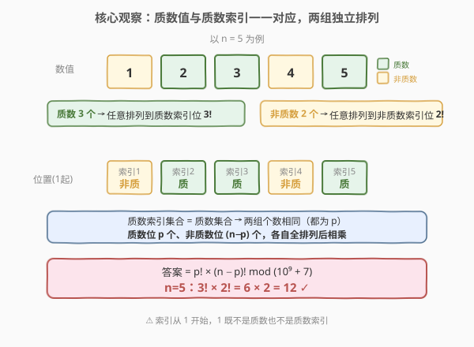
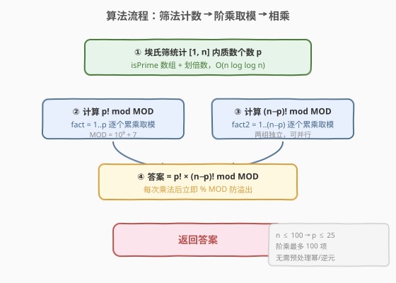
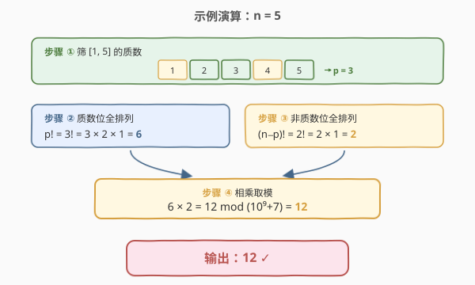

# 质数排列

- **题目名称**：质数排列
- **链接**：[1175. 质数排列](https://leetcode.cn/problems/prime-arrangements/)
- **难度**：简单
- **标签**：数学、数论、排列组合、埃氏筛、取模

## 1. 题目概述

请你帮忙给从 `1` 到 `n` 的数设计排列方案，使得所有的「质数」都应该被放在「质数索引」（索引从 1 开始）上；你需要返回可能的方案总数。

由于答案可能会很大，请你返回答案 **模 `10^9 + 7`** 之后的结果即可。

> 回顾「质数」：质数一定是大于 1 的，并且不能用两个小于它的正整数的乘积来表示（即大于 1 且只有 1 和自身两个因子的自然数）。

**示例 1**：

```text
输入：n = 5
输出：12
解释：举个例子，[1,2,5,4,3] 是一个有效的排列，但 [5,2,3,4,1] 不是，
     因为在第二种情况里质数 5 被错误地放在索引为 1 的位置上。
```

**示例 2**：

```text
输入：n = 100
输出：682289015
```

**约束条件**：

- `1 <= n <= 100`

> 💡 这是一道**数论 + 排列组合**的签到题。核心只有两步：①数出 `[1, n]` 里的质数个数 `p`；②把质数全排列到质数位、非质数全排列到非质数位，两组独立相乘。难点不在算法，而在想通「质数索引集合 = 质数集合」这一恒等关系。与 [204. 计数质数](../0201-0300/204_计数质数.md) 的筛法、[172. 阶乘后的零](../0001-0100/172_阶乘后的零.md) 的阶乘数论同源。

---

## 2. 解题思路

### 2.1 暴力思路：枚举全排列

最直白的做法是生成 `1..n` 的所有全排列（共 $n!$ 个），逐个检查「每个质数是否落在质数索引上」。`n = 100` 时 $n! \approx 9.3 \times 10^{157}$，远超宇宙原子数，必然超时。问题在于：**绝大多数排列做了无用功**——质数与非质数各占一组，只要保证「组内任意排列、组间不串位」即可，根本不必枚举所有排列。

### 2.2 核心观察：质数值与质数索引一一对应



关键是想清楚一件事：**「质数索引」的下标本身就是质数**（索引从 1 开始，索引 2、3、5、7… 都是质数；索引 1、4、6、8、9… 不是）。所以：

- **质数索引集合** = $\{i \mid 1 \le i \le n,\ i \text{ 是质数}\}$，恰好就是 `[1, n]` 中的全体质数。
- **质数值集合** = $\{v \mid 1 \le v \le n,\ v \text{ 是质数}\}$，同样是 `[1, n]` 中的全体质数。

两者**完全相同**，个数都记为 `p`（`[1, n]` 中质数的数量）。于是：

- 有 `p` 个质数位，恰好放 `p` 个质数值 → 质数在质数位上**任意全排列**，方案数 $= p!$。
- 有 `n - p` 个非质数位，恰好放 `n - p` 个非质数值 → 非质数在非质数位上**任意全排列**，方案数 $= (n-p)!$。
- 两组**互相独立**（质数不会跑到非质数位，反之亦然），由乘法原理：

$$\text{答案} = p! \times (n-p)! \pmod{10^9 + 7}$$

> ⚠️ **易错点：1 既不是质数也不是质数索引**。索引 1（非质数）只能放非质数值（1、4、6…），千万不要把 1 当质数。题目强调「质数一定大于 1」，正是为排除这个边界。

> 💡 **为什么两组个数恰好相等？** 因为「质数索引」和「质数值」用的是同一个判定（是否为 `[1,n]` 中的质数），定义在同一个区间上，自然得到同一个集合。这是本题最核心的洞察——想通这一点，问题就退化成「数质数 + 算两个阶乘」。

### 2.3 算法流程图



**完整步骤**：

1. **数质数**：用埃氏筛（或试除法，$n \le 100$ 规模极小）统计 `[1, n]` 中质数个数 `p`。
2. **算 $p! \bmod \text{MOD}$**：从 1 累乘到 `p`，每步取模。
3. **算 $(n-p)! \bmod \text{MOD}$**：从 1 累乘到 `n-p`，每步取模。
4. **相乘取模**：`ans = p! * (n-p)! % MOD`，返回。

> 💡 $n \le 100$ 时 $p \le 25$（`[1,100]` 共 25 个质数），阶乘项最多 100 个，无需预处理阶乘表或逆元，边乘边模即可。

### 2.4 示例演算



以 `n = 5` 为例：

| 步骤 | 内容 | 结果 |
|------|------|------|
| ① 筛质数 | `[1,5]` 中质数 = {2, 3, 5}，非质数 = {1, 4} | `p = 3`，`n - p = 2` |
| ② 质数位全排列 | 质数位 {索引2, 索引3, 索引5} 放 {2,3,5} | $3! = 6$ |
| ③ 非质数位全排列 | 非质数位 {索引1, 索引4} 放 {1,4} | $2! = 2$ |
| ④ 相乘取模 | $6 \times 2 = 12$，$12 \bmod (10^9+7) = 12$ | **12** ✓ |

再验证 `n = 100`：`[1,100]` 共 25 个质数，$p = 25$，$n - p = 75$，答案 $= 25! \times 75! \bmod (10^9+7) = 682289015$ ✓。

> 💡 **一组有效排列长什么样？** `n=5` 时，质数位 {2,3,5} 放 {2,3,5} 的任一排列（6 种），非质数位 {1,4} 放 {1,4} 的任一排列（2 种）。例如 `[1,2,5,4,3]`：索引1=1(非质)、索引2=2(质)、索引3=5(质)、索引4=4(非质)、索引5=3(质)，合法。而 `[5,2,3,4,1]` 把质数 5 放到索引1(非质数位)，非法。

---

## 3. 参考代码

### C++

```cpp
// 质数排列.cpp —— 数质数 + 阶乘取模
// 编译: g++ -O2 -std=c++17 质数排列.cpp -o prime_arr
class Solution {
    static const int MOD = 1e9 + 7;

    // 统计 [1, n] 内质数个数（埃氏筛，n<=100 用试除也行）
    int countPrimesUpTo(int n) {
        if (n < 2) return 0;
        vector<bool> isPrime(n + 1, true);
        isPrime[0] = isPrime[1] = false;
        for (int i = 2; (long long)i * i <= n; ++i)      // 只筛到 √n
            if (isPrime[i])
                for (int j = i * i; j <= n; j += i)       // 从 i*i 起划倍数
                    isPrime[j] = false;
        int cnt = 0;
        for (int i = 2; i <= n; ++i) if (isPrime[i]) ++cnt;
        return cnt;
    }

    long long factorial(int k) {                          // k! mod MOD
        long long f = 1;
        for (int i = 1; i <= k; ++i)
            f = f * i % MOD;
        return f;
    }
public:
    int numPrimeArrangements(int n) {
        int p = countPrimesUpTo(n);                       // 质数个数 = 质数位个数
        return (int)(factorial(p) * factorial(n - p) % MOD);
    }
};
```

### Python

```python
class Solution:
    def numPrimeArrangements(self, n: int) -> int:
        MOD = 10**9 + 7

        # 统计 [1, n] 内质数个数
        def count_primes(n: int) -> int:
            if n < 2:
                return 0
            is_prime = [True] * (n + 1)
            is_prime[0] = is_prime[1] = False
            i = 2
            while i * i <= n:                             # 只筛到 √n
                if is_prime[i]:
                    for j in range(i * i, n + 1, i):      # 从 i*i 起划倍数
                        is_prime[j] = False
                i += 1
            return sum(is_prime)                          # True 计为 1

        def fact(k: int) -> int:                          # k! mod MOD
            f = 1
            for i in range(1, k + 1):
                f = f * i % MOD
            return f

        p = count_primes(n)                               # 质数个数 = 质数位个数
        return fact(p) * fact(n - p) % MOD
```

> 💡 **实现细节**：① 筛法数组长度 `n+1`（下标 `0..n`），统计的是「`≤ n` 的质数」，与 [204. 计数质数](../0201-0300/204_计数质数.md) 统计「`< n`」只差一个边界，注意区分。② 内层从 `i*i` 起、外层到 `√n`，避免重复划倍数。③ 阶乘边乘边 `% MOD`，`long long`/Python 大整数均无溢出风险。④ `n < 2` 时 `p = 0`，`0! = 1`，答案恒为 1（只有 `[1]` 或空排一种方案），无需特判。

---

## 4. 复杂度分析

| 维度 | 复杂度 | 说明 |
|------|--------|------|
| 时间复杂度 | $O(n \log \log n)$ | 埃氏筛 $O(n \log \log n)$ + 两次阶乘 $O(n)$，前者主导 |
| 空间复杂度 | $O(n)$ | `isPrime` 数组占 $n+1$ 个标记位 |

> ⚠️ $n \le 100$ 时规模极小，筛法与阶乘都是常数级操作。即便 $n$ 放大到 $10^6$，本思路仍成立（只需注意阶乘项用 `long long` 边乘边模）。

---

## 5. 扩展：为什么不用预处理阶乘表或逆元？

本题两次阶乘都是「正序累乘」，直接循环即可。若题目改为**多次查询**不同 `n` 的答案，可预先建一张 `fact[0..N]` 表（`fact[i] = fact[i-1] * i % MOD`），每次查询 $O(1)$ 取 `fact[p] * fact[n-p] % MOD`。

进一步，若要求「质数恰好落在质数位的**子集**方案数」（如只固定部分质数的位置），则需用到**逆元**做除法（费马小定理求 $a^{-1} = a^{\text{MOD}-2} \bmod \text{MOD}$）。本题无除法，所以不需要逆元。

> 💡 **筛法选型**：$n \le 100$ 时试除法（每个数判到 $\sqrt n$）也完全够用且代码更短。这里给埃氏筛是为与 [204. 计数质数](../0201-0300/204_计数质数.md) 保持一致的模板，便于迁移到更大规模。

---

## 6. 面试要点

1. **「质数索引」和「质数值」为什么个数相同？**

   > 两者用的是同一个判定——「`[1, n]` 中是否为质数」。「质数索引」= 下标为质数的位置，「质数值」= 值为质数的数，定义在同一区间上，故集合完全相同，个数都为 `p`。这是本题最核心的洞察。

2. **1 该归到哪一组？**

   > 1 **既不是质数，也不是质数索引**（索引 1 不是质数）。所以 1 属于非质数值，只能放在非质数位（索引 1、4、6…）。题目强调「质数大于 1」正是排除这个边界，代码里 `isPrime[1] = false` 已处理。

3. **为什么答案是 $p! \times (n-p)!$ 而不是 $n!$ 或 $\binom{n}{p}$？**

   > 质数位恰好 `p` 个、质数值恰好 `p` 个，**无需选位置**（位置已由「是否质数索引」天然确定），只需把 `p` 个质数全排列到 `p` 个质数位（$p!$），把 `n-p` 个非质数全排列到 `n-p` 个非质数位（$(n-p)!$）。两组独立，乘法原理相乘。若误用 $\binom{n}{p}$ 会多算「选位置」一步——而位置是固定的，不该选。

4. **取模时机怎么把握？**

   > 每次**乘法后立即 `% MOD`**，避免中间结果溢出。`p!` 和 `(n-p)!` 各自取模后再相乘取模，由 $(a \bmod m)(b \bmod m) \bmod m = ab \bmod m$ 保证正确。C++ 用 `long long` 承载 `MOD * MOD`（约 $10^{18}$）不溢出；Python 大整数天然安全。

5. **$n = 1$ 时返回什么？**

   > 返回 1。`n=1` 时 `[1,1]` 无质数，`p = 0`，`0! = 1`，`(1-0)! = 1`，答案 $= 1 \times 1 = 1$（唯一排列 `[1]`，索引1 放 1，合法）。代码无需特判，`fact(0)` 返回 1 即可。

> 💡 **一句话总结**：1175 是「数论 + 排列组合」的签到题——洞察「质数索引集合 = 质数集合」使两组个数相等，答案即 $p! \times (n-p)! \bmod (10^9+7)$。算法上只需筛法数质数 + 两次阶乘取模，$O(n \log \log n)$。它把 [204. 计数质数](../0201-0300/204_计数质数.md) 的筛法和阶乘取模串在一起，是数论签到题的典型套路。

---

## 7. 同类练习题

- [204. 计数质数](https://leetcode.cn/problems/count-primes/)（[站内题解](../0201-0300/204_计数质数.md)）：本题筛法数质数的母题，埃氏筛模板 $O(n \log \log n)$
- [172. 阶乘后的零](https://leetcode.cn/problems/factorial-trailing-zeroes/)（[站内题解](../0001-0100/172_阶乘后的零.md)）：数论 + 阶乘分析，勒让德公式数因子 5，与本题阶乘数论同源
- [634. 寻找数组的错位排列](https://leetcode.cn/problems/find-the-derangement-of-an-array/)（[站内题解](../0601-0700/634_寻找数组的错位排列.md)）：排列计数 + 取模 DP，对照本题的「自由全排列」与错排的「禁位」约束
- [629. K个逆序对数组](https://leetcode.cn/problems/k-inverse-pairs-array/)（[站内题解](../0601-0700/629_K个逆序对数组.md)）：排列计数 + 取模 DP，对照本题「自由全排列」与带逆序对约束的计数 DP
- [762. 二进制表示中质数个计算置位](https://leetcode.cn/problems/prime-number-of-set-bits-in-binary-representation/)（[站内题解](../0701-0800/762_二进制表示中质数个置位.md)）：小规模质数判定查表，与本题 $n \le 100$ 的小筛法场景一致
