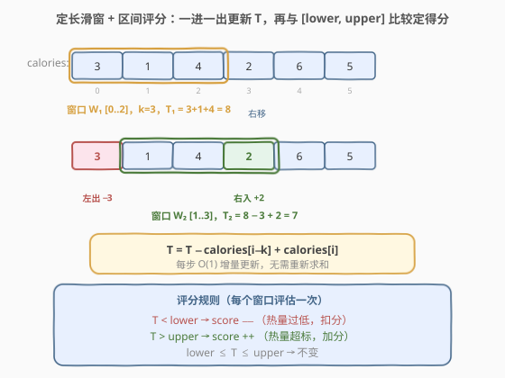
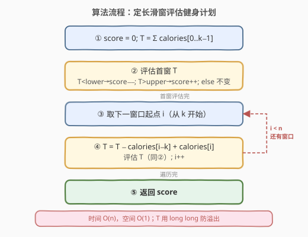
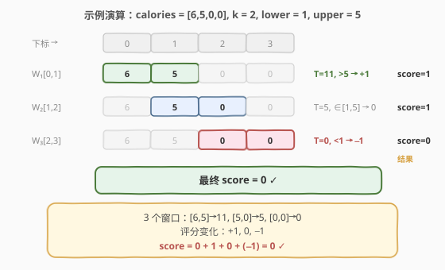

# 健身计划评估

- **题目名称**：健身计划评估
- **链接**：[1176. 健身计划评估](https://leetcode.cn/problems/diet-plan-performance/)
- **难度**：简单
- **标签**：数组、滑动窗口

## 1. 题目概述

健身爱好者每天记录摄入的卡路里，数组 `calories[i]` 表示第 `i+1` 天的卡路里摄入量。给定窗口长度 `k`，对每段**连续 $k$ 天**的卡路里总和 $T$ 进行评估：

- 若 $T < \text{lower}$，说明热量摄入**过低**，扣 1 分（`score −−`）；
- 若 $T > \text{upper}$，说明热量摄入**超标**，加 1 分（`score ++`）；
- 若 $\text{lower} \leq T \leq \text{upper}$，分数不变。

返回评估完所有窗口后的**总得分**。

**示例 1**：

```text
输入：calories = [1,2,3,4,5], k = 1, lower = 3, upper = 3
输出：0
解释：
第 1 天 T=1 < 3 → −1
第 2 天 T=2 < 3 → −1
第 3 天 T=3 ∈ [3,3] → 不变
第 4 天 T=4 > 3 → +1
第 5 天 T=5 > 3 → +1
总分 = −1 −1 +0 +1 +1 = 0
```

**示例 2**：

```text
输入：calories = [3,2], k = 2, lower = 0, upper = 1
输出：1
解释：唯一窗口 [3,2]，T=5 > 1 → +1
```

**示例 3**：

```text
输入：calories = [6,5,0,0], k = 2, lower = 1, upper = 5
输出：0
解释：
窗口 [6,5]：T=11 > 5 → +1
窗口 [5,0]：T=5 ∈ [1,5] → 不变
窗口 [0,0]：T=0 < 1 → −1
总分 = +1 +0 −1 = 0
```

**约束条件**：

- $1 \leq k \leq \text{calories.length} \leq 10^5$
- $0 \leq \text{calories[i]} \leq 20000$
- $0 \leq \text{lower} \leq \text{upper}$

> 💡 **关键点**：窗口长度**固定**为 $k$，每段窗口只差首尾一个元素——这是定长滑动窗口的典型特征。此外每个窗口不是求最大/最小，而是与 `[lower, upper]` **比较定得分**，属于定长滑窗 + 区间评分的变体。

---

## 2. 解题思路

### 2.1 暴力思路

枚举每个长度为 $k$ 的窗口起点 $i$（$0 \leq i \leq n-k$），逐个累加 $k$ 个元素求和 $T$，再与 `lower`/`upper` 比较更新分数。每个窗口求和 $O(k)$，共 $n-k+1$ 个窗口，总时间 $O(n \cdot k)$。当 $n = 10^5$、$k = n/2$ 时约 $5 \times 10^9$ 次运算，必然超时。

### 2.2 核心观察：定长滑窗 + 区间评分



窗口长度固定为 $k$，相邻两个窗口仅差**首尾两个元素**：窗口从 $[i, i+k-1]$ 右移到 $[i+1, i+k]$ 时，只**移出** `calories[i]`、**移入** `calories[i+k]`，中间 $k-1$ 个元素完全不变。

因此无需重新求和，只需做**一次加一次减**的增量更新：

$$T_{\text{新}} = T_{\text{旧}} - \text{calories}[i-k] + \text{calories}[i]$$

每个窗口的更新代价从 $O(k)$ 降为 $O(1)$，总复杂度 $O(n)$。更新 $T$ 后，立即与 `[lower, upper]` 比较决定得分变化。

> 💡 **与 [643. 子数组最大平均数 I](../0601-0700/643_子数组最大平均数I.md) 的对比**：643 是定长滑窗求**最大和**（维护 `maxSum`），本题是定长滑窗做**区间评分**（每个窗口都与阈值比较并累加分数）。滑窗增量更新的机制完全相同，区别仅在于窗口和的「消费方式」不同。

### 2.3 算法流程图



维护变量：

- `T`：当前窗口内 $k$ 个元素之和；
- `score`：累计得分。

**步骤**：

1. 对首窗 `calories[0..k-1]` 求和，令 `T` = 该和（$O(k)$ 初始化）。
2. 评估首窗 `T`：`T < lower` 则 `score−−`，`T > upper` 则 `score++`。
3. 从 `i = k` 到 `n-1` 遍历：
   - `T += calories[i] - calories[i-k]`（一进一出增量更新）；
   - 评估 `T`（同步骤 2）。
4. 返回 `score`。

> ⚠️ **溢出提示**：$k$ 最大 $10^5$，`calories[i]` 最大 $20000$，窗口和 $T$ 可达 $2 \times 10^9$，接近 `int` 上界（$\approx 2.15 \times 10^9$）。C++ 中应使用 `long long` 存储 `T`，避免溢出。

### 2.4 示例演算

以 `calories = [6,5,0,0], k = 2, lower = 1, upper = 5` 为例：



| 窗口 | 元素 | 增量更新 | T | 比较 | 得分变化 | score |
|------|------|----------|------|------|----------|-------|
| [0..1] | 6, 5 | 首窗求和 | 11 | $11 > 5$ | +1 | 1 |
| [1..2] | 5, 0 | $−6 + 0$ | 5 | $1 \leq 5 \leq 5$ | 0 | 1 |
| [2..3] | 0, 0 | $−5 + 0$ | 0 | $0 < 1$ | −1 | 0 |

最终 `score = 0`。

---

## 3. 参考代码

### C++

```cpp
class Solution {
  public:
    int dietPlanPerformance(vector<int>& calories, int k, int lower, int upper) {
        int n = calories.size();
        long long T = 0;
        for (int i = 0; i < k; ++i) T += calories[i];   // 首窗求和
        int score = 0;
        if (T < lower) --score;                          // 评估首窗
        else if (T > upper) ++score;
        for (int i = k; i < n; ++i) {
            T += calories[i] - calories[i - k];          // 一进一出增量更新
            if (T < lower) --score;
            else if (T > upper) ++score;
        }
        return score;
    }
};
```

### Python

```python
class Solution:
    def dietPlanPerformance(self, calories: List[int], k: int, lower: int, upper: int) -> int:
        T = sum(calories[:k])                     # 首窗求和
        score = 0
        if T < lower:                             # 评估首窗
            score -= 1
        elif T > upper:
            score += 1
        for i in range(k, len(calories)):
            T += calories[i] - calories[i - k]    # 一进一出增量更新
            if T < lower:
                score -= 1
            elif T > upper:
                score += 1
        return score
```

---

## 4. 复杂度分析

| 维度 | 复杂度 | 说明 |
|------|--------|------|
| 时间复杂度 | $O(n)$ | 首窗求和 $O(k)$ + 滑动 $n-k$ 步每步 $O(1)$，合计 $O(n)$ |
| 空间复杂度 | $O(1)$ | 仅用 `T`/`score` 两个变量，与输入规模无关 |

---

## 5. 扩展：统一单循环写法

上面的写法将「首窗评估」和「滑窗评估」分成两段，评估逻辑写了两遍。可以用**单循环**统一处理：右端入窗后再判断是否需要左端出窗，窗口凑满 $k$ 个时才评估。

```cpp
int dietPlanPerformance(vector<int>& calories, int k, int lower, int upper) {
    long long T = 0;
    int score = 0;
    for (int i = 0; i < (int)calories.size(); ++i) {
        T += calories[i];                    // 新元素入窗
        if (i >= k) T -= calories[i - k];    // 旧元素出窗
        if (i >= k - 1) {                    // 窗口凑满 k 个，开始评分
            if (T < lower) --score;
            else if (T > upper) ++score;
        }
    }
    return score;
}
```

> 💡 两种写法本质相同，单循环版避免了评估逻辑重复，但多了两个 `if` 条件判断。面试中写哪种都行，两段式更直观、单循环更紧凑。

---

## 6. 面试要点

1. **为什么用 `long long` 而不是 `int`？**
   - $k$ 最大 $10^5$，`calories[i]` 最大 $20000$，窗口和 $T$ 可达 $2 \times 10^9$，接近 `INT_MAX`（$\approx 2.15 \times 10^9$）。用 `long long` 留出安全余量，避免极端数据溢出。

2. **定长滑窗和变长滑窗的区别？**
   - 定长滑窗窗口大小恒为 $k$，每步固定「左出一个、右入一个」，无需 `while` 收缩；变长滑窗（如 209）窗口大小可变，需据条件判断扩缩方向。定长是变长的特例，更简单。

3. **增量更新为什么是 `calories[i] - calories[i-k]`？**
   - 窗口长度为 $k$，从 `[i-k, i-1]` 滑到 `[i-k+1, i]`，移出的是左端 `calories[i-k]`，移入的是右端 `calories[i]`，二者相距 $k$ 格而非相邻。

4. **如果 $k = n$（窗口覆盖整个数组）会怎样？**
   - 只有首窗一个窗口，循环不执行（`i = k = n`，`i < n` 为假）。首窗求和后评估一次即返回，复杂度仍 $O(n)$。

5. **本题与 643 的核心差异是什么？**
   - 滑窗机制完全相同（一进一出增量更新 $T$）。区别在于「消费」窗口和的方式：643 取所有窗口和的**最大值**，本题对每个窗口和做**区间评分**并**累加**。模板可复用，只需替换窗口和的处理逻辑。

---

## 7. 同类练习题

- [643. 子数组最大平均数 I](https://leetcode.cn/problems/maximum-average-subarray-i/)（[题解](../0601-0700/643_子数组最大平均数I.md)）：同为定长 $k$ 滑窗，但取窗口和最大值而非区间评分，对比「消费」窗口和的不同方式
- [1343. 大小为 K 且平均值大于等于阈值的子数组数目](https://leetcode.cn/problems/number-of-sub-arrays-of-size-k-and-average-greater-than-or-equal-to-threshold/)：定长 $k$ 滑窗 + 阈值比较计数，与本题几乎同构（计数 vs 评分）
- [209. 长度最小的子数组](https://leetcode.cn/problems/minimum-size-subarray-sum/)（[题解](../0201-0300/209_长度最小的子数组.md)）：变长滑窗模板，对比定长 vs 变长的指针移动逻辑
- [239. 滑动窗口最大值](https://leetcode.cn/problems/sliding-window-maximum/)（[题解](../0201-0300/239_滑动窗口最大值.md)）：同为定长 $k$ 滑窗，但求窗口内最大值而非和，需单调队列
- [346. 数据流中的移动平均值](https://leetcode.cn/problems/moving-average-from-data-stream/)：定长滑窗的数据流版本，一模一样的「一进一出」增量更新思路
