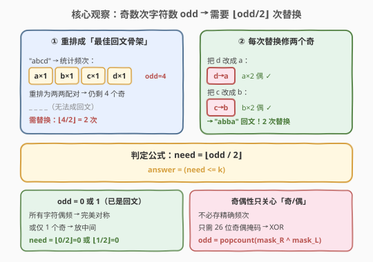
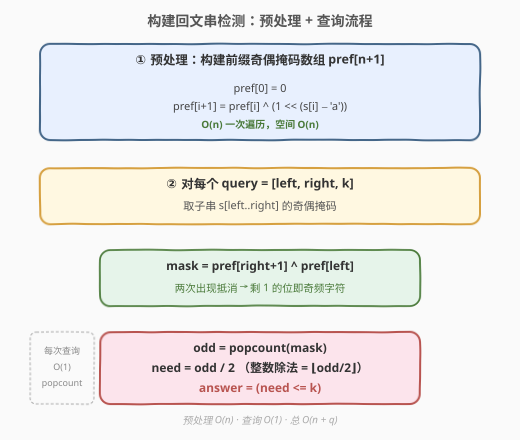
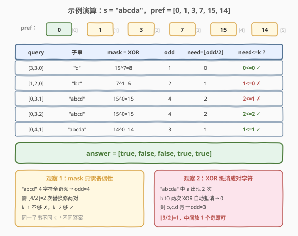

# 构建回文串检测

- **题目名称**：构建回文串检测
- **链接**：[1177. 构建回文串检测](https://leetcode.cn/problems/can-make-palindrome-from-substring/)
- **难度**：中等
- **标签**：位运算、数组、前缀和、哈希表

## 1. 题目概述

给定字符串 `s` 和若干查询 `queries[i] = [left, right, k]`。对每个查询，取出子串 `s[left..right]`，可以**重新排列**该子串，并**最多替换** `k` 个字符为任意小写字母，判断能否变成回文串。返回布尔数组 `answer`。

**示例 1**：

```text
输入：s = "abcda", queries = [[3,3,0],[1,2,0],[0,3,1],[0,3,2],[0,4,1]]
输出：[true,false,false,true,true]

解释：
queries[0] : 子串 = "d"，单个字符天然回文。
queries[1] : 子串 = "bc"，两个不同字符，k=0 替换不了，变不成回文。
queries[2] : 子串 = "abcd"，4 个字符全奇频，需 2 次替换，k=1 不够。
queries[3] : 子串 = "abcd"，k=2 够，可变 "abba"。
queries[4] : 子串 = "abcda"，a 出现两次抵消，剩 b,c,d 三个奇频，
             ⌊3/2⌋=1 次替换即可，k=1 够，可变 "abcba"。
```

**约束条件**：

- $1 \le \text{s.length}, \text{queries.length} \le 10^5$
- $0 \le \text{queries[i][0]} \le \text{queries[i][1]} < \text{s.length}$
- $0 \le \text{queries[i][2]} \le \text{s.length}$
- `s` 中只有小写英文字母

> 💡 注意「重新排列」是**免费**的——子串顺序可任意打乱；「替换」才消耗 `k` 的额度。所以问题本质是：**子串各字符频次的奇偶性，决定了最少需要多少次替换**。排列顺序不影响奇偶性，只关心每个字符出现次数是奇还是偶。

---

## 2. 解题思路

### 2.1 暴力思路：每次查询线性统计频次

最直觉的做法：对每个查询 `[left, right, k]`，遍历 `s[left..right]` 用长度 26 的数组统计每个字符出现次数，数出奇频字符个数 `odd`，再判断 $\lfloor \text{odd}/2 \rfloor \le k$。

| 步骤 | 复杂度 | 说明 |
|------|--------|------|
| 单次查询 | $O(n)$ | 线性扫描子串统计频次 |
| 总时间 | $O(q \cdot n)$ | $q$ 次查询，最坏 $10^5 \times 10^5 = 10^{10}$，超时 |

子串长度与查询次数都可达 $10^5$，暴力必然超时。瓶颈在于「每次查询都重新统计整个子串的频次」——这些频次信息本可**预处理复用**。

### 2.2 核心观察：奇偶性 + 前缀异或掩码



**关键观察 1：回文只取决于频次的奇偶性**

一个字符串能重排成回文串，当且仅当**至多一个字符出现奇数次**（奇频字符放中间，其余对称配对）。若有 `odd` 个奇频字符，重排后仍会剩 `odd` 个无法配对的奇频字符。每次**替换一个字符**，可以把它改成另一个奇频字符，使两者都变偶频——即**一次替换消除两个奇频字符**。因此最少替换次数为：

$$\text{need} = \left\lfloor \frac{\text{odd}}{2} \right\rfloor$$

判定条件：$\text{need} \le k$。注意 `odd=0`（全偶频）或 `odd=1`（一个奇频放中间）时 `need=0`，无需任何替换。

**关键观察 2：奇偶性可用异或前缀 $O(1)$ 求区间值**

我们不需要精确频次，只需每个字符的频次**奇偶性**。用 26 位掩码表示：第 $c$ 位为 1 表示字符 $c$ 出现奇数次，0 表示偶数次。定义前缀掩码：

$$\text{pref}[i] = \text{s}[0..i-1] \text{ 中各字符奇偶性的 26 位掩码}$$

则子串 `s[left..right]` 的奇偶掩码为：

$$\text{mask} = \text{pref}[\text{right}+1] \oplus \text{pref}[\text{left}]$$

因为同一个字符在 `[0, left-1]` 和 `[0, right]` 两段中累计出现次数相减时，偶数差不变奇偶、奇数差翻转奇偶——而**异或正好实现「相同抵消、相异保留」**：在 `pref[left]` 中已计入的前缀部分与 `pref[right+1]` 做异或，前缀中偶数次出现的字符位异或为 0（抵消），奇数次出现的保留为 1。

![前缀奇偶掩码：pref[i] = s[0..i-1] 各字符奇偶性的 26 位掩码](../images/palindrome_check_prefix.svg)

> 💡 **为何异或能抵消成对字符？** 字符 $c$ 若在子串内出现偶数次，它在 `pref[right+1]` 与 `pref[left]` 中的奇偶性相同（都翻转偶数次），异或为 0；若出现奇数次，两者奇偶性相反，异或为 1。这正是「前缀和求区间和」的位运算对偶版——加法换成异或，求和换成 popcount。

### 2.3 算法流程图



**完整步骤**：

1. **预处理**：构造 `pref[n+1]`，`pref[0] = 0`，遍历 `s` 递推 `pref[i+1] = pref[i] ^ (1 << (s[i] - 'a'))`。时间 $O(n)$，空间 $O(n)$。
2. **查询** `[left, right, k]`：
   - `mask = pref[right+1] ^ pref[left]`
   - `odd = popcount(mask)`（掩码中 1 的个数）
   - `need = odd / 2`（整数除法即 $\lfloor \text{odd}/2 \rfloor$）
   - `answer = (need <= k)`
3. 每次查询 $O(1)$（`popcount` 为 CPU 单指令或位运算常数次）。

### 2.4 示例演算

以 `s = "abcda"` 为例，预处理得到前缀掩码：

| `i` | `s[i]` | 计算 | `pref[i+1]` | 含义（1=奇频） |
|-----|--------|------|------------|----------------|
| — | — | `pref[0]` | `0` | 空 |
| 0 | `a` | `0 ^ (1<<0)` | `1` | a 奇 |
| 1 | `b` | `1 ^ (1<<1)` | `3` | a,b 奇 |
| 2 | `c` | `3 ^ (1<<2)` | `7` | a,b,c 奇 |
| 3 | `d` | `7 ^ (1<<3)` | `15` | a,b,c,d 奇 |
| 4 | `a` | `15 ^ (1<<0)` | `14` | a 偶（抵消），b,c,d 奇 |



逐查询验证：

| query | 子串 | `mask = XOR` | `odd` | `need=⌊odd/2⌋` | `need<=k` | 结果 |
|-------|------|-------------|-------|----------------|-----------|------|
| `[3,3,0]` | `"d"` | `pref[4]^pref[3]=15^7=8` | 1 | 0 | `0<=0` ✓ | **true** |
| `[1,2,0]` | `"bc"` | `pref[3]^pref[1]=7^1=6` | 2 | 1 | `1<=0` ✗ | **false** |
| `[0,3,1]` | `"abcd"` | `pref[4]^pref[0]=15^0=15` | 4 | 2 | `2<=1` ✗ | **false** |
| `[0,3,2]` | `"abcd"` | `15^0=15` | 4 | 2 | `2<=2` ✓ | **true** |
| `[0,4,1]` | `"abcda"` | `pref[5]^pref[0]=14^0=14` | 3 | 1 | `1<=1` ✓ | **true** |

> 💡 **`[0,4,1]` 的关键**：子串 `"abcda"` 中 `a` 出现 2 次（偶），XOR 抵消后 bit0 归 0，只剩 `b,c,d` 三个奇频字符，`odd=3`，`need=⌊3/2⌋=1`。奇频字符个数为奇数时，多出的那一个直接放回文中心，无需替换——这正是「`odd=1` 时 `need=0`」的体现。

---

## 3. 参考代码

### C++

```cpp
class Solution {
public:
    vector<bool> canMakePaliQueries(string s, vector<vector<int>>& queries) {
        int n = s.size();
        vector<int> pref(n + 1, 0);              // pref[i] = s[0..i-1] 奇偶掩码
        for (int i = 0; i < n; ++i) {
            pref[i + 1] = pref[i] ^ (1 << (s[i] - 'a'));
        }
        vector<bool> ans;
        ans.reserve(queries.size());
        for (auto& q : queries) {
            int mask = pref[q[1] + 1] ^ pref[q[0]];   // 子串奇偶掩码
            int odd  = __builtin_popcount(mask);      // 奇频字符个数
            int need = odd / 2;                        // 每次替换修两个奇
            ans.push_back(need <= q[2]);
        }
        return ans;
    }
};
```

### Python

```python
class Solution:
    def canMakePaliQueries(self, s: str, queries: List[List[int]]) -> List[bool]:
        pref = [0] * (len(s) + 1)
        for i, ch in enumerate(s):
            pref[i + 1] = pref[i] ^ (1 << (ord(ch) - 97))

        ans = []
        for left, right, k in queries:
            mask = pref[right + 1] ^ pref[left]
            odd = mask.bit_count()          # Python 3.10+，等价于 bin(mask).count('1')
            ans.append(odd // 2 <= k)
        return ans
```

> 💡 **写法要点**：① 掩码用 `int` 即可容纳 26 位，无需 `long long`。② C++ 用 `__builtin_popcount`、Python 3.10+ 用 `int.bit_count()`，均为 O(1) 硬件指令；低版本 Python 用 `bin(mask).count('1')`。③ `need = odd / 2` 用整数除法天然实现 $\lfloor \text{odd}/2 \rfloor$，无需额外处理。④ `pref` 数组长度 `n+1`，`pref[0]=0` 是哨兵，保证 `left=0` 时 `pref[0]` 合法。

---

## 4. 复杂度分析

| 维度 | 复杂度 | 说明 |
|------|--------|------|
| 预处理时间 | $O(n)$ | 一次遍历递推前缀掩码 |
| 预处理空间 | $O(n)$ | `pref` 数组长度 `n+1` |
| 单次查询时间 | $O(1)$ | 一次异或 + 一次 popcount + 一次比较 |
| 总时间 | $O(n + q)$ | 预处理 $n$ + $q$ 次查询 |
| 总空间 | $O(n + q)$ | `pref` 数组 + 答案数组 |

其中 $n, q \le 10^5$，总操作约 $2 \times 10^5$ 次常数运算，远在时限内。对比暴力的 $O(q \cdot n) = 10^{10}$，优化了 $5$ 个数量级——核心在于把「逐查询线性统计」变成「预处理一次 + 查询 $O(1)$」。

---

## 5. 扩展：二维前缀频次数组（不用位运算的等价解法）

若字符集更大（如 Unicode），26 位掩码装不下，可改用**二维前缀频次数组**：`pref[i][c]` 表示 `s[0..i-1]` 中字符 `c` 的出现次数。查询时 `cnt[c] = pref[right+1][c] - pref[left][c]`，再数奇频个数。

| 维度 | 位运算掩码 | 二维频次数组 |
|------|-----------|-------------|
| 字符集 | 仅 26 小写字母 | 任意字符集 |
| 预处理空间 | $O(n)$ | $O(n \cdot |\Sigma|)$ |
| 单次查询 | $O(1)$ | $O(\|\Sigma\|)$（遍历 26 个字符） |
| 实现复杂度 | 异或 + popcount | 减法 + 逐字符判奇偶 |

本题字符集仅 26，位运算掩码在空间和查询时间上都更优，是首选。二维频次数组思路更通用，适合字符集较大但查询次数较少的场景。

### C++

```cpp
// 二维频次前缀（仅作对照，本题推荐位运算版）
class Solution {
public:
    vector<bool> canMakePaliQueries(string s, vector<vector<int>>& queries) {
        int n = s.size();
        vector<array<int, 26>> pref(n + 1);     // pref[i][c] = s[0..i-1] 中 c 的次数
        pref[0].fill(0);
        for (int i = 0; i < n; ++i) {
            pref[i + 1] = pref[i];
            pref[i + 1][s[i] - 'a']++;
        }
        vector<bool> ans;
        ans.reserve(queries.size());
        for (auto& q : queries) {
            int odd = 0;
            for (int c = 0; c < 26; ++c) {
                if ((pref[q[1] + 1][c] - pref[q[0]][c]) % 2) odd++;
            }
            ans.push_back(odd / 2 <= q[2]);
        }
        return ans;
    }
};
```

> 💡 两种解法的判定逻辑完全一致：都是求子串奇频字符数 `odd`，再判断 $\lfloor \text{odd}/2 \rfloor \le k$。区别只在「如何高效获取 `odd`」——位运算用异或把 26 维频次压缩成一个整数的 26 位，查询 $O(1)$；二维数组则显式存频次、查询 $O(26)$。

---

## 6. 面试要点

1. **为什么最少替换次数是 $\lfloor \text{odd}/2 \rfloor$ 而不是 `odd`？**

   > 每次替换可以消除**两个**奇频字符：把其中一个改成另一个，两者都变偶频。所以 `odd` 个奇频字符两两配对，需 $\lfloor \text{odd}/2 \rfloor$ 次。若 `odd` 为奇数，多出的一个放回文中心，无需替换——这正是奇数时除以 2 向下取整为 $(\text{odd}-1)/2$ 的体现。

2. **为什么用异或而不是减法求区间奇偶性？**

   > 前缀和用减法求区间和，但奇偶性不是「数值之差」而是「翻转次数之差」的奇偶。异或正是「相同抵消、相异保留」的运算：字符在前缀中出现偶数次则两掩码该位相同（异或为 0），奇数次则相反（异或为 1）。用异或天然实现「前缀之差」的奇偶语义，且无需处理负数。

3. **掩码只有 26 位，为什么够用？为什么 `int` 而非 `long long`？**

   > 题目限定 `s` 只有 26 个小写字母，每个字母占 1 位，26 位掩码用 `int`（通常 32 位）完全容纳。`pref[i+1] = pref[i] ^ (1 << (s[i]-'a'))`，位运算在 `int` 上直接可做，无需更宽类型。

4. **如果允许替换为任意字符（含非小写字母），结论会变吗？**

   > 不会。替换的目标是「消除奇频字符」，把一个奇频字符改成另一个奇频字符即可让两者偶频，目标字符仍在小写字母集内。即使允许更广字符集，最优策略仍是把奇频字符两两配对消除，`need = ⌊odd/2⌋` 不变。

5. **暴力 $O(qn)$ 会超时吗？本题的优化本质是什么？**

   > $n, q \le 10^5$，$O(qn) = 10^{10}$ 必超时。优化本质是**前缀预处理把区间频次查询从 $O(n)$ 降到 $O(1)$**——这是「前缀和思想」的位运算变体：用异或前缀替代加法前缀，用 popcount 替代求和，把 26 维频次压缩成一个整数的位。

> 💡 **一句话总结**：1177 是「前缀和 + 位运算」的组合招牌题——把子串各字符奇偶性用 26 位前缀掩码压缩，查询时一次异或取区间掩码、一次 popcount 数奇频字符，$\lfloor \text{odd}/2 \rfloor \le k$ 即为答案。核心洞察是「回文只看奇偶性」与「异或天然求区间奇偶」。

---

## 7. 同类练习题

- [303. 区域和检索 - 数组不可变](https://leetcode.cn/problems/range-sum-query-immutable/)（[题解](../0301-0400/303_区域和检索 - 数组不可变.md)）：一维前缀和母题，本题把「加法前缀 + 区间减」换成「异或前缀 + 区间异或」，思想同源
- [304. 二维区域和检索 - 数组不可变](https://leetcode.cn/problems/range-sum-query-2d-immutable/)（[题解](../0301-0400/304_二维区域和检索 - 数组不可变.md)）：二维前缀和 + 容斥，对照本题多维频次压缩为位掩码的思路
- [191. 位 1 的个数](https://leetcode.cn/problems/number-of-1-bits/)（[题解](../0001-0100/191_位1的个数.md)）：`popcount` 母题，本题查询的核心一步即数掩码中 1 的个数
- [1310. 子数组异或查询](https://leetcode.cn/problems/xor-queries-of-a-subarray/)：前缀异或求子数组异或，与本题「前缀异或取区间」完全同构，只是不涉及回文判定
- [1371. 每个元音包含偶数次的最长子字符串](https://leetcode.cn/problems/find-the-longest-substring-containing-vowels-in-even-counts/)：与本题同用「前缀异或掩码 + 奇偶性」核心套路，求最长子串而非逐查询判定，方向互补
