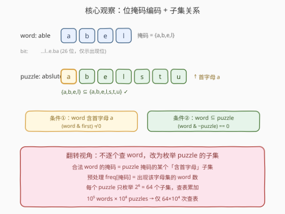
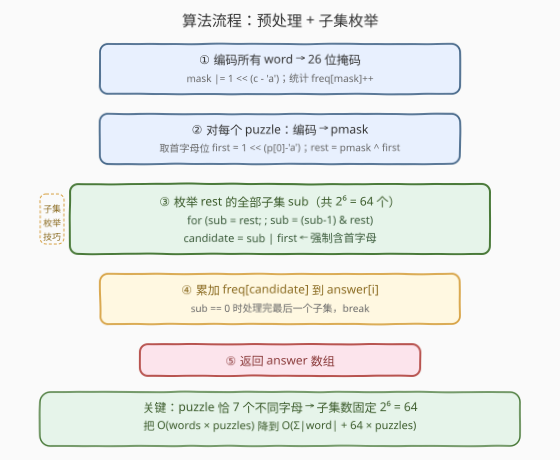
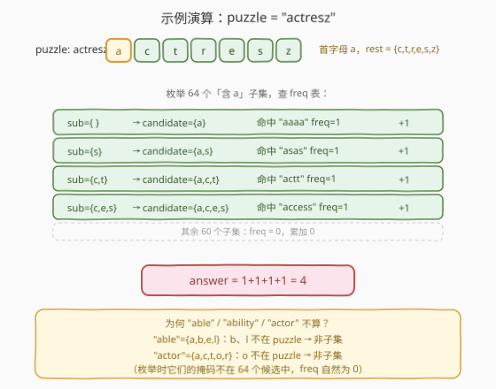

# LeetCode 猜字谜 题解

## 1. 题目概述

- **标题 / 题号**：猜字谜（#1178，hard）
- **链接**：https://leetcode.cn/problems/number-of-valid-words-for-each-puzzle/
- **难度**：困难
- **标签**：位运算、哈希表、状态压缩

**题意**：外国友人仿照中国字谜设计了一个英文版猜字谜小游戏。字谜的迷面 `puzzle` 按字符串给出，如果一个单词 `word` 符合下面**两个条件**，那么它就可以算作谜底：

1. 单词 `word` 中包含谜面 `puzzle` 的**第一个字母**。
2. 单词 `word` 中的**每一个字母**都可以在谜面 `puzzle` 中找到（即 `word` 的字母集 $\subseteq$ `puzzle` 的字母集）。

返回答案数组 `answer`，其中 `answer[i]` 是 `words` 中可以作为 `puzzles[i]` 谜底的单词数目。

**示例**：

```text
输入：
words = ["aaaa","asas","able","ability","actt","actor","access"],
puzzles = ["aboveyz","abrodyz","abslute","absoryz","actresz","gaswxyz"]
输出：[1,1,3,2,4,0]
解释：
1 个单词可以作为 "aboveyz" 的谜底 : "aaaa"
1 个单词可以作为 "abrodyz" 的谜底 : "aaaa"
3 个单词可以作为 "abslute" 的谜底 : "aaaa", "asas", "able"
2 个单词可以作为 "absoryz" 的谜底 : "aaaa", "asas"
4 个单词可以作为 "actresz" 的谜底 : "aaaa", "asas", "actt", "access"
没有单词可以作为 "gaswxyz" 的谜底，因为列表中的单词都不含字母 'g'。
```

**约束**：

- $1 \le \text{words.length} \le 10^5$
- $4 \le \text{words[i].length} \le 50$
- $1 \le \text{puzzles.length} \le 10^4$
- `puzzles[i].length == 7`，且每个 `puzzles[i]` 所包含的字符**都不重复**
- `words[i][j]`、`puzzles[i][j]` 都是小写英文字母

> 💡 两个关键约束决定了最优解法：① 字母只有 26 个 → 一个单词/谜面的**字母集**可用一个 26 位整数唯一编码；② 每个 puzzle **恰好 7 个不同字母** → 其含首字母的子集数固定为 $2^6 = 64$。把「逐个 word 检查是否合法」翻转成「枚举 puzzle 的 64 个子集去查词频表」，是本题的核心转化。

## 2. 解题思路

### 2.1 暴力思路：逐 puzzle × 逐 word 检查

最直觉的做法：对每个 puzzle，遍历所有 word，检查是否同时满足两个条件：

- `word` 含 `puzzle[0]`；
- `word` 的每个字母都在 `puzzle` 中（字母集子集关系）。

复杂度 $O(P \cdot W \cdot L)$，其中 $P = 10^4$、$W = 10^5$、$L \le 50$，总量约 $5 \times 10^{10}$，**必然超时**。

> ⚠️ 暴力的瓶颈在于「以 word 为主体」遍历——对每个 puzzle 都要把 $10^5$ 个 word 扫一遍。但合法 word 的字母集必然是 puzzle 字母集的**子集**，而 puzzle 字母集的子集数极少（仅 $2^7=128$ 个）。这提示我们**翻转枚举主体**：不再遍历 word，而是枚举 puzzle 的子集。

### 2.2 核心观察：位掩码编码 + 子集枚举



三个关键点：

1. **位掩码编码**：小写字母仅 26 个，用一个 26 位整数即可唯一表示任意单词/谜面的**字母集**——第 $i$ 位为 1 表示存在字母 `chr('a'+i)`。例如 `"able"` 的掩码 $= \text{\{a,b,e,l\}}$。重复字母不影响掩码（`"aaaa"` 与 `"a"` 掩码相同），天然去重。

2. **两个条件的位运算表达**：
   - 条件①「含首字母」$\Leftrightarrow$ `(word_mask & first) != 0`，其中 `first = 1 << (puzzle[0]-'a')`；
   - 条件②「字母集子集」$\Leftrightarrow$ `(word_mask & ~puzzle_mask) == 0`，即 word 的所有 1 位都落在 puzzle 的 1 位上。

3. **翻转枚举主体**：合法 word 的掩码必然是 `puzzle_mask` 的某个**含首字母**的子集。预处理词频表 `freq[mask]` = 出现该字母集的 word 数，则对每个 puzzle 只需枚举其「含首字母」的全部子集 $s$，累加 `freq[s]`。由于 puzzle 恰 7 个不同字母，去掉固定的首字母后剩 6 位，含首字母的子集数 $= 2^6 = 64$。

> ⚠️ **三个易错点**：
> - **首字母必须单独处理**：不能枚举 `puzzle_mask` 的所有 $2^7=128$ 子集再过滤，那样虽对但多做一倍工作；正确做法是**先剥离首字母位** `rest = puzzle_mask ^ first`，枚举 `rest` 的 $2^6=64$ 个子集 `sub`，再 `candidate = sub | first` 强制含首字母。
> - **子集枚举的终止**：标准 `sub = (sub - 1) & rest` 循环会从 `rest` 一路降到 `0`，**`0` 也是一个有效子集**（对应 word 字母集恰为 `{首字母}`）。循环必须在处理完 `sub == 0` 后才 `break`，否则会漏掉「word 只含首字母」的情况（示例中 `"aaaa"` 正是此类）。
> - **puzzle 字母不重复是前提**：题目保证每个 `puzzles[i]` 字符不重复，所以 `puzzle_mask` 恰有 7 个 1 位、`rest` 恰有 6 个 1 位、子集数恰为 64。若 puzzle 可含重复字母，掩码编码仍正确（重复位合并），但子集数需按去重后的位数计算。

### 2.3 算法流程图



**完整步骤**：

1. **预处理词频**：遍历所有 `word`，计算其 26 位掩码，用哈希表 `freq` 统计每个掩码出现的次数。
2. **逐 puzzle 处理**：对每个 `puzzle`：
   - 计算 `puzzle_mask`（7 个 1 位）；
   - 取首字母位 `first`，剩余位 `rest = puzzle_mask ^ first`（6 个 1 位）；
   - 枚举 `rest` 的全部 $2^6 = 64$ 个子集 `sub`（含 `0`）；
   - 对每个 `sub`，查 `freq[sub | first]` 累加到 `answer[i]`。
3. **返回** `answer` 数组。

> 💡 **子集枚举技巧**（Gosper 风格）：`for (sub = rest; ; sub = (sub-1) & rest)`。`(sub - 1) & rest` 会按字典序递减地遍历 `rest` 的所有子集，最终落到 `0`。写成 `do/while` 或 `for + break` 都行，关键是 **`sub == 0` 那一轮也要查表**后再退出。

### 2.4 示例演算

以 `puzzles[4] = "actresz"` 为例，其字母集为 $\{a,c,t,r,e,s,z\}$，首字母 `a`，`rest = {c,t,r,e,s,z}`（6 位）。枚举 64 个「含 a」子集，命中 `freq` 表的有 4 个：



| 候选子集 candidate | 命中 word | freq | 累加 |
|--------------------|-----------|------|------|
| $\{a\}$ | "aaaa" | 1 | +1 |
| $\{a,s\}$ | "asas" | 1 | +1 |
| $\{a,c,t\}$ | "actt" | 1 | +1 |
| $\{a,c,e,s\}$ | "access" | 1 | +1 |
| 其余 60 个子集 | — | 0 | +0 |

`answer[4] = 4`，与示例一致。

而 `"able"`（$\{a,b,e,l\}$）的 `b`、`l` 不在 puzzle 中，`"actor"`（$\{a,c,t,o,r\}$）的 `o` 不在 puzzle 中——它们的掩码不在 64 个候选之列，`freq` 自然查不到，无需额外排除。

最后一个 puzzle `"gaswxyz"` 首字母为 `g`，而所有 word 都不含 `g`，任何含 `g` 的候选子集 `freq` 都为 0，`answer[5] = 0`。

## 3. 参考代码

### C++

```cpp
class Solution {
public:
    vector<int> findNumOfValidWords(vector<string>& words, vector<string>& puzzles) {
        unordered_map<int, int> freq;
        for (const string& w : words) {
            int mask = 0;
            for (char c : w) mask |= (1 << (c - 'a'));
            freq[mask]++;
        }

        vector<int> ans;
        ans.reserve(puzzles.size());
        for (const string& p : puzzles) {
            int pmask = 0;
            for (char c : p) pmask |= (1 << (c - 'a'));
            int first = 1 << (p[0] - 'a');
            int rest = pmask ^ first;

            int cnt = 0;
            for (int sub = rest; ; sub = (sub - 1) & rest) {
                auto it = freq.find(sub | first);
                if (it != freq.end()) cnt += it->second;
                if (sub == 0) break;
            }
            ans.push_back(cnt);
        }
        return ans;
    }
};
```

> 💡 **写法要点**：① 预处理只存 `freq[mask]`，不存 word 原文——后续只按掩码查计数；② `rest = pmask ^ first` 剥离首字母位（等价于 `pmask & ~first`，但异或更简洁，前提是 `first` 必为 `pmask` 的子集，题目保证首字母在 puzzle 中）；③ 子集循环 `for (sub = rest; ; sub = (sub-1) & rest)` 必须**先查表再判 `sub==0` break**，确保 `sub=0`（word 恰为 `{首字母}`）这一轮不漏；④ 用 `freq.find` 避免对不存在的 key 插入空值，比 `freq[sub|first]` 直接取更安全（后者会在哈希表中插入大量 0 值条目，拖慢后续 puzzle 的查询）。

### Python

```python
class Solution:
    def findNumOfValidWords(self, words: List[str], puzzles: List[str]) -> List[int]:
        from collections import Counter

        freq = Counter()
        for w in words:
            mask = 0
            for c in w:
                mask |= 1 << (ord(c) - 97)
            freq[mask] += 1

        ans = []
        for p in puzzles:
            pmask = 0
            for c in p:
                pmask |= 1 << (ord(c) - 97)
            first = 1 << (ord(p[0]) - 97)
            rest = pmask ^ first

            cnt = 0
            sub = rest
            while True:
                cnt += freq[sub | first]
                if sub == 0:
                    break
                sub = (sub - 1) & rest
            ans.append(cnt)
        return ans
```

> 💡 **写法要点**：① `Counter` 对不存在的 key 返回 0，所以可直接 `cnt += freq[sub | first]`，无需像 C++ 那样 `find`；② 逻辑与 C++ 完全一致——`rest = pmask ^ first` 剥首字母，枚举 64 个子集强制拼回 `first`；③ Python 的整数无限位，掩码不会溢出，但 26 位运算量与 C++ 相同。

## 4. 复杂度分析

设 $W = \text{words.length}$，$P = \text{puzzles.length}$，$L_w$ 为 word 平均长度（$\le 50$），$L_p = 7$ 为 puzzle 长度。

| 维度 | 复杂度 | 说明 |
|------|--------|------|
| **时间** | $O\big(\sum L_w + P \cdot 2^{L_p - 1}\big) = O\big(\sum L_w + 64P\big)$ | 预处理遍历所有 word 字符；每个 puzzle 枚举 $2^6 = 64$ 个子集查表 |
| **空间** | $O\big(\min(W, 2^{26})\big)$ | `freq` 哈希表存不同掩码的计数，最多 $\min(W, 2^{26})$ 条 |

> - 预处理：$W \le 10^5$，$L_w \le 50$，$\sum L_w \le 5 \times 10^6$；
> - 查询：$P \le 10^4$，$64P = 6.4 \times 10^5$；
> - 总时间约 $5.6 \times 10^6$ 量级，远在时限内。对比暴力的 $5 \times 10^{10}$，加速约 $10^4$ 倍。
> - `freq` 表条目数上界为 $2^{26}$（所有可能字母集），但实际受 $W \le 10^5$ 限制，哈希表规模可控。

## 5. 扩展：直接枚举全部子集的对照写法

上面是「剥离首字母、枚举 `rest` 的 $2^6$ 子集」的最优写法。还有一种**逻辑等价但多做一倍工作**的对照写法：枚举 `pmask` 的全部 $2^7 = 128$ 个子集，过滤出含首字母的：

```cpp
for (int sub = pmask; ; sub = (sub - 1) & pmask) {
    if (sub & first) cnt += freq[sub];   // 只统计含首字母的子集
    if (sub == 0) break;
}
```

两者结果完全相同——「枚举 128 个、过滤一半」与「枚举 64 个、不过滤」覆盖的子集集合一致。前者每次 puzzle 多 64 次查表与一次 `&` 判断，常数翻倍但渐进复杂度不变（$128P = 1.28 \times 10^6$ 仍很小）。面试中写哪种都行，**剥离首字母的版本更能体现对「$2^6$ 固定」的洞察**。

> ⚠️ 若 puzzle 字母可能重复（本题不会），`pmask` 的 1 位数 $< 7$，子集数 $< 128$，两种写法仍正确，但「剥离首字母」版本的 `rest` 1 位数也相应减少，子集数按去重后位数计算。

## 6. 面试要点

1. **为什么暴力 $O(P \cdot W)$ 会超时，而枚举子集 $O(64P)$ 不会？**

   > 暴力以 word 为主体，每个 puzzle 都要扫全部 $10^5$ 个 word，总量 $10^9 \sim 10^{10}$。枚举子集以 puzzle 的字母集子集为主体——合法 word 的掩码必是 puzzle 掩码的子集，而 puzzle 恰 7 个不同字母，含首字母的子集仅 $2^6 = 64$ 个。预处理 `freq` 表后，每个 puzzle 只查 64 次，总量 $6.4 \times 10^5$。**关键是抓住了「puzzle 长度固定为 7」这个约束把指数从 word 数转移到了字母集大小上。**

2. **为什么用 26 位掩码而不是 26 元素的集合？子集关系如何用位运算判断？**

   > 26 位整数恰好唯一编码字母集：第 $i$ 位为 1 表示含 `chr('a'+i)`，重复字母自然合并。子集关系 `A ⊆ B` 等价于 `A` 的所有 1 位都在 `B` 的 1 位中，即 `(A & ~B) == 0`（A 在 B 之外的位全为 0），也等价于 `(A & B) == A`。位运算 $O(1)$ 判定，比逐字母查集合快得多。

3. **子集枚举 `sub = (sub-1) & rest` 的原理是什么？为什么 `sub == 0` 也要处理？**

   > `(sub - 1) & rest` 会把 `sub` 在 `rest` 限定下的二进制表示减 1：`sub - 1` 让最低位的 1 变 0、其后所有 0 变 1，再 `& rest` 把超出 `rest` 的位清零，从而按字典序递减遍历 `rest` 的全部子集，最终落到 `0`。`0` 对应「`rest` 的空子集」，拼上首字母后 `candidate = first`，代表 word 字母集恰为 `{首字母}`（如示例的 `"aaaa"`）。若 `sub == 0` 时不查表就 break，会漏掉这类 word。

4. **为什么要单独处理首字母，而不是枚举全部子集再过滤？**

   > 逻辑上「枚举 $2^7=128$ 个再过滤含首字母」与「剥离首字母枚举 $2^6=64$ 个」结果相同。但后者常数减半，且更直接体现「puzzle 长度固定 7 → 含首字母子集数固定 64」的洞察。剥离写法：`rest = pmask ^ first`，枚举 `rest` 的子集 `sub`，`candidate = sub | first` 强制含首字母。

5. **`freq` 用哈希表还是数组？空间上界是多少？**

   > 掩码是 26 位整数，理论取值 $2^{26} \approx 6.7 \times 10^7$。用数组需 $2^{26}$ 个 int（约 256MB），边界偏大；用哈希表则只有 $\min(W, 2^{26})$ 条目，$W \le 10^5$ 时远更省。本题用 `unordered_map`/`Counter` 最稳妥。若 $W$ 极大且掩码分布密集，可改用数组提升常数。

> 💡 **一句话总结**：1178 的钥匙是「**位掩码编码字母集 + 翻转枚举主体**」——预处理 `freq[掩码]`，对每个 puzzle 枚举其含首字母的 $2^6=64$ 个子集查表累加。把 $O(P \cdot W)$ 的暴力降为 $O(\sum L_w + 64P)$。三个易错点：① 首字母单独剥离；② `sub==0` 也要查表；③ 子集枚举用 `(sub-1) & rest` 递减。

## 同类练习题

| # | 题目 | 与本题的关联 |
|---|------|-------------|
| 187 | [重复的 DNA 序列](https://leetcode.cn/problems/repeated-dna-sequences/) | 用 2 位编码碱基 + 滚动哈希把 10-mer 压成 20 位整数，与本题「字母集压成 26 位掩码」共享位编码思想 |
| 318 | [最大单词长度乘积](https://leetcode.cn/problems/maximum-product-of-word-lengths/) | 用 26 位掩码表示单词字母集，两单词无公共字母 $\Leftrightarrow$ `(maskA & maskB) == 0`，承接本题的掩码子集/交集判定 |
| 78 | [子集](https://leetcode.cn/problems/subsets/) | 回溯枚举全部子集的母题，对照本题用 `(sub-1) & rest` 的位运算子集枚举技巧 |
| 421 | [数组中两个数的最大异或值](https://leetcode.cn/problems/maximum-xor-of-two-numbers-in-an-array/) | 按位贪心 + 哈希集合查候选，与本题「枚举候选掩码查 freq 表」同属位运算 + 哈希配合范式 |
| 137 | [只出现一次的数字 II](https://leetcode.cn/problems/single-number-ii/) | 按位统计状态机，与本题共享「26 位整数编码字符状态」的位压缩视角 |
