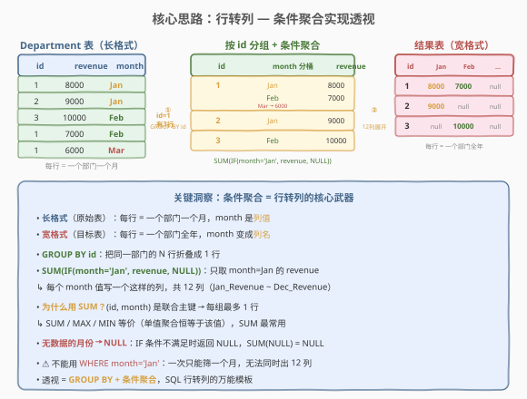
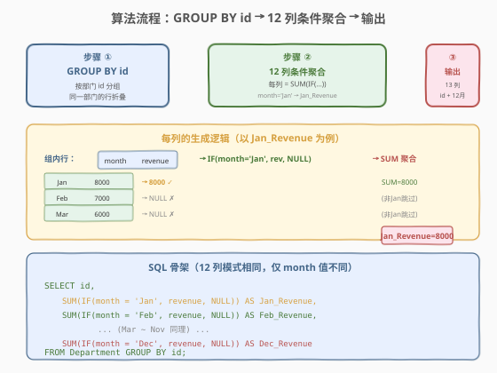
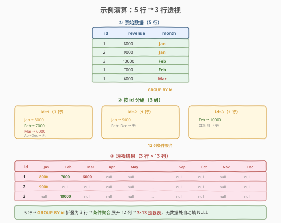

# LeetCode 重新格式化部门表 题解

## 1. 题目概述

- **标题 / 题号**：重新格式化部门表（#1179，easy）
- **链接**：https://leetcode.cn/problems/reformat-department-table/
- **难度**：简单
- **标签**：SQL、行转列、条件聚合、GROUP BY、SUM + IF/CASE

**题意**：给定 `Department` 表，记录每个部门每月的收入。编写 SQL 查询，将表格**重新格式化**为「透视表」——每个部门占一行，每个月份对应一个收入列。

**表结构**：

```text
Table: Department
+---------------+---------+
| Column Name   | Type    |
+---------------+---------+
| id            | int     |
| revenue       | int     |
| month         | varchar |
+---------------+---------+
```

> ⚠️ 在 SQL 中，`(id, month)` 是表的**联合主键**——这意味着同一个部门在同一个月最多只有一条记录。`month` 的取值为 `["Jan","Feb","Mar","Apr","May","Jun","Jul","Aug","Sep","Oct","Nov","Dec"]` 共 12 个月。

**示例 1**：

```text
输入：
Department 表
+------+---------+-------+
| id   | revenue | month |
+------+---------+-------+
| 1    | 8000    | Jan   |
| 2    | 9000    | Jan   |
| 3    | 10000   | Feb   |
| 1    | 7000    | Feb   |
| 1    | 6000    | Mar   |
+------+---------+-------+

输出：
+------+-------------+-------------+-------------+-----+-------------+
| id   | Jan_Revenue | Feb_Revenue | Mar_Revenue | ... | Dec_Revenue |
+------+-------------+-------------+-------------+-----+-------------+
| 1    | 8000        | 7000        | 6000        | ... | null        |
| 2    | 9000        | null        | null        | ... | null        |
| 3    | null        | 10000       | null        | ... | null        |
+------+-------------+-------------+-------------+-----+-------------+
```

**解释**：四月到十二月的收入为空（`null`）。结果表共 13 列（1 列 `id` + 12 列各月收入）。以任意顺序返回。

**约束**：

- `(id, month)` 为联合主键，每个部门每月最多一行
- `month` 取值固定为 12 个月份缩写
- 结果需包含 13 列：`id` + `Jan_Revenue` ~ `Dec_Revenue`
- 某部门某月无数据时，对应列为 `null`
- 以任意顺序返回结果

> 💡 本题是 SQL **"行转列（透视）"的最经典模板**——核心是 `GROUP BY id` 把同一部门的行折叠为一行，再用 12 个 `SUM(IF(month='XXX', revenue, NULL))` 把月份从行值展开为列。本质是**条件聚合**：对每个分组，按条件筛选出特定月份的 `revenue`，聚合后填入对应列。

## 2. 解题思路

### 2.1 暴力思路：逐月子查询拼接

最直观的想法是：对每个月份单独查一次，再把 12 个结果 JOIN 起来。例如查 1 月收入：

```sql
SELECT id, revenue AS Jan_Revenue
FROM Department
WHERE month = 'Jan'
```

然后把 12 个这样的查询用 `FULL OUTER JOIN`（或 MySQL 中的 `LEFT JOIN` 串联）拼成 13 列。

> ⚠️ 这种做法有两个致命问题：① 需要扫描全表 **12 次**，效率极差；② MySQL 不支持 `FULL OUTER JOIN`，需要用 `LEFT JOIN + UNION` 模拟，代码冗长且容易出错。正确做法是**一次扫描同时算出 12 列**——这就是条件聚合的用武之地。

### 2.2 核心观察：条件聚合实现行转列



这道题的本质是**把"长格式"表转成"宽格式"表**——month 从行值变成列名。SQL 行转列的标准武器是**条件聚合**：

1. **`GROUP BY id`**：按部门 id 分组，把同一部门的多行折叠成一行。示例中 id=1 有 3 行（Jan/Feb/Mar），折叠后变成一行。

2. **`SUM(IF(month='Jan', revenue, NULL)) AS Jan_Revenue`**：在分组内，对每一行做条件判断——如果 `month='Jan'` 则取 `revenue`，否则返回 `NULL`。`SUM` 聚合后只累加了 Jan 那一行的 revenue（其余行贡献 `NULL`，`SUM` 自动忽略 `NULL`），结果即该部门的 1 月收入。

3. **重复 12 次**：Jan 到 Dec 各写一列，列名分别为 `Jan_Revenue` ~ `Dec_Revenue`。

> 💡 **为什么用 `SUM` 而非 `MAX`/`MIN`？** 因为 `(id, month)` 是联合主键，每个 `(id, month)` 组合唯一——同一部门同一个月最多只有一行。所以分组内满足 `month='Jan'` 的行**至多一行**，`SUM` / `MAX` / `MIN` 对单值的聚合结果恒等于该值，三者完全等价。`SUM` 是最常见的行转列写法（通用性好，即使有重复行也能正确累加）。

> ⚠️ **不能用 `WHERE month='Jan'`**：`WHERE` 在 `GROUP BY` 之前执行，会过滤掉非 Jan 的行——一次只能查一个月，无法同时输出 12 列。条件聚合 `SUM(IF(...))` 的精妙之处在于**一次扫描同时计算 12 个条件**，`IF` 在分组内做行级筛选，`SUM` 做组级聚合，互不干扰。

### 2.3 算法流程图



**完整步骤**：

1. **`GROUP BY id`**：按部门 id 分组，同一部门的行归入一组
2. **12 列条件聚合**：对每个月份 `M`，计算 `SUM(IF(month='M', revenue, NULL)) AS M_Revenue`
   - 满足条件的行：返回 `revenue` 值，参与 `SUM`
   - 不满足的行：返回 `NULL`，`SUM` 忽略
   - 分组内无该月数据：所有行都返回 `NULL`，`SUM(NULL)` = `NULL`
3. **输出 13 列**：`id` + `Jan_Revenue` ~ `Dec_Revenue`，共 13 列

> 💡 **`SUM(NULL)` 的行为**：如果一个分组内没有任何行的 `month='Apr'`，那么所有行的 `IF` 都返回 `NULL`，`SUM(全部是NULL)` 的结果就是 `NULL`——恰好满足题目"无数据的月份显示 null"的要求。这是 `IF(..., ..., NULL)` 配合 `SUM` 的天然空值处理，无需额外 `IFNULL`。

### 2.4 示例演算

以示例 1 数据为例，观察行转列的完整过程：



**步骤 ①：原始数据（5 行）**

| id | revenue | month |
|----|---------|-------|
| 1 | 8000 | Jan |
| 2 | 9000 | Jan |
| 3 | 10000 | Feb |
| 1 | 7000 | Feb |
| 1 | 6000 | Mar |

**步骤 ②：`GROUP BY id` 形成 3 个分组**

| 分组 | 包含行 | 各月 revenue |
|------|--------|-------------|
| id=1 | 3 行 | Jan→8000, Feb→7000, Mar→6000, Apr~Dec→无 |
| id=2 | 1 行 | Jan→9000, Feb~Dec→无 |
| id=3 | 1 行 | Feb→10000, 其余月→无 |

**步骤 ③：对每个分组执行 12 列条件聚合**

以 `id=1` 分组为例，展示 `Jan_Revenue` 列的计算过程：

| 组内行 (month, revenue) | `IF(month='Jan', revenue, NULL)` | 参与 SUM？ |
|-------------------------|----------------------------------|-----------|
| (Jan, 8000) | 8000 | ✓ |
| (Feb, 7000) | NULL | ✗ (非 Jan) |
| (Mar, 6000) | NULL | ✗ (非 Jan) |

`SUM(8000, NULL, NULL)` = 8000 → `Jan_Revenue = 8000` ✓

同理，`Feb_Revenue` 列：`IF(month='Feb', revenue, NULL)` → (Jan→NULL, Feb→7000, Mar→NULL) → `SUM` = 7000。

`Apr_Revenue` 列：所有行都不满足 `month='Apr'` → 全 NULL → `SUM(NULL)` = `NULL`。

> 💡 **`id=2` 分组**只有 1 行（Jan, 9000）：`Jan_Revenue` = `SUM(9000)` = 9000；其余 11 列全为 `NULL`（分组内无对应月份的行）。**`id=3` 分组**只有 1 行（Feb, 10000）：`Feb_Revenue` = 10000，其余列 `NULL`。

**最终结果**：

| id | Jan_Revenue | Feb_Revenue | Mar_Revenue | Apr~Dec_Revenue |
|----|-------------|-------------|-------------|-----------------|
| 1 | 8000 | 7000 | 6000 | null |
| 2 | 9000 | null | null | null |
| 3 | null | 10000 | null | null |

5 行原始数据 → 折叠为 3 行 × 13 列的透视表，无数据的格子自动填 `NULL`。

## 3. 参考代码

### SQL（解法 A：SUM + IF，MySQL 推荐）

```sql
SELECT id,
       SUM(IF(month = 'Jan', revenue, NULL)) AS Jan_Revenue,
       SUM(IF(month = 'Feb', revenue, NULL)) AS Feb_Revenue,
       SUM(IF(month = 'Mar', revenue, NULL)) AS Mar_Revenue,
       SUM(IF(month = 'Apr', revenue, NULL)) AS Apr_Revenue,
       SUM(IF(month = 'May', revenue, NULL)) AS May_Revenue,
       SUM(IF(month = 'Jun', revenue, NULL)) AS Jun_Revenue,
       SUM(IF(month = 'Jul', revenue, NULL)) AS Jul_Revenue,
       SUM(IF(month = 'Aug', revenue, NULL)) AS Aug_Revenue,
       SUM(IF(month = 'Sep', revenue, NULL)) AS Sep_Revenue,
       SUM(IF(month = 'Oct', revenue, NULL)) AS Oct_Revenue,
       SUM(IF(month = 'Nov', revenue, NULL)) AS Nov_Revenue,
       SUM(IF(month = 'Dec', revenue, NULL)) AS Dec_Revenue
FROM Department
GROUP BY id;
```

> 💡 **写法要点**：
> - `GROUP BY id` 按部门分组，每个部门折叠为一行。
> - 12 列 `SUM(IF(month='XXX', revenue, NULL))` 结构完全相同，仅 `month` 值和列名不同。
> - `IF(month='Jan', revenue, NULL)`：满足条件取 `revenue`，否则 `NULL`；`SUM` 忽略 `NULL`，实现"只累加目标月份"。
> - 无数据的月份：分组内所有行都返回 `NULL` → `SUM(NULL)` = `NULL`，自动填空值。
> - 列名用 `AS XXX_Revenue`，匹配题目要求的输出格式。

### SQL（解法 B：SUM + CASE WHEN，标准 SQL）

```sql
SELECT id,
       SUM(CASE WHEN month = 'Jan' THEN revenue END) AS Jan_Revenue,
       SUM(CASE WHEN month = 'Feb' THEN revenue END) AS Feb_Revenue,
       SUM(CASE WHEN month = 'Mar' THEN revenue END) AS Mar_Revenue,
       SUM(CASE WHEN month = 'Apr' THEN revenue END) AS Apr_Revenue,
       SUM(CASE WHEN month = 'May' THEN revenue END) AS May_Revenue,
       SUM(CASE WHEN month = 'Jun' THEN revenue END) AS Jun_Revenue,
       SUM(CASE WHEN month = 'Jul' THEN revenue END) AS Jul_Revenue,
       SUM(CASE WHEN month = 'Aug' THEN revenue END) AS Aug_Revenue,
       SUM(CASE WHEN month = 'Sep' THEN revenue END) AS Sep_Revenue,
       SUM(CASE WHEN month = 'Oct' THEN revenue END) AS Oct_Revenue,
       SUM(CASE WHEN month = 'Nov' THEN revenue END) AS Nov_Revenue,
       SUM(CASE WHEN month = 'Dec' THEN revenue END) AS Dec_Revenue
FROM Department
GROUP BY id;
```

> 💡 **与解法 A 的区别**：用标准 SQL 的 `CASE WHEN ... THEN ... END` 替代 MySQL 方言的 `IF(cond, val, NULL)`。注意这里**省略了 `ELSE`**——`CASE` 不写 `ELSE` 时，不满足条件的行默认返回 `NULL`，与 `IF(cond, val, NULL)` 完全等价。`CASE WHEN` 是跨数据库通用的标准写法，在 PostgreSQL、SQL Server、Oracle 等都能运行；`IF` 仅 MySQL 支持。面试中若不确定目标数据库，优先用 `CASE WHEN`。

### SQL（解法 C：MAX 替代 SUM）

```sql
SELECT id,
       MAX(IF(month = 'Jan', revenue, NULL)) AS Jan_Revenue,
       MAX(IF(month = 'Feb', revenue, NULL)) AS Feb_Revenue,
       MAX(IF(month = 'Mar', revenue, NULL)) AS Mar_Revenue,
       MAX(IF(month = 'Apr', revenue, NULL)) AS Apr_Revenue,
       MAX(IF(month = 'May', revenue, NULL)) AS May_Revenue,
       MAX(IF(month = 'Jun', revenue, NULL)) AS Jun_Revenue,
       MAX(IF(month = 'Jul', revenue, NULL)) AS Jul_Revenue,
       MAX(IF(month = 'Aug', revenue, NULL)) AS Aug_Revenue,
       MAX(IF(month = 'Sep', revenue, NULL)) AS Sep_Revenue,
       MAX(IF(month = 'Oct', revenue, NULL)) AS Oct_Revenue,
       MAX(IF(month = 'Nov', revenue, NULL)) AS Nov_Revenue,
       MAX(IF(month = 'Dec', revenue, NULL)) AS Dec_Revenue
FROM Department
GROUP BY id;
```

> 💡 **为什么 `MAX` 也行？** 因为 `(id, month)` 是联合主键，每个 `(id, month)` 组合唯一——分组内满足 `month='Jan'` 的行至多 1 行。对单个值做 `MAX` / `MIN` / `SUM` 结果恒等于该值。`MAX` 的语义更贴近"取出该月的值"（选择而非累加），在语义上比 `SUM` 更精确——尤其当数据可能存在重复行时，`SUM` 会累加（可能不是预期行为），`MAX` 只取最大值。本题主键保证唯一，三者等价。

### Python（pandas）

```python
import pandas as pd

def reformat_department_table(department: pd.DataFrame) -> pd.DataFrame:
    return department.pivot(index='id', columns='month', values='revenue').reset_index()
```

> 💡 **pandas 对照**：`pivot(index='id', columns='month', values='revenue')` 是 pandas 原生的行转列操作——`index='id'` 对应 `GROUP BY id`，`columns='month'` 对应 12 列展开，`values='revenue'` 对应 `SUM(IF(month=..., revenue, NULL))`。缺失值自动填 `NaN`（对应 SQL 的 `NULL`）。`reset_index()` 把 `id` 从索引变回普通列。pandas 的 `pivot` 一步到位，是 SQL 条件聚合的高级封装。

## 4. 复杂度分析

| 维度 | 解法 A（SUM + IF） | 解法 B（SUM + CASE） | 解法 C（MAX + IF） |
|------|-------------------|---------------------|-------------------|
| **时间** | $O(n)$ | $O(n)$ | $O(n)$ |
| **空间** | $O(d)$ | $O(d)$ | $O(d)$ |
| **扫描次数** | 1 次全表扫描 | 1 次全表扫描 | 1 次全表扫描 |
| **跨数据库** | MySQL 专用 | ✓ 标准通用 | MySQL 专用 |
| **推荐度** | ✓ **MySQL 首选** | ✓ **通用首选** | ✓ 语义精确 |

> - $n$ = `Department` 表行数，$d$ = 不同部门数（结果行数）
> - 三种解法时间复杂度相同：一次全表扫描 $O(n)$ + 哈希聚合 $O(n)$（`GROUP BY` 内部用哈希表分组，每组对 12 列做条件聚合）
> - 空间：`GROUP BY` 需为每个部门维护 12 个累加器，总计 $O(d \times 12) = O(d)$
> - 三种解法仅聚合函数和条件表达式的写法不同，性能无实质差异

## 5. 扩展：动态行转列与报表矩阵

### 5.1 静态 vs 动态透视

本题的 12 个月份是**固定已知**的，因此可以硬编码 12 列 `SUM(IF(...))`。但在实际业务中，列值经常是动态的（如"按商品类别透视销售额"，类别可能增减），此时需要**动态 SQL**：

```sql
SET @sql = NULL;
SELECT
    GROUP_CONCAT(DISTINCT
        CONCAT('SUM(IF(month=''', month, ''', revenue, NULL)) AS ', month, '_Revenue')
    ) INTO @sql
FROM Department;

SET @sql = CONCAT('SELECT id, ', @sql, ' FROM Department GROUP BY id');
PREPARE stmt FROM @sql;
EXECUTE stmt;
DEALLOCATE PREPARE stmt;
```

> 💡 **动态 SQL 的原理**：先用 `GROUP_CONCAT` 拼接出所有 `SUM(IF(month='XXX', ...)) AS XXX_Revenue` 字符串（动态从数据中提取不重复的 `month` 值），再组装成完整 SQL 语句并用 `PREPARE/EXECUTE` 执行。这样无论月份增减，列都自动适应。⚠️ 动态 SQL 不可缓存、难以调试，生产环境应谨慎使用——通常在应用层（Python/Java）拼接 SQL 字符串更清晰可控。

### 5.2 报表矩阵：多维度透视

行转列的范式可推广到**报表矩阵**——行是某维度（如部门），列是另一维度（如月份），值是度量（如收入）。例如"每个销售人员每月的订单数"：

```sql
SELECT seller_id,
       SUM(IF(MONTH(order_date)=1, 1, 0)) AS Jan_Orders,
       SUM(IF(MONTH(order_date)=2, 1, 0)) AS Feb_Orders,
       ...
       SUM(IF(MONTH(order_date)=12, 1, 0)) AS Dec_Orders
FROM Orders
GROUP BY seller_id;
```

> 💡 这里把 `revenue` 换成了 `1`（计数），`month` 列换成了 `MONTH(order_date)` 函数提取。骨架完全相同——`GROUP BY 行维度` + `SUM(IF(列维度条件, 度量, NULL/0))`。这是数据仓库中**事实表透视**的标准模式，BI 报表的底层 SQL 几乎都是这个范式。

## 6. 面试要点

1. **为什么用 `SUM(IF(month='Jan', revenue, NULL))` 而不是 `WHERE month='Jan'`？**

   > `WHERE month='Jan'` 在 `GROUP BY` 之前执行，会过滤掉所有非 Jan 的行——一次只能查一个月，无法同时输出 12 列。条件聚合 `SUM(IF(...))` 的精妙之处在于**一次扫描同时计算 12 个条件**：`IF` 在分组内做行级筛选（满足条件取 revenue，否则 NULL），`SUM` 做组级聚合（忽略 NULL，只累加目标月份）。12 列共享同一次扫描，效率远高于 12 次子查询。

2. **`SUM`、`MAX`、`MIN` 在本题中为什么等价？**

   > `(id, month)` 是联合主键，每个 `(id, month)` 组合唯一——分组内满足 `month='Jan'` 的行至多 1 行。对单个值做 `SUM` / `MAX` / `MIN` 结果都恒等于该值。三者仅在不满足条件时的行为一致（`SUM(NULL)=NULL`，`MAX(NULL)=NULL`），故完全等价。若主键约束被破坏（有重复行），`SUM` 会累加（可能非预期），`MAX`/`MIN` 只取极值——此时应根据业务语义选择。

3. **`CASE WHEN ... THEN ... END` 不写 `ELSE` 时会怎样？**

   > SQL 标准规定：`CASE` 不写 `ELSE` 时，不满足任何 `WHEN` 条件的行默认返回 `NULL`。这与 `IF(cond, val, NULL)` 的 else 分支完全等价。利用这一特性可以省略 `ELSE NULL`，代码更简洁。若写 `ELSE 0` 则不满足条件返回 0——`SUM` 会把 0 累加（不影响求和结果），但 `MAX` 会把 0 视作有效值（可能影响结果，当真实值为负数时 `MAX(0, -5) = 0` 而非 `NULL`）。本题用 `NULL` 更安全。

4. **如果 `month` 列有非法值（如 `'January'` 而非 `'Jan'`）怎么办？**

   > 条件聚合中 `IF(month='Jan', ...)` 对 `'January'` 返回 `NULL`（不匹配），该行的 revenue 不会进入任何月份列。结果中该部门所有月份可能都是 `NULL`——数据丢失但不报错。生产环境中应先做数据清洗（`UPDATE` 修正格式）或在 `IF` 中用 `LIKE` / `IN` 做模糊匹配。本题保证 `month` 取值为标准缩写，无需处理。

5. **行转列和列转行（UNPIVOT）有什么区别？**

   > **行转列（PIVOT）**：把多行（同一实体的不同属性行）折叠成一行多列——即 `GROUP BY` + 条件聚合，本题的模式。**列转行（UNPIVOT）**：把一行多列展开成多行——用 `UNION ALL` 把每列拆成单独的行。例如把 `Jan_Revenue`、`Feb_Revenue` 等 12 列变回 `(id, month, revenue)` 长格式，需要 12 个 `SELECT id, 'Jan' AS month, Jan_Revenue AS revenue FROM t` 用 `UNION ALL` 拼接。两者互为逆操作。

> 💡 **一句话总结**：1179 是 SQL **"行转列（透视）"的最经典模板**——`GROUP BY id` 折叠行 + `SUM(IF(month='XXX', revenue, NULL)) AS XXX_Revenue` 展开列。核心是条件聚合：`IF` 做行级筛选（取目标月份的 revenue，其余 NULL），`SUM` 做组级聚合（忽略 NULL，只累加目标值）。12 列共享一次扫描，无数据的格子自动 `NULL`。记住"GROUP BY 行维度 + 条件聚合展开列维度"这个万能模板，所有透视/报表类 SQL 题都能套用。

## 同类练习题

| # | 题目 | 与本题的关联 |
|---|------|-------------|
| 1083 | [销售分析 II](https://leetcode.cn/problems/sales-analysis-ii/)（[题解](../1001-1100/1083_销售分析II.md)） | `SUM(CASE WHEN product='S8' THEN 1 ELSE 0 END)` 条件聚合判定"买过/没买过"，与 1179 同为条件聚合模板，但用于 `HAVING` 筛选而非展开列 |
| 580 | [统计各专业学生人数](https://leetcode.cn/problems/count-student-number-in-each-department/)（[题解](../0501-0600/580_统计各专业学生人数.md)） | `SUM(CASE WHEN s.student_id IS NOT NULL THEN 1 ELSE 0 END)` 条件计数，与 1179 同骨架——`GROUP BY` + `CASE WHEN` 条件聚合 |
| 1097 | [游戏玩法分析 V](https://leetcode.cn/problems/game-play-analysis-v/)（[题解](../1001-1100/1097_游戏玩法分析V.md)） | `SUM(IF(b.event_date IS NOT NULL, 1, 0))` 指示变量求和统计留存人数，条件聚合的"计数"变体 |
| 262 | [行程和用户](https://leetcode.cn/problems/trips-and-users/)（[题解](../0201-0300/262_行程和用户.md)） | `GROUP BY` + `SUM(IF(status='completed',0,1))` 条件聚合算取消率，Hard 升级版——条件聚合 + 比率 + JOIN 过滤 |
| 1158 | [市场分析 I](https://leetcode.cn/problems/market-analysis-i/)（[题解](../1101-1200/1158_市场分析I.md)） | `SUM(IF(YEAR(order_date)=2019, 1, 0))` 条件聚合统计年度订单数，与 1179 同为"分组 + 条件聚合"范式 |
