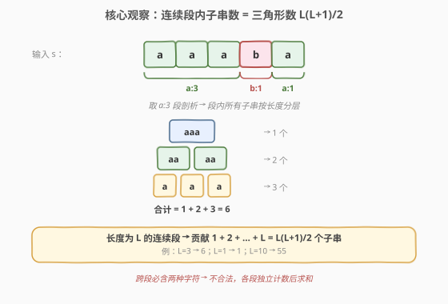
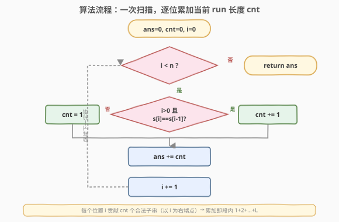
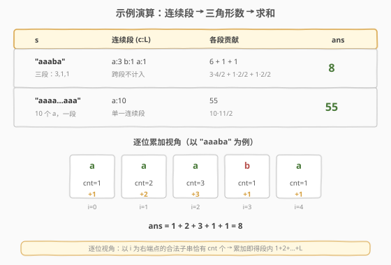

# LeetCode 统计只含单一字母的子串 题解

## 1. 题目概述

- **标题 / 题号**：统计只含单一字母的子串（#1180，easy）
- **链接**：https://leetcode.cn/problems/count-substrings-with-only-one-distinct-letter/
- **难度**：简单
- **标签**：字符串、数学、双指针、连续段压缩

**题意**：给定一个字符串 `s`，返回其中**只含单一字母**的子串数目。即子串内所有字符都相同（如 `"a"`、`"aaa"`、`"bb"` 合法，`"ab"`、`"aab"` 不合法）。

**示例 1**：

```text
输入：s = "aaaba"
输出：8
解释：只含单一字母的子串为 "a","a","a","a","aa","aa","aaa","b"，共 8 个。
```

**示例 2**：

```text
输入：s = "aaaaaaaaaa"
输出：55
```

**约束**：

- `1 <= s.length <= 1000`
- `s[i]` 仅由小写英文字母组成

> 💡 题眼在「**单一字母**」：子串内字符必须全部相同。这意味着合法子串**必然完全落在某个连续相同字符段内**——跨段（含两种字符）一定不合法。这是把问题降维成「逐段计数」的关键突破口。

## 2. 解题思路

### 2.1 暴力思路：枚举所有子串逐一判定

最直接的做法是：枚举所有 $O(n^2)$ 个子串 `(i, j)`，对每个子串扫描一遍检查是否所有字符相同（$O(n)$），合法则计数。总复杂度 $O(n^3)$。$n$ 可达 $1000$，$10^9$ 量级必然超时。

即使优化为「对每个起点 `i` 向右扩展，遇到不同字符就停」，也只是把每段内部枚举清楚了，依然没有抓住「连续段」的结构——同一段内的子串数其实有**闭式公式**，无需逐个枚举。

### 2.2 核心观察：连续段 + 三角形数公式



**第一步：把字符串压缩成「连续段」**。把相邻相同字符合并成一个个 run，例如 `"aaaba"` → `[(a,3), (b,1), (a,1)]`。这与 [1156. 单字符重复子串的最大长度](1156_单字符重复子串的最大长度.md) 的压缩手法完全一致——先抽象掉字符级细节，只关心每段的字符与长度。

**第二步：认清「跨段必不合法」**。合法子串只能含一种字符，所以它不可能跨越两个不同字符的段。于是问题被**完全拆解为各段独立计数**，再求和。

**第三步：求一段内的子串数**。设某连续段长度为 $L$（全由同一字符组成）。该段内合法子串即「段内任取连续子段」，按长度分层计数：

- 长度为 $1$ 的：$L$ 个
- 长度为 $2$ 的：$L-1$ 个
- ……
- 长度为 $L$ 的：$1$ 个

总贡献为 $1 + 2 + \cdots + L = \dfrac{L(L+1)}{2}$（**三角形数**）。

> 💡 **为什么是三角形数？** 在长度为 $L$ 的同字符段内，以每个位置为**右端点**的合法子串数恰好等于「以该位置结尾的连续同字符长度」：第一个位置贡献 1，第二个贡献 2，……，第 $L$ 个贡献 $L$。这正是 $1+2+\cdots+L$。这一视角把「段内子串计数」直接转化为「逐位累加当前 run 长度」，是第 3 节一行代码解法的来源。

> ⚠️ **跨段不计入**：例如 `"aaaba"` 中 `"aab"`、`"aba"`、`"ba"` 都含两种字符，不合法。它们都跨越了段边界，自然被排除——无需单独判断，因为我们只在段内计数。

### 2.3 算法流程图



**整体一次线性扫描**：维护当前连续段长度 `cnt`。从左到右遍历：

1. 若 `s[i] == s[i-1]`：当前段延长，`cnt += 1`
2. 否则：前一段结束，累加 $\dfrac{cnt(cnt+1)}{2}$ 到答案，重置 `cnt = 1`
3. 遍历结束后，别忘了把最后一段也累加进去

**更紧凑的等价写法**（推荐）：不必等段结束才累加，每走到位置 `i`，把「以 `i` 结尾的当前 run 长度 `cnt`」直接加进答案——因为以 `i` 为右端点的合法子串恰有 `cnt` 个。最终答案 = $\sum_i cnt_i = \sum_{\text{段}} \dfrac{L(L+1)}{2}$，两种写法数学等价。

### 2.4 示例演算

以 `"aaaba"` 与 `"aaaaaaaaaa"` 为例，观察连续段与三角形数的对应：



**示例 1：`"aaaba"`**

| 连续段 | 长度 $L$ | 段内子串数 $L(L+1)/2$ |
|--------|----------|----------------------|
| `aaa`  | 3 | $3 \times 4 / 2 = 6$ |
| `b`    | 1 | $1 \times 2 / 2 = 1$ |
| `a`    | 1 | $1 \times 2 / 2 = 1$ |
| **合计** | | **8** |

逐位累加视角（`cnt` = 以当前位结尾的 run 长度）：

| 位置 | 字符 | cnt | 贡献 |
|------|------|-----|------|
| 0 | a | 1 | 1 |
| 1 | a | 2 | 2 |
| 2 | a | 3 | 3 |
| 3 | b | 1 | 1 |
| 4 | a | 1 | 1 |
| **合计** | | | **8** |

$1+2+3+1+1 = 8$ ✓

**示例 2：`"aaaaaaaaaa"`**：单一连续段，$L=10$，$10 \times 11 / 2 = 55$ ✓

> 💡 两种视角殊途同归：分段求和是把 $1+2+\cdots+L$ 按「段」打包计算；逐位累加是把它按「位置」拆开计算。后者代码更短，前者更直观地揭示「跨段不计入」的结构。

## 3. 参考代码

### C++

```cpp
class Solution {
  public:
    int countLetters(string s) {
        int ans = 0, cnt = 1;
        for (int i = 1; i < (int)s.size(); ++i) {
            if (s[i] == s[i - 1]) {
                ++cnt;                 // 当前连续段延长
            } else {
                ans += cnt * (cnt + 1) / 2; // 前一段结束，累加三角形数
                cnt = 1;
            }
        }
        ans += cnt * (cnt + 1) / 2;     // 别忘最后一段
        return ans;
    }
};
```

### Python

```python
class Solution:
    def countLetters(self, s: str) -> int:
        ans = cnt = 0
        for i, c in enumerate(s):
            if i > 0 and c == s[i - 1]:
                cnt += 1                 # 当前连续段延长
            else:
                cnt = 1                  # 新段开始
            ans += cnt                   # 以 i 结尾的合法子串恰有 cnt 个
        return ans
```

> 💡 **两种写法的等价性**：C++ 版按「段」结算——每段结束时一次性加 $L(L+1)/2$；Python 版按「位」结算——每位置加当前 run 长度。由于 $\sum_{k=1}^{L} k = L(L+1)/2$，两者结果完全一致。Python 版无需单独处理最后一段，代码更简洁；C++ 版更直白地对应「连续段 + 三角形数」的概念。面试中任选其一即可，推荐讲清概念后落 Python 版一行 `ans += cnt`。

> ⚠️ **方法名说明**：尽管题目标题是「统计只含单一字母的子串」，LeetCode 判题方法名固定为 `countLetters`（双周赛 6 历史遗留命名）。提交时方法名必须为 `countLetters`，否则编译/判题失败。

## 4. 复杂度分析

| 维度 | 复杂度 | 说明 |
|------|--------|------|
| **时间复杂度** | $O(n)$ | 单次线性扫描，每个字符 $O(1)$ 处理 |
| **空间复杂度** | $O(1)$ | 仅常数变量 `ans`、`cnt`，原地计算 |

$n = 1000$，单次线性扫描毫无压力。对比暴力 $O(n^3)$，关键在于**用「连续段 + 三角形数公式」把段内 $O(L^2)$ 个子串的枚举压缩为 $O(1)$ 一次算出**——这是「计数问题找闭式公式」的经典范例。

## 5. 扩展：从「计数」到「最长」——连续段家族

### 5.1 计数 vs 最长

本题（计数）与 [1156. 单字符重复子串的最大长度](1156_单字符重复子串的最大长度.md)（最长）共享同一基础抽象——**连续段压缩**。两者差异在于连续段之后做什么：

| 维度 | 1180（计数） | 1156（最长，允许交换 1 次） |
|------|--------------|------------------------------|
| 基础抽象 | 连续段 `(c, L)` | 连续段 `(c, L)` |
| 段内处理 | 三角形数 $L(L+1)/2$ 求和 | 段长取 max |
| 跨段处理 | 不可能（跨段必含两种字符） | 可桥接 gap=1 的相邻同段 |
| 复杂度 | $O(n)$ | $O(n)$ |

> 💡 同一套「连续段」抽象既能计数也能求最值。本题因「不允许任何修改」，跨段天然不可能合法，结构最简单；1156 引入「一次交换」后跨段才有讨论空间。

### 5.2 一般化：子数组计数问题的「闭式公式」思维

很多「统计满足某性质的子数组/子串数」问题，关键都是**找到使性质成立的极大连续段，再在段内套闭式公式**：

- 本题：性质 =「全同字符」，段内合法子串数 = $L(L+1)/2$。
- [1513. 仅含 1 的二进制子串数](https://leetcode.cn/problems/number-of-substrings-with-only-1s)：性质 =「全为 1」，连续 1 段内同理 $L(L+1)/2$，与本题主骨架完全相同。
- [2110. 股票平滑下跌阶段数目](https://leetcode.cn/problems/number-of-smooth-descent-periods-of-a-stock)：性质 =「每天比前一天少 1」，段内贡献同样是 $1+2+\cdots+L$。

> 💡 一旦识别出「以位置 $i$ 结尾的合法段长度为 $cnt_i$，则该位置新增 $cnt_i$ 个合法子串」这一增量结构，就能用一行 `ans += cnt` 统一秒杀整类计数题。

### 5.3 暴力到最优的进阶路线

| 解法 | 思路 | 复杂度 |
|------|------|--------|
| 暴力 | 枚举所有子串逐一判定 | $O(n^3)$ |
| 起点扩展 | 每个起点向右扩展到段尾 | $O(n^2)$ |
| 连续段 + 公式 | 段内三角形数一次算出 | $O(n)$ |

## 6. 面试要点

1. **为什么合法子串必然完全落在某个连续段内？**

   > 合法子串要求所有字符相同。若子串跨越两个不同字符的段，则必同时含两种字符，不合法。因此合法子串只能存在于单一连续段内，问题被拆解为各段独立计数——这是把 $O(n^2)$ 枚举压缩为 $O(n)$ 的关键。

2. **长度为 $L$ 的同字符段内有多少个合法子串？为什么是 $L(L+1)/2$？**

   > 按长度分层：长度 1 的有 $L$ 个，长度 2 的有 $L-1$ 个，……，长度 $L$ 的有 1 个。总和 $1+2+\cdots+L = L(L+1)/2$（三角形数）。等价地，以每个位置为右端点的合法子串数等于「以该位置结尾的连续同字符长度」，逐位累加即得同一结果。

3. **逐位累加 `ans += cnt` 为什么正确？**

   > 设位置 `i` 处「以 `i` 结尾的当前连续同字符段长度」为 `cnt`。则以 `i` 为右端点的合法子串恰有 `cnt` 个（左端点可取该段内 `cnt` 个位置中的任意一个）。每个合法子串有唯一的右端点，故按右端点分类求和不重不漏。

4. **遍历结束后为什么 C++ 版要再 `ans += cnt*(cnt+1)/2`，Python 版却不用？**

   > C++ 版按「段」结算——只在段结束时才累加，但循环在最后一段结束前就退出了，最后一段没有触发 `else` 分支，需补加。Python 版按「位」结算——每位置都即时累加，最后一位已计入，无需补加。两种结算时机不同，结果等价。

5. **如果把题改为「统计只含至多两种字母的子串数」怎么做？**

   > 不能再用「连续段 + 闭式公式」，因为跨段也可能合法。需用 [1248. 统计「优美子数组」](../0001-0100/1248_统计「优美子数组」的子串.md) 的「至多 K」转化：`exactly(K) = atMost(K) - atMost(K-1)`，其中 `atMost(K)` 用滑动窗口 + 字符种类计数在 $O(n)$ 内求出。本题即 `K=1` 的特例，但连续段公式比通用滑窗常数更小——当性质可由「极大连续段」刻画时，优先用闭式公式。

> 💡 **一句话总结**：1180 是「连续段压缩 + 三角形数计数」的入门模板——跨段必不合法使问题按段独立，段内子串数为 $L(L+1)/2$，一次扫描 $O(n)$ 得解。掌握「以位置 $i$ 结尾的合法段长度即该位置新增子串数」这一增量视角，可秒杀一整类子串计数题。

## 同类练习题

| # | 题目 | 与本题的关联 |
|---|------|-------------|
| 1156 | [单字符重复子串的最大长度](https://leetcode.cn/problems/swap-for-longest-repeated-character-substring/)（[题解](1156_单字符重复子串的最大长度.md)） | 共享「连续段压缩」抽象，但目标是「最长」且允许一次交换，引入跨段桥接判定——本题的进阶版 |
| 1513 | [仅含 1 的二进制子串数](https://leetcode.cn/problems/number-of-substrings-with-only-1s/) | 连续 1 段内子串数同为 $L(L+1)/2$，骨架与本题完全一致，仅字符集为 `{0,1}` |
| 2110 | [股票平滑下跌阶段数目](https://leetcode.cn/problems/number-of-smooth-descent-periods-of-a-stock/) | 性质改为「相邻差为 -1」的连续段，段内贡献仍为 $1+2+\cdots+L$，`ans += cnt` 一行通杀 |
| 1446 | [连续字符](https://leetcode.cn/problems/consecutive-characters/) | 连续段压缩的裸题（只求最长连续段长度），可作为本题前置练习 |
| 1248 | [统计「优美子数组」](https://leetcode.cn/problems/count-number-of-nice-subarrays/)（[题解](../0001-0100/1248_统计「优美子数组」的子串.md)） | 通用「至多 K」滑窗计数模板，当性质不可用连续段刻画时（如至多两种字母）的兜底解法 |
