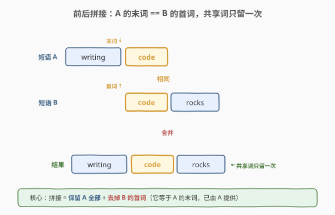
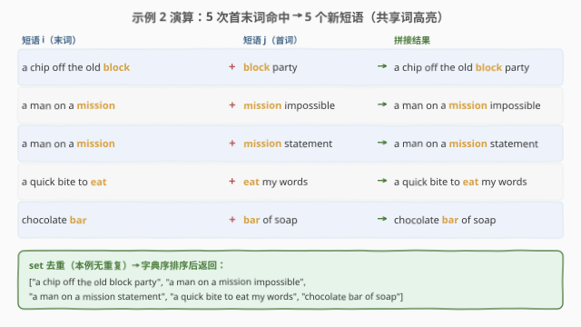

# 前后拼接

- **题目名称**：前后拼接
- **链接**：[1181. 前后拼接](https://leetcode.cn/problems/before-and-after-puzzle/)
- **难度**：中等
- **标签**：数组、哈希表、字符串、排序

## 1. 题目概述

给定一个「短语」列表 `phrases`，按规则生成拼接后的「新短语」列表。

「短语」是仅由小写英文字母和空格组成的字符串，首尾不会出现空格，空格也不会连续出现（即词与词之间恰好一个空格）。

「前后拼接」是合并两个短语形成新短语的方法：**第一个短语的最后一个单词** 与 **第二个短语的第一个单词** 必须相同。拼接时该共享词只出现一次。

返回每两个短语 `phrases[i]` 与 `phrases[j]`（`i != j`）进行前后拼接得到的新短语。两个短语的顺序重要（`(i,j)` 与 `(j,i)` 都要考虑）；同一个短语可多次参与拼接，但**新短语不再参与拼接**（只拼一层）。结果按字典序排列且**不重复**。

**示例 1**：

```text
输入：phrases = ["writing code","code rocks"]
输出：["writing code rocks"]
解释："writing code" 末词 "code" == "code rocks" 首词 "code" → "writing code rocks"。
```

**示例 2**：

```text
输入：phrases = ["mission statement","a quick bite to eat","a chip off the old block",
                "chocolate bar","mission impossible","a man on a mission","block party",
                "eat my words","bar of soap"]
输出：["a chip off the old block party","a man on a mission impossible",
       "a man on a mission statement","a quick bite to eat my words","chocolate bar of soap"]
```

**示例 3**：

```text
输入：phrases = ["a","b","a"]
输出：["a"]
解释：两个 "a"（下标 0、2，i != j）拼接：末词 "a" == 首词 "a"，去掉后者首词后得 "a"。
```

**示例 4**：

```text
输入：phrases = ["ab ba","ba ab","ab ba"]
输出：["ab ba ab","ba ab ba"]
解释：下标 0、2 内容相同但下标不同，允许拼接。
```

**约束条件**：

- `1 <= phrases.length <= 100`
- `1 <= phrases[i].length <= 100`

> 💡 这是第 8 场双周赛 Q2。核心是把「配对拼接」抽象成**按首/末词做哈希连接**——与 SQL 的 `JOIN ON a.last = b.first` 同构，也和 [1. 两数之和](../0001-0100/1_两数之和.md)「用哈希把配对条件 O(1) 化」一脉相承。

---

## 2. 解题思路

### 2.1 暴力思路：两重循环逐对比较

枚举所有 `(i, j)` 且 `i != j`，每次临时 `split` 取出 `phrases[i]` 的末词与 `phrases[j]` 的首词，若相等则拼接：`phrases[i] + phrases[j]` 去掉首词。用 `set` 去重，最后排序。

问题：每个短语的首/末词在一次循环里被反复 `split`，重复计算；且对**末词根本无匹配**的 `i` 也要扫一遍所有 `j`。$n \le 100$ 时 $O(n^2)$ 仍可过，但可以更优雅。

### 2.2 核心观察：首末词哈希索引



**观察一：拼接条件只依赖首词与末词**，与中间词无关。因此可**预处理**一次性抽出每个短语的 `first[i]` 与 `last[i]`，后续不再重复切分。

**观察二：对短语 `i`，只需找所有「首词 == `last[i]`」的 `j`**。把「首词 → 下标列表」存进哈希表 `head`，就能 $O(1)$ 定位候选，跳过无效扫描。这正是 [1. 两数之和](../0001-0100/1_两数之和.md) 把 `target - x` 存哈希的同一套路——**用哈希把「找匹配项」从 $O(n)$ 降到均摊 $O(1)$**。

**拼接公式**（共享词只留一次）：

```text
new = phrases[i] + phrases[j].substr(first[j].size())
```

`phrases[j]` 去掉首词 `first[j]`（它等于 `last[i]`，已由 `phrases[i]` 末尾提供），保留 `phrases[i]` 全部。单词短语（无空格）时 `first[j] == phrases[j]`，去掉首词后为空串，结果即 `phrases[i]` 本身（见示例 3）。

> ⚠️ **`i != j` 指下标不同，不是内容不同**。两个内容完全相同但下标不同的短语允许拼接（示例 4：下标 0、2 都是 `"ab ba"`）。因此跳过条件是 `i == j`（同一下标），而非字符串相等。

### 2.3 算法流程图

![算法流程：预处理首末词 → 建首词哈希索引 → 枚举 i 查 last[i] → 拼接去首词 → set 去重排序](../images/bap_algorithm_flow.svg)

**完整步骤**：

1. **预处理**：对每个短语抽取 `first[i]`、`last[i]`（C++ 用 `find`/`rfind` 取首末词，$O(m)$；Python 用 `split()` 取 `ws[0]`/`ws[-1]`）
2. **建索引**：`head[first[j]].append(j)`，把首词相同的下标归为一组
3. **枚举**：对每个 `i`，查 `head[last[i]]` 得候选 `j` 列表；`i == j` 跳过
4. **拼接**：`phrases[i] + phrases[j].substr(first[j].size())`，塞进 `set`
5. **去重排序**：`set` → 数组 → `sort` → 返回

> 💡 **最坏仍是 $O(n^2)$**：若所有短语首词相同，候选列表长度为 $n$，哈希只省掉了「比较首末词是否相等」的判断，配对数仍是 $n^2$。但实现上更清晰，且平均情况跳过大量无配对的 `i`。

### 2.4 示例演算

以示例 2 走一遍：



**预处理后的首末词与索引**：

| 下标 | 短语 | first | last |
|------|------|-------|------|
| 0 | mission statement | mission | statement |
| 1 | a quick bite to eat | a | eat |
| 2 | a chip off the old block | a | block |
| 3 | chocolate bar | chocolate | bar |
| 4 | mission impossible | mission | impossible |
| 5 | a man on a mission | a | mission |
| 6 | block party | block | party |
| 7 | eat my words | eat | words |
| 8 | bar of soap | bar | soap |

`head` 索引：`mission→[0,4]`、`a→[1,2,5]`、`chocolate→[3]`、`block→[6]`、`eat→[7]`、`bar→[8]`。

**命中枚举**（只看 `last[i]` 在 `head` 中存在的 `i`）：

| i | last[i] | 命中 j | 拼接结果 |
|---|---------|--------|----------|
| 1 | eat | 7 | a quick bite to eat my words |
| 2 | block | 6 | a chip off the old block party |
| 3 | bar | 8 | chocolate bar of soap |
| 5 | mission | 0, 4 | a man on a mission statement / a man on a mission impossible |

其余 `i`（`statement`/`impossible`/`party`/`words`/`soap`）的末词在 `head` 中无首词匹配，直接跳过。`set` 去重（本例无重复）后字典序排序即得 5 个结果。

---

## 3. 参考代码

### C++

```cpp
// 前后拼接.cpp —— 首末词哈希索引
// 编译: g++ -O2 -std=c++17 前后拼接.cpp -o bap
class Solution {
public:
    vector<string> beforeAndAfterPuzzles(vector<string>& phrases) {
        int n = phrases.size();
        vector<pair<string, string>> fl(n);          // first / last
        for (int i = 0; i < n; ++i) {
            const string& p = phrases[i];
            int sp = p.find(' ');
            if (sp == string::npos) {
                fl[i] = {p, p};                       // 单词短语：首=末=自身
            } else {
                int ep = p.rfind(' ');
                fl[i] = {p.substr(0, sp), p.substr(ep + 1)};
            }
        }
        // 建索引：首词 -> 下标列表
        unordered_map<string, vector<int>> head;
        for (int j = 0; j < n; ++j) head[fl[j].first].push_back(j);

        unordered_set<string> res;
        for (int i = 0; i < n; ++i) {
            auto it = head.find(fl[i].second);        // 找首词 == i 的末词
            if (it == head.end()) continue;
            for (int j : it->second) {
                if (i == j) continue;                 // 下标相同跳过（内容相同不跳）
                res.insert(phrases[i] + phrases[j].substr(fl[j].first.size()));
            }
        }
        vector<string> ans(res.begin(), res.end());
        sort(ans.begin(), ans.end());
        return ans;
    }
};
```

### Python

```python
class Solution:
    def beforeAndAfterPuzzles(self, phrases: List[str]) -> List[str]:
        n = len(phrases)
        fl = []                                     # (first, last)
        for p in phrases:
            ws = p.split()
            fl.append((ws[0], ws[-1]))

        head = {}                                   # 首词 -> 下标列表
        for j in range(n):
            head.setdefault(fl[j][0], []).append(j)

        res = set()
        for i in range(n):
            for j in head.get(fl[i][1], ()):        # 首词 == i 的末词
                if i == j:
                    continue
                res.add(phrases[i] + phrases[j][len(fl[j][0]):])

        return sorted(res)
```

> 💡 **实现细节**：① C++ 用 `find`/`rfind` 而非 `split`，避免构造 `vector<string>`，$O(m)$ 取首末词。② Python `head.get(fl[i][1], ())` 在末词无匹配时返回空元组，循环体不执行，省一次判断。③ `phrases[j][len(first[j]):]` 切掉 `j` 的首词；单词短语时切到空串，结果即 `phrases[i]`。

---

## 4. 复杂度分析

| 维度 | 哈希索引版 | 暴力两重循环 |
|------|-----------|-------------|
| **时间** | $O(n \cdot m + P \cdot m + k \cdot m \log k)$ | $O(n^2 \cdot m + k \cdot m \log k)$ |
| **空间** | $O(n \cdot m + k \cdot m)$ | $O(k \cdot m)$ |
| **说明** | $P=\sum_i |\text{head}[\text{last}[i]]| \le n^2$ 为实际配对数；$k$ 为去重后结果数 | 始终枚举全部 $n^2$ 对 |

其中 $n$ 为短语数，$m$ 为短语平均长度，$k \le n^2$ 为去重后结果数。

> ⚠️ **为什么都是 $O(n^2)$ 量级？** 输出规模本身可达 $\Theta(n^2)$（所有对都命中且结果互异），故 $O(n^2)$ 已是下界。哈希版的优势在于：当首末词分布稀疏时 $P \ll n^2$，跳过大量无效对；且实现上把「比较」转为「查表」，常数更小。$n \le 100$ 时两者均可轻松通过。

---

## 5. 扩展：边界规则与简化实现

### 5.1 三个易错边界

| 边界 | 说明 | 例 |
|------|------|----|
| **单词短语** | 无空格时 `first == last == 整串`，拼接去掉首词后为空，结果即 `phrases[i]` 本身 | 示例 3：`["a","b","a"] → ["a"]` |
| **下标不同 vs 内容不同** | `i != j` 是下标约束；内容相同但下标不同的两个短语可拼 | 示例 4：两个 `"ab ba"`（下标 0、2）可拼 |
| **只拼一层** | 「新短语不再参与拼接」——结果不递归链式拼接，仅做一次两两合并 | 不存在 `"A + B + C"` 的三段链 |

### 5.2 简化版（无哈希，直接两重循环）

$n \le 100$ 时无需哈希也能过，代码更短，适合面试快速写出：

```python
class Solution:
    def beforeAndAfterPuzzles(self, phrases: List[str]) -> List[str]:
        fl = []
        for p in phrases:
            ws = p.split()
            fl.append((ws[0], ws[-1]))
        n = len(fl)
        res = set()
        for i in range(n):
            for j in range(n):
                if i != j and fl[i][1] == fl[j][0]:
                    res.add(phrases[i] + phrases[j][len(fl[j][0]):])
        return sorted(res)
```

> 💡 **何时用哈希版？** 当 $n$ 变大（如 $10^4$）且首末词分布稀疏时，哈希版把 $O(n^2)$ 降到接近 $O(n)$；本题 $n \le 100$，两者皆可，按可读性取舍。

---

## 6. 面试要点

1. **拼接时共享词为什么只出现一次？怎么实现？**

   > 因为 `last[i] == first[j]`，该词既是 `i` 的结尾又是 `j` 的开头。实现上保留 `phrases[i]` 全部、去掉 `phrases[j]` 的首词 `first[j]`：`phrases[i] + phrases[j].substr(first[j].size())`。若两段都保留就会重复一次。

2. **`i != j` 的含义是什么？为什么内容相同的两个短语可以拼接？**

   > `i != j` 约束的是**下标**不同，不是内容不同。题目允许同一短语「多次参与拼接」，因此两个内容完全相同但处于不同下标的短语（如示例 4 的两个 `"ab ba"`）满足 `i != j`，可以拼接。跳过条件写成 `i == j` 而非字符串相等。

3. **为什么要预处理首末词，而不是每次临时 split？**

   > 拼接条件只依赖首词与末词，与中间词无关。预处理一次抽出 `first[i]`/`last[i]`，避免在 $O(n^2)$ 配对中反复 `split`（每次 $O(m)$），把重复计算摊到一次 $O(n \cdot m)$。这是「提取不变特征」的通用优化。

4. **哈希索引如何加速？最坏情况还是 $O(n^2)$ 吗？**

   > 用 `head[首词] → [下标列表]` 把「找首词等于 `last[i]` 的 `j`」从遍历 $O(n)$ 降到查表 $O(1)$。但若所有短语首词相同，候选列表长 $n$，配对数仍是 $n^2$——这是输出规模下界决定的，无法渐近更优。哈希的优势在稀疏分布时跳过无效对、降低常数。

5. **结果为什么要 set 去重？哪些情况会产生重复？**

   > 同一个新短语可由不同对 `(i,j)` 产生。如示例 4：`"ba ab ba"` 可由 `(1,0)` 和 `(1,2)` 得到（`j=0`、`j=2` 内容相同）。`set` 按字符串去重，最后排序即满足「不重复 + 字典序」。

> 💡 **一句话总结**：1181 是「按首/末词做哈希连接」的字符串配对题——预处理首末词、用哈希表 `head[首词]` 把配对条件 $O(1)$ 化，拼接时保留 `i` 全部、去掉 `j` 首词使共享词只留一次，最后 `set` 去重 + 字典序排序。和两数之和、四数相加 II 的「哈希化配对条件」同源。

---

## 7. 同类练习题

- [1. 两数之和](https://leetcode.cn/problems/two-sum/)（[题解](../0001-0100/1_两数之和.md)）：同为「用哈希把配对条件从 $O(n)$ 降到均摊 $O(1)$」——两数之和存 `target-x`，本题存首词，本质同构
- [454. 四数相加 II](https://leetcode.cn/problems/4sum-ii/)（[题解](../0401-0500/454_四数相加%20II.md)）：分组 + 哈希做配对计数（Meet in the Middle），与本题「按首词分组再配末词」同套路
- [14. 最长公共前缀](https://leetcode.cn/problems/longest-common-prefix/)（[题解](../0001-0100/14_最长公共前缀.md)）：字符串按词/前缀处理的基础题，对照本题对首末词的抽取与切分
- [692. 前 K 个高频单词](https://leetcode.cn/problems/top-k-frequent-words/)：哈希计数 + 自定义排序去重，与本题「`set` 去重 + 字典序排序」的输出处理同源
- [1170. 比较字符串最小字母出现频次](https://leetcode.cn/problems/compare-strings-by-frequency-of-the-smallest-character/)（[题解](../1101-1200/1170_比较字符串最小字母出现频次.md)）：预处理每个字符串的特征值再做配对比较，与本题「预处理首末词再配对」同一模式
