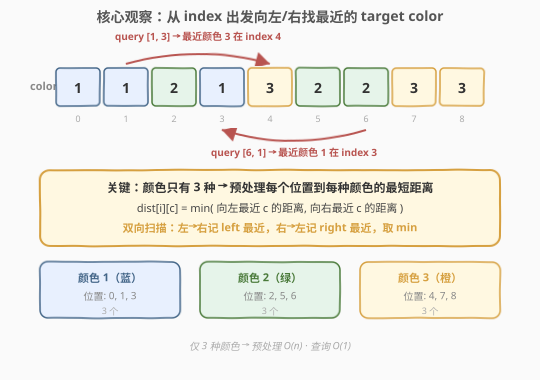
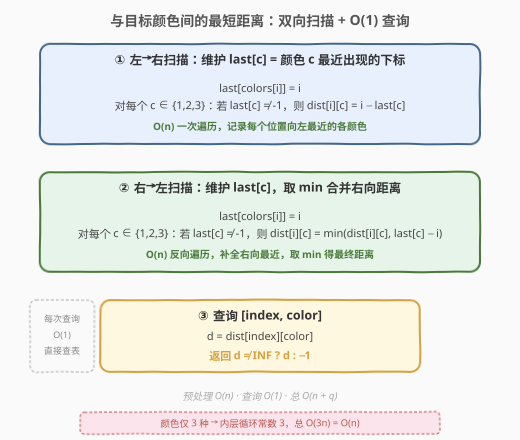
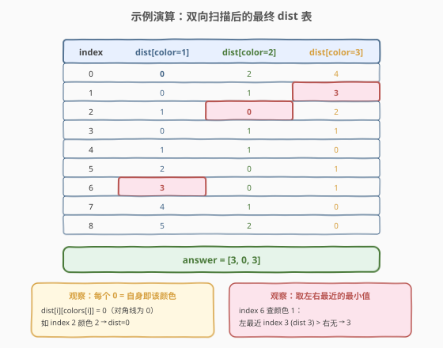

# 与目标颜色间的最短距离

- **题目名称**：与目标颜色间的最短距离
- **链接**：[1182. 与目标颜色间的最短距离](https://leetcode.cn/problems/shortest-distance-to-target-color/)
- **难度**：中等
- **标签**：数组、二分查找、动态规划、预处理

## 1. 题目概述

给定一个数组 `colors`，其中每个元素取值为 `1`、`2` 或 `3`（表示三种颜色）。再给定一组查询 `queries[j] = [index_j, color_j]`，对每个查询，求下标 `index_j` 处到**最近的**颜色为 `color_j` 的元素的距离。若数组中不存在该颜色，返回 `-1`。两个下标 `i` 和 `j` 之间的距离定义为 $|i - j|$。

**示例 1**：

```text
输入：colors = [1,1,2,1,3,2,2,3,3], queries = [[1,3],[2,2],[6,1]]
输出：[3,0,3]

解释：
queries[0] : index=1 查颜色 3，最近的颜色 3 在 index 4，距离 |4−1|=3
queries[1] : index=2 查颜色 2，自身即颜色 2，距离 0
queries[2] : index=6 查颜色 1，左侧最近颜色 1 在 index 3，距离 |6−3|=3
```

**约束条件**：

- $1 \le \text{colors.length} \le 5 \times 10^4$
- $1 \le \text{colors[i]} \le 3$
- $1 \le \text{queries.length} \le 5 \times 10^4$
- $\text{queries[j]} = [\text{index\_j}, \text{color\_j}]$
- $0 \le \text{index\_j} < \text{colors.length}$
- $1 \le \text{color\_j} \le 3$

> 💡 颜色种类**仅 3 种**是本题的核心约束。这意味着我们可以为每个位置预处理到 3 种颜色的最短距离，查询时 $O(1)$ 直接查表——而无需在查询时再搜索。

---

## 2. 解题思路

### 2.1 暴力思路：每次查询线性扫描

最直觉的做法：对每个查询 `[index, color]`，从 `index` 出发向左右两边同时扩展，找到第一个颜色为 `color` 的位置，返回距离。

| 步骤 | 复杂度 | 说明 |
|------|--------|------|
| 单次查询 | $O(n)$ | 最坏从一端扫到另一端 |
| 总时间 | $O(q \cdot n)$ | $q$ 次查询，最坏 $5 \times 10^4 \times 5 \times 10^4 = 2.5 \times 10^9$，超时 |

数组长度与查询次数都可达 $5 \times 10^4$，暴力必然超时。瓶颈在于「每次查询都重新搜索最近位置」——这些最近位置信息本可**预处理复用**。

### 2.2 核心观察：颜色仅 3 种 → 双向扫描预处理



**关键观察 1：颜色种类极少（仅 3 种）**

如果颜色种类很多（如 $10^5$ 种），为每个位置预存到每种颜色的距离需要 $O(n \cdot |\text{colors}|)$ 空间，不可行。但本题颜色只有 3 种，预存 `dist[i][c]`（$c \in \{1,2,3\}$）仅需 $O(3n) = O(n)$ 空间——常数因子极小。

**关键观察 2：最近距离 = 左向最近与右向最近取 min**

对位置 $i$ 和目标颜色 $c$，最近的同色位置只可能在 $i$ 的**左侧**或**右侧**（含 $i$ 自身）。因此：

$$\text{dist}[i][c] = \min\Big(\underbrace{i - \text{left}_c[i]}_{\text{左向最近距离}},\ \underbrace{\text{right}_c[i] - i}_{\text{右向最近距离}}\Big)$$

其中 $\text{left}_c[i]$ 是 $i$ 及其左侧最近的颜色 $c$ 的下标，$\text{right}_c[i]$ 是 $i$ 及其右侧最近的颜色 $c$ 的下标。

**关键观察 3：左向/右向最近可用单趟扫描递推**

- **左→右扫描**：维护 `last[c]` = 颜色 $c$ 最近一次出现的下标。遍历到 $i$ 时，先更新 `last[colors[i]] = i`，则对每个 $c$，若 `last[c] ≠ -1`，左向最近距离为 $i - \text{last}[c]$。
- **右→左扫描**：同理反向遍历，维护 `last[c]`，计算右向最近距离并与左向取 `min`。

> 💡 这与 [42. 接雨水](https://leetcode.cn/problems/trapping-rain-water/) 的「左右预处理 max 数组再取 min」结构完全同构——都是双向扫描预处理 + 合并。区别在于接雨水存的是**最大值**，本题存的是**最近下标**。

### 2.3 算法流程图



**完整步骤**：

1. **初始化**：`dist[n][4]` 全部填 `INF`，`last[4]` 全部填 `-1`（下标 0 不用，颜色 1-3 对应下标 1-3）。
2. **左→右扫描**（$i$ 从 $0$ 到 $n-1$）：
   - `last[colors[i]] = i`
   - 对每个 $c \in \{1,2,3\}$：若 `last[c] ≠ -1`，则 `dist[i][c] = i - last[c]`
3. **右→左扫描**（$i$ 从 $n-1$ 到 $0$）：
   - `last[colors[i]] = i`
   - 对每个 $c \in \{1,2,3\}$：若 `last[c] ≠ -1`，则 `dist[i][c] = min(dist[i][c], last[c] - i)`
4. **查询** `[index, color]`：`d = dist[index][color]`，返回 `d ≠ INF ? d : -1`。

### 2.4 示例演算

以 `colors = [1,1,2,1,3,2,2,3,3]` 为例，双向扫描后的最终 `dist` 表：



逐查询验证：

| query | 查表位置 | dist 值 | 结果 |
|-------|----------|---------|------|
| `[1,3]` | `dist[1][3]` | 3 | **3** |
| `[2,2]` | `dist[2][2]` | 0 | **0** |
| `[6,1]` | `dist[6][1]` | 3 | **3** |

> 💡 **对角线为 0**：`dist[i][colors[i]] = 0`，因为位置 $i$ 自身就是该颜色，左→右扫描时 `last[colors[i]]` 刚更新为 $i$，距离为 0。如 `index=2` 颜色为 2，`dist[2][2]=0`。

---

## 3. 参考代码

### C++

```cpp
class Solution {
public:
    vector<int> shortestDistanceColor(vector<int>& colors, vector<vector<int>>& queries) {
        int n = colors.size();
        const int INF = 1e9;
        // dist[i][c]: 从下标 i 到最近颜色 c 的距离（c = 1,2,3）
        vector<vector<int>> dist(n, vector<int>(4, INF));

        // 左→右扫描：记录每个位置向左（含自身）最近的各颜色
        vector<int> last(4, -1);
        for (int i = 0; i < n; ++i) {
            last[colors[i]] = i;
            for (int c = 1; c <= 3; ++c)
                if (last[c] != -1)
                    dist[i][c] = i - last[c];
        }

        // 右→左扫描：补充向右最近的各颜色，取 min
        last.assign(4, -1);
        for (int i = n - 1; i >= 0; --i) {
            last[colors[i]] = i;
            for (int c = 1; c <= 3; ++c)
                if (last[c] != -1)
                    dist[i][c] = min(dist[i][c], last[c] - i);
        }

        // 查询 O(1)
        vector<int> ans;
        ans.reserve(queries.size());
        for (auto& q : queries) {
            int d = dist[q[0]][q[1]];
            ans.push_back(d >= INF ? -1 : d);
        }
        return ans;
    }
};
```

### Python

```python
class Solution:
    def shortestDistanceColor(self, colors: List[int], queries: List[List[int]]) -> List[int]:
        n = len(colors)
        INF = float('inf')
        dist = [[INF] * 4 for _ in range(n)]

        # 左→右扫描
        last = [-1] * 4
        for i in range(n):
            last[colors[i]] = i
            for c in range(1, 4):
                if last[c] != -1:
                    dist[i][c] = i - last[c]

        # 右→左扫描
        last = [-1] * 4
        for i in range(n - 1, -1, -1):
            last[colors[i]] = i
            for c in range(1, 4):
                if last[c] != -1:
                    dist[i][c] = min(dist[i][c], last[c] - i)

        # 查询 O(1)
        ans = []
        for idx, color in queries:
            d = dist[idx][color]
            ans.append(d if d != INF else -1)
        return ans
```

> 💡 **写法要点**：① `dist` 数组第二维大小为 4（下标 0 不用，颜色 1-3 对应下标 1-3），避免减 1 的偏移操作。② 每趟扫描**先更新 `last[colors[i]] = i`** 再计算距离，保证 `colors[i] == c` 时 `dist[i][c] = 0`。③ `INF` 用 `1e9`（C++）或 `float('inf')`（Python），查询时判断是否仍为 `INF` 决定返回 `-1`。④ 内层循环固定 3 次，不影响渐近复杂度。

---

## 4. 复杂度分析

| 维度 | 复杂度 | 说明 |
|------|--------|------|
| 预处理时间 | $O(n)$ | 两趟扫描，每趟内层循环常数 3 次 |
| 预处理空间 | $O(n)$ | `dist` 数组 $n \times 4$，`last` 数组常数 |
| 单次查询时间 | $O(1)$ | 直接查表 `dist[index][color]` |
| 总时间 | $O(n + q)$ | 预处理 $n$ + $q$ 次查询 |
| 总空间 | $O(n + q)$ | `dist` 数组 + 答案数组 |

其中 $n, q \le 5 \times 10^4$，总操作约 $2 \times 3 \times 5 \times 10^4 = 3 \times 10^5$ 次常数运算，远在时限内。对比暴力的 $O(q \cdot n) = 2.5 \times 10^9$，优化了 4 个数量级——核心在于把「逐查询线性搜索」变成「预处理一次 + 查询 $O(1)$」。

---

## 5. 扩展：二分查找解法（适用于颜色种类较多的场景）

若颜色种类不再限于 3 种，而是任意取值，预存 `dist[i][c]` 的空间会爆炸。此时可用**二分查找**解法：

1. **预处理**：用哈希表 `pos[c]` 收集每种颜色出现的所有下标（天然有序）。
2. **查询** `[index, color]`：在 `pos[color]` 中二分查找 `index` 的插入位置 $j$，最近下标只可能是 `pos[j]`（右邻）或 `pos[j-1]`（左邻），取距离较小者。

### C++

```cpp
class Solution {
public:
    vector<int> shortestDistanceColor(vector<int>& colors, vector<vector<int>>& queries) {
        unordered_map<int, vector<int>> pos;
        for (int i = 0; i < colors.size(); ++i)
            pos[colors[i]].push_back(i);

        vector<int> ans;
        ans.reserve(queries.size());
        for (auto& q : queries) {
            auto it = pos.find(q[1]);
            if (it == pos.end() || it->second.empty()) {
                ans.push_back(-1);
                continue;
            }
            auto& arr = it->second;
            int j = lower_bound(arr.begin(), arr.end(), q[0]) - arr.begin();
            int best = INT_MAX;
            if (j < arr.size())  best = min(best, arr[j] - q[0]);
            if (j > 0)           best = min(best, q[0] - arr[j - 1]);
            ans.push_back(best);
        }
        return ans;
    }
};
```

### Python

```python
from bisect import bisect_left

class Solution:
    def shortestDistanceColor(self, colors: List[int], queries: List[List[int]]) -> List[int]:
        pos = {}
        for i, c in enumerate(colors):
            pos.setdefault(c, []).append(i)

        ans = []
        for idx, color in queries:
            arr = pos.get(color)
            if not arr:
                ans.append(-1)
                continue
            j = bisect_left(arr, idx)
            best = float('inf')
            if j < len(arr):
                best = min(best, arr[j] - idx)
            if j > 0:
                best = min(best, idx - arr[j - 1])
            ans.append(best)
        return ans
```

| 维度 | 双向扫描预处理 | 二分查找 |
|------|---------------|---------|
| 预处理时间 | $O(n)$ | $O(n)$ |
| 预处理空间 | $O(n \cdot \|\text{colors}\|)$ | $O(n)$ |
| 单次查询 | $O(1)$ | $O(\log n)$ |
| 适用场景 | 颜色种类少（常数级） | 颜色种类多 |

> 💡 本题颜色仅 3 种，双向扫描在查询时间上更优（$O(1)$ vs $O(\log n)$）；若颜色种类增至 $O(n)$，预处理空间 $O(n^2)$ 不可接受，二分查找成为唯一可行解。

---

## 6. 面试要点

1. **为什么颜色只有 3 种是关键？**

   > 预处理 `dist[i][c]` 需要 $O(n \cdot |\text{colors}|)$ 空间。颜色仅 3 种时空间为 $O(3n) = O(n)$，内层循环也是常数 3 次，不影响渐近复杂度。若颜色种类增至 $O(n)$，预处理空间爆炸，需改用二分查找。

2. **为什么需要两次扫描（左→右 + 右→左）？**

   > 左→右扫描只能记录每个位置**向左**（含自身）最近的各颜色下标。若只做一趟，右侧最近的信息缺失。右→左扫描补充右向最近，与左向取 `min` 才能得到全局最近。

3. **如果某种颜色在数组中完全不存在，如何处理？**

   > 该颜色对应的 `last[c]` 始终为 `-1`，`dist[i][c]` 保持 `INF` 不被更新。查询时检测到 `INF` 即返回 `-1`。这是初始化 `INF` 哨兵值的作用。

4. **双向扫描与单调栈（如 739 每日温度）有何区别？**

   > 739 用单调栈求「右侧最近更大元素」，栈内维护递减序列，一次性处理。本题需要**同时**求左右两侧的最近同色位置，单调栈只能处理单侧，而双向扫描天然覆盖两侧。且本题颜色仅 3 种，双向扫描的常数因子（内层 3 次循环）比单调栈更小。

5. **暴力 $O(qn)$ 会超时吗？优化本质是什么？**

   > $n, q \le 5 \times 10^4$，$O(qn) = 2.5 \times 10^9$ 必超时。优化本质是**预处理把最近位置查询从 $O(n)$ 降到 $O(1)$**——利用颜色种类极少的特点，预存所有 $(位置, 颜色)$ 对的距离，查询时直接查表。

> 💡 **一句话总结**：1182 是「双向扫描预处理」的招牌题——颜色仅 3 种，预存每个位置到每种颜色的最短距离，左→右一趟记左向最近、右→左一趟取 min 补全右向最近，查询 $O(1)$ 直接查表。核心洞察是「颜色种类少 → 预处理空间常数级」与「最近 = min(左最近, 右最近)」。

---

## 7. 同类练习题

- [739. 每日温度](https://leetcode.cn/problems/daily-temperatures/)（[题解](../0701-0800/739_每日温度.md)）：单调栈求每个位置右侧最近更大元素，与本题「预处理最近位置」同源，方向单一且用单调栈，对照双向扫描的适用场景
- [42. 接雨水](https://leetcode.cn/problems/trapping-rain-water/)（[题解](../0001-0100/42_接雨水.md)）：左右双向预处理 max 数组再取 min，与本题双向扫描取 min 的结构完全同构，存的是最大值而非最近下标
- [1475. 商品折扣后的最终价格](https://leetcode.cn/problems/final-prices-with-a-special-discount-in-a-shop/)：右侧最近更小元素，单调栈变体，最近邻查找的另一种形式，对照本题的双向预处理
- [2080. 区间内查询数字的频率](https://leetcode.cn/problems/range-frequency-queries/)：预处理每个值的有序下标列表 + 二分查找，与本题扩展解法（哈希表 + 二分）同构，处理颜色种类多的场景
