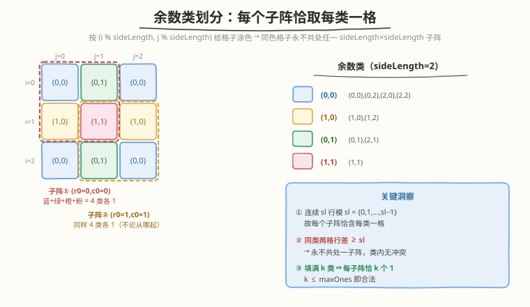
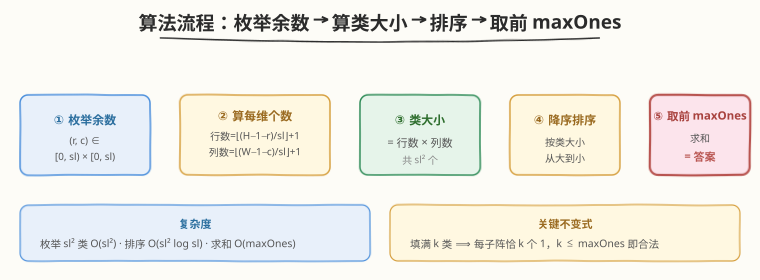

# LeetCode 矩阵中1的最大数量 题解

## 1. 题目概述

- **标题 / 题号**：矩阵中1的最大数量（#1183，hard）
- **链接**：https://leetcode.cn/problems/maximum-number-of-ones/
- **难度**：困难
- **标签**：贪心、数学、排序、堆（优先队列）

**题意**：给定一个 `width × height` 的 0/1 矩阵 `M`，要求：任意一个 `sideLength × sideLength` 的**正方形子矩阵**中 1 的个数不超过 `maxOnes`。返回整个矩阵 `M` 中 1 的个数的最大值。

**示例 1**：

```text
输入：width = 3, height = 3, sideLength = 2, maxOnes = 1
输出：4
解释：
在 3×3 矩阵中，任意 2×2 子矩阵的 1 不超过 1 个。
最优方案（4 个 1）：
[1,0,1]
[0,0,0]
[1,0,1]
```

**示例 2**：

```text
输入：width = 3, height = 3, sideLength = 2, maxOnes = 2
输出：6
解释：
[1,0,1]
[1,0,1]
[1,0,1]
```

**约束**：

- $1 \le \text{width}, \text{height} \le 100$
- $1 \le \text{sideLength} \le \text{width}, \text{height}$
- $0 \le \text{maxOnes} \le \text{sideLength} \times \text{sideLength}$

> 💡 这是一道**付费困难题**。乍看像网格 DP 或二分图匹配，但约束「任意 $\text{sl} \times \text{sl}$ 子阵 1 不超限」隐藏着一个优美的**模运算余数类**结构：按 $(i \bmod \text{sl},\ j \bmod \text{sl})$ 给格子涂色，会发现任意子阵恰好「每色取一格」，从而把问题简化为「选最大的 maxOnes 个色块」。核心是洞察，代码极短。

## 2. 解题思路

### 2.1 暴力思路：枚举每个格子的 0/1

最直白的做法：矩阵共 $\text{width} \times \text{height} \le 10^4$ 个格子，每个取 0/1，枚举 $2^{10^4}$ 种配置，逐个检查所有 $\text{sl} \times \text{sl}$ 子阵是否满足 $\le \text{maxOnes}$。指数级，必然不可行。即便用 DFS 回溯剪枝，状态空间仍巨大。

| 步骤 | 复杂度 | 说明 |
|------|--------|------|
| 枚举配置 | $O(2^{W \cdot H})$ | 每格 0/1，最坏 $2^{10^4}$ 种 |
| 单次校验 | $O(W \cdot H)$ | 扫所有 $\text{sl} \times \text{sl}$ 子阵 |
| 总时间 | 不可行 | 指数爆炸 |

瓶颈在于「把每个格子当独立变量」——实际上格子的取值高度相关，存在可挖掘的代数结构。

### 2.2 核心观察：模运算余数类划分



**关键定义**：对每个格子 $(i, j)$，计算余数对 $(i \bmod \text{sl},\ j \bmod \text{sl})$，称为它的**余数类**。共有 $\text{sl}^2$ 个余数类。

**关键观察 1：任意 sl×sl 子阵恰好含每类一格**

一个从 $(r_0, c_0)$ 起的 $\text{sl} \times \text{sl}$ 子阵覆盖行 $\{r_0, r_0+1, \dots, r_0+\text{sl}-1\}$，这些行号模 $\text{sl}$ 恰好是 $\{0, 1, \dots, \text{sl}-1\}$（一组完整剩余系）；列同理。所以子阵内 $\text{sl}^2$ 个格子的余数对两两不同，**恰好覆盖全部 $\text{sl}^2$ 个余数类各一次**。

> 💡 直觉：模 $\text{sl}$ 的连续 $\text{sl}$ 个整数必然是 $0, 1, \dots, \text{sl}-1$ 的一个排列。所以无论子阵从哪里开始，它「采样」到的余数类集合总是完整的。

**关键观察 2：同类两格永不共处一子阵**

若两格 $(i_1, j_1)$、$(i_2, j_2)$ 同属一类，则 $i_1 \equiv i_2 \pmod{\text{sl}}$。若它们行号不同，则 $|i_1 - i_2| \ge \text{sl}$，不可能同时落在一个行宽 $\text{sl}$ 的子阵内（列方向同理）。故**同一余数类的任意两格不会出现在同一子阵中**。

**关键观察 3：整类填满 ⇒ 每子阵恰 +1**

把某个余数类的**所有**格子都填 1：每个子阵恰含该类一格，于是每个子阵都恰好多 1 个 1。若填满 $k$ 个类，则每个子阵恰好有 $k$ 个 1——只要 $k \le \text{maxOnes}$ 就合法。

> 💡 **为什么「整类填满」是最优的？** 因为同类格子互不冲突（观察 2），类内多填一个 1 不会让任何子阵超限——子阵对该类的计数始终是 0 或 1（取决于该类是否被选中填满）。所以「要么整类填满、要么整类留空」不会损失任何机会：留空的格子本可填 1 而不破坏约束。于是问题归约为「选 $\le \text{maxOnes}$ 个余数类整类填满，使覆盖格子总数最大」。

### 2.3 算法流程图



**完整步骤**：

1. **枚举余数类**：对 $(r, c) \in [0, \text{sl}) \times [0, \text{sl})$ 共 $\text{sl}^2$ 个类。
2. **算每类大小**：行方向余数为 $r$ 的行数 $= \lfloor (\text{height}-1-r) / \text{sl} \rfloor + 1$（即 $r, r+\text{sl}, r+2\text{sl}, \dots$ 中 $< \text{height}$ 的个数）；列方向同理。类大小 $=$ 行数 $\times$ 列数。
3. **降序排序**：把 $\text{sl}^2$ 个类大小从大到小排。
4. **取前 maxOnes 求和**：累加前 $\text{maxOnes}$ 个最大值，即为答案。

> ⚠️ **类大小公式推导**：行号为 $r, r+\text{sl}, \dots, r+k\cdot\text{sl}$ 且 $< \text{height}$，最大 $k$ 满足 $r+k\cdot\text{sl} \le \text{height}-1$，即 $k = \lfloor (\text{height}-1-r)/\text{sl} \rfloor$，共 $k+1$ 行。由于约束保证 $\text{sl} \le \text{height}$，故 $r < \text{sl} \le \text{height}$，公式恒正，无需特判。

### 2.4 示例演算

![示例演算：4 个类大小 [4,2,2,1]，取前 maxOnes 个](../images/maxones_walkthrough.svg)

以 `width=3, height=3, sideLength=2` 为例。$\text{sl}=2$，共 4 个余数类：

| 余数类 $(r,c)$ | 行数（$H=3,\text{sl}=2$） | 列数（$W=3,\text{sl}=2$） | 类大小 | 格子 |
|------|------|------|------|------|
| $(0,0)$ | $\lfloor(3-1-0)/2\rfloor+1 = 2$ | $2$ | **4** | $(0,0),(0,2),(2,0),(2,2)$ |
| $(1,0)$ | $\lfloor(3-1-1)/2\rfloor+1 = 1$ | $2$ | **2** | $(1,0),(1,2)$ |
| $(0,1)$ | $2$ | $\lfloor(3-1-1)/2\rfloor+1 = 1$ | **2** | $(0,1),(2,1)$ |
| $(1,1)$ | $1$ | $1$ | **1** | $(1,1)$ |

降序排列：$[4, 2, 2, 1]$。

| 场景 | 取前 maxOnes 个 | 求和 | 对应矩阵 |
|------|------|------|------|
| `maxOnes=1` | 取最大类 $(0,0)=4$ | **4** ✓ | `[1,0,1]/[0,0,0]/[1,0,1]` |
| `maxOnes=2` | 取 $(0,0)+(1,0)=4+2$ | **6** ✓ | `[1,0,1]/[1,0,1]/[1,0,1]` |

> 💡 **验证 `maxOnes=1`**：填满 $(0,0)$ 类后，4 个 2×2 子阵各含 1 个 1（分别来自 $(0,0),(0,2),(2,0),(2,2)$ 中落在该子阵的那一格），每子阵恰 1 个 1 $\le 1$ ✓。**`maxOnes=2`**：填满 $(0,0)+(1,0)$，每子阵恰 2 个 1 $\le 2$ ✓。注意 $(0,1)$ 与 $(1,0)$ 类大小同为 2，任选其一均可，官方示例选了 $(1,0)$。

## 3. 参考代码

### C++

```cpp
// 矩阵中1的最大数量.cpp —— 余数类划分 + 贪心取前 maxOnes
// 编译: g++ -O2 -std=c++17 矩阵中1的最大数量.cpp -o maxones
class Solution {
public:
    int maximumNumberOfOnes(int width, int height, int sideLength, int maxOnes) {
        vector<int> cnt;
        cnt.reserve(sideLength * sideLength);
        for (int r = 0; r < sideLength; ++r) {
            int rows = (height - 1 - r) / sideLength + 1;   // 行余数 r 的行数
            for (int c = 0; c < sideLength; ++c) {
                int cols = (width - 1 - c) / sideLength + 1; // 列余数 c 的列数
                cnt.push_back(rows * cols);                  // 该余数类的格子数
            }
        }
        sort(cnt.rbegin(), cnt.rend());                      // 降序
        int ans = 0;
        for (int i = 0; i < maxOnes; ++i) ans += cnt[i];     // 取前 maxOnes 个
        return ans;
    }
};
```

### Python

```python
class Solution:
    def maximumNumberOfOnes(self, width: int, height: int,
                            sideLength: int, maxOnes: int) -> int:
        cnt = []
        for r in range(sideLength):
            rows = (height - 1 - r) // sideLength + 1        # 行余数 r 的行数
            for c in range(sideLength):
                cols = (width - 1 - c) // sideLength + 1      # 列余数 c 的列数
                cnt.append(rows * cols)                       # 该余数类的格子数
        cnt.sort(reverse=True)                                # 降序
        return sum(cnt[:maxOnes])                             # 取前 maxOnes 个
```

> 💡 **实现细节**：① 约束保证 $\text{sl} \le \min(W, H)$，故 $r < \text{sl} \le H$、$c < \text{sl} \le W$，行数/列数公式恒 $\ge 1$，无需边界特判。② $\text{maxOnes} \le \text{sl}^2 = \text{cnt.size()}$，取前 $\text{maxOnes}$ 个不会越界。③ 不必真去构造矩阵，只数余数类大小即可——答案与具体填法无关。

## 4. 复杂度分析

| 维度 | 复杂度 | 说明 |
|------|--------|------|
| 时间复杂度 | $O(\text{sl}^2 \log \text{sl})$ | 枚举 $\text{sl}^2$ 类 $O(\text{sl}^2)$ + 排序 $O(\text{sl}^2 \log \text{sl}^2)=O(\text{sl}^2 \log \text{sl})$，排序主导 |
| 空间复杂度 | $O(\text{sl}^2)$ | 存 $\text{sl}^2$ 个类大小 |

> ⚠️ $\text{sl} \le 100$，$\text{sl}^2 \le 10^4$，排序约 $10^4 \log 10^4 \approx 1.3 \times 10^5$ 次比较，毫秒级。即便 $W, H$ 放大，复杂度只随 $\text{sl}$ 增长，与矩阵面积无关——这是余数类划分带来的「降维」红利。

## 5. 扩展：用小顶堆求 Top-maxOnes

只需前 `maxOnes` 大的值，不必全排序。维护一个大小为 `maxOnes` 的**小顶堆**：遍历每个类大小，比堆顶大则替换。复杂度 $O(\text{sl}^2 \log \text{maxOnes})$，当 $\text{maxOnes} \ll \text{sl}^2$ 时更优。本题 $\text{sl} \le 100$ 规模极小，全排序已足够，堆写法仅作思路拓展：

```cpp
// 小顶堆维护前 maxOnes 大
priority_queue<int, vector<int>, greater<int>> pq;
for (int r = 0; r < sideLength; ++r)
    for (int c = 0; c < sideLength; ++c) {
        int rows = (height - 1 - r) / sideLength + 1;
        int cols = (width - 1 - c) / sideLength + 1;
        int v = rows * cols;
        if ((int)pq.size() < maxOnes) pq.push(v);
        else if (v > pq.top()) { pq.pop(); pq.push(v); }
    }
int ans = 0;
while (!pq.empty()) ans += pq.top(), pq.pop();
```

> 💡 这也呼应了题目标签中的「堆（优先队列）」——Top-K 选取的两种经典写法：全排序（$O(n \log n)$）与小顶堆（$O(n \log K)$），按 $K$ 与 $n$ 的相对大小择优。

## 6. 面试要点

1. **为什么任意 sl×sl 子阵恰好含每个余数类各一格？**

   > 子阵覆盖连续 $\text{sl}$ 行 $\{r_0, \dots, r_0+\text{sl}-1\}$，它们模 $\text{sl}$ 是 $0..\text{sl}-1$ 的一个排列（完整剩余系）；列同理。故 $\text{sl}^2$ 个格子的余数对 $(i\bmod\text{sl}, j\bmod\text{sl})$ 两两不同，恰好覆盖全部 $\text{sl}^2$ 类各一次。

2. **为什么「整类填满」不会让子阵超限？**

   > 同类两格行号差（或列号差）是 $\text{sl}$ 的非零倍数，不可能同在一个行宽 $\text{sl}$ 的子阵内。所以一个子阵对每个类至多含 1 格。填满 $k$ 个类 ⇒ 每子阵恰 $k$ 个 1，只要 $k \le \text{maxOnes}$ 即合法。

3. **为什么贪心（取最大类）是最优的，部分填某类会不会更好？**

   > 同类格子互不冲突，所以「整类填满」是「部分填充」的扩展——部分填某类等价于整类填满后「白白丢掉」一些格子，而这些格子本可填 1 而不破坏任何约束（它们不影响其他类的预算，因为子阵对每类独立计数）。故整类填满总不劣于部分填充，问题归约为「选 $\le \text{maxOnes}$ 个最大的类」，贪心即最优。

4. **类大小公式怎么来的？为什么不用特判边界？**

   > 行余数 $r$ 的行号是 $r, r+\text{sl}, \dots$，要求 $< \text{height}$，最大 $k = \lfloor(\text{height}-1-r)/\text{sl}\rfloor$，共 $k+1$ 行。约束 $\text{sl} \le \text{height}$ 保证 $r < \text{sl} \le \text{height}$，故 $r \le \text{height}-1$，分子 $\ge 0$，公式恒正。

5. **`maxOnes = 0` 或 `sideLength = 1` 的边界？**

   > `maxOnes=0`：取前 0 个求和 $= 0$，矩阵全 0，合法。`sideLength=1`：只有 1 个余数类 $(0,0)$，大小 $= W \times H$；$\text{maxOnes} \le 1$，取前 1 个 $= W \times H$（每个 1×1 子阵至多 1 个 1，即所有格子都能填 1）。代码均自然处理，无需特判。

> 💡 **一句话总结**：1183 的精髓在于发现「按 $(i\bmod\text{sl}, j\bmod\text{sl})$ 划分余数类后，任意子阵恰取每类一格」——约束由此解耦为「选 $\le \text{maxOnes}$ 个类」，贪心取最大类即最优。洞察重于代码，$O(\text{sl}^2 \log \text{sl})$。

## 同类练习题

| # | 题目 | 与本题的关联 |
|---|------|-------------|
| 1175 | [质数排列](https://leetcode.cn/problems/prime-arrangements/)（[站内题解](../1101-1200/1175_质数排列.md)） | 数学洞察简化计数——「质数索引集合 = 质数值集合」使两组个数相等，与本题「余数类与子阵的代数恒等」同属「洞察降维」型 |
| 172 | [阶乘后的零](https://leetcode.cn/problems/factorial-trailing-zeroes/)（[站内题解](../0101-0200/172_阶乘后的零.md)） | 数学公式直接计数（勒让德数因子 5），与本题「用公式算类大小而非枚举格子」同属数学计数 |
| 1139 | [最大的以1为边界的正方形](https://leetcode.cn/problems/largest-1-bordered-square/)（[站内题解](../1101-1200/1139_最大的以1为边界的正方形.md)） | 矩阵中正方形约束下的 1 计数，对照「子阵约束 + 矩阵 1」主题，但用前缀和 DP 而非余数类 |
| 221 | [最大正方形](https://leetcode.cn/problems/maximal-square/) | 矩阵中最大全 1 正方形，对照「正方形子阵 + 1 计数」的 DP 套路，与本题的贪心思路形成对比 |
| 215 | [数组中的第K个最大元素](https://leetcode.cn/problems/kth-largest-element-in-an-array/)（[站内题解](../0201-0300/215_数组中的第K个最大元素.md)） | Top-K 选取（快排/堆），呼应本题扩展中的「小顶堆求前 maxOnes 大」 |
