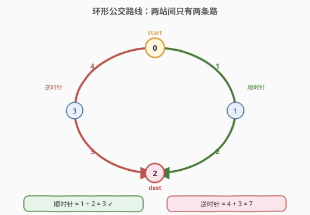
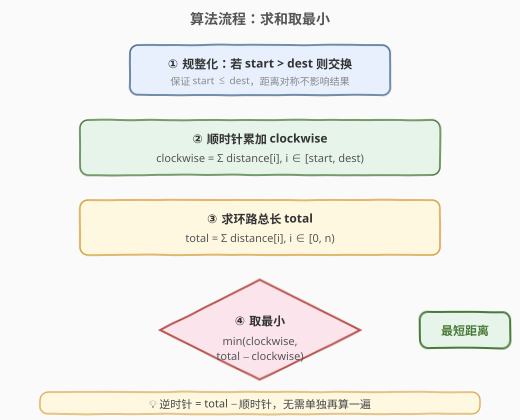
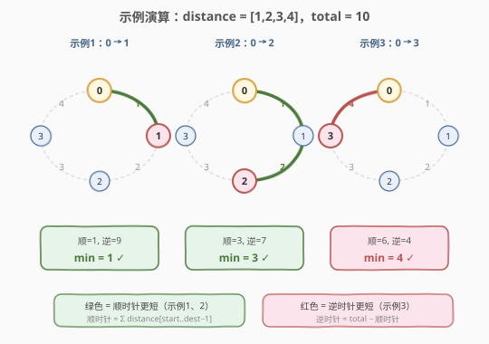

# 公交站间的距离

- **题目名称**：公交站间的距离
- **链接**：[1184. 公交站间的距离](https://leetcode.cn/problems/distance-between-bus-stops/)
- **难度**：简单
- **标签**：数组

## 1. 题目概述

环形公交路线上有 `n` 个站，按次序从 `0` 到 `n - 1` 编号。已知每一对相邻公交站之间的距离：`distance[i]` 表示编号为 `i` 的车站和编号为 `(i + 1) % n` 的车站之间的距离。

环线上的公交车可按**顺时针**和**逆时针**两个方向行驶。返回乘客从出发点 `start` 到目的地 `destination` 之间的**最短距离**。

**示例 1**：

```text
输入：distance = [1,2,3,4], start = 0, destination = 1
输出：1
解释：公交站 0 和 1 之间的距离是 1 或 9，最小值是 1。
```

**示例 2**：

```text
输入：distance = [1,2,3,4], start = 0, destination = 2
输出：3
解释：公交站 0 和 2 之间的距离是 3 或 7，最小值是 3。
```

**示例 3**：

```text
输入：distance = [1,2,3,4], start = 0, destination = 3
输出：4
解释：公交站 0 和 3 之间的距离是 6 或 4，最小值是 4。
```

**约束条件**：

- `1 <= n <= 10^4`
- `distance.length == n`
- `0 <= start, destination < n`
- `0 <= distance[i] <= 10^4`

> 💡 关键在于「**环形**」：任意两站之间恰有两条不重叠的路径（顺时针 / 逆时针），且二者长度之和等于环路总长。所以只需求出其中一条，另一条用总长减去即得，最后取较小者。

---

## 2. 解题思路

### 2.1 暴力思路

模拟两条路径：从 `start` 出发分别沿顺时针、逆时针逐站累加 `distance`，到达 `destination` 时停止，比较两条路径长度取最小值。

这种做法需要分别遍历两次环，且顺时针遍历到 `n-1` 后要绕回 `0`（`i = (i + 1) % n`），代码上要处理环回的下标回绕，略繁琐。

> ⚠️ 暴力法时间 $O(n)$、空间 $O(1)$，复杂度并不差，但有一个更巧妙的观察能把「两条路」简化为「一条路 + 一次减法」。

### 2.2 核心观察：两路互补，求一减总



**核心观察**：环形上任意两站 `start` 与 `destination` 之间的两条路径互为**互补**——它们合起来正好构成整个环路。即：

$$\text{顺时针距离} + \text{逆时针距离} = \text{环路总长} = \sum_{i=0}^{n-1} \text{distance}[i]$$

因此只需算出其中一条（顺时针距离），另一条用 `total − clockwise` 即得：

$$\text{answer} = \min(\text{clockwise},\ \text{total} - \text{clockwise})$$

**如何算顺时针距离？** 由于距离对称（从 A 到 B 与从 B 到 A 相同），可先规整化：若 `start > destination` 则交换二者。规整后 `start ≤ destination`，顺时针路径就是依次经过 `start, start+1, …, destination`，对应边为 `distance[start], distance[start+1], …, distance[destination-1]`：

$$\text{clockwise} = \sum_{i=\text{start}}^{\text{destination}-1} \text{distance}[i]$$

> 💡 **为什么可以交换 `start` 和 `destination`？** 因为题目求的是两站间的最短距离，与行进方向无关——从 0 走到 3 和从 3 走到 0 的两条路径长度完全相同。交换后 `start ≤ destination`，使顺时针累加区间变成一段**连续的下标区间** `[start, destination)`，无需处理环回，一次普通循环即可。

> ⚠️ **不要把 `total` 也用环回累加来算**：`total` 就是整个 `distance` 数组的和，一次遍历累加即可，与方向、起止点都无关。

### 2.3 算法流程图



**完整步骤**：

1. **规整化**：若 `start > destination`，交换二者（保证 `start ≤ destination`）。
2. **顺时针累加**：`clockwise = Σ distance[i]`，`i` 从 `start` 到 `destination - 1`。
3. **求总长**：`total = Σ distance[i]`，`i` 从 `0` 到 `n - 1`。
4. **取最小**：返回 `min(clockwise, total − clockwise)`。

> 💡 步骤 2 和步骤 3 可合并到同一次遍历中：先算出 `total`，再用 `[start, destination)` 区间累加出 `clockwise`，`total − clockwise` 即为逆时针距离。两遍累加也可，常数因子无差别。

### 2.4 示例演算

以 `distance = [1,2,3,4]`、`total = 1+2+3+4 = 10` 为例，观察三个示例：



**示例 1**（`start=0, dest=1`）：

- 规整化：`0 ≤ 1`，无需交换。
- 顺时针：`distance[0] = 1`（区间 `[0, 1)`）。
- 逆时针：`total − 1 = 9`。
- 答案：`min(1, 9) = 1` ✓（顺时针更短，绿色路径）

**示例 2**（`start=0, dest=2`）：

- 规整化：`0 ≤ 2`，无需交换。
- 顺时针：`distance[0] + distance[1] = 1 + 2 = 3`（区间 `[0, 2)`）。
- 逆时针：`total − 3 = 7`。
- 答案：`min(3, 7) = 3` ✓（顺时针更短，绿色路径）

**示例 3**（`start=0, dest=3`）：

- 规整化：`0 ≤ 3`，无需交换。
- 顺时针：`distance[0] + distance[1] + distance[2] = 1 + 2 + 3 = 6`（区间 `[0, 3)`）。
- 逆时针：`total − 6 = 4`。
- 答案：`min(6, 4) = 4` ✓（逆时针更短，红色路径——直接走 `distance[3]=4` 这条边）

> 💡 **示例 3 是本题最易错的点**：直觉上顺时针经过 3 条边（1+2+3=6）似乎「更直接」，但逆时针只走 1 条边（`distance[3]=4`）反而更短。这正是「两路互补」观察的价值——不偏信任一方向，用 `min` 兜底。

---

## 3. 参考代码

### C++

```cpp
class Solution {
public:
    int distanceBetweenBusStops(vector<int>& distance, int start, int destination) {
        if (start > destination) {
            swap(start, destination);
        }
        int clockwise = 0, total = 0;
        for (int i = 0; i < distance.size(); i++) {
            total += distance[i];
            if (i >= start && i < destination) {
                clockwise += distance[i];
            }
        }
        return min(clockwise, total - clockwise);
    }
};
```

> 💡 一次遍历同时累加 `total` 与 `clockwise`（用 `i >= start && i < destination` 判定是否落在顺时针区间内）。最后 `min(clockwise, total − clockwise)` 取较短者。

### Python

```python
class Solution:
    def distanceBetweenBusStops(self, distance: List[int], start: int, destination: int) -> int:
        if start > destination:
            start, destination = destination, start
        clockwise = sum(distance[i] for i in range(start, destination))
        total = sum(distance)
        return min(clockwise, total - clockwise)
```

> 💡 Python 版用切片思维更简洁：`sum(distance[start:destination])` 直接得到顺时针距离（区间 `[start, destination)` 切片），`total` 用 `sum(distance)` 一次求得。两者相减取 `min` 即答案。

---

## 4. 复杂度分析

| 维度 | 复杂度 | 说明 |
|------|--------|------|
| 时间复杂度 | $O(n)$ | 遍历 `distance` 数组常数次（C++ 合并为 1 次，Python 为 2 次） |
| 空间复杂度 | $O(1)$ | 仅用 `clockwise`、`total` 两个累加变量 |

> - $n$ = `distance.length`，即公交站数量。
> - 无论起止点如何，都需要扫描整个数组求 `total`，故时间下界为 $O(n)$，本解法已最优。
> - 空间上无需额外数组，仅常数变量，达到 $O(1)$。

---

## 5. 扩展：为什么不直接模拟双向环回？

暴力法（分别顺/逆时针模拟到目的地）也能 $O(n)$ 通过，但「求一减总」的写法更简洁，原因有二：

1. **避免下标回绕**：顺时针模拟到 `n-1` 后要 `(i+1) % n` 绕回 `0`，逆时针还要 `(i-1+n) % n`，循环终止条件（绕回 `start`）容易写错。规整化 + 区间累加把环路径退化为**线性区间求和**，无回绕。

2. **少一次累加**：算出一条路后，另一条由 `total − clockwise` 直接得到，省去逆时针方向的整段遍历。

> ⚠️ 若把题目改成「**有向**环」（每条边只能单向通行），则两条路不再互补，必须按允许方向模拟，本解法不再适用。本题明确双向可走，故互补关系成立。

---

## 6. 面试要点

1. **为什么可以交换 `start` 和 `destination`？**

   > 题目求两站间最短距离，与行进方向无关——A 到 B 和 B 到 A 的两条路径长度完全相同。交换后保证 `start ≤ destination`，使顺时针累加区间变成连续下标区间 `[start, destination)`，避免环回下标处理。

2. **两条路径为什么互补？**

   > 环形上任意两站把环路分成两段不重叠的弧，两段弧合起来正好是整个环。故 `顺时针 + 逆时针 = total`，算出一条另一条即 `total − 这条`，无需重复遍历。

3. **如果 `start == destination` 怎么办？**

   > 规整化后区间 `[start, destination)` 为空，`clockwise = 0`，`total − 0 = total`，`min(0, total) = 0`。起点即终点，距离为 0，结果正确，无需特判。

4. **能否用前缀和优化到 $O(1)$ 查询？**

   > 可以。预处理前缀和 `prefix[i] = Σ distance[0..i-1]`，则任意区间 `[l, r)` 的顺时针距离 `= prefix[r] − prefix[l]`（规整化后）。若题目变为**多次查询**不同 `(start, destination)` 对，前缀和把每次查询降到 $O(1)$，总长 `total = prefix[n]` 一次预存。本题单次查询，$O(n)$ 已足够，前缀和反而多花 $O(n)$ 空间，不划算。

5. **`distance[i]` 可能为 0，对结果有影响吗？**

   > 无影响。`distance[i] = 0` 表示相邻两站重合（距离为 0），累加时贡献 0，不改变 `clockwise` 与 `total` 的相对大小关系，`min` 仍正确。约束允许 `0 <= distance[i]`，代码无需特殊处理。

> 💡 **一句话总结**：1184 是「**环形两路互补**」的招牌题——环形上两站间恰有两条互补路径，长度和为环路总长。规整化起止点后用一次区间求和算出顺时针距离，逆时针距离 `= total − 顺时针`，取 `min` 即答案。$O(n)$ / $O(1)$，核心是把「环」退化为「线性区间求和」。

---

## 7. 同类练习题

- [918. 环形子数组的最大和](https://leetcode.cn/problems/maximum-sum-circular-subarray/)（[题解](../0901-1000/918_最大环形子数组和.md)）：同样利用「环形 = 线性 + 取补」思想，用 `total − min_sum` 求跨越边界的最大和，与 1184 的 `total − clockwise` 互补思路一脉相承
- [53. 最大子数组和](https://leetcode.cn/problems/maximum-subarray/)（[题解](../0001-0100/53_最大子数组和.md)）：线性区间求和的基础（Kadane），918 的线性退化版，理解 1184 区间累加的前置
- [303. 区域和检索 - 数组不可变](https://leetcode.cn/problems/range-sum-query-immutable/)：前缀和做区间求和的模板，对应 1184 面试要点 4 中「多次查询 $O(1)$」的进阶思路
