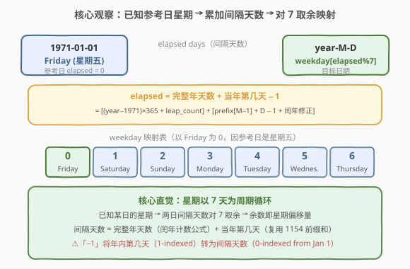
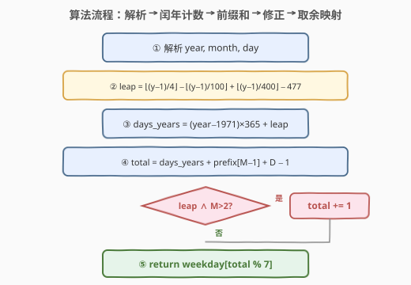
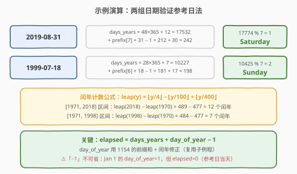

# LeetCode 一周中的第几天 题解

## 1. 题目概述

- **标题 / 题号**：一周中的第几天（#1185，easy）
- **链接**：https://leetcode.cn/problems/day-of-the-week/
- **难度**：简单
- **标签**：数学

**题意**：给你一个日期，请你设计一个算法来判断它是对应一周中的哪一天。

输入为三个整数 `day`、`month` 和 `year`，分别表示日、月、年。返回的结果需是 `{"Sunday", "Monday", "Tuesday", "Wednesday", "Thursday", "Friday", "Saturday"}` 中的一个。

**示例 1**：

```text
输入：day = 31, month = 8, year = 2019
输出："Saturday"
```

**示例 2**：

```text
输入：day = 18, month = 7, year = 1999
输出："Sunday"
```

**示例 3**：

```text
输入：day = 15, month = 8, year = 1993
输出："Sunday"
```

**约束**：

- 给出的日期一定是在 **1971 到 2100 年**之间的有效日期。

> 💡 本题的关键在于：星期以 **7 天为周期**循环。只要知道某个参考日是星期几，再算出目标日与参考日之间的**间隔天数**，对 7 取余即可映射回星期名。间隔天数的计算复用 [1154. 一年中的第几天](1154_一年中的第几天.md) 的前缀和与闰年判定，是一道「日期数学」综合题。

## 2. 解题思路

### 2.1 暴力思路：逐日累加

最直觉的做法是：选定一个已知星期的参考日（如 1971-01-01 是星期五），然后**从参考日逐天向目标日推进**，每过一天星期推后一位，最终到达目标日即得答案。

```text
weekday = "Friday"   # 1971-01-01
for each day from 1971-01-01 to target:
    weekday = next(weekday)
return weekday
```

这种写法正确但极慢——最坏情况下需遍历近 **47000 天**（1971 到 2100 全跨度），时间 $O(N)$ 其中 $N$ 为间隔天数。虽然在本题约束下勉强可过，但完全没必要逐日推进：**间隔天数可以一次性算出来**。

> 💡 另一种「暴力」是直接调用标准库——Python 的 `datetime.date(year, month, day).strftime("%A")`，C++ 的 `tm` + `mktime` + `strftime`。一行搞定且正确，但面试中无法展示对日期计算的理解，适合作为对照而非主解。

### 2.2 核心观察：参考日 + 间隔天数公式 O(1)



关键观察：**星期以 7 天为周期循环**。已知 1971-01-01 是星期五，只需算出目标日与参考日的**间隔天数** `elapsed`，则 `elapsed % 7` 就是星期偏移量：

$$\text{weekday\_index} = \text{elapsed} \bmod 7$$

映射表（以 Friday 为 0，因参考日是星期五）：`0→Friday, 1→Saturday, 2→Sunday, 3→Monday, 4→Tuesday, 5→Wednesday, 6→Thursday`。

间隔天数 `elapsed` 分解为两部分：

$$\text{elapsed} = \underbrace{(\text{完整年天数})}_{\text{1971 \sim year-1}} + \underbrace{(\text{当年第几天} - 1)}_{\text{Jan 1 \sim 目标日}}$$

> 💡 **为什么「−1」？** `当年第几天`（day_of_year）是 1-indexed——Jan 1 的 day_of_year = 1。但间隔天数是 0-indexed——参考日当天 elapsed = 0。因此 `elapsed_in_year = day_of_year - 1`，把 1-indexed 转为 0-indexed。

#### 完整年天数

1971 到 year−1 的完整年天数 = 平年贡献 + 闰年额外天数：

$$\text{days\_years} = (Y - 1971) \times 365 + \text{leap\_count}(Y-1) - \text{leap\_count}(1970)$$

其中**闰年计数公式**（计数 1 到 $y$ 年中的闰年个数）：

$$\text{leap\_count}(y) = \left\lfloor\frac{y}{4}\right\rfloor - \left\lfloor\frac{y}{100}\right\rfloor + \left\lfloor\frac{y}{400}\right\rfloor$$

减去 `leap_count(1970)` 是因为只计 1971 年起的闰年。`leap_count(1970) = 492 - 19 + 4 = 477`。

#### 当年第几天

复用 [1154. 一年中的第几天](1154_一年中的第几天.md) 的前缀和 + 闰年修正：

$$\text{day\_of\_year} = \text{prefix}[M-1] + D + \begin{cases} 1 & \text{isLeap}(Y) \wedge M > 2 \\ 0 & \text{otherwise} \end{cases}$$

其中 `prefix = [0, 31, 59, 90, 120, 151, 181, 212, 243, 273, 304, 334]`（平年前缀和表），闰年判定复用 [1118. 一月有多少天](1118_一月有多少天.md) 的三规则：`(Y%4==0 ∧ Y%100≠0) ∨ Y%400==0`。

> ⚠️ **世纪年陷阱**：在 1971–2100 范围内，**2000 是闰年**（÷400=0），**2100 不是闰年**（÷100=0 但 ÷400≠0）。只记「÷4 即闰」会把 2100 误判为闰年，多算 1 天。

### 2.3 算法流程图



流程五步走，每步 $O(1)$：解析 year/month/day → 闰年计数公式算完整年天数 → 前缀和 + day − 1 算当年间隔 → 闰年修正（条件加 1）→ 对 7 取余映射回星期名。

### 2.4 示例演算



以两组输入验证：

| 日期 | days_years | day_of_year | elapsed | elapsed % 7 | 星期 |
|------|------------|-------------|---------|-------------|------|
| 2019-08-31 | 48×365 + 12 = 17532 | 212 + 31 = 243 | 17532 + 242 = 17774 | 1 | Saturday |
| 1999-07-18 | 28×365 + 7 = 10227 | 181 + 18 = 199 | 10227 + 198 = 10425 | 2 | Sunday |

> 💡 注意 `elapsed = days_years + day_of_year - 1`：2019-08-31 的 day_of_year = 243，但 elapsed 中的当年部分是 243 − 1 = 242（Jan 1 当天是 0 天间隔）。17774 % 7 = 1 → Saturday ✓

## 3. 参考代码

### C++（参考日 + 间隔天数公式）

```cpp
class Solution {
public:
    string dayOfTheWeek(int day, int month, int year) {
        vector<string> weekdays = {"Friday", "Saturday", "Sunday",
                                   "Monday", "Tuesday", "Wednesday", "Thursday"};
        int prefix[] = {0, 31, 59, 90, 120, 151, 181, 212, 243, 273, 304, 334};

        int leap = leapCount(year - 1) - leapCount(1970);
        int total = (year - 1971) * 365 + leap;
        total += prefix[month - 1] + day - 1;
        if (isLeap(year) && month > 2) total += 1;

        return weekdays[total % 7];
    }
private:
    int leapCount(int y) {
        return y / 4 - y / 100 + y / 400;
    }
    bool isLeap(int y) {
        return (y % 4 == 0 && y % 100 != 0) || (y % 400 == 0);
    }
};
```

### Python（参考日 + 间隔天数公式）

```python
class Solution:
    def dayOfTheWeek(self, day: int, month: int, year: int) -> str:
        weekdays = ["Friday", "Saturday", "Sunday",
                    "Monday", "Tuesday", "Wednesday", "Thursday"]
        prefix = [0, 31, 59, 90, 120, 151, 181, 212, 243, 273, 304, 334]

        def leap_count(y):
            return y // 4 - y // 100 + y // 400

        leap = leap_count(year - 1) - leap_count(1970)
        total = (year - 1971) * 365 + leap
        total += prefix[month - 1] + day - 1
        if self._is_leap(year) and month > 2:
            total += 1

        return weekdays[total % 7]

    def _is_leap(self, y: int) -> bool:
        return (y % 4 == 0 and y % 100 != 0) or (y % 400 == 0)
```

### Python（标准库一行流，对比用）

```python
import datetime

class Solution:
    def dayOfTheWeek(self, day: int, month: int, year: int) -> str:
        return datetime.date(year, month, day).strftime("%A")
```

> ⚠️ **两种写法的对比**：`datetime` 写法简洁且不易出错，适合工程脚本；但参考日法是面试中期望的「手撕日期计算」解法，展示了对闰年规则、前缀和和模运算的精确控制。面试时建议先写参考日法，再提及 `datetime` 作为对照。

## 4. 复杂度分析

| 维度 | 复杂度 | 说明 |
|------|--------|------|
| 时间复杂度 | $O(1)$ | 闰年计数 3 次整除 + 前缀和 1 次查表 + 闰年判定 3 次取模 + 1 次取余，全部常数操作 |
| 空间复杂度 | $O(1)$ | 12 元素定长前缀和数组 + 7 元素星期名数组，常数空间 |

> ⚠️ 时间严格 $O(1)$：无论日期如何，操作次数固定，不随输入规模增长。逐日累加法最坏需遍历近 47000 天，虽也能 AC 但远非最优。

## 5. 扩展：蔡勒公式与 Sakamoto 算法

### 5.1 蔡勒公式（Zeller's Congruence）

蔡勒公式是直接由日期算星期的**经典天文公式**，无需参考日，一步到位：

$$h = \left(q + \left\lfloor\frac{13(m+1)}{5}\right\rfloor + K + \left\lfloor\frac{K}{4}\right\rfloor + \left\lfloor\frac{J}{4}\right\rfloor - 2J\right) \bmod 7$$

其中：
- $q$ = 日号，$m$ = 月份（1/2 月视为上年 13/14 月，year 减 1）
- $K = Y \bmod 100$（年份后两位），$J = \lfloor Y / 100 \rfloor$（世纪）
- $h$：0=Saturday, 1=Sunday, 2=Monday, ..., 6=Friday

```cpp
class Solution {
public:
    string dayOfTheWeek(int day, int month, int year) {
        vector<string> names = {"Saturday", "Sunday", "Monday",
                                "Tuesday", "Wednesday", "Thursday", "Friday"};
        if (month < 3) { month += 12; year--; }
        int q = day, m = month;
        int K = year % 100, J = year / 100;
        int h = (q + (13 * (m + 1)) / 5 + K + K / 4 + J / 4 - 2 * J) % 7;
        h = (h + 7) % 7;
        return names[h];
    }
};
```

> 💡 `h = (h + 7) % 7` 防止 C++ 负数取余（本题年份范围内结果恒正，但加保险更稳健）。公式中 $\lfloor 13(m+1)/5 \rfloor$ 是「月份偏移常数」——它编码了一年中各月累计天数的模 7 余数规律。

### 5.2 Sakamoto 算法（紧凑版）

Sakamoto 算法是蔡勒公式的**极致压缩版**，用一张查表替代了月份偏移计算：

```cpp
class Solution {
public:
    string dayOfTheWeek(int day, int month, int year) {
        vector<string> names = {"Sunday", "Monday", "Tuesday",
                                "Wednesday", "Thursday", "Friday", "Saturday"};
        int t[] = {0, 3, 2, 5, 0, 3, 5, 1, 4, 6, 2, 4};
        year -= month < 3;
        int h = (year + year / 4 - year / 100 + year / 400 + t[month - 1] + day) % 7;
        h = (h + 7) % 7;
        return names[h];
    }
};
```

返回 0=Sunday, 1=Monday, ..., 6=Saturday。`t[]` 表编码了各月对星期的偏移贡献（已内含闰年对 1/2 月的修正）。`year -= month < 3` 一行完成「1/2 月归到上年」的调整。

**三种解法对比**：

| 解法 | 时间 | 空间 | 特点 |
|------|------|------|------|
| 参考日 + 公式 | $O(1)$ | $O(1)$ | 思路最直观，复用 1154 子例程，可推广到日期差 |
| 蔡勒公式 | $O(1)$ | $O(1)$ | 无需参考日，纯公式，但推导复杂 |
| Sakamoto | $O(1)$ | $O(1)$ | 蔡勒的压缩版，代码最短，但 t[] 表需记忆 |

> 💡 面试中推荐**参考日法**：思路清晰、可解释性强，且能展示对闰年规则和前缀和的掌握。蔡勒公式和 Sakamoto 算法更像是「知道就知道」的技巧，适合作为扩展提及。

## 6. 面试要点

1. **为什么选 1971-01-01 作为参考日？**

   > 题目约束年份范围为 1971–2100，1971-01-01 是范围内最早的有效日期。它的星期可以预先查得（Friday），作为 elapsed = 0 的锚点。选参考日的原则是：在约束范围内、星期已知、尽量靠前以减少计算量。Unix 时间戳的起点 1970-01-01 是 Thursday，也可作为参考，但不在题目约束范围内。

2. **为什么 elapsed 公式里要「−1」？**

   > `day_of_year` 是 1-indexed——Jan 1 的 day_of_year = 1。但间隔天数是 0-indexed——参考日当天（Jan 1）的 elapsed = 0（没有过去任何天）。因此 `elapsed_in_year = day_of_year - 1`。漏掉这个「−1」会导致所有日期的星期偏移 +1，即 Friday 被算成 Saturday。

3. **闰年计数公式 `leap_count(y) = y/4 - y/100 + y/400` 的原理是什么？**

   > 这是容斥原理：`y/4` 计数所有 4 的倍数年（闰年候选），`y/100` 减去 100 的倍数年（非闰年），`y/400` 加回 400 的倍数年（又是闰年）。`leap_count(Y-1) - leap_count(1970)` 即得 [1971, Y-1] 区间内的闰年个数，避免了逐年循环判定。

4. **2100 年是闰年吗？**

   > 2100 **不是**闰年。格里高利历规则：能被 4 整除且不能被 100 整除，或能被 400 整除。2100 能被 100 整除但不能被 400 整除 → 平年。2000 能被 400 整除 → 闰年。在 1971–2100 范围内，2100 是唯一的世纪年陷阱（1900 不在范围内）。

5. **如果题目改成求两个日期之间的天数差，怎么扩展？**

   > [1360. 日期之间隔几天](https://leetcode.cn/problems/number-of-days-between-two-dates/)：分别算出两个日期距参考日的 elapsed，再做差即可。核心子例程仍是本题的「elapsed 计算」+ 1154 的「年内第几天」+ 1118 的闰年判定。

> 💡 **一句话总结**：1185 的核心是「参考日 + 间隔天数 % 7」——以 1971-01-01（Friday）为锚点，用闰年计数公式算完整年天数、用 1154 的前缀和算当年第几天，二者之和减 1 即间隔天数，对 7 取余映射回星期名。全程 $O(1)$。

## 同类练习题

| # | 题目 | 与本题的关联 |
|---|------|-------------|
| 1154 | [一年中的第几天](https://leetcode.cn/problems/day-of-the-year/)（[题解](1154_一年中的第几天.md)） | 本题的直接子问题——「当年第几天」的前缀和 + 闰年修正在 1185 中作为子例程复用 |
| 1118 | [一月有多少天](https://leetcode.cn/problems/number-of-days-in-a-month/)（[题解](1118_一月有多少天.md)） | 格里高利历闰年三规则的母题，1185 的 `isLeap` 和 `leapCount` 均基于此规则 |
| 1360 | [日期之间隔几天](https://leetcode.cn/problems/number-of-days-between-two-dates/) | 求两日期相差天数，是 1185 的自然扩展——分别算 elapsed 再做差，核心仍是间隔天数计算 |
| 172 | [阶乘后的零](https://leetcode.cn/problems/factorial-trailing-zeroes/)（[题解](../0101-0200/172_阶乘后的零.md)） | 同为「数学公式降维」——用勒让德公式 $v_5(n!) = \sum\lfloor n/5^i \rfloor$ 替代逐个枚举，与 1185 用闰年计数公式替代逐年循环思路同源 |
