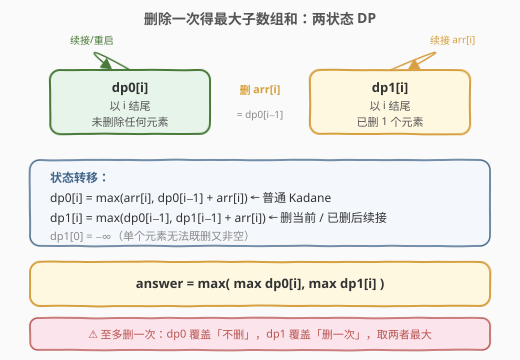
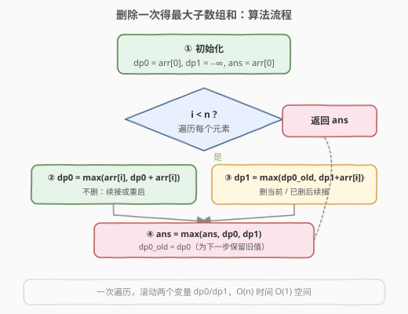

# 删除一次得到子数组最大和

- **题目名称**：删除一次得到子数组最大和
- **链接**：[1186. 删除一次得到子数组最大和](https://leetcode.cn/problems/maximum-subarray-sum-with-one-deletion/)
- **难度**：中等
- **标签**：数组、动态规划、Kadane 算法

## 1. 题目概述

给你一个整数数组，返回它的某个**非空**子数组（连续元素）在执行**一次可选的删除操作**后，所能得到的最大元素总和。换句话说，你可以从原数组中选出一个子数组，并可以决定要不要从中删除一个元素（只能删一次），删除后子数组中至少应当有一个元素。

> 💡 本题是 [53. 最大子数组和](../0001-0100/53_最大子数组和.md) 的进阶：在 Kadane「以 i 结尾的最大和」基础上，多了一个「可以删掉一个元素」的选项。

**示例 1**：

```text
输入：arr = [1,-2,0,3]
输出：4
解释：选出 [1, -2, 0, 3]，删掉 -2，得到 [1, 0, 3]，和为 4。
```

**示例 2**：

```text
输入：arr = [1,-2,-2,3]
输出：3
解释：直接选出 [3]，和最大。
```

**示例 3**：

```text
输入：arr = [-1,-1,-1,-1]
输出：-1
解释：子数组不能为空，不能删掉唯一的元素得到 0；选 [-1] 或 [-1,-1] 删一均为 -1。
```

**约束条件**：

- `1 <= arr.length <= 10^5`
- `-10^4 <= arr[i] <= 10^4`

---

## 2. 解题思路

### 2.1 暴力思路

枚举所有子数组 `[i, j]`，再枚举其中删不删、删哪一个位置，计算剩余元素之和取最大。子数组 $O(n^2)$ 个、删位置 $O(n)$ 种、求和 $O(n)$，总复杂度 $O(n^4)$。即便用前缀和优化求和到 $O(1)$ 仍有 $O(n^3)$，对 $n = 10^5$ 完全不可行。

### 2.2 核心观察：两状态 DP（不删 / 删一次）



借鉴 [53 题 Kadane](../0001-0100/53_最大子数组和.md)「以 `i` 结尾」的状态设计，本题的关键是**给「是否已经用过删除机会」加一维状态**。定义两个滚动状态：

- `dp0[i]`：以 `arr[i]` 结尾、**没有删除任何元素**的最大子数组和（普通 Kadane）。
- `dp1[i]`：以 `arr[i]` 结尾、**恰好删除过一个元素**的最大子数组和。

> 💡 **为什么用「以 i 结尾」而非「区间」？** Kadane 的精髓在于无后效性：只关心「以 i 结尾的最优和」，不需要记录起点。加上「删没删过」这一维后，状态依然只依赖前一位，转移 $O(1)$。

**状态转移**：

对于 `dp0`，和普通 Kadane 完全一致——要么续接前一段，要么从当前元素重启：

$$dp0[i] = \max(\,arr[i],\ dp0[i-1] + arr[i]\,)$$

对于 `dp1`，删除的那一个元素有两种身份，取较优：

1. **删的就是当前 `arr[i]`**：那么删掉它后子数组实际以 `i-1` 结尾（且此前没删过），即 $dp0[i-1]$。
2. **删的在前面的某处**：此前已经删过一个，现在把 `arr[i]` 直接续接上去，即 $dp1[i-1] + arr[i]$。

$$dp1[i] = \max(\,dp0[i-1],\ dp1[i-1] + arr[i]\,)$$

> ⚠️ **边界 `dp1[0]`**：只有 `arr[0]` 一个元素时，删掉它子数组就空了，违反「非空」约束。故 $dp1[0] = -\infty$，表示非法状态，不会影响取 max。

最终答案是「不删」与「删一次」两条线的全局最大值：

$$\text{answer} = \max\Big(\max_i dp0[i],\ \max_i dp1[i]\Big)$$

### 2.3 算法流程图



由于每个状态只依赖前一位，可用两个变量 `dp0`、`dp1` 滚动替代数组，空间降到 $O(1)$。注意更新 `dp1` 时要用**旧**的 `dp0`（即 `dp0[i-1]`），所以要先用临时变量保存 `old_dp0`。

### 2.4 示例演算

![示例演算：arr = [1, −2, 0, 3]](../images/maxsubarr1del_example_walkthrough.svg)

以 `arr = [1, -2, 0, 3]` 为例：

| 步骤 | arr[i] | dp0（不删） | dp1（删1次） | ans | 说明 |
|------|--------|------------|-------------|-----|------|
| i=0 | 1 | 1 | −∞ | 1 | 初始化，单元素无法删 |
| i=1 | −2 | max(−2, 1−2)=−1 | max(dp0₀, −∞−2)=1 | 1 | dp1 删掉 −2，留 [1] |
| i=2 | 0 | max(0, −1+0)=0 | max(dp0₁, 1+0)=1 | 1 | dp1 续接：[1,0] 删 −2 |
| i=3 | 3 | max(3, 0+3)=3 | max(dp0₂, 1+3)=**4** | **4** | dp1 续接：[1,0,3] 删 −2 |

答案 `ans = 4`，对应子数组 `[1, -2, 0, 3]` 删去 `−2` 后 `[1, 0, 3]` 之和。

---

## 3. 参考代码

### C++

```cpp
class Solution {
  public:
    int maximumSum(vector<int>& arr) {
        int n = arr.size();
        int dp0 = arr[0];          // 以 i 结尾、不删的最大和
        int dp1 = INT_MIN / 2;     // 以 i 结尾、删一次的最大和（单元素非法）
        int ans = arr[0];

        for (int i = 1; i < n; i++) {
            int old_dp0 = dp0;
            dp0 = max(arr[i], dp0 + arr[i]);        // 普通 Kadane
            dp1 = max(old_dp0, dp1 + arr[i]);      // 删当前 / 已删后续接
            ans = max(ans, max(dp0, dp1));
        }
        return ans;
    }
};
```

### Python

```python
class Solution:
    def maximumSum(self, arr: List[int]) -> int:
        dp0 = arr[0]            # 以 i 结尾、不删的最大和
        dp1 = float('-inf')     # 以 i 结尾、删一次的最大和
        ans = arr[0]

        for i in range(1, len(arr)):
            old_dp0 = dp0
            dp0 = max(arr[i], dp0 + arr[i])        # 普通 Kadane
            dp1 = max(old_dp0, dp1 + arr[i])      # 删当前 / 已删后续接
            ans = max(ans, dp0, dp1)
        return ans
```

> ⚠️ **`INT_MIN / 2` 而非 `INT_MIN`**：C++ 中 `dp1 + arr[i]` 可能与 `INT_MIN` 相加导致溢出（`arr[i]` 为负时 `INT_MIN - 1` 溢出）。用 `INT_MIN / 2` 既足够小代表非法，又留出运算余量。Python 无此问题，直接 `float('-inf')`。

> 💡 **`old_dp0` 的作用**：`dp1` 的转移需要 `dp0[i-1]`，而 `dp0` 在上一行已被更新成 `dp0[i]`。因此必须先存 `old_dp0 = dp0` 再更新 `dp0`，否则 `dp1` 会错误地用上「当前位未删」的值。

---

## 4. 复杂度分析

| 维度 | 复杂度 | 说明 |
|------|--------|------|
| 时间复杂度 | $O(n)$ | 只遍历数组一次，每次迭代做 $O(1)$ 的两个状态更新 |
| 空间复杂度 | $O(1)$ | 仅用 `dp0`、`dp1`、`old_dp0`、`ans` 四个变量 |

---

## 5. 扩展：前缀和 + 拼接视角

本题还有一种等价的前缀和视角：选定子数组 `[l, r]` 后删除其中某个 `arr[k]`，其和为

$$\text{sum} = (\text{prefix}[r+1] - \text{prefix}[k]) + (\text{prefix}[k] - \text{prefix}[l]) - arr[k]$$

化简为「`[l, r]` 的前缀和再扣掉区间内最小的 `arr[k]`」。于是问题转化为：对每个右端点 `r`，维护历史前缀和的最小值与历史 `arr[k]` 的最小值。这种思路与上述两状态 DP 等价，但状态定义不如 Kadane 式直观，适合用来交叉验证。

此外，若把「删一次」推广为「**至多删 k 次**」，则需将状态扩展为 `dp0..dpk` 共 $k+1$ 个滚动变量，转移变为 $dp_j[i] = \max(dp_{j-1}[i-1],\ dp_j[i-1] + arr[i])$，时间 $O(nk)$、空间 $O(k)$。

---

## 6. 面试要点

1. **为什么用两个状态 dp0/dp1 而不是一个？**

   「不删」和「删一次」是两种不可混淆的处境：删过之后才允许「跳过当前元素」（即 `dp0[i-1]` 这一支），没删过则只能走普通 Kadane。若合并成一个状态会丢失「是否还有删除额度」的信息，无法正确转移。

2. **`dp1[i] = max(dp0[i-1], dp1[i-1] + arr[i])` 两项分别代表什么？**

   - `dp0[i-1]`：把删除机会用在当前 `arr[i]` 上，子数组实际终止于 `i-1`（此前未删）。
   - `dp1[i-1] + arr[i]`：删除机会已在更早处用掉，当前 `arr[i]` 直接续接。

3. **为什么 `dp1[0]` 要设成 −∞？**

   只有一个元素时删掉它子数组即空，违反「非空」约束。设成 −∞ 使该非法状态永远不会被 `max` 选中。

4. **为什么答案要同时取 `max(dp0)` 和 `max(dp1)`？**

   题目允许「至多删一次」，即可以一次都不删。`dp0` 覆盖「不删」的全局最优（如示例 2 直接取 `[3]`），`dp1` 覆盖「删一次」的全局最优（如示例 1），取两者最大才完整。

5. **和 [53. 最大子数组和](../0001-0100/53_最大子数组和.md) 的关系？**

   53 是本题 `dp1` 恒为 −∞ 的退化情形（不允许删）。本题在 53 的 Kadane 上加一个「删一次」的平行状态，转移仍是 $O(1)$。掌握 53 后，本题增量在于「给状态加一维记录额度」这一通用技巧。

---

## 7. 同类练习题

- [53. 最大子数组和](https://leetcode.cn/problems/maximum-subarray/)（[题解](../0001-0100/53_最大子数组和.md)）：Kadane 基础模板，本题的前置题
- [918. 环形子数组的最大和](https://leetcode.cn/problems/maximum-sum-circular-subarray/)（[题解](../0901-1000/918_最大环形子数组和.md)）：Kadane 环形变体，补集思想
- [152. 乘积最大子数组](https://leetcode.cn/problems/maximum-product-subarray/)（[题解](../0101-0200/152_乘积最大子数组.md)）：维护 max/min 两状态的 Kadane
- [1749. 任意子数组和的绝对值的最大值](https://leetcode.cn/problems/maximum-absolute-sum-of-any-subarray/)：同时维护最大/最小子数组和
- [2321. 拼接数组的最大分数](https://leetcode.cn/problems/maximum-score-of-spliced-array/)：两段拼接求最大子数组和，Kadane 区间交换思想
