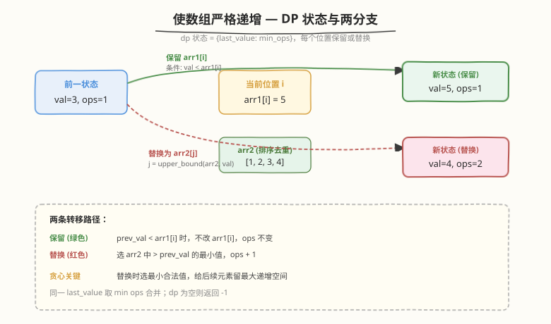
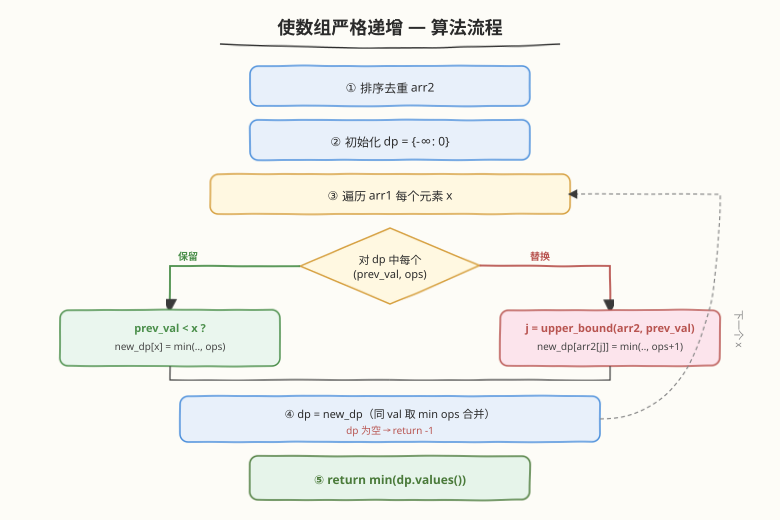
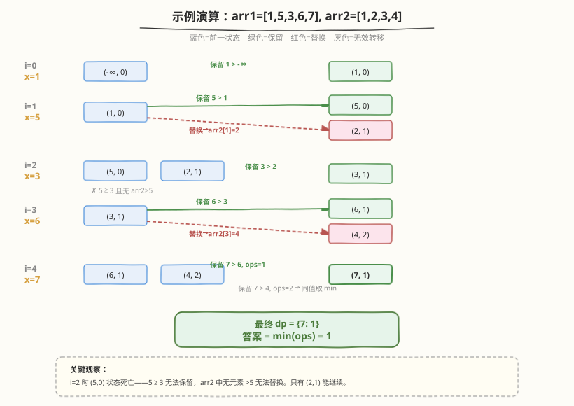

# 使数组严格递增

- **题目名称**：使数组严格递增
- **链接**：[1187. 使数组严格递增](https://leetcode.cn/problems/make-array-strictly-increasing/)
- **难度**：困难
- **标签**：动态规划、贪心、二分查找

## 1. 题目概述

给定两个整数数组 `arr1` 和 `arr2`，每次操作可以选取 `arr1[i]` 并将其替换为 `arr2` 中的任意元素。返回使 `arr1` **严格递增**所需的最少操作数；若无法实现，返回 `-1`。

**示例 1**：

```text
输入：arr1 = [1,5,3,6,7], arr2 = [1,3,2,4]
输出：1
解释：用 2 替换 5，得到 arr1 = [1, 2, 3, 6, 7]。
```

**示例 2**：

```text
输入：arr1 = [1,5,3,6,7], arr2 = [4,3,1]
输出：2
解释：用 3 替换 5，用 4 替换 3，得到 arr1 = [1, 3, 4, 6, 7]。
```

**示例 3**：

```text
输入：arr1 = [1,5,3,6,7], arr2 = [1,6,3,3]
输出：-1
解释：无法使 arr1 严格递增。
```

**约束条件**：

- `1 <= arr1.length, arr2.length <= 2000`
- `0 <= arr1[i], arr2[i] <= 10^9`

> 💡 本题是**动态规划 + 贪心**的经典组合。核心难点在于：每个位置有「保留」和「替换」两种选择，替换时从 `arr2` 中选哪个值最优？答案是**贪心地选最小合法值**——给后续元素留最大的递增空间。这与 [300. 最长递增子序列](../0201-0300/300_最长递增子序列.md) 的「严格递增」约束一脉相承，但增加了「替换」这一操作维度。

---

## 2. 解题思路

### 2.1 暴力思路：枚举所有替换方案

对 `arr1` 的每个位置，要么保留原值，要么从 `arr2` 中选一个替换。共有 $2^n$ 种方案（每个位置保留或替换，替换时还有 $m$ 种选择）。暴力枚举所有方案并检查严格递增性，取操作数最小者。时间 $O(2^n \cdot m^n)$，完全不可行。

### 2.2 核心观察：DP + 贪心替换



**状态定义**：`dp` 是一个映射 `{last_value: min_ops}`，表示处理到当前位置时，最后一个元素的值为 `last_value` 时的最少操作数。

**两条转移路径**（对 `dp` 中的每个状态 `(prev_val, ops)`）：

| 路径 | 条件 | 新状态 | 说明 |
|------|------|--------|------|
| **保留** | `prev_val < arr1[i]` | `(arr1[i], ops)` | 不改 `arr1[i]`，操作数不变 |
| **替换** | `arr2` 中存在 `> prev_val` 的元素 | `(min{arr2[j] > prev_val}, ops+1)` | 选最小合法值，操作数 +1 |

> 💡 **贪心关键**：替换时为什么选 `arr2` 中 `> prev_val` 的**最小值**？因为替换的代价固定为 1 次操作，无论选哪个 `arr2[j]` 都一样。但更小的当前值能给后续元素留出更大的递增空间——后续位置更容易满足 `prev_val < arr1[i+1]`，也更容易找到合法的替换值。这是**同代价下选最小值**的贪心思想。

> ⚠️ **状态合并**：多条转移路径可能产生相同的 `last_value`（例如保留 `arr1[i]` 和替换为 `arr2[j]` 恰好等于 `arr1[i]`），此时取 `min ops` 合并。若某步 `dp` 变空，说明无合法方案，返回 `-1`。

### 2.3 算法流程图



**完整步骤**：

1. **排序去重** `arr2`：去重后用二分查找快速定位「`> prev_val` 的最小元素」
2. **初始化** `dp = {-∞: 0}`：哨兵 `-∞` 表示第一个元素前无约束（所有值 $\geq 0$，用 `-1` 或 `-∞` 均可）
3. **遍历** `arr1` 的每个元素 `x`：
   - 对 `dp` 中每个 `(prev_val, ops)`：
     - **保留**：若 `prev_val < x`，候选 `new_dp[x] = min(new_dp[x], ops)`
     - **替换**：`j = upper_bound(arr2, prev_val)`，若 `j` 合法，候选 `new_dp[arr2[j]] = min(new_dp[arr2[j]], ops + 1)`
   - `dp = new_dp`；若 `dp` 为空 → 返回 `-1`
4. **返回** `min(dp.values())`

### 2.4 示例演算

以 `arr1 = [1,5,3,6,7]`, `arr2 = [1,2,3,4]`（排序去重后）为例：



**逐步状态**：

| 步骤 | `arr1[i]` | 前一状态 `dp` | 转移 | 新状态 `new_dp` |
|------|-----------|--------------|------|----------------|
| 0 | 1 | `{-∞: 0}` | 保留 1（1 > −∞） | `{1: 0}` |
| 1 | 5 | `{1: 0}` | 保留 5（5 > 1）；替换→2（`upper_bound(arr2,1)=1`） | `{5: 0, 2: 1}` |
| 2 | 3 | `{5: 0, 2: 1}` | (5,0)：5≥3 无法保留，无 `arr2>5` 无法替换 → **死亡**；(2,1)：保留 3（3 > 2） | `{3: 1}` |
| 3 | 6 | `{3: 1}` | 保留 6（6 > 3）；替换→4（`upper_bound(arr2,3)=3`） | `{6: 1, 4: 2}` |
| 4 | 7 | `{6: 1, 4: 2}` | (6,1)：保留 7（ops=1）；(4,2)：保留 7（ops=2）→ 同值取 min | `{7: 1}` |

最终 `dp = {7: 1}`，答案 `min(ops) = 1`。

> 💡 **关键观察**：步骤 2 中状态 `(5, 0)` 虽然 ops 最少，但 `5 ≥ 3` 无法保留，且 `arr2` 中无元素 `> 5` 无法替换，该状态**死亡**。只有 ops 更多的 `(2, 1)` 存活——这说明贪心替换的价值：用更小的值替换，虽然多花 1 次操作，但换来了后续的生存空间。

---

## 3. 参考代码

### C++

```cpp
// 使数组严格递增.cpp —— DP + 贪心替换
// 编译: g++ -O2 -std=c++17 使数组严格递增.cpp -o masi
class Solution {
public:
    int makeArrayIncreasing(vector<int>& arr1, vector<int>& arr2) {
        sort(arr2.begin(), arr2.end());
        arr2.erase(unique(arr2.begin(), arr2.end()), arr2.end());

        const int INF = 1e9;
        map<int, int> dp;       // {last_value: min_ops}
        dp[-1] = 0;             // 哨兵：所有值 >= 0，-1 < 任何合法值

        for (int x : arr1) {
            map<int, int> ndp;
            for (auto& [v, ops] : dp) {
                // 保留 arr1[i] = x
                if (v < x) {
                    auto it = ndp.find(x);
                    if (it == ndp.end() || it->second > ops)
                        ndp[x] = ops;
                }
                // 替换为 arr2 中 > v 的最小值
                auto it = upper_bound(arr2.begin(), arr2.end(), v);
                if (it != arr2.end()) {
                    int nv = *it;
                    auto it2 = ndp.find(nv);
                    if (it2 == ndp.end() || it2->second > ops + 1)
                        ndp[nv] = ops + 1;
                }
            }
            if (ndp.empty()) return -1;
            dp = move(ndp);
        }

        int ans = INF;
        for (auto& [v, ops] : dp)
            ans = min(ans, ops);
        return ans;
    }
};
```

### Python

```python
import bisect

class Solution:
    def makeArrayIncreasing(self, arr1: List[int], arr2: List[int]) -> int:
        arr2 = sorted(set(arr2))
        dp = {float('-inf'): 0}   # {last_value: min_ops}

        for x in arr1:
            ndp = {}
            for v, ops in dp.items():
                # 保留 arr1[i] = x
                if v < x:
                    if x not in ndp or ndp[x] > ops:
                        ndp[x] = ops
                # 替换为 arr2 中 > v 的最小值
                idx = bisect.bisect_right(arr2, v)
                if idx < len(arr2):
                    nv = arr2[idx]
                    if nv not in ndp or ndp[nv] > ops + 1:
                        ndp[nv] = ops + 1
            if not ndp:
                return -1
            dp = ndp

        return min(dp.values())
```

> 💡 **实现细节**：① `arr2` 排序去重后，`upper_bound` / `bisect_right` 找到第一个 `> prev_val` 的元素，即最小合法替换值。② 哨兵 `-1`（C++）或 `-inf`（Python）保证第一个元素无前驱约束。③ `map` / `dict` 天然处理同值合并（相同 `last_value` 取 `min ops`）。④ `ndp.empty()` 表示所有状态死亡，返回 `-1`。

---

## 4. 复杂度分析

| 维度 | DP + 贪心（map） | 坐标压缩 DP |
|------|-------------------|-------------|
| **时间** | $O(n \cdot S \cdot \log m)$ | $O(n \cdot m')$ |
| **空间** | $O(S)$ | $O(m')$ |
| **说明** | $S$ = 每步 dp 大小，$\leq m$；最坏 $O(n \cdot m \cdot \log m)$ | $m'$ = `arr1` 和 `arr2` 的去重值总数 |

> ⚠️ **时间分析**：$n = |arr1|$, $m = |arr2|$（去重后）。每步 dp 的大小 $S$ 受限于 `arr2` 中的不同值数量（替换值来自 `arr2`）加 1（保留 `arr1[i]`），故 $S \leq m + 1$。每个状态做一次 $O(\log m)$ 的二分查找和 $O(\log m)$ 的 map 操作。最坏 $O(n \cdot m \cdot \log m) \approx 2000 \times 2000 \times 11 \approx 4.4 \times 10^7$，可接受。实际运行中 $S$ 远小于 $m$（贪心替换只选最小值，大量状态被合并），性能更优。

---

## 5. 扩展：坐标压缩 DP

map 方案虽然直观，但每步需 $O(\log m)$ 的二分与 map 操作。可以用**坐标压缩**将所有可能值排序编号，用数组替代 map，消除二分查找：

**思路**：

1. 将 `arr1` 和 `arr2` 的所有值合并、排序、去重，得到有序数组 `vals`
2. `dp[j]` = 以 `vals[j]` 为最后一个元素时的最少操作数
3. 转移时维护**前缀最小值** `min_prev`：`dp[j]` 只依赖 `vals[k] < vals[j]` 的 `dp[k]`，即 `k < j` 的前缀最小

```python
class Solution:
    def makeArrayIncreasing(self, arr1: List[int], arr2: List[int]) -> int:
        arr2_set = set(arr2)
        vals = sorted(set(arr1) | arr2_set | {-1})  # -1 为哨兵
        m = len(vals)
        INF = float('inf')

        dp = [INF] * m
        dp[0] = 0  # vals[0] = -1, ops = 0

        for x in arr1:
            ndp = [INF] * m
            min_prev = INF
            for j in range(m):
                # min_prev = min(dp[k] for k < j)
                if vals[j] == x:
                    ndp[j] = min_prev          # 保留，代价 0
                elif vals[j] in arr2_set:
                    ndp[j] = min_prev + 1      # 替换，代价 1
                min_prev = min(min_prev, dp[j])
            dp = ndp

        ans = min(dp)
        return ans if ans != INF else -1
```

> 💡 **对比**：坐标压缩方案时间 $O(n \cdot m')$，$m' \leq n + m$，无二分查找，常数更小。但会考虑所有可能值（包括被贪心剪掉的次优状态），空间 $O(m')$。两种方案等价，map 方案更直观，坐标压缩更高效。

---

## 6. 面试要点

1. **为什么用 `{last_value: min_ops}` 而不是 `dp[i] = min_ops`？**

   > 因为同一个位置可以以不同的值结尾（保留原值或替换为不同值），不同结尾值对后续的影响不同。值越小，后续越容易满足严格递增。因此必须同时跟踪「结尾值」和「操作数」两个维度。

2. **替换时为什么选 `arr2` 中 `> prev_val` 的最小值？**

   > 替换代价固定为 1 次操作，无论选哪个值都一样。但更小的值给后续留更大递增空间——后续位置更容易满足 `prev_val < arr1[i+1]`，也更容易找到合法替换值。这是「同代价下选最小值」的贪心，可用交换论证证明：若最优解用了更大的替换值，换成最小合法值不增加操作数且不破坏后续合法性。

3. **状态会爆炸吗？每步 dp 的大小上限是多少？**

   > 不会。每步每个状态最多产生 2 个新状态（保留 + 替换），但同值合并后，不同 `last_value` 的数量 $\leq |arr2| + 1$（替换值来自 `arr2`，保留值来自 `arr1[i]`）。实际更少，因为贪心替换只选一个值。最坏 $O(m)$ 个状态。

4. **什么时候返回 `-1`？**

   > 当某一步 `new_dp` 为空时——所有前一状态都无法保留（`prev_val >= arr1[i]`）且无法替换（`arr2` 中无元素 `> prev_val`）。示例 3 中 `arr2 = [1,3,6]`，到 `arr1[3] = 6` 时前一状态 `(6, 1)` 既无法保留（`6 >= 6`）也无法替换（`arr2` 中无 `> 6` 的元素）。

5. **map 方案和坐标压缩方案有什么区别？**

   > map 方案只追踪「可达且非合并」的状态，用二分查找定位替换值，直观但每步 $O(\log m)$。坐标压缩将所有值排序编号，用数组 + 前缀最小值消除二分，时间 $O(n \cdot m')$ 更优，但会考虑更多（次优）状态。两者等价，选哪个看个人偏好。

> 💡 **一句话总结**：1187 的核心是「DP 状态 = {结尾值: 最少操作数}」，每个位置保留或替换，替换时贪心选最小合法值。$O(n \cdot m \cdot \log m)$ 时间，$O(m)$ 空间。贪心替换是关键——同代价下最小化当前值，为后续留出最大递增空间。

---

## 7. 同类练习题

- [300. 最长递增子序列](https://leetcode.cn/problems/longest-increasing-subsequence/)（[题解](../0201-0300/300_最长递增子序列.md)）：同主题「严格递增」，DP / 二分，但无替换操作，求最长长度
- [2111. 使数组 K 递增的最少操作次数](https://leetcode.cn/problems/minimum-operations-to-make-the-array-k-increasing/)：每 $k$ 步取一个子序列使其非递减，求最少修改次数，LIS 变体
- [960. 删列造序 III](https://leetcode.cn/problems/delete-columns-to-make-sorted-iii/)：每列从字符集中选一个值，使所有行非递减，最大化保留列数——结构与本题高度同构（每位置从候选集中选值）
- [410. 分割数组的最大值](https://leetcode.cn/problems/split-array-largest-sum/)（[题解](../0401-0500/410_分割数组的最大值.md)）：二分答案 + 贪心验证，另一种「最小化」范式，对比 DP 解法的不同思路
- [198. 打家劫舍](https://leetcode.cn/problems/house-robber/)（[题解](../0001-0100/198_打家劫舍.md)）：「保留或跳过」的决策结构，一维 DP 入门，对比本题的「保留或替换」
