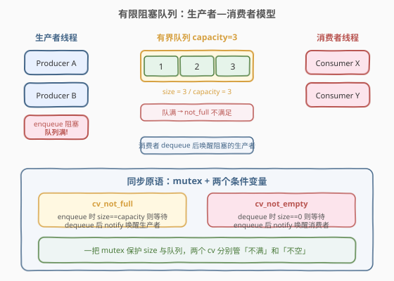
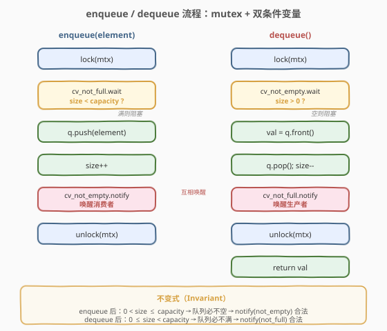
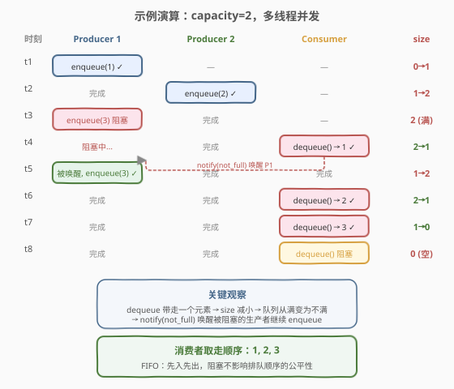

# LeetCode 设计有限阻塞队列 题解

## 1. 题目概述

- **标题 / 题号**：设计有限阻塞队列（#1188，medium）
- **链接**：https://leetcode.cn/problems/design-bounded-blocking-queue/
- **难度**：中等
- **标签**：并发、多线程、同步原语、设计

**题意**：实现一个**线程安全**的有限阻塞队列（Bounded Blocking Queue），支持以下方法：

- `BoundedBlockingQueue(int capacity)` — 构造函数，初始化队列的最大容量。所有线程在开始生产/消费前都会先到达构造函数，队列初始为空。
- `void enqueue(int element)` — 将元素添加到队列**前端**。如果队列已满（`size == capacity`），调用线程**阻塞**直到队列不再满。
- `int dequeue()` — 从队列**尾端**移除并返回一个元素。如果队列为空（`size == 0`），调用线程**阻塞**直到队列不再空。
- `int size()` — 返回队列中当前元素数量。

```cpp
class BoundedBlockingQueue {
public:
    BoundedBlockingQueue(int capacity) {
        // 初始化
    }

    void enqueue(int element) {
        // 满则阻塞，否则入队
    }

    int dequeue() {
        // 空则阻塞，否则出队
    }

    int size() {
        // 返回当前元素数
    }
};
```

**示例 1**：

```text
输入：
1 -> BoundedBlockingQueue(3)
2 -> 线程消费 enqueue(1), enqueue(0), enqueue(2), dequeue()
输出：1
解释：capacity=3，三次 enqueue 不会阻塞（均不满），dequeue 取出 1。
```

**示例 2**：

```text
输入：
1 -> BoundedBlockingQueue(5)
2 -> 线程消费 enqueue(1), enqueue(2), enqueue(3), dequeue(), dequeue()
输出：1, 2
解释：capacity=5，入队无阻塞，dequeue 按 FIFO 依次取出 1 和 2。
```

**示例 3**：

```text
输入：
1 -> BoundedBlockingQueue(2)
2 -> 线程消费 enqueue(1), enqueue(2), enqueue(3), dequeue(), dequeue(), dequeue()
输出：1, 2, 3
解释：capacity=2，第三次 enqueue(3) 时队列已满，线程阻塞；
      第一次 dequeue() 取出 1 后队列不再满，唤醒阻塞的 enqueue(3)；
      后续 dequeue() 依次取出 2 和 3。
```

**约束**：

- 最多 `4` 个线程并发调用 `enqueue` / `dequeue`
- `1 <= capacity <= 1000`
- `0 <= element <= 30000`
- 每个测试用例中 `enqueue` 和 `dequeue` 调用总次数最多 `300`
- `size()` 的调用不超过 `300` 次

> ⚠️ **关键约束**：队列既有**上界**（capacity）又有**下界**（0），生产者遇到上界要阻塞，消费者遇到下界要阻塞。这是经典的**生产者—消费者**问题，核心是两个方向的等待—唤醒。

## 2. 解题思路

### 2.1 暴力思路

用一个普通队列 + 一把 `mutex`，不加条件变量。`enqueue` 时如果满了就**自旋等待**（`while (size == capacity)` 循环检查），`dequeue` 时如果空了也自旋。

> ❌ 自旋会持续占用 CPU，在并发度高、等待时间长时严重浪费资源，且持锁自旋还可能导致**死锁**（持有 mutex 的线程自旋，其他线程无法修改 size）。

### 2.2 核心观察：mutex + 双条件变量



**问题本质**：需要两个方向的阻塞—唤醒：

- **生产者方向**：`enqueue` 时若 `size == capacity`（队列满），阻塞等待直到 `size < capacity`（队列不满）。
- **消费者方向**：`dequeue` 时若 `size == 0`（队列空），阻塞等待直到 `size > 0`（队列不空）。

**解决方案**：一把 `mutex` 保护共享状态（队列 + size），**两个条件变量**分别管「不满」和「不空」：

- `cv_not_full` — 生产者等待「队列不满」，消费者 `dequeue` 后 `notify` 它
- `cv_not_empty` — 消费者等待「队列不空」，生产者 `enqueue` 后 `notify` 它

> 💡 **为什么需要两个条件变量？** 因为有两个独立的等待条件——「不满」和「不空」。如果只用一个 `cv`，`notify_one` 可能唤醒错误的线程（比如生产者唤醒了另一个生产者），导致**惊群**后继续阻塞，效率低下。两个 `cv` 让每次 `notify` 精准命中正确的等待方。

### 2.3 算法流程图



**`enqueue(element)` 流程**：

1. 加锁 `lock(mtx)`
2. `cv_not_full.wait(lock, [&] { return size < capacity; })` — 满则阻塞，释放锁；被唤醒后重新加锁并检查
3. 入队 `q.push(element)`，`size++`
4. `cv_not_empty.notify_one()` — 唤醒可能在等待的消费者
5. 解锁

**`dequeue()` 流程**：

1. 加锁 `lock(mtx)`
2. `cv_not_empty.wait(lock, [&] { return size > 0; })` — 空则阻塞，释放锁；被唤醒后重新加锁并检查
3. 取队首 `val = q.front()`，`q.pop()`，`size--`
4. `cv_not_full.notify_one()` — 唤醒可能在等待的生产者
5. 解锁，返回 `val`

> ⚠️ **不变式保证**：`enqueue` 执行完毕后 `size >= 1`（队列必不空），所以 `notify(not_empty)` 一定有意义；`dequeue` 执行完毕后 `size <= capacity - 1`（队列必不满），所以 `notify(not_full)` 一定有意义。这保证了唤醒不会是「空唤醒」。

### 2.4 示例演算

以 `capacity=2` 为例，三个生产者和一个消费者并发执行：



| 时刻 | Producer 1 | Producer 2 | Consumer | size | 说明 |
|------|-----------|-----------|----------|------|------|
| t1 | enqueue(1) ✓ | — | — | 0→1 | 队列不满，直接入队，notify(not_empty) |
| t2 | 完成 | enqueue(2) ✓ | — | 1→2 | 队列不满，直接入队，notify(not_empty) |
| t3 | enqueue(3) **阻塞** | 完成 | — | 2 (满) | size==capacity，cv_not_full.wait 阻塞 |
| t4 | 阻塞中... | 完成 | dequeue() → 1 ✓ | 2→1 | 消费者取走 1，notify(not_full) 唤醒 P1 |
| t5 | 被唤醒, enqueue(3) ✓ | 完成 | 完成 | 1→2 | P1 恢复执行，入队 3，notify(not_empty) |
| t6 | 完成 | 完成 | dequeue() → 2 ✓ | 2→1 | 取走 2 |
| t7 | 完成 | 完成 | dequeue() → 3 ✓ | 1→0 | 取走 3，队列空 |
| t8 | 完成 | 完成 | dequeue() **阻塞** | 0 (空) | size==0，cv_not_empty.wait 阻塞 |

最终消费顺序：`1, 2, 3`（FIFO）✓

## 3. 参考代码

### C++

```cpp
#include <mutex>
#include <condition_variable>
#include <queue>

class BoundedBlockingQueue {
private:
    std::queue<int> q;
    int cap;
    int cnt = 0;
    std::mutex mtx;
    std::condition_variable cv_not_full;
    std::condition_variable cv_not_empty;

public:
    BoundedBlockingQueue(int capacity) : cap(capacity) {}

    void enqueue(int element) {
        std::unique_lock<std::mutex> lock(mtx);
        cv_not_full.wait(lock, [this] { return cnt < cap; });
        q.push(element);
        cnt++;
        cv_not_empty.notify_one();
    }

    int dequeue() {
        std::unique_lock<std::mutex> lock(mtx);
        cv_not_empty.wait(lock, [this] { return cnt > 0; });
        int val = q.front();
        q.pop();
        cnt--;
        cv_not_full.notify_one();
        return val;
    }

    int size() {
        std::lock_guard<std::mutex> lock(mtx);
        return cnt;
    }
};
```

### Python

```python
import threading
from collections import deque

class BoundedBlockingQueue:

    def __init__(self, capacity: int):
        self.q = deque()
        self.cap = capacity
        self.cnt = 0
        self.lock = threading.Lock()
        self.cv_not_full = threading.Condition(self.lock)
        self.cv_not_empty = threading.Condition(self.lock)

    def enqueue(self, element: int) -> None:
        with self.cv_not_full:
            self.cv_not_full.wait_for(lambda: self.cnt < self.cap)
            self.q.append(element)
            self.cnt += 1
            self.cv_not_empty.notify()

    def dequeue(self) -> int:
        with self.cv_not_empty:
            self.cv_not_empty.wait_for(lambda: self.cnt > 0)
            val = self.q.popleft()
            self.cnt -= 1
            self.cv_not_full.notify()
            return val

    def size(self) -> int:
        with self.lock:
            return self.cnt
```

> 💡 **C++ vs Python 注意点**：Python 中两个 `Condition` 共享同一把 `Lock`（`threading.Condition(self.lock)`），这与 C++ 中两个 `condition_variable` 共享一个 `mutex` 的语义完全对应。`with self.cv_not_full` 会自动获取/释放底层的 `self.lock`。`size()` 只需用 `lock` 即可，不需要 `Condition`。

## 4. 复杂度分析

| 维度 | 复杂度 | 说明 |
|------|--------|------|
| 时间复杂度 | $O(1)$ | 每次 `enqueue`/`dequeue` 的队列操作和同步操作均为常数时间 |
| 空间复杂度 | $O(\text{capacity})$ | 队列最多存储 `capacity` 个元素 |

## 5. 扩展：其他同步方案

### 5.1 信号量方案（C++20）

用两个 `counting_semaphore` 替代条件变量——一个计数剩余空位，一个计数已有元素。初始时 `sem_empty = capacity`，`sem_data = 0`。

```cpp
#include <semaphore>
#include <mutex>
#include <queue>

class BoundedBlockingQueue {
    std::queue<int> q;
    int cap;
    std::mutex mtx;
    std::counting_semaphore<1000> sem_empty;
    std::counting_semaphore<1000> sem_data;

public:
    BoundedBlockingQueue(int capacity)
        : cap(capacity), sem_empty(capacity), sem_data(0) {}

    void enqueue(int element) {
        sem_empty.acquire();       // 等待空位
        {
            std::lock_guard<std::mutex> lock(mtx);
            q.push(element);
        }
        sem_data.release();        // 通知有数据
    }

    int dequeue() {
        sem_data.acquire();        // 等待数据
        int val;
        {
            std::lock_guard<std::mutex> lock(mtx);
            val = q.front();
            q.pop();
        }
        sem_empty.release();       // 通知有空位
        return val;
    }

    int size() {
        std::lock_guard<std::mutex> lock(mtx);
        return static_cast<int>(q.size());
    }
};
```

> 💡 **信号量语义**：`sem_empty` 记录队列中剩余的空位数（初始为 `capacity`），`sem_data` 记录队列中已有元素数（初始为 0）。`acquire` 消耗一个许可（许可不足则阻塞），`release` 增加一个许可并唤醒等待者。两个信号量的和恒等于 `capacity`。

### 5.2 Python 信号量方案

Python 标准库提供 `threading.Semaphore`，思路与 C++ 完全一致。

```python
import threading
from collections import deque

class BoundedBlockingQueue:

    def __init__(self, capacity: int):
        self.q = deque()
        self.cap = capacity
        self.lock = threading.Lock()
        self.sem_empty = threading.Semaphore(capacity)
        self.sem_data = threading.Semaphore(0)

    def enqueue(self, element: int) -> None:
        self.sem_empty.acquire()
        with self.lock:
            self.q.append(element)
        self.sem_data.release()

    def dequeue(self) -> int:
        self.sem_data.acquire()
        with self.lock:
            val = self.q.popleft()
        self.sem_empty.release()
        return val

    def size(self) -> int:
        with self.lock:
            return len(self.q)
```

### 方案对比

| 方案 | 优点 | 缺点 |
|------|------|------|
| **mutex + 双 cv** | 通用、语义清晰、跨语言标准写法 | 代码稍长，需理解 `wait` 谓词 |
| **双信号量** | 语义最贴合「许可—等待」，代码简洁 | 需要 C++20（C++）/ 额外对象（Python）；`size` 仍需加锁 |

## 6. 面试要点

1. **为什么需要两个条件变量而不是一个？**
   - 因为有两个独立的等待条件——「队列不满」（生产者等）和「队列不空」（消费者等）。如果共用一个 `cv`，`notify_one` 可能唤醒错误类型的线程（比如生产者唤醒了另一个生产者），导致被唤醒者重新检查条件后继续阻塞，产生无效唤醒。两个 `cv` 确保 `notify` 精准命中正确方。

2. **`cv.wait(lock, predicate)` 中的谓词为什么重要？**
   - 防止**虚假唤醒**（spurious wakeup）——操作系统可能在没有 `notify` 的情况下唤醒线程。带谓词的 `wait` 内部等价于 `while(!predicate) cv.wait(lock);`，每次被唤醒都重新检查条件，只有条件成立才返回，保证正确性。

3. **`notify_one` 还是 `notify_all`？**
   - 本题每次操作只改变一个元素，最多让一个等待方满足条件（ dequeue 后队列从满变为不满，最多唤醒一个生产者），因此 `notify_one` 足够且高效。`notify_all` 会唤醒所有等待者，但只有一个能继续执行，其余重新阻塞，浪费调度开销。

4. **能不能只信号量不加 mutex？**
   - 信号量解决了「能否操作」的许可问题，但队列本身（`std::queue` / `deque`）的并发访问仍需 `mutex` 保护，否则多个获得许可的线程可能同时读写队列导致数据竞争。信号量管「许可」，mutex 管「互斥」，两者职责不同。

5. **如果要求公平性（FIFO 唤醒顺序）怎么办？**
   - 标准条件变量不保证唤醒顺序。如需严格 FIFO，可以用额外的等待队列（按到达顺序排队）或使用公平锁。本题不要求唤醒公平性，只需保证数据 FIFO 即可。

## 同类练习题

| # | 题目 | 与本题的关联 |
|---|------|-------------|
| 1114 | [按序打印](https://leetcode.cn/problems/print-in-order/) | 三线程有序执行，条件变量 stage 计数器，单 cv 单方向的入门并发题 |
| 1115 | [交替打印 FooBar](https://leetcode.cn/problems/print-foobar-alternately/) | 两线程交替执行，条件变量双向唤醒的简化版（只有两个角色） |
| 1117 | [构建 H2O](https://leetcode.cn/problems/building-h2o/) | 两个 H 线程和一个 O 线程同步，信号量协调比例关系，与本题的许可模型一脉相承 |
| 1226 | [哲学家进餐](https://leetcode.cn/problems/the-dining-philosophers/) | 五线程竞争共享资源，mutex + 避免死锁的经典并发设计题 |
| 1195 | [交替打印字符串](https://leetcode.cn/problems/fizz-buzz-multithreaded/) | 多线程按规则协调输出，条件变量多阶段协调，与本题的生产消费模型互补 |
