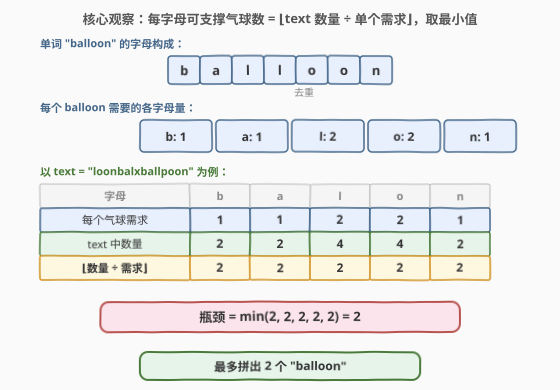
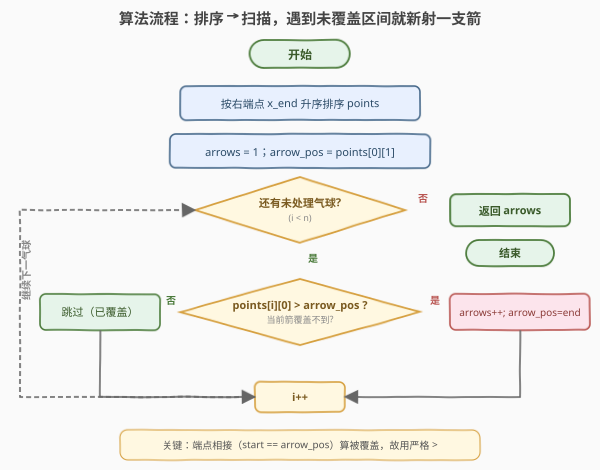
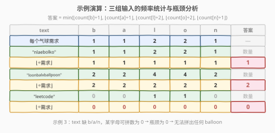

# LeetCode “气球”的最大数量 题解

## 1. 题目概述

- **标题 / 题号**：“气球”的最大数量（#1189，easy）
- **链接**：https://leetcode.cn/problems/maximum-number-of-balloons/
- **难度**：简单
- **标签**：字符串、哈希表、计数

**题意**：给你一个字符串 `text`，你需要使用 `text` 中的字母来拼凑尽可能多的单词 **"balloon"（气球）**。字符串 `text` 中的每个字母最多只能被使用一次。请你返回最多可以拼凑出多少个单词 **"balloon"**。

**示例 1**：

```text
输入：text = "nlaebolko"
输出：1
```

**示例 2**：

```text
输入：text = "loonbalxballpoon"
输出：2
```

**示例 3**：

```text
输入：text = "leetcode"
输出：0
```

**约束**：

- `1 <= text.length <= 10^4`
- `text` 全部由小写英文字母组成

> 💡 题眼在 **"balloon" 这个固定单词**：它只涉及 5 种字母（`b`、`a`、`l`、`o`、`n`），其中 `l` 和 `o` 各出现 2 次。把问题抽象为「每种字母的供应量能支撑多少个 balloon」，再取**最小值（瓶颈）**即得答案——这是经典的**木桶原理**在字符串计数中的直接应用。

## 2. 解题思路

### 2.1 暴力思路：逐个拼凑

最直觉的做法是：**模拟拼气球的过程**——每次从 `text` 中尝试凑出一个 "balloon"，凑出一个就扣减对应字母计数，直到凑不出为止。

```text
count = 统计 text 各字母频率
ans = 0
while 能从 count 中扣减一整套 b:1, a:1, l:2, o:2, n:1:
    扣减
    ans += 1
return ans
```

这种写法正确，但每轮要检查 5 个字母是否够量、再逐个扣减，循环次数等于答案值（最坏 $\lfloor n / 7 \rfloor$ 次）。虽然能过，但完全没有必要**逐个模拟**——能拼多少个直接除法算出来。

> 💡 更自然的抽象：**「能拼几个」本质是「每种字母的供应量除以单个需求量，取最小值」**。与其逐个扣减问「够不够再来一个」，不如一步算出「每种字母最多支撑几个」。这是把 $O(\text{ans})$ 的循环压缩为 $O(1)$ 一次除法的经典降维。

### 2.2 核心观察：频率表 + 木桶原理



**第一步：分析 "balloon" 的字母需求**。"balloon" = `b` + `a` + `l` + `l` + `o` + `o` + `n`，去重后每种字母的需求量为：

| 字母 | b | a | l | o | n |
|------|---|---|---|---|---|
| 每个 balloon 需求 | 1 | 1 | 2 | 2 | 1 |

**第二步：统计 `text` 中这 5 种字母的数量**。只需遍历一次 `text`，对 `b`/`a`/`l`/`o`/`n` 分别计数（其余字母忽略）。

**第三步：对每种字母算「可支撑数」**。设 `text` 中字母 $c$ 的数量为 $\text{cnt}[c]$，每个 balloon 对 $c$ 的需求为 $\text{req}[c]$，则该字母最多能支撑 $\lfloor \text{cnt}[c] / \text{req}[c] \rfloor$ 个 balloon。

**第四步：取最小值**。5 种字母的「可支撑数」取 `min`，即为最终答案——**最短缺的那个字母决定了总产量**，这就是**木桶原理**（最短的那块木板决定容量）。

$$\text{ans} = \min\left(\left\lfloor\frac{\text{cnt}[b]}{1}\right\rfloor,\ \left\lfloor\frac{\text{cnt}[a]}{1}\right\rfloor,\ \left\lfloor\frac{\text{cnt}[l]}{2}\right\rfloor,\ \left\lfloor\frac{\text{cnt}[o]}{2}\right\rfloor,\ \left\lfloor\frac{\text{cnt}[n]}{1}\right\rfloor\right)$$

> 💡 **为什么取 min 就对了？** 拼出一个 balloon 需要同时满足 5 种字母的需求。任何一种字母不够，就无法再拼出下一个。因此总产量被「最短缺的字母」卡住——这是「多种资源协同消耗，产量由最稀缺资源决定」的通用模式。与 [1160. 拼写单词](1160_拼写单词.md) 的「逐词判定 `need <= supply`」相比，本题是「批量求最大份数」——前者关心「能不能拼出一个」，后者关心「最多能拼几个」。

> ⚠️ **注意 `l` 和 `o` 需求为 2**：这是本题最容易踩的坑。"balloon" 中有两个 `l` 和两个 `o`，所以可支撑数是 $\lfloor \text{cnt} / 2 \rfloor$ 而非 $\text{cnt}$。漏除 2 会把答案算大。

### 2.3 算法流程图



**完整步骤**（两阶段，一次遍历 + 一次取 min）：

1. **初始化**：`cnt[5] = {0}`，分别对应 `b`、`a`、`l`、`o`、`n`。
2. **遍历统计**：扫描 `text` 的每个字符 `ch`，若 `ch` 属于 `{b, a, l, o, n}` 则对应计数 `++`。
3. **整除取最小**：`ans = min(cnt[b]÷1, cnt[a]÷1, cnt[l]÷2, cnt[o]÷2, cnt[n]÷1)`。
4. **返回** `ans`。

> 💡 与 [1160. 拼写单词](1160_拼写单词.md) 的结构对比：1160 是「预处理 supply → 逐词统计 need → 逐位比较」，主循环在单词维度；本题是「统计 5 字母 → 整除取 min」，无主循环（target 固定为 "balloon"）。两者的公共基础都是「频率表压缩」，差异在于 1160 比较布尔（够不够），本题比较整数（够几个）。

### 2.4 示例演算

以三组输入验证频率表 + 木桶原理的正确性：



**示例 1：`text = "nlaebolko"`**

| 字母 | b | a | l | o | n |
|------|---|---|---|---|---|
| 每个气球需求 | 1 | 1 | 2 | 2 | 1 |
| text 中数量 | 1 | 1 | 2 | 2 | 1 |
| ⌊数量 ÷ 需求⌋ | 1 | 1 | 1 | 1 | 1 |

$\min(1, 1, 1, 1, 1) = 1$ ✓ 恰好凑出一个 balloon，每种字母刚好用完。

**示例 2：`text = "loonbalxballpoon"`**

| 字母 | b | a | l | o | n |
|------|---|---|---|---|---|
| 每个气球需求 | 1 | 1 | 2 | 2 | 1 |
| text 中数量 | 2 | 2 | 4 | 4 | 2 |
| ⌊数量 ÷ 需求⌋ | 2 | 2 | 2 | 2 | 2 |

$\min(2, 2, 2, 2, 2) = 2$ ✓ 五种字母的可支撑数全为 2，瓶颈不在某个特定字母。

**示例 3：`text = "leetcode"`**

| 字母 | b | a | l | o | n |
|------|---|---|---|---|---|
| 每个气球需求 | 1 | 1 | 2 | 2 | 1 |
| text 中数量 | 0 | 0 | 1 | 1 | 0 |
| ⌊数量 ÷ 需求⌋ | 0 | 0 | 0 | 0 | 0 |

$\min(0, 0, 0, 0, 0) = 0$ ✓ text 中没有 `b`、`a`、`n`，且 `l`、`o` 各只有 1 个（不够 2），任何一种字母的缺失都让瓶颈归零——无法拼出任何 balloon。

> 💡 示例 3 展示了木桶原理的极端情况：**只要有一种字母的可支撑数为 0，答案就是 0**。不需要关心其他字母是否充足——最短木板为 0，木桶装不了任何水。

## 3. 参考代码

### 方法一：定长数组 + switch 计数（推荐）

### C++

```cpp
class Solution {
public:
    int maxNumberOfBalloons(string text) {
        int cnt[5] = {0}; // b, a, l, o, n
        for (char c : text) {
            switch (c) {
                case 'b': cnt[0]++; break;
                case 'a': cnt[1]++; break;
                case 'l': cnt[2]++; break;
                case 'o': cnt[3]++; break;
                case 'n': cnt[4]++; break;
            }
        }
        return min({cnt[0], cnt[1], cnt[2] / 2, cnt[3] / 2, cnt[4]});
    }
};
```

### Python

```python
class Solution:
    def maxNumberOfBalloons(self, text: str) -> int:
        from collections import Counter
        cnt = Counter(text)
        return min(cnt['b'], cnt['a'], cnt['l'] // 2, cnt['o'] // 2, cnt['n'])
```

> 💡 Python 的 `Counter` 对未出现的键返回 0，所以 `cnt['b']` 在 text 无 `b` 时为 0，`min` 自然得到 0——无需额外判空。C++ 用 `switch` 只统计 5 种目标字母，跳过其余 21 种字母，常数更小。`min({a, b, c, d, e})` 是 C++ 的初始化列表写法，对任意多个值取 min。

### 方法二：通用模板——任意目标单词

> 💡 **关键观察**：如果把 "balloon" 硬编码换成**任意目标单词** `target`，算法骨架完全不变——统计 `target` 各字母需求 → 对每种字母算 `⌊text 数量 ÷ 需求⌋` → 取 min。这就是 [2287. 重排字符形成目标字符串](https://leetcode.cn/problems/rearrange-characters-to-make-target-string/) 的通用解法。

### Python（通用版）

```python
class Solution:
    def maxNumberOfBalloons(self, text: str) -> int:
        from collections import Counter
        target = Counter("balloon")
        cnt = Counter(text)
        return min(cnt[c] // target[c] for c in target)
```

### C++（通用版）

```cpp
class Solution {
public:
    int maxNumberOfBalloons(string text) {
        unordered_map<char, int> target = {
            {'b', 1}, {'a', 1}, {'l', 2}, {'o', 2}, {'n', 1}
        };
        int cnt[26] = {0};
        for (char c : text) cnt[c - 'a']++;
        int ans = INT_MAX;
        for (auto& [c, req] : target) {
            ans = min(ans, cnt[c - 'a'] / req);
        }
        return ans;
    }
};
```

> ⚠️ **方法一 vs 方法二**：方法一直接硬编码 "balloon" 的 5 个字母，代码最短、常数最小，适合本题；方法二把 target 抽象为参数，可复用于 2287 等变体。面试中建议先写方法一讲清思路，再提方法二作为「如何泛化」的扩展。

## 4. 复杂度分析

| 维度 | 复杂度 | 说明 |
|------|--------|------|
| **时间复杂度** | $O(n)$ | 一次遍历 `text` 统计频率 $O(n)$ + 5 次除法 + 1 次 `min`（$O(1)$），$n = \text{text.length}$ |
| **空间复杂度** | $O(1)$ | 仅 5 个（或 26 个）计数器，与输入规模无关 |

> ⚠️ $n \leq 10^4$，一次线性扫描毫无压力。对比暴力逐个扣减法的 $O(n + 7 \times \text{ans})$（每轮扣减 7 个字母），本题答案上界 $\lfloor n / 7 \rfloor \approx 1428$，暴力也能过但多了一圈循环。频率表 + 除法把这个循环压缩为 $O(1)$，是「计数问题找闭式公式」的又一直接体现（参见 [1180. 统计只含单一字母的子串](1180_统计只含单一字母的子串.md) 的三角形数公式）。

## 5. 扩展：木桶原理与频率计数的通用模式

### 5.1 从「能不能拼」到「最多拼几个」

本题与 [1160. 拼写单词](1160_拼写单词.md) 共享同一基础抽象——**频率表压缩**，但问题形态不同：

| 维度 | 1160（拼写单词） | 1189（气球最大数量） |
|------|------------------|----------------------|
| 问题 | 每个 word 能否由 chars 拼出 | text 最多能拼几个 balloon |
| 判定 | 布尔：`need[c] <= supply[c]`？ | 整数：`⌊supply[c] / req[c]⌋` |
| 聚合 | 累加好词**长度** | 取**最小值**（瓶颈） |
| target | 多个不同 word | 固定 "balloon" |
| 复杂度 | $O(L_{\text{chars}} + \sum L_w)$ | $O(n)$ |

> 💡 两者的本质区别在于「布尔判定 vs 整数最大化」。1160 关心「供应够不够需求」（`<=`），逐词独立判定后累加长度；1189 关心「供应能撑几份需求」（`÷`），所有字母协同消耗后取瓶颈。从 `<=` 到 `÷` 是从「可行性」到「最优性」的自然升级。

### 5.2 木桶原理的通用框架

「多种资源协同消耗，产量由最稀缺资源决定」这一模式在很多问题中出现：

- **本题**：5 种字母 → 每种算可支撑数 → 取 min。
- [2287. 重排字符形成目标字符串](https://leetcode.cn/problems/rearrange-characters-to-make-target-string/)：target 任意 → 同框架，`min(⌊cnt[c] / target[c]⌋)`。
- [1513. 仅含 1 的二进制子串数](https://leetcode.cn/problems/number-of-substrings-with-only-1s/)：统计连续 1 段后段内计数，虽非直接取 min 但共享「资源约束」思想。

> 💡 识别信号：当题目问「最多能做几个 X」且做每个 X 需要消耗多种固定配比的资源时，直接套「**统计各资源量 → 除以单份需求 → 取 min**」三步走。

### 5.3 暴力到最优的进阶路线

| 解法 | 思路 | 复杂度 |
|------|------|--------|
| 暴力逐个扣减 | 每轮尝试凑一个 balloon，扣减 7 字母 | $O(n + 7 \cdot \text{ans})$ |
| 频率表 + 除法 | 统计 5 字母 → 整除需求 → 取 min | $O(n)$ |

## 6. 面试要点

1. **为什么取 min 就能得到正确答案？**

   > 拼出一个 balloon 需要同时满足 5 种字母的需求。每种字母的「可支撑数」= $\lfloor \text{cnt} / \text{req} \rfloor$，是该字母**独立**能支撑的最大气球数。但 5 种字母必须**协同**消耗，所以总产量被最小可支撑数卡住——即木桶原理。取 min 后，最短缺的字母刚好耗尽，其余字母有剩余但无法再多拼一个（因为缺了瓶颈字母）。

2. **`l` 和 `o` 为什么要除以 2？**

   > "balloon" 中 `l` 出现 2 次、`o` 出现 2 次，即每个 balloon 消耗 2 个 `l` 和 2 个 `o`。所以可支撑数是 $\lfloor \text{cnt}[l] / 2 \rfloor$ 而非 $\text{cnt}[l]$。漏除 2 会高估 `l`/`o` 的支撑能力，导致答案偏大。这是本题最常见的 off-by-one 类错误。

3. **如果 text 中某种字母完全缺失怎么办？**

   > 缺失字母的计数为 0，可支撑数 $\lfloor 0 / \text{req} \rfloor = 0$，`min` 结果为 0——无法拼出任何 balloon。无需特殊处理，`min` 自然兜底。Python 的 `Counter` 对未出现键返回 0，C++ 数组初始化为 0，都自动正确。

4. **这题和 1160 拼写单词有什么区别？**

   > 1160 判定**每个单词能否拼出**（布尔 `need <= supply`），累加好词长度；1189 求**最多拼几份固定单词**（整数 `⌊supply / req⌋`），取瓶颈 min。前者是「逐词可行性判定」，后者是「批量最大化」。从代码看，1160 有外层单词循环，1189 没有（target 固定）。

5. **如何泛化到任意目标单词？**

   > 把 "balloon" 换成参数 `target`：先统计 `target` 各字母频率作为需求表，再对每种字母算 `⌊cnt[c] / target[c]⌋` 取 min。这就是 [2287. 重排字符形成目标字符串](https://leetcode.cn/problems/rearrange-characters-to-make-target-string/) 的解法——与本题完全同构，只是 target 不再硬编码。

> 💡 **一句话总结**：1189 是「频率表 + 木桶原理」的入门模板——统计 "balloon" 5 种字母在 text 中的数量，各除以单个需求（`l`/`o` 需求为 2），取最小值即答案。$O(n)$ 一遍扫描，$O(1)$ 空间，核心在于识别「多种资源协同消耗、产量取瓶颈」这一模式。

## 同类练习题

| # | 题目 | 与本题的关联 |
|---|------|-------------|
| 2287 | [重排字符形成目标字符串](https://leetcode.cn/problems/rearrange-characters-to-make-target-string/) | 本题的通用版——target 从 "balloon" 扩展为任意字符串，同框架 `min(⌊cnt[c] / target[c]⌋)`，可作为本题的直接进阶 |
| 1160 | [拼写单词](1160_拼写单词.md) | 共享「频率表压缩」抽象，但判定布尔（够不够）而非整数（够几个），是「可行性 vs 最大化」的对照题 |
| 383 | [赎金信](https://leetcode.cn/problems/ransom-note/) | 判断 ransom 能否由 magazine 拼出，`need <= supply` 频率比较，1160 的单词版，同「计数 + 比较」范式 |
| 242 | [有效的字母异位词](https://leetcode.cn/problems/valid-anagram/) | 频率表要求**完全相等**（`==`），与 1189 的「整除取 min」同为频率表工具的不同判定条件 |
| 1180 | [统计只含单一字母的子串](1180_统计只含单一字母的子串.md) | 同为「计数问题找闭式公式」——用三角形数 $L(L+1)/2$ 替代逐个枚举，与 1189 用除法替代逐个扣减思路同源 |
