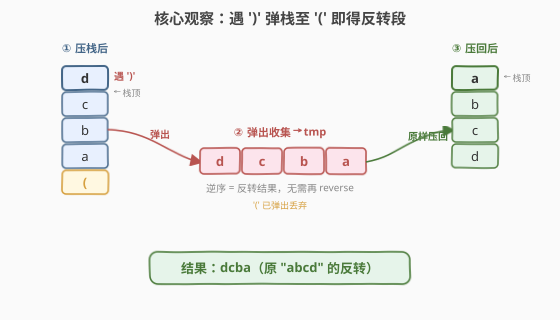
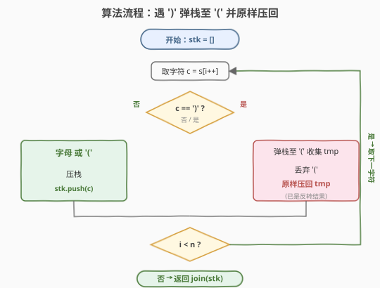
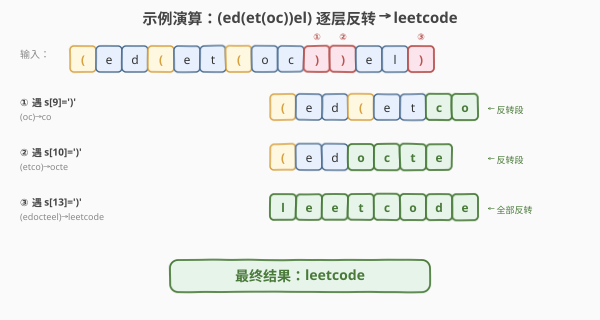
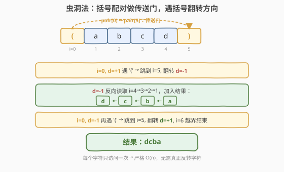

# LeetCode 反转每对括号间的子串 题解

## 1. 题目概述

- **标题 / 题号**：反转每对括号间的子串（#1190，medium）
- **链接**：https://leetcode.cn/problems/reverse-substrings-between-each-pair-of-parentheses/
- **难度**：中等
- **标签**：栈、字符串、模拟

**题意**：给定一个字符串 `s`（由小写英文字母和括号 `'('` / `')'` 组成），请你**从最内层开始**，逐对反转每对匹配括号中的子串，最终返回**不含任何括号**的结果字符串。

**示例 1**：

```text
输入：s = "(abcd)"
输出："dcba"
解释：只有一对括号，反转 "abcd" 得 "dcba"。
```

**示例 2**：

```text
输入：s = "(u(love)i)"
输出："iloveu"
解释：先反转内层 (love) → "evol"，串变为 (uevoli)；再反转外层 → "iloveu"。
```

**示例 3**：

```text
输入：s = "(ed(et(oc))el)"
输出："leetcode"
解释：内层 (oc)→"co"，中层 (etco)→"octe"，外层 (edocteel)→"leetcode"。
```

**约束**：

- `1 <= s.length <= 2000`
- `s` 仅由小写英文字母和 `'('`、`')'` 组成
- `s` 中的所有括号都是**成对匹配**的（保证是一个有效输入）

> 💡 这是**栈处理嵌套括号**的招牌题。难点在于括号可以任意嵌套：最内层的括号必须先反转、反转后的结果再交给外层反转。核心套路与 [394. 字符串解码](../0301-0400/394_字符串解码.md) 同源——遇到 `(` 暂存外层现场，遇到 `)` 弹出并处理内层。掌握「遇右括号弹栈至左括号」这一模板，括号匹配、表达式求值、嵌套翻转都能举一反三。

## 2. 解题思路

### 2.1 暴力思路：循环找最内层括号

反复扫描字符串：每一轮找到**第一个 `)`**，它对应的就是当前最内层的 `(`，把这对括号之间的子串原地反转、并删去这对括号，然后从头再来，直到没有括号剩余。

```text
while 存在 '(' :
    找到第一个 ')' 的位置 r
    找到 r 之前最近的 '(' 位置 l
    反转 s[l+1 : r]
    删除 s[l] 和 s[r]
```

时间复杂度 $O(n^2)$：最坏有 $O(n)$ 层括号，每轮扫描 + 反转 $O(n)$。逻辑直观，但反复扫描同一段字符、反复分配新字符串，效率不高，且边界处理容易出错。

> ⚠️ 暴力的痛点在于「反复扫描整串、反复切片」。换一个角度——**只扫一遍，用一个栈把所有字符吞吐进来，遇到 `)` 就地处理反转**——问题立刻简化为单趟扫描。

### 2.2 核心观察：单栈「遇 ) 弹栈至 ( 」



关键洞察：**栈的 LIFO 特性天然匹配括号的「最内层先闭合」**。把字符逐个压栈，遇到 `)` 时，从栈顶弹出的字符恰好是**最内层括号内容的逆序**——而「逆序」正是我们要的反转结果！

**三类字符的处理**：

| 字符 | 操作 | 说明 |
|------|------|------|
| **字母** | 压栈 | 暂存，等待所在层被反转 |
| **`'('`** | 压栈 | 作为「层界标记」，标记一段的起点 |
| **`')'`** | 弹栈至 `'('` | 弹出的字符序列**本身就是反转结果**，原样压回栈 |

> 💡 **为什么弹出的序列就是反转结果？** 假设内层是 `(abcd)`，压栈后栈顶到栈底为 `d,c,b,a,(`。从栈顶弹出得到 `d,c,b,a`——这正好是 `"abcd"` 的逆序 `"dcba"`。把这个序列原样压回栈，栈中即存下反转后的 `dcba`。**弹栈操作天然完成了反转**，无需额外调用 `reverse`。

**与 394 字符串解码的对比**：

| | 394 字符串解码 | 1190 反转括号子串 |
|------|---------------|-------------------|
| 触发弹栈的字符 | `']'` | `')'` |
| 弹栈后做什么 | 取出倍数 `k`，`cur = prev + cur×k` | 弹出逆序段，原样压回 |
| 是否需要第二个栈 | 是（数字栈 + 字符串栈） | 否（单栈即可） |
| 核心思想 | 外层暂存，内层先算 | 弹栈即反转，原样压回 |

### 2.3 算法流程图



**完整步骤**：

1. 初始化空栈 `stk`。
2. 顺序遍历 `s` 的每个字符 `c`：
   - `c == ')'`：
     - 弹出栈顶字符收集到临时串 `tmp`，直到栈顶为 `'('`；
     - 弹出并丢弃这个 `'('`（层界标记用完即弃）；
     - 把 `tmp` 中的字符**原样**压回栈（`tmp` 已是反转结果）。
   - 否则（字母或 `'('`）：直接压栈。
3. 遍历结束，栈中字符从底到顶拼接即为答案（所有括号已在处理 `)` 时被丢弃）。

> ⚠️ **压回时不要再次反转**：`tmp` 收集的顺序是「栈顶→栈底」= 原段「尾→首」= 反转结果。若误把 `tmp` 再 `reverse` 一次压回，就抵消了反转，得到原串。

### 2.4 示例演算

以 `s = "(ed(et(oc))el)"` 为例（三层嵌套，最能体现逐层反转）：



**三个关键反转节点**（每遇一个 `)` 完成一层反转）：

| 步骤 | 触发字符 | 弹出段（逆序） | 压回后栈内容 | 反转效果 |
|------|----------|----------------|--------------|----------|
| 遇第 1 个 `)` | `s[9]=')'` | `c, o` | `( e d ( e t c o` | `"oc"` → `"co"` |
| 遇第 2 个 `)` | `s[10]=')'` | `o, c, t, e` | `( e d o c t e` | `"etco"` → `"octe"` |
| 遇第 3 个 `)` | `s[13]=')'` | `l, e, e, t, c, o, d, e` | `l e e t c o d e` | `"edocteel"` → `"leetcode"` |

**详细栈状态**（左→右 = 栈底→栈顶，`(` 标红表示层界）：

```text
扫描 (ed(et(oc    栈: [ ( e d ( e t ( o c ]
遇 s[9]=')'        弹出 c,o 与 (  →  压回 c,o
                   栈: [ ( e d ( e t c o ]          ← "oc" 反转为 "co"
继续扫描 )          遇 s[10]=')'  弹出 o,c,t,e 与 (
                   栈: [ ( e d o c t e ]            ← "etco" 反转为 "octe"
扫描 el            栈: [ ( e d o c t e e l ]
遇 s[13]=')'        弹出 l,e,e,t,c,o,d,e 与 (
                   栈: [ l e e t c o d e ]          ← "edocteel" 反转为 "leetcode"
```

最终栈为 `[l,e,e,t,c,o,d,e]`，拼接得 `"leetcode"` ✓。

> 💡 **观察**：每次遇 `)`，弹出的字符数 = 当前内层括号内的字符数，且弹出顺序即反转顺序。三层括号被**自内向外**依次消解，与题目「从最内层开始反转」的要求完全一致——这正是栈 LIFO 的天然保证。

## 3. 参考代码

### C++

```cpp
// 反转每对括号间的子串.cpp —— 单栈，遇 ')' 弹栈至 '('
// 编译: g++ -O2 -std=c++17 反转每对括号间的子串.cpp -o reverse_paren
#include <string>
#include <vector>
using namespace std;

class Solution {
  public:
    string reverseParentheses(string s) {
        vector<char> stk;
        for (char c : s) {
            if (c == ')') {
                string tmp;
                while (stk.back() != '(') {     // 弹栈至 '('
                    tmp.push_back(stk.back());
                    stk.pop_back();
                }
                stk.pop_back();                 // 丢弃 '('
                for (char ch : tmp) stk.push_back(ch);  // 原样压回（tmp 已是反转结果）
            } else {
                stk.push_back(c);
            }
        }
        return string(stk.begin(), stk.end());
    }
};
```

### Python

```python
class Solution:
    def reverseParentheses(self, s: str) -> str:
        stk = []
        for c in s:
            if c == ")":
                tmp = []
                while stk[-1] != "(":           # 弹栈至 '('
                    tmp.append(stk.pop())
                stk.pop()                       # 丢弃 '('
                stk.extend(tmp)                 # 原样压回（tmp 已是反转结果）
            else:
                stk.append(c)
        return "".join(stk)
```

> 💡 **实现细节**：① `'('` 也压栈，它作为层界标记，在遇 `)` 时被弹出丢弃，所以最终栈中不含任何括号。② `tmp` 收集顺序是「栈顶→栈底」= 原段逆序，`extend(tmp)` 直接压回即得反转段，**无需再反转**。③ Python 的 `stk.extend(tmp)` 等价于 C++ 的循环 `push_back`，把 `tmp` 逐个追加到栈顶。

## 4. 复杂度分析

| 维度 | 单栈法 | 虫洞法（见第 5 节） |
|------|--------|---------------------|
| **时间** | $O(n^2)$（最坏） | $O(n)$ |
| **空间** | $O(n)$ | $O(n)$ |
| **是否需要反转字符** | 是（弹栈收集 + 压回） | 否（只改方向） |

> ⚠️ **单栈法为什么最坏 $O(n^2)$？** 考虑最坏输入 `s = "a(a(a(...a)...))"`（深层嵌套）。最内层 `a` 被弹出压回 1 次，次内层被弹出压回 2 次……最外层字符被弹出压回 $O(n)$ 次。同一字符可能被反复弹出与压回，总操作数达 $O(n^2)$。但 $n \leq 2000$ 时 $n^2 = 4 \times 10^6$，单栈法完全可过。若需严格 $O(n)$，用第 5 节的虫洞法。

## 5. 扩展：虫洞法（O(n) 最优解）



单栈法的瓶颈在于「字符被反复弹出压回」。能否**只遍历一次、不真正反转**？可以——关键观察：**反转的本质是改变遍历方向**。我们用「传送门 + 方向翻转」模拟逐层反转。

**思路**：

1. **预处理配对**：用栈扫一遍，记录每个括号的**配对位置** `pair[i]`（`(` 与对应 `)` 互为配对）。
2. **虫洞遍历**：维护当前下标 `i` 和方向 `d`（`+1` 正向 / `-1` 逆向）：
   - 遇**字母**：加入结果，`i += d`；
   - 遇**括号**：跳到配对位置 `pair[i]`，**翻转方向** `d = -d`，再 `i += d`。

> 💡 **为什么跳到配对位置后要翻转方向？** 进入一对括号等价于「这一层的内容要被反转」=「从另一端反向读」。所以遇到 `(` 时，跳到对应的 `)` 处，并改为从右向左读（方向取反）——这正是「反转」的等价操作。遇到 `)` 同理跳回 `(` 并再次翻转方向。**括号成了传送门，方向翻转代替了真正的字符反转**。

**演算 `s = "(abcd)"`**（`pair[0]=5, pair[5]=0`）：

| i | d | s[i] | 动作 | 结果 |
|---|---|------|------|------|
| 0 | +1 | `(` | 跳到 5，d 翻为 -1，i=4 | `""` |
| 4 | -1 | `d` | 加入，i=3 | `"d"` |
| 3 | -1 | `c` | 加入，i=2 | `"dc"` |
| 2 | -1 | `b` | 加入，i=1 | `"dcb"` |
| 1 | -1 | `a` | 加入，i=0 | `"dcba"` |
| 0 | -1 | `(` | 跳到 5，d 翻为 +1，i=6 | `"dcba"` |
| 6 | — | 越界 | 结束 | `"dcba"` ✓ |

**虫洞法代码**：

```python
class Solution:
    def reverseParentheses(self, s: str) -> str:
        n = len(s)
        pair = [0] * n
        stk = []
        for i, c in enumerate(s):           # 预处理配对
            if c == "(":
                stk.append(i)
            elif c == ")":
                j = stk.pop()
                pair[i] = j
                pair[j] = i

        res = []
        i, d = 0, 1                          # 下标与方向
        while 0 <= i < n:
            if s[i] in "()":                 # 遇括号：传送 + 翻转方向
                i = pair[i]
                d = -d
            else:                            # 遇字母：加入结果
                res.append(s[i])
            i += d
        return "".join(res)
```

```cpp
class Solution {
  public:
    string reverseParentheses(string s) {
        int n = s.size();
        vector<int> pair(n);
        vector<int> stk;
        for (int i = 0; i < n; i++) {        // 预处理配对
            if (s[i] == '(') stk.push_back(i);
            else if (s[i] == ')') {
                int j = stk.back(); stk.pop_back();
                pair[i] = j; pair[j] = i;
            }
        }
        string res;
        for (int i = 0, d = 1; 0 <= i && i < n; i += d) {
            if (s[i] == '(' || s[i] == ')') {
                i = pair[i]; d = -d;          // 传送 + 翻转方向
            } else {
                res.push_back(s[i]);
            }
        }
        return res;
    }
};
```

> ⚠️ 注意 `i += d` 在 `for` 的步进部分执行：遇括号时先把 `i` 跳到配对位置并翻转 `d`，**再**由步进 `i += d` 移动一步（跳过配对括号本身，不重复访问）。这样每个字符恰被访问一次，严格 $O(n)$。

## 6. 面试要点

1. **为什么弹出的字符序列就是反转结果？**

   > 压栈时字符按「原串顺序」入栈，栈顶是段尾。遇 `)` 从栈顶弹出，得到的是「尾→首」= 原段的逆序，即反转结果。把这个逆序序列原样压回栈，栈中即存下反转后的段。**弹栈操作天然完成了反转**，所以无需额外调用 `reverse`。

2. **为什么单栈法最坏是 $O(n^2)$？**

   > 深层嵌套时，外层字符会被多次「弹出-压回」。最内层字符只被处理 1 次，但最外层字符每次内层反转都要被弹出再压回，累计达 $O(n)$ 次/字符。总操作数 $\sum_{k=1}^{n} k = O(n^2)$。$n \leq 2000$ 时仍可接受，但追求严格线性需用虫洞法。

3. **虫洞法为什么遇括号要翻转方向？**

   > 反转等价于「从另一端反向读」。进入括号层意味着该层内容要被反转，所以跳到配对括号（另一端）并反向遍历。出括号层时再次翻转方向，恢复正向。**括号是传送门，方向翻转代替字符反转**，从而避免任何实际的字符搬动。

4. **`'('` 压栈后最终去哪了？**

   > `'('` 作为层界标记压栈，在遇到对应 `)` 时被弹出并丢弃（`stk.pop()` 丢弃 `'('`）。所以遍历结束后栈中只剩字母，不含任何括号——天然满足「结果不含括号」的要求。

5. **这题和 394（字符串解码）的栈用法有什么异同？**

   > 同：都是栈处理嵌套括号，都靠 `)` / `]` 触发弹栈，都保证「最内层先处理」。异：394 需**双栈**（数字栈 + 字符串栈），弹栈后做 `cur = prev + cur×k`（重复 + 拼接）；1190 只需**单栈**，弹栈收集的逆序段原样压回即可（无倍数、无拼接顺序问题）。二者同属「栈维护嵌套层级」骨架。

> 💡 **一句话总结**：1190 是栈处理嵌套括号的招牌题——遇 `)` 弹栈至 `(`，弹出的逆序段原样压回即完成反转，单趟扫描 $O(n^2)$。进阶虫洞法把括号当传送门、用方向翻转代替字符反转，做到严格 $O(n)$。与 394 字符串解码同源，掌握「遇右括号弹栈处理」模板即可一通百通。

## 同类练习题

| # | 题目 | 与本题的关联 |
|---|------|-------------|
| 394 | [字符串解码](https://leetcode.cn/problems/decode-string/)（[题解](../0301-0400/394_字符串解码.md)） | 同属栈处理嵌套括号，遇 `]` 弹栈做重复拼接，双栈模板的代表作 |
| 20 | [有效的括号](https://leetcode.cn/problems/valid-parentheses/)（[题解](../0001-0100/20_有效括号.md)） | 栈处理括号匹配的入门题，遇右括号弹栈匹配左括号，本题的栈思想基础 |
| 71 | [简化路径](https://leetcode.cn/problems/simplify-path/)（[题解](../0001-0100/71_简化路径.md)） | 用栈维护路径层级，遇 `..` 弹栈回退，同属「栈维护层级」骨架 |
| 856 | [括号的分数](https://leetcode.cn/problems/score-of-parentheses/)（[题解](../0801-0900/856_括号的分数.md)） | 栈处理嵌套括号求分值，遇 `)` 弹栈计算，与本题「遇 `)` 弹栈」触发逻辑一致 |
| 224 | [基本计算器](https://leetcode.cn/problems/basic-calculator/)（[题解](../0201-0300/224_基本计算器.md)） | 栈处理含括号的表达式求值，遇 `)` 弹栈至 `(` 计算子表达式，本题的进阶应用 |
