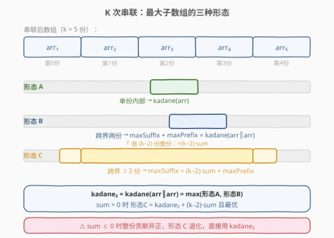
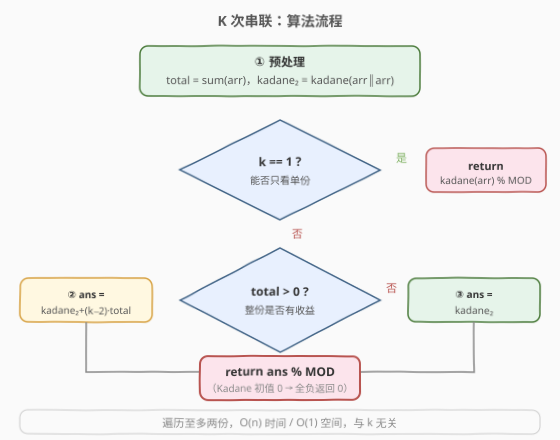
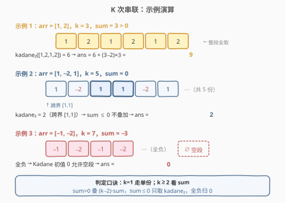

# K次串联后最大子数组之和

- **题目名称**：K次串联后最大子数组之和
- **链接**：[1191. K 次串联后最大子数组之和](https://leetcode.cn/problems/k-concatenation-maximum-sum/)
- **难度**：中等
- **标签**：数组、动态规划、Kadane 算法

## 1. 题目概述

给定一个整数数组 `arr` 和一个整数 `k`，把 `arr` **重复串联 `k` 次**得到新数组（例如 `arr = [1, 2]`、`k = 3` 得到 `[1, 2, 1, 2, 1, 2]`）。返回新数组中**最大子数组之和**。注意子数组长度可以为 `0`（此时和为 `0`）。由于结果可能很大，需对 $10^9 + 7$ 取模。

> 💡 本题是 [53. 最大子数组和](../0001-0100/53_最大子数组和.md) 的「环形/串联」进阶：单份内部的最大子数组用普通 Kadane 即可，难点在于**子数组可以跨越多份副本的边界**，需要分情况讨论是否要「吞掉中间的若干整份」。

**示例 1**：

```text
输入：arr = [1,2], k = 3
输出：9
解释：串联后为 [1,2,1,2,1,2]，整段之和 = 3×3 = 9。
```

**示例 2**：

```text
输入：arr = [1,-2,1], k = 5
输出：2
解释：sum(arr)=0，中间整份不增不减；最优子数组为跨界的 [1,1]，和为 2。
```

**示例 3**：

```text
输入：arr = [-1,-2], k = 7
输出：0
解释：全为负数，取空子数组，和为 0。
```

**约束条件**：

- `1 <= arr.length <= 10^5`
- `1 <= k <= 10^5`
- `-10^4 <= arr[i] <= 10^4`

---

## 2. 解题思路

### 2.1 暴力思路

直接把 `arr` 重复 `k` 次展开成长度为 $k \cdot n$ 的大数组，再跑一遍 [53 题 Kadane](../0001-0100/53_最大子数组和.md)。但 $k \cdot n$ 最高可达 $10^{10}$，无论是构造数组还是遍历都远超内存与时间上限，完全不可行。**关键在于不必真正展开**：副本之间彼此相同，最大子数组的形态只有有限的几类。

### 2.2 核心观察：串联后最大子数组的三种形态



把串联后的数组看作「第 0 份、第 1 份、……、第 $k-1$ 份」，每份都是 `arr`。任意一个子数组按其**跨越的份数**可归为三类：

- **形态 A — 落在单份内部**：和就是 `arr` 的某个子数组和，最大值为 $\text{kadane}(arr)$。
- **形态 B — 跨越恰好两份的边界**：取第 $c$ 份的一个后缀 + 第 $c+1$ 份的一个前缀。最大值为「`arr` 的最大后缀和」+「`arr` 的最大前缀和」，即 $\text{maxSuffix} + \text{maxPrefix}$。
- **形态 C — 跨越三份及以上**：第 $c$ 份后缀 + 中间若干**整份** + 第 $c+m-1$ 份前缀。每多吞一份整份就加上 $\text{sum}(arr)$；只有当 $\text{sum}(arr) > 0$ 时才值得多吞，最多吞 $k-2$ 份整份，得 $\text{maxSuffix} + (k-2)\cdot\text{sum}(arr) + \text{maxPrefix}$。

> 💡 **两份副本就够了**：形态 A 和形态 B 合起来，恰等于对**两份串联数组** `arr+arr` 跑一次 Kadane——因为 Kadane 会自动在「单份内部子数组」与「跨界后缀+前缀」之间取最大。记 $\text{kadane}_2 = \text{kadane}(arr \parallel arr)$，则 $\text{kadane}_2 = \max(\text{kadane}(arr),\ \text{maxSuffix}+\text{maxPrefix})$。

**关键引理**：当 $\text{sum}(arr) > 0$ 时，$\text{maxSuffix}+\text{maxPrefix} > \text{kadane}(arr)$，因而 $\text{kadane}_2 = \text{maxSuffix}+\text{maxPrefix}$。

证明：设 $\text{kadane}(arr)$ 对应子数组为 $arr[i..j]$。则最大后缀 $\ge \text{sum}(arr[i..n-1])$、最大前缀 $\ge \text{sum}(arr[0..j])$，二者之和 $= \text{sum}(arr) + \text{sum}(arr[i..j]) = \text{sum}(arr) + \text{kadane}(arr) > \text{kadane}(arr)$（因 $\text{sum}(arr)>0$）。$\square$

由引理，当 $\text{sum}(arr) > 0$ 时，形态 C 的最优值 $\text{maxSuffix}+(k-2)\cdot\text{sum}+\text{maxPrefix} = \text{kadane}_2 + (k-2)\cdot\text{sum}$，且它一定不劣于形态 A、B（因为多了非负的整份贡献）。于是最终结论非常简洁：

$$
\text{answer} =
\begin{cases}
\text{kadane}(arr), & k = 1 \\
\text{kadane}_2 + (k-2)\cdot\text{sum}(arr), & k \ge 2 \text{ 且 } \text{sum}(arr) > 0 \\
\text{kadane}_2, & k \ge 2 \text{ 且 } \text{sum}(arr) \le 0
\end{cases}
$$

其中 $\text{sum}(arr) \le 0$ 时整份贡献非正，多吞只会拉低总和，故形态 C 退化回形态 B，直接用 $\text{kadane}_2$。再结合「子数组可为空」的约定，把 Kadane 的初值设为 $0$（允许空段）即可天然处理全负情形返回 $0$。

### 2.3 算法流程图



实现上用一个 `kadaneRepeat(arr, repeat)` 对「`arr` 重复 `repeat` 次」的虚拟数组跑 Kadane：`repeat=1` 即单份，`repeat=2` 即两份（无需真正展开，按下标循环即可，空间 $O(1)$）。整体只需遍历数组常数遍，时间 $O(n)$。

### 2.4 示例演算



| 示例 | arr | k | sum | kadane₂ | 公式 | 结果 |
|------|-----|---|-----|---------|------|------|
| 1 | `[1,2]` | 3 | 3 (>0) | 6（两份 `[1,2,1,2]` 整段） | $6 + (3-2)\times 3 = 9$ | 9 |
| 2 | `[1,-2,1]` | 5 | 0 (≤0) | 2（跨界 `[1,1]`） | $\text{kadane}_2 = 2$ | 2 |
| 3 | `[-1,-2]` | 7 | −3 (≤0) | 0（全负取空段） | $\text{kadane}_2 = 0$ | 0 |

- **示例 1**：`sum=3>0`，吞掉中间 $k-2=1$ 份整份增加 $3$，$6+3=9$，正是 5 份全取之和。
- **示例 2**：`sum=0`，中间整份不增不减，最优只是跨界的 `[1,1]=2`，无需也不应叠加 $(k-2)\cdot\text{sum}$。
- **示例 3**：全负，Kadane 初值 $0$ 允许空段，直接返回 $0$。

---

## 3. 参考代码

### C++

```cpp
class Solution {
    static constexpr long long MOD = 1000000007;
    // 对「arr 连续重复 repeat 次」的虚拟数组跑 Kadane，允许空子数组（结果 >= 0）
    long long kadaneRepeat(const vector<int>& arr, int repeat) {
        long long best = 0, cur = 0;
        int n = arr.size();
        for (int t = 0; t < repeat; ++t)
            for (int i = 0; i < n; ++i) {
                cur = max((long long)arr[i], cur + arr[i]);
                best = max(best, cur);
            }
        return best;
    }

  public:
    int kConcatenationMaxSum(vector<int>& arr, int k) {
        long long total = accumulate(arr.begin(), arr.end(), 0LL);
        if (k == 1) return kadaneRepeat(arr, 1) % MOD;
        long long two = kadaneRepeat(arr, 2);
        long long ans = total > 0 ? two + (k - 2) * total : two;
        return ans % MOD;
    }
};
```

### Python

```python
class Solution:
    def kConcatenationMaxSum(self, arr: List[int], k: int) -> int:
        MOD = 10**9 + 7

        def kadane(seq):
            best = cur = 0  # 允许空子数组，初值 0
            for x in seq:
                cur = max(x, cur + x)
                best = max(best, cur)
            return best

        total = sum(arr)
        if k == 1:
            return kadane(arr) % MOD
        two = kadane(arr + arr)
        ans = two + (k - 2) * total if total > 0 else two
        return ans % MOD
```

> ⚠️ **取模与负数**：`total > 0` 分支中 `two + (k-2)*total` 恒非负（`two≥0`、`(k-2)*total>0`），直接 `% MOD` 即可；`total ≤ 0` 分支 `two ≥ 0` 同理。若改用「允许负值」的 Kadane（初值 `−∞`），则结尾需 `((ans % MOD) + MOD) % MOD` 规避负数取模。C++ 中 `accumulate` 必须传 `0LL` 起始值，否则在 `int` 上累加 $10^5 \times 10^4 = 10^9$ 会溢出。

> 💡 **为何只跑两份就够**：`kadaneRepeat(arr, 2)` 等价于对真正展开的 `arr+arr` 跑 Kadane，自动覆盖「单份内部」与「跨界后缀+前缀」两种形态；第三种形态（吞整份）由公式 $(k-2)\cdot\text{sum}$ 在代数上补回，无需把 $k$ 份都展开。

---

## 4. 复杂度分析

| 维度 | 复杂度 | 说明 |
|------|--------|------|
| 时间复杂度 | $O(n)$ | `k==1` 遍历 1 遍；`k≥2` 遍历 2 遍（虚拟两份），均为 $O(n)$，与 $k$ 无关 |
| 空间复杂度 | $O(1)$ | 仅 `best/cur/total` 等常数变量；C++ 不展开数组，Python 的 `arr+arr` 可改为虚拟索引以达到 $O(1)$ |

---

## 5. 扩展：前缀/后缀直接计算法

除「对两份跑 Kadane」外，也可**直接**计算 $\text{maxSuffix}$ 与 $\text{maxPrefix}$：

$$\text{maxPrefix} = \max_{0 \le j < n}\ \text{prefixSum}[j+1], \qquad \text{maxSuffix} = \text{total} - \min_{0 \le i < n}\ \text{prefixSum}[i]$$

于是 $\text{kadane}_2 = \max(\text{kadane}(arr),\ \text{maxPrefix}+\text{maxSuffix})$。当 $\text{sum}>0$ 时由引理可省去 $\text{kadane}(arr)$ 这一比较，直接用 $\text{maxPrefix}+\text{maxSuffix}$。这种写法把「最大子数组和」拆成「最大前缀和 + 最大后缀和」两个一维扫描，与 [918 环形子数组](../0901-1000/918_最大环形子数组之和.md)「用补集 $\text{total}-\text{minSubarray}$ 处理跨界」的思路同源——本质上都是**用前缀/后缀极值刻画「跨界子数组」**。

若把本题推广为「允许串联次数 $k$ 极大（如 $10^{18}$）」，上述 $O(n)$ 公式依然成立，只需对 $(k-2)\cdot\text{sum}$ 做快速乘取模即可，无需任何改动到遍历部分。

---

## 6. 面试要点

1. **为什么不用真的把数组重复 k 次？**

   $k \cdot n$ 最高 $10^{10}$，内存与时间都爆。副本彼此相同，最大子数组按「跨越份数」只有三类，分类讨论后只需对最多两份跑 Kadane，$k$ 仅以 $(k-2)\cdot\text{sum}$ 的代数项出现。

2. **三种形态分别是什么？何时启用第三种？**

   单份内部（$\text{kadane}(arr)$）、跨界两份（$\text{maxSuffix}+\text{maxPrefix}$）、跨界 ≥3 份（$\text{maxSuffix}+(k-2)\cdot\text{sum}+\text{maxPrefix}$）。第三种只有 $\text{sum}(arr)>0$ 时才可能最优，否则吞整份只会拉低总和。

3. **为什么 `sum>0` 时可以直接写 `kadane(arr+arr) + (k-2)*sum`？**

   关键引理：$\text{sum}>0 \Rightarrow \text{maxSuffix}+\text{maxPrefix} > \text{kadane}(arr)$，故 $\text{kadane}(arr+arr)$ 恰等于 $\text{maxSuffix}+\text{maxPrefix}$，而形态 C 的最优值 $= (\text{maxSuffix}+\text{maxPrefix}) + (k-2)\cdot\text{sum} = \text{kadane}(arr+arr) + (k-2)\cdot\text{sum}$，且一定不劣于前两种形态。

4. **`sum ≤ 0` 时为什么不能加 `(k-2)*sum`？**

   $\text{sum}\le 0$ 时每多吞一份整份贡献非正，形态 C 不优于形态 B，最优值就是 $\text{kadane}(arr+arr)$。此时 $(k-2)\cdot\text{sum}\le 0$，加上去反而变小。

5. **如何处理「子数组可为空」与取模？**

   Kadane 的 `best/cur` 初值设 $0$ 即允许空段，全负时返回 $0$。本题答案恒非负，结尾 `ans % MOD` 即可；若 Kadane 用 `−∞` 初值则需 `((ans%MOD)+MOD)%MOD` 防负数取模。

---

## 7. 同类练习题

- [53. 最大子数组和](https://leetcode.cn/problems/maximum-subarray/)（[题解](../0001-0100/53_最大子数组和.md)）：Kadane 基础模板，本题的单份退化情形
- [918. 环形子数组的最大和](https://leetcode.cn/problems/maximum-sum-circular-subarray/)（[题解](../0901-1000/918_最大环形子数组之和.md)）：Kadane 环形变体，用补集/前缀后缀极值处理跨界
- [1186. 删除一次得到子数组最大和](https://leetcode.cn/problems/maximum-subarray-sum-with-one-deletion/)（[题解](../1101-1200/1186_删除一次得到子数组最大和.md)）：Kadane + 状态扩展，同为 53 的进阶
- [152. 乘积最大子数组](https://leetcode.cn/problems/maximum-product-subarray/)（[题解](../0101-0200/152_乘积最大子数组.md)）：维护 max/min 双状态的 Kadane 变体
- [1749. 任意子数组和的绝对值的最大值](https://leetcode.cn/problems/maximum-absolute-sum-of-any-subarray/)：同时维护最大/最小子数组和，前缀极值思想
