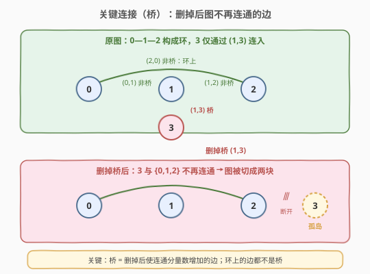
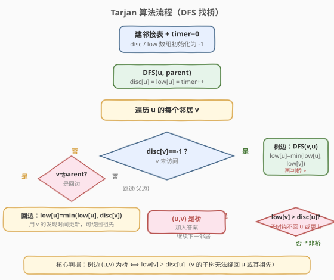
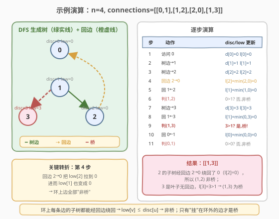

# 寻找关键连接

- **题目名称**：寻找关键连接
- **链接**：[1192. 寻找关键连接](https://leetcode.cn/problems/critical-connections-in-a-network/)
- **难度**：困难
- **标签**：图、深度优先搜索、Tarjan 算法、桥

## 1. 题目概述

有 `n` 台服务器，按从 `0` 到 `n-1` 编号，它们之间通过无向连接 `connections` 互连，其中 `connections[i] = [ai, bi]` 表示服务器 `ai` 和 `bi` 之间有一条连接。**关键连接**（critical connection）是指：如果将该连接删除，会导致某些服务器无法到达其他某些服务器的连接。换句话说，关键连接就是图中的**桥**（bridge）。

请返回所有关键连接，答案可以以任意顺序给出。

**示例 1**：

```text
输入：n = 4, connections = [[0,1],[1,2],[2,0],[1,3]]
输出：[[1,3]]
解释：[[3,1]] 也是正确的。边 (0,1)、(1,2)、(2,0) 构成环 0-1-2-0，
      删掉其中任意一条图仍连通；但删掉 (1,3) 后节点 3 与其余节点断开。
```

**示例 2**：

```text
输入：n = 6, connections = [[0,1],[1,2],[2,0],[1,3],[3,4],[4,5],[5,3]]
输出：[[1,3]]
解释：0-1-2 构成环，3-4-5 也构成环，两个环之间仅由 (1,3) 连接，
      删除 (1,3) 则图分裂成两块，故 (1,3) 是唯一的关键连接。
```

**约束条件**：

- `1 <= n <= 10^5`
- `n - 1 <= connections.length <= 10^5`
- `connections[i].length == 2`
- `0 <= ai, bi <= n - 1`
- `ai != bi`
- 不存在重复连接
- 整个图是连通的

---

## 2. 解题思路

### 2.1 暴力思路

枚举每条边，将其临时删除后对图做一次 BFS/DFS 判断是否仍连通（连通分量数是否仍为 1）。若删除后不再连通，则该边为桥。时间复杂度 $O(E \times (V+E))$，在本题 $V, E \le 10^5$ 的规模下会超时。

> 暴力法没有利用"**一条边是否为桥只取决于它所在 DFS 子树能否绕回祖先**"这一局部性质。本题是无向图找桥的经典母题，标准解法是 **Tarjan 算法**，一次 DFS 即可判定所有桥。

### 2.2 核心观察：Tarjan 算法与 `low` / `disc`



将图做一次 DFS，得到一棵 **DFS 生成树**，其中的边分为两类：

- **树边**（tree edge）：DFS 过程中首次访问到某节点时走过的边。
- **回边**（back edge）：指向已在递归栈中（已访问但未回溯完）的祖先节点的边。无向图 DFS 中不存在横叉边与前向边。

关键直觉：

> 一条树边 $(u, v)$（$v$ 是 $u$ 的子节点）是否为桥，取决于 **$v$ 的子树能否通过回边绕回 $u$ 或 $u$ 的祖先**。如果绕得回，则删掉 $(u,v)$ 后 $v$ 的子树仍能从回边"逃"出去，$(u,v)$ 就不是桥；如果绕不回，$(u,v)$ 就是桥。

为此定义两个数组：

| 数组 | 含义 |
|------|------|
| `disc[u]`（发现时间） | 节点 $u$ 在 DFS 中**首次被访问**的时间戳，递增分配 |
| `low[u]`（低链接值） | 从 $u$ 的子树出发，**经至多一条回边**能抵达的**最小 `disc`** |

> 💡 `low[u]` 的本质：$u$ 子树"能向上够到的最高祖先"的发现时间。`low[u]` 越小，说明子树越能绕回到接近根的祖先，桥的可能性越低。

**桥的判定**：对树边 $(u, v)$，若

$$\text{low}[v] > \text{disc}[u]$$

则 $(u, v)$ 是桥。因为 $v$ 的子树连 $u$ 都够不到（`low[v]` 比 `disc[u]` 还大），删掉 $(u,v)$ 后 $v$ 子树与 $u$ 彻底断开。

### 2.3 算法流程图



**`low` 的更新规则**（一次 DFS 内完成）：

1. **首次进入 $u$**：`disc[u] = low[u] = timer++`。
2. **对每条邻接边 $(u, v)$**：
   - 若 $v$ **未访问**（`disc[v] == -1`）：这是树边。递归 `DFS(v, u)`，回溯后 `low[u] = min(low[u], low[v])`；若 `low[v] > disc[u]`，则 $(u,v)$ 是桥。
   - 若 $v$ **已访问且 $v \neq$ parent**：这是回边。`low[u] = min(low[u], disc[v])`（注意用 `disc[v]` 而非 `low[v]`）。
   - 若 $v ==$ parent：跳过（避免把"来时的父边"误当回边）。

> ⚠️ **为何回边用 `disc[v]` 而非 `low[v]`？** 标准桥算法中回边更新用 `disc[v]`。两者在本题无重复边时结果一致，但用 `disc[v]` 是更严谨的定义——`low` 只允许"子树内经至多一条回边"，跨多级回边的传递由树边的 `min(low[u], low[v])` 在回溯时逐层完成。若用 `low[v]` 可能在某些实现中错误传播。

> ⚠️ **父边处理**：无向图中每条边在邻接表里出现两次（$u \to v$ 和 $v \to u$）。DFS 从 $u$ 走到 $v$ 后，$v$ 的邻接表里会看到 $u$，但那是"来时的父边"，不是回边，必须跳过。本题保证**无重复连接**，因此用"节点编号等于 parent"来识别父边即可；若存在重边则需传"边的编号"来识别。

### 2.4 示例演算

以 `n = 4, connections = [[0,1],[1,2],[2,0],[1,3]]` 为例，从节点 0 开始 DFS：



| 步骤 | 动作 | disc/low 更新 | 桥判定 |
|------|------|---------------|--------|
| 1 | 访问 0 | `disc[0]=low[0]=0` | — |
| 2 | 树边 0→1，访问 1 | `disc[1]=low[1]=1` | — |
| 3 | 树边 1→2，访问 2 | `disc[2]=low[2]=2` | — |
| 4 | 回边 2→0（0 已访问且 ≠parent） | `low[2]=min(2,disc[0]=0)=0` | — |
| 5 | 回溯回 1 | `low[1]=min(1,low[2]=0)=0` | `low[2]=0 > disc[1]=1`? 否 → (1,2) 非桥 |
| 6 | 树边 1→3，访问 3 | `disc[3]=low[3]=3` | — |
| 7 | 回溯回 1 | `low[1]=min(0,low[3]=3)=0` | `low[3]=3 > disc[1]=1`? **是 → (1,3) 是桥** |
| 8 | 回溯回 0 | `low[0]=min(0,low[1]=0)=0` | `low[1]=0 > disc[0]=0`? 否 → (0,1) 非桥 |

最终结果 `[[1,3]]`，与示例一致。

**关键转折在第 4 步**：回边 2→0 把 `low[2]` 从 2 拉低到 0，回溯时 `low[1]` 也跟着变成 0，于是环上所有边的 `low[v] ≤ disc[u]` 都不满足桥条件。而节点 3 是叶子、没有任何回边，`low[3]` 始终为 3，大于 `disc[1]=1`，故 (1,3) 是唯一的桥。

> 💡 一句话直觉：**环上的边都不是桥，只有"挂"在环外的边才是桥**。Tarjan 算法的 `low` 值就是在自动检测"哪些边属于环"——能绕回祖先的边 `low` 会被拉低，从而不满足桥条件。

---

## 3. 参考代码

### C++（Tarjan DFS 找桥）

```cpp
class Solution {
  public:
    vector<vector<int>> criticalConnections(int n, vector<vector<int>>& connections) {
        // 建邻接表
        vector<vector<int>> adj(n);
        for (auto& c : connections) {
            adj[c[0]].push_back(c[1]);
            adj[c[1]].push_back(c[0]);
        }

        vector<int> disc(n, -1), low(n, -1);
        vector<vector<int>> ans;
        int timer = 0;

        // DFS：u 当前节点，parent 父节点（识别父边，避免误判回边）
        function<void(int, int)> dfs = [&](int u, int parent) {
            disc[u] = low[u] = timer++;
            for (int v : adj[u]) {
                if (disc[v] == -1) {              // 树边：v 未访问
                    dfs(v, u);
                    low[u] = min(low[u], low[v]);  // 回溯时用子树 low 更新
                    if (low[v] > disc[u]) {        // 桥判定
                        ans.push_back({u, v});
                    }
                } else if (v != parent) {          // 回边：v 已访问且非父节点
                    low[u] = min(low[u], disc[v]);
                }
                // v == parent：父边，跳过
            }
        };

        dfs(0, -1);   // 图连通，从任意节点开始即可
        return ans;
    }
};
```

### Python（Tarjan DFS 找桥）

```python
class Solution:
    def criticalConnections(self, n: int, connections: List[List[int]]) -> List[List[int]]:
        adj = [[] for _ in range(n)]
        for u, v in connections:
            adj[u].append(v)
            adj[v].append(u)

        disc = [-1] * n
        low = [-1] * n
        ans = []
        self.timer = 0

        def dfs(u: int, parent: int) -> None:
            disc[u] = low[u] = self.timer
            self.timer += 1
            for v in adj[u]:
                if disc[v] == -1:                # 树边：v 未访问
                    dfs(v, u)
                    low[u] = min(low[u], low[v])  # 回溯时用子树 low 更新
                    if low[v] > disc[u]:          # 桥判定
                        ans.append([u, v])
                elif v != parent:                 # 回边：v 已访问且非父节点
                    low[u] = min(low[u], disc[v])
                # v == parent：父边，跳过

        dfs(0, -1)   # 图连通，从任意节点开始即可
        return ans
```

> 💡 **递归栈深度**：本题 $n \le 10^5$，最坏情况（图退化为链）DFS 递归深度可达 $10^5$，Python 默认递归上限 1000 会爆栈。实际提交时需 `sys.setrecursionlimit(200000)`，或将递归改写为显式栈迭代。C++ 在主流评测平台的栈空间通常足够，但链式退化仍是潜在风险。

---

## 4. 复杂度分析

| 维度 | 复杂度 | 说明 |
|------|--------|------|
| 时间复杂度 | $O(V + E)$ | 每个节点访问 1 次、每条无向边在邻接表中遍历 2 次（正反各一次），总操作线性 |
| 空间复杂度 | $O(V + E)$ | 邻接表 $O(V+E)$ + `disc`/`low` 数组 $O(V)$ + 递归栈最深 $O(V)$ |

> 💡 Tarjan 找桥只需**一次 DFS**，是理论最优——每条边至多被考察两次（正反方向各一次），无法比 $O(V+E)$ 更优。相比暴力的 $O(E(V+E))$ 有质的飞跃。

---

## 5. 扩展：相关图论概念

1. **桥 vs 割点**：桥是"删边使图不连通"，割点（articulation point）是"删点（及其关联边）使图不连通"。割点判定与桥同源：树边 $(u,v)$ 满足 `low[v] >= disc[u]` 则 $u$ 是割点（注意是 `>=` 而非 `>`，且根节点需特判子树数 ≥ 2）。LeetCode 暂无独立割点题，但 [1568. 使陆地分开的最少天数](https://leetcode.cn/problems/minimum-number-of-days-to-disconnect-island/) 隐含割点/桥思想。

2. **桥与边双连通分量**：把所有桥删掉后，图分裂成的每个连通块就是一个**边双连通分量**（edge-biconnected component, e-DCC）。同一 e-DCC 内任意两点间至少有两条边不重复的路径。求 e-DCC 的方法：先 Tarjan 找出所有桥，再 DFS/BFS 删桥分块；或用 Tarjan 栈式实现一次完成。

3. **有向图版本——强连通分量**：有向图中的对应概念是强连通分量（SCC），同样用 Tarjan 算法（或 Kosaraju）求解，`low` 的定义和更新规则与无向图找桥形似但需处理半连通/横叉边，复杂度更高。

---

## 6. 面试要点

1. **桥的判定条件 `low[v] > disc[u]` 为什么用严格大于？**

   - `low[v]` 是 $v$ 子树能抵达的最小发现时间。若 `low[v] > disc[u]`，说明 $v$ 子树连 $u$ 都够不到，删掉 $(u,v)$ 后 $v$ 子树与 $u$ 彻底断开 → 桥。
   - 若 `low[v] == disc[u]`，说明 $v$ 子树恰好能绕回 $u$ 本身（但够不到更上的祖先），删掉 $(u,v)$ 后 $v$ 子树仍能经回边回到 $u$，图仍连通 → 非桥。所以必须严格大于。

2. **为什么回边更新用 `disc[v]` 而不是 `low[v]`？**

   - `low` 的定义是"子树内经**至多一条**回边"能到的最小 `disc`。回边 $(u,v)$ 直接连接祖先 $v$，所以用 $v$ 的 `disc` 更新；跨多级的传递由树边回溯时的 `min(low[u], low[v])` 逐层完成。用 `low[v]` 在无重边无向图中结果一致，但定义上不够严谨。

3. **如何处理"父边"避免误判？**

   - 无向图每条边在邻接表出现两次。DFS 从 $u$ 进入 $v$ 后，$v$ 的邻接表里有 $u$，那是来时的父边，不是回边，必须跳过。本题保证无重复连接，用 `v != parent` 即可；若存在重边，需改用"边的唯一编号"识别父边（传 `edge_id`，标记已用边）。

4. **图不一定从 0 开始连通吗？为什么只调一次 `dfs(0, -1)`？**

   - 题目保证整个图连通，因此从任意节点开始一次 DFS 即可覆盖所有节点。若图可能不连通，则需对所有 `disc == -1` 的节点分别调用 DFS。

5. **Tarjan 找桥和并查集判环（684 冗余连接）有什么区别？**

   - 684 是"树 + 1 条边必有唯一环"，用并查集逐条加边、命中同根即返回冗余边，只需判"是否有环"。
   - 1192 要找出**所有**桥，需要精确判定"每条边是否在某个环上"，并查集无法做到（它只动态维护连通性，不能区分桥与非桥）。Tarjan 的 `low` 值天然编码了"能否绕回祖先"，是找桥的唯一高效手段。

6. **递归爆栈怎么办？**

   - $n \le 10^5$ 时链式退化 DFS 深度达 $10^5$。Python 需 `sys.setrecursionlimit`；C++ 可编译时开大栈（`-Wl,-stack_size` 等）或改写为显式栈迭代版（手动维护栈帧记录当前遍历到第几个邻居）。

---

## 7. 同类练习题

- [684. 冗余连接](https://leetcode.cn/problems/redundant-connection/)（[题解](../0601-0700/684_冗余连接.md)）：并查集判环，与本题 Tarjan 找桥对照——一个动态加边判环、一个静态 DFS 找桥
- [1319. 连通网络的操作次数](https://leetcode.cn/problems/number-of-operations-to-make-network-connected/)：并查集数连通分量，求冗余线缆能否连通全网，桥思想的并查集视角
- [1489. 找到最小生成树里的关键边和伪关键边](https://leetcode.cn/problems/find-critical-and-pseudo-critical-edges-in-minimum-spanning-tree/)：MST + 并查集判定关键边，"关键边"概念的高级变体
- [1568. 使陆地分开的最少天数](https://leetcode.cn/problems/minimum-number-of-days-to-disconnect-island/)：网格图找割点/桥，Tarjan 在小规模网格上的应用
- [765. 情侣牵手](https://leetcode.cn/problems/couples-holding-hands/)：置换环 + 并查集，"环"思想在排列上的迁移
