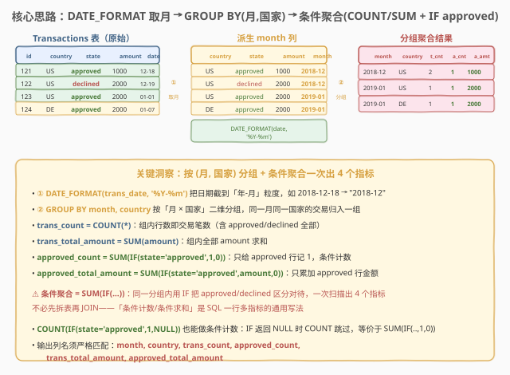
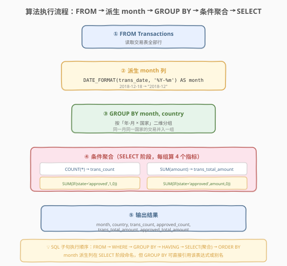

# LeetCode 每月交易 I 题解

## 1. 题目概述

- **标题 / 题号**：每月交易 I（#1193，medium）
- **链接**：https://leetcode.cn/problems/monthly-transactions-i/
- **难度**：中等
- **标签**：SQL、GROUP BY、条件聚合、SUM(IF)、DATE_FORMAT、日期截断

**题意**：给定 `Transactions` 表，记录每笔交易的国家、状态（`approved`/`declined`）、金额和日期。编写 SQL 查询，找出**每个月、每个国家/地区**的：事务数及其总金额、已批准的事务数及其总金额。以任意顺序返回结果。

**表结构**：

```text
Table: Transactions
+---------------+---------+
| Column Name   | Type    |
+---------------+---------+
| id            | int     |  ← 主键
| country       | varchar |
| state         | enum    |  ← ("approved", "declined")
| amount        | int     |
| trans_date    | date    |
+---------------+---------+
```

> ⚠️ `state` 是 ENUM，只有 `approved` 与 `declined` 两种取值。题目要求在同一次分组里**同时**输出「全部交易」和「仅 approved 交易」两套指标——这正是「条件聚合」的典型场景：不必把表拆成两张再 JOIN，一条 `SUM(IF(state='approved', ...))` 即可在同一分组内按条件分别统计。

**示例 1**：

```text
输入：
Transactions table:
+------+---------+----------+--------+------------+
| id   | country | state    | amount | trans_date |
+------+---------+----------+--------+------------+
| 121  | US      | approved | 1000   | 2018-12-18 |
| 122  | US      | declined | 2000   | 2018-12-19 |
| 123  | US      | approved | 2000   | 2019-01-01 |
| 124  | DE      | approved | 2000   | 2019-01-07 |
+------+---------+----------+--------+------------+

输出：
+----------+---------+-------------+----------------+--------------------+-----------------------+
| month    | country | trans_count | approved_count | trans_total_amount | approved_total_amount |
+----------+---------+-------------+----------------+--------------------+-----------------------+
| 2018-12  | US      | 2           | 1              | 3000               | 1000                  |
| 2019-01  | US      | 1           | 1              | 2000               | 2000                  |
| 2019-01  | DE      | 1           | 1              | 2000               | 2000                  |
+----------+---------+-------------+----------------+--------------------+-----------------------+
```

**解释**：

| month | country | 全部交易 | approved 交易 | trans_count | approved_count | trans_total_amount | approved_total_amount |
|-------|---------|----------|---------------|-------------|----------------|--------------------|-----------------------|
| 2018-12 | US | id 121(approved,1000)、id 122(declined,2000) | id 121 | 2 | 1 | 1000+2000=3000 | 1000 |
| 2019-01 | US | id 123(approved,2000) | id 123 | 1 | 1 | 2000 | 2000 |
| 2019-01 | DE | id 124(approved,2000) | id 124 | 1 | 1 | 2000 | 2000 |

**约束**：

- `Transactions.id` 为主键
- `state` ∈ {`approved`, `declined`}
- 分组维度：**月**（由 `trans_date` 截到 `YYYY-MM`）× **国家**
- 同一组内需同时输出 4 个指标：全部交易计数/求和、approved 交易计数/求和
- 输出列名严格匹配：`month`、`country`、`trans_count`、`approved_count`、`trans_total_amount`、`approved_total_amount`
- 结果以任意顺序返回

> 💡 本题是 SQL **"日期截断 + 条件聚合"招牌题**——核心就两件事：① 用 `DATE_FORMAT(trans_date, '%Y-%m')` 把日期归一到「年-月」串作为分组键；② 在 `GROUP BY month, country` 之后，用 `COUNT(*)` / `SUM(amount)` 算全部指标，用 `SUM(IF(state='approved', x, 0))` 算 approved 指标。难点不在逻辑复杂，而在于「一次扫描、一组多指标」的条件聚合写法是否熟练。

## 2. 解题思路

### 2.1 暴力思路：分两次查询再拼接

最直觉的过程式思路：先按 (月, 国家) 分组算「全部交易」的计数与总额，再筛出 `state='approved'` 的行算「已批准」的计数与总额，最后按 (月, 国家) 把两张结果表 JOIN 起来。伪代码如下：

```text
all = GROUP BY month, country: COUNT(*), SUM(amount)
appr = WHERE state='approved' GROUP BY month, country: COUNT(*), SUM(amount)
result = all LEFT JOIN appr ON month, country  -- approved 指标可能为空 → 填 0
```

但这样要**扫两遍表**且需 `LEFT JOIN` 拼接（某月某国可能没有 approved 交易，appr 表无对应行，需补 0）。过程式「先分类再合并」在 SQL 中可优化为「一次扫描、条件聚合」——在同一分组内用 `IF` 把 approved/declined 区别对待，一行出 4 个指标。

> ⚠️ 过程式思维里「分两类各算各的」对应 SQL 的 `SUM(IF(state='approved', x, 0))` 条件聚合——把分类判断内嵌进聚合函数，一次 `GROUP BY` 同时产出全部指标与 approved 指标，无需二次扫描与 JOIN。

### 2.2 核心观察：DATE_FORMAT 取月 + 条件聚合一次出 4 指标



**三个关键点**：

1. **`DATE_FORMAT(trans_date, '%Y-%m')` 截到「年-月」**：题目要求「每月」统计，但 `trans_date` 是精确到日的 `date` 类型。直接 `GROUP BY trans_date` 会按天分组，得不到「月」粒度。`DATE_FORMAT(trans_date, '%Y-%m')` 把 `2018-12-18` 格式化成 `"2018-12"` 字符串，作为月份分组键。该派生列命名为 `month`，直接出现在输出中。

   $$\text{month} = \text{DATE\_FORMAT}(\text{trans\_date},\;'\%\text{Y}-\%\text{m}')$$

2. **`GROUP BY month, country` 二维分组**：分组键是「月 × 国家」的笛卡尔组合。同一月同一国家的所有交易（不论 approved/declined）并入一组。示例中 `2018-12 / US` 这一组含 id 121、122 两行；`2019-01 / US` 与 `2019-01 / DE` 虽同月但国家不同，分属两组。

3. **条件聚合 `SUM(IF(state='approved', x, 0))`**：在同一分组内，全部指标用无条件聚合（`COUNT(*)`、`SUM(amount)`），approved 指标用条件聚合——`IF(state='approved', 1, 0)` 给 approved 行记 1、declined 行记 0，再 `SUM` 即得 approved 笔数；`IF(state='approved', amount, 0)` 给 approved 行取金额、declined 行取 0，再 `SUM` 即得 approved 总额。

   $$\text{approved\_count} = \sum_{i \in \text{group}} \mathbb{1}[\text{state}_i = \text{approved}]$$

   $$\text{approved\_total\_amount} = \sum_{i \in \text{group}} \text{amount}_i \cdot \mathbb{1}[\text{state}_i = \text{approved}]$$

> 💡 **条件聚合的本质**：`SUM(IF(cond, val, 0))` 把「先按条件过滤行再聚合」压缩成「聚合时按条件取舍值」。一次 `GROUP BY` 扫描即可同时产出「全部」与「子集」两套指标，比「分查再 JOIN」少扫一遍表、少一次连接。这是 SQL「一行多指标报表」的通用范式——`SUM(IF(...))` / `COUNT(IF(...))` 是面试高频写法。

> ⚠️ **两个易错点**：
> - **按 `trans_date` 而非 `month` 分组**：忘了 `DATE_FORMAT` 截断，直接 `GROUP BY trans_date, country` 会得到「每日每国」而非「每月每国」的结果，行数远多于预期。
> - **approved 指标用 `COUNT(*)` 子查询而非 `SUM(IF)`**：虽也能做对，但要扫两遍表 + LEFT JOIN 补零，既啰嗦又低效。条件聚合 `SUM(IF(state='approved', ...))` 才是「一次出多指标」的标准写法。

### 2.3 算法流程图



**逻辑执行步骤**：

| 步骤 | 子句 | 作用 |
|------|------|------|
| ① | `FROM Transactions` | 读取交易表全部行 |
| ② | `DATE_FORMAT(trans_date, '%Y-%m') AS month` | 派生「年-月」字符串列，如 `2018-12-18` → `"2018-12"` |
| ③ | `GROUP BY month, country` | 按「月 × 国家」二维分组，同月同国交易并入一组 |
| ④ | `SELECT` 中对每组算 4 个聚合 | `COUNT(*)`、`SUM(amount)`、`SUM(IF(state='approved',1,0))`、`SUM(IF(state='approved',amount,0))` |
| ⑤ | 投影输出 6 列 | `month, country, trans_count, approved_count, trans_total_amount, approved_total_amount` |

> 💡 **SQL 子句执行顺序**：`FROM`（含 `JOIN`/`ON`）→ `WHERE` → `GROUP BY` → `HAVING` → `SELECT`（含聚合）→ `ORDER BY` → `LIMIT`。`DATE_FORMAT` 派生的 `month` 在 `SELECT` 阶段命名，但 `GROUP BY` 可直接引用该表达式（MySQL 还支持引用别名 `GROUP BY month`，标准 SQL 要求写完整表达式）。聚合函数在 `SELECT` 阶段对每个分组求值。本题无需 `WHERE`/`HAVING`/`ORDER BY`——题目允许任意顺序且不要求过滤。

### 2.4 示例演算

以示例 1 数据为例，观察「派生月 → 分组 → 条件聚合」的逐步执行过程：


**步骤 ①：`DATE_FORMAT(trans_date, '%Y-%m')` 派生 month 列**

对每行交易格式化日期，得到 `month` 字符串：

| id | country | state | amount | trans_date | month（派生） |
|----|---------|-------|--------|------------|---------------|
| 121 | US | approved | 1000 | 2018-12-18 | 2018-12 |
| 122 | US | declined | 2000 | 2018-12-19 | 2018-12 |
| 123 | US | approved | 2000 | 2019-01-01 | 2019-01 |
| 124 | DE | approved | 2000 | 2019-01-07 | 2019-01 |

> 💡 id 121、122 虽日期不同（18 日、19 日），但都属 `2018-12` 月，归入同一组——这正是 `DATE_FORMAT` 截断的作用：把「日」差异抹掉，统一到「月」粒度。

**步骤 ②：`GROUP BY month, country` 分成 3 组**

按 (month, country) 二维分组，得到 3 个组：

| 组 | month | country | 包含行 |
|----|-------|---------|--------|
| A | 2018-12 | US | id 121(approved,1000)、id 122(declined,2000) |
| B | 2019-01 | US | id 123(approved,2000) |
| C | 2019-01 | DE | id 124(approved,2000) |

> 💡 组 B、C 虽同月（2019-01）但国家不同（US vs DE），分属两组。若题目只需「每月」统计而不分国家，则 B、C 会合并成一组 `2019-01` 含 2 行。

**步骤 ③：每组算 4 个条件聚合指标**

| 组 | trans_count=`COUNT(*)` | trans_total_amount=`SUM(amount)` | approved_count=`SUM(IF(app,1,0))` | approved_total_amount=`SUM(IF(app,amount,0))` |
|----|------------------------|----------------------------------|-----------------------------------|-----------------------------------------------|
| A (2018-12/US) | 2 | 1000+2000=3000 | 1（仅 id 121） | 1000（仅 id 121 的金额） |
| B (2019-01/US) | 1 | 2000 | 1 | 2000 |
| C (2019-01/DE) | 1 | 2000 | 1 | 2000 |

> 💡 **重点看组 A**：它含 2 行（1 个 approved + 1 个 declined）。`COUNT(*)` 计 2（含 declined）；`SUM(amount)` 加 3000（含 declined 的 2000）；而 `SUM(IF(state='approved',1,0))` 只给 id 121 记 1、id 122 记 0，求和得 1；`SUM(IF(state='approved',amount,0))` 只取 id 121 的 1000、id 122 取 0，求和得 1000。条件聚合让「全部」与「approved 子集」两套指标在一次分组中同时算出，无需拆表。

最终输出与示例一致。

## 3. 参考代码

### SQL（解法 A：DATE_FORMAT + SUM(IF)，推荐）

```sql
SELECT DATE_FORMAT(trans_date, '%Y-%m') AS month,
       country,
       COUNT(*) AS trans_count,
       SUM(IF(state = 'approved', 1, 0)) AS approved_count,
       SUM(amount) AS trans_total_amount,
       SUM(IF(state = 'approved', amount, 0)) AS approved_total_amount
FROM Transactions
GROUP BY month, country;
```

> 💡 **写法要点**：
> - `DATE_FORMAT(trans_date, '%Y-%m') AS month`：把日期截到「年-月」字符串，`%Y` 四位年、`%m` 两位月。如 `2018-12-18` → `"2018-12"`。
> - `GROUP BY month, country`：MySQL 允许直接引用 `SELECT` 中的别名 `month`（标准 SQL 需写 `DATE_FORMAT(trans_date, '%Y-%m')` 完整表达式，但 LeetCode 用 MySQL，别名可用）。
> - `COUNT(*)`：组内全部行数即交易笔数（含 approved/declined）。
> - `SUM(amount)`：组内全部金额求和。
> - `SUM(IF(state = 'approved', 1, 0))`：approved 行记 1、declined 行记 0，求和得 approved 笔数。条件计数。
> - `SUM(IF(state = 'approved', amount, 0))`：approved 行取 amount、declined 行取 0，求和得 approved 总额。条件求和。
> - 题目允许任意顺序，故无需 `ORDER BY`。

### SQL（解法 B：COUNT(IF) 条件计数变体）

```sql
SELECT DATE_FORMAT(trans_date, '%Y-%m') AS month,
       country,
       COUNT(*) AS trans_count,
       COUNT(IF(state = 'approved', 1, NULL)) AS approved_count,
       SUM(amount) AS trans_total_amount,
       SUM(IF(state = 'approved', amount, 0)) AS approved_total_amount
FROM Transactions
GROUP BY month, country;
```

> 💡 **与解法 A 的区别**：仅 `approved_count` 写法不同——用 `COUNT(IF(state = 'approved', 1, NULL))` 替代 `SUM(IF(state = 'approved', 1, 0))`。原理：`COUNT(列)` 忽略 `NULL`，故 `IF` 对 declined 行返回 `NULL` 被 `COUNT` 跳过，只数 approved 行返回的 `1`。两者结果等价：
> - `SUM(IF(c, 1, 0))`：approved 记 1，declined 记 0，求和。
> - `COUNT(IF(c, 1, NULL))`：approved 记 1，declined 记 NULL 被忽略，计数。
>
> ⚠️ 注意 `COUNT(IF(c, 1, NULL))` 不能写成 `COUNT(IF(c, 1, 0))`——后者 declined 行返回 `0`（非 `NULL`），`COUNT` 仍会计 1，结果错算成总行数。`COUNT` 只忽略 `NULL`，不忽略 `0`。条件计数时 `IF` 的 else 分支必须是 `NULL` 而非 `0`。

### SQL（解法 C：LEFT JOIN 子查询预聚合）

```sql
SELECT all_t.month,
       all_t.country,
       all_t.trans_count,
       IFNULL(appr.approved_count, 0) AS approved_count,
       all_t.trans_total_amount,
       IFNULL(appr.approved_total_amount, 0) AS approved_total_amount
FROM (
    SELECT DATE_FORMAT(trans_date, '%Y-%m') AS month,
           country,
           COUNT(*) AS trans_count,
           SUM(amount) AS trans_total_amount
    FROM Transactions
    GROUP BY month, country
) all_t
LEFT JOIN (
    SELECT DATE_FORMAT(trans_date, '%Y-%m') AS month,
           country,
           COUNT(*) AS approved_count,
           SUM(amount) AS approved_total_amount
    FROM Transactions
    WHERE state = 'approved'
    GROUP BY month, country
) appr
    ON all_t.month = appr.month AND all_t.country = appr.country;
```

> 💡 **写法要点**：对应 2.1 暴力思路——子查询 `all_t` 算全部交易指标，子查询 `appr` 先 `WHERE state='approved'` 过滤再算 approved 指标，外层 `LEFT JOIN` 按 (month, country) 拼接。`IFNULL` 处理某月某国无 approved 交易时 `appr` 无对应行的情况（补 0）。
>
> **子查询内部用 `WHERE` 是安全的**——因为 `appr` 子查询只需统计 approved 行，无需保留 declined 行，`WHERE` 过滤恰好。这与 1158（市场分析 I）的「右表条件放 `ON`」不同：1158 需保留左表全部用户，故条件进 `ON`；本题子查询只关心 approved 子集，`WHERE` 即可。
>
> 与解法 A 的区别：解法 A 用条件聚合一次扫描出 4 指标；解法 C 扫两遍表 + LEFT JOIN，啰嗦且低效，但思路最贴近过程式直觉。性能上解法 A 远优——一次扫描 + 一次分组即可。

### Python（pandas）

```python
import pandas as pd

def monthly_transactions(transactions: pd.DataFrame) -> pd.DataFrame:
    transactions = transactions.copy()
    transactions['month'] = transactions['trans_date'].dt.strftime('%Y-%m')
    result = (
        transactions
        .groupby(['month', 'country'], as_index=False)
        .agg(
            trans_count=('id', 'size'),
            approved_count=('state', lambda s: (s == 'approved').sum()),
            trans_total_amount=('amount', 'sum'),
            approved_total_amount=(
                'amount', lambda s: s[transactions.loc[s.index, 'state'] == 'approved'].sum()
            ),
        )
    )
    return result[['month', 'country', 'trans_count', 'approved_count',
                   'trans_total_amount', 'approved_total_amount']]
```

> 💡 **pandas 对照**：
> - `dt.strftime('%Y-%m')` 对应 SQL 的 `DATE_FORMAT(trans_date, '%Y-%m')`，把日期序列格式化为「年-月」字符串。
> - `groupby(['month', 'country'])` 对应 `GROUP BY month, country` 二维分组。
> - `agg` 一次算 4 个指标，对应 SQL 的多聚合列：`('id', 'size')` 对应 `COUNT(*)`（`size` 数行数含重复）；`('amount', 'sum')` 对应 `SUM(amount)`。
> - `(s == 'approved').sum()` 对应 `SUM(IF(state='approved',1,0))`——布尔掩码求和即条件计数。`approved_total_amount` 用掩码选行后 `.sum()` 对应 `SUM(IF(state='approved',amount,0))`。
> - 思路与 SQL 解法 A 同构：派生 month 列 → 二维分组 → 条件聚合一次出 4 指标。

## 4. 复杂度分析

| 维度 | 解法 A（SUM(IF)） | 解法 B（COUNT(IF)） | 解法 C（LEFT JOIN 子查询） |
|------|-------------------|---------------------|---------------------------|
| **时间** | $O(n)$ | $O(n)$ | $O(n)$（两趟扫描 + 一次连接） |
| **空间** | $O(g)$ | $O(g)$ | $O(g)$（额外物化子查询） |
| **扫描次数** | 1 次 | 1 次 | 2 次 |
| **推荐度** | ✓ **首选**，紧凑高效 | ✓ 备选，条件计数等价写法 | ✗ 冗长，仅作思路对照 |

> - $n$ = `Transactions` 行数，$g$ = 不同 (month, country) 分组数（$g \leq n$）
> - 解法 A/B：一次全表扫描 + 哈希聚合 $O(n)$，每组维护 4 个累加器，空间 $O(g)$
> - 解法 C：`all_t` 子查询扫一遍 $O(n)$ + `appr` 子查询扫一遍 $O(n)$ + 两结果按 (month, country) 哈希连接 $O(g)$，常数因子约为解法 A 的 2 倍
> - **索引优化**：在 `(country, trans_date)` 上建联合索引，若按 country 再按日期有序，`GROUP BY` 可利用索引有序性避免排序；`trans_date` 上的索引对 `DATE_FORMAT` 派生列帮助有限（函数作用于列导致无法直接走索引），可考虑生成列 + 索引
> - 解法 A 是「一次扫描多指标」的最优写法，面试首选

## 5. 扩展：条件聚合的两种写法与月度报表进阶

### 5.1 `SUM(IF)` vs `COUNT(IF)` 条件计数对比

| 写法 | 行为 | declined 行返回 | 结果 |
|------|------|-----------------|------|
| `SUM(IF(state='approved', 1, 0))` | 求和，0 也参与加 | `0` | approved 笔数 ✓ |
| `COUNT(IF(state='approved', 1, NULL))` | 计数，忽略 `NULL` | `NULL`（被忽略） | approved 笔数 ✓ |
| `COUNT(IF(state='approved', 1, 0))` | 计数，`0` 非 `NULL` 也计 | `0`（被计数） | **总行数** ✗ |

> 💡 **本质**：`SUM` 把所有值相加（0 不影响和），故 `IF` 的 else 用 `0` 安全；`COUNT(列)` 只数非 `NULL` 值，故 `IF` 的 else 必须用 `NULL` 才能跳过。混用规则是常见 bug 源——记口诀：**「`SUM` 配 0，`COUNT` 配 `NULL`」**。本题 `approved_count` 两种写法都对，但 `SUM(IF(..,1,0))` 更直观（求和思维），`COUNT(IF(..,1,NULL))` 更语义（计数思维）。

### 5.2 `SUM(IF)` vs `CASE WHEN` 写法对比

`IF(cond, a, b)` 是 MySQL 专有函数，标准 SQL 用 `CASE WHEN cond THEN a ELSE b END`：

```sql
-- IF 写法（MySQL 专有，简洁）
SUM(IF(state = 'approved', amount, 0))

-- CASE WHEN 写法（标准 SQL，可移植）
SUM(CASE WHEN state = 'approved' THEN amount ELSE 0 END)
```

> 💡 两者在 MySQL 中完全等价，`IF` 是 `CASE WHEN` 的语法糖。LeetCode 用 MySQL，`IF` 更简洁；若需可移植到 PostgreSQL/SQL Server，用 `CASE WHEN`。面试中两种都认可，答：「`IF` 是 MySQL 简写，标准写法是 `CASE WHEN`，两者等价」。

### 5.3 进阶题：1174 — 即时食物配送比率 + 月度变体

本题的「条件聚合一次出多指标」模板可直接推广到「按月统计比率」场景。例如需求变为「每月每国的 approved 比率 = approved_count / trans_count」，只需在解法 A 外层包一层除法：

```sql
SELECT month, country,
       approved_count,
       trans_count,
       ROUND(approved_count / trans_count, 2) AS approved_rate
FROM (
    SELECT DATE_FORMAT(trans_date, '%Y-%m') AS month,
           country,
           COUNT(*) AS trans_count,
           SUM(IF(state = 'approved', 1, 0)) AS approved_count
    FROM Transactions
    GROUP BY month, country
) t;
```

> 💡 这正是 1194（每月交易 II）的思路基础——1194 在 1193 之上要求「每月每国的 **chargeback**（退单）数」，同样是条件聚合，只是条件从 `state='approved'` 换成 `state='chargeback'`。掌握 1193 的 `SUM(IF)` 模板，1194 可直接套用。

### 5.4 从 DATE_FORMAT 到多种日期截断

| 截断粒度 | 表达式 | 示例 |
|----------|--------|------|
| 年 | `DATE_FORMAT(d, '%Y')` 或 `YEAR(d)` | `2018-12-18` → `"2018"` |
| 月 | `DATE_FORMAT(d, '%Y-%m')` | `2018-12-18` → `"2018-12"` |
| 日 | `DATE_FORMAT(d, '%Y-%m-%d')` 或直接 `d` | `2018-12-18` → `"2018-12-18"` |
| 周 | `DATE_FORMAT(d, '%X-%V')`（ISO 周） | `2018-12-18` → `"2018-51"` |
| 季 | `CONCAT(YEAR(d), '-Q', QUARTER(d))` | `2018-12-18` → `"2018-Q4"` |

> 💡 `DATE_FORMAT` 是 MySQL 日期截断的通用工具，`%Y-%m` 是「按月」最常见写法。跨数据库时：PostgreSQL 用 `TO_CHAR(d, 'YYYY-MM')`，SQL Server 用 `FORMAT(d, 'yyyy-MM')`。本题用 MySQL，`DATE_FORMAT` 即可。

## 6. 面试要点

1. **为什么用 `SUM(IF(state='approved', ...))` 而不是分两个查询再 JOIN？**

   > 一次 `GROUP BY` 扫描即可同时产出「全部」与「approved 子集」两套指标——`COUNT(*)`/`SUM(amount)` 算全部，`SUM(IF(state='approved', x, 0))` 算 approved 子集。条件聚合把「先过滤行再聚合」压缩成「聚合时按条件取舍值」，少扫一遍表、少一次 LEFT JOIN 补零。分查再 JOIN 的解法 C 虽也能做对，但常数因子约 2 倍且代码冗长，面试不推荐。

2. **`SUM(IF(state='approved', 1, 0))` 和 `COUNT(IF(state='approved', 1, NULL))` 有何区别？**

   > 两者结果等价，都得到 approved 笔数。区别在原理：`SUM` 把所有值相加（declined 行加 0 不影响），`COUNT(列)` 只数非 `NULL`（declined 行返回 `NULL` 被跳过）。⚠️ `COUNT(IF(c, 1, 0))` 是错的——`0` 非 `NULL` 会被 `COUNT` 计入，结果变成总行数。口诀：「`SUM` 配 0，`COUNT` 配 `NULL`」。

3. **`GROUP BY month, country` 中的 `month` 是别名，为什么能直接用？**

   > MySQL 扩展允许 `GROUP BY`/`HAVING`/`ORDER BY` 引用 `SELECT` 中的列别名，故 `GROUP BY month` 合法（`month` 是 `DATE_FORMAT(...) AS month` 的别名）。标准 SQL 严格要求 `GROUP BY` 写完整表达式 `GROUP BY DATE_FORMAT(trans_date, '%Y-%m'), country`。LeetCode 用 MySQL，别名可用；若考虑可移植性，写完整表达式更安全。面试答：「MySQL 允许别名，标准 SQL 要求表达式，写表达式更规范」。

4. **如果 `state` 除了 approved/declined 还有第三种值（如 pending），条件聚合还对吗？**

   > 仍然成立。`SUM(IF(state='approved', 1, 0))` 只给 approved 行记 1，其余（含 pending、declined）记 0，求和仍得 approved 笔数。`COUNT(*)` 仍计全部行（含 pending）。条件聚合的 `IF` 只区分「满足条件」与「不满足条件」两类，不依赖 `state` 的取值总数。若还需单独统计 pending，加一列 `SUM(IF(state='pending', 1, 0))` 即可——这正是条件聚合「一行多指标」的扩展能力。

5. **如果 `Transactions` 表有上亿行，如何优化？**

   > ① 在 `(country, trans_date)` 上建联合索引，按 country 有序可加速 `GROUP BY` 的哈希聚合或排序聚合。② `DATE_FORMAT` 是函数作用于列，无法直接走索引——可建**生成列** `month_str DATE_FORMAT(trans_date,'%Y-%m')` 并在其上建索引，让按月分组走索引。③ 若只需近似统计，可用 `HyperLogLog` 估算 `COUNT(DISTINCT)` 类指标（本题无 `DISTINCT` 需求，但月度报表常叠加去重用户数）。④ 解法 A 已是最优单次扫描写法，进一步优化靠索引与物化视图。

> 💡 **一句话总结**：1193 是 SQL **"日期截断 + 条件聚合"招牌题**——`DATE_FORMAT(trans_date, '%Y-%m')` 把日期归一到月，`GROUP BY month, country` 二维分组，`COUNT(*)`/`SUM(amount)` 算全部指标，`SUM(IF(state='approved', x, 0))` 算 approved 指标。核心是「一次扫描、一组多指标」的条件聚合写法——`SUM(IF)` 把分类判断内嵌进聚合，比「分查再 JOIN」少扫一遍表。记住"`DATE_FORMAT` 取月 + `GROUP BY` 二维分组 + `SUM(IF)` 条件聚合"模板，所有"按月多维统计"类 SQL 题都能套用。

## 同类练习题

| # | 题目 | 与本题的关联 |
|---|------|-------------|
| 1194 | [每月交易 II](https://leetcode.cn/problems/monthly-transactions-ii/) | 直接姐妹题，在 1193 基础上叠加 `chargeback` 状态的条件聚合与跨表关联，复用 `DATE_FORMAT` + `SUM(IF)` 模板 |
| 1173 | [即时食物配送 I](https://leetcode.cn/problems/immediate-food-delivery-i/) | `SUM(IF(order_date=customer_pref_delivery_date,1,0))` 条件计数求即时配送比率，同为「条件聚合一次出多指标」模式 |
| 1174 | [即时食物配送 II](https://leetcode.cn/problems/immediate-food-delivery-ii/) | `MIN(order_date)` 求首次订单 + 条件聚合求首单即时比率，对比 1193 理解「条件聚合 + 分组」组合 |
| 1303 | [求团队人数的中位数](https://leetcode.cn/problems/find-the-team-size/) | `GROUP BY` 分组计数 + 关联回原表，共享「分组聚合后回连」骨架（虽非条件聚合，但同为分组统计） |
| 570 | [至少有 5 名直接下属的经理](https://leetcode.cn/problems/managers-with-at-least-5-direct-reports/) | `GROUP BY` + `HAVING COUNT` 过滤分组，对比 1193 理解「`WHERE` 过滤行 vs `HAVING` 过滤组」 |
