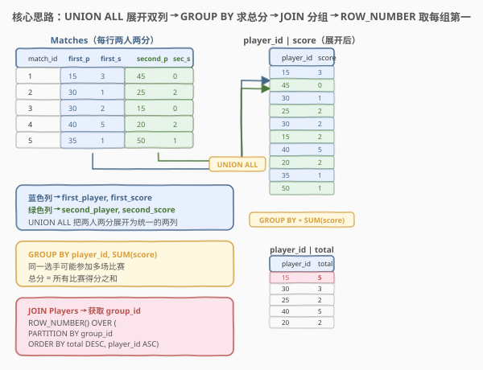
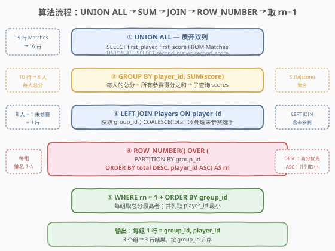
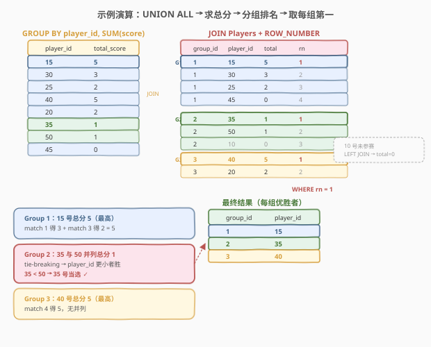

# 锦标赛优胜者

- **题目名称**：锦标赛优胜者
- **链接**：[1194. 锦标赛优胜者](https://leetcode.cn/problems/tournament-winners/)
- **难度**：困难
- **标签**：SQL、窗口函数、ROW_NUMBER、UNION ALL、GROUP BY、子查询、JOIN、分组求最值、tie-breaking

## 1. 题目概述

给定 `Players` 表和 `Matches` 表。`Players` 记录每名选手及其所属组别；`Matches` 记录每场比赛的**两名**参赛选手及各自得分。编写 SQL 查询，找出**每个组中总得分最高的选手**。如果同组内有多名选手总分并列最高，则取 `player_id` 最小的那位。结果返回 `group_id` 和 `player_id`，按 `group_id` 升序排列。

**表结构**：

```text
Table: Players
+-------------+---------+
| Column Name | Type    |
+-------------+---------+
| player_id   | int     |  ← 主键
| group_id    | int     |
+-------------+---------+

Table: Matches
+--------------+---------+
| Column Name  | Type    |
+--------------+---------+
| match_id     | int     |  ← 主键
| first_player | int     |
| second_player| int     |
| first_score  | int     |
| second_score | int     |
+--------------+---------+
```

> 💡 **关键约束**：`Matches` 表每行存储**一场比赛的两名选手**——`first_player` 得 `first_score` 分，`second_player` 得 `second_score` 分。一名选手可能参加多场比赛（分布在不同的行中，且可能在 `first_player` 或 `second_player` 列出现）。选手的**总分**需跨所有比赛累加。此外，`Players` 表中的选手**未必参加任何比赛**（总分为 0），需用 `LEFT JOIN` 保留。

**示例 1**：

```text
输入：
Players 表:
+-----------+----------+
| player_id | group_id |
+-----------+----------+
| 10        | 2        |
| 15        | 1        |
| 20        | 3        |
| 25        | 1        |
| 30        | 1        |
| 35        | 2        |
| 40        | 3        |
| 45        | 1        |
| 50        | 2        |
+-----------+----------+

Matches 表:
+----------+--------------+---------------+-------------+--------------+
| match_id | first_player | second_player | first_score | second_score |
+----------+--------------+---------------+-------------+--------------+
| 1        | 15           | 45            | 3           | 0            |
| 2        | 30           | 25            | 1           | 2            |
| 3        | 30           | 15            | 2           | 0            |
| 4        | 40           | 20            | 5           | 2            |
| 5        | 35           | 50            | 1           | 1            |
+----------+--------------+---------------+-------------+--------------+

输出：
+----------+-----------+
| group_id | player_id |
+----------+-----------+
| 1        | 15        |
| 2        | 35        |
| 3        | 40        |
+----------+-----------+
```

**解释**：

- 选手 15：match 1 得 3 + match 3 得 2 = **总分 5**
- 选手 30：match 2 得 1 + match 3 得 2 = 总分 3
- 选手 25：match 2 得 2 = 总分 2
- 选手 45：match 1 得 0 = 总分 0
- 选手 40：match 4 得 5 = **总分 5**
- 选手 20：match 4 得 2 = 总分 2
- 选手 35：match 5 得 1 = **总分 1**
- 选手 50：match 5 得 1 = 总分 1
- 选手 10：未参赛 = 总分 0

各组优胜者：

| 组 | 选手总分 | 优胜者 | 说明 |
|----|---------|--------|------|
| Group 1 | 15→5, 30→3, 25→2, 45→0 | **15** | 总分 5 最高，无并列 |
| Group 2 | 35→1, 50→1, 10→0 | **35** | 35 与 50 并列 1 分，取 `player_id` 更小的 35 |
| Group 3 | 40→5, 20→2 | **40** | 总分 5 最高，无并列 |

> ⚠️ **两大难点**：① `Matches` 每行存两人两分，需用 `UNION ALL` 把两列展开为统一的 `(player_id, score)` 行再聚合；② 同组并列时取 `player_id` 最小，需用 `ROW_NUMBER + ORDER BY total DESC, player_id ASC` 做 tie-breaking（与 [1112. 每位学生的最高成绩](../1101-1200/1112_每位学生的最高成绩.md) 同源）。

---

## 2. 解题思路

### 2.1 暴力思路：逐场比赛累加

最直觉的过程式思路是：维护一个 `player_id → total_score` 的字典，遍历 `Matches` 每行，把 `first_player` 的 `first_score` 和 `second_player` 的 `second_score` 分别加到字典中；再按 `group_id` 分组，每组找总分最高的（并列取 `player_id` 最小）。

```text
for each match in Matches:
    total[first_player] += first_score
    total[second_player] += second_score
for each group in Players:
    winner = argmax(total[player], tie → min player_id)
    emit (group, winner)
```

但 SQL 是集合式语言，没有显式循环。上述「两列展开 → 聚合 → 分组取最值」的模式有两种 SQL 范式：

1. **UNION ALL + GROUP BY + 窗口函数**：把两列展开为一列，聚合后用 `ROW_NUMBER` 排名。
2. **UNION ALL + GROUP BY + 子查询 JOIN**：聚合后用 `GROUP BY + HAVING` 或 `IN` 子查询定位最高分。

> ⚠️ **关键转换**：`Matches` 的「宽表」结构（两人两分在同一行）是本题最大的障碍。`UNION ALL` 把 `first_player/first_score` 和 `second_player/second_score` 两组列**纵向拼接**成统一的 `(player_id, score)` 两列，之后就可以用标准的 `GROUP BY player_id` 聚合——这是解本题的「钥匙」。

### 2.2 核心观察：UNION ALL 展开双列 + ROW_NUMBER 分组排名



**问题本质**：本题分三步——

**第一步：展开（UNION ALL）**

$$\text{scores} = \begin{pmatrix} \text{first\_player} \\ \text{second\_player} \end{pmatrix} \text{UNION ALL} \begin{pmatrix} \text{first\_score} \\ \text{second\_score} \end{pmatrix} \Rightarrow \begin{pmatrix} \text{player\_id} \\ \text{score} \end{pmatrix}$$

`Matches` 每行的 `first_player, first_score` 和 `second_player, second_score` 是两个独立的 `(player_id, score)` 对。`UNION ALL` 把它们纵向堆叠成统一的两列表，$n$ 行 Matches → $2n$ 行 score 记录。

> 💡 **为什么用 `UNION ALL` 而非 `UNION`？** `UNION` 会去重——如果两名选手在同一场比赛中得分相同（如 match 5 中 35 和 50 都得 1 分），`UNION` 会误删一行，导致总分计算错误。`UNION ALL` 保留所有行，确保每名选手的每场比赛得分都被累加。

**第二步：聚合（GROUP BY + SUM）**

$$\text{total}(p) = \sum_{\text{match} \in \text{matches of } p} \text{score}$$

对展开后的 `(player_id, score)` 表按 `player_id` 分组求和，得到每名选手的总分。

**第三步：分组排名（LEFT JOIN + ROW_NUMBER）**

$$\text{rn}(p) = \text{ROW\_NUMBER}\Big(\text{PARTITION BY group\_id ORDER BY total DESC, player\_id ASC}\Big)$$

- `LEFT JOIN Players`：把选手的 `group_id` 关联进来。用 `LEFT JOIN` 而非 `INNER JOIN` 是为了保留未参赛选手（总分为 0），否则可能漏掉某个组的全部选手。
- `COALESCE(total, 0)`：未参赛选手在 `scores` 子查询中不存在，`LEFT JOIN` 后 `total` 为 `NULL`，用 `COALESCE` 补 0。
- `PARTITION BY group_id`：按组分窗，每组独立排名。
- `ORDER BY total DESC`：总分高的排前面。
- `ORDER BY player_id ASC`：**tie-breaker**——总分并列时，`player_id` 小的排前面。
- `ROW_NUMBER()`：强制唯一编号，`rn = 1` 严格只取每组一行。

> 💡 **为什么用 `ROW_NUMBER` 而非 `RANK`/`DENSE_RANK`？** 因为题目要求并列时**只取一行**（`player_id` 最小的）。`RANK` 和 `DENSE_RANK` 给并列者相同排名（都是 1），`WHERE rk = 1` 会把所有并列行都返回——这对 [184. 部门工资最高的员工](../0101-0200/184_部门工资最高的员工.md)（并列全返回）是对的，但对本题是错的。这与 [1112. 每位学生的最高成绩](../1101-1200/1112_每位学生的最高成绩.md) 的 tie-breaking 需求完全一致。

### 2.3 算法流程图



**逻辑执行步骤**：

| 步骤 | 子句 | 作用 |
|------|------|------|
| ① | `SELECT first_player, first_score FROM Matches UNION ALL SELECT second_player, second_score` | 展开双列为统一的 `(player_id, score)` 两列表 |
| ② | `GROUP BY player_id, SUM(score)` | 每名选手的总分 → 子查询 `scores` |
| ③ | `Players LEFT JOIN scores ON player_id` | 关联 `group_id`；`COALESCE(total, 0)` 处理未参赛选手 |
| ④ | `ROW_NUMBER() OVER (PARTITION BY group_id ORDER BY total DESC, player_id ASC)` | 每组内按总分降序、`player_id` 升序排名 |
| ⑤ | `WHERE rn = 1` | 每组取第 1 行（总分最高 + 并列取 `player_id` 最小） |
| ⑥ | `ORDER BY group_id` | 按 `group_id` 升序输出 |

> ⚠️ **`LEFT JOIN` 的必要性**：如果某组的所有选手都未参赛（`Matches` 中无记录），`INNER JOIN` 会让该组从结果中消失，导致输出行数少于组数。`LEFT JOIN` + `COALESCE(total, 0)` 确保所有选手都被保留——未参赛者总分为 0，若同组所有人都为 0，则 `player_id` 最小者当选。

### 2.4 示例演算

以示例数据为例，逐步观察 `UNION ALL → GROUP BY → JOIN + ROW_NUMBER` 的完整过程：



**第一步：UNION ALL 展开**

5 行 Matches → 10 行 `(player_id, score)`：

| player_id | score | 来源 |
|-----------|-------|------|
| 15 | 3 | match 1, first |
| 45 | 0 | match 1, second |
| 30 | 1 | match 2, first |
| 25 | 2 | match 2, second |
| 30 | 2 | match 3, first |
| 15 | 2 | match 3, second |
| 40 | 5 | match 4, first |
| 20 | 2 | match 4, second |
| 35 | 1 | match 5, first |
| 50 | 1 | match 5, second |

**第二步：GROUP BY + SUM**

10 行 → 8 名选手总分：

| player_id | total_score | 计算过程 |
|-----------|-------------|---------|
| 15 | **5** | 3 + 2 |
| 30 | 3 | 1 + 2 |
| 25 | 2 | 2 |
| 40 | **5** | 5 |
| 20 | 2 | 2 |
| 35 | **1** | 1 |
| 50 | 1 | 1 |
| 45 | 0 | 0 |

**第三步：LEFT JOIN Players + ROW_NUMBER**

9 名选手（含未参赛的 10 号，`COALESCE(NULL, 0) = 0`）按组排名：

| group_id | player_id | total | rn | 说明 |
|----------|-----------|-------|----|------|
| 1 | 15 | 5 | **1** | 总分 5 最高，rn = 1 ✓ |
| 1 | 30 | 3 | 2 | |
| 1 | 25 | 2 | 3 | |
| 1 | 45 | 0 | 4 | |
| 2 | 35 | 1 | **1** | 并列 1 分，35 < 50，rn = 1 ✓ |
| 2 | 50 | 1 | 2 | 并列 1 分，50 > 35，rn = 2 |
| 2 | 10 | 0 | 3 | 未参赛，COALESCE(NULL, 0) = 0 |
| 3 | 40 | 5 | **1** | 总分 5 最高，rn = 1 ✓ |
| 3 | 20 | 2 | 2 | |

> 💡 **注意 Group 2 的并列场景**：35 和 50 总分都是 1，`ORDER BY player_id ASC` 让 35 排在 50 前面获得 `rn = 1`。这正是 `ROW_NUMBER` 配合多键排序的威力——tie-breaking 被编码在 `ORDER BY` 的第二排序键里。10 号未参赛但通过 `LEFT JOIN` 保留，总分 0 排最后。

**最终输出**（`WHERE rn = 1`）：

| group_id | player_id |
|----------|-----------|
| 1 | 15 |
| 2 | 35 |
| 3 | 40 |

---

## 3. 参考代码

### SQL（解法 A：UNION ALL + 窗口函数 ROW_NUMBER，推荐）

```sql
SELECT group_id, player_id
FROM (
    SELECT p.group_id,
           p.player_id,
           ROW_NUMBER() OVER (
               PARTITION BY p.group_id
               ORDER BY COALESCE(s.total_score, 0) DESC, p.player_id ASC
           ) AS rn
    FROM Players p
    LEFT JOIN (
        SELECT player_id, SUM(score) AS total_score
        FROM (
            SELECT first_player AS player_id, first_score AS score
            FROM Matches
            UNION ALL
            SELECT second_player AS player_id, second_score AS score
            FROM Matches
        ) t
        GROUP BY player_id
    ) s ON p.player_id = s.player_id
) ranked
WHERE rn = 1
ORDER BY group_id;
```

> 💡 **写法要点**：
> - **最内层**：`UNION ALL` 把 `first_player/first_score` 和 `second_player/second_score` 纵向拼接为 `(player_id, score)` 两列表。注意列名用 `AS` 统一为 `player_id` 和 `score`。
> - **中间层**：`GROUP BY player_id, SUM(score)` 聚合出每人总分 → 子查询 `s`。
> - **外层**：`Players LEFT JOIN s` 关联 `group_id`，`COALESCE(s.total_score, 0)` 把未参赛选手的 `NULL` 补 0。
> - **窗口函数**：`PARTITION BY group_id` 按组分窗；`ORDER BY COALESCE(...) DESC` 总分高优先；`player_id ASC` 并列时取小——**多键排序一步实现 tie-breaking**。
> - `ROW_NUMBER()` 强制唯一编号，`WHERE rn = 1` 每组严格取一行。

### SQL（解法 B：UNION ALL + 子查询 JOIN，无窗口函数）

```sql
SELECT p.group_id, MIN(p.player_id) AS player_id
FROM Players p
JOIN (
    SELECT player_id, SUM(score) AS total_score
    FROM (
        SELECT first_player AS player_id, first_score AS score
        FROM Matches
        UNION ALL
        SELECT second_player AS player_id, second_score AS score
        FROM Matches
    ) t
    GROUP BY player_id
) s ON p.player_id = s.player_id
WHERE (p.group_id, s.total_score) IN (
    SELECT p2.group_id, MAX(s2.total_score)
    FROM Players p2
    JOIN (
        SELECT player_id, SUM(score) AS total_score
        FROM (
            SELECT first_player AS player_id, first_score AS score
            FROM Matches
            UNION ALL
            SELECT second_player AS player_id, second_score AS score
            FROM Matches
        ) t2
        GROUP BY player_id
    ) s2 ON p2.player_id = s2.player_id
    GROUP BY p2.group_id
)
GROUP BY p.group_id
ORDER BY p.group_id;
```

> 💡 **写法要点**：
> - 子查询 `s` 与解法 A 相同：`UNION ALL` + `GROUP BY + SUM` 求每人总分。
> - `WHERE (p.group_id, s.total_score) IN (...)` 用**元组 IN** 定位每组最高分所在行——子查询求每组 `MAX(total_score)`。
> - 外层再 `GROUP BY p.group_id` + `MIN(p.player_id)` 处理并列——**两层聚合**（先 `MAX` 求最高分，再 `MIN` 取 `player_id` 最小）。
> - ⚠️ 比解法 A 啰嗦：子查询重复了两次（`s` 和 `s2`），且 `IN` 子查询可能效率略低。但不需要窗口函数，兼容老版本数据库（MySQL 5.7 及以下）。
> - ⚠️ 本解法用 `INNER JOIN`，不保留未参赛选手。若需兼容「全组未参赛」的边界，需改 `LEFT JOIN` + `COALESCE`，代码会更复杂。

### Python（pandas）

```python
import pandas as pd

def tournament_winners(players: pd.DataFrame, matches: pd.DataFrame) -> pd.DataFrame:
    scores = pd.concat([
        matches[['first_player', 'first_score']].rename(
            columns={'first_player': 'player_id', 'first_score': 'score'}
        ),
        matches[['second_player', 'second_score']].rename(
            columns={'second_player': 'player_id', 'second_score': 'score'}
        )
    ])
    total = scores.groupby('player_id', as_index=False)['score'].sum()
    merged = players.merge(total, on='player_id', how='left')
    merged['score'] = merged['score'].fillna(0)
    merged = merged.sort_values(
        ['group_id', 'score', 'player_id'],
        ascending=[True, False, True]
    )
    result = merged.drop_duplicates('group_id', keep='first')
    return result[['group_id', 'player_id']].sort_values('group_id').reset_index(drop=True)
```

> 💡 **pandas 对照**：`pd.concat([...])` 对应 SQL 的 `UNION ALL`——把两组 `(player_id, score)` 纵向拼接。`groupby('player_id')['score'].sum()` 对应 `GROUP BY + SUM`。`merge(..., how='left')` + `fillna(0)` 对应 `LEFT JOIN + COALESCE`。`sort_values(['group_id', 'score', 'player_id'], ascending=[True, False, True])` 对应 `PARTITION BY group_id ORDER BY total DESC, player_id ASC`——先按组排序保证同组连续，再按总分降序、`player_id` 升序。`drop_duplicates('group_id', keep='first')` 取每组排序后的第一行，对应 `WHERE rn = 1`。

---

## 4. 复杂度分析

| 维度 | 复杂度 | 说明 |
|------|--------|------|
| **时间（窗口函数）** | $O(n \log n)$ | `UNION ALL` 展开 $O(n)$（$n$ = Matches 行数，展开后 $2n$ 行）；`GROUP BY + SUM` 排序 $O(n \log n)$；`LEFT JOIN` $O(m)$（$m$ = Players 行数）；`ROW_NUMBER` 窗内排序 $O(m \log m)$ |
| **时间（子查询 JOIN）** | $O(n \log n + m \log m)$ | 两次 `GROUP BY` 各 $O(n \log n)$；元组 `IN` 子查询需物化+匹配 $O(m \times k)$（$k$ = 组数），整体量级仍 $O(n \log n)$ |
| **空间** | $O(n + m)$ | `UNION ALL` 展开表 $O(n)$；聚合结果 $O(m)$；窗口函数排序缓冲 $O(m)$ |
| **结果行数** | $O(g)$ | $g$ = 不同 `group_id` 数（每组一行，$g \le m$） |

> ⚠️ SQL 复杂度取决于**执行计划与索引**：`Matches.match_id` 是主键（聚簇索引），`Players.player_id` 是主键。`UNION ALL` 需全表扫描 $O(n)$；`GROUP BY player_id` 排序 $O(n \log n)$；`LEFT JOIN ON player_id` 可利用 `Players` 主键索引 $O(\log m)$ 每行。窗口函数需窗内排序，整体 $O(m \log m)$。解法 B 的 `IN` 子查询可能退化为 $O(m \times g)$，组数少时可忽略。面试中说明「UNION ALL 展开 + GROUP BY 排序 $O(n \log n)$，窗口函数排名 $O(m \log m)$」即可。

---

## 5. 扩展：UNION ALL 的展开范式与边界处理

### 5.1 UNION ALL vs UNION：去重陷阱

| 操作 | 行为 | 适用场景 |
|------|------|---------|
| `UNION ALL` | 保留所有行（含重复） | **本题正确选择**——同场两人得分相同不可去重 |
| `UNION` | 去除完全相同的行 | 会误删 `(player_id, score)` 相同的行 |

> 💡 **去重陷阱示例**：match 5 中 35 号得 1 分、50 号得 1 分。展开后有两行 `(35, 1)` 和 `(50, 1)`——`player_id` 不同，`UNION` 不会去重。但如果某场比赛两人 `player_id` 相同且得分相同（理论上不该出现，但数据可能有脏值），`UNION` 会误删一行。使用 `UNION ALL` 是安全选择，语义清晰：**每行都是一条独立的得分记录**。

### 5.2 LEFT JOIN vs INNER JOIN：未参赛选手的边界

| JOIN 类型 | 行为 | 对本题的影响 |
|----------|------|------------|
| `LEFT JOIN` | 保留左表所有行，右表无匹配则填 `NULL` | ✓ 未参赛选手保留，`COALESCE(NULL, 0) = 0` |
| `INNER JOIN` | 只保留两表都有的行 | ✗ 未参赛选手被丢弃，可能漏组 |

> ⚠️ **边界场景**：假设 Group 4 的所有选手都未参赛。`INNER JOIN` 会让 Group 4 从结果中消失，输出只有 3 行（少了 Group 4），不符合「每组都应有一个优胜者」的语义。`LEFT JOIN` + `COALESCE` 确保即使全员 0 分，`player_id` 最小者也当选。虽然 LeetCode 测试用例未必覆盖此边界，但面试中应主动提及。

### 5.3 三层进阶：从 184 到 1112 再到 1194

| 题号 | 数据结构 | 展开需求 | 并列处理 | 核心范式 |
|------|---------|---------|---------|---------|
| [184. 部门工资最高的员工](../0101-0200/184_部门工资最高的员工.md) | 一人一行 | 无需展开 | **并列全返回** | `RANK` / `IN` 子查询 |
| [1112. 每位学生的最高成绩](../1101-1200/1112_每位学生的最高成绩.md) | 一人一行 | 无需展开 | **并列取一行** | `ROW_NUMBER` + 多键排序 |
| **1194. 锦标赛优胜者** | **两人一行** | **UNION ALL 展开** | **并列取一行** | `UNION ALL` + `ROW_NUMBER` |

> 💡 1194 在 1112 的基础上增加了「宽表展开」这一步——`Matches` 每行存两名选手，必须先用 `UNION ALL` 把两列纵向拼接成统一的 `(player_id, score)` 行，之后才能 `GROUP BY` 聚合。展开后的流程与 1112 完全一致：`ROW_NUMBER + ORDER BY total DESC, player_id ASC` 做 tie-breaking。理解「宽表 → 长表展开」这一步，所有「多实体共一行」的 SQL 聚合题都能迎刃而解。

---

## 6. 面试要点

1. **为什么用 `UNION ALL` 而非 `UNION`？**

   - `UNION` 会去除完全相同的行。如果两名选手在同一场比赛中得分相同（如 match 5 中 35 和 50 都得 1 分），虽然 `player_id` 不同不会被误删，但如果数据中存在 `player_id` 和 `score` 完全相同的两行（脏数据或特殊赛制），`UNION` 会丢失一条得分记录。`UNION ALL` 保留所有行，确保每名选手的每场比赛得分都被正确累加。**默认用 `UNION ALL`，需要去重时才用 `UNION`**。

2. **为什么需要 `LEFT JOIN` 而非 `INNER JOIN`？**

   - `Players` 表中的选手未必参加任何比赛。`INNER JOIN` 会丢弃未参赛选手，如果某组的所有选手都未参赛，该组会从结果中消失，导致输出行数少于组数。`LEFT JOIN` 保留所有选手，`COALESCE(total_score, 0)` 把未参赛者的 `NULL` 补 0。面试中应主动提及这一边界处理。

3. **`ORDER BY total DESC, player_id ASC` 的第二排序键有什么作用？**

   - 第一排序键 `total DESC` 让总分高的排前面；第二排序键 `player_id ASC` 是 **tie-breaker**——当总分相同时（并列最高），`player_id` 小的排前面，获得 `rn = 1`。这把「并列时取 `player_id` 最小」的需求直接编码在排序键里，无需额外子查询或 `MIN` 聚合。去掉第二排序键时，`ROW_NUMBER` 在并列时会**随机**选一行（数据库实现相关），结果不确定。

4. **为什么用 `ROW_NUMBER` 而非 `RANK`/`DENSE_RANK`？**

   - 题目要求并列时**只返回一行**（`player_id` 最小的）。`RANK` 和 `DENSE_RANK` 给并列者相同排名（都是 1），`WHERE rk = 1` 会返回所有并列行——这对 184（并列全返回）是对的，但对本题是错的。`ROW_NUMBER` 强制每行唯一编号（1, 2, 3...），`rn = 1` 严格只取一行，配合 `ORDER BY total DESC, player_id ASC` 自然实现 tie-breaking。

5. **解法 B 的元组 `IN` 子查询如何工作？**

   - `WHERE (p.group_id, s.total_score) IN (SELECT group_id, MAX(total_score) ... GROUP BY group_id)` 用**元组 IN** 同时匹配组号和最高分——只有当选手的 `(group_id, total_score)` 恰好等于该组的 `(group_id, max_total)` 时才保留。这比写两个 `WHERE` 条件更简洁，且语义明确：「该选手的总分等于其所在组的最高分」。外层再 `GROUP BY group_id` + `MIN(player_id)` 处理并列。

> 💡 **一句话总结**：1194 的核心就两步——① `UNION ALL` 把 Matches 的「两人一行」展开为「一人一行」；② `ROW_NUMBER() OVER (PARTITION BY group_id ORDER BY total DESC, player_id ASC)` 分组排名取第一。前者是**宽表转长表**的范式，后者是**分组取最值 + tie-breaking**的范式（与 1112 同源）。两步组合即完整解法。

---

## 7. 同类练习题

- [1112. 每位学生的最高成绩](https://leetcode.cn/problems/highest-grade-for-each-student/)：同族前置题——同样是「分组取最值 + 并列 tie-breaking」用 `ROW_NUMBER`，但数据是一人一行无需展开；理解 1112 后只需加一步 `UNION ALL` 即得 1194
- [184. 部门工资最高的员工](https://leetcode.cn/problems/department-highest-salary/)：同族对比题——分组取最高薪所在行，但**并列全返回**（用 `RANK`），与 1194 的**并列只取一行**（用 `ROW_NUMBER`）形成鲜明对照
- [534. 游戏玩法分析 III](https://leetcode.cn/problems/game-play-analysis-iii/)：同为 SQL Hard 题，涉及窗口函数 `SUM OVER` 的累计聚合，与 1194 的 `ROW_NUMBER OVER` 互补，巩固窗口函数范式
- [550. 游戏玩法分析 IV](https://leetcode.cn/problems/game-play-analysis-iv/)：SQL 中等题，涉及 `JOIN` + 条件聚合 + `AVG`，与 1194 共享「子查询聚合 + JOIN 关联」的骨架
- [608. 树节点](https://leetcode.cn/problems/tree-node/)：SQL 中等题，用 `LEFT JOIN` 判断节点类型（根/叶/内部），与 1194 的 `LEFT JOIN` 边界处理思想相通
