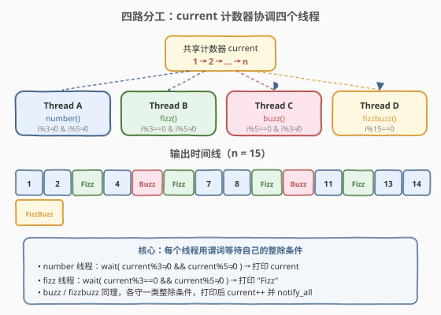
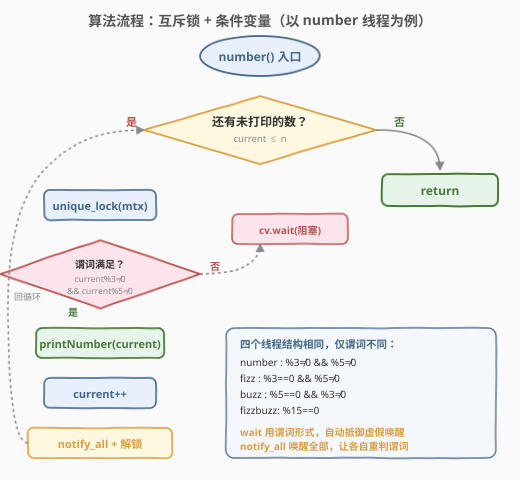
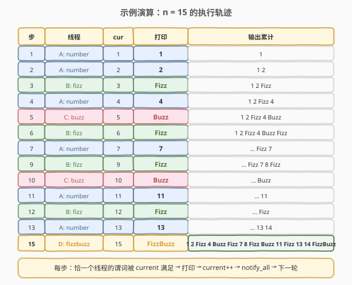

# LeetCode 交替打印字符串 题解

## 1. 题目概述

- **标题 / 题号**：交替打印字符串（#1195，medium）
- **链接**：https://leetcode.cn/problems/fizz-buzz-multithreaded/
- **难度**：中等
- **标签**：并发、多线程、互斥锁、条件变量

**题意**：给定一个整数 `n`，实现一个 `FizzBuzz` 类。同一个实例会被传入 **4 个不同线程**，各自被调用 `n` 次：

| 线程 | 方法 | 触发条件 | 输出 |
|------|------|----------|------|
| A | `fizz(printFizz)` | `i` 能被 3 整除但不能被 5 整除 | `"Fizz"` |
| B | `buzz(printBuzz)` | `i` 能被 5 整除但不能被 3 整除 | `"Buzz"` |
| C | `fizzbuzz(printFizzBuzz)` | `i` 能同时被 3 和 5 整除（即被 15 整除） | `"FizzBuzz"` |
| D | `number(printNumber)` | `i` 既不能被 3 也不能被 5 整除 | `i` 本身 |

四个线程并发执行，调度顺序不可预知。请修改类实现，保证从 `1` 到 `n` 的每个数字恰好被一个线程打印，输出顺序严格为 `1, 2, Fizz, 4, Buzz, Fizz, 7, 8, Fizz, Buzz, 11, Fizz, 13, 14, FizzBuzz, ...`。

**示例 1**：

```text
输入：n = 15
输出：1 2 Fizz 4 Buzz Fizz 7 8 Fizz Buzz 11 Fizz 13 14 FizzBuzz
解释：1→number, 2→number, 3→fizz, 4→number, 5→buzz, 6→fizz, ... 15→fizzbuzz
```

**示例 2**：

```text
输入：n = 5
输出：1 2 Fizz 4 Buzz
```

**约束**：

- `1 <= n <= 50`
- 四个线程各被调用恰好 `n` 次（但只有满足条件的调用才真正输出）
- `printFizz` / `printBuzz` / `printFizzBuzz` / `printNumber` 均无返回值，调用即输出

> ⚠️ **关键约束**：虽然每个线程都被调用 `n` 次，但**并非每次调用都该打印**。例如 `n=15` 时 `fizzbuzz` 线程被调用 15 次，但只在 `i=15` 那次才该输出 `"FizzBuzz"`，其余 14 次必须**跳过**。核心挑战是在并发环境下保证每个 `i` 恰好被一个线程处理，不重不漏、不乱序。

## 2. 解题思路

### 2.1 暴力思路

不加同步，让四个线程各自循环 `n` 次，每次调用前自行判断当前数字是否归自己。问题：四个线程共享一个"当前数字"概念却无共享变量——如果各自维护独立的计数器，必然产生重复或遗漏；如果共享一个计数器却不加锁，数据竞争导致 UB。

必须引入**同步原语**：用一个共享计数器 `current`（从 1 递增到 `n`），配合互斥锁和条件变量，让每个线程在"当前数字不属于自己"时阻塞等待，属于自己时才打印并推进。

### 2.2 核心观察：共享计数器 + 谓词等待



把 FizzBuzz 抽象为**四路分发器**：

- 维护一个共享变量 `current`（初值 1），表示"下一个要处理的数字"。
- 每个线程的**谓词**（predicate）就是该数字的整除规则：

| 线程 | 谓词（等待条件） |
|------|------------------|
| `number` | `current % 3 != 0 && current % 5 != 0` |
| `fizz` | `current % 3 == 0 && current % 5 != 0` |
| `buzz` | `current % 5 == 0 && current % 3 != 0` |
| `fizzbuzz` | `current % 15 == 0` |

- 任一时刻，四个谓词**有且仅有一个**为真（因为整除规则互斥且覆盖全体正整数），所以恰好一个线程能通过 `wait` 进入打印，其余三个阻塞。
- 打印后 `current++`，`notify_all` 唤醒所有等待者，它们各自重新检查谓词——新的 `current` 会让另一个线程的谓词为真。

> 💡 **本质**：这是 1116「打印零与奇偶数」三态状态机的**四态泛化**。1116 用一个 `turn` 变量做显式令牌交接；本题更优雅的做法是**让 `current` 本身充当令牌**——谁满足整除条件谁就干活，无需显式设置 `turn`，整除规则天然互斥。

### 2.3 算法流程图



四个线程的流程**结构完全相同**，唯一区别是 `wait` 的谓词和打印动作：

1. 加锁 `unique_lock(mtx)`。
2. 调用 `cv.wait(lock, pred)` —— 若谓词不满足则**释放锁并阻塞**，被 `notify_all` 唤醒后自动重新检查谓词，直到满足才继续（抵御虚假唤醒）。
3. 检查 `current > n` 则直接返回（所有数已处理完，防止多余的线程调用导致越界打印）。
4. 执行对应的打印动作（`printFizz()` / `printBuzz()` / `printFizzBuzz()` / `printNumber(current)`）。
5. `current++`。
6. `cv.notify_all()` 唤醒其余三个等待者。
7. 回到第 1 步，处理下一个数。

> 💡 **为什么用 `notify_all` 而非 `notify_one`？** 四个线程在同一个条件变量上等待，`current` 变化后我们**不知道下一个该谁打印**（取决于新 `current` 的整除性）。`notify_one` 可能唤醒错误的线程（谓词不满足→白白唤醒又阻塞），`notify_all` 让全部线程各自重判谓词，逻辑最稳妥。

### 2.4 示例演算

以 `n = 15` 为例，追踪 `current` 的推进与输出累积：



| 步 | 线程 | current | 打印 | 输出累计 |
|----|------|---------|------|----------|
| 1 | A: number | 1 | 1 | 1 |
| 2 | A: number | 2 | 2 | 1 2 |
| 3 | B: fizz | 3 | Fizz | 1 2 Fizz |
| 4 | A: number | 4 | 4 | 1 2 Fizz 4 |
| 5 | C: buzz | 5 | Buzz | 1 2 Fizz 4 Buzz |
| 6 | B: fizz | 6 | Fizz | ...Fizz |
| 7 | A: number | 7 | 7 | ...7 |
| 8 | A: number | 8 | 8 | ...8 |
| 9 | B: fizz | 9 | Fizz | ...Fizz |
| 10 | C: buzz | 10 | Buzz | ...Buzz |
| 11 | A: number | 11 | 11 | ...11 |
| 12 | B: fizz | 12 | Fizz | ...Fizz |
| 13 | A: number | 13 | 13 | ...13 |
| 14 | A: number | 14 | 14 | ...14 |
| 15 | D: fizzbuzz | 15 | FizzBuzz | ...FizzBuzz |

> 💡 注意步骤 15：`current=15` 时 `15%15==0`，只有 `fizzbuzz` 线程的谓词为真。`fizz` 和 `buzz` 线程虽然也在等待，但它们的谓词分别要求 `%5≠0` 和 `%3≠0`，对 15 来说不满足，所以被正确排除。

## 3. 参考代码

### C++

```cpp
#include <functional>
#include <mutex>
#include <condition_variable>

class FizzBuzz {
  private:
    int n;
    int current = 1;
    std::mutex mtx;
    std::condition_variable cv;

  public:
    FizzBuzz(int n) : n(n) {}

    void fizz(std::function<void()> printFizz) {
        std::unique_lock<std::mutex> lk(mtx);
        while (true) {
            cv.wait(lk, [&] { return current > n || (current % 3 == 0 && current % 5 != 0); });
            if (current > n) return;
            printFizz();
            ++current;
            cv.notify_all();
        }
    }

    void buzz(std::function<void()> printBuzz) {
        std::unique_lock<std::mutex> lk(mtx);
        while (true) {
            cv.wait(lk, [&] { return current > n || (current % 5 == 0 && current % 3 != 0); });
            if (current > n) return;
            printBuzz();
            ++current;
            cv.notify_all();
        }
    }

    void fizzbuzz(std::function<void()> printFizzBuzz) {
        std::unique_lock<std::mutex> lk(mtx);
        while (true) {
            cv.wait(lk, [&] { return current > n || current % 15 == 0; });
            if (current > n) return;
            printFizzBuzz();
            ++current;
            cv.notify_all();
        }
    }

    void number(std::function<void(int)> printNumber) {
        std::unique_lock<std::mutex> lk(mtx);
        while (true) {
            cv.wait(lk, [&] { return current > n || (current % 3 != 0 && current % 5 != 0); });
            if (current > n) return;
            printNumber(current);
            ++current;
            cv.notify_all();
        }
    }
};
```

### Python

```python
from threading import Condition


class FizzBuzz:
    def __init__(self, n: int):
        self.n = n
        self.current = 1
        self.cond = Condition()

    def fizz(self, printFizz):
        with self.cond:
            while True:
                self.cond.wait_for(
                    lambda: self.current > self.n
                    or (self.current % 3 == 0 and self.current % 5 != 0)
                )
                if self.current > self.n:
                    return
                printFizz()
                self.current += 1
                self.cond.notify_all()

    def buzz(self, printBuzz):
        with self.cond:
            while True:
                self.cond.wait_for(
                    lambda: self.current > self.n
                    or (self.current % 5 == 0 and self.current % 3 != 0)
                )
                if self.current > self.n:
                    return
                printBuzz()
                self.current += 1
                self.cond.notify_all()

    def fizzbuzz(self, printFizzBuzz):
        with self.cond:
            while True:
                self.cond.wait_for(
                    lambda: self.current > self.n or self.current % 15 == 0
                )
                if self.current > self.n:
                    return
                printFizzBuzz()
                self.current += 1
                self.cond.notify_all()

    def number(self, printNumber):
        with self.cond:
            while True:
                self.cond.wait_for(
                    lambda: self.current > self.n
                    or (self.current % 3 != 0 and self.current % 5 != 0)
                )
                if self.current > self.n:
                    return
                printNumber(self.current)
                self.current += 1
                self.cond.notify_all()
```

> 💡 **代码要点**：
> - 谓词中包含 `current > n` 的短路条件：当所有 `n` 个数处理完后，`notify_all` 会让四个线程都被唤醒且谓词为真（因 `current > n`），各自检查后直接 `return` 退出，避免多余的打印。
> - C++ 中 `unique_lock` 在整个函数生命周期内持有，`cv.wait` 在阻塞期间自动释放锁、被唤醒后重新获取，不影响其他线程进入临界区。
> - Python 的 `with self.cond` 等价于获取锁，`wait_for` 内部同样在阻塞时释放锁。

## 4. 复杂度分析

| 维度 | 复杂度 | 说明 |
|------|--------|------|
| 时间复杂度 | $O(n)$ | 共处理 $n$ 个数，每个数一次打印 + 一次 `current++` + 一次 `notify_all`，均摊 $O(1)$ |
| 空间复杂度 | $O(1)$ | 仅常数个共享变量（`current`、`n`）与一个互斥锁/条件变量 |
| 上下文切换 | $O(n)$ | 每次推进 `current` 引发一次 `notify_all`，最坏情况唤醒 3 个不该干活的线程再阻塞，约 $3n$ 次无效调度 |

> ⚠️ `notify_all` 每次唤醒全部 4 个线程，其中 3 个会发现谓词不满足重新阻塞，存在"惊群"开销。$n \leq 50$ 时影响可忽略；若 $n$ 很大，可改用 4 个独立条件变量做精准唤醒（见第 5 节扩展）。

## 5. 扩展：其他同步方案

### 5.1 四个独立条件变量（精准唤醒）

为每个线程配一个专属条件变量，每次 `current` 推进后只 `notify_one` 目标线程对应的那一个。消除惊群，但需先算出下一个数归谁管。

```cpp
class FizzBuzz {
    int n, current = 1;
    std::mutex mtx;
    std::condition_variable cv_fizz, cv_buzz, cv_fb, cv_num;

    void notify_next() {
        if (current > n) {
            cv_fizz.notify_one(); cv_buzz.notify_one();
            cv_fb.notify_one();   cv_num.notify_one();
        } else if (current % 15 == 0)      cv_fb.notify_one();
        else if (current % 3 == 0)         cv_fizz.notify_one();
        else if (current % 5 == 0)         cv_buzz.notify_one();
        else                               cv_num.notify_one();
    }
    // 每个线程在自己的 cv 上 wait，打印后 current++ 并调用 notify_next()
};
```

> 💡 优点：每次只唤醒 1 个线程，无惊群；缺点：需维护 4 个 `cv` 对象，且 `notify_next` 的分发逻辑多一层 `if-else`。功能等价，是性能优化版。

### 5.2 信号量方案

用 4 个信号量（初始全为 0），由一个"调度器"逻辑在每次推进后 `release` 对应线程的信号量。但由于本题没有独立的调度线程，信号量方案需要在线程间互相 `release`，逻辑与条件变量方案类似，不如条件变量 + 谓词直观。

### 5.3 原子自旋方案

用 `std::atomic<int> current` 配合 `while` 自旋检查整除条件。无锁、极简，但忙等浪费 CPU 且 `n=50` 时浪费尚可控但不优雅，仅作对比参考。

## 6. 面试要点

1. **为什么谓词中要加 `current > n` 的短路条件？**
   - 题目保证每个线程被调用恰好 `n` 次，但四个线程的循环次数之和为 $4n$，而实际只需 $n$ 次打印。处理完 `n` 个数后，多余的线程调用必须**优雅退出**而非卡死在 `wait` 上。`current > n` 让谓词在结束后恒为真，所有线程被唤醒后直接 `return`。

2. **为什么四个谓词能保证互斥？**
   - 对任意正整数 `i`：`i%15==0` ⟹ `i%3==0 && i%5==0`；排除此情况后，`i%3==0` 则 `i%5≠0`，`i%5==0` 则 `i%3≠0`；两者都排除后，`i%3≠0 && i%5≠0`。四种情况**不重不漏**地覆盖全体正整数，所以任一 `current` 值恰好让一个谓词为真。

3. **`notify_all` 还是 `notify_one`？**
   - 单条件变量方案用 `notify_all`：我们不知道下一个 `current` 归谁管，唤醒全部让各自重判最安全。若用 4 个独立条件变量，则可以精准 `notify_one` 目标线程，消除惊群。

4. **与 1116（打印零与奇偶数）的异同？**
   - 1116 用显式 `turn` 变量做三态令牌交接（`turn=0/1/2`），由 `zero` 线程决定下一步交给谁。本题**不需要显式 `turn`**——`current` 的整除性天然决定了谁该干活，谓词本身就是"令牌"。这是从"显式状态机"到"隐式谓词分发"的设计升级。

5. **如果规则从 3 和 5 扩展到更多素数（如加上 7→Jazz）怎么办？**
   - 谓词方案只需新增一个线程和对应的整除谓词（`current%7==0 && current%3≠0 && current%5≠0`），其余代码不变。而若用 `turn` 状态机，状态数会随素数个数指数膨胀，维护困难。这正是 412 题"独立判定 + 拼接"思想在并发场景的延伸。

## 同类练习题

| # | 题目 | 与本题的关联 |
|---|------|-------------|
| 1114 | [按序打印](https://leetcode.cn/problems/print-in-order/) | 三线程按 first→second→third 顺序执行，并发同步入门，本题的前置基础 |
| 1115 | [交替打印 FooBar](https://leetcode.cn/problems/print-foobar-alternately/) | 两线程乒乓交替，条件变量 + turn 标志的最简形态，本题的二线程退化版 |
| 1116 | [打印零与奇偶数](https://leetcode.cn/problems/print-zero-even-odd/) | 三线程 + 显式 turn 状态机，对比本题用整除谓词替代 turn 的设计差异 |
| 1117 | [H2O 生成](https://leetcode.cn/problems/building-h2o/) | 两线程按 2:1 配比产出，信号量配额控制，另一种多线程协调范式 |
| 412 | [Fizz Buzz](https://leetcode.cn/problems/fizz-buzz/) | 本题的单线程版，理解整除规则与"独立判定 + 拼接"思想，并发版的逻辑基础 |
