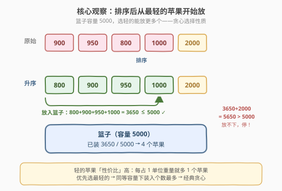
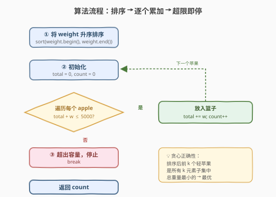
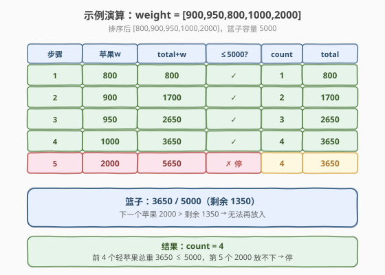

# 最多可以买到的苹果数量

- **题目名称**：最多可以买到的苹果数量
- **链接**：[1196. 最多可以买到的苹果数量](https://leetcode.cn/problems/how-many-apples-can-you-put-into-the-basket/)
- **难度**：简单
- **标签**：贪心、数组、排序

## 1. 题目概述

你有一篮苹果和一个**承重上限为 5000** 的篮子。给定整数数组 `weight`，其中 `weight[i]` 是第 `i` 个苹果的重量。目标是**最大化能放入篮子的苹果数量**——总重量不超过 5000。

**示例 1**：

```text
输入：weight = [100,200,150,1000]
输出：4
解释：4 个苹果总重 100+200+150+1000 = 1450 ≤ 5000，全部可以放入。
```

**示例 2**：

```text
输入：weight = [900,950,800,1000,2000]
输出：4
解释：选最轻的 4 个：800+900+950+1000 = 3650 ≤ 5000；
      再加 2000 → 5650 > 5000，放不下。最多 4 个。
```

**约束条件**：

- $1 \leq \text{weight.length} \leq 10^3$
- $1 \leq \text{weight[i]} \leq 10^4$

> 💡 本题是**排序 + 贪心**的经典入门题：每个苹果的「性价比」就是「每占 1 单位重量贡献 1 个苹果」，因此**越轻的苹果性价比越高**。把苹果按重量升序排序后，从最轻的依次放入，直到放不下为止——这就是贪心选择。

---

## 2. 解题思路

### 2.1 暴力思路

枚举所有苹果子集，检查子集总重是否 $\leq 5000$，取满足条件的最大子集大小。这是 $O(2^n)$ 的组合枚举，$n$ 可达 $10^3$，完全不可行。

> ❌ 暴力说明需要利用**贪心选择性质**——是否存在「先放谁一定不亏」的策略？答案是：**先放最轻的**。

### 2.2 核心观察：贪心——排序后从最轻的开始放



**关键直觉**：目标是**最大化苹果个数**而非最小化重量。每个苹果无论轻重都只贡献「1 个」计数，但占用的重量不同。因此：

- **轻苹果**占用重量少，同容量下能放更多个——优先选轻的；
- **重苹果**占用重量多，同样的容量放它一个不如放两个轻的——留到最后。

把 `weight` **升序排序**后，从左到右依次累加，只要 `total + w ≤ 5000` 就放入并计数；一旦超限就 `break`——因为后面的苹果只会更重，必然也超限。

> ⚠️ **为什么排序后从轻到重贪心是正确的？** 交换论证：设贪心选了前 $k$ 个最轻的苹果（总重 $W_k \leq 5000$），而最优解 `OPT` 选了 $k$ 个苹果但不是最轻的 $k$ 个。设 `OPT` 中有一个苹果 $a$ 不在前 $k$ 轻中，而前 $k$ 轻中有一个 $b$ 没被 `OPT` 选中。由于排序，$w_b \leq w_a$。把 `OPT` 中的 $a$ 换成 $b$，总重不增（$w_b \leq w_a$），仍 $\leq 5000$，个数不变。反复交换直到 `OPT` 的苹果集合等于前 $k$ 轻的集合，说明贪心解不劣于 `OPT`。

> 💡 **本质**：这是经典的「**0-1 背包求最大件数**」问题，但所有物品价值相同（每个苹果价值 = 1）。当所有物品价值相同时，贪心（按重量从小到大取）等价于最优解——因为「单位重量的价值」对轻苹果更高，排序后贪心天然最优。这正是 [322. 零钱兑换](https://leetcode.cn/problems/coin-change/) 等一般背包问题在「价值统一」退化后的简化版。

### 2.3 算法流程图



**完整步骤**：

1. **排序**：`weight` 升序排序。
2. **初始化**：`total = 0`（已装重量），`count = 0`（苹果个数）。
3. **遍历**每个苹果 `w`：
   - `total + w ≤ 5000`：放入，`total += w`，`count++`；
   - 否则：`break`（后面的更重，必然超限）。
4. **返回** `count`。

### 2.4 示例演算

以 `weight = [900,950,800,1000,2000]` 为例：



| 步骤 | 苹果 `w` | `total + w` | $\leq 5000$? | 动作 | `count` | `total` |
|------|---------|------------|--------------|------|---------|---------|
| 1 | 800 | 800 | ✓ | 放入 | 1 | 800 |
| 2 | 900 | 1700 | ✓ | 放入 | 2 | 1700 |
| 3 | 950 | 2650 | ✓ | 放入 | 3 | 2650 |
| 4 | 1000 | 3650 | ✓ | 放入 | 4 | 3650 |
| 5 | 2000 | 5650 | ✗ | 超限，停止 | 4 | 3650 |

最终 `count = 4` ✓。前 4 个轻苹果总重 3650，第 5 个 2000 放不下，停止。

---

## 3. 参考代码

### C++

```cpp
class Solution {
public:
    int maxNumberOfApples(vector<int>& weight) {
        sort(weight.begin(), weight.end());
        int total = 0, count = 0;
        for (int w : weight) {
            if (total + w > 5000) break;
            total += w;
            ++count;
        }
        return count;
    }
};
```

### Python

```python
class Solution:
    def maxNumberOfApples(self, weight: List[int]) -> int:
        weight.sort()
        total = 0
        count = 0
        for w in weight:
            if total + w > 5000:
                break
            total += w
            count += 1
        return count
```

> 💡 **实现细节**：① 容量上限 `5000` 是题目固定常量，无需作为参数传入。② 遍历时一旦 `total + w > 5000` 立即 `break`——因为数组已排序，后面的苹果只会更重，不可能放得下，提前退出避免无意义遍历。③ `weight[i] ≤ 10^4` 且 `n ≤ 10^3`，`total` 最大 $10^7$，C++ `int` 完全容纳，无溢出风险。

---

## 4. 复杂度分析

| 维度 | 复杂度 | 说明 |
|------|--------|------|
| 时间复杂度 | $O(n \log n)$ | 排序主导；遍历部分最坏 $O(n)$，但通常提前 `break` |
| 空间复杂度 | $O(\log n)$ | 原地排序的递归栈；额外仅常数变量 |

> 💡 $n \leq 10^3$ 时排序约 $10^3 \log$ 量级，远低于时限。这是该题的最优解——排序下界 $O(n \log n)$ 已无法突破。

---

## 5. 扩展：贪心与背包的关系

本题可视为**0-1 背包的退化情形**：

| 问题 | 物品价值 | 求解方法 | 复杂度 |
|------|---------|---------|--------|
| **一般 0-1 背包**（[416. 分割等和子集](https://leetcode.cn/problems/partition-equal-subset-sum/)） | 各物品价值不同 | DP $O(n \cdot W)$ | 伪多项式 |
| **本题（价值统一 = 1）** | 所有物品价值相同 | 排序 + 贪心 $O(n \log n)$ | 多项式 |

当所有物品价值相同时，「单位重量的价值」对轻物品更高，排序后贪心取最轻的即可达到最优——这正是背包问题在「价值统一」约束下的高效特例。若把本题改为「每个苹果有不同的营养值，最大化总营养」，就必须回到 DP 解法了。

---

## 6. 面试要点

1. **为什么排序后从轻到重贪心是正确的？**

   > 交换论证：设贪心选了前 $k$ 个最轻的苹果。若最优解 `OPT` 选了 $k$ 个但不全是前 $k$ 轻，则 `OPT` 中存在一个不在前 $k$ 轻的苹果 $a$ 和一个在前 $k$ 轻但未被选的 $b$，且 $w_b \leq w_a$。把 $a$ 换成 $b$，总重不增仍 $\leq 5000$，个数不变。反复交换使 `OPT` 的集合趋于前 $k$ 轻，说明贪心不劣于 `OPT`。

2. **为什么遇到超限就可以直接 break，不用继续看后面的？**

   > 数组已升序排序，当前苹果放不下意味着 `total + w > 5000`，而后面的苹果只会更重（$w' \geq w$），所以 `total + w' > 5000` 也必然成立。提前 `break` 是排序带来的贪心剪枝。

3. **如果容量上限不是固定 5000 而是参数，算法需要改吗？**

   > 不需要，把 `5000` 换成参数 `capacity` 即可，逻辑完全相同。贪心的正确性与容量大小无关——排序后从轻到重取永远是「同等个数下总重最小」的选择。

4. **本题和 [455. 分发饼干](https://leetcode.cn/problems/assign-cookies/) 的贪心有何异同？**

   > 两者都是「排序 + 贪心」。455 是两个数组的**配对**贪心（双指针同步推进，小饼干喂小贪心孩子）；本题是**单数组**的选择贪心（排序后从最小开始累加，超限即停）。前者管「配对」，后者管「装填」，但核心直觉一致：**优先处理「最受限」的元素**。

5. **如果要求恰好装满 5000（不能低于），贪心还成立吗？**

   > 不成立。这是「子集和问题」（NP-hard），贪心无法保证恰好填满。需要用 DP（类似 [416. 分割等和子集](https://leetcode.cn/problems/partition-equal-subset-sum/)）来判断是否存在子集和恰好等于 5000。贪心只适用于「不超过上限、最大化个数」的松弛版本。

> 💡 **一句话总结**：1196 是「排序 + 贪心」的入门题——苹果按重量升序排序后从最轻的依次放入篮子，超限即停。$O(n \log n)$ 时间、$O(1)$ 额外空间。本质是「价值统一的 0-1 背包」退化情形，贪心天然最优。

---

## 7. 同类练习题

- [455. 分发饼干](https://leetcode.cn/problems/assign-cookies/)（[题解](../0401-0500/455_分发饼干.md)）：排序 + 双指针贪心入门题，小饼干喂小贪心孩子，与本题同为「排序 + 贪心」家族
- [881. 救生艇](https://leetcode.cn/problems/boats-to-save-people/)：排序 + 对撞双指针贪心，每船最多两人，最重配最轻，体会贪心配对方向
- [416. 分割等和子集](https://leetcode.cn/problems/partition-equal-subset-sum/)（[题解](../0401-0500/416_分割等和子集.md)）：0-1 背包 DP，与本题对照「价值统一可贪心」vs「价值不同需 DP」
- [860. 柠檬水找零](https://leetcode.cn/problems/lemonade-change/)：贪心入门题，用最少资源满足当前需求，与本题「优先选轻」的贪心直觉一致
- [1710. 卡车上的最大单元数](https://leetcode.cn/problems/maximum-units-on-a-truck/)：排序 + 贪心，按单位装箱数从高到低取，与本题「按重量从轻到重取」方向互补
